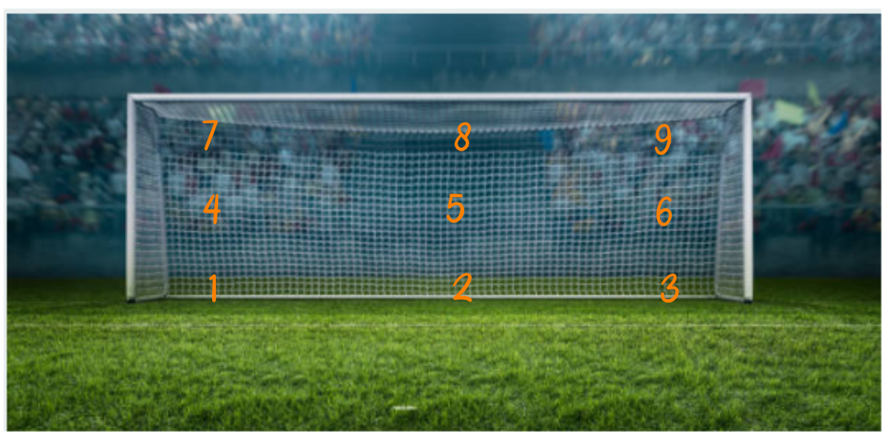

```{r setup, include=FALSE}
knitr::opts_chunk$set(echo = TRUE, message = FALSE, warning = FALSE, comment = NA)
```

<br/>

La probabilidad es un número comprendido entre cero y uno que se asigna a cada resultado de un evento aleatorio, utilizando diversos enfoques. A continuación, se presentan las definiciones de los enfoques más comunes:

- Clásico 
- Frecuentista
- Subjetivo


<br/><br/>
<h2>Enfoque clásico</h2>

El enfoque clásico o a priori es el más antiguo en la teoría de la probabilidad y se basa en el supuesto de que los eventos individuales son igualmente probables. Bajo este enfoque, la probabilidad de un evento $A$ se calcula como la fracción entre el número de elementos del conjunto $A$, denotado como $n(A)$, y el número total de elementos en el espacio muestral $n(S)$, de acuerdo con la siguiente fórmula:

\[
P(A) = \dfrac{n(A)}{n(S)}
\]

<br/>
<div class="caja-ejemplo">
<h3>Ejemplos:</h3>
<p> 
Considerando el evento $A_{1} = \{(c,c)\}$, su probabilidad se calcula de la siguiente manera:

\[
P(A_{1}) = \frac{n(A_{1})}{n(S_{1})} = \frac{1}{4} = 0.25
\]

En el caso del evento $A_{2}$, que corresponde a la suma de los resultados inferiores a 4, la probabilidad se obtiene como sigue:

\[
P(A_{2}) = \frac{n(A_{2})}{n(S_{2})} = \frac{3}{36} = 0.083
\]

<br/><br/>

En la mayoría de los casos, no se cumplen los supuestos del enfoque clásico (eventos equiprobables o con igual probabilidad), ya que existen elementos en el espacio muestral con probabilidades distintas. Esto dificulta la aplicación de dicho enfoque.
</p>
</div>


<br/><br/>
<h2>Enfoque frecuentista</h2>

El enfoque frecuentista se basa en la frecuencia relativa con que ocurre un evento $A$ y el tamaño de muestra $n$, permitiendo estimar la probabilidad con la frecuencia relativa del evento. Cuanto mayor sea el tamaño de la muestra, mayor será la proximidad de la frecuencia relativa $f_n(A)$ al valor de probabilidad $P(A)$.

\[
\lim_{n \to +\infty} f_n(A) = P(A)
\]


<br/>
<div class="caja-ejemplo">
<h3>Ejemplos:</h3>
<p> 

<center>
```{r, echo=FALSE, out.width="70%", fig.align = "center"}

```
**Figura 2.1** Zonas de un arco de futbol 
<br/>
<sub>
Tomada de iStock.com
</sub>
</center>


Consideremos el caso de un cobrador de "penalti" en un partido de fútbol. El jugador tiene un gran número de lugares donde puede colocar el balón, pero para simplificar, podemos asumir que hay 9 posibles ubicaciones, que se enumeran como sigue:

1. Parte baja a su izquierda  
2. Baja al centro  
3. Baja a su derecha  
4. Parte media a su izquierda  
5. Media al centro  
6. Parte media a la derecha  
7. Parte superior a su izquierda  
8. Parte superior al centro  
9. Parte superior a su derecha  

El arquero también considera estos 9 lugares para intentar evitar que el balón termine en gol. Ambos jugadores, el cobrador y el arquero, estudian las frecuencias con que cada área se convierte en gol o es defendida, para determinar las probabilidades de éxito desde su rol.

Para calcular la probabilidad de que un jugador ejecute un "penalti" y convierta un gol, utilizamos el enfoque frecuentista. Este enfoque se basa en la frecuencia relativa de aciertos, calculando la probabilidad de un evento en base al número de veces que ha ocurrido en el pasado.

En este caso, si se conocen los resultados de un gran número de cobros de penalti, podemos estimar la probabilidad de que un cobro específico sea exitoso. La probabilidad se calcula dividiendo el número de goles convertidos (aciertos) por el número total de cobros realizados. Esta estimación mejora a medida que se incrementa el tamaño de la muestra (el número de cobros realizados).

La probabilidad frecuentista de que el cobrador marque un gol en una determinada ubicación se puede expresar como:

\[
P(\text{gol en ubicación } A) = \lim_{n \to +\infty} \frac{\text{número de goles en ubicación } A}{n}
\]

Donde $n$ es el número total de intentos de penalti realizados por el cobrador, y el límite indica que, a medida que $n$ crece, la frecuencia relativa se aproxima a la probabilidad verdadera de éxito en esa ubicación.
</p>
</div>


<br/><br/>
<h2>Enfoque subjetivo</h2>

En este caso, la probabilidad es determinada y asignada por un experto. Esto significa que el valor de la probabilidad se establece según el juicio de una persona con experiencia y conocimiento en un campo específico, como puede ser un médico, un ingeniero, un abogado, un economista, un biólogo, un científico de datos, entre otros. El experto evalúa y estima la probabilidad basándose en su formación, experiencia previa y comprensión del contexto en el que se encuentra el evento en cuestión.
</div>

