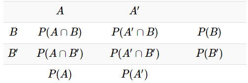
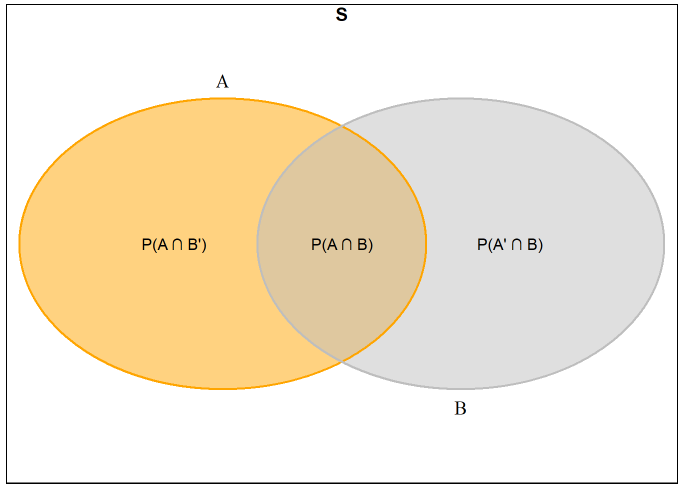
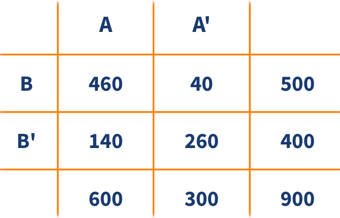
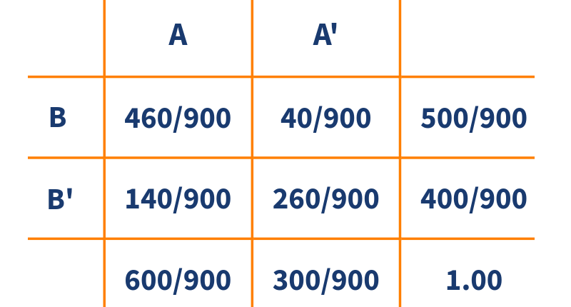

```{r setup, include=FALSE}
knitr::opts_chunk$set(echo = TRUE, message = FALSE, warning = FALSE, comment = NA)
```

<br/><br/>
<h2>Tipos de probabilidad</h2>

La probabilidad puede definirse tanto para **eventos simples** (como \( A \), \( B \), ...) como para **eventos compuestos** (como \( A \cup B \), \( A \cap B \), \( B|A \)), que involucran la combinación de varios eventos. Dependiendo del tipo de evento, la probabilidad puede tomar los siguientes nombres: probabilidad marginal, conjunta o condicional.


<br/><br/>
<h3>Tabla de contingencia de doble entrada</h3>

La **Tabla 2.1** presentada muestra la relación entre los eventos aleatorios \( A \) y \( B \) y sus complementos \( A' \) y \( B' \):

1. **Eventos de filas y columnas**

    - **Filas (Eventos relacionados con \( B \)):** 
    
      - \( B \): Ocurre el evento \( B \).  
      
      - \( B' \): No ocurre el evento \( B \).  
      
      - La intersección entre \( B \) y \( B' \) es el conjunto vacío: \( B \cap B' = \emptyset\) y la unión entre \( B \) y \(          B' \) es el espacio muestral: \( B \cup B' = S \).  Por lo tanto, \( P(B) + P(B') = 1 \). 
      
    - **Columnas (Eventos relacionados con \( A \)):**  
    
      - \( A \): Ocurre el evento \( A \).  
      
      - \( A' \): No ocurre el evento \( A \).  
      
      - La intersección entre \( A \) y \( A' \) es el conjunto vacío: \( A \cap A' = \emptyset\) y la unión entre \( A \) y \(          A' \) es el espacio muestral: \( A \cup A' = S \).  En consecuencia, \( P(A) + P(A') = 1 \). 
      

2. **Probabilidades marginales (Totales)**

    - Los **totales** representan las **probabilidades marginales**, es decir, la probabilidad de que ocurra uno de los eventos sin considerar el otro:
    
      - \( P(A) \) y \( P(A') \): Marginales de las columnas.  
      
      - \( P(B) \) y \( P(B') \): Marginales de las filas.  

3. **Probabilidades conjuntas (Celdas Internas)**

    - Las celdas internas muestran las **probabilidades conjuntas**:
    
      - \( P(A \cap B) \): Ambos eventos \( A \) y \( B \) ocurren.
      
      - \( P(A' \cap B) \): Ocurre \( B \) pero no \( A \).  
      
      - \( P(A \cap B') \): Ocurre \( A \) pero no \( B \). 
      
      - \( P(A' \cap B') \): Ninguno de los dos eventos ocurre.  

4. **Propiedades importantes**

    - **Suma de las probabilidades conjuntas:**  
    
      \( P(A \cap B) + P(A' \cap B) + P(A \cap B') + P(A' \cap B') = 1 \)
      
    - **Relación entre conjuntas y marginales:**  
    
      - \( P(A) = P(A \cap B) + P(A \cap B') \) 
      
      - \( P(B) = P(A \cap B) + P(A' \cap B) \) 


```{r echo=FALSE, results='asis'}
library(kableExtra)

# Definir la tabla corregida según la imagen
tabla <- matrix(
  c(
    "", "$A$", "$A'$", "",
    "$B$", "$P(A \\cap B)$", "$P(A' \\cap B)$", "$P(B)$",
    "$B'$", "$P(A \\cap B')$", "$P(A' \\cap B')$", "$P(B')$",
    "", "$P(A)$", "$P(A')$"
  ),
  nrow = 4, byrow = TRUE
)

# Crear tabla con kable y kableExtra
tabla<-kable(tabla, format = "html", escape = FALSE, align = "c") %>%
  kable_styling(full_width = FALSE, position = "center", bootstrap_options = c("striped", "hover")) %>%
  column_spec(1, bold = TRUE) %>%
  column_spec(2:4, width = "4cm")
```

<br/><br/>
<center>
**Tabla 2.1** Distribución de probabilidades
</center>
```{r, echo=FALSE, out.width="80%", fig.align = "center"}

```


```{r echo=FALSE, results='asis'}
# Instalar y cargar paquetes necesarios
# if (!require("VennDiagram")) install.packages("VennDiagram")
# library(VennDiagram)
# library(grid)

# Rectángulo  para el espacio muestral (S)
# grid.rect(x = 0.5, y = 0.5, width = 1.0, height = 1.0, gp = gpar(col = "black", lwd = 2))
# grid.text("S", x = 0.5, y = 0.98, gp = gpar(fontsize = 14, fontface = "bold"))
# 
# # Diagrama de Venn 
# venn.plot <- draw.pairwise.venn(
#   area1 = 50, area2 = 50, cross.area = 15,
#   category = c("A", "B"),
#   fill = c("orange", "gray"),
#   lty = "solid",
#   cat.pos = c(0, 180),
#   cat.cex = 1.2,
#   cex = 0,
#   col = c("orange", "gray"),
#   label.col = NA,
#   lwd = 2
# )

# Añadir expresiones de probabilidad manualmente
# grid.text("P(A ∩ B')", x = 0.25, y = 0.5, gp = gpar(fontsize = 12))
# grid.text("P(A ∩ B)", x = 0.5, y = 0.5, gp = gpar(fontsize = 12))
# grid.text("P(A' ∩ B)", x = 0.75, y = 0.5, gp = gpar(fontsize = 12))
```

---


<br/><br/>
<h3>Diagrama de Venn</h3>

La **Figura 2.2** representa el espacio muestral \( S \) junto con los eventos \( A \) y \( B \). Respecto a las partes del diagrama:


- **Espacio muestral \( S \):** Representado por el rectángulo que contiene todos los posibles resultados.

- **Evento \( A \):** Área amarilla (incluye la intersección con \( B \)).

- **Evento \( B \):** Área gris (incluye la intersección con \( A \)).

En este caso, **la intersección \( A \cap B \) no es vacía**, lo que significa que hay resultados en los que ambos eventos ocurren simultáneamente.


<center>
```{r, echo=FALSE, out.width="80%", fig.align = "center"}

```
**Figura 2.2** Diagrama de Venn.
</center>
</br>


En la figura se representa las probabilidades marginales:

-   \( P(A) \): probabilidad de que ocurra \( A \).

-   \( P(B) \): probabilidad de que ocurra \( B \).


Adicionalmente, las probabilidades conjuntas:


-   \( P(A \cap B) \): probabilidad de que ocurra \( A \) y \( B \).

-   \( P(A' \cap B) \): probabilidad de que no ocurra \( A \) y ocurra \( B \).

-   \( P(A \cap B') \): probabilidad de que ocurra \( A \) y no ocurra \( B \).


<br/><br/>
<h3>Probabilidad condicional</h3>

La probabilidad condicional de \( B|A \) se define como:

\[
P(B|A) = \frac{P(B \cap A)}{P(A)}, P(A) > 0
\]

Donde:

- \( A \cap B \) es la intersección de los eventos \(A\) y \(B\).

- \( P(A) \) es la probabilidad del evento \(A\).  

- \( P(B|A) \) es la probabilidad de  \(B\) dado el evento  \(A\).


La probabilidad condicional \(P(B|A)\) se lee como:

- Probabilidad de \(B\) dado el evento \(A\).  

- Probabilidad de que ocurra \(B\) sabiendo previamente que ocurrió el evento \(A\).  

- Si se sabe que ha ocurrido el evento \(A\), la probabilidad de que ocurra \(B\).  

El efecto de conocer la ocurrencia del evento \(A\) hace que el espacio
muestral de referencia pase de ser \(S\) a solo \(A\). Ahora, dentro de este
nuevo espacio muestral de referencia, se debe establecer la probabilidad
de que ocurra \(B\).


<br/><br/>
<div class="caja-ejemplo">
<h3>Ejemplo:</h3>
<p> 
Se realizó una encuesta a **900 personas** durante un evento tecnológico. El objetivo es conocer la relación entre el tipo de dispositivo preferido y la asistencia a una conferencia específica. La **Tabla 2.2**  resume la información de la encuesta, donde:

- **Evento A:** La persona prefiere **laptops**.  

- **Evento A' (A Complemento):** La persona prefiere **tabletas**.  

- **Evento B:** La persona asistió a la **conferencia principal sobre inteligencia artificial**.  

- **Evento B' (B Complemento):** La persona **no asistió** a la conferencia.  

<br/><br/>
<center>
**Tabla 2.2** Distribución frecuencias absolutas.
</center>
```{r, echo=FALSE, out.width="80%", fig.align = "center"}

```


<br/><br/>
A partir de los valores de **Tabla 2.2** se pueden calcular probabilidades marginales, tales como:

-   Probabilidad  de preferir laptop: \(P(A) =\dfrac{600}{900} = 0.6667\)

-   Probabilidad  de asistir a la conferencia: \(P(B) = \dfrac{500}{900} = 0.5556\)


La **Tabla 2.3**  resume la información en términos de probabilidades. Adicional a las probabilidades marginales, puede notarse resultados de probabilidades conjuntas como las siguientes:

-   Probabilidad  de preferir laptop y asistir a la conferencia: \(P(A \cap B) = \dfrac{460}{900} = 0.51111\)

-   Probabilidad de preferir tableta y asistir a la conferencia: \(P(A' \cap B) = \dfrac{40}{900} = 0.0444\)


<br/><br/>
<center>
**Tabla 2.3** Resultados en términos de probabilidades.
</center>
```{r, echo=FALSE, out.width="80%", fig.align = "center"}

```


<br/><br/>
La **Tabla 2.3** muestra las probabilidades marginales, mientras que un diagrama de árbol, como el presentado en la **Figura 2.3**, permite visualizar tanto las probabilidades marginales como las condicionales.  

Las primeras ramas del árbol corresponden a los eventos \( A \) y su complemento \( A' \), con probabilidades \( P(A) \) y \( P(A') \), respectivamente. Dado que \( A \) y \( A' \) son eventos complementarios, se cumple que:

\[
P(A) + P(A') = 1
\]

A partir de cada uno de estos eventos, se representan las probabilidades condicionales de \( B \) y su complemento \( B' \).  

Es importante destacar que **las probabilidades asociadas a eventos que surgen de un mismo vértice deben sumar 1**. Es decir, para cada evento \( A \) o \( A' \), se debe cumplir:  

\[
P(B|A) + P(B'|A) = 1
\]

\[
P(B|A') + P(B'|A') = 1
\]


<center>
```{r, echo=FALSE, out.width="80%", fig.align = "center"}
knitr::include_graphics("img/arbol1_22.png")
```
**Figura 2.3** Diagrama de árbol.
</center>

A continuación se calculan dos de las probabilidades condicionales posibles para este contexto:

\[
P(B|A) = \frac{P(A \cap B)}{P(A)} = \frac{460/900}{600/900} = 0.7667
\]

\[
P(B'|A') = \frac{P(A' \cap B')}{P(A')} = \frac{260/900}{300/900} = 0.8667
\]

Estas probabilidades indican que, entre quienes prefieren laptops, el **76.67%** asistió a la conferencia, mientras que entre quienes prefieren tabletas, el **86.67%** no asistió.


</p>
</div>


<br/><br/>
<h3>Regla de la multiplicación de eventos</h3>


La probabilidad de que ocurran simultáneamente los eventos \(A\) y \(B\) asociados a un experimento aleatorio se expresa mediante:

\[
P(A \cap B) = P(A) P(B|A) \quad \text{o} \quad P(A \cap B) = P(B) P(A|B)
\]


