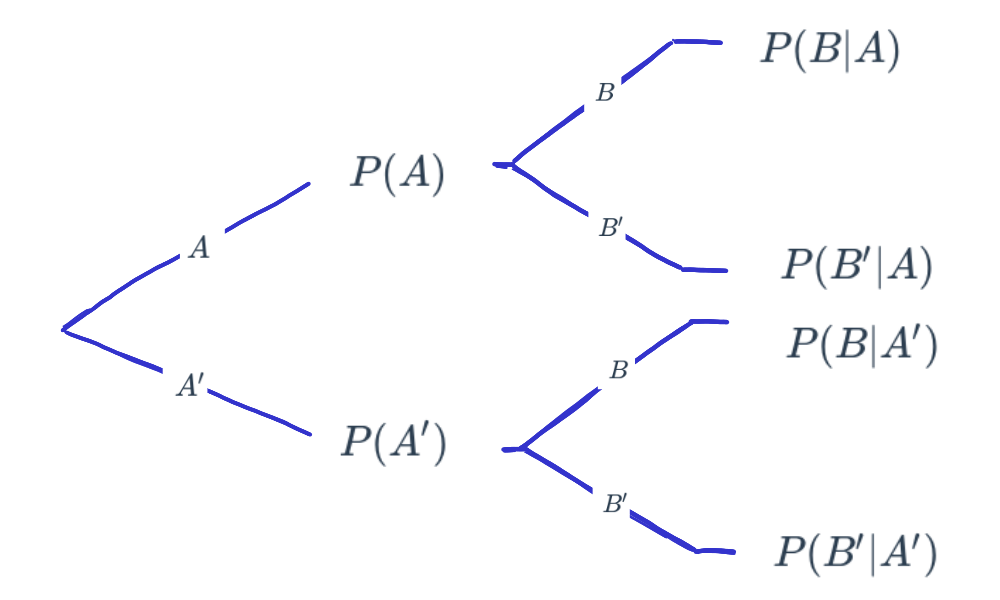

```{r setup, include=FALSE}
knitr::opts_chunk$set(echo = TRUE, message = FALSE, warning = FALSE, comment = NA)
```

<br/><br/>

La probabilidad puede definirse tanto para **eventos simples** (como \( A \), \( B \), ...) como para **eventos compuestos** (como \( A \cup B \), \( A \cap B \), \( B|A \)), que involucran la combinación de varios eventos. Dependiendo del tipo de evento, la probabilidad puede tomar los siguientes nombres:


```{r echo=FALSE, results='asis'}
library(kableExtra)

# Definir la tabla corregida según la imagen
tabla <- matrix(
  c(
    "", "$A$", "$A'$", "",
    "$B$", "$P(A \\cap B)$", "$P(A' \\cap B)$", "$P(B)$",
    "$B'$", "$P(A \\cap B')$", "$P(A' \\cap B')$", "$P(B')$",
    "", "$P(A)$", "$P(A')$"
  ),
  nrow = 4, byrow = TRUE
)

# Crear tabla con kable y kableExtra
tabla<-kable(tabla, format = "html", escape = FALSE, align = "c") %>%
  kable_styling(full_width = FALSE, position = "center", bootstrap_options = c("striped", "hover")) %>%
  column_spec(1, bold = TRUE) %>%
  column_spec(2:4, width = "4cm")
```

<br/><br/>
<center>
**Tabla 2.1** Distribución de probabilidades
</center>
```{r, echo=FALSE, out.width="80%", fig.align = "center"}
knitr::include_graphics("img/tabla1_22.png")
```

<br/><br/>
La **Tabla 2.1** presentada es una tabla de **probabilidades conjuntas**, mostrando la relación entre los eventos aleatorios \( A \) y \( B \) y sus complementos \( A' \) y \( B' \):

1. **Eventos de filas y columnas**
    - **Filas (Eventos relacionados con \( B \)):**  
      - \( B \): Ocurre el evento \( B \).  
      - \( B' \): No ocurre el evento \( B \).  
      - La intersección entre \( B \) y \( B' \) es el conjunto vacío: \( B \cap B' = \emptyset\) y la unión entre \( B \) y \(          B' \) es el espacio muestral: \( B \cup B' = S \).  Por lo tanto, \( P(B) + P(B') = 1 \). 
    - **Columnas (Eventos relacionados con \( A \)):**  
      - \( A \): Ocurre el evento \( A \).  
      - \( A' \): No ocurre el evento \( A \).  
      - La intersección entre \( A \) y \( A' \) es el conjunto vacío: \( A \cap A' = \emptyset\) y la unión entre \( A \) y \(          A' \) es el espacio muestral: \( A \cup A' = S \).  Por lo tanto, \( P(A) + P(A') = 1 \).  

2. **Probabilidades marginales (Totales)**
    - Los **totales** representan las **probabilidades marginales**, es decir, la probabilidad de que ocurra uno de los eventos sin considerar el otro:
      - \( P(A) \) y \( P(A') \): Marginales de las columnas.  
      - \( P(B) \) y \( P(B') \): Marginales de las filas.  

3. **Probabilidades conjuntas (Celdas Internas)**
    - Las celdas internas muestran las **probabilidades conjuntas**:
      - \( P(A \cap B) \): Ambos eventos \( A \) y \( B \) ocurren.  
      - \( P(A' \cap B) \): Ocurre \( B \) pero no \( A \).  
      - \( P(A \cap B') \): Ocurre \( A \) pero no \( B \).  
      - \( P(A' \cap B') \): Ninguno de los dos eventos ocurre.  

4. **Propiedades importantes**
    - **Suma de las probabilidades conjuntas:**  
      \( P(A \cap B) + P(A' \cap B) + P(A \cap B') + P(A' \cap B') = 1 \)  
    - **Relación entre conjuntas y marginales:**  
      - \( P(A) = P(A \cap B) + P(A \cap B') \)  
      - \( P(B) = P(A \cap B) + P(A' \cap B) \) 

<br/><br/>
```{r echo=FALSE, results='asis'}
# Instalar y cargar paquetes necesarios
# if (!require("VennDiagram")) install.packages("VennDiagram")
# library(VennDiagram)
# library(grid)

# Rectángulo  para el espacio muestral (S)
# grid.rect(x = 0.5, y = 0.5, width = 1.0, height = 1.0, gp = gpar(col = "black", lwd = 2))
# grid.text("S", x = 0.5, y = 0.98, gp = gpar(fontsize = 14, fontface = "bold"))
# 
# # Diagrama de Venn 
# venn.plot <- draw.pairwise.venn(
#   area1 = 50, area2 = 50, cross.area = 15,
#   category = c("A", "B"),
#   fill = c("orange", "gray"),
#   lty = "solid",
#   cat.pos = c(0, 180),
#   cat.cex = 1.2,
#   cex = 0,
#   col = c("orange", "gray"),
#   label.col = NA,
#   lwd = 2
# )

# Añadir expresiones de probabilidad manualmente
# grid.text("P(A ∩ B')", x = 0.25, y = 0.5, gp = gpar(fontsize = 12))
# grid.text("P(A ∩ B)", x = 0.5, y = 0.5, gp = gpar(fontsize = 12))
# grid.text("P(A' ∩ B)", x = 0.75, y = 0.5, gp = gpar(fontsize = 12))
```

<center>
```{r, echo=FALSE, out.width="80%", fig.align = "center"}
knitr::include_graphics("img/diagrama5_22.png")
```
**Figura 2.2** Diagrama de Venn.
</center>
</br>


La **Figura 2.2** representa el espacio muestral \( S \) junto con los eventos \( A \) y \( B \). Respecto a las partes del diagrama:

- **Espacio muestral \( S \):** Representado por el rectángulo que contiene todos los posibles resultados.
- **Evento \( A \):** Área naranja (incluye la intersección con \( B \)).
- **Evento \( B \):** Área gris (incluye la intersección con \( A \)).

En este caso, **la intersección \( A \cap B \) no es vacía**, lo que significa que hay resultados en los que ambos eventos ocurren simultáneamente.


<br/><br/>
<h2>Probabilidad simple o marginal</h2>

La probabilidad marginal de un evento es la probabilidad de que ese evento ocurra, sin considerar ninguna otra condición o evento adicional. Tales como:

-   \( P(A) \): probabilidad de que ocurra \( A \).
-   \( P(A') \): probabilidad de que no ocurra \( A \).
-   \( P(B) \): probabilidad de que ocurra \( B \).
-   \( P(B') \): probabilidad de que no ocurra \( B \).


<br/><br/>
<h2>Probabilidad conjunta</h2>
La probabilidad conjunta es la probabilidad de que ocurran simultáneamente dos o más eventos. Se denota comúnmente como 
 \( P(A \cap B) \), que se lee como "la probabilidad de que ocurra \( A \) y ocurra \( B \) al mismo tiempo". Como los casos:


-   \( P(A \cap B) \): probabilidad de que ocurra \( A \) y \( B \).
-   \( P(A' \cap B) \): probabilidad de que no ocurra \( A \) y ocurra \( B \).
-   \( P(A \cap B') \): probabilidad de que ocurra \( A \) y no ocurra \( B \).
-   \( P(A' \cap B') \): probabilidad de que no ocurra ni \( A \) ni \( B \).


<br/><br/>
<h2>Probabilidad condicional</h2>

<br/>
<h3>Definición</h3>

La probabilidad condicional de \( B|A \) se define como:

\[
P(B|A) = \frac{P(B \cap A)}{P(A)}
\]

Siempre que \( P(A) > 0 \).

Donde:

- \( A \cap B \) es la intersección de los eventos \(A\) y \(B\).  
- \( P(A) \) es la probabilidad del evento \(A\).  
- \( P(B|A) \) es la probabilidad de que ocurra \(B\) dado que ocurrió \(A\).


<br/>
<h3>¿Cómo se lee \(P(B|A)\)?</h3>

- Probabilidad de que ocurra \(B\) dado que el evento \(A\) ya ocurrió.  
- Probabilidad de que ocurra \(B\) sabiendo previamente que ocurrió el evento \(A\).  
- Si sabemos que ha ocurrido el evento \(A\), la probabilidad de que ocurra \(B\).  

El efecto de conocer la ocurrencia del evento \(A\) hace que el espacio
muestral de referencia pase de ser \(S\) a solo \(A\). Ahora, dentro de este
nuevo espacio muestral de referencia, se debe establecer la probabilidad
de que ocurra \(B\).


<br/><br/>
<div class="caja-ejemplo">
<h3>Ejemplo:</h3>
<p> 
Se realizó una encuesta a **900 personas** durante un evento tecnológico. El objetivo era conocer la relación entre el tipo de dispositivo preferido y la asistencia a una conferencia específica. Las **Tabla 2.2** y **2.3** resumen la información de la encuesta, donde:

- **Evento A:** La persona prefiere **laptops**.  
- **Evento A' (A Complemento):** La persona prefiere **tabletas**.  
- **Evento B:** La persona asistió a la **conferencia principal sobre inteligencia artificial**.  
- **Evento B' (B Complemento):** La persona **no asistió** a la conferencia.  

<br/><br/>
<center>
**Tabla 2.2** Distribución frecuencias absolutas.
</center>
```{r, echo=FALSE, out.width="80%", fig.align = "center"}
knitr::include_graphics("img/tabla2_22.png")
```

<br/><br/>
<center>
**Tabla 2.3** Frecuencias relativas.
</center>
```{r, echo=FALSE, out.width="80%", fig.align = "center"}

```


<br/><br/>
Probabilidades marginales:

-   Probabilidad marginal de preferir laptop: \(P(A) =\dfrac{600}{900} = 0.6667\)

-   Probabilidad marginal de asistir a la conferencia: \(P(B) = \dfrac{500}{900} = 0.5556\)


<br/><br/>
Probabilidades conjuntas:

-   Probabilidad conjunta de preferir laptop y asistir a la conferencia: \(P(A \cap B) = \dfrac{460}{900} = 0.51111\)

-   Probabilidad conjunta de preferir tableta y asistir a la conferencia: \(P(A' \cap B) = \dfrac{40}{900} = 0.0444\)


<br/><br/>
La **Tabla 2.3** muestra las probabilidades marginales, mientras que un diagrama de árbol, como el presentado en la **Figura 2.3**, permite visualizar tanto las probabilidades marginales como las condicionales. Las primeras ramas del árbol corresponden a los eventos \(A\) y su complemento \(A'\). A partir de cada uno de estos eventos, se representan las probabilidades de \(B\) (o su complemento \(B'\)) condicionadas a \(A\) o \(A'\). 


<center>
```{r, echo=FALSE, out.width="80%", fig.align = "center"}

```
**Figura 2.3** Diagrama de árbol.
</center>
</p>
</div>


<br/><br/>
<h2>Regla de la multiplicación de eventos</h2>


La probabilidad de que ocurran simultáneamente los eventos \(A\) y \(B\) asociados a un experimento aleatorio se expresa mediante:

\[
P(A \cap B) = P(A) P(B|A) \quad \text{o} \quad P(A \cap B) = P(B) P(A|B)
\]


<br/><br/>
<h2>Eventos independientes</h2>

En el caso de que se desee evaluar si dos eventos son independientes, partiendo de la definición de probabilidad condicional, se obtiene la siguiente regla al despejar \(P(A \cap B)\) de la ecuación:

\[
P(A \cap B) = P(A) P(B|A)
\]

Si la ocurrencia del evento \(A\) no afecta la probabilidad del evento \(B\), se cumple que:

\[
P(B|A) = P(B)
\]

En este caso, la probabilidad conjunta de los eventos \(A\) y \(B\) es igual al producto de sus probabilidades marginales:

\[
P(A \cap B) = P(A) P(B)
\]

Por lo tanto, **dos eventos \(A\) y \(B\) son independientes si, y solo si, la probabilidad del evento \(B\) no se ve afectada por la ocurrencia del evento \(A\) o viceversa**, es decir:

\[
P(A \cap B) = P(A) P(B) \quad \text{o} \quad P(B|A) = P(B)
\]


<br/><br/>
<div class="caja-ejemplo">
<h3>Ejemplo:</h3>
<p> 
Se tiene un circuito formado por dos componentes \(A_{1}\) y \(A_{2}\), cada uno con su respectiva probabilidad de funcionamiento:

\[
P(A_{1}) = 0.90 \quad \text{y} \quad P(A_{2}) = 0.95
\]

<br/><br/>
<center>
```{r, echo=FALSE, out.width="50%", fig.align = "center"}
knitr::include_graphics("img/circuito1.png")
```
**Figura 2.4** Disposición de componentes en serie.
</center>

<br/><br/>
En un circuito en serie (ver **Figura 2.4**), ambos componentes deben funcionar para que el sistema funcione. Asumiendo independencia, la probabilidad de funcionamiento es:

\[
P(\text{Serie}) = P(A_{1} \cap A_{2}) = P(A_{1}) P(A_{2})
\]

Por lo tanto:

\[
P(\text{Serie}) = 0.90 \times 0.95 = 0.855
\]

<br/><br/>
<center>
```{r, echo=FALSE, out.width="50%", fig.align = "center"}
knitr::include_graphics("img/circuito2.png")
```
**Figura 2.5** Disposición de componentes en paralelo.
</center>

<br/><br/>
En un circuito en paralelo (ver **Figura 2.5**), basta con que funcione al menos uno de los componentes. La probabilidad es:

\[
P(\text{Paralelo}) = 1 - P(A_{1}' \cap A_{2}') 
                   = 1 - [ (1 - P(A_{1})) (1 - P(A_{2})) ]
\]

Como  \( 1 - P(A_{1})= 1 - 0.90 = 0.10\) y 
\(1 - P(A_{2})= 1 - 0.95 =0.05\), entonces

\[
P(\text{Paralelo})  = 1 - (0.10 \times 0.05) 
                    = 1 - 0.005 = 0.995
\]

</p>
</div>


<br/><br/>
<div class="caja-ejemplo">
<h3>Ejemplo:</h3>
<p> 

El departamento de crédito de la universidad informa que:

- El 30% de los pagos se realizan en efectivo.  
- El 40% de los pagos se realizan con tarjeta de crédito.  
- El 30% restante se realizan con tarjeta débito.  

Todos los pagos son recibidos exclusivamente en la caja ubicada en la oficina de Registro Académico de la universidad. Además, se conoce que: 

- El 20% de los pagos en efectivo corresponden a montos superiores a \$500 mil.  
- El 70% de los pagos con tarjeta de crédito corresponden a montos superiores a \$500 mil.  
- El 80% de los pagos con tarjeta débito corresponden a montos superiores a \$500 mil.  

Definimos los siguientes eventos:

- \( E: \) El pago se realiza en efectivo.  
- \( TC:\) El pago se realiza con tarjeta de crédito.  
- \( TD:\) El pago se realiza con tarjeta débito.  
- \( +5:\) El pago es por una cantidad superior a \$500 mil pesos.  
- \( -5:\) El pago es por una cantidad igual o inferior a \$500 mil pesos.  

En la columna 2 de la **Tabla 2.4**, se presentan las probabilidades marginales, mientras que en la columna 3 se muestran las probabilidades condicionales. Las condicionales de la columna 4 se calculan considerando que la suma de las probabilidades de los eventos complementarios es igual a 1, siempre que la condición corresponda al mismo evento.


<br/><br/>
<center>
**Tabla 2.4** Distribución de probabilidades.
</center> 

| Medio        | P(Medio) | \(P(+5|Medio)\) | \( P(-5|Medio)\) |
|--------------|---------|-------------|------------|
| E (Efectivo) |  P(E) = 0.30    | \( P(+5|E) \)= 0.20      | \(P(-5|E)  \)= 0.80       |
| TC (Crédito) | P(TC) = 0.40    | \( P(+5|TC)\)= 0.70      | \(P(-5|TC) \)= 0.30      |
| TD (Débito)  | P(TD) = 0.30    | \( P(+5|TD)\)= 0.80      | \(P(-5|TD) \)= 0.20      |

La **Figura 2.6** ilustra la información del problema, mostrando las probabilidades marginales en las primeras ramas y las probabilidades condicionales en las segundas.

<br/><br/>
<center>
```{r, echo=FALSE, out.width="50%", fig.align = "center"}

```
**Figura 2.6** Árbol de probabilidades marginales y condicionales
</center>


<br/><br/>
Probabilidad total de pago superior a $500 Mil:
\[
     P(+5)= P(E \cap +5) + P(TC \cap +5) + P(TD \cap +5)\\
     P(+5)= P(E)P(+5|E) + P(TC)P(+5|TC) + P(TD)P(+5|TD)\\
     P(+5)= 0.30 \times 0.20 + 0.40 \times 0.70 + 0.30 \times 0.80\\
     P(+5)= 0.58
\]

 
<br/><br/>
Probabilidades condicionales:

- Pago en efectivo dado >$500 mil:  
  \[
  P(E|+5) = \frac{P(E \cap +5)}{P(+5)} = \frac{0.06}{0.58} \approx 0.1034 \quad (\textbf{Tercero})
  \]
- Pago con tarjeta de crédito dado >$500 mil:  
  \[
  P(TC|+5) = \frac{P(TC \cap +5)}{P(+5)} = \frac{0.28}{0.58} \approx 0.4827 \quad (\textbf{Primero})
  \]
- Pago con tarjeta débito dado >$500 mil:  
  \[
  P(TD|+5) = \frac{P(TD \cap +5)}{P(+5)} = \frac{0.24}{0.58} \approx 0.4138 \quad (\textbf{Segundo})
  \]

  
<br/><br/>
<center>
**Tabla 2.5** Comparación  de probabilidades.
</center> 

| Medio    | \(P(·|+5)\) | Posición |
|---------|------------|----------|
| Crédito | 0.4827     | Primero  |
| Débito  | 0.4138     | Segundo  |
| Efectivo| 0.1034     | Tercero  |

De acuerdo con la **Tabla 2.5**, la mayor probabilidad de pagos superiores a \$500 mil es mediante tarjeta de crédito (0.4827), seguida de tarjeta débito (0.4138%) y, finalmente, efectivo (0.1034%). 
</p>
</div>


<br/><br/>
<h2>Probabilidad total</h2>

Para explicar el teorema de la probabilidad total, es fundamental considerar que el espacio muestral está compuesto por un conjunto de eventos, el cual puede representarse mediante una partición del conjunto \(S\).

Una partición del conjunto \(S\) está formada por los subconjuntos \(A_{1}, A_{2}, \dots, A_{k}\), los cuales deben cumplir las siguientes propiedades:

- Cobertura total (Exhaustivos):  
  \[
  A_{1} \cup A_{2} \cup \dots \cup A_{k} = S
  \]

- Mutuamente excluyentes:  
  \[
  A_{i} \cap A_{j} = \emptyset, \quad \text{para todo } i \neq j
  \]

- No vacíos: 
  \[
  A_{i} \neq \emptyset
  \]

Esta definición garantiza que la partición cubre completamente el espacio muestral sin superposiciones.

<br/><br/>
<h4>Caso particular</h4>
Si la partición está compuesta por cinco conjuntos, se puede visualizar en la **Figura 2.7**. La **Figura 2.8** ilustra un conjunto \(B\) y sus intersecciones con los conjuntos que forman la partición. Finalmente, la **Figura 2.9** muestra las probabilidades conjuntas correspondientes a cada intersección de \(B\) con los elementos de la partición.

<br/><br/>
<center>
```{r, echo=FALSE, out.width="50%", fig.align = "center"}
knitr::include_graphics("img/particion1_22.png")
```
**Figura 2.7** Partición del espacion muestral para un caso particular.
</center>


<br/><br/>
<center>
```{r, echo=FALSE, out.width="50%", fig.align = "center"}
knitr::include_graphics("img/particion2_22.png")
```
**Figura 2.8** Partición del espacio muestral con evento \(B\).
</center>

<br/><br/>
<center>
```{r, echo=FALSE, out.width="80%", fig.align = "center"}
knitr::include_graphics("img/particion3_22.png")
```
**Figura 2.9** Evento \(B\) representado por intersecciones de \(B\) con la partición de \(S\).
</center>

<br/><br/>


El conjunto \(B\) se puede descomponer como la unión de sus intersecciones con los conjuntos de la partición:
\[
B = (A_{1} \cap B) \cup (A_{2} \cap B) \cup (A_{3} \cap B) \cup (A_{4} \cap B) \cup (A_{5} \cap B)
\]

En términos de probabilidad, esto se expresa como:
\[
P(B) = P(A_{1} \cap B) + P(A_{2} \cap B) \\
      + P(A_{3} \cap B) + P(A_{4} \cap B) \\
      + P(A_{5} \cap B)
\]

Aplicando la regla de la multiplicación para probabilidades conjuntas:
\[
P(B) = P(A_{1})P(B|A_{1}) + P(A_{2})P(B|A_{2}) \\
     + P(A_{3})P(B|A_{3}) + P(A_{4})P(B|A_{4}) \\
     + P(A_{5})P(B|A_{5})
\]

Esta es la formulación del teorema de la probabilidad total para un caso particular de una partición de cinco conjuntos.


<br/><br/>
<h4>Caso general</h4>

El teorema de la probabilidad total establece que la probabilidad de un evento puede descomponerse mediante una partición del espacio muestral. Esta partición, representada por el conjunto \(S\), está compuesta por los subconjuntos \(A_{1}, A_{2}, \dots, A_{k}\), que cumplen las siguientes propiedades: Cobertura total (exhaustivos), exclusión mutua (mutuamente excluyentes), no vacíos, la formulación general del teorema:

Si \(A_{1}, A_{2}, \dots, A_{k}\) conforman una partición del espacio muestral y \(B\) es un evento cualquiera, la probabilidad de \(B\) se expresa como:
\[
P(B) = \sum_{j=1}^{k} P(A_{j})P(B|A_{j})
\]

Esta expresión es la formulación general del teorema de la probabilidad total, que muestra cómo la probabilidad de un evento puede descomponerse en función de probabilidades condicionales y de la partición subyacente del espacio muestral.


<br/><br/>
<div class="caja-ejemplo">
<h3>Ejemplo:</h3>
<p> 
En el ejemplo alterior se desea calcular la probabilidad \(P(+5)\) utilizando la regla de la probabilidad total, se aplica:
\[
P(+5) = P(E)P(+5|E) + P(TC)P(+5|TC) + P(TD)P(+5|TD)
\]
Sustituyendo los valores proporcionados:
\[
P(+5) = 0.30 \times 0.20 + 0.40 \times 0.70 + 0.30 \times 0.80
\]
\[
P(+5) = 0.06 + 0.28 + 0.24 = 0.58
\]

</p>
</div>


<br/><br/>
<h2>Teorema de Bayes</h2>

**Thomas Bayes** (Londres, Inglaterra, c. 1702 - Tunbridge Wells, 1761) fue un matemático y ministro presbiteriano británico. Es conocido principalmente por desarrollar el **Teorema de Bayes**, una herramienta fundamental en la teoría de la probabilidad que permite actualizar la probabilidad de un evento a partir de información adicional.

<br/><br/>
<center>
```{r, echo=FALSE, out.width="40%", fig.align = "center"}
knitr::include_graphics("img/Thomas_Bayes.gif")
```
**Figura 2.10** Tomas Bayes (1701-1761)
</center>
<br/><br/>

El teorema de Bayes permite revisar las probabilidades iniciales en función de información adicional. En el ámbito financiero, se aplica para evaluar el riesgo al otorgar préstamos, ajustando la probabilidad de incumplimiento según el historial del prestatario y otros factores relevantes.


<br/><br/>
<h3>Teorema de Bayes</h3>

Dada una serie de eventos \(A_{1}, A_{2}, \dots, A_{k}\) que conforman una partición del espacio muestral, donde estos eventos son mutuamente excluyentes y exhaustivos, con probabilidades a priori \(P(A_{1}), P(A_{2}), \dots, P(A_{k})\), el teorema de Bayes permite calcular la probabilidad a posteriori de \(A_{i}\) dado que ha ocurrido un evento \(B\):

\[
P(A_{i}|B)=\frac{P(A_{i} \cap B)}{P(B)}= \frac{P(A_{i}) P(B|A_{i})}{\sum_{j=1}^{k} P(A_{j})P(B|A_{j})}
\]


<br/><br/>
<div class="caja-ejemplo">
<h3>Ejemplo:</h3>
<p>

Continuando con el ejemplo anterior puede ser necesario calcular la
probabilidad: \(P(E|+5)\) para lo cual utilizamos el Teorema de Bayes

\[P(E|+5) = \dfrac{P(E \cap +5)}{P(+5)} \\
   P(E|+5)= \dfrac{P(E)P(+5|E)}{P(E)P(+5|E) + P(TC)P(+5|TC)  +P(TD)P(+5|TD)}\]

\[P(E|+5) = \dfrac{0.30 \times 0.20}{0.30 \times 0.20 + 0.40 \times 0.70 + 0.30 \times 0.80} = \dfrac{0.06}{0.58} = 0.1034\]
</p>
</div>

<br/><br/>
<div class="caja-ejemplo">
<h3>Ejemplo:</h3>
<p>
En una fábrica de artículos de protección biodegradables, cuatro operarios colocan etiquetas de caducidad al final de la línea de producción:

- **Juan** etiqueta el 40% de los paquetes y falla en uno de cada 200.
- **Luis** etiqueta el 30% y falla en uno de cada 100.
- **María** etiqueta el 15% y falla en uno de cada 90.
- **Santiago** etiqueta el 15% y falla en uno de cada 200. ¿Cuál de los empleados es el más probable culpable de esta omisión?

<br/><br/>
Se pueden definir los eventos y la probabilidad de que falte la fecha si Juan etiquetó:

- \(N\): El paquete no tiene fecha de caducidad.
- \(J, L, M, S\): Juan, Luis, María y Santiago, etiquetaron respectivamente.
- \(P(N|J)\): Probabilidad de que falte la fecha si Juan etiquetó.

<br/><br/>
De acuerdo con la información anterior las probabilidades a priori y condicionales
se presentan en la **Tabla 2.6**. 

<br/><br/>
<center>
**Tabla 2.6** Probabilidades a priori y condicionales.
</center> 

| Operario  | Probabilidad a priori | Probabilidad de fallo |
|-----------|----------------------|---------------------|
| Juan      | \(P(J) = 0.40\)     | \(P(N|J) = \tfrac{1}{200}\) |
| Luis      | \(P(L) = 0.30\)     | \(P(N|L) = \tfrac{1}{100}\) |
| María     | \(P(M) = 0.15\)     | \(P(N|M) = \tfrac{1}{90}\)  |
| Santiago  | \(P(S) = 0.15\)     | \(P(N|S) = \tfrac{1}{200}\) |


<br/><br/>
La probabilidad total de recibir un paquete sin etiqueta es:
\[
P(N) = P(J)P(N|J) + P(L)P(N|L) + P(M)P(N|M) + P(S)P(N|S)
\]

Reemplazando valores:
\[
P(N) = 0.40 \times \tfrac{1}{200} + 0.30 \times \tfrac{1}{100} + 0.15 \times \tfrac{1}{90} + 0.15 \times \tfrac{1}{200}
\]
\[
P(N) = 0.0020 + 0.0030 + 0.0017 + 0.0008 = 0.0075
\]

La probabilidad total de recibir un paquete sin etiqueta es **0.0075**.

<br/><br/>
La probabilidad posterior de que cada operario sea responsable es:
\[
P(J|N) = \frac{P(J)P(N|J)}{P(N)}, \\
P(L|N) = \frac{P(L)P(N|L)}{P(N)}, \\
P(M|N) = \frac{P(M)P(N|M)}{P(N)}, \\
P(S|N) = \frac{P(S)P(N|S)}{P(N)}
\]

Sustituimos los valores calculados:
\[
P(J|N) = \frac{0.40 \times \tfrac{1}{200}}{0.0075} = 0.2667
\]
\[
P(L|N) = \frac{0.30 \times \tfrac{1}{100}}{0.0075} = 0.4000
\]
\[
P(M|N) = \frac{0.15 \times \tfrac{1}{90}}{0.0075} = 0.3333
\]
\[
P(S|N) = \frac{0.15 \times \tfrac{1}{200}}{0.0075} = 0.1333
\]

La probabilidad posterior más alta es para **Luis (0.4)**, lo que indica que es el empleado más probable responsable de la omisión.
</p>
</div>

<!-- ## [**Aplicaciones**]{style="color:#034a94"} -->

<!-- ### [**Árboles de decisión**]{style="color:#034a94"} -->

<!-- <br/> -->

<!-- ```{r} -->
<!-- #  install.packages("titanic")  # instalar paquete titatic -->
<!-- library(titanic) #  cargar paquete -->
<!-- data(titanic_train)  # cargar los datos -->

<!-- # install.packages("rpart") -->
<!-- # install.packages("rattle") -->
<!-- #install.packages("rpart.plot") -->

<!-- library(rpart) -->
<!-- library(rattle) -->
<!-- library(rpart.plot) -->

<!-- arbol=rpart( formula = Survived ~ Sex, -->
<!-- data = titanic_train, -->
<!-- method = "class") -->
<!-- fancyRpartPlot(arbol) -->
<!-- ``` -->

<!-- <br/> -->

<!-- <center>**Figura 2.12** Árbol de probabilidades Titanic</center> -->

<!-- <sub> Código basado en: <https://www.youtube.com/watch?v=t0lmtrm_aa0> -->
<!-- </sub> -->

<!-- </center> -->

<!-- <br/><br/> -->

<!-- ### [**Resultados del árbol**]{style="color:#034a94"} -->

<!-- <br/> -->

<!-- ### [**Eventos**]{style="color:#034a94"} -->

<!-- -   $S$ : sobrevive -->
<!-- -   $S'$ : no sobrevive -->
<!-- -   $H$ : hombre -->
<!-- -   $M$ : mujer -->

<!-- <br/><br/> -->

<!-- ### [**Probabilidades**]{style="color:#034a94"} -->

<!-- -   $P(S') = 0.62$ -->
<!-- -   $P(S) = 0.28$ -->
<!-- -   $P(M) = 0.35$ -->
<!-- -   $P(H) = 0.64$ -->
<!-- -   $P(S'|M=  = 0.26$ -->
<!-- -   $P(S|M=  = 0.74$ -->
<!-- -   $P(S'|H) = 0.81$ -->
<!-- -   $P(S|H) = 0.19$ -->

<!-- <br/><br/> -->

<!-- ```{r} -->
<!-- t= table(titanic_train$Survived, -->
<!-- titanic_train$Sex)       # Construcción tabla cruzada -->

<!-- t = t %>%   -->
<!-- prop.table() %>%  -->
<!-- addmargins() %>%  -->
<!-- round(.,4) -->

<!-- rownames(t)=c("Died","Survived", "Sum") -->


<!-- t        # Tabla de probabilidades -->
<!-- ``` -->

<br/><br/><br/>
