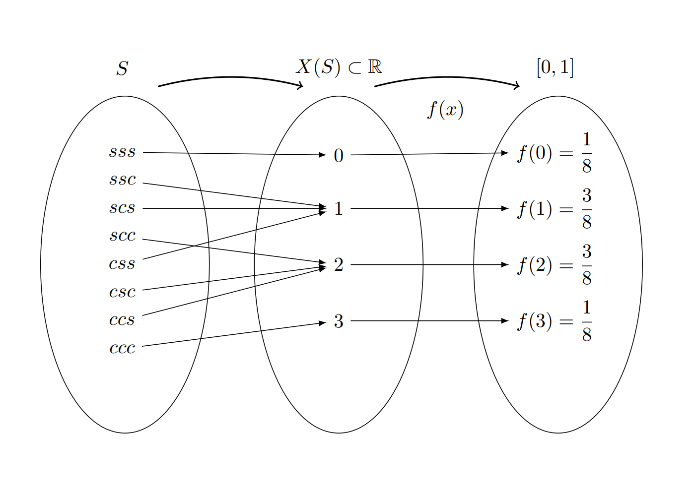
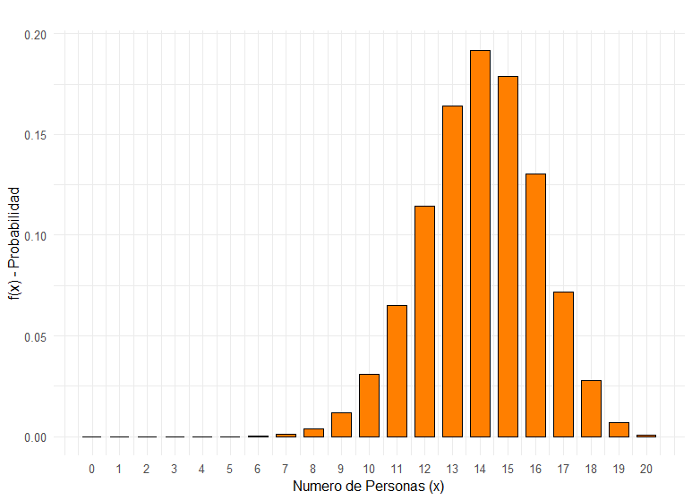
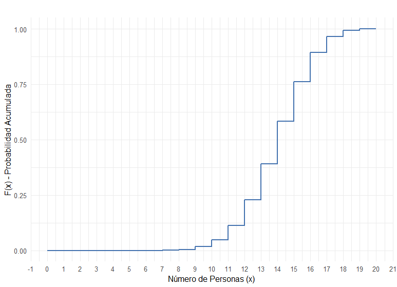
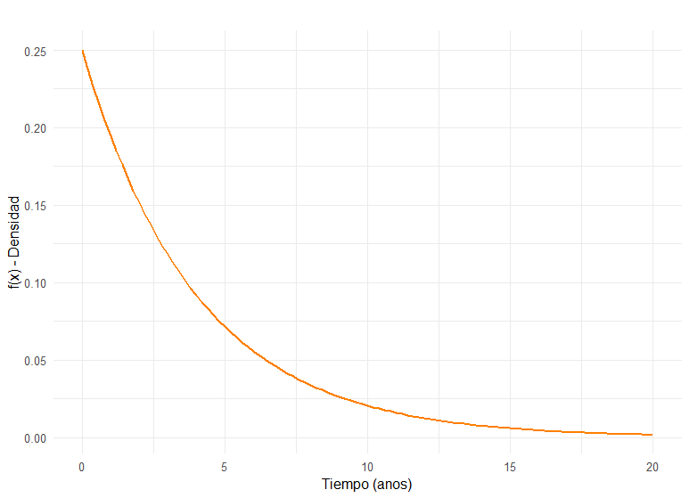
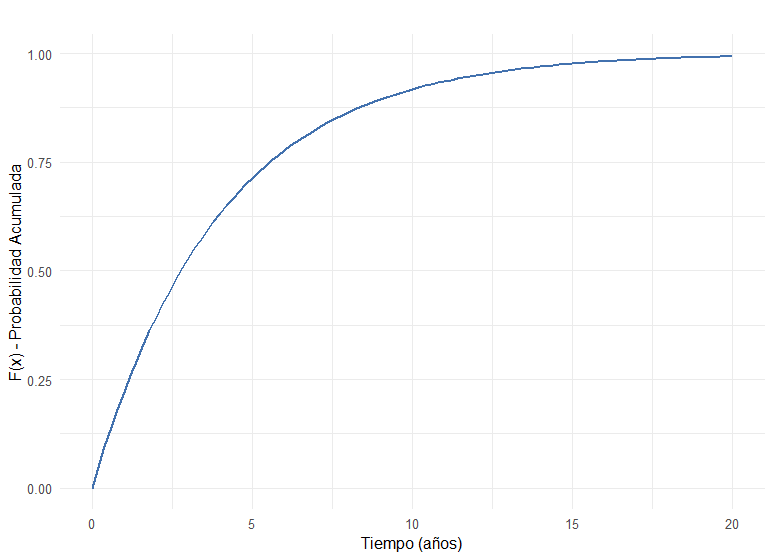

```{r setup, include=FALSE}
knitr::opts_chunk$set(echo = TRUE, message = FALSE, warning = FALSE, comment = NA)
```


</br></br>
<h2>Introducción</h2>

El concepto de variable aleatoria constituye uno de los pilares fundamentales de la probabilidad y la estadística. Según J.A. Alberth y B. Ruiz (2013), este concepto se asocia con dos paradigmas históricos de evolución. El primero se basa en los resultados de fenómenos aleatorios, mientras que el segundo se centra en el proceso que relaciona los conjuntos del espacio muestral con sus respectivas probabilidades, definiendo así la variable aleatoria como una función de números reales que proporciona el sustento matemático al concepto.

Este concepto se aplica en diversos contextos donde es necesario responder preguntas sobre la ocurrencia de fenómenos aleatorios que pueden presentarse en el futuro. Por ejemplo: 

- ¿Cuánto tiempo tarda un estudiante en llegar desde su casa a la universidad?

- ¿Cuál será el resultado de mi próximo examen de estadística?

- ¿Cuántas botellas de agua se venderán esta semana en la cafetería?

- ¿Cuánto tiempo tomará la entrega de un paquete por parte de una empresa de mensajería?

- ¿Cuánto tiempo durará la bombilla de un vehículo?

- ¿Qué diámetro tendrá la perforación realizada por una máquina en una lámina de acero destinada a una puerta de vehículo?

- ¿Cuántos mensajes recibiré hoy por WhatsApp?

En todos estos casos, las preguntas planteadas pueden tener múltiples respuestas, es decir, no existe un único valor como resultado. En este documento se estudiará el concepto de variable aleatoria mediante la definición de una función matemática que permita caracterizar su comportamiento, realizando diversos cálculos de probabilidades de interés. Para ello, será necesario retomar conceptos de cálculo integral, los cuales se presentarán oportunamente a través de funciones de fácil manejo.

Esta unidad abordará primero el caso univariado discreto y posteriormente el caso continuo, destacando sus principales características y los conceptos relacionados con los tratados en el módulo anterior.


</br></br>
<h3>Definición</h3>

Una variable aleatoria \( X\) es una función que asigna a cada valor del espacio muestral $S$ un número real. El conjunto de estos valores forma un subconjunto de los números reales, denominado rango de la variable $X$, representado como $R_{X}$.

Las variables aleatorias se clasifican según las características de su rango en discretas o continuas. Su distribución será univariada cuando se analice el comportamiento de una sola variable, y multivariada al estudiar el comportamiento conjunto de varias variables definidas en el mismo espacio muestral.


</br></br>
<h3>Tipos de variables</h3>

-  Una variable  \( X\) se considera **discreta** si su rango $R_{_{X}}$ es un conjunto finito o infinito numerable de valores.

-  Se considera **continua** si su rango  \(R_{_{X}}\) es un conjunto de valores infinito no numerable y generalmente corresponde a unión de intervalos.


</br></br>
<div class="caja-ejemplo">
<h3>Ejemplo:</h3>
<p>
Un experimento aleatorio \(E\) consiste en lanzar una moneda balanceada tres veces y observar el orden de caras \((c)\) y sellos \((s)\) obtenidos. El espacio muestral \(S\) de \(E\) estará dado por:

\( S = \{(s,s,s),(s,s,c),(s,c,s),(s,c,c),(c,s,s),(c,s,c),(c,c,s),(c,c,c)\} \)


<!-- <center> -->
<!-- {width=60%}<br/> -->
<!-- **Figura 2.10** Relación espacio muestral, rango, variable aleatoria -->
<!-- </center> -->
<!-- <br/> -->


<br/><br/>
<center>
```{r, echo=FALSE, out.width="80%", fig.align = "center"}

```
**Figura 2.10** Relación espacio muestral, rango, variable aleatoria.
</center>
<br/><br/>

La **Figura 2.10** ilustra de manera esquemática el concepto de **variable aleatoria**, destacando la relación entre el **espacio muestral**, el **conjunto de números reales** y la **función de probabilidad**. En este contexto, la variable aleatoria \(X\) es una función que asocia a cada resultado del espacio muestral un número real. 

Su rango está dado por: \(X(S) = \{0, 1, 2, 3\}\). A cada valor del rango se le asigna una probabilidad mediante la función de probabilidad \(f_{X}(x) = P(X = x)\). Por ejemplo, \(f_{X}(1) = P(X = 1) = P(\{(s,s,c),(s,c,s),(c,s,s)\}) = \frac{3}{8}\).

La descripción de componentes de la **Figura 2.10**:

- **Variable aleatoria \(X\):** Asigna a cada resultado del espacio muestral el número de caras obtenidas en tres lanzamientos de una moneda.
- **Rango de la variable \(R_{X}=X(S)= \{0,1,2,3\}\):** Definido mediante la regla de asignación, que consiste en contar el número de caras en cada resultado posible del espacio muestral \(S\).
- **Función de probabilidad \(f_{X}(x) = P(X = x)\):** Es una función que asigna a cada valor del rango una probabilidad, la cual es un número en el intervalo cerrado [0, 1]. La suma de las probabilidades de todos los valores posibles es 1, cumpliendo el axioma fundamental de la probabilidad: \( \sum_{x \in R_{X}} f_{X}(x) = 1\).


</br></br>
<h4>Relación entre eventos y valores de la variable aleatoria</h4>

Al establecer la correspondencia entre los eventos del espacio muestral y el rango de la variable aleatoria, se obtienen las siguientes asociaciones y valores para la función de probabilidad:

- \(X = 0 = \{(s,s,s)\}\)  
- \(X = 1 = \{(s,s,c),(s,c,s),(c,s,s)\}\)  
- \(X = 2 = \{(s,c,c),(c,s,c),(c,c,s)\}\)  
- \(X = 3 = \{(c,c,c)\}\)  

Bajo el supuesto de que la moneda es balanceada, todos los resultados del espacio muestral \(S\) son equiprobables. Por lo tanto, la función de probabilidad \(f_{X}(x) = P(X = x)\) se obtiene como:

\(f_{X}(0) = P(X=0) = \frac{1}{8}\)  
\(f_{X}(1) = P(X=1) = \frac{3}{8}\)  
\(f_{X}(2) = P(X=2) = \frac{3}{8}\)  
\(f_{X}(3) = P(X=3) = \frac{1}{8}\) 

La suma de todas las probabilidades es 1, cumpliendo con la propiedad fundamental de las distribuciones de probabilidad:
  
\(\sum_{x \in R_{X}} f_{X}(x) = \frac{1}{8} + \frac{3}{8} + \frac{3}{8} + \frac{1}{8} = 1\).  
</p>
</div>


</br></br>
<h2>Variables discretas</h2>

Como se mencionó anteriormente, una **variable aleatoria** se clasifica como **discreta** cuando el conjunto de posibles valores que puede asumir es finito o infinito numerable. En la mayoría de los casos, dicho conjunto está formado por números enteros.

Para caracterizar formalmente esta variable, se introduce la **función de distribución de probabilidad**, la cual modela la asignación de probabilidades a cada uno de los valores posibles de la variable. 


</br></br>
<h3>Función de distribución de probabilidad</h3>

Para una variable aleatoria discreta \(X\), su **función de distribución de probabilidad** \(f(x)\) asigna las probabilidades a todos los valores de su rango \(R_{X}\). Esta función debe cumplir con las siguientes propiedades fundamentales:

1. **No negatividad:** \(f(x) = P(X = x) \geq 0\) para todo \(x\) en \(R_{X}\).
2. **Suma total:** \(\sum_{x \in R_{X}} f(x) = 1\), es decir, la suma de las probabilidades de todos los valores posibles es igual a uno.

Por lo general, las variables aleatorias discretas surgen a partir de procesos de **conteo**, lo que suele reflejarse en enunciados que comienzan con expresiones como **“número de...”**, tales como:

- Número de éxitos en un experimento binomial.
- Número de llamadas recibidas en una hora.
- Número de defectos en una muestra de producción.

Estas variables son esenciales en el modelado y análisis de fenómenos aleatorios donde los resultados se cuentan y se expresan mediante números enteros. 


</br></br>
<div class="caja-ejemplo">
<h3>Ejemplo:</h3>
<p>
A continuación se presentan ejemplos representativos de **variables aleatorias discretas**, todas ellas derivadas de procesos de conteo:

- \(X\): Número de llamadas recibidas en un conmutador durante un día.
- \(Y\): Número de personas contagiadas por COVID-19 en un día.
- \(Z\): Número de quejas registradas en una sucursal bancaria durante un día.
- \(W\): Número de accidentes ocurridos en una ciudad.
- \(S\): Número de huevos producidos diariamente en una avícola.
- \(T\): Número de hijos en una familia.
- \(M\): Número de mensajes enviados en un grupo de WhatsApp.

Estos ejemplos ilustran cómo las variables aleatorias discretas surgen de fenómenos que involucran recuentos, donde los posibles valores son números enteros finitos o infinitos numerables.
</p>
</div>


</br></br>
<h3>Función de distribución acumulada</h3>

Sea \(X\) una **variable aleatoria discreta** con función de probabilidad \(f_{X}(x)\). La **función de distribución acumulada** \(F_{X}(x)\) se define como la probabilidad de que la variable aleatoria tome un valor menor o igual que \(x\):

\(F_{X}(x) = P(X \leq x) = \sum_{t \leq x} f_{X}(t)\)

Propiedades de la función de distribución acumulada:

- **Monotonía:** \(F_{X}(x)\) es una función no decreciente, es decir, si \(a < b\), entonces \(F_{X}(a) \leq F_{X}(b)\).
- **Rangos extremos:** \(\lim_{x \to -\infty} F_{X}(x) = 0\) y \(\lim_{x \to \infty} F_{X}(x) = 1\).
- **Incrementos por saltos:** En el caso discreto, \(F_{X}(x)\) es una función escalonada que aumenta en los valores donde \(X\) tiene probabilidad no nula.

Esta función es fundamental para caracterizar la distribución de probabilidad de variables discretas y para calcular probabilidades en intervalos específicos.


</br></br>
<div class="caja-ejemplo">
<h3>Ejemplo:</h3>
<p>

El restaurante **"Asados y algo más"** opera exclusivamente mediante reservas. Con base en los registros de los últimos diez años, se ha determinado que **el 30% de las personas que reservan no asisten**, mientras que **el 70% sí acude**. El restaurante cuenta con **20 puestos** y **40 reservas** son aceptadas diariamente.

Dado que cada persona que reservó tiene una probabilidad independiente del **0.7** de asistir, el número de personas que llegan puede modelarse mediante una función de probabilidad conocida como **distribución binomial**.


Función de distribución de probabilidad: Sea \(X\) la variable aleatoria que representa el **número de personas que efectivamente llegan al restaurante**. Su **función de distribución de probabilidad** está dada por:

\[ f_{X}(x) = \begin{cases} \\
\displaystyle \binom{20}{x}(0.7)^{x}(0.3)^{20-x} & \text{si } x = 0, 1, 2, \ldots, 20 \\\
0 & \text{en otro caso} \\\
\end{cases} \]


<pre>
library(ggplot2)

# Modelo binomial: Número de personas que llegan al restaurante
dat <- data.frame(
  x = 0:20,
  fx = dbinom(0:20, size = 20, prob = 0.70)
)

# Ajuste para evitar pérdida de datos en el gráfico
dat <- na.omit(dat)

# Configuración para evitar errores de codificación de caracteres
# Sys.setlocale("LC_ALL", "en_US.UTF-8")

# Gráfico de barras de la distribución binomial
plot.fx<-ggplot(dat, aes(x = x, y = fx)) + 
  geom_bar(stat = "identity", fill = "#FF7F00", color = "black", width = 0.7, na.rm = TRUE) +
  scale_x_continuous(
    breaks = 0:20,
    labels = as.character(0:20)
  ) +
  labs(
    title = "",
    x = "Numero de Personas (x)",
    y = "f(x) - Probabilidad"
  ) +
  theme_minimal(base_size = 12)

print(plot.fx)
</pre>

```{r, echo=TRUE, fig.height=3.5,message=FALSE, warning=FALSE}
library(ggplot2)

# Modelo binomial: Número de personas que llegan al restaurante
dat <- data.frame(
  x = 0:20,
  fx = dbinom(0:20, size = 20, prob = 0.70)
)

# Ajuste para evitar pérdida de datos en el gráfico
dat <- na.omit(dat)

# Configuración para evitar errores de codificación de caracteres
# Sys.setlocale("LC_ALL", "en_US.UTF-8")

# Gráfico de barras de la distribución binomial
plot.fx<-ggplot(dat, aes(x = x, y = fx)) + 
  geom_bar(stat = "identity", fill = "#FF7F00", color = "black", width = 0.7, na.rm = TRUE) +
  scale_x_continuous(
    breaks = 0:20,
    labels = as.character(0:20)
  ) +
  labs(
    title = "",
    x = "Numero de Personas (x)",
    y = "f(x) - Probabilidad"
  ) +
  theme_minimal(base_size = 12)

# print(plot.fx)
```

<br/><br/>
<center>
```{r, echo=FALSE, out.width="80%", fig.align = "center"}

```
**Figura 2.11** Función de probabilidad de  \( X\).
</center>
<br/><br/>

La  **Figura 2.11** presenta el gráfico de la función de probabilidad de la variable aleatoria \( X\).

- En el **eje X** se representa el rango de la variable, que corresponde al número de personas.

- En el **eje Y** se muestran los valores de las probabilidades asociadas a cada valor posible de la variable.

<pre>
library(ggplot2)

# Gráfico de la función de distribución acumulada (FDA) para la distribución binomial
plot.Fx<-ggplot() +
  stat_function(
    fun = function(q) pbinom(q = q, size = 20, prob = 0.7),
    geom = "step",
    n = 21,
    colour = "#4271AE",
    size = 1
  ) +
  scale_x_continuous(
    n.breaks = 21,
    limits = c(0, 20)
  ) +
  labs(
    title = "",
    x = "Número de Personas (x)",
    y = "F(x) - Probabilidad Acumulada"
  ) +
  theme_minimal(base_size = 12)

print(plot.Fx)
</pre>

```{r, echo=TRUE, fig.height=3.5}
library(ggplot2)

# Gráfico de la función de distribución acumulada (FDA) para la distribución binomial
plot.Fx<-ggplot() +
  stat_function(
    fun = function(q) pbinom(q = q, size = 20, prob = 0.7),
    geom = "step",
    n = 21,
    colour = "#4271AE",
    size = 1
  ) +
  scale_x_continuous(
    n.breaks = 21,
    limits = c(0, 20)
  ) +
  labs(
    title = "",
    x = "Número de Personas (x)",
    y = "F(x) - Probabilidad Acumulada"
  ) +
  theme_minimal(base_size = 12)

#  print(plot.Fx)
```

<br/><br/>
<center>
```{r, echo=FALSE, out.width="80%", fig.align = "center"}

```
**Figura 2.12** Función de distribución acumulada de  \( X\).
</center>
<br/><br/>


La  **Figura 2.12** muestra el gráfico de la función de distribución acumulada (FDA) de la variable aleatoria :

- En el eje X se representa el rango de la variable, correspondiente al número de personas.

- En el eje Y se visualizan las probabilidades acumuladas asociadas a cada valor posible de la variable.

Esta representación escalonada refleja la naturaleza discreta de la distribución y permite observar cómo se acumula la probabilidad conforme aumenta el número de personas. Adicionalmente se visualiza el cumplimiento de las propiedades de esta función:

- La FDA es una función monótonamente no decreciente, es decir, su valor nunca disminuye al aumentar \(X\). Esto se refleja en el gráfico con una secuencia de escalones ascendentes.
- La FDA siempre está definida en el intervalo [0, 1], ya que expresa probabilidades acumuladas.
- La probabilidad acumulada antes del primer valor es cero y la probabilidad acumulada total es uno.
- Cada salto en el gráfico corresponde a una probabilidad puntual \(f(x)\), es decir, \(F(x) - F(x-1) = f(x)\).


<br/><br/>
A continuación se presentan algunos valores de la función de probabilidad $f(x)$ y la función de distribución acumulada $F(x)$, mostrando las fórmulas y los reemplazos para evidenciar el proceso de cálculo:


Algunos valores de la función de probabilidad $f(x)$:
 
- $f(0) = \binom{20}{0} (0.7)^0 (0.3)^{20}=1 \times 1 \times 0.000000121 = 0$. 


- $f(14) = \binom{20}{14} (0.7)^{14} (0.3)^{6}= 38760 \times 0.0577 \times 0.000729 = 0.1547$. 


- $f(15) = \binom{20}{15} (0.7)^{15} (0.3)^{5}= 15504 \times 0.0477 \times 0.00243 = 0.178863$. 

Algunos valores de  la función de distribución acumulada $F(x)$:

- $F(14) = \sum_{x=0}^{14} f(x) = 0.5836$.

- $F(15) = F(14) + f(15)= 0.5836 + 0.178863 = 0.762463$. 


Complementos de la acumulada:

- $P(X > 14) = 1 - F(13)$, asi $P(X > 14) = 1 - 0.4047 = 0.5953$.

- $P(X > 15) = 1 - F(14)= 1 - 0.5836 = 0.4164$.

</p>
</div>


</br></br>
<h2>Variables continuas</h2>

Como se mencionó, una **variable aleatoria se considera continua** cuando el conjunto de valores que puede asumir es **infinito** y **no numerable**, lo que implica que siempre existe un valor entre dos valores cualesquiera. Este tipo de variable representa fenómenos que se miden, como el tiempo, la temperatura o la distancia.

En el caso de una variable continua, la probabilidad de que tome un valor exacto es cero, por lo que su comportamiento se modela mediante una función continua conocida como **función de densidad de probabilidad (FDP)**. Esta función describe cómo se distribuyen las probabilidades a lo largo del rango de valores posibles.

La **función de densidad de probabilidad** se puede visualizar a través de un **gráfico de densidad**, construido a partir de una muestra representativa de la variable. En este gráfico, el **área bajo la curva** entre dos puntos representa la **probabilidad** de que la variable tome un valor dentro de ese intervalo.


</br></br>
<div class="caja-ejemplo">
<h3>Ejemplo:</h3>
<p>
En el caso de las variables aleatorias continuas, estas generalmente provienen de mediciones de fenómenos continuos. A continuación se presentan ejemplos típicos:

- \(T\): Tiempo que tarda un estudiante en responder un examen.
- \(P\): Peso de un bebé recién nacido.
- \(E\): Edad de una persona.
- \(V\): Tiempo que tarda un vehículo en requerir una reparación de su motor.
- \(D\): Diámetro de un agujero realizado en una lámina de acero.
- \(X\): Cantidad de azúcar contenida en un refresco.
- \(C\): Proporción de cemento en una mezcla de concreto.

Estos ejemplos ilustran cómo las variables aleatorias continuas pueden tomar cualquier valor dentro de un intervalo, reflejando la naturaleza continua de las mediciones.
</p>
</div>


</br></br>
<h3>Función de densidad de probabilidad</h3>

A continuación se presentan las propiedades esenciales de la **función de densidad de probabilidad (FDP)**, que describe la distribución de una variable aleatoria continua:

- **No negatividad**: La FDP siempre es no negativa, 
  \[ f(x) \geq 0, \quad \text{para todo } x \]

-  **Área total bajo la curva**:  El área total bajo la curva es igual a 1, lo que garantiza que la suma de todas las probabilidades posibles sea completa:
  \[ \int_{-\infty}^{\infty} f(x) \, dx = 1 \]

- **Probabilidad como área bajo la curva**: La probabilidad de que la variable esté entre dos valores \(a\) y \(b\) es el área bajo la curva entre esos límites:
  \[ P(a \leq X \leq b) = \int_{a}^{b} f(x) \, dx \]

Para una variable continua, la probabilidad de que tome un valor exacto es cero:
  \[ P(X = x) = 0 \]


</br></br>
<h3>Función de distribución acumulada</h3>

Sea \(X\) una **variable aleatoria continua** con función de densidad \(f_{X}(x)\). La **función de distribución acumulada** (FDA),  \(F_{X}(x)\), se define como la probabilidad de que la variable aleatoria tome un valor menor o igual que \(x\):

\(F_{X}(x) = P(X \leq x) = \int_{-\infty}^{x} f_{X}(t) \, dt\)


- La función de distribución acumulada representa el área bajo la curva de la función de densidad desde \(-\infty\) hasta \(x\).
- \(F_{X}(x)\) es una función **monótonamente no decreciente**, con valores en el intervalo [0, 1].
- \( \lim_{x \to -\infty} F_{X}(x) = 0 \) y \( \lim_{x \to \infty} F_{X}(x) = 1 \).


La FDP es la derivada de la función de distribución acumulada (FDA): \[ f(x) = \frac{d}{dx}F(x) \]

Esta definición es fundamental para describir el comportamiento probabilístico de variables continuas y para calcular probabilidades asociadas a intervalos de valores.
  


</br></br>
<div class="caja-ejemplo">
<h3>Ejemplo:</h3>
<p>

Una compañía que fabrica lavadoras, basándose en datos históricos, ha determinado que el tiempo $X$ (en años) hasta que un electrodoméstico requiera una reparación mayor se modela mediante la siguiente **función de densidad de probabilidad (FDP):**

$$
  f_{X}(x) = \begin{cases} \\
    \dfrac{1}{4} e^{-x/4} & \text{si } x \geq 0 \\\\
    0 & \text{en otro caso} \\\\
  \end{cases}
$$

<pre>
library(ggplot2)

# Configuración de codificación para evitar errores en etiquetas
# Sys.setlocale("LC_ALL", "en_US.UTF-8")

# Definición de la función de densidad
fx <- function(x) {
  (1/4) * exp(-x/4)
}

# Creación del gráfico con ggplot2
plot213<-ggplot() +
  xlim(c(0, 20)) +
  geom_function(fun = fx,
                colour = "#FF7F00",
                lwd = 1,
                linetype = 1) +
  labs(
    title = "",
    x = "Tiempo (anos)",
    y = "f(x) - Densidad"
  ) +
  theme_minimal(base_size = 12)

print(plot213)
</pre>


```{r, echo=TRUE, fig.height=3.5,message=FALSE, warning=FALSE}
library(ggplot2)

# Configuración de codificación para evitar errores en etiquetas
# Sys.setlocale("LC_ALL", "en_US.UTF-8")

# Definición de la función de densidad
fx <- function(x) {
  (1/4) * exp(-x/4)
}

# Creación del gráfico con ggplot2
plot213<-ggplot() +
  xlim(c(0, 20)) +
  geom_function(fun = fx,
                colour = "#FF7F00",
                lwd = 1,
                linetype = 1) +
  labs(
    title = "",
    x = "Tiempo (anos)",
    y = "f(x) - Densidad"
  ) +
  theme_minimal(base_size = 12)

# print(plot213)
```


<br/><br/>
<center>
```{r, echo=FALSE, out.width="80%", fig.align = "center"}

```
**Figura 2.13** Función de densidad de  \( X\).
</center>
<br/><br/>


Para garantizar que $f(x)$ es una **función de densidad de probabilidad (FDP)**, se debe comprobar que el área total bajo la curva es igual a 1, para tal efecto se calcula la integral impropia desde 0 hasta infinito, donde no se anula la función:
$$
\int_{0}^{+\infty} \frac{1}{4} e^{-x/4} \,dx=\frac{1}{4} \int_{0}^{+\infty} e^{-x/4} \,dx= \int e^{-x/4} \,dx = -4e^{-x/4} + C
$$
Evaluamos la integral definida en los límites:
$$
\frac{1}{4} \left[ -4e^{-x/4} \right]_{0}^{+\infty}
$$

Aplicamos los límites:

- Cuando $x \to +\infty$, $e^{-x/4} \to 0$
- Cuando $x = 0$, $e^{-0} = 1$

$$
\frac{1}{4} \left( 0 - (-4 \times 1) \right) = \frac{1}{4} \times 4 = 1
$$

La integral es igual a 1:
$$
\int_{0}^{+\infty} \frac{1}{4} e^{-x/4} \,dx = 1
$$


El resultado se puede verificar mediante integración numérica:

<pre>
# Definición de la función de densidad
fy <- function(y) {
  (1/4) * exp(-y/4)
}

# Cálculo de la integral
resultado <- integrate(fy, lower = 0, upper = Inf)
print(resultado)
</pre>

```{r,echo=TRUE,message=FALSE, warning=FALSE}
# Definición de la función de densidad
fy <- function(y) {
  (1/4) * exp(-y/4)
}

# Cálculo de la integral
resultado <- integrate(fy, lower = 0, upper = Inf)
print(resultado)
```
<br/><br/>
 
Para esponder a la pregunta ¿cuál es la probabilidad de que el electrodoméstico requiera una reparación mayor en los **primeros 3 años**? se procede como sigue:

$$
P(0 \leq X \leq 3) = \int_{0}^{3} \frac{1}{4} e^{-x/4} \,dx
$$

Entonces, 
$$
P(0 \leq X \leq 3) = \left[ -e^{-x/4} \right]_{0}^{3} = e^{0} - e^{-3/4} = 1 - 0.4724 = 0.5276
$$
La probabilidad de que el electrodoméstico necesite una reparación mayor **antes de cumplir 3 años** es aproximadamente **0.5276**.
<br/><br/>

Para determinar la **distribución acumulada** $F(x)$ se obtiene integrando la función de densidad desde 0 hasta $x$, para $x \geq 0$, se tiene:
$$
F(x) = \int_{0}^{x} \frac{1}{4} e^{-t/4} \,dt
$$

Luego, 
$$
F(x) = \left[-e^{-t/4}\right]_{0}^{x} = 1 - e^{-x/4}
$$

Puede notar en la **Figura 2.14** que se cumplen las propiedades de la FDA:

- $F(0) = 0$  
- $\lim_{x \to +\infty} F(x) = 1$  
- Es una función monótonamente no decreciente.

<pre>
library(ggplot2)

# Definición de la FDA
F <- function(x) {
  1 - exp(-x/4)
}

# Gráfico de FDA
plot214<-ggplot(data.frame(x = c(0, 20)), aes(x = x)) +
  geom_function(fun = F, colour = "#4271AE", lwd = 1) +
  labs(title = "",
       x = "Tiempo (años)",
       y = "F(x) - Probabilidad Acumulada") +
  theme_minimal(base_size = 12)

print(plot214)
</pre>

```{r,echo=TRUE,message=FALSE, warning=FALSE}
library(ggplot2)

# Definición de la FDA
F <- function(x) {
  1 - exp(-x/4)
}

# Gráfico de FDA
plot214<-ggplot(data.frame(x = c(0, 20)), aes(x = x)) +
  geom_function(fun = F, colour = "#4271AE", lwd = 1) +
  labs(title = "",
       x = "Tiempo (años)",
       y = "F(x) - Probabilidad Acumulada") +
  theme_minimal(base_size = 12)

# print(plot214)
```

<br/><br/>
<center>
```{r, echo=FALSE, out.width="80%", fig.align = "center"}

```
**Figura 2.14** Función de distribución acumulada de  \( X\).
</center>
<br/><br/>


Usando $F(x)$ se puede responder a la pregunta ¿cuál es la probabilidad de que el electrodoméstico necesite una reparación **entre 2 y 5 años**?

$$
P(2 \leq X \leq 5) = F(5) - F(2)
$$
Reemplazamos la función acumulada:
$$
F(5) = 1 - e^{-5/4}\quad\quad F(2) = 1 - e^{-2/4}
$$
$$
P(2 \leq X \leq 5) = (1 - e^{-5/4}) - (1 - e^{-2/4}) = e^{-2/4} - e^{-5/4}
$$

Esta probabilidad representa el área bajo la curva de densidad entre 2 y 5 años.
<br/><br/>


</p>
</div>
