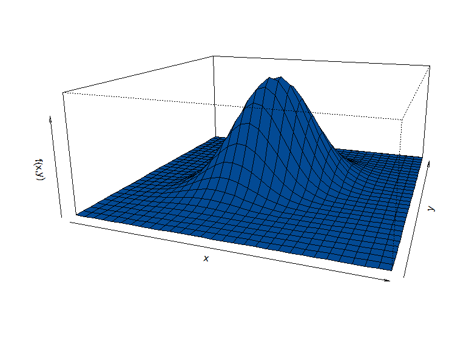
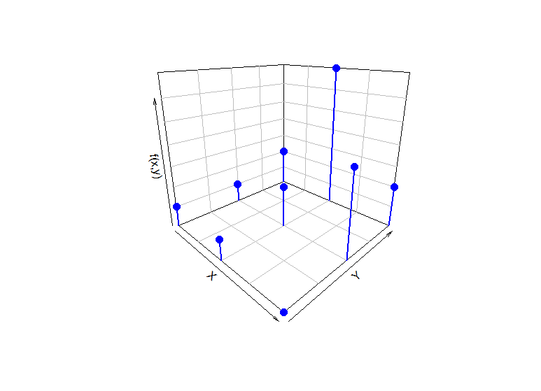
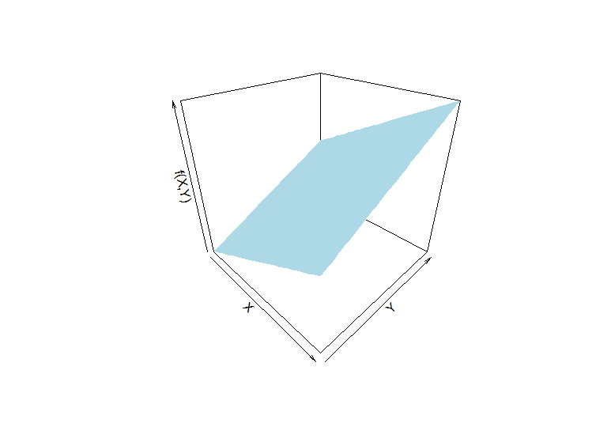
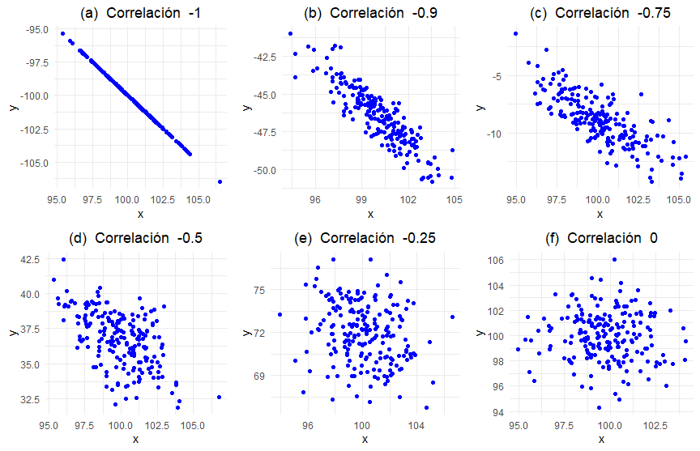
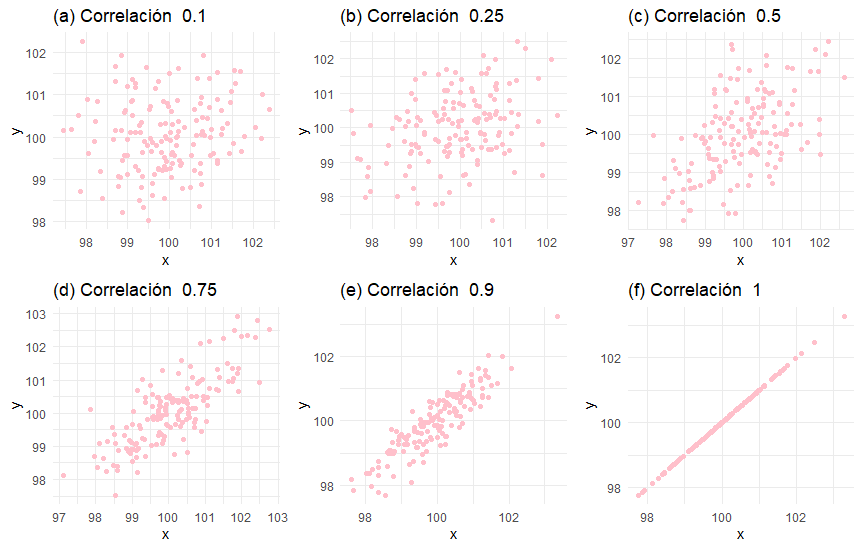

```{r setup, include=FALSE}
knitr::opts_chunk$set(echo = TRUE, message = FALSE, warning = FALSE, comment = NA)


```

Cuando se analizan dos variables simultáneamente, se forma una **variable aleatoria bivariada** $(X, Y)$, definida sobre un plano. La **probabilidad conjunta** de $(X, Y)$ describe la probabilidad de que ambas variables tomen valores específicos simultáneamente. Esta probabilidad genera una **superficie tridimensional**, como se ilustra en la **Figura 2.15** que corresponde a una normal bivariada.


```{r, echo=FALSE}
# tomada de:
# http://pj.freefaculty.org/R/WorkingExamples/plot-3d-MVNormal-1.R
# library("mvtnorm")
# 
# N=30
# x <- seq(-4,4, length=N)
# y <- seq(-4,4,length=N)
# z <- matrix(0, N, N)
# for (i in 1:N) for (j in 1:N) {
# 	z[i,j]=dmvnorm(c(x[i],y[j]), c(0,0),
# 	matrix(c(1,0.5,0.5,1),2,2))}
# persp(x,y,z,theta=20, phi=15, 
# xlab="x", 
# ylab="y", 
# zlab="f(x,y)",
# scale=TRUE,
# expand=.4,
# axes=TRUE,
# col="#034A94")
```


<br/><br/>
<center>
```{r, echo=FALSE, out.width="80%", fig.align = "center"}

```
**Figura 2.15** Distribución normal bivariada.
</center>
<br/><br/>


</br></br>
<h2>Introducción</h2>

En muchos experimentos, los resultados son influenciados por múltiples variables. Ejemplos comunes incluyen:

- **Precio de un producto y su volumen de ventas**.
- **Tiempo de preparación para un examen y la calificación obtenida**.
- **Cantidad de arena y cemento en una mezcla de concreto**.
- **Cantidad de abono aplicado y la producción de una planta**.

En estos casos, es necesario emplear una función de densidad que describa la probabilidad conjunta de ambas variables. Esta función caracteriza cómo se comportan **simultáneamente** las variables involucradas.

La **distribución de probabilidad conjunta** es la función que describe la probabilidad de ocurrencia simultánea de dos (o más) variables aleatorias. Esta distribución considera la relación y dependencia entre las variables y se puede clasificar según la naturaleza de estas:

- **Continua-continua:** Ambas variables son continuas.
- **Discreta-discreta:** Ambas variables son discretas.
- **Continua-discreta:** Una variable es continua y la otra es discreta.

Esta guía se centra en los casos más representativos:

- **Discreta-discreta**: Ejemplificado mediante tablas de probabilidad conjunta y distribuciones marginales.
- **Continua-continua:** Ilustrado mediante funciones de densidad conjunta y gráficos de superficies.


</br></br>
<h2>Discreto-discreto</h2>


</br></br>
<h3>Función de distribución de probabilidad conjunta</h3>

Cuando **$X$** y **$Y$** son variables aleatorias discretas, la **función de probabilidad conjunta** se define como:
$$
f_{X,Y}(x,y) = P(X = x, Y = y)
$$
Esta función representa la probabilidad de que $X$ tome el valor $x$ y $Y$ tome el valor $y$ simultáneamente.


</br></br>
<h4>Propiedades de la distribución conjunta:</h4>

Para ser válida, la distribución conjunta debe cumplir con las siguientes características:

1. **Totalidad de la probabilidad:** La suma de todas las probabilidades conjuntas es igual a 1:
$$
\sum_{x=x_{(1)}}^{x_{(n)}} \sum_{y=y_{(1)}}^{y_{(n)}} f_{X,Y}(x,y) = 1
$$
Esto asegura que la probabilidad total cubre todos los resultados posibles.

2. **No negatividad:** Todas las probabilidades deben ser no negativas:
$$
f_{X,Y}(x,y) \geq 0 \quad \text{para todo } x,y
$$
Esta propiedad garantiza que ninguna probabilidad sea negativa.


Esta función describe la probabilidad de ocurrencia simultánea de dos eventos discretos. Se suele representar mediante una **tabla de probabilidad conjunta**, donde las filas corresponden a valores de $X$ y las columnas a valores de $Y$.


</br></br>
<div class="caja-ejemplo">
<h3>Ejemplo:</h3>
<p>

Se consideran:

- **$X$:** Número de fallas de una máquina por día, con $R_X = \{1,2,3\}$.
- **$Y$:** Número de veces que el operario llama al técnico, con $R_Y = \{1,2,3\}$.

La función de probabilidad conjunta $f_{X,Y}(x,y)$ está dada en la **Tabla 2.7**.
 

<br/><br/>
<center>
**Tabla 2.7** Distribución conjunta de $X$, $Y$.
</center> 

|    |        |       |  $x$ |      |
|:--:|:------:|:-----:|:----:|:----:|
|    |$f_{X,Y}(x,y)$| 1     |  2   |  3   |
|$y$ |  1     | 0.05  | 0.05 | 0.10 |
|    |  2     | 0.05 | 0.10 | 0.35  |
|    |  3     | 0     | 0.20 | 0.10 |

<br/><br/>
Verificación de la distribución conjunta:

Para tal efecto se revisa que la suma de todas las probabilidades es igual a 1:
```{r, echo=TRUE}
fxy <- matrix(c(0.05, 0.05, 0.00,
                0.05, 0.10, 0.20,
                0.10, 0.35, 0.10),
              ncol = 3, byrow = TRUE)
colnames(fxy) <- c("X=1", "X=2", "X=3")
rownames(fxy) <- c("Y=1", "Y=2", "Y=3")
print(fxy)

suma_total <- sum(fxy)
print(paste("Suma total: ", suma_total))  # Debería ser 1
```

La función se puede representar  en un gráfico tridimensional como el de la **Figura 2.16**.

<pre>
library(plot3D)

# Valores de fxy, X y Y proporcionados
fxy <- matrix(c(0.05, 0.05, 0.00,
                0.05, 0.10, 0.20,
                0.10, 0.35, 0.10),
              ncol = 3, byrow = TRUE)
colnames(fxy) <- c("X=1", "X=2", "X=3")
rownames(fxy) <- c("Y=1", "Y=2", "Y=3")

x <- rep(1:3, each = 3)
y <- rep(1:3, times = 3)
fxy_vals <- as.vector(fxy)


# Gráfico 3D 
scatter3D(x = x, 
          y = y, 
          z = fxy_vals,
          colvar = NULL, col = "blue",
          pch = 19, cex = 1.5,
          phi = 20, theta = 45,
          zlab = "f(x,y)", xlab = "X", ylab = "Y",
          bty = "b2",
          col.panel = "steelblue",
          col.grid = "darkblue")

# Añadir líneas 
for (i in 1:length(x)) {
  lines3D(x = rep(x[i], 2),
          y = rep(y[i], 2),
          z = c(0, fxy_vals[i]),
          col = "blue",
          lwd = 2,
          add = TRUE)
}
</pre>

```{r, eval=TRUE}
library(plot3D)

# Valores de fxy, X y Y proporcionados
fxy <- matrix(c(0.05, 0.05, 0.00,
                0.05, 0.10, 0.20,
                0.10, 0.35, 0.10),
              ncol = 3, byrow = TRUE)
colnames(fxy) <- c("X=1", "X=2", "X=3")
rownames(fxy) <- c("Y=1", "Y=2", "Y=3")

x <- rep(1:3, each = 3)
y <- rep(1:3, times = 3)
fxy_vals <- as.vector(fxy)


# Gráfico 3D 
scatter3D(x = x, 
          y = y, 
          z = fxy_vals,
          colvar = NULL, col = "blue",
          pch = 19, cex = 1.5,
          phi = 20, theta = 45,
          zlab = "f(x,y)", xlab = "X", ylab = "Y",
          bty = "b2",
          col.panel = "steelblue",
          col.grid = "darkblue")

# Añadir líneas 
for (i in 1:length(x)) {
  lines3D(x = rep(x[i], 2),
          y = rep(y[i], 2),
          z = c(0, fxy_vals[i]),
          col = "blue",
          lwd = 2,
          add = TRUE)
}

```


<br/><br/>
<center>
```{r, echo=FALSE, out.width="80%", fig.align = "center"}

```
**Figura 2.16** Distribución conjunta discreta-discreta. 
</center>
<br/><br/>

</p>
</div>


</br></br>
<h3>Probabilidad marginal</h3>

A partir de la **función de distribución conjunta** de dos variables aleatorias, se pueden derivar las **distribuciones marginales**, que describen el comportamiento individual de cada variable, ignorando la otra. Estas distribuciones se denotan comúnmente como $g(x)$ para $X$ y $h(y)$ para $Y$. Si $X$ y $Y$ son **variables aleatorias discretas**, entonces:

</br></br>
<h4>Distribución marginal de $X$ (probabilidad de $X$):</h4>

$$
g(x) = f_{X}(x) = \sum_{y=y_{(1)}}^{y_{(n)}} f_{X,Y}(x,y)
$$
Esta suma acumula todas las probabilidades conjuntas para cada valor fijo de $X$.

</br></br>
<h4>Distribución marginal de $Y$ (probabilidad de $Y$):</h4>

$$
h(y) = f_{Y}(y) = \sum_{x=x_{(1)}}^{x_{(n)}} f_{X,Y}(x,y)
$$
Esta suma acumula todas las probabilidades conjuntas para cada valor fijo de $Y$.


</br></br>
<div class="caja-ejemplo">
<h3>Ejemplo:</h3>
<p>

Este ejemplo ilustra cómo obtener las **funciones marginales** $g(x)$ y $h(y)$ a partir de una tabla de distribución conjunta.

La función marginal de $X$ se calcula **sumando las probabilidades por columnas**, lo que representa la acumulación de todas las probabilidades asociadas a $Y$ para cada valor de $X$.


```{r,echo=TRUE}
# Crea la matriz fxy que contiene la distribución conjunta (3 filas x 3 columnas)
fxy <- matrix(c(0.05, 0.05, 0,    # Primera fila: Y=1
                0.05, 0.10, 0.20, # Segunda fila: Y=2
                0.10, 0.35, 0.10),# Tercera fila: Y=3
              ncol = 3, byrow = TRUE)

# Calcula la suma marginal por filas (suma sobre Y) para obtener g(x)
gx <- addmargins(fxy, 1)

# Asigna nombres a las filas, incluyendo la fila de sumas g(x)
rownames(gx) <- c("1", "2", "3", "g(x)")

# Tabla resultante gx
# print(gx)
```

La siguiente salida computacional  muestra los resultados obtenidos tras calcular la distribución marginal $g(x)$ sumando las probabilidades por columnas:

<pre>
     [,1] [,2] [,3]
1    0.05 0.05  0.0
2    0.05 0.10  0.2
3    0.10 0.35  0.1
g(x) 0.20 0.50  0.3
</pre>


La función marginal de $Y$ se obtiene **sumando las probabilidades por filas**, es decir, acumulando todas las probabilidades de $X$ para cada valor de $Y$.

```{r, echo=TRUE}
# Crea la matriz fxy de la distribución conjunta (3 filas x 3 columnas)
fxy <- matrix(c(0.05, 0.05, 0,
                0.05, 0.10, 0.20,
                0.10, 0.35, 0.10),
              ncol = 3, byrow = TRUE)

# Calcula la suma marginal por columnas (suma sobre X) para obtener h(y)
hy <- addmargins(fxy, 2)

# Asigna nombres a las columnas, incluyendo la columna de sumas h(y)
colnames(hy) <- c("1", "2", "3", "h(y)")

# Mostra la tabla resultante hy
# print(hy)
```

La siguiente salida computacional  muestra los resultados obtenidos tras calcular la distribución marginal $h(y)$ sumando las probabilidades por filas:

<pre>
        1    2   3 h(y)
[1,] 0.05 0.05 0.0 0.10
[2,] 0.05 0.10 0.2 0.35
[3,] 0.10 0.35 0.1 0.55
</pre>
</p>
</div>


</br></br>
<h3>Función de distribución conjunta acumulada </h3>

Si $X$ y $Y$ son **variables aleatorias discretas**, su función de distribución conjunta acumulada $F_{X,Y}(x,y)$ se expresa como:

$$
F_{X,Y}(x,y) = \sum_{t_x = -\infty}^{x} \sum_{t_y = -\infty}^{y} f_{X,Y}t_x,t_y)
$$
</br></br>
<h4>Propiedades de la función de distribución conjunta acumulada $F_{X,Y}(x,y)$</h4>

**1. Límites:**

- En los extremos negativos, la probabilidad acumulada es cero:
  $$
  F_{X,Y}(-\infty, -\infty) = 0
  $$
- En los extremos positivos, la probabilidad acumulada es uno:
  $$
  F_{X,Y}(+\infty, +\infty) = 1
  $$

**2. Monotonía:**

- $F_{X,Y}(x,y)$ es **monótonamente no decreciente**, lo que significa que:
  - Si $x_1 \leq x_2$, entonces $F_{X,Y}(x_1,y) \leq F_{X,Y}(x_2,y)$.
  - Si $y_1 \leq y_2$, entonces $F_{X,Y}(x,y_1) \leq F_{X,Y}(x,y_2)$.

 **3. Relaciones marginales:**
 
- La distribución marginal de $X$ se obtiene haciendo tender $y$ a infinito:
  $$
  F_X(x) = \lim_{y \to +\infty} F_{X,Y}(x,y)
  $$
- La distribución marginal de $Y$ se obtiene haciendo tender $x$ a infinito:
  $$
  F_Y(y) = \lim_{x \to +\infty} F_{X,Y}(x,y)
  $$

Estas propiedades son esenciales garantizar la coherencia de la función de distribución acumulada.
   
</br></br>
<div class="caja-ejemplo">
<h3>Ejemplo:</h3>
<p>

Este ejemplo ilustra cómo se calcula la **función de distribución acumulada conjunta (FDA conjunta)**, sumando las probabilidades de la distribución conjunta hasta la posición $(2,2)$.

La FDA conjunta se obtiene mediante la **suma acumulada** de las probabilidades sobre filas y columnas hasta los valores observados:

$$
\begin{equation}
\begin{array}{rl}
F(2,2) =  & \sum_{x=1}^{2} \sum_{y=1}^{2} f_{X,Y}(x,y)  \\
         = & f(1,1) + f(1,2) + f(2,1) + f(2,2) \\
         = & 0.05 + 0.05 + 0.05 + 0.10  \\
         = & 0.25
\end{array}
\end{equation}
$$ 

<!-- ```{r,echo=TRUE} -->
<!-- # Crea la matriz de distribución conjunta (3 filas x 3 columnas) -->
<!-- fxy <- matrix(c(0.05, 0.05, 0,   # Primera fila: Probabilidades para Y = 1 -->
<!--                 0.05, 0.10, 0.20, # Segunda fila: Probabilidades para Y = 2 -->
<!--                 0.10, 0.35, 0.10), # Tercera fila: Probabilidades para Y = 3 -->
<!--               ncol = 3, byrow = TRUE) -->

<!-- # Calcula las distribuciones marginales (sumas por filas y columnas) -->
<!-- # addmargins(fxy, c(1,2)) añade una fila y una columna con las sumas acumuladas -->
<!-- total_fxy <- addmargins(fxy, c(1,2)) -->

<!-- # Asigna nombres a columnas y filas -->
<!-- colnames(total_fxy) <- c("1", "2", "3", "h(y)")  # h(y): suma marginal sobre X -->
<!-- rownames(total_fxy) <- c("1", "2", "3", "g(x)")  # g(x): suma marginal sobre Y -->

<!-- # Muestra la matriz completa con distribuciones marginales -->
<!-- # total_fxy -->
<!-- ``` -->


<!-- ```{r} -->
<!-- # Crea la matriz de distribución acumulada conjunta (3x3) -->
<!-- Fxy <- matrix(c(0.05, 0.10, 0.10,  # Primera columna: Acumulados para X=1 -->
<!--                 0.10, 0.25, 0.45,  # Segunda columna: Acumulados para X=2 -->
<!--                 0.20, 0.70, 1.00), # Tercera columna: Acumulados para X=3 -->
<!--               ncol = 3, byrow = TRUE) -->

<!-- # Asigna nombres a columnas y filas -->
<!-- colnames(Fxy) <- c("1", "2", "3")  # Etiquetas de columnas (valores de Y) -->
<!-- rownames(Fxy) <- c("1", "2", "3")  # Etiquetas de filas (valores de X) -->

<!-- # Muestra la matriz completa -->
<!-- # Fxy -->
<!-- ``` -->
</p>
</div>


</br></br>
<h3>Función de densidad condicional</h3>

La **función de densidad condicional** describe cómo se distribuye la probabilidad de $X$ cuando se conoce que $Y$ ha tomado un valor específico $y_0$.

$$\begin{equation*}
	f_{_{X|Y}}(x|y_{0})=\left\lbrace
	\begin{array}{ccl}
		\dfrac{f_{_{X,Y}}(x,y_0)}{h(y_0)}&;& h(y_0) > 0\\
		&&\\
		0 &;&\mbox{en otro caso}
	\end{array}
	\right.
\end{equation*}$$

$f_{X|Y}(x|y_0)$ es la probabilidad de que $X$ tome el valor $x$ **dado** que $Y = y_0$. El denominador $h(y_0)$ es la **distribución marginal de $Y$**, que actúa como un factor de normalización.  Si $h(y_0) = 0$, la probabilidad condicional no está definida. Para una variable discreta se cumple que  $$\sum_{x} f_{X|Y}(x|y_0) = 1$$.

<br/><br/>
La **función de densidad condicional** describe cómo se distribuye la probabilidad de $Y$ al conocer que $X$ ha tomado un valor específico $x_0$.

$$\begin{equation*}
	f_{Y|X}(y|x_{0})=\left\lbrace
	\begin{array}{ccl}
		\dfrac{f_{_{X,Y}}(x_0,y)}{g(x_0)}\:&;&\:g(x_0)>0\\
		&&\\
		0\:&;&\:\mbox{en otro caso}
	\end{array}
	\right.
\end{equation*}$$

$f_{Y|X}(y|x_0)$ es la **probabilidad condicional** de que $Y$ tome el valor $y$ dado que $X = x_0$. El denominador $g(x_0)$ es la **distribución marginal de $X$**, que normaliza la distribución. Si $g(x_0) = 0$, la probabilidad condicional no está definida. Adicional, para una variable discreta: $$\sum_{y} f_{Y|X}(y|x_0) = 1$$


</br></br>
<div class="caja-ejemplo">
<h3>Ejemplo:</h3>
<p>
En este ejemplo, se muestra el proceso para obtener la función de densidad condicional de $X$ dado que $Y=2$.

La tabla muestra los valores de la distribución conjunta para distintos valores de $X$ y un valor fijo de $Y$.

| $y$ | $f(x,y)$ | $x=1$ | $x=2$ | $x=3$ | $h(y)$ |
|----|----------|-------|-------|-------|------------------|
| 2  |          | 0.050 | 0.10  | 0.35  | 0.50            |

$h(y=2)$ es la distribución marginal de $Y$ en $y=2$, obtenida como:
  $$h(y=2) = 0.050 + 0.10 + 0.35 = 0.50$$

Para determinar la función condicional $f(x|y=2)$ se usa la definición:
$$f(x|y=2) = \frac{f_{X,Y}(x,y=2)}{h(y=2)}$$
La tabla siguiente muestra los resultados de $f(x|y=2)$ para distintos valores de $X$:

| $x$ | $f(x|y=2)$                     | Cálculo                        | Resultado |
|--------|--------------------------|----------------------------------|----------|
| 1      | $\frac{f(1,2)}{0.50}$  | $\frac{0.05}{0.50}$            | 0.10     |
| 2      | $\frac{f(2,2)}{0.50}$  | $\frac{0.10}{0.50}$            | 0.20     |
| 3      | $\frac{f(3,2)}{0.50}$  | $\frac{0.35}{0.50}$            | 0.70     |

</p>
</div>


</br></br>
<h2>Continuo-continuo</h2>


</br></br>
<h3>Función de densidad conjunta</h3>

Cuando $X$ y $Y$ son **variables aleatorias continuas**, su **función de densidad conjunta** $f_{X,Y}(x,y)$ permite determinar la probabilidad de que estas variables tomen valores dentro de una región específica $R$.


La probabilidad de que $(X, Y)$ se encuentren dentro de la región $R$ está dada por:
$$
P((X,Y) \in R) = \int\int_{R} f_{X,Y}(x,y) \,dx\,dy
$$
Esta integral representa el **volumen** bajo la superficie $f_{X,Y}(x,y)$ sobre la región $R$.

</br></br>
<h4>Propiedades de la función de densidad conjunta $f_{X,Y}(x,y)$</h4>

Para que $f_{X,Y}(x,y)$ sea válida como densidad de probabilidad, debe cumplir:

1. **No negatividad:** La densidad siempre es positiva o nula:
   $$f(x,y) \geq 0, \quad \forall (x,y)$$

2. **Totalidad:** La integral doble sobre todo el espacio es 1:
   $$
   \int_{-\infty}^{\infty} \int_{-\infty}^{\infty} f_{X,Y}(x,y) \,dx\,dy = 1
   $$
Es importante tener en cuenta que $f_{X,Y}(x,y)$ no es una probabilidad, sino una densidad; la probabilidad se obtiene integrando. El área bajo la superficie en cualquier región específica es la probabilidad de que $(X, Y)$ esté en esa región. La integral total bajo toda la superficie es **1**, garantizando que cubre todo el espacio de posibilidades.


</br></br>
<div class="caja-ejemplo">
<h3>Ejemplo:</h3>
<p>
Se modelan la proporción de ácido $X$ y de ácido $Y$ (en litros) en una mezcla mediante la función de densidad conjunta $f_{X,Y}(x,y)$ definida como:

$$
f_{X,Y}(x,y) = \left\{ \begin{matrix} 
  (x+y) & \text{si } 0 \leq x \leq 1 \text{ y } 0 \leq y \leq 1 \\\\
  0 & \text{en otro caso}
\end{matrix} \right.
$$


Para verificar que $f_{X,Y}(x,y)$ es una función de densidad válida, la integral doble sobre la región definida debe ser igual a 1:

$$
\int_{0}^{1} \int_{0}^{1} (x+y) \,dx\,dy
$$

Integración respecto a $x$:

$$
\int_{0}^{1} (x+y) \,dx = \left( \frac{x^2}{2} + yx \right) \Bigg|_{0}^{1} = \frac{1}{2} + y
$$

Integración respecto a $y$:

$$
\int_{0}^{1} \left( \frac{1}{2} + y \right) \,dy = \left( \frac{1}{2}y + \frac{y^2}{2} \right) \Bigg|_{0}^{1}
= \frac{1}{2} + \frac{1}{2} = 1
$$
El valor de la integral doble es **1**, confirmando que $f_{X,Y}(x,y)$ es una **función de densidad conjunta válida**.

Se utiliza puede usar la librería `cubature` para integrar numéricamente la función conjunta $f_{X,Y}(x,y) = x + y$ en el intervalo $[0,1] \times [0,1]$.

<br/><br/>
```{r, echo=TRUE}
# Cargar la librería 'cubature' para realizar la integración numérica
library(cubature)

# Define la función conjunta f(x,y) = x + y
fxy <- function(x) {
  return(x[1] + x[2])  # x[1] = x, x[2] = y
}

# Realiza la integración numérica en el intervalo [0,1] para x y y
Ifxy <- adaptIntegrate(
  fxy,
  lowerLimit = c(0, 0),  # Límites inferiores para x e y
  upperLimit = c(1, 1)   # Límites superiores para x e y
)

# Muestra el valor de la integral calculada
# Ifxy$integral
```

<br/><br/>

La función conjunta $f_{X,Y}(x,y) = x + y$ se puede graficar como se muestra
a continuación en la **Figura 2.17**.

<br/><br/>
<pre>
library(plot3D)

# Definir la función conjunta
density_function <- function(x, y) {
  ifelse(x >= 0 & x <= 1 & y >= 0 & y <= 1, x + y, 0)
}

# Crear una cuadrícula de valores
gx <- seq(0, 1, length.out = 30)
gy <- seq(0, 1, length.out = 30)
g <- expand.grid(x = gx, y = gy)
g$z <- mapply(density_function, g$x, g$y)

# Crear el gráfico 3D
persp3D(
  x = gx, 
  y = gy, 
  z = matrix(g$z, nrow = 30),
  col = "lightblue", 
  theta = 45, 
  phi = 30, 
  xlab = "X", 
  ylab = "Y", 
  zlab = "f(X,Y)",
  main = ""
)
</pre>

```{r, echo=TRUE}
library(plot3D)

# Definir la función conjunta
density_function <- function(x, y) {
  ifelse(x >= 0 & x <= 1 & y >= 0 & y <= 1, x + y, 0)
}

# Crear una cuadrícula de valores
gx <- seq(0, 1, length.out = 30)
gy <- seq(0, 1, length.out = 30)
g <- expand.grid(x = gx, y = gy)
g$z <- mapply(density_function, g$x, g$y)

# Crear el gráfico 3D
persp3D(
  x = gx, 
  y = gy, 
  z = matrix(g$z, nrow = 30),
  col = "lightblue", 
  theta = 45, 
  phi = 30, 
  xlab = "X", 
  ylab = "Y", 
  zlab = "f(X,Y)",
  main = ""
)
```


```{r, echo=FALSE, out.width="80%", fig.align = "center"}

```
**Figura 2.17** Distribución conjunta $f_{X,Y}(x,y) = x + y$ para $0 \leq x \leq 1$ y $0 \leq y \leq 1$
</center>

</p>
</div>


</br></br>
<h3>Función de densidad marginal </h3>

Cuando $X$ y $Y$ son **variables aleatorias continuas**, las distribuciones marginales se obtienen **integrando la función de densidad conjunta**.


</br></br>
<h4>Función de densidad marginal de $X$:</h4>

$$
g(x) = f_{X}(x) = \int_{-\infty}^{\infty} f_{X,Y}(x,y) \,dy
$$
Esta integral acumula la probabilidad para todos los posibles valores de $Y$, obteniendo así la distribución de $X$ por sí sola.


</br></br>
<h4>Función de densidad marginal de $Y$:</h4>

$$
h(y) = f_{Y}(y) = \int_{-\infty}^{\infty} f_{X,Y}(x,y) \,dx
$$
Esta integral acumula la probabilidad para todos los posibles valores de $X$, obteniendo así la distribución de $Y$ por sí sola.


</br></br>
<div class="caja-ejemplo">
<h3>Ejemplo:</h3>
<p>

La función de densidad marginal de $X$ ($g(x)$) se obtiene integrando la función de densidad conjunta respecto a $y$:

$$g(x) = \displaystyle\int_{0}^{1} (x + y) \:dy = \bigg( xy + \dfrac{y^{2}}{2} \bigg) \Bigg|_{0}^{1} = \bigg(x + \dfrac{1}{2}\bigg)$$
La expresión de la densidad marginal:
<br/>
$$
g(x) = \left\{ \begin{matrix} \\
  x + \frac{1}{2} & \text{si } 0 \leq x \leq 1 \\
  0 & \text{en otro caso}
\end{matrix} \right.
$$
La función de densidad marginal de $Y$ ($h(y)$) se obtiene integrando la función de densidad conjunta respecto a $x$:
$$
h(y) = \int_{0}^{1} (x + y) \,dx = \left( \frac{x^2}{2} + yx \right) \Bigg|_{0}^{1} = \left( \frac{1}{2} + y \right)
$$
La expresión de la densidad marginal:
$$
h(y) = \left\{ \begin{matrix} \\
  y + \frac{1}{2} & \text{si } 0 \leq y \leq 1 \\
  0 & \text{en otro caso}
\end{matrix} \right.
$$
</p>
</div>


</br></br>
<h3>Función de densidad de probabilidad conjunta acumulada</h3>

Para variables aleatorias continuas, la función de distribución conjunta se expresa como:
$$
F_{X,Y}(x,y) = P(X \leq x, Y \leq y) = \int_{-\infty}^{x} \int_{-\infty}^{y} f_{X,Y}(s,t) \,ds\,dt
$$

</br></br>
<h4>Propiedades de la función de distribución conjunta</h4>

- **Monotonía:** $F_{X,Y}(x,y)$ es una función **no decreciente**.
- **Límites en extremos:**
  - $F_{X,Y}(x,-\infty) = 0$
  - $F_{X,Y}(-\infty,y) = 0$
  - $F_{X,Y}(-\infty,-\infty) = 0$
- **Límite máximo:** $F_{X,Y}(+\infty,+\infty) = 1$
- **Relaciones marginales:**
  - $F_{X,Y}(+\infty,y) = F_Y(y)$
  - $F_{X,Y}(x,+\infty) = F_X(x)$


La probabilidad de que $(X,Y)$ esté en una región rectangular es:
$$
P(x_1 < X \leq x_2, y_1 < Y \leq y_2) = F_{X,Y}(x_2,y_2) - F_{X,Y}(x_1,y_2) - F_{X,Y}(x_2,y_1) + F_{X,Y}(x_1,y_1)
$$

</br></br>
<h3>Función de densidad condicionales</h3>


La función de densidad condicional de $X$ dado que $Y=y_0$ está dada por:

$$\begin{equation*}
	f_{_{X|Y}}(x|y_{0})=\left\lbrace
	\begin{array}{ccl}
		\dfrac{f_{_{X,Y}}(x,y_0)}{h(y_0)}&;& h(y_0) > 0\\
		&&\\
		0 &;&\mbox{en otro caso}
	\end{array}
	\right.
\end{equation*}$$

La función de densidad condicional de $Y$ dado que $X=x_0$ está dada por:

$$\begin{equation*}
	f_{Y|X}(y|x_{0})=\left\lbrace
	\begin{array}{ccl}
		\dfrac{f_{_{X,Y}}(x_0,y)}{g(x_0)}\:&;&\:g(x_0)>0\\
		&&\\
		0\:&;&\:\mbox{en otro caso}
	\end{array}
	\right.
\end{equation*}$$


</br></br>
<h3>Covarianza y correlación</h3>

La **covarianza** mide la relación lineal entre dos variables aleatorias $X$ y $Y$ y se expresa mediante la esperanza matemática.


</br></br>
<h4>Definición general</h4>
$$
\text{COV}[X,Y] = E[(X - E[X])(Y - E[Y])]
$$
Esta expresión mide cómo varían conjuntamente $X$ y $Y$ alrededor de sus medias. Otra forma equivalente de expresar la covarianza es:
$$
\text{COV}[X,Y] = E[XY] - E[X]E[Y]
$$
</br></br>
<h4>Cálculo de la Esperanza $E[XY]$</h4>


Caso discreto-discreto: Para variables discretas $X$ y $Y$, la esperanza conjunta se obtiene mediante la suma doble:
$$
E[XY] = \sum_{x \in R_X} \sum_{y \in R_Y} xyf_{_{X,Y}}(x,y)
$$

Caso continuo-continuo: Para variables continuas $X$ y $Y$, la esperanza conjunta se obtiene mediante la integral doble:
$$
E[XY] = \int_{-\infty}^{\infty} \int_{-\infty}^{\infty} xyf_{_{X,Y}}(x,y) \,dx\,dy
$$

</br></br>
<h4>Interpretación:</h4> 

- **$\text{COV}[X,Y] > 0$:** $X$ e $Y$ tienden a aumentar linealmente juntas (relación positiva).
- **$\text{COV}[X,Y] < 0$:** Cuando $X$ aumenta, $Y$ tiende a disminuir linealmente (relación negativa).
- **$\text{COV}[X,Y] = 0$:** No hay relación lineal entre $X$ y $Y$.


</br></br>
<h3>Correlación entre las variables X,Y</h3>

El **coeficiente de correlación de Pearson ($\rho$)** mide la fuerza y dirección de la asociación lineal entre dos variables aleatorias $X$ y $Y$.

</br></br>
<h4>Definición general</h4>
$$
\rho = \frac{\text{COV}[X,Y]}{\sqrt{\text{Var}(X) \cdot \text{Var}(Y)}}
$$

</br></br>
<h4>Interpretación:</h4> 

- El coeficiente varía en el rango: $$-1 \leq \rho \leq 1$$
- **$\rho = 1$:** Relación **lineal positiva perfecta**.
- **$\rho = -1$:** Relación **lineal negativa perfecta**.
- **$\rho = 0$:** No existe relación lineal (puede haber relación no lineal).
- **Valores intermedios:** Indican la fuerza de la relación lineal.


<br/><br/>
<center>
**Tabla 2.8** Grados de asociación lineal según $\rho$.
</center>


| **Rango de $\rho$**              | **Grado de asociación lineal**         |
|-------------------------------------|-------------------------------|
| $-1.00 \leq \rho < -0.90$         | Negativa muy fuerte          |
| $-0.90 \leq \rho < -0.75$         | Negativa considerable        |
| $-0.75 \leq \rho < -0.50$         | Negativa media              |
| $-0.50 \leq \rho < -0.25$         | Negativa débil              |
| $-0.25 \leq \rho < -0.10$         | Negativa muy débil          |
| $-0.10 \leq \rho < 0.10$         | No existe correlación       |
| $0.10  \leq  \rho < 0.25$           | Positiva muy débil          |
| $0.25  \leq  \rho < 0.50$           | Positiva débil              |
| $0.50  \leq  \rho < 0.75$           | Positiva media              |
| $0.75  \leq  \rho < 0.90$           | Positiva considerable       |
| $0.90  \leq  \rho \leq 1.00$        | Positiva muy fuerte         |


</br></br>
<h4>Propiedades:</h4> 

- **Simetría:** $\rho(X,Y) = \rho(Y,X)$.
- **Invarianza ante traslaciones:** La correlación es independiente de cambios en la escala o desplazamientos.
- **Normalización:** Está acotado entre -1 y 1.
<br/><br/>

Los gráficos de  la **Figura 2. 18** muestran la relación entre dos variables para diferentes valores del coeficiente de correlación de Pearson ($\rho$), destacando cómo varía la asociación lineal negativa:


- **(a) $\rho = -1.0$ (Negativa perfecta):** Relación lineal negativa exacta; todos los puntos se alinean sobre una recta descendente.
- **(b) $\rho = -0.90$ (Negativa muy fuerte):** Relación negativa lineal casi perfecta, con una ligera 
dispersión alrededor de una línea descendente.
- **(c) $\rho = -0.75$ (Negativa considerable):** Patrón descendente lineal claro, aunque con más dispersión que en $\rho = -0.90$.
- **(d) $\rho = -0.50$ (Negativa media):** Relación lineal negativa moderada, con una nube de puntos más dispersa pero con tendencia descendente.
- **(e) $\rho = -0.25$ (Negativa débil):** Relación lineal negativa leve; la tendencia descendente es poco perceptible.
- **(f) $\rho = 0.0$ (Sin correlación):** No se observa un patrón lineal; la distribución de puntos es aleatoria.

A medida que $\rho$ se acerca a -1, la relación negativa lineal es más fuerte y los puntos están más alineados. Cuando $\rho$ se aproxima a 0, la relación lineal desaparece, y la dispersión es aleatoria.

<center>
```{r, echo=FALSE, out.width="100%", fig.align = "center"}

```
**Figura 2. 18**  Correlaciones negativas (a) $\rho = -1.0$. $\hspace{.5cm}$ (b) $\rho = -0.90$. <br/> (c) $\rho = -0.75$.  $\hspace{.5cm}$(d) $\rho = -0.50$. $\hspace{.5cm}$ (e) $\rho = -0.25$. $\hspace{.5cm}$ (f) $\rho = 0.0$.
</center>

<br/><br/>
Los gráficos de  la **Figura 2. 19** muestran la relación entre dos variables para diferentes valores del coeficiente de correlación de Pearson ($\rho$), destacando cómo varía la asociación lineal positiva.

- **(a) $\rho = 0.10$ (Positiva muy débil):** Relación positiva lineal apenas perceptible; los puntos están dispersos.
- **(b) $\rho = 0.25$ (Positiva débil):** Tendencia ligeramente lineal ascendente, pero con considerable dispersión.
- **(c) $\rho = 0.50$ (Positiva media):** Relación positiva lineal más clara; los puntos tienden a alinearse en una dirección ascendente.
- **(d) $\rho = 0.75$ (Positiva considerable):** Tendencia ascendente lineal marcada; los puntos están más próximos a una línea.
- **(e) $\rho = 0.90$ (Positiva muy fuerte):** Relación casi lineal; los puntos forman una franja muy estrecha en dirección ascendente.
- **(f) $\rho = 1.0$ (Positiva perfecta):** Relación lineal perfecta; todos los puntos están alineados sobre una recta ascendente.

A medida que $\rho$ se acerca a 1, la relación positiva lineal es más fuerte y los puntos están más alineados. Cuando $\rho$ es bajo, la tendencia lineal positiva es leve, y la dispersión es mayor.

<center>
```{r, echo=FALSE, out.width="100%", fig.align = "center"}

```
**Figura 2. 19**  Correlaciones positivas  (a) $\rho = 0.10$.$\hspace{.5cm}$ (b) $\rho = 0.25$.  <br/> (c) $\rho = 0.50$.$\hspace{.5cm}$  (d) $\rho = 0.75$. $\hspace{.5cm}$ (e) $\rho = 0.90$. $\hspace{.5cm}$ (f) $\rho = 1.0$.
</center>


</br></br>
<h2>Independencia</h2>

Sea $X$ y $Y$ dos **variables aleatorias**, ya sean discretas o continuas, con:

- **Función de probabilidad conjunta:** $f_{X,Y}(x,y)$
- **Funciones de probabilidad marginal:** $g(x)$ para $X$ y $h(y)$ para $Y$

</br></br>
<h3>Definición de independencia</h3>
Se dice que las variables $X$ y $Y$ son **estadísticamente independientes** si y solo si para todo $x$ y $y$:
$$
f_{X,Y}(x,y) = g(x) \cdot h(y)
$$
Esto significa que la **probabilidad conjunta** es igual al **producto de las probabilidades marginales**, indicando que el comportamiento de una variable no afecta al de la otra.

</br></br>
<h4>Interpretación</h4>

- Si las variables son independientes, conocer el valor de $X$ **no proporciona información** sobre el valor de $Y$, y viceversa.
- Esta propiedad se cumple **para todas las regiones** del espacio muestral.

</br></br>
<h4>Propiedades clave:</h4>

- **Relación con la esperanza:** $E[XY] = E[X]E[Y]$ si $X$ y $Y$ son independientes.
- **Relación con la covarianza:** $\text{COV}(X,Y) = 0$ en caso de independencia (aunque la covarianza nula no siempre implica independencia).


</br></br>
<div class="caja-ejemplo">
<h3>Ejemplo:</h3>
<p>
**Definición de las funciones:**

- **Función conjunta:**

$$
f_{X,Y}(x,y) = \left\{ \begin{matrix} 
  (x+y) & \text{si } 0 \leq x \leq 1 \text{ y } 0 \leq y \leq 1 \\
  0 & \text{en otro caso}
\end{matrix} \right.
$$

- **Función marginal de $X$:**

$$
g(x) = \left\{ \begin{matrix} 
  x + \frac{1}{2} & \text{si } 0 \leq x \leq 1 \\
  0 & \text{en otro caso}
\end{matrix} \right.
$$

- **Función marginal de $Y$:**

$$h(y) = \left\{ \begin{matrix} 
  y + \frac{1}{2} & \text{si } 0 \leq y \leq 1 \\
  0 & \text{en otro caso}
\end{matrix} \right.
$$

**Verificación de independencia:**

Para que $X$ y $Y$ sean independientes, se debe cumplir:
$$
f_{X,Y}(x,y) = g(x) \cdot h(y)
$$
Calculando el producto de las marginales:

$$
(x + \frac{1}{2})(\frac{1}{2} + y) = xy + \frac{x}{2} + \frac{y}{2} + \frac{1}{4}
$$
Comparando con la función conjunta:
$$
(x + y) \neq xy + \frac{x}{2} + \frac{y}{2} + \frac{1}{4}
$$

**Conclusión:**

- Dado que $$f_{X,Y}(x,y) \neq g(x) \cdot h(y),$$ **las variables $X$ y $Y$ no son independientes**.
- Esto demuestra que el comportamiento conjunto **no se descompone en el producto de sus distribuciones marginales**, evidenciando **dependencia estadística**.
</p>
</div>