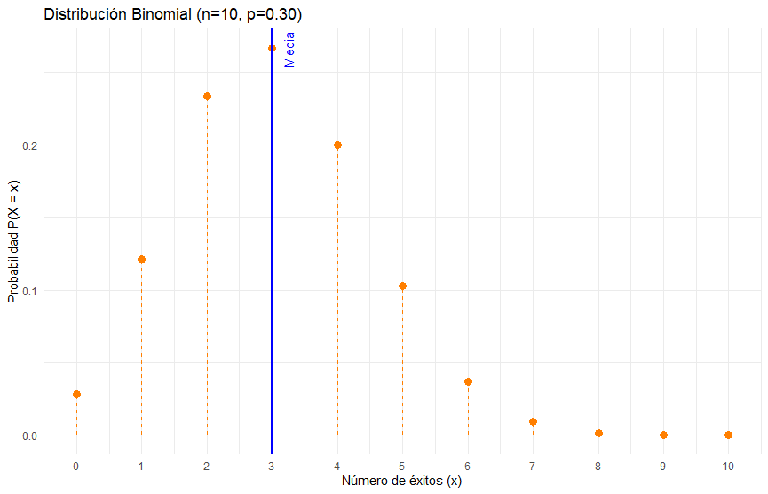

```{r setup, include=FALSE}
knitr::opts_chunk$set(echo = TRUE, message = FALSE, warning = FALSE, comment = NA)

```

<br/><br/><br/>

Los modelos probabilísticos discretos, como la distribución de **Poisson** y la **hipergeométrica**, permiten describir situaciones donde las variables aleatorias toman valores enteros en contextos específicos. Mientras que una función de probabilidad simple asigna una probabilidad a cada resultado posible, los modelos probabilísticos establecen estructuras que reflejan patrones subyacentes en los datos. Por ejemplo, la distribución de **Poisson** modela la ocurrencia de eventos raros en un intervalo de tiempo o espacio, mientras que la distribución **hipergeométrica** es útil en contextos de muestreo sin reemplazo, donde la probabilidad de éxito cambia con cada extracción. Estos modelos proporcionan herramientas esenciales para el análisis de datos en áreas como la gestión de recursos, el control de calidad y la toma de decisiones basada en datos probabilísticos.


</br></br>
<h2>Introducción</h2>


Toda variable aleatoria se caracteriza por su **función de distribución de probabilidad** \( f(x) \), que describe la probabilidad de cada posible valor, y su **función de distribución acumulada** \( F(x) \), que representa la probabilidad de que la variable tome un valor menor o igual a \( x \), es decir, \( P(X \leq x) \). Además, posee medidas clave como el **valor esperado** \( E[X] \), que indica su promedio teórico, y la **varianza** \( \text{Var}(X) \), que mide su dispersión.

Cuando se trabaja con **variables aleatorias conjuntas**, se utiliza la **función de distribución conjunta** \( f_{XY}(x,y) \), que describe la probabilidad de que ambas variables tomen ciertos valores simultáneamente. También se consideran métricas importantes como el **valor esperado conjunto** \( E[XY] \), la **covarianza** \( \text{Cov}(X, Y) \), que mide la relación lineal entre ellas, y el **coeficiente de correlación** \( \rho_{XY} \), que cuantifica la intensidad y dirección de esa relación.


<br/>

A continuación, se presentan los modelos de probabilidad discreta más comunes junto con sus principales características:

| **Modelo**             | **Descripción** |
|------------------------|----------------|
| **Bernoulli**         | Modela experimentos con dos posibles resultados (éxito o fracaso). |
| **Binomial**          | Representa el número de éxitos en una secuencia de ensayos de Bernoulli independientes. |
| **Poisson**           | Modela la ocurrencia de eventos raros en un intervalo de tiempo o espacio. |
| **Hipergeométrico**   | Describe el número de éxitos en muestras extraídas sin reemplazo de una población finita. |
| **Geométrico/Pascal** | Modela el número de ensayos hasta el primer éxito en experimentos de Bernoulli repetidos. |
| **Binomial Negativa** | Generaliza el modelo geométrico para contar el número de ensayos hasta alcanzar un número determinado de éxitos. |


</br></br>
<h2>Bernoulli</h2>

Comenzaremos con el modelo **Bernoulli**, que, aunque algunos autores no lo consideran un modelo en sí mismo, es fundamental para comprender otros modelos de probabilidad discreta. Su nombre proviene del matemático **Jacob Bernoulli** y describe experimentos que cumplen las siguientes condiciones:

- Se realiza un **único ensayo**.
- El resultado del ensayo puede ser uno de dos posibles valores: **éxito** (E) o **fracaso** (F).
- La **probabilidad de éxito** es \( p \), mientras que la **probabilidad de fracaso** es \( 1 - p = q \).

</br>
<h3>Distribución Bernoulli</h3>

La variable aleatoria de interés, \( X \), toma únicamente los valores **0** o **1**, donde:

- \( X = 1 \) indica que el resultado del ensayo es un **éxito**.
- \( X = 0 \) indica que el resultado del ensayo es un **fracaso**.


Sus principales características son:

- **Rango**: \( R_{X} = \{0,1\} \).
- **Función de distribución de probabilidad**:

  \[
  f(x) =
  \begin{cases} 
  p, & \text{si } x=1 \\  
  q, & \text{si } x=0  
  \end{cases}
  \]

- **Valor esperado**:

  \[
  E[X] = p
  \]

- **Varianza**:

  \[
  \text{Var}(X) = pq
  \]

Este modelo es la base de distribuciones más complejas, como la **Binomial**, y se aplica en diversas áreas, incluyendo pruebas de calidad, estudios médicos y procesos de decisión binaria.


</br></br>
<h2>Binomial</h2>

El modelo **Binomial** puede considerarse una generalización del modelo de Bernoulli, extendiendo el análisis de un único ensayo a \( n \) ensayos independientes. Este modelo fue estudiado y analizado por **Jacob Bernoulli** en el contexto de problemas en juegos de azar, y su trabajo fue publicado en 1713.

En un **experimento binomial**:

- Se realizan \( n \) ensayos idénticos e independientes.
- Cada ensayo tiene dos posibles resultados: **éxito** (E) o **fracaso** (F).
- La probabilidad de éxito en cada ensayo es \( p \), y la probabilidad de fracaso es \( q = 1 - p \).
- La variable aleatoria de interés, \( X \), representa el número total de éxitos en los \( n \) ensayos.

Este modelo es ampliamente utilizado en situaciones donde se cuentan ocurrencias de un evento en un número fijo de intentos, como estudios de calidad, ensayos clínicos y encuestas de opinión.
 

</br></br>
<h3>Distribución Binomial</h3>

La función de distribución de probabilidad del modelo Binomial que indica que $X \sim Binom(x,n,p)$ está dada por:

\[
 f(x) =
 \begin{cases} 
 \displaystyle\binom{n}{x} p^{x} (1-p)^{n-x}, & x=0,1,2, \dots, n  \\
 0, & \text{en otro caso}
 \end{cases}
\]

Las principales propiedades de la distribución Binomial son:

- **Valor esperado**:
  \[
  E[X] = np
  \]

- **Varianza**:
  \[
 \text{Var}(X) = np(1 - p)
  \]

</br></br>
<div class="caja-ejemplo">
<h3>Ejemplo:</h3>
<p>

La **Figura 2.20** muestra la distribución de una variable aleatoria que sigue una distribución **Binomial**, con parámetros \( X \sim Binom(n=10, p=0.30) \). Esta figura permite visualizar cómo se distribuyen las probabilidades de los distintos valores posibles de \( X \).

<pre>
# Cargar la librería ggplot2
library(ggplot2)

# Definir los valores de la variable x (número de éxitos en 10 ensayos)
x <- 0:10

# Calcular la función de masa de probabilidad de la distribución binomial
# con parámetros n = 10 y p = 0.30
fx <- dbinom(x, 10, 0.30)

# Crear un data frame con los valores de x y sus respectivas probabilidades fx
dat <- data.frame(x, fx)

# Crear el gráfico usando ggplot2
plotBin1<-ggplot(dat, aes(x = x, y = fx)) + 
  # Agregar líneas verticales desde el eje x hasta cada punto para mayor claridad
  geom_segment(aes(x = x, xend = x, y = 0, yend = fx), 
               color = "#FF7F00", linetype = "dashed") + 
  # Agregar los puntos representando la función de probabilidad
  geom_point(color = "#FF7F00", size = 3) +
  # Configurar el eje x para mostrar solo los valores enteros de 0 a 10
  scale_x_continuous(breaks = 0:10) +
  # Agregar etiquetas descriptivas a los ejes y un título al gráfico
  labs(title = "Distribución Binomial (n=10, p=0.30)", 
       x = "Número de éxitos (x)", 
       y = "Probabilidad P(X = x)") +
  # Aplicar un tema minimalista para una mejor presentación del gráfico
  theme_minimal()

print(plotBin1)
</pre>

```{r, echo=TRUE, fig.height=3.5}
# Cargar la librería ggplot2
library(ggplot2)

# Definir los valores de la variable x (número de éxitos en 10 ensayos)
x <- 0:10

# Calcular la función de masa de probabilidad de la distribución binomial
# con parámetros n = 10 y p = 0.30
fx <- dbinom(x, 10, 0.30)

# Crear un data frame con los valores de x y sus respectivas probabilidades fx
dat <- data.frame(x, fx)

# Crear el gráfico usando ggplot2
plotBin1<-ggplot(dat, aes(x = x, y = fx)) + 
  # Agregar líneas verticales desde el eje x hasta cada punto para mayor claridad
  geom_segment(aes(x = x, xend = x, y = 0, yend = fx), 
               color = "#FF7F00", linetype = "dashed") + 
  # Agregar los puntos representando la función de probabilidad
  geom_point(color = "#FF7F00", size = 3) +
  # Configurar el eje x para mostrar solo los valores enteros de 0 a 10
  scale_x_continuous(breaks = 0:10) +
  # Agregar etiquetas descriptivas a los ejes y un título al gráfico
  labs(title = "Distribución Binomial (n=10, p=0.30)", 
       x = "Número de éxitos (x)", 
       y = "Probabilidad P(X = x)") +
  # Aplicar un tema minimalista para una mejor presentación del gráfico
  theme_minimal()

# print(plotBin1)
```


<br/><br/>
<center>
```{r, echo=FALSE, out.width="80%", fig.align = "center"}

```
**Figura 2.20** Distribución $X \sim Binom(x,n=10, p=0.30)$
</center>
<br/><br/>

Por otro lado, la **Figura 2.21** representa la distribución de 12 muestras aleatorias (1000 grupos de $n$=10) extraídas de una distribución binomial con los mismos parámetros. Se puede notar que las formas de las muestras no siempre coinciden exactamente con la distribución original, lo que refleja la variabilidad natural inherente al muestreo. 

<pre>
# Cargar las librerías necesarias
library(ggplot2)

# Definir los parámetros de la distribución binomial
n <- 10   # Número de ensayos
p <- 0.30 # Probabilidad de éxito
muestras <- 12  # Número de muestras
numero.grupos.n<-1000

# Generar 12 muestras aleatorias de tamaño n=10
set.seed(123)  # Fijar semilla para reproducibilidad
data_list <- lapply(1:muestras, function(i) {
  x <- rbinom(numero.grupos.n, n, p)  # Generar una muestra de 10 valores
  data.frame(x = x, sample = paste("Muestra", i))
})

# Unir todas las muestras en un solo data frame
data <- do.call(rbind, data_list)

# Crear el gráfico con facet_wrap() para organizar en 4x3
plot_muestras<-ggplot(data, aes(x = x)) +
  geom_bar(fill = "#FF7F00", color = "black") +  # Graficos de cada muestra
  facet_wrap(~sample, nrow = 4, ncol = 3) +  # Organizar en una cuadrícula de 4x3
  labs(title = "Muestras aleatorias de la Distribución Binomial (n=10, p=0.30)",
       x = "Número de éxitos",
       y = "Frecuencia") +
  theme_minimal()  # Estilo limpio para mejor presentación

print(plot_muestras)
</pre>

```{r, echo=TRUE}
# Cargar las librerías necesarias
library(ggplot2)

# Definir los parámetros de la distribución binomial
n <- 10   # Número de ensayos
p <- 0.30 # Probabilidad de éxito
muestras <- 12  # Número de muestras
numero.grupos.n<-1000

# Generar 12 muestras aleatorias de tamaño n=10
set.seed(123)  # Fijar semilla para reproducibilidad
data_list <- lapply(1:muestras, function(i) {
  x <- rbinom(numero.grupos.n, n, p)  # Generar una muestra de 10 valores
  data.frame(x = x, sample = paste("Muestra", i))
})

# Unir todas las muestras en un solo data frame
data <- do.call(rbind, data_list)

# Crear el gráfico con facet_wrap() para organizar en 4x3
plot_muestras<-ggplot(data, aes(x = x)) +
  geom_bar(fill = "#FF7F00", color = "black") +  # Graficos de cada muestra
  facet_wrap(~sample, nrow = 4, ncol = 3) +  # Organizar en una cuadrícula de 4x3
  labs(title = "Muestras aleatorias de la Distribución Binomial (n=10, p=0.30)",
       x = "Número de éxitos",
       y = "Frecuencia") +
  theme_minimal()  # Estilo limpio para mejor presentación

# print(plot_muestras)
```

<br/><br/>
<center>
```{r, echo=FALSE, out.width="80%", fig.align = "center"}

```
**Figura 2.21** Distribución de 12 muestras aleatorias (tamaño 1000) extraídas de una distribución binomial $X \sim Binom(x,n=10, p=0.30)$.
</center>
<br/><br/>

</p>
</div>


</br></br>
<h2>Poisson</h2>

El modelo de **Poisson** fue propuesto por el físico y matemático francés **Siméon-Denis** Poisson en un trabajo publicado en 1838, en el cual abordó aplicaciones relacionadas con procesos judiciales en ámbitos criminales y civiles. Este modelo es ampliamente utilizado para describir la ocurrencia de eventos en un intervalo de tiempo o espacio, particularmente cuando estos suceden de manera aleatoria e independiente. Algunos ejemplos de su aplicación incluyen:

- El número de llamadas recibidas por un conmutador en el transcurso de una hora.  
- La cantidad de plaquetas por $mm^{3}$ de sangre.  
- El número de solicitudes de servicio técnico registradas diariamente.  
- La cantidad de imperfecciones por $m^{2}$ de carretera.

</br></br>
<h3>Proceso de Poisson</h3>

Un **proceso de Poisson** es un modelo matemático utilizado para describir la ocurrencia de eventos en el tiempo o en el espacio de manera aleatoria, pero con una tasa promedio constante. Es ampliamente empleado en disciplinas como la estadística, la ingeniería, la física y la biología, entre otras.  

Formalmente, un proceso de Poisson $\{N(t), t \geq 0\}$ es un proceso estocástico que cumple con las siguientes propiedades:  

1. **Incrementos independientes:** El número de eventos ocurridos en intervalos de tiempo disjuntos es independiente entre sí.  
2. **Incrementos estacionarios:** La probabilidad de que un número específico de eventos ocurra en un intervalo de tiempo depende solo de la longitud del intervalo y no de su ubicación en la línea temporal.  
3. **Distribución de Poisson:** El número de eventos en un intervalo de longitud $t$ sigue una distribución de Poisson con parámetro $\lambda t$, donde $\lambda$ es la tasa promedio de ocurrencia de eventos por unidad de tiempo:  
   $$
   P(N(t) = k) = \frac{(\lambda t)^k e^{-\lambda t}}{k!}, \quad k = 0, 1, 2, \dots
   $$  
4. **Ausencia de eventos simultáneos:** La probabilidad de que más de un evento ocurra en un intervalo infinitesimal es despreciable.  

El **proceso de Poisson homogéneo** se caracteriza por una tasa de ocurrencia constante ($\lambda$), mientras que en un **proceso de Poisson no homogéneo**, esta tasa varía en el tiempo, es decir, $\lambda(t)$.


</br></br>
<h3>Distribución Poisson</h3>

La **función de masa de probabilidad** de una variable aleatoria $X$ que sigue una distribución de Poisson, denotada como $X \sim \text{Poisson}(\lambda)$, está dada por la siguiente expresión:

$$
 f(x) = \begin{cases} 
 \frac{\lambda^x}{x!} e^{-\lambda}, & x \geq 0, \quad x \in \mathbb{N} \\ 
 0, & \text{en otro caso} 
 \end{cases}
$$

donde $\lambda > 0$ representa el número promedio de ocurrencias en el intervalo de interés.  

La variable objeto de estudio $X$ es el **número de eventos que ocurren por unidad de tiempo, longitud, superficie o volumen**, dependiendo del contexto de aplicación.  

Las propiedades fundamentales de esta distribución son:  

- **Valor esperado:**  
  $$
  E[X] = \lambda
  $$  
- **Varianza:**  
  $$
  \text{Var}(X) = \lambda
  $$


</br></br>
<div class="caja-ejemplo">
<h3>Ejemplo:</h3>
<p>

La **Figura 2.22** muestra la distribución de una variable aleatoria que sigue una **distribución de Poisson** con parámetro \( X \sim Poiss(\lambda=2) \). Esta figura permite visualizar cómo se distribuyen las probabilidades de los distintos valores posibles de \( X \), reflejando la naturaleza discreta de este modelo.


<pre>
# Cargar la librería ggplot2
library(ggplot2)

# Definir valores para la distribución de Poisson con lambda = 2
x <- 0:10                 # Valores posibles de la variable aleatoria
fx <- dpois(x, lambda = 2) # Calcular la función de masa de probabilidad

# Crear un data frame con los valores de x y sus respectivas probabilidades fx
dat <- data.frame(x, fx)

# Crear el gráfico usando ggplot2
plot_poiss1<-ggplot(dat, aes(x = x, y = fx)) + 
  # Agregar líneas verticales para representar la función de probabilidad
  geom_segment(aes(x = x, xend = x, y = 0, yend = fx), 
               color = "#FF7F00", linetype = "dashed") + 
  # Agregar los puntos de la función de probabilidad
  geom_point(color = "#FF7F00", size = 3) +
  # Configurar el eje x para mostrar valores enteros de 0 a 10
  scale_x_continuous(breaks = 0:10) +
  # Agregar etiquetas y título descriptivo
  labs(title = "Distribución de Poisson (λ = 2)", 
       x = "Número de eventos (x)", 
       y = "Probabilidad P(X = x)") +
  # Aplicar un tema minimalista para mejor presentación
  theme_minimal()

print(plot_poiss1)
</pre>


```{r, echo=TRUE, fig.height=3.5}
# Cargar la librería ggplot2
library(ggplot2)

# Definir valores para la distribución de Poisson con lambda = 2
x <- 0:10                 # Valores posibles de la variable aleatoria
fx <- dpois(x, lambda = 2) # Calcular la función de masa de probabilidad

# Crear un data frame con los valores de x y sus respectivas probabilidades fx
dat <- data.frame(x, fx)

# Crear el gráfico usando ggplot2
plot_poiss1<-ggplot(dat, aes(x = x, y = fx)) + 
  # Agregar líneas verticales para representar la función de probabilidad
  geom_segment(aes(x = x, xend = x, y = 0, yend = fx), 
               color = "#FF7F00", linetype = "dashed") + 
  # Agregar los puntos de la función de probabilidad
  geom_point(color = "#FF7F00", size = 3) +
  # Configurar el eje x para mostrar valores enteros de 0 a 10
  scale_x_continuous(breaks = 0:10) +
  # Agregar etiquetas y título descriptivo
  labs(title = "Distribución de Poisson (λ = 2)", 
       x = "Número de eventos (x)", 
       y = "Probabilidad P(X = x)") +
  # Aplicar un tema minimalista para mejor presentación
  theme_minimal()

# print(plot_poiss1)
```


<br/><br/>
<center>
```{r, echo=FALSE, out.width="80%", fig.align = "center"}
knitr::include_graphics("img/fig222.png")
```
**Figura 2.22**  Función de distribución Poisson $X \sim Poiss(x,\lambda=2)$
</center>
<br/><br/>

Por otro lado, la **Figura 2.23** ilustra la distribución de 12 muestras aleatorias de tamaño 1000 extraídas de una distribución de Poisson con los mismos parámetros. Se puede observar que las formas de las muestras presentan variabilidad respecto a la distribución original, lo que es una manifestación natural del muestreo aleatorio. Adicionalmente, la media muestral se encuentra cercana al valor 2, correspondiente a la esperanza matemática de la distribución, aunque no coincide exactamente debido a la variabilidad inherente del muestreo.

<pre>
# Cargar las librerías necesarias
library(ggplot2)
library(dplyr)

# Definir los parámetros de la distribución Poisson
lambda <- 2  # Valor esperado (λ)
muestras <- 12  # Número de muestras a generar
n_muestra <- 1000  # Tamaño de cada muestra

# Fijar semilla para reproducibilidad
set.seed(123)

# Generar 12 muestras aleatorias y calcular su media muestral
data_list <- lapply(1:muestras, function(i) {
  x <- rpois(n_muestra, lambda)  # Generar 10 valores desde Poisson(2)
  media_muestral <- mean(x)  # Calcular la media muestral
  
  # Crear un data frame con la muestra y su identificador
  data.frame(x = x, sample = paste("Muestra", i, "\n", "x̄ =", round(media_muestral, 2)))
})

# Unir todas las muestras en un solo data frame
data <- do.call(rbind, data_list)

# Crear el gráfico de barras con facet_wrap() en 4 filas x 3 columnas
plot_poiss2 <- ggplot(data, aes(x = x)) +
  geom_bar(fill = "#FF7F00", color = "black") +  # Histogramas de cada muestra
  facet_wrap(~sample, nrow = 4, ncol = 3) +  # Organizar en 4x3
  labs(title = "Muestras aleatorias de la Distribución de Poisson (λ = 2)",
       x = "Numero de eventos",  # SIN TILDE para evitar errores
       y = "Frecuencia") +
  theme_minimal()  # Aplicar estilo limpio

# Mostrar el gráfico
print(plot_poiss2)
</pre>

```{r, echo=TRUE, fig.height=3.5}
# Cargar las librerías necesarias
library(ggplot2)
library(dplyr)

# Definir los parámetros de la distribución Poisson
lambda <- 2  # Valor esperado (λ)
muestras <- 12  # Número de muestras a generar
n_muestra <- 1000  # Tamaño de cada muestra

# Fijar semilla para reproducibilidad
set.seed(123)

# Generar 12 muestras aleatorias y calcular su media muestral
data_list <- lapply(1:muestras, function(i) {
  x <- rpois(n_muestra, lambda)  # Generar 10 valores desde Poisson(2)
  media_muestral <- mean(x)  # Calcular la media muestral
  
  # Crear un data frame con la muestra y su identificador
  data.frame(x = x, sample = paste("Muestra", i, "\n", "x̄ =", round(media_muestral, 2)))
})

# Unir todas las muestras en un solo data frame
data <- do.call(rbind, data_list)

# Crear el gráfico de barras con facet_wrap() en 4 filas x 3 columnas
plot_poiss2 <- ggplot(data, aes(x = x)) +
  geom_bar(fill = "#FF7F00", color = "black") +  # Histogramas de cada muestra
  facet_wrap(~sample, nrow = 4, ncol = 3) +  # Organizar en 4x3
  labs(title = "Muestras aleatorias de la Distribución de Poisson (λ = 2)",
       x = "Numero de eventos",  # SIN TILDE para evitar errores
       y = "Frecuencia") +
  theme_minimal()  # Aplicar estilo limpio

# Mostrar el gráfico
#print(plot_poiss2)
```

<br/><br/>
<center>
```{r, echo=FALSE, out.width="80%", fig.align = "center"}
knitr::include_graphics("img/fig223.png")
```
**Figura 2.23** Distribución de 12 muestras aleatorias (de tamaño 1000) extraídas de una distribución de Poisson $X \sim Poiss(x,\lambda=2)$.
</center>
<br/><br/>


</p>
</div>


</br></br>
<h2>Hipergeométrico</h2>

El modelo **hipergeométrico** surge de la necesidad de representar eventos de Bernoulli con probabilidad variable, característicos de selecciones sin reemplazo. Su desarrollo se remonta a los trabajos de **Carl Friedrich Gauss**, con contribuciones posteriores de **Pierre-Simon Laplace** y **Siméon Denis Poisson** en el estudio de probabilidades en poblaciones finitas. Esta distribución es fundamental en aplicaciones como el control de calidad, el muestreo estadístico y la genética de poblaciones, donde es crucial estimar la probabilidad de obtener ciertos elementos dentro de una muestra finita.


</br></br>
<h3>Distribución Hipergeométrica</h3>

La distribución **Hipergeométrica** se utiliza para modelar el muestreo sin reemplazo. Se define con los parámetros:

- \( m \): Número de elementos clasificados como éxitos en la población.
- \( n \): Número de elementos clasificados como fracasos en la población.
- \( k \): Tamaño de la muestra extraída.

En esta parametrización, el tamaño total de la población es \( N = m + n \). La variable aleatoria \( X \) representa el número de éxitos en la muestra extraída.

La **función de masa de probabilidad** para $X \sim Hiper(x, m, n, k) está dada por:

\[
 f(x) =
 \begin{cases} 
 \dfrac{\binom{m}{x} \binom{n}{k-x}}{\binom{m+n}{k}}, & \text{si } \max(0, k-n) \leq x \leq \min(k, m)  \\
 0, & \text{en otro caso}
 \end{cases}
\]

Las principales propiedades de esta distribución son:

- **Valor esperado (media):**
  \[
  E[X] = k \cdot p, \quad \text{donde } p = \frac{m}{m+n}.
  \]

- **Varianza:**
  \[
  \text{Var}(X) = k p (1 - p) \cdot \frac{m+n-k}{m+n-1}.
  \]

Esta expresión muestra la relación entre la distribución hipergeométrica y la binomial \( B(k, p) \), siendo la hipergeométrica más concentrada (menor varianza) cuando \( k > 1 \). La distribución hipergeométrica es útil en contextos donde la población es finita y el muestreo se realiza sin reemplazo, como en controles de calidad, estudios ecológicos y auditorías de muestreo.


</br></br>
<div class="caja-ejemplo">
<h3>Ejemplo:</h3>
<p>

La **Figura 2.24** representa la distribución de una variable aleatoria que sigue una **distribución hipergeométrica**, denotada como $X \sim \text{Hiper}(x, m=95, n=5, k=10)$. Esta visualización ilustra la asignación de probabilidades a los distintos valores posibles de $X$, destacando la naturaleza discreta de este modelo probabilístico.  

<pre>
# Cargar la librería ggplot2
library(ggplot2)

# Definir los parámetros de la distribución hipergeométrica
m <- 95  # Tamaño de la población
n <- 5   # Número de éxitos en la población
k <- 10  # Tamaño de la muestra

# Valores posibles de la variable aleatoria X (de 0 a min(n, k))
x <- 0:min(n, k)

# Calcular la función de masa de probabilidad (FMP) para la distribución hipergeométrica
fx <- dhyper(x, n, m - n, k)

# Crear un data frame con los valores de x y sus respectivas probabilidades fx
dat <- data.frame(x, fx)

# Crear el gráfico usando ggplot2
plot_hip1<-ggplot(dat, aes(x = x, y = fx)) + 
  # Agregar líneas verticales para representar la función de probabilidad
  geom_segment(aes(x = x, xend = x, y = 0, yend = fx), 
               color = "#FF7F00", linetype = "dashed") + 
  # Agregar los puntos de la función de probabilidad
  geom_point(color = "#FF7F00", size = 3) +
  # Configurar el eje x para mostrar solo los valores discretos posibles
  scale_x_continuous(breaks = x) +
  # Agregar etiquetas y título descriptivo con notación matemática
  labs(title = expression("Distribución Hipergeométrica"),
       x = expression("Número de éxitos en la muestra (X)"),
       y = expression(P(X == x)),
       caption = expression(X %~% Hipergeometrica(95, 5, 10))) +
  # Aplicar un tema minimalista para mejor presentación
  theme_minimal()

print(plot_hip1)
</pre>

```{r, echo=TRUE, fig.height=3.5}
# Cargar la librería ggplot2
library(ggplot2)

# Definir los parámetros de la distribución hipergeométrica
m <- 95  # Tamaño de la población
n <- 5   # Número de éxitos en la población
k <- 10  # Tamaño de la muestra

# Valores posibles de la variable aleatoria X (de 0 a min(n, k))
x <- 0:min(n, k)

# Calcular la función de masa de probabilidad (FMP) para la distribución hipergeométrica
fx <- dhyper(x, n, m - n, k)

# Crear un data frame con los valores de x y sus respectivas probabilidades fx
dat <- data.frame(x, fx)

# Crear el gráfico usando ggplot2
plot_hip1<-ggplot(dat, aes(x = x, y = fx)) + 
  # Agregar líneas verticales para representar la función de probabilidad
  geom_segment(aes(x = x, xend = x, y = 0, yend = fx), 
               color = "#FF7F00", linetype = "dashed") + 
  # Agregar los puntos de la función de probabilidad
  geom_point(color = "#FF7F00", size = 3) +
  # Configurar el eje x para mostrar solo los valores discretos posibles
  scale_x_continuous(breaks = x) +
  # Agregar etiquetas y título descriptivo con notación matemática
  labs(title = expression("Distribución Hipergeométrica"),
       x = expression("Número de éxitos en la muestra (X)"),
       y = expression(P(X == x)),
       caption = expression(X %~% Hipergeometrica(95, 5, 10))) +
  # Aplicar un tema minimalista para mejor presentación
  theme_minimal()

# print(plot_hip1)
```

<br/><br/>
<center>
```{r, echo=FALSE, out.width="80%", fig.align = "center"}
knitr::include_graphics("img/fig224.png")
```
**Figura 2.24** Función de distribución hipergeométrica $X \sim Hiper(x, m=95, n=5, k=10)$.
</center>
<br/><br/>

Por otra parte, la **Figura 2.25** ilustra la distribución de 12 muestras aleatorias de tamaño 1000 (100 grupos de $n$ observaciones) extraídas de una distribución **hipergeométrica** con los mismos parámetros. Se puede observar que las formas de las muestras presentan variabilidad respecto a la distribución original, lo que es una manifestación natural del muestreo aleatorio. Adicionalmente, la media muestral se encuentra cercana en algunos casos al valor 0.526, correspondiente a la esperanza matemática de la distribución, aunque no coincide exactamente debido a la variabilidad inherente del muestreo. 

<pre>
# Cargar las librerías necesarias
library(ggplot2)
library(dplyr)

# Definir los parámetros de la distribución hipergeométrica
m <- 95  # Tamaño de la población
n <- 5   # Número de éxitos en la población
k <- 10  # Tamaño de la muestra
muestras <- 12  # Número de muestras a generar
n.muestras<-1000 # Número de grupos de tamaño n

# Fijar semilla para reproducibilidad
set.seed(123)

# Generar 12 muestras aleatorias y calcular su media muestral
data_list <- lapply(1:muestras, function(i) {
  x <- rhyper(n.muestras, n, m - n, k)  # Generar 10 valores desde la distribución hipergeométrica
  media_muestral <- mean(x)  # Calcular la media muestral
  
  # Crear un data frame con la muestra y su identificador
  data.frame(x = x, sample = paste("Muestra", i, "\n", "x̄ =", round(media_muestral, 2)))
})

# Unir todas las muestras en un solo data frame
data <- do.call(rbind, data_list)

# Crear el gráfico de barras con facet_wrap() en 4 filas x 3 columnas
plot_hyper <- ggplot(data, aes(x = x)) +
  geom_bar(fill = "#FF7F00", color = "black") +  # Histogramas de cada muestra
  facet_wrap(~sample, nrow = 4, ncol = 3) +  # Organizar en 4x3
  labs(title = "Muestras aleatorias de la Distribución Hipergeométrica",
       x = "Número de éxitos en la muestra (X)",
       y = "Frecuencia") +
  theme_minimal()  # Aplicar estilo limpio

# Mostrar el gráfico
print(plot_hyper)
</pre>


```{r, echo=TRUE, fig.height=3.5}
# Cargar las librerías necesarias
library(ggplot2)
library(dplyr)

# Definir los parámetros de la distribución hipergeométrica
m <- 95  # Tamaño de la población
n <- 5   # Número de éxitos en la población
k <- 10  # Tamaño de la muestra
muestras <- 12  # Número de muestras a generar
n.muestras<-1000 # Número de grupos de tamaño n

# Fijar semilla para reproducibilidad
set.seed(123)

# Generar 12 muestras aleatorias y calcular su media muestral
data_list <- lapply(1:muestras, function(i) {
  x <- rhyper(n.muestras, n, m - n, k)  # Generar 10 valores desde la distribución hipergeométrica
  media_muestral <- mean(x)  # Calcular la media muestral
  
  # Crear un data frame con la muestra y su identificador
  data.frame(x = x, sample = paste("Muestra", i, "\n", "x̄ =", round(media_muestral, 2)))
})

# Unir todas las muestras en un solo data frame
data <- do.call(rbind, data_list)

# Crear el gráfico de barras con facet_wrap() en 4 filas x 3 columnas
plot_hyper <- ggplot(data, aes(x = x)) +
  geom_bar(fill = "#FF7F00", color = "black") +  # Histogramas de cada muestra
  facet_wrap(~sample, nrow = 4, ncol = 3) +  # Organizar en 4x3
  labs(title = "Muestras aleatorias de la Distribución Hipergeométrica",
       x = "Número de éxitos en la muestra (X)",
       y = "Frecuencia") +
  theme_minimal()  # Aplicar estilo limpio

# Mostrar el gráfico
#print(plot_hyper)
```


<br/><br/>
<center>
```{r, echo=FALSE, out.width="80%", fig.align = "center"}

```
**Figura 2.25** Distribución de 12 muestras aleatorias extraídas de una distribución  $X \sim Hiper(x, m=95, n=5, k=10)$.
</center>
<br/><br/>

El valor esperado de una variable aleatoria $X$ con distribución hipergeométrica $X \sim \text{Hiper}(x, m=95, n=5, k=10)$ se calcula como:  

$$
E[X] = k \times \frac{n}{m} = 0.526
$$
<pre>
# Parámetros de la distribución hipergeométrica
m <- 95  # Tamaño de la población
n <- 5   # Número de éxitos en la población
k <- 10  # Tamaño de la muestra

# Cálculo del valor esperado
E_X <- k * (n / m)
E_X
</pre>

```{r calcular_esperanza, echo=TRUE}
# Parámetros de la distribución hipergeométrica
m <- 95  # Tamaño de la población
n <- 5   # Número de éxitos en la población
k <- 10  # Tamaño de la muestra

# Cálculo del valor esperado
E_X <- k * (n / m)
E_X
```


</p>
</div>


</br></br>
<h2>Geométrica o de Pascal</h2>

La **distribución geométrica**, también conocida como **distribución de Pascal**, fue introducida por **Jacob Bernoulli** en su obra *Ars Conjectandi* (*El arte de la conjetura*), publicada póstumamente en **1713**. Esta distribución modela el número de ensayos de Bernoulli necesarios hasta la ocurrencia del primer éxito en una secuencia de ensayos independientes con probabilidad de éxito $p$.  

Algunas de las aplicaciones más relevantes de la distribución geométrica incluyen:  

- **Modelado del tiempo de espera hasta el primer evento de interés**, como el número de intentos requeridos para obtener un resultado exitoso en un experimento o proceso.  
- **Sistemas de fiabilidad y mantenimiento**, donde representa el número de ciclos hasta la primera falla de un componente.  
- **Procesos de servicio y atención al cliente**, como el número de llamadas hasta obtener una respuesta positiva en un centro de soporte.  
- **Modelos de supervivencia**, aplicados en biomedicina para representar el número de tratamientos hasta la primera remisión de una enfermedad.  


Los valores que puede tomar esta variable aleatoria $X$ se detallan en la siguiente tabla:  

|	$x$   | Eventos          |  $f(x)$       |                
|:------|:-----------------|:--------------|
|	$1$   |  $E$             | $p$           |
|	$2$   |  $FE$            | $p(1-p)$      |
|	$3$   |  $FFE$           | $p(1-p)^{2}$  |
|	$4$   |  $FFFE$          | $p(1-p)^{3}$  |
|	$5$   |  $FFFFE$         | $p(1-p)^{4}$  |
| $\vdots$|$\vdots$        | $\vdots$      |
|	$x$   |  $FFFF \ldots FE$ | $p(1-p)^{x-1}$|  

La variable aleatoria $X$ toma el valor $1$ si el éxito ocurre en el primer intento. Si el primer éxito ocurre en el segundo ensayo, entonces $X = 2$, y así sucesivamente. En términos generales, la variable geométrica representa **el número de ensayos necesarios hasta la ocurrencia del primer éxito**.


</br></br>
<h3>Distribución Geométrica</h3>

La función de masa de probabilidad de una variable aleatoria $X$ que sigue una distribución **geométrica**, denotada como $X \sim \text{Geom}(p)$, está dada por:  

$$
 f(x) =
 \begin{cases} 
 (1 - p)^{x} p, & x \geq 0, \quad x \in \mathbb{N} \\ 
 0, & \text{en otro caso}
 \end{cases}
$$  

donde $p$ es la probabilidad de éxito en cada ensayo independiente.  


Las principales propiedades de esta distribución son: 

- **Valor esperado:**  
  $$
  E[X] = \frac{1 - p}{p}
  $$  
- **Varianza:**  
  $$
  \text{Var}(X) = \frac{1 - p}{p^2}
  $$  

En la **parametrización de la distribución geométrica en el software R**, que es la que se prsenta en esta sección, la variable aleatoria $X$ representa **el número de fracasos antes de observar el primer éxito** en una secuencia de ensayos de Bernoulli independientes con probabilidad de éxito $p$.  

Esto significa que:  

- Si $X = 0$, el éxito ocurre en el primer ensayo.  
- Si $X = 1$, hubo un fracaso antes de que ocurriera el éxito en el segundo ensayo.  
- Si $X = 2$, hubo dos fracasos antes de que ocurriera el éxito en el tercer ensayo.  
- Y así sucesivamente.  

En términos de su función de masa de probabilidad, la probabilidad de que haya exactamente $x$ fracasos antes del primer éxito es:  

$$
 P(X = x) = (1 - p)^x p, \quad x = 0, 1, 2, \dots
$$  

**Diferencia con la parametrización clásica**  

En algunos textos y aplicaciones matemáticas, la distribución geométrica se define como el **número total de ensayos hasta el primer éxito**, es decir, contando también el éxito. En este caso, la variable $X$ toma valores $x \geq 1$ y la función de masa de probabilidad se expresa como:  

$$
 P(X = x) = p(1 - p)^{x - 1}, \quad x = 1, 2, 3, \dots
$$  

Sin embargo, **R utiliza la primera parametrización** (número de fracasos antes del éxito), lo cual es importante tener en cuenta al utilizar funciones como `dgeom(x, p)`, `pgeom(x, p)`, etc.

<br/><br/>


</br></br>
<h2>Binomial Negativa</h2>


La **distribución binomial negativa**  modela el número de ensayos requeridos hasta alcanzar un número fijo de éxitos en un experimento de Bernoulli. A diferencia de la binomial, que cuenta el número de éxitos en un número fijo de ensayos, la binomial negativa cuenta el número de intentos necesarios para obtener un número determinado de éxitos.

Este modelo probabilístico fue introducido en el siglo XIX y ha sido ampliamente utilizado en diversas disciplinas. Se ha desarrollado en el contexto de los juegos de azar y el análisis de conteos de eventos raros. Su nombre proviene de su relación con la distribución binomial, ya que puede derivarse utilizando combinatoria y probabilidades condicionales.

Entre las aplicaciones principales se tiene:

- **Biología y epidemiología:** Modela la cantidad de intentos hasta que un individuo contrae una enfermedad o hasta que un cierto número de células muten.
- **Economía y finanzas:** Se emplea para describir la duración de períodos de crisis financieras o la cantidad de intentos hasta alcanzar un objetivo financiero.
- **Calidad y confiabilidad:** Se usa en procesos industriales para modelar el número de unidades inspeccionadas hasta encontrar un número determinado de defectuosas.
- **Modelado de conteos en datos dispersos:** Es útil en el análisis de datos donde la varianza es mayor que la media, lo que la hace una alternativa flexible a la distribución de Poisson.

Debido a su versatilidad, la distribución binomial negativa es una herramienta clave en el análisis de datos de conteo y en la modelización de eventos en distintas disciplinas.


</br></br>
<h3>Distribución binomial negativa</h3>

El modelo **binomial negativo**  describe el número de fracasos antes de obtener \( r \) éxitos en una secuencia de ensayos de Bernoulli independientes con probabilidad de éxito \( p \). Es ampliamente utilizada en situaciones donde se estudian eventos repetidos hasta alcanzar un número específico de éxitos.

En la parametrización utilizada en el software **R**, la función de masa de probabilidad está dada por:

\[
 f(x) =
 \begin{cases} 
 \dfrac{\Gamma(x+r)}{\Gamma(r) x!} p^r (1-p)^{x}, & \text{si } x=0, 1, 2, \dots  \\
 0, & \text{en otro caso}
 \end{cases}
\]

Donde:

- \( r \) es el número de éxitos deseados.
- \( p \) es la probabilidad de éxito en cada ensayo.
- \( X \) es el número de fracasos antes de alcanzar \( r \) éxitos.

En **R**, la función para calcular la probabilidad de la distribución binomial negativa es `dnbinom(x, size = r, prob = p)`, donde:

- `x` es el número de fracasos antes de los \( r \) éxitos.
- `size = r` es el número de éxitos requeridos.
- `prob = p` es la probabilidad de éxito en cada ensayo.

Las principales propiedades de esta distribución son:

- **Valor esperado (media):**
  \[
  E[X] = \frac{r(1-p)}{p}
  \]

- **Varianza:**
  \[
  \text{Var}(X) = \frac{r(1-p)}{p^2}
  \]


<div class="caja-actividad">
<h3>Actividad:</h3>

>
<p>
- Grafica la distribución de una variable aleatoria $X$ que sigue una distribución geométrica, eligiendo los valores de los parámetros según tu criterio. Luego, selecciona 12 muestras aleatorias y calcula el promedio y la varianza de cada una. Finalmente, compara los promedios y varianzas muestrales con el valor esperado y la varianza teórica de $X$.
-  Grafica la distribución de una variable aleatoria $X$ que sigue una distribución binomial negativa, eligiendo los valores de los parámetros de interés. Luego, selecciona 12 muestras aleatorias y calcula el promedio y la varianza muestral. Compara estos valores con la media y la varianza teórica de $X$.
</p>
>
</div>


</br></br>
<div class="caja-ejemplo">
<h3>Ejemplo:</h3>
<p>

Una fábrica de dispositivos electrónicos realiza **pruebas de calidad** a cada lote de producción. Se sabe que, en promedio, el **10% de los productos presentan defectos**. Suponiendo que la cantidad de productos defectuosos en un lote sigue una **distribución Binomial**, se realizarán varios análisis de simulación.

- Cada lote contiene **50 productos**.
- Cada producto puede estar **defectuoso** (\( X=1 \)) o **no defectuoso** (\( X=0 \)).
- La probabilidad de que un producto sea defectuoso es **\( p = 0.10 \)**.
- Si se selecciona un lote de **50 productos**, el número de productos defectuosos sigue una distribución binomial: $$ X \sim Bin(50, 0.10) $$

donde \( X \) representa la cantidad de productos defectuosos en un lote de 50 productos.


Realiza las siguientes actividades:

a) Cálculo de probabilidad teórica: Calcula la probabilidad de que en un lote de **50 productos** haya exactamente **5 defectuosos** usando la distribución binomial.

La función de probabilidad de la distribución **Binomial** se define como:

$$ P(X = k) = \binom{n}{k} p^k (1 - p)^{n - k} $$

donde:

- \( n = 50 \) es el número total de ensayos (productos en un lote).
- \( k = 5 \) es el número de éxitos (productos defectuosos).
- \( p = 0.10 \) es la probabilidad de éxito (que un producto sea defectuoso).
- \( \binom{n}{k} \) es el coeficiente binomial, que se calcula como:

$$ \binom{n}{k} = \frac{n!}{k!(n-k)!} $$

Ahora, reemplazamos los valores en la fórmula:

**Paso 1: Calcular el coeficiente binomial**

<pre>
bin_coeff <- choose(50, 5)
bin_coeff
</pre>

```{r}
bin_coeff <- choose(50, 5)
bin_coeff
```

**Paso 2: Calcular la probabilidad**

<pre>
prob_x_5 <- bin_coeff * (0.10^5) * (0.90^(50 - 5))
prob_x_5
</pre>

```{r}
prob_x_5 <- bin_coeff * (0.10^5) * (0.90^(50 - 5))
prob_x_5
```

La solución en **R** se puede calcular directamente con la función, como se muestra acontinuación:

<pre>
size <- 50  # Tamaño del lote
prob <- 0.10  # Probabilidad de defecto
x <- 5  # Número de defectuosos

p_x5 <- dbinom(x, size, prob)
p_x5
</pre>

```{r}
size <- 50  # Tamaño del lote
prob <- 0.10  # Probabilidad de defecto
x <- 5  # Número de defectuosos

p_x5 <- dbinom(x, size, prob)
p_x5
```

La probabilidad de que 5 dispositivos sean defectuosos en un lote de 50 dispositivos es 0.1849. En términos prácticos, esto significa que, si se selecciona un gran número de lotes de 50 dispositivos (por ejemplo 1000 lotes), aproximadamente el 18.5\% de esos lotes contendrán exactamente 5 dispositivos defectuosos.

b) Simulación con una muestra grande: Genera **una muestra aleatoria** de **1000 lotes**, cada uno con **50 productos**. 
Calcula la frecuencia relativa para \( X=5 \), esto es \( f_n(X=5) \). 
Compara e interpreta el resultado frente a la probabilidad teórica.

<pre>
set.seed(123)
n <- 1000  # Número de lotes
sim_data <- rbinom(n, size, prob)

# Frecuencia relativa de X = 5
f_x5 <- sum(sim_data == x) / n
f_x5
</pre>

```{r}
set.seed(123)
n <- 1000  # Número de lotes
sim_data <- rbinom(n, size, prob)

# Frecuencia relativa de X = 5
f_x5 <- sum(sim_data == x) / n
f_x5
```

La frecuencia relativa obtenida es 0.173, asegurando reproducibilidad al fijar la semilla con `set.seed(123)`, lo que permite generar la misma muestra cada vez que se ejecuta el código. Se observa que este valor se aproxima a la probabilidad teórica de 0.1849, lo cual es esperable dado que se seleccionó un gran número de lotes (en este caso, 1000 lotes). A medida que el número de lotes aumenta, la frecuencia relativa tiende a converger hacia la probabilidad teórica, en concordancia con la Ley de los Grandes Números.

c) Análisis de la variabilidad entre múltiples muestras: Genera **100 muestras independientes**, cada una con **1000 lotes**, y analiza la variabilidad de la estimación de la probabilidad. Construye un gráfico de dispersión que relacione la muestra y su frecuencia relativa, como también el valor de  la probabilidad teórica.

<pre>
muestras <- 100
freq_rel_x5 <- numeric(muestras)

for (i in 1:muestras) {
  sim_data <- rbinom(n, size, prob)
  freq_rel_x5[i] <- sum(sim_data == x) / n
}

plot(1:muestras, freq_rel_x5, xlab = "Número de muestra", ylab = "Frecuencia relativa de X=5", main = "Variabilidad de la frecuencia relativa", pch = 19)
abline(h = p_x5, col = "red", lwd = 2)
</pre>

```{r}
muestras <- 100
freq_rel_x5 <- numeric(muestras)

for (i in 1:muestras) {
  sim_data <- rbinom(n, size, prob)
  freq_rel_x5[i] <- sum(sim_data == x) / n
}

plot(1:muestras, freq_rel_x5, xlab = "Número de muestra", ylab = "Frecuencia relativa de X=5", main = "Variabilidad de la frecuencia relativa", pch = 19)
abline(h = p_x5, col = "red", lwd = 2)
```

La gráfica muestra la variabilidad de la frecuencia relativa de $X=5$ a lo largo de 100 repeticiones del experimento, donde en cada repetición se extrajeron 1000 lotes de tamaño 50. Los puntos representan la frecuencia relativa obtenida en cada repetición del experimento, mientras que la línea roja indica el valor de la probabilidad teórica de 0.1849.

Se observa que las frecuencias relativas fluctúan en torno al valor teórico de 0.1849, lo que refleja la variabilidad del muestreo. Aunque hay dispersión en las observaciones, la mayoría de los valores se concentran en un rango cercano a la probabilidad teórica. Este comportamiento es consistente con la Ley de los Grandes Números, que establece que conforme aumenta el número de repeticiones (mayor cantidad de lotes), la frecuencia relativa tiende a acercarse a la probabilidad teórica.

En conclusión, esta simulación ilustra cómo la frecuencia relativa se estabiliza cerca del valor esperado teórico, pero puede presentar fluctuaciones debido al muestreo aleatorio en cada repetición del experimento.


d) Impacto del tamaño muestral en la estimación de la probabilidad: Analiza cómo cambia la frecuencia relativa de \( X=5 \) al aumentar el tamaño de la muestra.


<pre>
tamanos_muestra <- c(5, 10, 20, 30, 40, 50, 60, 70, 80, 90, 100, 200, 300, 400, 500, 600, 700, 800, 900, 1000)
freq_tamanos <- numeric(length(tamanos_muestra))

for (i in seq_along(tamanos_muestra)) {
  sim_data <- rbinom(tamanos_muestra[i], size, prob)
  freq_tamanos[i] <- sum(sim_data == x) / tamanos_muestra[i]
}

plot(tamanos_muestra, freq_tamanos, type = "b", xlab = "Tamaño de muestra (número de lotes)", ylab = "Frecuencia relativa de X=5", main = "Impacto del tamaño muestral")
abline(h = p_x5, col = "red", lwd = 2)
</pre>


```{r}
tamanos_muestra <- c(5, 10, 20, 30, 40, 50, 60, 70, 80, 90, 100, 200, 300, 400, 500, 600, 700, 800, 900, 1000)
freq_tamanos <- numeric(length(tamanos_muestra))

for (i in seq_along(tamanos_muestra)) {
  sim_data <- rbinom(tamanos_muestra[i], size, prob)
  freq_tamanos[i] <- sum(sim_data == x) / tamanos_muestra[i]
}

plot(tamanos_muestra, freq_tamanos, type = "b", xlab = "Tamaño de muestra (número de lotes)", ylab = "Frecuencia relativa de X=5", main = "Impacto del tamaño muestral")
abline(h = p_x5, col = "red", lwd = 2)
```

El gráfico muestra el impacto del tamaño muestral en la frecuencia relativa de $X=5$ a medida que aumenta el número de lotes (cada uno con tamaño 50). La línea roja representa la probabilidad teórica de 0.1849, mientras que los puntos y la línea negra conectada indican la frecuencia relativa obtenida en cada tamaño muestral.


Para tamaños de muestra pequeños (pocos lotes), la frecuencia relativa presenta una alta variabilidad, con valores que oscilan ampliamente por encima y por debajo de la probabilidad teórica. A medida que el número de lotes aumenta, la frecuencia relativa tiende a estabilizarse alrededor de la probabilidad teórica. Se observa una menor dispersión en las estimaciones conforme aumenta el tamaño muestral.

Este comportamiento es consistente con la Ley de los Grandes Números, que establece que, a medida que se toman más muestras, la frecuencia relativa de un evento tiende a aproximarse a su probabilidad teórica. 


e) Convergencia de la media muestral: Genera **100 muestras independientes**, cada una con **1000 lotes**, y analiza la convergencia de la media muestral. 

<pre>
media_muestras <- numeric(muestras)

for (i in 1:muestras) {
  sim_data <- rbinom(n, size, prob)
  media_muestras[i] <- mean(sim_data)
}

plot(1:muestras, media_muestras, xlab = "Número de muestra", ylab = "Media muestral de defectuosos", main = "Convergencia de la media muestral", pch = 19)
abline(h = size * prob, col = "red", lwd = 2)
</pre>


```{r}
media_muestras <- numeric(muestras)

for (i in 1:muestras) {
  sim_data <- rbinom(n, size, prob)
  media_muestras[i] <- mean(sim_data)
}

plot(1:muestras, media_muestras, xlab = "Número de muestra", ylab = "Media muestral de defectuosos", main = "Convergencia de la media muestral", pch = 19)
abline(h = size * prob, col = "red", lwd = 2)
```


El gráfico representa la media muestral del número de dispositivos defectuosos en 100 muestras, donde cada muestra está compuesta por 1000 lotes de tamaño 50. La línea roja indica la media teórica esperada de 5. 

Cada punto en el gráfico representa la media de defectuosos en una de las 100 muestras de 1000 lotes. Se observa que las medias muestrales fluctúan en torno a 5, pero con variaciones ligeras entre muestras. La dispersión de los puntos es reducida y las medias tienden a agruparse muy cerca del valor teórico de 5. Este comportamiento es esperado, dado que la Ley de los Grandes Números garantiza que la media muestral converge a la media teórica conforme aumenta el tamaño de cada muestra.

f) Impacto del tamaño muestral en la media estimada: Analiza cómo la media muestral se estabiliza al aumentar el tamaño de la muestra.


<pre>
media_tamanos <- numeric(length(tamanos_muestra))

for (i in seq_along(tamanos_muestra)) {
  sim_data <- rbinom(tamanos_muestra[i], size, prob)
  media_tamanos[i] <- mean(sim_data)
}

plot(tamanos_muestra, media_tamanos, type = "b", xlab = "Tamaño de muestra (número de lotes)", ylab = "Media de defectuosos", main = "Impacto del tamaño muestral en la media")
abline(h = size * prob, col = "red", lwd = 2)
</pre>


```{r}
media_tamanos <- numeric(length(tamanos_muestra))

for (i in seq_along(tamanos_muestra)) {
  sim_data <- rbinom(tamanos_muestra[i], size, prob)
  media_tamanos[i] <- mean(sim_data)
}

plot(tamanos_muestra, media_tamanos, type = "b", xlab = "Tamaño de muestra (número de lotes)", ylab = "Media de defectuosos", main = "Impacto del tamaño muestral en la media")
abline(h = size * prob, col = "red", lwd = 2)
```

El gráfico muestra el impacto del tamaño muestral en la media, donde el eje X representa el número de lotes considerados y el eje Y la media de defectuosos observada en cada tamaño muestral. La línea roja indica la media teórica esperada de 5. 

Para tamaños de muestra pequeños (pocos lotes), la media muestral fluctúa significativamente alrededor del valor teórico. Se observan desviaciones grandes, con valores que pueden estar muy por debajo o por encima de la media esperada. A medida que el número de lotes considerados aumenta, la media muestral se acerca progresivamente al valor esperado de 5 defectuosos por lote. La variabilidad disminuye y las oscilaciones se reducen, indicando una mayor estabilidad en la estimación de la media. Esto confirma el efecto de la Ley de los Grandes Números, que establece que la media muestral converge a la media teórica cuando el tamaño muestral aumenta.

</p>
</div>