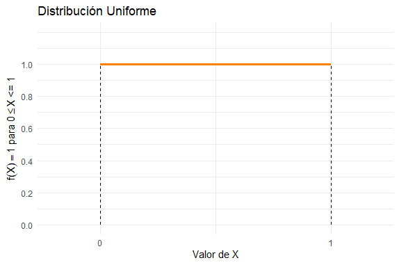
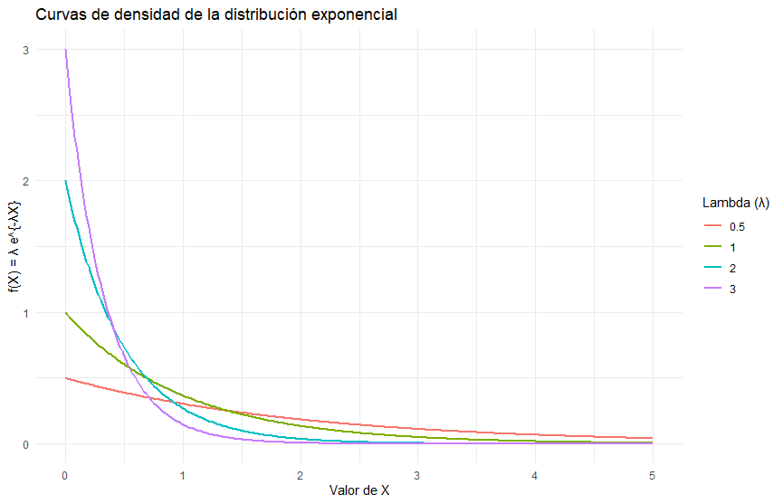

```{r setup, include=FALSE}
knitr::opts_chunk$set(echo = TRUE, message = FALSE, warning = FALSE, comment = NA)
```

Los **modelos probabilísticos continuos**, como la distribución **normal** y la **exponencial**, permiten describir fenómenos en los que las variables aleatorias pueden tomar cualquier valor dentro de un intervalo continuo. A diferencia de los modelos discretos, que asignan probabilidades a valores específicos, los modelos continuos se representan mediante funciones de densidad de probabilidad, las cuales describen la distribución relativa de los datos en un dominio continuo. Por ejemplo, la distribución **normal** es fundamental en el análisis estadístico, ya que modela fenómenos naturales y procesos con múltiples influencias aleatorias, mientras que la distribución **exponencial** es ampliamente utilizada para modelar tiempos de espera entre eventos en procesos aleatorios. Estos modelos son esenciales en áreas como la ingeniería, las ciencias de la salud y la economía, proporcionando herramientas clave para la inferencia estadística, la simulación y la toma de decisiones bajo incertidumbre.


</br></br>
<h2>Introducción</h2>
<br/>


A continuación, se presentan los modelos de probabilidad continua más comunes junto con sus principales características:  

| **Modelo**         | **Descripción** |
|--------------------|----------------|
| **Uniforme**      | Asigna la misma probabilidad a todos los valores dentro de un intervalo. |
| **Normal**        | Modelo fundamental en estadística que describe fenómenos con múltiples influencias aleatorias; simétrica y con forma de campana. |
| **Exponencial**   | Modela el tiempo entre eventos en un proceso de Poisson; usada en análisis de fiabilidad y tiempos de espera. |
| **Gamma**        | Generaliza la exponencial, utilizada para modelar tiempos de espera acumulados. |
| **Weibull**      | Común en análisis de fiabilidad, modela el tiempo hasta la falla de un sistema. |
| **Cauchy**       | Distribución con colas pesadas, utilizada en procesos con datos extremos y mediciones inestables. |
| **Lognormal**    | Modela variables cuyo logaritmo sigue una distribución normal; útil en economía y biología. |
| **Beta**        | Definida en un intervalo finito, usada para modelar proporciones y probabilidades. |
| **Erlang**      | Caso especial de la gamma, aplicada en teoría de colas y modelado de tiempos de servicio. |
| **Gumbel**      | Modela valores extremos, como máximos y mínimos en procesos físicos y meteorológicos. |
| **Kernel**      | No paramétrica, utilizada para estimar funciones de densidad de probabilidad a partir de datos observados. |


</br></br>
<h2>Uniforme</h2>

La distribución **uniforme** continua fue introducida formalmente en el desarrollo de la teoría de la probabilidad en el siglo XIX, aunque su concepto subyacente se remonta a los trabajos de **Pierre-Simon Laplace** en el siglo XVIII, quien estudió distribuciones de probabilidad equiprobables en distintos contextos. Esta distribución se caracteriza por asignar la misma probabilidad a todos los valores dentro de un intervalo definido 
$[a,b]$, lo que la convierte en un modelo fundamental en la teoría de la probabilidad y la estadística.

La **distribución uniforme continua** se aplica en diversas áreas, como la **simulación y generación de números aleatorios**, donde se usa para modelar variables sin preferencia por ningún valor dentro de un intervalo; en el **modelado de incertidumbre**, cuando no hay información previa sobre la probabilidad de ocurrencia de distintos valores; en **procesos físicos y experimentos**, donde cualquier valor dentro de un rango es igualmente probable; y en **análisis de confiabilidad**, para representar tiempos de falla con probabilidad constante dentro de un período determinado. Su uso es esencial en modelos probabilísticos y procesos de simulación en estadística aplicada.

</br></br>
<h3>Distribución uniforme</h3>

La **distribución uniforme continua** se caracteriza por tener una función de densidad de probabilidad constante en su dominio de definición, es decir, en el intervalo $[a, b]$. Esto implica que cualquier valor dentro del intervalo es igualmente probable. Una variable aleatoria $X$ que sigue una distribución uniforme en el intervalo $[a, b]$, denotada como $X \sim U(a, b)$, tiene la siguiente función de densidad de probabilidad:  

$$
 f(x) =
 \begin{cases} 
 \frac{1}{b-a}, & a \leq x \leq b \\ 
 0, & \text{en otro caso}
 \end{cases}
$$  

Entre sus propiedades se tiene: 


- **Valor esperado:**  
  $$
  E[X] = \frac{a + b}{2}
  $$  
   

- **Varianza:**  
  $$
  \text{Var}(X) = \frac{(b - a)^2}{12}
  $$  
  


</br></br>
<div class="caja-ejemplo">
<h3>Ejemplo:</h3>
<p>

La **Figura 2.26** muestra la distribución de una variable aleatoria que sigue una  **uniforme**, con parámetros \( X \sim U(a=0 , b=1) \). Esta figura permite visualizar cómo se distribuyen las probabilidades de los distintos valores posibles de \( X \).

<pre>
Sys.setlocale("LC_ALL", "es_ES.UTF-8")

# Cargar la librería ggplot2
library(ggplot2)

# Crear el gráfico usando ggplot2
ggplot() + 
  # Agregar la línea horizontal representando la función de densidad constante
  annotate("segment", x = 0, xend = 1, y = 1, yend = 1, size = 1.2, color = "#FF7F00") +
  # Agregar líneas verticales en los extremos (0 y 1) para marcar los límites
  annotate("segment", x = 0, xend = 0, y = 0, yend = 1, linetype = "dashed", color = "black") +
  annotate("segment", x = 1, xend = 1, y = 0, yend = 1, linetype = "dashed", color = "black") +
  # Configurar los límites del eje Y para mejorar la visualización
  scale_y_continuous(limits = c(0, 1.2), breaks = seq(0, 1, 0.2)) +
  # Configurar los límites del eje X
  scale_x_continuous(limits = c(-0.2, 1.2), breaks = c(0, 1)) +
  # Agregar títulos y etiquetas con notación matemática
  labs(title = "Distribución Uniforme",
       x = "Valor de X",
       y = expression(paste(f(X) == 1, " para ", 0 <= X, " <= 1")))+
  # Aplicar un tema minimalista para mejorar la presentación
  theme_minimal()
</pre>

```{r, eval=FALSE,warning=FALSE,include=FALSE}
Sys.setlocale("LC_ALL", "es_ES.UTF-8")

# Cargar la librería ggplot2
library(ggplot2)

# Crear el gráfico usando ggplot2
ggplot() + 
  # Agregar la línea horizontal representando la función de densidad constante
  annotate("segment", x = 0, xend = 1, y = 1, yend = 1, size = 1.2, color = "#FF7F00") +
  # Agregar líneas verticales en los extremos (0 y 1) para marcar los límites
  annotate("segment", x = 0, xend = 0, y = 0, yend = 1, linetype = "dashed", color = "black") +
  annotate("segment", x = 1, xend = 1, y = 0, yend = 1, linetype = "dashed", color = "black") +
  # Configurar los límites del eje Y para mejorar la visualización
  scale_y_continuous(limits = c(0, 1.2), breaks = seq(0, 1, 0.2)) +
  # Configurar los límites del eje X
  scale_x_continuous(limits = c(-0.2, 1.2), breaks = c(0, 1)) +
  # Agregar títulos y etiquetas con notación matemática
  labs(title = "Distribución Uniforme",
       x = "Valor de X",
       y = expression(paste(f(X) == 1, " para ", 0 <= X, " <= 1")))+
  # Aplicar un tema minimalista para mejorar la presentación
  theme_minimal()
```

<br/><br/>
<center>
```{r, echo=FALSE, out.width="80%", fig.align = "center"}

```
**Figura 2.26** Función de densidad uniforme  de $X \sim U(x, a=0 , b=1)$.
</center>
<br/><br/>


La media teórica o esperanza matemática de una variable aleatoria continua se define como:

\[
E[X] = \int_{-\infty}^{\infty} x f(x) \,dx
\]

Para la **distribución uniforme continua** en el intervalo \( [a, b] \), la función de densidad de probabilidad es:

\[
f(x) = \frac{1}{b-a}, \quad \text{para } a \leq x \leq b
\]

Entonces, la media esperada se calcula como:

\[
E[X] = \int_{a}^{b} x \cdot \frac{1}{b-a} \,dx= \frac{1}{b-a} \int_{a}^{b} x \,dx
\]


La integral de \( x \) es:

\[
\int x \,dx = \frac{x^2}{2}
\]

Evaluamos en los límites \( a \) y \( b \):

\[
\left[ \frac{x^2}{2} \right]_{a}^{b} = \frac{b^2}{2} - \frac{a^2}{2}
\]

Multiplicando por \( \frac{1}{b-a} \):

\[
E[X] = \frac{1}{b-a} \left(\frac{b^2}{2} - \frac{a^2}{2}\right)
\]

Factorizando \( \frac{1}{2} \):

\[
E[X] = \frac{1}{b-a} \cdot \frac{1}{2} \left(b^2 - a^2\right)
\]

Utilizando la identidad de diferencia de cuadrados:

\[
b^2 - a^2 = (b-a)(b+a)
\]

Sustituyendo:

\[
E[X] = \frac{1}{b-a} \cdot \frac{1}{2} (b-a)(b+a)
\]

Cancelando \( b-a \):

\[
E[X] = \frac{b+a}{2}
\]


En **R** se puede calcular la media esperada para una distribución \( U(0,1) \):


<pre>
# Definir los parámetros
a <- 0
b <- 1

# Cálculo de la media teórica
E_X <- (a + b) / 2

# Mostrar el resultado
E_X
</pre>

```{r,eval=FALSE,include=FALSE}
# Definir los parámetros
a <- 0
b <- 1

# Cálculo de la media teórica
E_X <- (a + b) / 2

# Mostrar el resultado
E_X
```

La  **Figura 2.27** muestra la distribución de 12 muestras aleatorias de tamaño 
$n=1000$ extraídas de una distribución uniforme con los mismos parámetros. Se observa que las formas de las muestras no siempre coinciden exactamente con la distribución original, lo que evidencia la variabilidad natural del muestreo. Sin embargo, los promedios muestrales tienden a aproximarse al valor teórico de la media de 0.5.

<pre>
Sys.setlocale("LC_ALL", "en_US.UTF-8")

# Cargar las librerías necesarias
library(ggplot2)
library(dplyr)

# Parámetros de la distribución Uniforme
a <- 0   # Límite inferior
b <- 1   # Límite superior
n_muestra <- 1000  # Tamaño de cada muestra
muestras <- 12    # Número de muestras a generar

# Fijar semilla para reproducibilidad
set.seed(123)

# Generar 12 muestras aleatorias y calcular la media muestral
data_list <- lapply(1:muestras, function(i) {
  x <- runif(n_muestra, min = a, max = b)  # Generar valores aleatorios Uniforme(0,1)
  media_muestral <- mean(x)  # Calcular la media muestral
  
  # Crear un data frame con la muestra, identificador y su media muestral
  data.frame(x = x, 
             sample = paste("Muestra", i, "\n", "x̄ =", round(media_muestral, 2)))  # Agregar media en el título
})

# Unir todas las muestras en un solo data frame
data <- do.call(rbind, data_list)

# Crear el gráfico de histogramas con medias muestrales
ggplot(data, aes(x = x)) +
  geom_histogram(fill = "#FF7F00", color = "black", bins = 10, alpha = 0.7) +  # Histogramas de cada muestra
  facet_wrap(~sample, nrow = 4, ncol = 3) +  # Organizar en 4x3 con títulos personalizados
  labs(title = "Muestras Aleatorias",
       x = "Valor de X",
       y = "Frecuencia") +
  theme_minimal() +
  theme(strip.text = element_text(size = 12, face = "bold"))  
</pre>

```{r, eval=FALSE,include=FALSE}
# Sys.setlocale("LC_ALL", "en_US.UTF-8")

# Cargar las librerías necesarias
library(ggplot2)
library(dplyr)

# Parámetros de la distribución Uniforme
a <- 0   # Límite inferior
b <- 1   # Límite superior
n_muestra <- 1000  # Tamaño de cada muestra
muestras <- 12    # Número de muestras a generar

# Fijar semilla para reproducibilidad
set.seed(123)

# Generar 12 muestras aleatorias y calcular la media muestral
data_list <- lapply(1:muestras, function(i) {
  x <- runif(n_muestra, min = a, max = b)  # Generar valores aleatorios Uniforme(0,1)
  media_muestral <- mean(x)  # Calcular la media muestral
  
  # Crear un data frame con la muestra, identificador y su media muestral
  data.frame(x = x, 
             sample = paste("Muestra", i, "\n", "x̄ =", round(media_muestral, 2)))  # Agregar media en el título
})

# Unir todas las muestras en un solo data frame
data <- do.call(rbind, data_list)

# Crear el gráfico de histogramas con medias muestrales
ggplot(data, aes(x = x)) +
  geom_histogram(fill = "#FF7F00", color = "black", bins = 10, alpha = 0.7) +  # Histogramas de cada muestra
  facet_wrap(~sample, nrow = 4, ncol = 3) +  # Organizar en 4x3 con títulos personalizados
  labs(title = "Muestras Aleatorias",
       x = "Valor de X",
       y = "Frecuencia") +
  theme_minimal() +
  theme(strip.text = element_text(size = 12, face = "bold"))
```

<br/><br/>
<center>
```{r, echo=FALSE, out.width="80%", fig.align = "center"}
knitr::include_graphics("img/fig227.png")
```
**Figura 2.27** Distribución de 12 muestras aleatorias extraídas de una distribución uniforme  $X \sim U(x, a=0 , b=1)$.
</center>
<br/><br/>


</p>
</div>


</br></br>
<h2>Normal</h2>

La **distribución normal**, también conocida como **distribución de Gauss**, fue propuesta por **Carl Friedrich Gauss** en el siglo XIX (alrededor de **1809**) en el contexto de errores en mediciones astronómicas. Sin embargo, su desarrollo teórico se atribuye también a **Abraham de Moivre**, quien en **1733** estableció una aproximación normal para la distribución binomial. Posteriormente, **Pierre-Simon Laplace** extendió sus aplicaciones y la vinculó con el **Teorema Central del Límite**, lo que consolidó su importancia en la estadística. 

Esta distribución es fundamental en la teoría de la probabilidad y la estadística debido a su presencia en numerosos fenómenos naturales y sociales. Se caracteriza por su forma de campana simétrica alrededor de la media, definida por dos parámetros: la **media** ($\mu$), que determina su centro, y la **desviación estándar** ($\sigma$), que describe su dispersión.

Entre sus principales aplicaciones  se encuentran:

- **Análisis estadístico y teoría del error:** Modela errores de medición en diversas disciplinas, como la astronomía, la física y la ingeniería. 

- **Inferencia estadística:** Es la base de numerosos métodos estadísticos, como la estimación de parámetros y la construcción de intervalos de confianza. 

- **Finanzas y economía:** Se emplea en la modelación de retornos de activos financieros y en la teoría del portafolio.  

- **Ciencias sociales y psicología:** Se utiliza en la evaluación del rendimiento académico y pruebas psicométricas, como el coeficiente intelectual (IQ).  

- **Procesos industriales y control de calidad:** Permite analizar variabilidad en procesos de manufactura y establecer límites de control.  

- **Biología y epidemiología:** Modela características poblacionales como la altura, la presión arterial y otros atributos biológicos en poblaciones grandes.  

Dado su carácter universal y sus propiedades matemáticas, la distribución normal es una de las herramientas más importantes en la estadística y el modelado de datos.


</br></br>
<h3>Distribución normal</h3>

La **distribución normal**,  se caracteriza por ser simétrica, con forma de campana, y completamente determinada por dos parámetros: la **media** ($\mu$), que define su centro, y la **desviación estándar** ($\sigma$), que controla su dispersión.  


La función de densidad de probabilidad (f.d.p.) de una variable aleatoria $X$ que sigue una distribución normal, denotada como $X \sim N(\mu, \sigma^2)$, está dada por:  

$$
 f(x) = \frac{1}{\sqrt{2\pi \sigma^{2}}} e^{-\left(\frac{(x - \mu)^2}{2 \sigma^2}\right)}, \quad -\infty \leq x \leq \infty
$$  

Entre sus propiedades se tiene: 

- **Media:**  
  $$
  E[X] = \mu
  $$  
  La media representa el valor central de la distribución y su punto de simetría.  

- **Varianza:**  
  $$
  \text{Var}(X) = \sigma^2
  $$  
   

- **Simetría:** La distribución normal es perfectamente simétrica en torno a la media, es decir, $P(X \leq \mu) = P(X \geq \mu) = 0.5$.  

- **Asintótica:** La función de densidad nunca se anula completamente, sino que se extiende indefinidamente en ambos extremos del eje real.  


</br></br>
<div class="caja-ejemplo">
<h3>Ejemplo:</h3>
<p>

La **Figura 2.28** muestra la curva de la función de densidad de la distribución normal con **media fija en 200** y **diferentes valores de varianza**. La disminución de la varianza reduce la dispersión de la distribución, lo que se observa como un aumento en la altura y una reducción en la anchura de la curva. Todas las distribuciones tienen la misma media (200), lo que implica que el punto central de todas las curvas permanece fijo.

<pre>
Sys.setlocale("LC_ALL", "es_ES.UTF-8")

# Cargar librerías necesarias
library(ggplot2)
library(dplyr)

# Definir parámetros
media <- 200  # Media fija
varianzas <- c(10, 20, 30, 40, 50, 60, 70)  # Diferentes varianzas
desviaciones <- sqrt(varianzas)  # Obtener desviaciones estándar

# Crear un rango de valores para X
x_vals <- seq(150, 250, length.out = 300)

# Generar datos para cada varianza
data <- expand.grid(x = x_vals, varianza = varianzas) %>%
  mutate(densidad = dnorm(x, mean = media, sd = sqrt(varianza)))

# Crear la gráfica
ggplot(data, aes(x = x, y = densidad, color = as.factor(varianza))) +
  geom_line(size = 1) +
  labs(title = "Distribución normal con media = 200 y diferentes varianzas",
       x = "Valor de X",
       y = "Densidad",
       color = "Varianza") +
  theme_minimal()
</pre>


```{r, eval=FALSE,include=FALSE}
Sys.setlocale("LC_ALL", "es_ES.UTF-8")

# Cargar librerías necesarias
library(ggplot2)
library(dplyr)

# Definir parámetros
media <- 200  # Media fija
varianzas <- c(10, 20, 30, 40, 50, 60, 70)  # Diferentes varianzas
desviaciones <- sqrt(varianzas)  # Obtener desviaciones estándar

# Crear un rango de valores para X
x_vals <- seq(150, 250, length.out = 300)

# Generar datos para cada varianza
data <- expand.grid(x = x_vals, varianza = varianzas) %>%
  mutate(densidad = dnorm(x, mean = media, sd = sqrt(varianza)))

# Crear la gráfica
ggplot(data, aes(x = x, y = densidad, color = as.factor(varianza))) +
  geom_line(size = 1) +
  labs(title = "Distribución normal con media = 200 y diferentes varianzas",
       x = "Valor de X",
       y = "Densidad",
       color = "Varianza") +
  theme_minimal()
```


<br/><br/>
<center>
```{r, echo=FALSE, out.width="80%", fig.align = "center"}
knitr::include_graphics("img/fig228.png")
```
**Figura 2.28** Función de densidad de la normal con media 200 variando la varianza: 10, 20, 30, 40, 50, 60, 70.
</center>
<br/><br/>


La **Figura 2.29** presentan varias distribuciones normales con **varianza fija en 50** (lo que implica una desviación estándar de 7.07), pero con **diferentes valores de la media**: 200, 300, 400 y 500. Como la varianza es fija, todas las curvas tienen la misma forma y dispersión, pero su centro cambia de acuerdo con la media. Cada distribución se traslada horizontalmente a la derecha conforme la media aumenta (200, 300, 400, 500).

A pesar de que la media cambia, todas las distribuciones mantienen la misma dispersión, ya que la varianza es constante. Esto significa que la altura y el ancho de las curvas son iguales en todas las distribuciones, solo que se encuentran en diferentes posiciones a lo largo del eje $X$.


<pre>
Sys.setlocale("LC_ALL", "es_ES.UTF-8")

# Cargar librerías necesarias
library(ggplot2)
library(dplyr)

# Definir parámetros
varianza_fija <- 50  # Varianza fija
desviacion_fija <- sqrt(varianza_fija)  # Desviación estándar
medias <- c(200, 300, 400, 500)  # Diferentes medias

# Crear un rango de valores para X considerando todas las medias
x_vals <- seq(100, 600, length.out = 300)

# Generar datos para cada media con la varianza fija
data <- expand.grid(x = x_vals, media = medias) %>%
  mutate(densidad = dnorm(x, mean = media, sd = desviacion_fija))

# Crear la gráfica con la corrección
ggplot(data, aes(x = x, y = densidad, color = as.factor(media))) +
  geom_line(linewidth = 1) +  # Cambio de size a linewidth
  labs(title = "Distribución normal con varianza = 50 y diferentes medias",
       x = "Valor de X",
       y = "Densidad",
       color = "Media") +
  theme_minimal()
</pre>

```{r, eval=FALSE,include=FALSE}
Sys.setlocale("LC_ALL", "es_ES.UTF-8")

# Cargar librerías necesarias
library(ggplot2)
library(dplyr)

# Definir parámetros
varianza_fija <- 50  # Varianza fija
desviacion_fija <- sqrt(varianza_fija)  # Desviación estándar
medias <- c(200, 300, 400, 500)  # Diferentes medias

# Crear un rango de valores para X considerando todas las medias
x_vals <- seq(100, 600, length.out = 300)

# Generar datos para cada media con la varianza fija
data <- expand.grid(x = x_vals, media = medias) %>%
  mutate(densidad = dnorm(x, mean = media, sd = desviacion_fija))

# Crear la gráfica con la corrección
ggplot(data, aes(x = x, y = densidad, color = as.factor(media))) +
  geom_line(linewidth = 1) +  # Cambio de size a linewidth
  labs(title = "Distribución normal con varianza = 50 y diferentes medias",
       x = "Valor de X",
       y = "Densidad",
       color = "Media") +
  theme_minimal()
```


<br/><br/>
<center>
```{r, echo=FALSE, out.width="80%", fig.align = "center"}

```
**Figura 2.29** Función de densidad de la normal con varianza de 50 y medias de 200, 300, 400 y 500.
</center>
<br/><br/>

</p>
</div>


</br></br>
<div class="caja-ejemplo">
<h3>Ejemplo:</h3>
<p>

La **Figura 2.30** presenta gráficos de  los datos de 12 muestras aleatorias de tamaño 1000 extraídas de una distribución **normal** con **media 200** y **varianza 50**. Cada subgráfico contiene: Un histograma de los valores de la muestra, representando su distribución empírica. La curva de densidad ajustada (línea azul) de una distribución **normal** con **media 200** y **varianza 50**. La media muestral indicada en cada gráfico, representada por una línea punteada roja.

En cada muestra, la media muestral está muy cercana a la media poblacional de 200. A pesar de la variabilidad en los datos, todas las medias muestrales oscilan en un rango muy estrecho alrededor de 200.

Cada muestra es diferente, por lo que los histogramas presentan ligeras variaciones en su forma. Sin embargo, todas siguen aproximadamente distribución **normal** con **media 200** y **varianza 50**, lo que indica que la muestra refleja correctamente la distribución de la población.

<pre>
Sys.setlocale("LC_ALL", "es_ES.UTF-8")

# Cargar librerías necesarias
library(ggplot2)
library(dplyr)
library(tidyr)

# Parámetros de la distribución Normal
media_teorica <- 200  # Media fija
varianza_teorica <- 50  # Varianza fija
desviacion_teorica <- sqrt(varianza_teorica)  # Desviación estándar
n_muestra <- 1000  # Tamaño de cada muestra
num_muestras <- 12  # Número de muestras

# Fijar semilla para reproducibilidad
set.seed(123)

# Generar 12 muestras aleatorias y calcular la media muestral
muestras <- replicate(num_muestras, rnorm(n_muestra, mean = media_teorica, sd = desviacion_teorica))

# Convertir las muestras en un data frame
data <- as.data.frame(muestras)
colnames(data) <- paste0("Muestra ", 1:num_muestras)  # Nombrar las columnas

# Calcular la media muestral de cada muestra
medias_muestrales <- colMeans(data)

# Modificar los nombres de las muestras para incluir la media en el título
nombres_muestras <- paste0("Muestra ", 1:num_muestras, "\n x̄ = ", round(medias_muestrales, 2))

# Transformar a formato largo para ggplot
data_long <- pivot_longer(data, cols = everything(), names_to = "Muestra", values_to = "x")
data_long$Muestra <- factor(data_long$Muestra, levels = colnames(data), labels = nombres_muestras)

# Calcular la curva normal teórica para cada muestra
densidad_teorica <- data.frame()
x_vals <- seq(min(data_long$x), max(data_long$x), length.out = 100)

for (i in 1:num_muestras) {
  df_temp <- data.frame(
    x = x_vals,
    densidad = dnorm(x_vals, mean = media_teorica, sd = desviacion_teorica),
    Muestra = nombres_muestras[i]
  )
  densidad_teorica <- rbind(densidad_teorica, df_temp)
}

# Crear el gráfico de histogramas con medias muestrales y la curva teórica
ggplot(data_long, aes(x = x)) +
  geom_histogram(aes(y = after_stat(density)), fill = "#FF7F00", color = "black", bins = 10, alpha = 0.7) +  
  facet_wrap(~Muestra, nrow = 3, ncol = 4) +  
  geom_line(data = densidad_teorica, aes(x = x, y = densidad), color = "blue", linewidth = 1) +  # Reemplazado size por linewidth
  geom_vline(data = data.frame(Muestra = nombres_muestras, media = medias_muestrales), 
             aes(xintercept = media), color = "red", linetype = "dashed") +  # Línea en la media muestral
  labs(title = "Histogramas de 12 muestras aleatorias de una distribución normal (200,50)",
       x = "Valor de X",
       y = "Densidad") +
  theme_minimal() +
  theme(strip.text = element_text(size = 12, face = "bold"))  # Ajusta el tamaño de los títulos en cada faceta

# Mostrar la matriz de muestras
print(data)

# Calcular los promedios por columna y mostrar
promedios_columnas <- colMeans(data)
print(promedios_columnas)
</pre>

```{r, eval=FALSE,include=FALSE}
Sys.setlocale("LC_ALL", "es_ES.UTF-8")

# Cargar librerías necesarias
library(ggplot2)
library(dplyr)
library(tidyr)

# Parámetros de la distribución Normal
media_teorica <- 200  # Media fija
varianza_teorica <- 50  # Varianza fija
desviacion_teorica <- sqrt(varianza_teorica)  # Desviación estándar
n_muestra <- 1000  # Tamaño de cada muestra
num_muestras <- 12  # Número de muestras

# Fijar semilla para reproducibilidad
set.seed(123)

# Generar 12 muestras aleatorias y calcular la media muestral
muestras <- replicate(num_muestras, rnorm(n_muestra, mean = media_teorica, sd = desviacion_teorica))

# Convertir las muestras en un data frame
data <- as.data.frame(muestras)
colnames(data) <- paste0("Muestra ", 1:num_muestras)  # Nombrar las columnas

# Calcular la media muestral de cada muestra
medias_muestrales <- colMeans(data)

# Modificar los nombres de las muestras para incluir la media en el título
nombres_muestras <- paste0("Muestra ", 1:num_muestras, "\n x̄ = ", round(medias_muestrales, 2))

# Transformar a formato largo para ggplot
data_long <- pivot_longer(data, cols = everything(), names_to = "Muestra", values_to = "x")
data_long$Muestra <- factor(data_long$Muestra, levels = colnames(data), labels = nombres_muestras)

# Calcular la curva normal teórica para cada muestra
densidad_teorica <- data.frame()
x_vals <- seq(min(data_long$x), max(data_long$x), length.out = 100)

for (i in 1:num_muestras) {
  df_temp <- data.frame(
    x = x_vals,
    densidad = dnorm(x_vals, mean = media_teorica, sd = desviacion_teorica),
    Muestra = nombres_muestras[i]
  )
  densidad_teorica <- rbind(densidad_teorica, df_temp)
}

# Crear el gráfico de histogramas con medias muestrales y la curva teórica
ggplot(data_long, aes(x = x)) +
  geom_histogram(aes(y = after_stat(density)), fill = "#FF7F00", color = "black", bins = 10, alpha = 0.7) +  
  facet_wrap(~Muestra, nrow = 3, ncol = 4) +  
  geom_line(data = densidad_teorica, aes(x = x, y = densidad), color = "blue", linewidth = 1) +  # Reemplazado size por linewidth
  geom_vline(data = data.frame(Muestra = nombres_muestras, media = medias_muestrales), 
             aes(xintercept = media), color = "red", linetype = "dashed") +  # Línea en la media muestral
  labs(title = "Histogramas de 12 muestras aleatorias de una distribución normal (200,50)",
       x = "Valor de X",
       y = "Densidad") +
  theme_minimal() +
  theme(strip.text = element_text(size = 12, face = "bold"))  # Ajusta el tamaño de los títulos en cada faceta

# Mostrar la matriz de muestras
print(data)

# Calcular los promedios por columna y mostrar
promedios_columnas <- colMeans(data)
print(promedios_columnas)
```


<br/><br/>
<center>
```{r, echo=FALSE, out.width="80%", fig.align = "center"}
knitr::include_graphics("img/fig230.png")
```
**Figura 2.30** Distribución de 12 muestras aleatorias (tamaño 1000) de una población **normal** con media 200 y varianza 50..
</center>
<br/><br/>


</p>
</div>


</br></br>
<h3>Distribución normal estándar N(0,1)</h3>


La **distribución normal estándar** es una versión particular de la distribución normal en la que la media es 0 y la desviación estándar es 1. Se obtiene mediante la transformación:  

$$
Z = \frac{X - \mu}{\sigma}
$$  

Donde $Z$ sigue una distribución normal estándar $Z \sim N(0,1)$. Su función de densidad de probabilidad está dada por:  

$$
 f(z) = \frac{1}{\sqrt{2\pi}} e^{-\frac{z^2}{2}}, \quad -\infty \leq z \leq \infty
$$  

La distribución normal estándar es fundamental en estadística porque permite **comparar cualquier distribución normal sin importar sus parámetros originales**. Algunas de sus aplicaciones incluyen:  

- **Uso en tablas de probabilidad:** Dado que cada distribución normal tiene diferentes valores de $\mu$ y $\sigma$, se convierte cualquier normal en la normal estándar para utilizar las tablas de probabilidades acumuladas. 

- **Pruebas de hipótesis:** Es utilizada en la prueba $Z$ y en intervalos de confianza para poblaciones con varianza conocida.  

- **Aproximación de otras distribuciones:** Muchas distribuciones pueden aproximarse a la normal estándar a través del Teorema Central del Límite, lo que facilita el análisis de datos.  

Dado su amplio uso, la **Normal Estándar** es una herramienta clave para la inferencia estadística y el análisis de datos.


</br></br>
<div class="caja-ejemplo">
<h3>Ejemplo:</h3>
<p>

Una fábrica produce **barras metálicas** cuyo **peso (en gramos)** sigue una **distribución normal** con:

- **Media:** \( \mu = 200 \) g  

- **Desviación estándar:** \( \sigma = 30 \) g  

Debido a variaciones en el proceso de fabricación, algunas barras pueden pesar menos de lo esperado. La empresa quiere conocer la **probabilidad de que una barra metálica pese más de 150 g**, ya que las barras por debajo de este peso podrían no cumplir con los estándares de calidad y resistencia.  

Matemáticamente, si \( X \) denota el peso, se busca:  

\[
P(X > 150), \quad \text{donde } X \sim N(200, 30^2)
\]


La probabilidad de que una barra pese más de **150 g** se obtiene integrando la **función de densidad de la normal** desde 150 hasta infinito:

\[
P(X > 150) = \int_{150}^{\infty} f(x) \,dx
\]

Donde la función de densidad de la normal es:

\[
f(x) = \frac{1}{\sigma \sqrt{2\pi}} e^{-\frac{(x - \mu)^2}{2\sigma^2}}
\]

Sustituyendo \( \mu = 200 \) y \( \sigma = 30 \):

\[
P(X > 150) = \int_{150}^{\infty} \frac{1}{30 \sqrt{2\pi}} e^{-\frac{(x - 200)^2}{2(30^2)}} \,dx
\]

Se puede calcular esta integral en **R** usando la función `integrate()`:

<pre>
# Definir función
f_normal <- function(x) {
  mu <- 200
  sigma <- 30
  (1 / (sigma * sqrt(2 * pi))) * exp(-((x - mu)^2) / (2 * sigma^2))
}

# Calcular la integral desde 150 hasta infinito
probabilidad_integral <- integrate(f_normal, lower = 150, upper = Inf)$value

# Mostrar el resultado
probabilidad_integral
</pre>

```{r,eval=FALSE,include=FALSE}
# Definir función

f_normal <- function(x) {
  mu <- 200
  sigma <- 30
  (1 / (sigma * sqrt(2 * pi))) * exp(-((x - mu)^2) / (2 * sigma^2))
}

# Calcular la integral desde 150 hasta infinito
probabilidad_integral <- integrate(f_normal, lower = 150, upper = Inf)$value

# Mostrar el resultado
probabilidad_integral
```

También se puede verificar el resultado usando la función `pnorm()` en **R**:

<pre>
# Parámetros de la distribución normal
media <- 200
desviacion <- 30
limite <- 150

# Calcular la probabilidad usando pnorm
probabilidad_pnorm <- pnorm(limite, mean = media, sd = desviacion, lower.tail = FALSE)

# Mostrar el resultado
probabilidad_pnorm
</pre>

```{r,eval=FALSE,include=FALSE}
# Parámetros de la distribución normal
media <- 200
desviacion <- 30
limite <- 150

# Calcular la probabilidad usando pnorm
probabilidad_pnorm <- pnorm(limite, mean = media, sd = desviacion, lower.tail = FALSE)

# Otra opción es 
1- pnorm(limite, mean = media, sd = desviacion, lower.tail = TRUE)

# Mostrar el resultado
probabilidad_pnorm
```

En todos los casos presentados, la probabilidad obtenida es **0.9522**. Además, la **Figura 2.31** ilustra el área bajo la curva de la densidad normal, que representa la probabilidad \( P(X > 150) \), cuyo valor es **0.9522**.


<pre>
Sys.setlocale("LC_ALL", "es_ES.UTF-8")

# Cargar librerías necesarias
library(ggplot2)
library(ggfortify)

# Parámetros de la distribución normal
mu <- 200  # Media
sigma <- 30  # Desviación estándar
x_vals <- seq(100, 300, length.out = 300)  # Rango de valores de X

# Crear el gráfico de la distribución normal
ggplot(data.frame(x = x_vals), aes(x = x)) +
  stat_function(fun = dnorm, args = list(mean = mu, sd = sigma), 
                linewidth = 1, color = "blue") +  
  # Sombrear el área de interés (P(X > 150))
  stat_function(fun = dnorm, args = list(mean = mu, sd = sigma), 
                geom = "area", xlim = c(150, 300), fill = "#FF7F00", alpha = 0.5) +  
  labs(title = "Área bajo la curva para P(X > 150)",
       x = "Valor de X",
       y = "Densidad") +
  theme_minimal()
</pre>

```{r, eval=FALSE,include=FALSE}
Sys.setlocale("LC_ALL", "es_ES.UTF-8")

# Cargar librerías necesarias
library(ggplot2)
library(ggfortify)

# Parámetros de la distribución normal
mu <- 200  # Media
sigma <- 30  # Desviación estándar
x_vals <- seq(100, 300, length.out = 300)  # Rango de valores de X

# Crear el gráfico de la distribución normal
ggplot(data.frame(x = x_vals), aes(x = x)) +
  stat_function(fun = dnorm, args = list(mean = mu, sd = sigma), 
                linewidth = 1, color = "blue") +  
  # Sombrear el área de interés (P(X > 150))
  stat_function(fun = dnorm, args = list(mean = mu, sd = sigma), 
                geom = "area", xlim = c(150, 300), fill = "#FF7F00", alpha = 0.5) +  
  labs(title = "Área bajo la curva para P(X > 150)",
       x = "Valor de X",
       y = "Densidad") +
  theme_minimal()
```

<br/><br/>
<center>
```{r, echo=FALSE, out.width="80%", fig.align = "center"}
knitr::include_graphics("img/fig231.png")
```
**Figura 2.31** Representación de \(P(X > 150)\) como el área bajo la curva de densidad de la Normal $X \sim N(\mu, \sigma^2)$.
</center>
<br/><br/>


Para calcular esta probabilidad, también es posible hacerlo usando la **estandarización de la variable \( X \) a una variable normal estándar \( Z \)** con la transformación:

\[
Z = \frac{X - \mu}{\sigma}
\]

Sustituyendo los valores:

\[
Z = \frac{150 - 200}{30} = -\frac{50}{30} = -1.67
\]

Luego, se utiliza **R** para resolver la integral:

\[
P(Z \leq -1.67) \approx 0.0475
\]

o

\[
P(Z > -1.67) \approx 0.9522
\]

Con los códigos siguientes se calcula: \(1-P(Z \leq -1.67)\) y \(P(Z > -1.67)\)


<pre>
# Parámetros de la distribución normal
media <- 0
desviacion <- 1
limite <- -1.67

# Calcular la probabilidad usando pnorm
probabilidad_pnorm <- pnorm(limite, mean = media, sd = desviacion, lower.tail = FALSE)

# Otra opción es 
1- pnorm(limite, mean = media, sd = desviacion, lower.tail = TRUE)

# Mostrar el resultado
probabilidad_pnorm
</pre>

```{r,eval=FALSE,include=FALSE}
# Parámetros de la distribución normal
media <- 0
desviacion <- 1
limite <- -1.67

# Calcular la probabilidad usando pnorm
probabilidad_pnorm <- pnorm(limite, mean = media, sd = desviacion, lower.tail = FALSE)

# Otra opción es 
1- pnorm(limite, mean = media, sd = desviacion, lower.tail = TRUE)

# Mostrar el resultado
probabilidad_pnorm
```

Por lo tanto:

\[
P(X > 150) = 1 - P(Z \leq -1.67) = 1 - 0.0475 = 0.9525
\]

La **Figura 2.32** ilustra el área bajo la curva de densidad de la normal estándar, que representa la probabilidad \( P(Z > -1.67) \), cuyo valor es **0.9522**.


<pre>
Sys.setlocale("LC_ALL", "es_ES.UTF-8")

# Cargar librerías necesarias
library(ggplot2)
library(ggfortify)

# Parámetros de la distribución normal estándar
mu <- 0   # Media de la normal estándar
sigma <- 1  # Desviación estándar de la normal estándar
x_vals <- seq(-4, 4, length.out = 300)  # Rango de valores de Z

# Crear el gráfico de la distribución normal estándar
ggplot(data.frame(x = x_vals), aes(x = x)) +
  stat_function(fun = dnorm, args = list(mean = mu, sd = sigma), 
                linewidth = 1, color = "blue") +  
  # Sombrear el área de interés (P(Z > -1.67))
  stat_function(fun = dnorm, args = list(mean = mu, sd = sigma), 
                geom = "area", xlim = c(-1.67, 4), fill = "#FF7F00", alpha = 0.5) +  
  labs(title = "Área bajo la curva para P(Z > -1.67)",
       x = "Valor de Z",
       y = "Densidad") +
  theme_minimal()
</pre>

```{r, eval=FALSE,include=FALSE}
Sys.setlocale("LC_ALL", "es_ES.UTF-8")

# Cargar librerías necesarias
library(ggplot2)
library(ggfortify)

# Parámetros de la distribución normal estándar
mu <- 0   # Media de la normal estándar
sigma <- 1  # Desviación estándar de la normal estándar
x_vals <- seq(-4, 4, length.out = 300)  # Rango de valores de Z

# Crear el gráfico de la distribución normal estándar
ggplot(data.frame(x = x_vals), aes(x = x)) +
  stat_function(fun = dnorm, args = list(mean = mu, sd = sigma), 
                linewidth = 1, color = "blue") +  
  # Sombrear el área de interés (P(Z > -1.67))
  stat_function(fun = dnorm, args = list(mean = mu, sd = sigma), 
                geom = "area", xlim = c(-1.67, 4), fill = "#FF7F00", alpha = 0.5) +  
  labs(title = "Área bajo la curva para P(Z > -1.67)",
       x = "Valor de Z",
       y = "Densidad") +
  theme_minimal()
```

<br/><br/>
<center>
```{r, echo=FALSE, out.width="80%", fig.align = "center"}

```
**Figura 2.32** Representación de \(P(Z > -1.67)\) como el área bajo la curva de densidad de la Normal Estándar.
</center>
<br/><br/>

</p>
</div>


</br></br>
<h3>Regla empírica (68-95-99.7) en la distribución normal   </h3>

La **regla empírica**, también conocida como la **regla 68-95-99.7**, describe cómo se distribuyen los valores en una **distribución normal** en función de la desviación estándar ($\sigma$) respecto a la media ($\mu$). Esta regla establece que:  

- **Aproximadamente el 68%** de los datos se encuentran dentro de **una desviación estándar** de la media, es decir, en el intervalo:  
  $$
  (\mu - \sigma, \mu + \sigma)
  $$  

- **Aproximadamente el 95%** de los datos se encuentran dentro de **dos desviaciones estándar** de la media, cubriendo el intervalo:  
  $$
  (\mu - 2\sigma, \mu + 2\sigma)
  $$  

- **Aproximadamente el 99.7%** de los datos se encuentran dentro de **tres desviaciones estándar** de la media, lo que abarca el intervalo:  
  $$
  (\mu - 3\sigma, \mu + 3\sigma)
  $$  


</br></br>
<h4>¿Se aplica solo a la normal estándar? </h4>
  
La regla empírica es válida para **cualquier distribución normal** independientemente de sus parámetros \(\mu\) y \(\sigma\).  

- En una **normal estándar** (\(N(0,1)\)), donde la media es \(0\) y la desviación estándar es \(1\), los intervalos se simplifican a:  

  - \( (-1, 1) \) → **68%**  
  
  - \( (-2, 2) \) → **95%**  
  
  - \( (-3, 3) \) → **99.7%**  

- Para una **normal general** (\(N(\mu, \sigma^2)\)), los intervalos deben calcularse considerando los valores específicos de \(\mu\) y \(\sigma\), pero la proporción de datos dentro de cada intervalo sigue siendo la misma.

Esta regla es útil para:  

- **Comprender la dispersión de los datos** en distribuciones normales. 

- **Detectar valores atípicos**: Si un dato está fuera de **tres desviaciones estándar**, es altamente inusual dentro de una distribución normal. 

- **Realizar aproximaciones rápidas** sin necesidad de cálculos detallados de probabilidades.  


</br></br>
<h2>Exponencial</h2>

La **distribución exponencial** es un modelo probabilístico que describe el tiempo entre eventos en un proceso de **Poisson** con tasa de ocurrencia constante. Fue propuesta en el contexto de los procesos estocásticos y utilizada ampliamente en estudios de **teoría de colas**, confiabilidad y tiempos de vida de sistemas. Su aplicación formal en la teoría de la probabilidad se atribuye a **Andrey Kolmogorov** y otros matemáticos que desarrollaron los fundamentos de los procesos de Poisson en la década de **1930**.

La distribución exponencial tiene un amplio rango de aplicaciones en diversos campos:

- **Confiabilidad y análisis de fallas**: Modela el tiempo hasta la falla de componentes electrónicos, maquinaria y sistemas de telecomunicaciones.

- **Modelado de tiempos de espera**: Se usa en estudios de tráfico, teoría de colas y tiempos de atención en sistemas de servicio.

- **Finanzas y riesgos**: Modela la duración entre eventos financieros como quiebras o cambios en tasas de interés.

- **Biología y epidemiología**: Se emplea en la modelación del tiempo hasta la ocurrencia de eventos biológicos como la incubación de enfermedades.


</br></br>
<h3>Distribución exponencial</h3>


La función de **densidad de probabilidad (fdp)** de una variable aleatoria \(X\) con distribución **exponencial** de parámetro \(\lambda > 0\) se define como:  

$$
f(x) =
\begin{cases} 
\lambda e^{-\lambda x}, & x > 0 \\  
0, & x \leq 0  
\end{cases}
$$

donde: 

- \( \lambda \) es el **parámetro de tasa**, que representa la frecuencia con la que ocurren los eventos en un intervalo de tiempo.  

- La función \( e^{-\lambda x} \) decrece exponencialmente, indicando que la probabilidad de tiempos largos entre eventos disminuye rápidamente.  


</br></br>
<h3>Función de distribución acumulada (fda) </h3>

 
La función de distribución acumulada (CDF), que describe la probabilidad de que la variable aleatoria tome un valor menor o igual a \( x \), se expresa como:

$$
F(x) = P(X \leq x) = 1 - e^{-\lambda x}, \quad x > 0
$$

Para valores \( x \leq 0 \), la probabilidad acumulada es cero, dado que la función de densidad de probabilidad solo tiene soporte en \( x > 0 \).  


</br></br>
<h3> Propiedades de la distribución exponencial </h3>


La distribución exponencial posee varias propiedades matemáticas relevantes:  

1. **Media:**  
   $$
   E[X] = \frac{1}{\lambda}
   $$
   

2. **Varianza:**  
   $$
   \text{Var}(X) = \frac{1}{\lambda^2}
   $$
   

3. **Falta de memoria:** 

   - La distribución exponencial es la única distribución continua que satisface la propiedad de **falta de memoria**, lo que significa que la probabilidad de que un evento ocurra en un intervalo dado **no depende del tiempo transcurrido**. Matemáticamente, esto se expresa como:
     $$
     P(X > s+t \mid X > s) = P(X > t), \quad \forall s,t > 0
     $$
     
   - Esta propiedad hace que la distribución exponencial sea ampliamente utilizada en **procesos de colas y modelado de tiempos de vida de sistemas**.

4. **Relación con la distribución de Poisson:**  

   - Si los eventos ocurren de acuerdo con un **proceso de Poisson** con tasa \( \lambda \), entonces los **tiempos entre eventos consecutivos** siguen una **distribución exponencial** con el mismo parámetro \( \lambda \). Esto significa que:

      - En un proceso de Poisson, el número de eventos que ocurren en un intervalo de tiempo fijo sigue una distribución Poisson.
     
     - **El tiempo entre dos eventos consecutivos** (también llamado **tiempo de espera**) no es fijo, sino aleatorio, y su comportamiento se describe mediante una distribución exponencial.
     
     De forma intuitiva, cuanto mayor sea el valor de \( \lambda \), más frecuentes serán los eventos, por lo que el **tiempo de espera entre eventos** será más corto en promedio.
     
    
</br></br>
<div class="caja-ejemplo">
<h3>Ejemplo:</h3>
<p>


La **Figura 2.34** muestra que cuando el parámetro es pequeño (ej., 0.5, curva roja), la distribución disminuye más lentamente, lo que implica que los valores grandes de $X$ tienen mayor probabilidad. Esto indica intervalos de tiempo más largos entre eventos en un proceso de Poisson. Mientras que cuando el parámetro es grande (ej., 3, curva morada), la distribución decresce más rápidamente, lo que indica que valores pequeños de $X$ son más probables. Representa intervalos de tiempo más cortos entre eventos en un proceso de Poisson.


<pre>
Sys.setlocale("LC_ALL", "es_ES.UTF-8")

# Cargar librerías necesarias
library(ggplot2)
library(dplyr)

# Definir valores del parámetro lambda
lambdas <- c(0.5, 1, 2, 3)  # Cuatro valores distintos de lambda

# Definir el rango de valores de X
x_vals <- seq(0, 5, length.out = 300)

# Generar datos para la función de densidad de la distribución exponencial
data <- expand.grid(x = x_vals, lambda = lambdas) %>%
  mutate(FDP = dexp(x, rate = lambda))

# Crear la gráfica de la FDP para diferentes valores de lambda
ggplot(data, aes(x = x, y = FDP, color = as.factor(lambda))) +
  geom_line(linewidth = 1) +
  labs(title = "Curvas de densidad de la distribución exponencial",
       x = "Valor de X",
       y = "f(X) = λ e^{-λX}",
       color = "Lambda (λ)") +
  theme_minimal()
</pre>

```{r, eval=FALSE,include=FALSE}
Sys.setlocale("LC_ALL", "es_ES.UTF-8")

# Cargar librerías necesarias
library(ggplot2)
library(dplyr)

# Definir valores del parámetro lambda
lambdas <- c(0.5, 1, 2, 3)  # Cuatro valores distintos de lambda

# Definir el rango de valores de X
x_vals <- seq(0, 5, length.out = 300)

# Generar datos para la función de densidad de la distribución exponencial
data <- expand.grid(x = x_vals, lambda = lambdas) %>%
  mutate(FDP = dexp(x, rate = lambda))

# Crear la gráfica de la FDP para diferentes valores de lambda
ggplot(data, aes(x = x, y = FDP, color = as.factor(lambda))) +
  geom_line(linewidth = 1) +
  labs(title = "Curvas de densidad de la distribución exponencial",
       x = "Valor de X",
       y = "f(X) = λ e^{-λX}",
       color = "Lambda (λ)") +
  theme_minimal()
```


<br/><br/>
<center>
```{r, echo=FALSE, out.width="80%", fig.align = "center"}

```
**Figura 2.33** Función de densidad exponencial  de $X\sim Exp(x,\lambda=0.5)$, $X\sim Exp(x,\lambda=1)$, $X\sim Exp(x,\lambda=2)$ y $X\sim Exp(x,\lambda=3)$
</center>
<br/><br/>


La **Figura 2.34** muestra que para valores grandes del parámetro (ej., 3, curva morada), la función acumulada crece más rápidamente y alcanza valores cercanos a 1 en un intervalo más corto. Esto significa que hay mayor probabilidad de observar valores pequeños de $X$. Mientras que para para valores pequeños (ej., 0.5, curva roja),  la acumulada crece más lentamente, lo que indica que la probabilidad de observar valores grandes de $X$ es mayor. Esto significa que los eventos son menos frecuentes y los tiempos de espera entre eventos son más largos.


<pre>
Sys.setlocale("LC_ALL", "es_ES.UTF-8")

# Cargar librerías necesarias
library(ggplot2)
library(dplyr)

# Definir valores del parámetro lambda
lambdas <- c(0.5, 1, 2, 3)  # Cuatro valores distintos de lambda

# Definir el rango de valores de X
x_vals <- seq(0, 5, length.out = 300)

# Generar datos para la función de distribución acumulada (FDA) de la exponencial
data <- expand.grid(x = x_vals, lambda = lambdas) %>%
  mutate(FDA = pexp(x, rate = lambda))

# Crear la gráfica de la FDA para diferentes valores de lambda
ggplot(data, aes(x = x, y = FDA, color = as.factor(lambda))) +
  geom_line(linewidth = 1) +
  labs(title = "Distribución acumulada de la distribución exponencial",
       x = "Valor de X",
       y = "F(X) = P(X ≤ x)",
       color = "Lambda (λ)") +
  theme_minimal()
</pre>


```{r, eval=FALSE,include=FALSE}
Sys.setlocale("LC_ALL", "es_ES.UTF-8")

# Cargar librerías necesarias
library(ggplot2)
library(dplyr)

# Definir valores del parámetro lambda
lambdas <- c(0.5, 1, 2, 3)  # Cuatro valores distintos de lambda

# Definir el rango de valores de X
x_vals <- seq(0, 5, length.out = 300)

# Generar datos para la función de distribución acumulada (FDA) de la exponencial
data <- expand.grid(x = x_vals, lambda = lambdas) %>%
  mutate(FDA = pexp(x, rate = lambda))

# Crear la gráfica de la FDA para diferentes valores de lambda
ggplot(data, aes(x = x, y = FDA, color = as.factor(lambda))) +
  geom_line(linewidth = 1) +
  labs(title = "Distribución acumulada de la distribución exponencial",
       x = "Valor de X",
       y = "F(X) = P(X ≤ x)",
       color = "Lambda (λ)") +
  theme_minimal()
```

<br/><br/>
<center>
```{r, echo=FALSE, out.width="80%", fig.align = "center"}
knitr::include_graphics("img/fig234.png")
```
**Figura 2.34** Función de distribución acumulada para $X\sim Exp(x,\lambda=0.5)$, $X\sim Exp(x,\lambda=1)$, $X\sim Exp(x,\lambda=2)$ y $X\sim Exp(x,\lambda=3)$.
</center>
<br/><br/>


</p>
</div>


</br></br>
<div class="caja-ejemplo">
<h3>Ejemplo:</h3>
<p>

Una empresa fabrica **chips electrónicos**, y se sabe que el **tiempo de vida (en años)** de un chip sigue una distribución **exponencial con parámetro** \( \lambda = 0.25 \), lo que significa que la **vida media del chip** es:  

\[
E[X] = \frac{1}{\lambda} = \frac{1}{0.25} = 4 \text{ años}
\]

Un cliente tiene un chip que ya ha funcionado por **3 años** sin fallar y desea saber cuál es la probabilidad de que **dure al menos 2 años más**.

Por la propiedad de **falta de memoria**, esta probabilidad se puede calcular como:

\[
P(X \geq 5 \mid X > 3) = P(X \geq 2)
\]

Es decir, la probabilidad de que el chip dure al menos **5 años en total**, dado que ya lleva **3 años funcionando**, es la misma que la probabilidad de que un chip **nuevo** dure al menos **2 años**. Para comprender esto se realizan los siguientes cálculos.

La función de distribución acumulada de una variable exponencial es: 

\[F(x) = P(X \leq x) = 1 - e^{-\lambda x}, \quad x > 0 \]

Por lo tanto, 
\[
P(X > x) = 1-P(X \leq x)= 1-1 +e^{-\lambda x}= e^{-\lambda x}
\]

Sustituyendo los valores del problema:

\[
P(X > 2) = P(X \geq 2)=e^{-0.25 \times 2}
\]

\[
P(X \geq 2) = e^{-0.5} \approx 0.6065
\]

Se pueden usar los siguientes códigos de **R** para calcular la probabilidad:


<pre>
# Parámetro de la distribución exponencial
lambda <- 0.25 

# Probabilidad de que X > 2 usando la función de supervivencia
prob <- exp(-lambda * 2)

# Alternativa con la función pexp() en R
prob_r <- 1 - pexp(2, rate = lambda)

# Imprimir resultados
cat("Probabilidad analítica:", prob, "\n")
cat("Probabilidad en R:", prob_r, "\n")
</pre>


```{r, eval=FALSE,include=FALSE}
# Parámetro de la distribución exponencial
lambda <- 0.25 

# Probabilidad de que X > 2 usando la función de supervivencia
prob <- exp(-lambda * 2)

# Alternativa con la función pexp() en R
prob_r <- 1 - pexp(2, rate = lambda)

# Imprimir resultados
cat("Probabilidad analítica:", prob, "\n")
cat("Probabilidad en R:", prob_r, "\n")
```


Por lo tanto, la probabilidad de que el chip dure **al menos 2 años más**, dado que ya ha funcionado 3 años, es **0.6065**. La propiedad de falta de memoria indica que el tiempo adicional de vida de un componente no depende del tiempo que ya ha operado. En este caso, la probabilidad de que el chip dure al menos 2 años más después de haber funcionado 3 años es exactamente la misma que la probabilidad de que un chip nuevo dure al menos 2 años.

</p>
</div>


</br></br>
<h2>Gamma</h2>

La **distribución gamma** es una distribución de probabilidad continua que generaliza la distribución exponencial y es utilizada para modelar el tiempo hasta la ocurrencia de \( k \) eventos en un proceso de Poisson. Fue introducida en la teoría de la probabilidad por **Carl Friedrich Gauss** en el siglo XIX y formalizada en su aplicación moderna por matemáticos como **Karl Pearson** en el año **1900**, dentro de su clasificación de distribuciones estadísticas.  


La distribución Gamma tiene múltiples aplicaciones en distintas disciplinas:  

- **Análisis de tiempos de espera y teoría de colas**: Modela el tiempo total hasta la ocurrencia de múltiples eventos en un proceso de Poisson, como la duración de llamadas telefónicas o la espera en sistemas de atención al cliente.  

- **Confiabilidad y análisis de fallas**: Se usa para modelar el tiempo hasta la falla de un sistema con múltiples componentes redundantes. 

- **Hidrología y meteorología**: Aplicada en la modelación de precipitaciones y caudales de ríos en estudios climatológicos.  

- **Economía y finanzas**: Se emplea para modelar la distribución de ingresos o tiempos de duración de crisis económicas.  

- **Biología y epidemiología**: Útil en la modelación de tiempos de supervivencia y propagación de enfermedades.  

La distribución Gamma es una herramienta poderosa en estadística aplicada y modelado probabilístico. Su flexibilidad y generalización de la distribución exponencial la hacen fundamental en el estudio de procesos que involucran tiempos de ocurrencia de múltiples eventos aleatorios.  


</br></br>
<h3>Distribución gamma</h3>

La distribución **gamma** se define mediante dos parámetros, uno de forma  \( \alpha \) y otro de escala \( \sigma \), ambos positivos. La función de densidad de probabilidad  de una variable aleatoria \( X \sim Gamma(\alpha, \sigma) \)   está dada por:  

$$
f(x) = \frac{x^{\alpha - 1} e^{-x/\sigma}}{\sigma^\alpha \Gamma(\alpha)}, \quad x > 0
$$

donde \( \Gamma(\alpha) \) es la función Gamma, definida como:

$$
\Gamma(\alpha) = \int_0^\infty t^{\alpha - 1} e^{-t} dt
$$
<br/>
Respecto a la relación con otras distribuciones:

- Cuando \( \alpha = 1 \), la distribución Gamma se reduce a la **distribución exponencial** con parámetro \( \lambda = 1/\sigma \).  

- Cuando \( \alpha \) es un número entero, la distribución Gamma se conoce como la **distribución Erlang**, ampliamente utilizada en teoría de colas.  


<br/>
Algunas propiedades:

- **Media:**  
  $$
  E[X] = \alpha \sigma
  $$  
  
- **Varianza:**  
  $$
 \text{Var}(X) = \alpha \sigma^2
  $$  


</br></br>
<div class="caja-ejemplo">
<h3>Ejemplo:</h3>
<p>

La **Figura 2.35** muestra la función de densidad de probabilidad  para diferentes distribuciones Gamma con **\( \sigma = 1 \) fijo** y distintos valores del **parámetro de forma \( \alpha \)**. 

Cuando **\( \alpha = 1 \) (Curva naranja, Gamma(1,1))** se reduce a una **distribución exponencial** con parámetro \( \lambda = 1 \).  Es **altamente sesgada a la derecha**, con una alta densidad en valores cercanos a 0 y una rápida caída.   

Cuando se fija **\( \sigma = 1 \)** y se incrementa \( \alpha \), la distribución Gamma **pasa de ser una exponencial a una distribución más simétrica con mayor concentración alrededor de su media**. Este comportamiento hace que la distribución Gamma sea útil en modelado de tiempos de espera en procesos de Poisson y en teoría de colas.

<pre>
Sys.setlocale("LC_ALL", "es_ES.UTF-8")

# Cargar librerías necesarias
library(ggplot2)
library(dplyr)

# Definir valores de parámetros de la distribución Gamma
parametros <- data.frame(
  alpha = c(1, 3, 2, 5),  # Valores del parámetro de forma (shape)
  sigma = c(1,1,1,1),  # Valores del parámetro de tasa (rate)
  color = c("#FF7F00", "#034A94", "#686868", "#76EEC6")  # Colores asociados
)

# Crear un rango de valores para X
x_vals <- seq(0, 15, length.out = 300)

# Generar datos para cada distribución Gamma
data <- expand.grid(x = x_vals, alpha = parametros$alpha) %>%
  left_join(parametros, by = "alpha") %>%
  mutate(densidad = dgamma(x, shape = alpha, rate = sigma),
         label = paste0("Gamma(", alpha, ",", sigma, ")"))  # Etiqueta para la leyenda

# Crear la gráfica con leyenda
ggplot(data, aes(x = x, y = densidad, color = label)) +
  geom_line(linewidth = 1) +
  labs(title = "Densidades de diferentes distribuciones gamma",
       x = "Valor de X",
       y = "Densidad",
       color = "Distribución gamma") +
  scale_color_manual(values = parametros$color) +
  theme_minimal()
</pre>

```{r, eval=FALSE,include=FALSE}
Sys.setlocale("LC_ALL", "es_ES.UTF-8")

# Cargar librerías necesarias
library(ggplot2)
library(dplyr)

# Definir valores de parámetros de la distribución Gamma
parametros <- data.frame(
  alpha = c(1, 3, 2, 5),  # Valores del parámetro de forma (shape)
  sigma = c(1,1,1,1),  # Valores del parámetro de tasa (rate)
  color = c("#FF7F00", "#034A94", "#686868", "#76EEC6")  # Colores asociados
)

# Crear un rango de valores para X
x_vals <- seq(0, 15, length.out = 300)

# Generar datos para cada distribución Gamma
data <- expand.grid(x = x_vals, alpha = parametros$alpha) %>%
  left_join(parametros, by = "alpha") %>%
  mutate(densidad = dgamma(x, shape = alpha, rate = sigma),
         label = paste0("Gamma(", alpha, ",", sigma, ")"))  # Etiqueta para la leyenda

# Crear la gráfica con leyenda
ggplot(data, aes(x = x, y = densidad, color = label)) +
  geom_line(linewidth = 1) +
  labs(title = "Densidades de diferentes distribuciones gamma",
       x = "Valor de X",
       y = "Densidad",
       color = "Distribución gamma") +
  scale_color_manual(values = parametros$color) +
  theme_minimal()
```


<br/><br/>
<center>
```{r, echo=FALSE, out.width="80%", fig.align = "center"}
knitr::include_graphics("img/fig235.png")
```
**Figura 2.35** Función de densidad Gamma con $X\sim Gamma(x, \alpha=1,\sigma=1)$, $X\sim Gamma(x, \alpha=2,\sigma=1)$, 
$X\sim Gamma(x, \alpha=3,\sigma=1)$</span> y $X\sim Gamma(x, \alpha=5,\sigma=1)$.
</center>
<br/><br/>


La **Figura 2.36** muestra que conforme \( \sigma  \) disminuye las curvas se desplazan hacia la izquierda, concentrando la densidad en valores más pequeños.


<pre>
Sys.setlocale("LC_ALL", "es_ES.UTF-8")

library(ggplot2)
library(dplyr)
library(purrr)

# Definir los parámetros (alpha y sigma)
parametros <- data.frame(
  alpha = c(1, 1, 1, 1),
  sigma = c(1, 1/2, 1/4, 1/5),
  color = c("#FF7F00", "#034A94", "#686868", "#76EEC6")
)

# Rango de x
x_vals <- seq(0, 15, length.out = 300)

# Generar datos para cada combinación de parámetros
data <- purrr::pmap_dfr(parametros, function(alpha, sigma, color) {
  data.frame(
    x = x_vals,
    densidad = dgamma(x_vals, shape = alpha, rate = sigma),
    label = paste0("Gamma(", alpha, ",", sigma, ")"),
    color = color
  )
})

# Graficar
ggplot(data, aes(x = x, y = densidad, color = label)) +
  geom_line(linewidth = 1) +
  labs(title = "Densidades de diferentes distribuciones gamma",
       x = "Valor de X",
       y = "Densidad",
       color = "Distribución gamma") +
  scale_color_manual(values = unique(data$color)) +
  theme_minimal()
</pre>

```{r, eval=FALSE,include=FALSE}
Sys.setlocale("LC_ALL", "es_ES.UTF-8")

library(ggplot2)
library(dplyr)
library(purrr)

# Definir los parámetros (alpha y sigma)
parametros <- data.frame(
  alpha = c(1, 1, 1, 1),
  sigma = c(1, 1/2, 1/4, 1/5),
  color = c("#FF7F00", "#034A94", "#686868", "#76EEC6")
)

# Rango de x
x_vals <- seq(0, 15, length.out = 300)

# Generar datos para cada combinación de parámetros
data <- purrr::pmap_dfr(parametros, function(alpha, sigma, color) {
  data.frame(
    x = x_vals,
    densidad = dgamma(x_vals, shape = alpha, rate = sigma),
    label = paste0("Gamma(", alpha, ",", sigma, ")"),
    color = color
  )
})

# Graficar
ggplot(data, aes(x = x, y = densidad, color = label)) +
  geom_line(linewidth = 1) +
  labs(title = "Densidades de diferentes distribuciones gamma",
       x = "Valor de X",
       y = "Densidad",
       color = "Distribución gamma") +
  scale_color_manual(values = unique(data$color)) +
  theme_minimal()
```


<br/><br/>
<center>
```{r, echo=FALSE, out.width="80%", fig.align = "center"}

```
**Figura 2.36** Función de densidad Gamma con $X\sim Gamma(x, \alpha=1,\sigma=1)$, $X\sim Gamma(x, \alpha=1,\sigma=1/2)$, 
$X\sim Gamma(x, \alpha=1,\sigma=1/4)$</span> y $X\sim Gamma(x, \alpha=1,\sigma=1/5)$.
</center>
<br/><br/>


La función de densidad para la distribución **Gamma** está dada por:  

\[
f(x) = \frac{x^{\alpha - 1} e^{-x/\sigma}}{\sigma^\alpha \Gamma(\alpha)}, \quad x > 0
\]

Para \( \alpha = 1 \), esta expresión se reduce a:

\[
f(x) = \frac{1}{\sigma} e^{-x/\sigma}, \quad x > 0
\]

que corresponde a la **distribución exponencial** con parámetro de escala \( \lambda=1/\sigma \). 

</p>
</div>


</br></br>
<h2>Weibull</h2>

La **distribución weibull** es una distribución de probabilidad continua ampliamente utilizada en análisis de confiabilidad, modelado de tiempos de vida y en procesos de fatiga de materiales. Fue introducida por el matemático y físico sueco **Waloddi Weibull** en el año **1951**, cuando la presentó en un artículo sobre resistencia de materiales y análisis de vida útil de componentes mecánicos. Desde entonces, su flexibilidad y aplicabilidad han permitido su uso en diversas áreas de la ingeniería, economía y ciencias naturales.  

La distribución weibull es ampliamente utilizada en diversas disciplinas, incluyendo:  

- **Confiabilidad y análisis de fallas:** Modela la vida útil de componentes y sistemas mecánicos, incluyendo piezas electrónicas y maquinaria industrial.  

- **Ingeniería de materiales:** Se usa en estudios de resistencia de materiales y análisis de fatiga estructural.  

- **Gestión de riesgos:** Modela tiempos de fallos en seguros y estudios actuariales.

- **Meteorología:** Es utilizada para describir la distribución de velocidades del viento en estudios de energía eólica.  
- **Procesos industriales y manufactura:** Aplica en control de calidad para prever tiempos de vida de productos.  


</br></br>
<h3> Distribución weibull</h3>

La distribución weibull se define mediante los siguientes parámetros de forma   \( a \) y de escala \( \sigma \).


La función de densidad de probabilidad de una variable aleatoria \( X \sim \text{Weibull}(a, \sigma) \) está dada por:

$$
f(x) =
\begin{cases} 
\frac{a}{\sigma} \left( \frac{x}{\sigma} \right)^{a - 1} e^{-(x/\sigma)^a}, & x > 0 \\[10pt]
0, & x \leq 0 
\end{cases}
$$


y su función de distribución acumulada es:

\[
F(x) = 1 - e^{-(x/\sigma)^a}, \quad x > 0
\]

donde:  

- Cuando \( a = 1 \), la distribución **weibull** se reduce a la **distribución exponencial** con parámetro \( \sigma \).  

- Para \( a > 1 \), la distribución tiene una **forma en campana**, similar a la normal en algunos casos. 

- Para \( a < 1 \), la distribución es altamente **sesgada a la derecha**.

<br/>
Algunas propiedades son:

- **Media:**  
  \[
  E[X] = \sigma \Gamma(1 + 1/a)
  \]
- **Varianza:**  
  \[
 \text{Var}(X)  = \sigma^2 \left[ \Gamma(1 + 2/a) - \Gamma^2(1 + 1/a) \right]
  \]


</br></br>
<h3> Función de riesgo en la distribución weibull  </h3>

La **función de riesgo**, también llamada **tasa de falla** o **hazard function**, describe la probabilidad instantánea de falla en un momento determinado \( t \), dado que la falla aún no ha ocurrido hasta ese instante. Se define como:  

\[
h(x) = \frac{f(x)}{1 - F(x)}
\]

donde: 

- \( f(x) \) es la función de densidad de probabilidad. 

- \( F(x) \) es la función de distribución acumulada.  

Para una variable aleatoria \( X \sim \text{Weibull}(a, \sigma) \), la función de riesgo se expresa como:

\[
h(x) = \frac{a}{\sigma} \left( \frac{x}{\sigma} \right)^{a - 1}
\]

La función de riesgo de la distribución weibull depende del **parámetro de forma \( a \)**:

1. Si \( a < 1 \) (Distribución con tasa de falla decreciente)  

   - La tasa de falla disminuye con el tiempo.  
   
   - Representa sistemas con alta probabilidad de fallar al inicio, pero que mejoran su confiabilidad con el tiempo.  

2. Si \( a = 1 \) (Distribución exponencial, tasa de falla constante) 

   - La tasa de falla es constante \( h(x) = 1/\sigma \). 
   
   - Se utiliza en modelos donde las fallas ocurren a una **tasa constante**, sin importar cuánto tiempo ha pasado.  

3. Si \( a > 1 \) (Distribución con tasa de falla creciente)

   - La tasa de falla aumenta con el tiempo.  
   
   - Representa sistemas sujetos a **desgaste y envejecimiento**, donde la probabilidad de falla crece a medida que pasa el tiempo.  
   


<div class="caja-actividad">
<h3>Actividad:</h3>
>
<p>
En esta actividad se utilizan las funciones de **R** asociadas a la distribución **Weibull** para explorar su comportamiento mediante tres enfoques clave: 
</p>
- **Visualización de la función de densidad**: Grafica la curva de densidad de una variable aleatoria \( X \sim \text{Weibull}(a = 1, \sigma = \pi) \). 
<br/>
-  **Cálculo del área bajo la curva**: Determina la probabilidad acumulada en un intervalo específico.
<br/>
- **Generación de una muestra aleatoria**: Obten datos simulados a partir de la distribución Weibull y analiza sus propiedades.
<br/>
- Usa para la solución las funciones `dweibull()`, `pweibull()` y `rweibull()`
</p>
>
</div>

