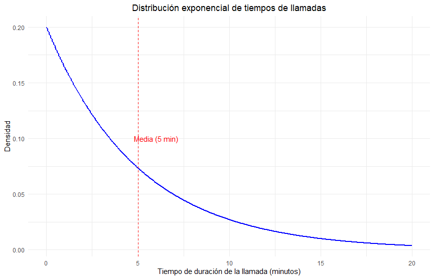
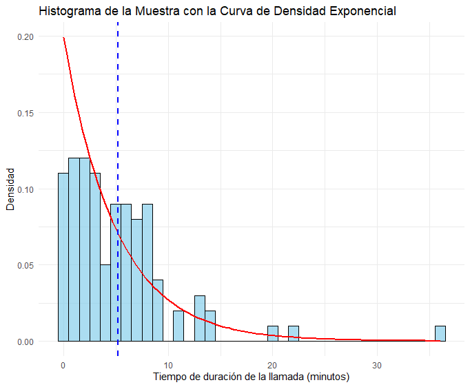
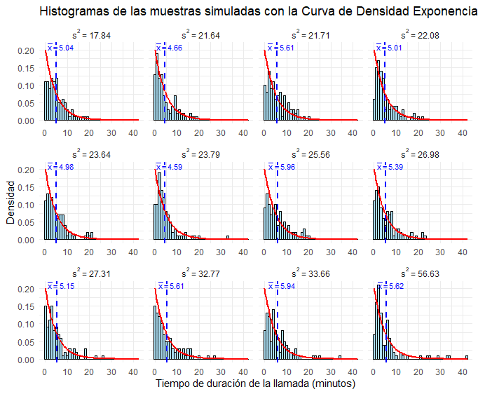
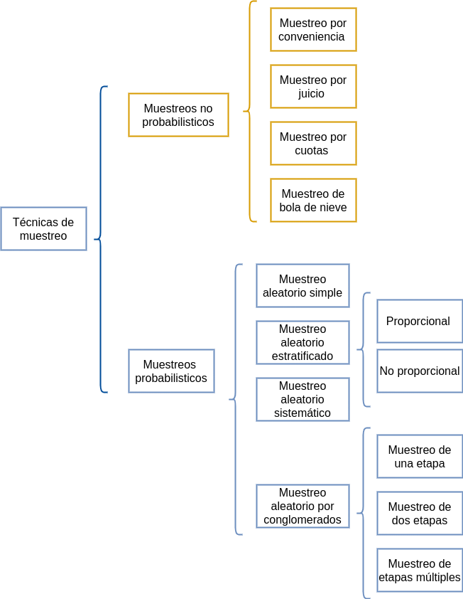

```{r setup, include=FALSE}
knitr::opts_chunk$set(echo = TRUE, message = FALSE, warning = FALSE, comment = NA)
```


</br></br>
<h2>Introducción</h2>


En estadística, los conceptos de **población, muestra, estimador y estimación** son fundamentales para el análisis de datos y la inferencia estadística. Sin embargo, la interpretación de estos términos varía según el área de aplicación.  

En disciplinas como las **ciencias sociales, la biología o la ingeniería**, los términos **población y muestra** suelen referirse al **conjunto de unidades muestrales**, es decir, a los elementos concretos de los cuales se extraen datos (personas, objetos, experimentos, etc.). En este contexto, una **población** representa el conjunto completo de individuos u objetos de interés, mientras que una **muestra** es un subconjunto representativo de esa población.  

Por otro lado, en el **área formal de la estadística**, la **población** y la **muestra** se refieren a los **valores que puede tomar una variable aleatoria**. En este enfoque, el análisis estadístico no solo busca describir los datos observados, sino también comprender las tendencias y características de la **distribución** de la variable en estudio. Esto implica el cálculo de **parámetros poblacionales**, como la media y la varianza, que caracterizan la distribución teórica de la variable.  

Para inferir información sobre la población a partir de una muestra, se utilizan **estimadores**, que son funciones de los datos muestrales diseñadas para aproximar parámetros desconocidos. El proceso de asignar valores a estos parámetros a partir de los datos observados se conoce como **estimación estadística**. La calidad de un estimador se evalúa en términos de propiedades como la **insesgadez, eficiencia y consistencia**, asegurando que la inferencia realizada sea lo más precisa y confiable posible.  

<!-- <br/> -->


<!-- ```{r, echo=FALSE} -->
<!-- library("SnowballC") -->
<!-- library("wordcloud2") -->
<!-- library("RColorBrewer") -->
<!-- nube <- read.csv("palabras1.csv") -->

<!-- nube1=rep(nube$palabra,nube$replicas) -->

<!-- t=data.frame(table(nube1)) -->

<!-- dword=t[,1] -->
<!-- dfreq=t[,2] -->
<!-- set.seed(1234) -->
<!-- # wordcloud(words = dword, freq = dfreq, min.freq = 1, -->
<!-- #            max.words=200, random.order=FALSE, rot.per=0.35,  -->
<!-- #            colors=brewer.pal(8, "Dark2")) -->

<!-- library(wordcloud2) -->
<!-- wordcloud2(data = t, size = .25, shape = 'pentagon') #"circle") -->
<!-- ``` -->


</br></br>
<h3>Población</h3>


En estadística, la **población** es el conjunto total de valores posibles que puede tomar una **variable** dentro de un contexto determinado. Estos valores pueden estar asociados a individuos, objetos, eventos o cualquier *unidad de análisis* definida en el estudio.

\[
\text{Población} = \{x_1, x_2, x_3, \dots, x_N\},
\]

donde \(x_i\) representa un valor particular de la variable para la \(i\)-ésima *unidad de análisis*, y \(N\) es el tamaño número de valores (puede ser finito o infinito).

La población se define con respecto a una o varias variables específicas que se desean estudiar.En estadística, la **población** se define como el **conjunto de todos los valores posibles** que puede tomar una **variable aleatoria** dentro de un contexto específico. Estos valores pueden corresponder a individuos, objetos, eventos o cualquier otra **unidad de análisis** relevante para el estudio.

\[
\text{Población} = \{x_1, x_2, x_3, \dots, x_N\}
\]

donde \( x_i \) representa un valor particular de la variable para el \( i \)-ésimo elemento de la población, y \( N \) es el tamaño de la población, el cual puede ser **finito** o **infinito** dependiendo del fenómeno en estudio.

Es importante destacar que la definición de la población está determinada por la variable o variables de interés. En algunos casos, la población puede referirse a un **conjunto finito de observaciones** (por ejemplo, las alturas de los estudiantes de una universidad), mientras que en otros puede tratarse de un **conjunto teóricamente infinito** de valores posibles generados por un proceso aleatorio (como los resultados de un experimento repetido indefinidamente).   


</br></br>
<div class="caja-ejemplo">
<h3>Ejemplo:</h3>
<p>
1. **Si la variable es "duración de vida útil de una batería"**, la población podría ser *"el tiempo de duración de todas las baterías de teléfonos inteligentes vendidas en Colombia en el año 2024"*.  
   (*Unidad de análisis*: **batería de teléfono inteligente vendida en Colombia en 2024**).  

2. **Si la variable es "temperatura promedio diaria de una ciudad"**, la población podría ser *"las temperaturas promedio diarias registradas en Bogotá durante el año 2023"*.  
   (*Unidad de análisis*: **Bogotá en un día específico del año 2023**).  

3. **Si la variable es "nivel de pH de un río"**, la población podría ser *"las mediciones de pH del agua en el río Magdalena realizadas durante el año 2024"*.  
   (*Unidad de análisis*: **muestra de agua tomada del río Magdalena en una medición específica del año 2024**).  
</p>
</div>


Para un mismo conjunto de *unidades de análisis* en un estudio, puede ser de interés analizar diferentes variables, lo que lleva a definir **distintas poblaciones de estudio** según el enfoque estadístico y formal de lo que se entiende por población.


</br></br>
<h3>Muestra</h3>


En estadística, una **muestra aleatoria** es un subconjunto de la población, seleccionado de manera que cada elemento de la población tenga una probabilidad conocida y no nula de ser incluido en la muestra. Matemáticamente, si la población se define como:

\[
\text{Población} = \{x_1, x_2, x_3, \dots, x_N\},
\]

entonces una muestra aleatoria es un subconjunto de \(n\) elementos seleccionados de la población:

\[
\text{Muestra} = \{x_{1}, x_{2}, x_{3}, \dots, x_{n}\}, \quad \text{donde } n \leq N.
\]

Una *muestra aleatoria independiente e idénticamente distribuida* (\(i.i.d\)) cumple con las siguientes condiciones:

- **Selección aleatoria**: Los valores de la muestra se obtienen de un experimento aleatorio o proceso de selección en el que cada unidad tiene una probabilidad conocida y no nula de ser seleccionada. No hay sesgos sistemáticos en la selección de los elementos.

-  **Independencia estadística**: Los valores de la muestra son estadísticamente independientes entre sí. El valor observado para una unidad no afecta el valor observado para otra. Es decir, el conocimiento de un dato no proporciona información sobre otro.

-  **Distribución idéntica**: Todos los valores de la muestra provienen de la misma distribución de probabilidad. Cada observación sigue las mismas características de la población, como la misma media, varianza y forma de la distribución.

Estas propiedades son esenciales en estadística porque garantizan que los resultados de los análisis sean confiables y las inferencias válidas.


</br></br>
<div class="caja-ejemplo">
<h3>Ejemplo:</h3>
<p>

Supongamos que la población representa los **tiempos de duración de las llamadas atendidas en un centro de servicio al cliente en Bogotá durante el año 2024**. Se sabe que estos tiempos siguen una **distribución exponencial**, con un **valor medio de duración** de **5 minutos**.  

Dado que en una distribución exponencial la **media** y la **varianza** están dadas por:

\[
E[X] = \frac{1}{\lambda}, \quad V[X] = \frac{1}{\lambda^2}
\]

podemos expresar la distribución de la población como:  

\[
X \sim \text{Exp}(\lambda = 1/5)
\]

De esta manera, los valores poblacionales son:  

- **Esperanza matemática**:  
  \[
  E[X] = \frac{1}{1/5} = 5 \text{ minutos}
  \]
- **Varianza**:  
  \[
  \text{Var}(X)= \frac{1}{(1/5)^2} = 25 \text{ minutos}^2
  \]

Ahora, extraemos una **muestra aleatoria** de tamaño \( n = 100 \) de esta población bajo las siguientes condiciones:

- Cada llamada es seleccionada de manera **aleatoria**.  
- Las observaciones son **independientes** entre sí.  
- Todas las observaciones provienen de la misma distribución exponencial \( \text{Exp}(1/5) \).  

Podemos representar la población y la muestra de la siguiente manera:

**Población**:

   \[
   X \sim \text{Exp}(1/5)
   \]

**Muestra i.i.d**:

   \[
   X_1, X_2, \dots, X_{100} \overset{\text{i.i.d}}{\sim} \text{Exp}(1/5)
   \]

La **población** corresponde a todos los tiempos de duración de llamadas atendidas en el centro de servicio al cliente durante el año, mientras que la **muestra aleatoria i.i.d.** consiste en **100 registros de tiempos de duración de llamadas**, seleccionados aleatoriamente y medidos en minutos.  

Un posible conjunto de valores de la muestra podría ser:

\[
\text{Muestra} = \{3.2, 7.8, 5.4, 2.1, 10.6, \dots\}
\]
 

Se puede representar esta **población** y simular una **muestra aleatoria** de tamaño 100 utilizando el software **R**. Los resultados generados a partir de los siguientes códigos se presentan en las **Figuras 2.37** y **2.38**.  

En la **Figura 2.37**, se muestra la **curva de densidad** que describe la distribución de la población (tiempos de llamadas). Por otro lado, la **Figura 2.38** presenta el **histograma** de los 100 registros de tiempos extraídos de una población con distribución **Exponencial**, cuya **media poblacional** es **5** y su **varianza poblacional** es **25**.  

La distribución de los tiempos en una muestra \( i.i.d. \) generada presenta una **media muestral** de \( \bar{x} = 5.228594 \) y una **varianza muestral** de \( s^2 = 26.9682 \). Estos resultados fueron obtenidos utilizando `set.seed(123)`.  

Es importante destacar que, si se modifica el valor de la semilla (`123`), la muestra aleatoria seleccionada será diferente, lo que conllevará a cambios en los valores de la **media muestral** \( \bar{x} \) y la **varianza muestral** \( s^2 \).  


<pre>
# Cargar librería ggplot2
library(ggplot2)

# Configuración de parámetros de la población
lambda <- 1/5  # Tasa de la distribución exponencial (lambda = 1/media)
media <- 1/lambda  # Media de la distribución

# Crear un rango de valores para la población
x <- seq(0, media * 4, length.out = 500)  # Desde 0 hasta 4 veces la media

# Calcular la densidad de la distribución exponencial
densidad <- dexp(x, rate = lambda)

# Crear un data frame para ggplot
datos <- data.frame(Tiempo = x, Densidad = densidad)

# Graficar con ggplot2
plot_pob <- ggplot(datos, aes(x = Tiempo, y = Densidad)) +
  geom_line(color = "blue", linewidth = 1) +  # Línea de densidad con `linewidth`
  geom_vline(xintercept = media, color = "red", linetype = "dashed") +  # Línea en la media
  labs(title = "Distribución Exponencial de Tiempos de Llamadas",
       x = "Tiempo de duración de la llamada (minutos)",
       y = "Densidad") +
  theme_minimal() +  # Tema minimalista
  theme(plot.title = element_text(hjust = 0.5)) +  # Centrar título
  annotate("text", x = media + 1, y = max(densidad) / 2, 
           label = "Media (5 min)", color = "red", angle = 0)

# Mostrar el gráfico
print(plot_pob)
</pre>

```{r,eval=TRUE}
# Cargar librería ggplot2
library(ggplot2)

# Configuración de parámetros de la población
lambda <- 1/5  # Tasa de la distribución exponencial (lambda = 1/media)
media <- 1/lambda  # Media de la distribución

# Crear un rango de valores para la población
x <- seq(0, media * 4, length.out = 500)  # Desde 0 hasta 4 veces la media

# Calcular la densidad de la distribución exponencial
densidad <- dexp(x, rate = lambda)

# Crear un data frame para ggplot
datos <- data.frame(Tiempo = x, Densidad = densidad)

# Graficar con ggplot2
plot_pob <- ggplot(datos, aes(x = Tiempo, y = Densidad)) +
  geom_line(color = "blue", linewidth = 1) +  # Línea de densidad con `linewidth`
  geom_vline(xintercept = media, color = "red", linetype = "dashed") +  # Línea en la media
  labs(title = "Distribución Exponencial de Tiempos de Llamadas",
       x = "Tiempo de duración de la llamada (minutos)",
       y = "Densidad") +
  theme_minimal() +  # Tema minimalista
  theme(plot.title = element_text(hjust = 0.5)) +  # Centrar título
  annotate("text", x = media + 1, y = max(densidad) / 2, 
           label = "Media (5 min)", color = "red", angle = 0)

# Mostrar el gráfico
# print(plot_pob)
```


<br/><br/>
<center>
```{r, echo=FALSE, out.width="80%", fig.align = "center"}

```
**Figura 2.37** Curva de densidad de la población con \(X \sim \text{Exp}(\lambda = 1/5)\).
</center>
<br/><br/>

 

<pre>
# Cargar librería ggplot2
library(ggplot2)

# Configuración de parámetros de la población
set.seed(123)  # Para reproducibilidad
lambda <- 1/5  # Parámetro de la distribución exponencial
n <- 100       # Tamaño de la muestra

# Simulación de la muestra iid de la distribución exponencial
muestra <- rexp(n, rate = lambda)
promedio <- mean(muestra)
varianza<-var(muestra)

# Crear un data frame para ggplot
datos <- data.frame(Tiempo = muestra)

# Graficar el histograma con la curva de densidad de la distribución teórica
plot_hist <- ggplot(datos, aes(x = Tiempo)) +
  geom_histogram(aes(y = after_stat(density)), binwidth = 1, fill = "skyblue", color = "black", alpha = 0.7) +  # Histograma con frecuencia relativa
  stat_function(fun = dexp, args = list(rate = lambda), color = "red", linewidth = 1) +  # Curva de densidad teórica
  geom_vline(xintercept = promedio, color = "blue", linetype = "dashed", linewidth = 1) +  # Línea de la media muestral
  labs(title = "Histograma de la Muestra con la Curva de Densidad Exponencial",
       x = "Tiempo de duración de la llamada (minutos)",
       y = "Densidad") +
  theme_minimal()  # Estilo minimalista

# Mostrar el gráfico
print(plot_hist)

# Mostrar el promedio
print(promedio)

# Mostrar la varianza
print(varianza)
</pre>

```{r,eval=TRUE}
# Cargar librería ggplot2
library(ggplot2)

# Configuración de parámetros de la población
set.seed(123)  # Para reproducibilidad
lambda <- 1/5  # Parámetro de la distribución exponencial
n <- 100       # Tamaño de la muestra

# Simulación de la muestra iid de la distribución exponencial
muestra <- rexp(n, rate = lambda)
promedio <- mean(muestra)
varianza<-var(muestra)

# Crear un data frame para ggplot
datos <- data.frame(Tiempo = muestra)

# Graficar el histograma con la curva de densidad de la distribución teórica
plot_hist <- ggplot(datos, aes(x = Tiempo)) +
  geom_histogram(aes(y = after_stat(density)), binwidth = 1, fill = "skyblue", color = "black", alpha = 0.7) +  # Histograma con frecuencia relativa
  stat_function(fun = dexp, args = list(rate = lambda), color = "red", linewidth = 1) +  # Curva de densidad teórica
  geom_vline(xintercept = promedio, color = "blue", linetype = "dashed", linewidth = 1) +  # Línea de la media muestral
  labs(title = "Histograma de la Muestra con la Curva de Densidad Exponencial",
       x = "Tiempo de duración de la llamada (minutos)",
       y = "Densidad") +
  theme_minimal()  # Estilo minimalista

# Mostrar el gráfico
#print(plot_hist)

# Mostrar el promedio
#print(promedio)

# Mostrar la varianza
#print(varianza)
```
</br>


<br/><br/>
<center>
```{r, echo=FALSE, out.width="80%", fig.align = "center"}

```
**Figura 2.38** La distribución de los tiempos de una muestra \(i.i.d.\) que tiene una **media muestral** \(\bar{x} =  5.228594\) y una **varianza muestral** \(s^2 = 26.9682\). Estos resultados fueron obtenidos utilizando `set.seed(123)`. Si se cambia el valor de la semilla (`123`), la muestra aleatoria seleccionada será diferente, lo que resultará en valores distintos para la media \(\bar{x}\) y la varianza \(s^2\).
</center>
<br/><br/>

</p>
</div>


</br></br>
<h2>Parámetro, estimador y estimación</h2>

En el *enfoque frecuentista*, un **parámetro** es un valor fijo y desconocido que describe una propiedad poblacional. Los datos muestrales permiten calcular **estimaciones** para aproximar el valor del parámetro y realizar inferencias estadísticas sobre la población.  

Algunos ejemplos comunes de parámetros son: la **media poblacional**, la **varianza poblacional** y la **proporción poblacional**. Estos son denotados, en general, como \(\theta\).  

Un **estimador** es una **función matemática** aplicada a los datos muestrales para aproximar un **parámetro desconocido** de la población. El estimador utiliza información de la muestra para proporcionar una **estimación** del valor verdadero del parámetro.  

Dado un parámetro poblacional \(\theta\) (como la media \(\mu\), varianza \(\sigma^2\) o proporción \(p\)), un **estimador** se define como una función de las observaciones de una muestra aleatoria:

\[
\hat{\theta} = T(X_1, X_2, \dots, X_n),
\]

donde:

- \(\hat{\theta}\) es el **estimador** del parámetro \(\theta\). 
- \(X_1, X_2, \dots, X_n\) son los valores observados en la muestra.  
- \(T\) es la función que define cómo se calcula el estimador.  

<br/>

<div class="caja-ejemplo">
<h3>Ejemplos:</h3>
<p>
- **Media muestral (\(\bar{X}\))**:  

   - Estimador de la **media poblacional** (\(\mu\)).  
   - Fórmula:  
     \[
     \bar{X} = \frac{1}{n} \sum_{i=1}^n X_i
     \]

- **Varianza muestral (\(S^2\))**:  

   - Estimador de la **varianza poblacional** (\(\sigma^2\)).  
   - Fórmula:  
     \[
     S^2 = \frac{1}{n-1} \sum_{i=1}^n (X_i - \bar{X})^2
     \]
</p>
</div> 


En el ejemplo anterior, dos de los **parámetros poblacionales** son la **media** y la **varianza** de los tiempos, con valores de \(5 \, \text{minutos}\) y \(25 \, \text{minutos}^2\), respectivamente. Las **fórmulas** del **promedio muestral** y de la **varianza** actúan como los **estimadores**.  

Los resultados de aplicar estas fórmulas a los datos de la muestra son las **estimaciones puntuales de los parámetros**. En este caso, las **estimaciones** de la media y la varianza poblacional son:  

- **Media muestral**: \(5.228594 \, \text{minutos}\),  
- **Varianza muestral**: \(26.9682 \, \text{minutos}^2\).  


</br></br>
<div class="caja-ejemplo">
<h3>Ejemplo:</h3>
<p>

Este ejemplo extiende el análisis previo seleccionando **12 muestras aleatorias** de tamaño **100**, todas provenientes de la misma población con distribución **Exponencial(λ = 1/5)**. Para cada muestra, se construye un **histograma** que representa la distribución de los tiempos de duración de las llamadas, superponiendo la **curva de densidad teórica** en rojo. Además, se calculan dos estadísticas clave para cada muestra:  

- **Media muestral** (\(\bar{x}\), representada por la línea azul discontinua).  
- **Varianza muestral** (\(s^2\), mostrada en la parte superior de cada gráfico).  

La **Figura 2.39** muestra los histogramas generados junto con estas estimaciones. Los resultados fueron obtenidos utilizando `set.seed(42)`, lo que garantiza la **reproducibilidad** de la simulación. Al cambiar este valor, las muestras aleatorias serán distintas, lo que generará nuevas estimaciones de la media y la varianza.  

**Observaciones clave:**

1. **Variabilidad entre muestras:**  
   - Aunque todas las muestras provienen de la misma distribución exponencial, la forma de los histogramas varía, reflejando la **aleatoriedad inherente** al muestreo.  
   - Algunas muestras presentan una mayor concentración de valores bajos, mientras que otras incluyen tiempos más largos, lo que afecta la dispersión.  

2. **Convergencia de las estimaciones:**  
   - La mayoría de las **medias muestrales** (\(\bar{x}\)) oscilan en torno a **5**, lo cual es consistente con el valor esperado teórico \(E[X] = 1/\lambda = 5\).  
   - Las **varianzas muestrales** (\(s^2\)) presentan mayor dispersión, pero tienden a valores cercanos a **25**, en concordancia con la varianza teórica \(\text{Var}(X) = 1/\lambda^2 = 25\).  


<pre>
# Cargar librería ggplot2
library(ggplot2)

# Configuración de parámetros para la distribución exponencial
set.seed(42)  # Para reproducibilidad
lambda <- 1/5  # Parámetro de la distribución exponencial
n <- 100       # Tamaño de cada muestra
num_muestras <- 12  # Número de muestras

# Generar 12 muestras de la distribución exponencial y calcular estadísticas
muestras <- replicate(num_muestras, rexp(n, rate = lambda))
estadisticas <- apply(muestras, 2, function(muestra) {
  c(promedio = mean(muestra), varianza = var(muestra))  # Calcular media y varianza
})

# Preparar datos para gráficos con etiquetas bien formateadas
datos_graficos <- data.frame(
  Tiempo = as.vector(muestras),
  Muestra = rep(paste0("s^2~'='~", round(estadisticas["varianza", ], 2)), each = n)  # Expresión matemática para varianza muestral
)

# Crear etiquetas con expresión matemática para el promedio muestral
medias <- data.frame(
  Muestra = paste0("s^2~'='~", round(estadisticas["varianza", ], 2)),  # Etiqueta con varianza sin la palabra "Varianza"
  Media = estadisticas["promedio", ],
  Etiqueta = paste0("bar(x) == ", round(estadisticas["promedio", ], 2)),  # Expresión para promedio muestral
  PosicionY = 0.20  # Ajuste más bajo para evitar que se corte en el gráfico
)

# Crear datos teóricos para la curva de densidad exponencial
x_teorico <- seq(0, max(datos_graficos$Tiempo), length.out = 100)
densidad_teorica <- data.frame(x = x_teorico, y = dexp(x_teorico, rate = lambda))

# Graficar histogramas por muestra con la curva de densidad teórica
plot_histogramas <- ggplot(datos_graficos, aes(x = Tiempo)) +
  geom_histogram(aes(y = after_stat(density)), binwidth = 1, fill = "skyblue", color = "black", alpha = 0.7) +  # Histograma con densidad
  geom_line(data = densidad_teorica, aes(x = x, y = y), color = "red", linewidth = 1) +  # Curva de densidad teórica
  geom_vline(data = medias, aes(xintercept = Media), color = "blue", linetype = "dashed", linewidth = 1) +  # Línea de la media
  geom_text(data = medias, aes(x = Media + 2, y = PosicionY, label = Etiqueta), 
            color = "blue", vjust = 0, size = 3, parse = TRUE) +  # Ajuste de posición del texto de la media
  facet_wrap(~Muestra, scales = "free_x", ncol = 4, labeller = label_parsed) +  # Formato matemático en facetas
  labs(title = "Histogramas de las muestras simuladas con la Curva de Densidad Exponencial",
       x = "Tiempo de duración de la llamada (minutos)", y = "Densidad") +
  theme_minimal()

# Mostrar los gráficos
print(plot_histogramas)

# Mostrar las estadísticas calculadas
print(estadisticas)
</pre>

```{r,eval=TRUE}
# Cargar librería ggplot2
library(ggplot2)

# Configuración de parámetros para la distribución exponencial
set.seed(42)  # Para reproducibilidad
lambda <- 1/5  # Parámetro de la distribución exponencial
n <- 100       # Tamaño de cada muestra
num_muestras <- 12  # Número de muestras

# Generar 12 muestras de la distribución exponencial y calcular estadísticas
muestras <- replicate(num_muestras, rexp(n, rate = lambda))
estadisticas <- apply(muestras, 2, function(muestra) {
  c(promedio = mean(muestra), varianza = var(muestra))  # Calcular media y varianza
})

# Preparar datos para gráficos con etiquetas bien formateadas
datos_graficos <- data.frame(
  Tiempo = as.vector(muestras),
  Muestra = rep(paste0("s^2~'='~", round(estadisticas["varianza", ], 2)), each = n)  # Expresión matemática para varianza muestral
)

# Crear etiquetas con expresión matemática para el promedio muestral
medias <- data.frame(
  Muestra = paste0("s^2~'='~", round(estadisticas["varianza", ], 2)),  # Etiqueta con varianza sin la palabra "Varianza"
  Media = estadisticas["promedio", ],
  Etiqueta = paste0("bar(x) == ", round(estadisticas["promedio", ], 2)),  # Expresión para promedio muestral
  PosicionY = 0.20  # Ajuste más bajo para evitar que se corte en el gráfico
)

# Crear datos teóricos para la curva de densidad exponencial
x_teorico <- seq(0, max(datos_graficos$Tiempo), length.out = 100)
densidad_teorica <- data.frame(x = x_teorico, y = dexp(x_teorico, rate = lambda))

# Graficar histogramas por muestra con la curva de densidad teórica
plot_histogramas <- ggplot(datos_graficos, aes(x = Tiempo)) +
  geom_histogram(aes(y = after_stat(density)), binwidth = 1, fill = "skyblue", color = "black", alpha = 0.7) +  # Histograma con densidad
  geom_line(data = densidad_teorica, aes(x = x, y = y), color = "red", linewidth = 1) +  # Curva de densidad teórica
  geom_vline(data = medias, aes(xintercept = Media), color = "blue", linetype = "dashed", linewidth = 1) +  # Línea de la media
  geom_text(data = medias, aes(x = Media + 2, y = PosicionY, label = Etiqueta), 
            color = "blue", vjust = 0, size = 3, parse = TRUE) +  # Ajuste de posición del texto de la media
  facet_wrap(~Muestra, scales = "free_x", ncol = 4, labeller = label_parsed) +  # Formato matemático en facetas
  labs(title = "Histogramas de las muestras simuladas con la Curva de Densidad Exponencial",
       x = "Tiempo de duración de la llamada (minutos)", y = "Densidad") +
  theme_minimal()

# Mostrar los gráficos
# print(plot_histogramas)

# Mostrar las estadísticas calculadas
# print(estadisticas)
```


<br/><br/>
<center>
```{r, echo=FALSE, out.width="80%", fig.align = "center"}

```
**Figura 2.39** Histograma, media y varianza de los tiempos por cada muestra aleatoria. Estos resultados fueron obtenidos utilizando `set.seed(42)`. Si se cambia el valor de la semilla (`42`), las muestras aleatorias seleccionadas serán diferentes, lo que resultará en valores distintos para la media \(\bar{x}\) y la varianza \(s^2\).
</center>
<br/><br/>

</p>
</div>


</br></br>


<!-- <br/><br/> -->

<!-- ## <span style="color:#034a94">**Muestreo**</span> -->

<!-- <br/> -->

<!-- ### <span style="color:#034a94">**Importancia del Muestreo**</span> -->

<!-- El papel principal de la estadística está relacionado con el análisis de información que permita tomar decisiones con respecto a una población. Es posible que se pueda estudiar la totalidad de elementos  que determinan la población, en este caso estaremos realizando un censo. Sin embargo no siempre podemos estudiar la totalidad de la población por lo cual debemos seleccionar una pequeña parte de ella. A este subconjunto lo podemos llamar muestra. -->

<!-- <br/> -->
<!-- <center> -->
<!-- **Tabla 2.6** Comparación Muestreo  Censo -->
<!-- </center> -->

<!-- |                                      | **Muestra**     | **Censo**          | -->
<!-- |:-------------------------------------|:----------------|:-------------------| -->
<!-- |Presupuesto                           |pequeño          | grande             | -->
<!-- |Tiempo disponible                     |poco             | mucho              | -->
<!-- |Tamaño de la población                |grande           | pequeña            | -->
<!-- |Varianza de la característica         |grande           | pequeña            | -->
<!-- |Costos de los errores de muestreo     |bajos            | altos              | -->
<!-- |Costos de los errores que no son de muestreo            | alto   | bajo      | -->
<!-- |Naturaleza de la prueba               |destructiva     |no destructiva       | -->
<!-- |Atención a casos individuales         |si               |no                  | -->
<!-- |||| -->

<!-- <center> -->
<!-- <font size="-1">Tomado de Malhotra(2004)</font> -->
<!-- </center> -->
<!-- <br/> -->

<!-- Un diseño de muestreo es una estrategia para obtener una muestra, genera algunas preguntas asociadas al proceso de muestreo: ¿cómo seleccionar de una manera óptima la muestra?, ¿Qué característica medir en las unidades observadas? y ¿cómo estimar las características poblacionales a partir de la información muestral?. El proceso de obtención de las muestras por su parte, requiere la definición de algunos aspectos como, ¿cuál es el tamaño óptimo para el cumplimiento de los objetivos?, o  ¿mediante qué procedimiento aleatorio se  realiza el proceso de selección?, ¿qué tipo de método observacional utilizar y qué medidas tomar?. En el muestreo, uno tiene la oportunidad de seleccionar deliberadamente la  muestra, para evitar  inducir por ejemplo, a seleccionar por conveniencia algún individuo en particular, situación que pudiera conducir a sesgos en los resultados finales de la investigación. -->

<!-- <br/> -->

<!-- En resumen, podemos decir que el muestreo consiste en la selección, mediante procedimientos preestablecidos que nos aseguren aleatoriedad y representatividad,  de una parte de una colección finita de unidades, seguida de algunas conclusiones respecto de la población, basándonos en la parte de ella que hemos observado. Este proceso se basa en principios relacionados con la inferencia estadística, lo que implica fuentes de incertidumbre (producto de la aleatoriedad), como por ejemplo -->


<!-- a.El método de selección de las unidades. -->
<!-- b.El método de medición de las unidades. -->
<!-- c.El conocimiento de los procesos que generan los verdaderos valores de las unidades medidas. -->

<!-- <br/><br/> -->

<!-- ### <span style="color:#034a94">**Diseños Muestrales**</span> -->

<!-- Un diseño muestral es una estrategia de selección de unidades muestrales, mediante un proceso de aleatorio definido previamente (plan de muestreo). De acuerdo con esta definición, son tres los elementos esenciales de un diseño muestral: -->

<!-- <br/><br/> -->

<!-- ### <span style="color:#034a94">**Unidad muestral**</span> -->

<!-- Constituye la unidad básica a partir de la cual se obtiene la información, pudiendo por tanto, ser éstas personas,  o individuos de cualquier tipo si , por ejemplo nuestro interés es estimar la talla promedio; casas, número promedio de habitaciones, o el consumo de energía; comunidades, si los que nos interesa es el número promedio de especies por comunidad, áreas o cuadrículas si deseamos estimar densidades medias o biomasa total, etc. -->

<!-- <br/><br/> -->

<!-- ### <span style="color:#034a94">**Proceso de aleatorización**</span> -->

<!-- Aun cuando la unidad muestral esté claramente definida, existen algunos elementos adicionales que pueden afectar el proceso de muestreo, alterando la calidad de la información. En este caso no es la definición, sino la selección de la unidad muestral, la que puede estar sesgada por la naturaleza de la medición, así por ejemplo, si deseamos encuestar a personas para averiguar su tendencia política o su nivel socio económico, pudiéramos sentirnos tentados a seleccionar sus nombres desde una listado de teléfonos, lo que dejaría fuera de la encuesta a todas aquellas personas  que no  se encuentran en el listado, constituyéndose ello en una fuente de sesgo.  En  otros casos, la naturaleza del muestreo tiene que ver con el entrenamiento de los encuestadores, es el caso, por ejemplo, de las muestras para identificar fallas en un equipo, en que la experiencia de la persona que recoge la información juega un papel importante en la identificación de los mismos. -->

<!-- Lo anterior significa que, en términos prácticos, la aleatoriedad debe garantizar que **cada individuo de la población debe tener las misma posibilidad de ser seleccionado como representante de la población** (aleatoriedad). Adicionalmente, exigimos que la elección de un individuo, no esté condicionada a la selección de otro (independencia). Estas dos condiciones, en apariencia sencillas, pueden provocar algunas  dificultades. -->

<!-- <br/><br/> -->

<!-- ###  <span style="color:#034a94">**Tamaño muestral**</span> -->

<!-- Una vez que las unidades muestrales han sido definidas y se ha acordado un proceso de aleatorización, debemos preguntarnos, cuántas unidades debemos seleccionar para tener una buena representación en la  muestra. -->

<!-- Dado que cualquiera sea el proceso de selección de una muestra existe un costo asociado, el que en la mayoría de los casos constituye una exigencia ineludible, nuestro objetivo principal, será obtener el máximo de información con el menor tamaño de muestra que nos sea posible. -->

<!-- El tamaño de la muestra $n$ es función de tres elementos que son: la varianza, la confiabilidad y el error de muestreo. Los dos últimos a criterio del investigador. -->

<!-- $$n=\dfrac{z^{2}_{_{\alpha/2}} \sigma^{2}}{e^{2}}$$ -->

<!-- Donde: -->

<!-- **Varianza** ($\sigma^{2}$):  Caracteriza la variable a estimar. Entre mayor sea su valor, mayor deberá ser el tamaño de la muestra. En ocasiones es necesario realizar una prueba piloto que nos permita tener un valor para calcular $n$. Otra alternativa puede ser el conocimiento empírico de expertos sobre el rango de la variable. Con este valor podemos estimar una aproximación de la desviación estándar como: $\sigma =$ rango/4.  -->

<!-- <br/> -->

<!-- **Confiabilidad** ($z_{\alpha/2}$ o percentil de la distribución normal estándar)b: Este concepto está relacionado con el grado de veracidad que tienen los resultados obtenidos. Si el estudio es repetido muchas veces, ¿ cuántas de estas coinciden con los resultados obtenidos?. Su valor está relacionado con el percentil de las distribución normal estándar, por ejemplo: una confiabilidad del 95% está relacionada con un valor de $z=1.96$. -->

<!-- <br/> -->

<!-- **Error de muestreo** ($e$) : corresponde a la diferencia entre el valor de la característica en la población (parámetro) y el valor obtenido con la información de la muestra (estimador).Equivale al error que estamos en capacidad de tolerar en las unidades de la variable. -->

<!-- <br/><br/> -->

<!--  <span style="color:#FF7F00"> **Ejemplo**</span> -->

<!-- **Caso de una media** :  -->

<!-- Suponga que deseamos determinar el tamaño de la muestra para estimar la media de la nota del curso de Métodos, con una confianza del 95\% y un error de muestreo de 0.2 puntos. Un estudio realizado el semestre pasado arrojó una varianza de 1.6. -->

<!-- La información necesaria para el calculo del tamaño de muestra requerido es: -->

<!-- * percentil 97.5 de la distribución normal $z=1.96$ (Entre -1.96 y 1.96 se encuentra el 95\% de los datos) -->

<!-- * varianza $\sigma^{2}=0.4$ -->

<!-- * error de muestreo 0.2 -->


<!-- $$n=\dfrac{1.96^{2} \times 1.6}{0.2^{2}}=153.6 \approxeq 154$$ -->

<!-- En caso de que $n/N >0.05$ debemos realizar un ajuste por corrección por población finita: -->

<!-- $$n=\dfrac{n_{0} \times N}{n_{0}+N-1}$$ -->
<!-- Supongamos que N=200 estudiantes y por tanto $154/200 > 0.05$ El tamaño corregido será: -->

<!-- $$n= \dfrac{154 \times 200}{154 + 200 -1} =87.2 \approxeq 88$$ -->

<!-- <br/><br/> -->

<!-- ### <span style="color:#FF7F00"> **Ejemplo**</span> -->

<!-- **Caso de una proporción**  -->

<!-- Supongamos ahora que se desea calcular el tamaño de la muestra para realizar una estimación de la proporción de estudiantes que reprueban el curso de fundamentos de programación y que deseamos una confianza del 98\% y un error de muestreo de 0.1. En este caso la varianza corresponde a $pq$ donde $q=1-p$ y por tanto tendrá su valor máximo cuando $p=0.50$, es decir que si utilizamos como varianza $0.5 \times (1-0.5)=0.25$ obtendremos el valor más grande de tamaño de muestra posible. -->

<!-- $$ n=\dfrac{2.33^2 \times 0.25}{0.1^{2}}=135.7 \approxeq 136$$ -->


<!-- En caso de poder realizar una prueba piloto (observación de una muestra, digamos 30 unidades) y estimar en este caso su varianza, el resultado del tamaño de muestra será inferior al anteriormente calculado. -->

<!-- <br/><br/><br/> -->

<!-- ## <span style="color:#034a94">**Tipos de muestreo**</span>  -->


<!-- <center>	 -->
<!-- ```{r, echo=FALSE, out.width="80%", fig.align = "center"} -->
<!-- 	 -->
<!-- ``` -->
<!-- <br/> -->
<!-- **Figura 2.31** Tipos de muestreo  -->
<!-- </center> -->

<!-- <br/><br/> -->

<!-- En general pueden dividirse en dos grandes grupos: métodos de muestreo probabilísticos y métodos de muestreo no probabilísticos. -->

<!-- Los **métodos de muestreo probabilísticos** son aquellos que se basan en el principio de equiprobabilidad. Es decir, aquellos en los que todos los individuos tienen la misma probabilidad de ser elegidos para formar parte de una muestra y, consiguientemente, todas las posibles muestras de tamaño n tienen la misma probabilidad de ser elegidas. -->

<!-- Sólo estos métodos de muestreo probabilísticos nos aseguran la representatividad de la muestra extraída y son, por tanto, los más recomendables. Dentro de los métodos de 	muestreo probabilísticos encontramos los siguientes tipos: -->

<!-- <br/><br/> -->

<!-- ## <span style="color:#034a94">**Muestreos probabilísticos**</span> -->

<!-- <br/><br/> -->

<!-- ### <span style="color:#034a94">**Muestreo Aleatorio simple (m.a.s)**</span> -->

<!-- Una muestra **aleatoria simple** tomada de una población finita, da a cada subconjunto de la población (muestra) de tamaño específico la misma probabilidad de ser seleccionada. -->

<!-- El muestreo aleatorio simple es un procedimiento de selección de un conjunto de individuos de modo que toda posible muestra de $n$ unidades tiene la misma probabilidad de ser seleccionada de los $N$ individuos asociados a la  población. La muestra se selecciona en $n$ etapas, en cada una de las cuales, cada elemento que no ha sido aún seleccionado, tiene la misma probabilidad de ser seleccionado. Si el número de individuos de donde seleccionamos los $n$ individuos para determinar la muestra tiene un tamaño conocido, podemos asignar un número a cada una de las $N$ unidades y luego mediante la generación de $n$ números aleatorios entre $1$ y $N$, seleccionamos los individuos que determinarán la  muestra de tamaño $n$ correspondiente. -->

<!-- El muestreo puede realizarse sin reemplazo o con reemplazo, o dicho de otro modo, la muestra puede elegirse de dos maneras: sin reposición de la unidad extraída o con reposición de ella. El muestreo con reemplazo es usado cuando es aceptable tener la misma unidad dos veces en la muestra. -->

<!-- <br/><br/> -->

<!-- ### <span style="color:#034a94">**Muestreo Estratificado**</span>  -->

<!-- <br/> -->

<!-- Una **muestra estratificada** se obtiene formando estratos, de acuerdo a alguna característica de interés en la población (sexo, edad, ingresos etc.), y de cada estrato se selecciona una muestra aleatoria simple.  -->

<!-- La subdivisión de la población en estratos tiene como objetivo reducir la variabilidad total asociada al proceso de muestreo. Por lo tanto es necesario incluir en cada estrato, individuos o unidades muestrales cuya medida de interés tengan variabilidad pequeña respecto a la media. El objetivo general es entonces lograr varianza mínima dentro del estrato y varianza máxima entre estratos. En caso de no lograr esta estratificación, en función de las varianzas, lo más probable es que el proceso de muestreo sea equivalente al que se pudiera haber realizado por muestreo aleatorio simple. -->

<!-- La ventaja principal que puede conseguirse estratificando, es aumentar la precisión de las estimaciones al agrupar elementos con características comunes y con ello disminuir los tamaños muestrales totales y la amplitud de los intervalos de confianza. Por este tipo de muestreo, la amplitud del intervalo que estima al parámetro es menor que el dado por el m.a.s. para un mismo tamaño de muestra. -->

<!-- Por otra parte, la estratificación procura muestras  más representativas. Exagerando, si se pudiera conseguir que cada uno de los $L$ estratos estuviese constituidos por elementos idénticos, bastaría tomar $L$ elementos, uno por estrato, y la representatividad sería perfecta. Además, puede lograrse un mejor aprovechamiento de la organización administrativa destinada a la selección de las muestras, al centrar la actividad de muestreo en áreas homogéneas. -->


<!-- <br/><br/> -->

<!-- ### <span style="color:#034a94">**Muestreo Sistemático**</span>  -->

<!-- <br/> -->

<!-- Se forma una **muestra sistemática** seleccionando al azar una unidad y luego se seleccionan adicionalmente las unidades a intervalos igualmente espaciados (cada $k$ unidades de la población, $k>1$) hasta formar la muestra total. -->

<!-- Supongamos que estamos interesados en una población cuyos individuos  han sido numerados desde 1 a $N$, y elegimos una muestra de tamaño $n$ como sigue: entre las $k$ primeras unidades, donde $k =N/n$ elegimos, en forma aleatoria, el elemento $i-ésimo$,entre los $k$ primeros elementos o unidades muestrales. A continuación, sistemáticamente se eligen los elementos $i+k$ que están $k$ lugares después  del $i-ésimo$, y así  sucesivamente hasta agotar los elementos disponibles de la lista, lo que ocurrirá al llegar al elemento que ocupa el lugar $i+(n-1)k$. -->

<!-- Si existen $k$ muestras posibles de $n$ elementos cada una. Por ejemplo, de una población determinada por $N = 1000$ elementos deseamos elegir  sistemáticamente $25$ elementos, habrá $k = 1000/25 = 40$ elecciones diferentes posibles. Elegimos aleatoriamente un número comprendido entre 1 y 40 y a partir de éste, elegimos los 24 restantes de 40 en 40. Supongamos que fue sorteado el 15, entonces la observación que ocupa el $15^{\circ}$ lugar será el primer elemento de la muestra, el segundo será el $55^{\circ}(15+40)$, el tercero será el $95^{\circ}(15+80)$ y así  sucesivamente hasta que el último elemento seleccionado será la observación que ocupe el lugar 975. La muestra estará conformado por los elementos : $15^{\circ},55^{\circ}, 95^{\circ},\cdots,975^{\circ}$  -->

<!-- Es más fácil de ejecutar este tipo de muestreo. Es también más preciso que el m.a.s. pues equivale a estratificar la población en $n$ estratos de cada uno de los cuales se extrae una observación. En general, si se desea una muestra de tamaño $n$ basta sortear una de las $k$ columnas. Este tipo de muestreo es particularmente útil en muestreos exploratorios, en los que no se conoce exactamente la distribución de la población. -->

<!-- Este tipo de muestreo no es recomendable cuando el proceso generador de los datos tiene un comportamiento cíclico o estacional, el cuál puede hacer que las unidades seleccionadas coincidan con todos los máximos o todos los mínimos.  -->


<!-- <br/><br/> -->

<!-- ### <span style="color:#034a94">**Muestreo por Conglomerados**</span> -->

<!-- Una **muestra por conglomerados** se obtiene identificando un conjunto de conglomerados que componen la población, aleatoriamente se selecciona un subconjunto de estos conglomerados y se hace un censo en cada uno de los seleccionados. -->

<!-- A veces, para estudios exploratorios, el muestreo probabilístico resulta excesivamente costoso y se acude a métodos no probabilísticos, aún siendo conscientes de que no sirven para realizar generalizaciones, púes no se tiene certeza de que la muestra extraída sea representativa, ya que no todos los sujetos de la población tienen la misma probabilidad de se elegidos. En general se selecciona a los sujetos siguiendo determinados criterios procurando que la muestra sea representativa. -->

<!-- <br/><br/><br/><br/> -->

<!-- ## <span style="color:#034a94">**Muestreos no probabilísticos**</span> -->

<!-- <br/> -->

<!-- En el caso de no contar con los supuestos que puedan garantizar la selección de la muestra de una manera aleatoria (no contar con un listado de la población o el no poder identificar con anticipación los elementos que conforman la población) y requerir de información para realizar análisis exploratorios, podemos utilizar otro tipo de muestreos llamados no probabilísticos. A continuación se describen algunos de ellos: -->

<!-- <br/><br/> -->

<!-- ### <span style="color:#034a94">**Muestreo por Cuotas**</span>  -->

<!-- También denominado en ocasiones **accidental**. Se asienta generalmente sobre la base de un buen conocimiento de los estratos de la población y/o de los individuos más **representativos** o **adecuados** para los fines de la investigación. Mantiene, por tanto, semejanzas con el muestreo aleatorio estratificado, pero no tiene el carácter de aleatoriedad de aquel. En este tipo de muestreo se fijan unas "cuotas" que consisten en un número de individuos que reúnen unas determinadas condiciones, por ejemplo: 20 individuos de 25 a 40 años, de sexo femenino y residentes en una determinada región. Una vez determinada la cuota se eligen los primeros que se encuentren que cumplan esas características. Este método se utiliza mucho en las encuestas de opinión. -->

<!-- <br/><br/> -->

<!-- ### <span style="color:#034a94">**Muestreo Intencional**</span>  -->

<!-- Este tipo de muestreo se caracteriza por un esfuerzo deliberado de obtener muestras "representativas mediante la inclusión en la muestra de grupos supuestamente típicos. Es muy frecuente su utilización en sondeos pre-electorales de zonas que en anteriores votaciones han marcado tendencias de voto. -->

<!-- <br/><br/> -->

<!-- ### <span style="color:#034a94">**Muestreo Casual o Incidental**</span> -->

<!-- Se trata de un proceso en el que el investigador selecciona directa e intencionadamente los individuos de la población. El caso más frecuente de este procedimiento es utilizar como muestra los individuos a los que se tiene fácil acceso (los profesores de universidad emplean con mucha frecuencia a sus 	propios alumnos). Un caso particular es el de los voluntarios. -->

<!-- <br/><br/> -->

<!-- ### <span style="color:#034a94">**Bola de Nieve**</span>  -->

<!-- Se localiza a algunos individuos, los cuales conducen a otros, y estos a otros, y así hasta conseguir una muestra suficiente. Este tipo se emplea muy frecuentemente cuando se hacen estudios con poblaciones "marginales", delincuentes, sectas, determinados tipos de enfermos, etc. -->

