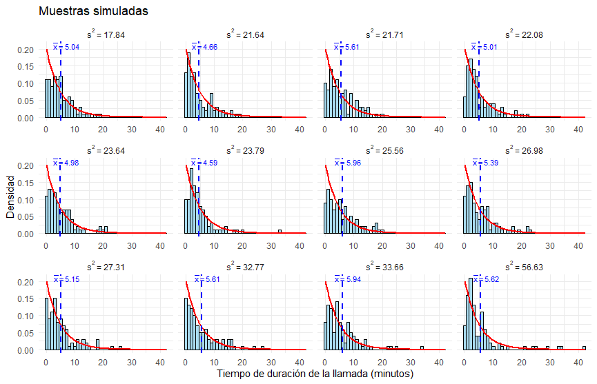

```{r setup, include=FALSE}
knitr::opts_chunk$set(echo = TRUE, message = FALSE, warning = FALSE, comment = NA)
```


</br></br>
<h2>Introducción</h2>


En estadística, los conceptos de **población, muestra, estimador y estimación** son fundamentales para el análisis de datos y la inferencia estadística. Sin embargo, la interpretación de estos términos varía según el área de aplicación.  

En disciplinas como las **ciencias sociales, la biología o la ingeniería**, los términos **población y muestra** suelen referirse al **conjunto de unidades muestrales**, es decir, a los elementos concretos de los cuales se extraen datos (personas, objetos, experimentos, etc.). En este contexto, una **población** representa el conjunto completo de individuos u objetos de interés, mientras que una **muestra** es un subconjunto representativo de esa población.  

Por otro lado, en el **área formal de la estadística**, la **población** y la **muestra** se refieren a los **valores que puede tomar una variable aleatoria**. En este enfoque, el análisis estadístico no solo busca describir los datos observados, sino también comprender las tendencias y características de la **distribución** de la variable en estudio. Esto implica el cálculo de **parámetros poblacionales**, como la media y la varianza, que caracterizan la distribución teórica de la variable.  

Para inferir información sobre la población a partir de una muestra, se utilizan **estimadores**, que son funciones de los datos muestrales diseñadas para aproximar parámetros desconocidos. El proceso de asignar valores a estos parámetros a partir de los datos observados se conoce como **estimación estadística**. La calidad de un estimador se evalúa en términos de propiedades como la **insesgadez, eficiencia y consistencia**, asegurando que la inferencia realizada sea lo más precisa y confiable posible.  


</br></br>
<h3>Población</h3>

La población se define con respecto a una o varias variables específicas que se desean estudiar. En estadística, la **población** se entiende como el **conjunto de todos los valores posibles** que puede tomar una **variable aleatoria** dentro de un contexto específico. Estos valores pueden corresponder a individuos, objetos, eventos o cualquier otra **unidad de análisis** relevante para el estudio.

\[
\text{Población} = \{x_1, x_2, x_3, \dots, x_N\}
\]

donde \( x_i \) representa un valor particular de la variable para la \( i \)-ésima unidad de análisis, y \( N \) es el tamaño de la población, el cual puede ser **finito** o **infinito** dependiendo del fenómeno en estudio.

En algunos casos, la población puede referirse a un **conjunto finito de observaciones** (por ejemplo, las alturas de los estudiantes de una universidad), mientras que en otros puede tratarse de un **conjunto teóricamente infinito** de valores posibles generados por un proceso aleatorio (como los resultados de un experimento repetido indefinidamente).   


</br></br>
<div class="caja-ejemplo">
<h3>Ejemplo:</h3>
<p>
1. **Si la variable es "duración de vida útil de una batería"**, la población podría ser *"el tiempo de duración de todas las baterías de teléfonos inteligentes vendidas en Colombia en el año 2024"*.  
   (*Unidad de análisis*: **batería de teléfono inteligente vendida en Colombia en 2024**).  

2. **Si la variable es "temperatura promedio diaria de una ciudad"**, la población podría ser *"las temperaturas promedio diarias registradas en Bogotá durante el año 2023"*.  
   (*Unidad de análisis*: **Bogotá en un día específico del año 2023**).  

3. **Si la variable es "nivel de pH de un río"**, la población podría ser *"las mediciones de pH del agua en el río Magdalena realizadas durante el año 2024"*.  
   (*Unidad de análisis*: **muestra de agua tomada del río Magdalena en una medición específica del año 2024**).  
</p>
</div>


Para un mismo conjunto de *unidades de análisis* en un estudio, puede ser de interés analizar diferentes variables, lo que lleva a definir **distintas poblaciones de estudio** según el enfoque estadístico y formal de lo que se entiende por población.


</br></br>
<h3>Muestra</h3>


En estadística, una **muestra aleatoria** es un subconjunto de la población, seleccionado de manera que cada elemento de la población tenga una probabilidad conocida y no nula de ser incluido en la muestra. Si la población se determina como:

\[
\text{Población} = \{x_1, x_2, x_3, \dots, x_N\},
\]

entonces una muestra aleatoria es un subconjunto de \(n\) elementos seleccionados de la población:

\[
\text{Muestra} = \{x_{1}, x_{2}, x_{3}, \dots, x_{n}\}, \quad \text{donde } n \leq N.
\]

Una *muestra aleatoria independiente e idénticamente distribuida* (\(i.i.d\)) cumple con las siguientes condiciones:

- **Selección aleatoria**: Los valores de la muestra se obtienen de un experimento aleatorio o proceso de selección en el que cada unidad tiene una probabilidad conocida y no nula de ser seleccionada. No hay sesgos sistemáticos en la selección de los elementos.

-  **Independencia estadística**: Los valores de la muestra son estadísticamente independientes entre sí. El valor observado para una unidad no afecta el valor observado para otra. Es decir, el conocimiento de un dato no proporciona información sobre otro.

-  **Distribución idéntica**: Todos los valores de la muestra provienen de la misma distribución de probabilidad. Cada observación sigue las mismas características de la población, como la misma media, varianza y forma de la distribución.

Estas propiedades son esenciales en estadística porque garantizan que los resultados de los análisis sean confiables y las inferencias válidas.


</br></br>
<div class="caja-ejemplo">
<h3>Ejemplo:</h3>
<p>

En este ejemplo se supone que la población representa los **tiempos de duración de las llamadas atendidas en un centro de servicio al cliente en Bogotá durante el año 2024**. Se sabe que estos tiempos siguen una **distribución exponencial**, con un **valor medio de duración** de **5 minutos**.  

Dado que en una distribución exponencial la **media** y la **varianza** están dadas por:

\[
E[X] = \frac{1}{\lambda}, \quad Var[X] = \frac{1}{\lambda^2}
\]

se puede expresar la distribución de la población como:  

\[
X \sim \text{Exp}(\lambda = 1/5)
\]

De esta manera, los valores poblacionales son:  

- Esperanza matemática:  
  \[
  E[X] = \frac{1}{1/5} = 5 \text{ minutos}
  \]
  
- Varianza:  
  \[
  \text{Var}(X)= \frac{1}{(1/5)^2} = 25 \text{ minutos}^2
  \]

Ahora, se extrae una **muestra aleatoria** de tamaño \( n = 100 \) de esta población bajo las siguientes condiciones:

- Cada llamada es seleccionada de manera **aleatoria**.  

- Las observaciones son **independientes** entre sí.  

- Todas las observaciones provienen de la misma distribución exponencial de \( \lambda=1/5 \).  

Con esta información es posible representar la población y la muestra de la siguiente manera:

**Población**:

   \[
   X \sim \text{Exp}(\lambda=1/5)
   \]

**Muestra i.i.d**:

   \[
   X_1, X_2, \dots, X_{100} \overset{\text{i.i.d}}{\sim} \text{Exp}(\lambda=1/5)
   \]

La **población** corresponde a todos los registros de tiempos de duración de llamadas atendidas en el centro de servicio al cliente durante el año, mientras que la **muestra aleatoria i.i.d.** consiste en **100 registros de tiempos de duración de llamadas**, seleccionados aleatoriamente y medidos en minutos.  

Un posible conjunto de valores de la muestra podría ser:

\[
\text{Muestra} = \{3.2, 7.8, 5.4, 2.1, 10.6, \dots\}
\]
 

Se puede representar esta **población** y simular una **muestra aleatoria** de tamaño 100 utilizando el software **R**. 

Los resultados generados a partir de los  códigos siguientes se presentan en la **Figura 2.37**.  

<pre>
Sys.setlocale("LC_ALL", "es_ES.UTF-8")

# Cargar librería ggplot2
library(ggplot2)

# Configuración de parámetros de la población
lambda <- 1/5  # Tasa de la distribución exponencial (lambda = 1/media)
media <- 1/lambda  # Media de la distribución

# Crear un rango de valores para la población
x <- seq(0, media * 4, length.out = 500)  # Desde 0 hasta 4 veces la media

# Calcular la densidad de la distribución exponencial
densidad <- dexp(x, rate = lambda)

# Crear un data frame para ggplot
datos <- data.frame(Tiempo = x, Densidad = densidad)

# Graficar con ggplot2
ggplot(datos, aes(x = Tiempo, y = Densidad)) +
  geom_line(color = "blue", linewidth = 1) +  # Línea de densidad con `linewidth`
  geom_vline(xintercept = media, color = "red", linetype = "dashed") +  # Línea en la media
  labs(title = "Distribución exponencial de tiempos de llamadas",
       x = "Tiempo de duración de la llamada (minutos)",
       y = "Densidad") +
  theme_minimal() +  # Tema minimalista
  theme(plot.title = element_text(hjust = 0.5)) +  # Centrar título
  annotate("text", x = media + 1, y = max(densidad) / 2, 
           label = "Media (5 min)", color = "red", angle = 0)
</pre>

En la **Figura 2.37**, se muestra la **curva de densidad** que describe la distribución de la población (tiempos de llamadas). 


```{r,eval=FALSE,include=FALSE}
Sys.setlocale("LC_ALL", "es_ES.UTF-8")

# Cargar librería ggplot2
library(ggplot2)

# Configuración de parámetros de la población
lambda <- 1/5  # Tasa de la distribución exponencial (lambda = 1/media)
media <- 1/lambda  # Media de la distribución

# Crear un rango de valores para la población
x <- seq(0, media * 4, length.out = 500)  # Desde 0 hasta 4 veces la media

# Calcular la densidad de la distribución exponencial
densidad <- dexp(x, rate = lambda)

# Crear un data frame para ggplot
datos <- data.frame(Tiempo = x, Densidad = densidad)

# Graficar con ggplot2
ggplot(datos, aes(x = Tiempo, y = Densidad)) +
  geom_line(color = "blue", linewidth = 1) +  # Línea de densidad con `linewidth`
  geom_vline(xintercept = media, color = "red", linetype = "dashed") +  # Línea en la media
  labs(title = "Distribución exponencial de tiempos de llamadas",
       x = "Tiempo de duración de la llamada (minutos)",
       y = "Densidad") +
  theme_minimal() +  # Tema minimalista
  theme(plot.title = element_text(hjust = 0.5)) +  # Centrar título
  annotate("text", x = media + 1, y = max(densidad) / 2, 
           label = "Media (5 min)", color = "red", angle = 0)
```


<br/><br/>
<center>
```{r, echo=FALSE, out.width="80%", fig.align = "center"}
knitr::include_graphics("img/fig237.png")
```
</center>
**Figura 2.37** Curva de densidad de la población con \(X \sim \text{Exp}(\lambda = 1/5)\).
<br/><br/>


Los códigos siguientes permiten generar la muestra aleatoria y estimar media y varianza. Los resultados se presentan en la **Figura 2.38**, la cual presenta el **histograma** de los 100 registros de tiempos extraídos de una población con distribución **exponencial**, cuya **media poblacional** es **5** y su **varianza poblacional** es **25**.  


<pre>
Sys.setlocale("LC_ALL", "es_ES.UTF-8")

# Cargar librería ggplot2
library(ggplot2)

# Configuración de parámetros de la población
set.seed(123)  # Para reproducibilidad
lambda <- 1/5  # Parámetro de la distribución exponencial
n <- 100       # Tamaño de la muestra

# Simulación de la muestra iid de la distribución exponencial
muestra <- rexp(n, rate = lambda)
promedio <- mean(muestra)
varianza<-var(muestra)

# Crear un data frame para ggplot
datos <- data.frame(Tiempo = muestra)

# Graficar el histograma con la curva de densidad de la distribución teórica
ggplot(datos, aes(x = Tiempo)) +
  geom_histogram(aes(y = after_stat(density)), binwidth = 1, fill = "skyblue", color = "black", alpha = 0.7) +  # Histograma con frecuencia relativa
  stat_function(fun = dexp, args = list(rate = lambda), color = "red", linewidth = 1) +  # Curva de densidad teórica
  geom_vline(xintercept = promedio, color = "blue", linetype = "dashed", linewidth = 1) +  # Línea de la media muestral
  labs(title = "Muestra aleatoria",
       x = "Tiempo de duración de la llamada (minutos)",
       y = "Densidad") +
  theme_minimal()  # Estilo minimalista

# Mostrar el promedio
print(promedio)

# Mostrar la varianza
print(varianza)
</pre>

```{r,eval=FALSE,include=FALSE}
Sys.setlocale("LC_ALL", "es_ES.UTF-8")

# Cargar librería ggplot2
library(ggplot2)

# Configuración de parámetros de la población
set.seed(123)  # Para reproducibilidad
lambda <- 1/5  # Parámetro de la distribución exponencial
n <- 100       # Tamaño de la muestra

# Simulación de la muestra iid de la distribución exponencial
muestra <- rexp(n, rate = lambda)
promedio <- mean(muestra)
varianza<-var(muestra)

# Crear un data frame para ggplot
datos <- data.frame(Tiempo = muestra)

# Graficar el histograma con la curva de densidad de la distribución teórica
ggplot(datos, aes(x = Tiempo)) +
  geom_histogram(aes(y = after_stat(density)), binwidth = 1, fill = "skyblue", color = "black", alpha = 0.7) +  # Histograma con frecuencia relativa
  stat_function(fun = dexp, args = list(rate = lambda), color = "red", linewidth = 1) +  # Curva de densidad teórica
  geom_vline(xintercept = promedio, color = "blue", linetype = "dashed", linewidth = 1) +  # Línea de la media muestral
  labs(title = "Muestra aleatoria",
       x = "Tiempo de duración de la llamada (minutos)",
       y = "Densidad") +
  theme_minimal()  # Estilo minimalista

# Mostrar el promedio
print(promedio)

# Mostrar la varianza
print(varianza)
```
</br>

La distribución de los tiempos en una muestra  generada presenta una **media muestral** de \( \bar{x} = 5.228594 \) y una **varianza muestral** de \( s^2 = 26.9682 \). Estos resultados fueron obtenidos utilizando `set.seed(123)`.  

Es importante destacar que, si se modifica el valor de la semilla (`123`), la muestra aleatoria seleccionada será diferente, lo que conllevará a cambios en los valores de la **media muestral** \( \bar{x} \) y la **varianza muestral** \( s^2 \).  


<br/><br/>
<center>
```{r, echo=FALSE, out.width="80%", fig.align = "center"}
knitr::include_graphics("img/fig238.png")
```
</center>
**Figura 2.38** La distribución de los tiempos de una muestra  que tiene una **media muestral** \(\bar{x} =  5.228594\) y una **varianza muestral** \(s^2 = 26.9682\). Estos resultados fueron obtenidos utilizando `set.seed(123)`. Si se cambia el valor de la semilla (`123`), la muestra aleatoria seleccionada será diferente, lo que resultará en valores distintos para la media \(\bar{x}\) y la varianza \(s^2\).


</p>
</div>


</br></br>
<h2>Parámetro, estimador y estimación</h2>

En el *enfoque frecuentista*, un **parámetro** es un valor fijo y desconocido que describe una propiedad poblacional. Los datos muestrales permiten calcular **estimaciones** para aproximar el valor del parámetro y realizar inferencias estadísticas sobre la población.  

Algunos ejemplos comunes de parámetros son: la **media poblacional**, la **varianza poblacional** y la **proporción poblacional**. Estos son denotados, en general, como \(\theta\).  

Un **estimador** es una **función matemática** aplicada a los datos muestrales para aproximar un **parámetro desconocido** de la población. El estimador utiliza información de la muestra para proporcionar una **estimación** del valor verdadero del parámetro.  

Dado un parámetro poblacional \(\theta\) (como la media \(\mu\), varianza \(\sigma^2\) o proporción \(p\)), un **estimador** se define como una función de las observaciones de una muestra aleatoria:

\[
\hat{\theta} = T(X_1, X_2, \dots, X_n),
\]

donde:

- \(\hat{\theta}\) es el **estimador** del parámetro \(\theta\). 

- \(X_1, X_2, \dots, X_n\) es una muestra aleatoria de tamaño \( n \).  

- \(T\) es la función que define cómo se calcula el estimador.  

<br/>

<div class="caja-ejemplo">
<h3>Ejemplos:</h3>
<p>
- **Media muestral denotado como \(\bar{X}\)**:  

   - Estimador de la **media poblacional** \(\mu\). 
   
   - Fórmula:  
     \[
     \bar{X} = \frac{1}{n} \sum_{i=1}^n X_i
     \]

- **Varianza muestral denotado como \(S^2\)**:  

   - Estimador de la **varianza poblacional** \(\sigma^2\). 
   
   - Fórmula:  
     \[
     S^2 = \frac{1}{n-1} \sum_{i=1}^n (X_i - \bar{X})^2
     \]
</p>
</div> 


En el ejemplo anterior, dos de los **parámetros poblacionales** son la **media** y la **varianza** de los tiempos, con valores de \(5 \, \text{minutos}\) y \(25 \, \text{minutos}^2\), respectivamente. Las **fórmulas** del **promedio muestral** y de la **varianza** actúan como los **estimadores**.  

Los resultados de aplicar estas fórmulas a los datos de la muestra son las **estimaciones puntuales de los parámetros**. En este caso, las **estimaciones** de la media y la varianza poblacional son:  

- **Media muestral**: \(5.228594 \, \text{minutos}\),  

- **Varianza muestral**: \(26.9682 \, \text{minutos}^2\).  


</br></br>
<div class="caja-ejemplo">
<h3>Ejemplo:</h3>
<p>

Este ejemplo extiende el análisis previo seleccionando **12 muestras aleatorias** de tamaño **100**, todas provenientes de la misma población con distribución **exponencial con \(\lambda=1/5\)**. Para cada muestra, se construye un **histograma** que representa la distribución de los tiempos de duración de las llamadas, superponiendo la **curva de densidad teórica** en rojo. Además, se calculan dos estadísticas clave para cada muestra:  

- **Media muestral** (\(\bar{x}\), representada por la línea azul discontinua).

- **Varianza muestral** (\(s^2\), mostrada en la parte superior de cada gráfico).  

La **Figura 2.39** muestra los histogramas generados junto con estas estimaciones. Los resultados fueron obtenidos utilizando `set.seed(42)`, lo que garantiza la **reproducibilidad** de la simulación. Al cambiar este valor, las muestras aleatorias serán distintas, lo que generará nuevas estimaciones de la media y la varianza.  A continuación se presentan las siguientes observaciones:

1. **Variabilidad entre muestras:**  

   - Aunque todas las muestras provienen de la misma distribución exponencial, la forma de los histogramas varía, reflejando la **aleatoriedad inherente** al muestreo.  
   
   - Algunas muestras presentan una mayor concentración de valores bajos, mientras que otras incluyen tiempos más largos, lo que afecta la dispersión.  

2. **Convergencia de las estimaciones:**  

   - La mayoría de las **medias muestrales** (\(\bar{x}\)) oscilan en torno a **5**, lo cual es consistente con el valor esperado teórico \(E[X] = 1/\lambda = 5\).  
   
   - Las **varianzas muestrales** (\(s^2\)) presentan mayor dispersión, pero tienden a valores cercanos a **25**, en concordancia con la varianza teórica \(\text{Var}(X) = 1/\lambda^2 = 25\).  


<pre>
Sys.setlocale("LC_ALL", "es_ES.UTF-8")

# Cargar librería ggplot2
library(ggplot2)

# Configuración de parámetros para la distribución exponencial
set.seed(42)  # Para reproducibilidad
lambda <- 1/5  # Parámetro de la distribución exponencial
n <- 100       # Tamaño de cada muestra
num_muestras <- 12  # Número de muestras

# Generar 12 muestras de la distribución exponencial y calcular estadísticas
muestras <- replicate(num_muestras, rexp(n, rate = lambda))
estadisticas <- apply(muestras, 2, function(muestra) {
  c(promedio = mean(muestra), varianza = var(muestra))  # Calcular media y varianza
})

# Preparar datos para gráficos con etiquetas bien formateadas
datos_graficos <- data.frame(
  Tiempo = as.vector(muestras),
  Muestra = rep(paste0("s^2~'='~", round(estadisticas["varianza", ], 2)), each = n)  # Expresión matemática para varianza muestral
)

# Crear etiquetas con expresión matemática para el promedio muestral
medias <- data.frame(
  Muestra = paste0("s^2~'='~", round(estadisticas["varianza", ], 2)),  # Etiqueta con varianza sin la palabra "Varianza"
  Media = estadisticas["promedio", ],
  Etiqueta = paste0("bar(x) == ", round(estadisticas["promedio", ], 2)),  # Expresión para promedio muestral
  PosicionY = 0.20  # Ajuste más bajo para evitar que se corte en el gráfico
)

# Crear datos teóricos para la curva de densidad exponencial
x_teorico <- seq(0, max(datos_graficos$Tiempo), length.out = 100)
densidad_teorica <- data.frame(x = x_teorico, y = dexp(x_teorico, rate = lambda))

# Graficar histogramas por muestra con la curva de densidad teórica
ggplot(datos_graficos, aes(x = Tiempo)) +
  geom_histogram(aes(y = after_stat(density)), binwidth = 1, fill = "skyblue", color = "black", alpha = 0.7) +  # Histograma con densidad
  geom_line(data = densidad_teorica, aes(x = x, y = y), color = "red", linewidth = 1) +  # Curva de densidad teórica
  geom_vline(data = medias, aes(xintercept = Media), color = "blue", linetype = "dashed", linewidth = 1) +  # Línea de la media
  geom_text(data = medias, aes(x = Media + 2, y = PosicionY, label = Etiqueta), 
            color = "blue", vjust = 0, size = 3, parse = TRUE) +  # Ajuste de posición del texto de la media
  facet_wrap(~Muestra, scales = "free_x", ncol = 4, labeller = label_parsed) +  # Formato matemático en facetas
  labs(title = "Muestras simuladas",
       x = "Tiempo de duración de la llamada (minutos)", y = "Densidad") +
  theme_minimal()

# Mostrar las estadísticas calculadas
print(estadisticas)
</pre>

```{r,eval=FALSE,include=FALSE}
Sys.setlocale("LC_ALL", "es_ES.UTF-8")

# Cargar librería ggplot2
library(ggplot2)

# Configuración de parámetros para la distribución exponencial
set.seed(42)  # Para reproducibilidad
lambda <- 1/5  # Parámetro de la distribución exponencial
n <- 100       # Tamaño de cada muestra
num_muestras <- 12  # Número de muestras

# Generar 12 muestras de la distribución exponencial y calcular estadísticas
muestras <- replicate(num_muestras, rexp(n, rate = lambda))
estadisticas <- apply(muestras, 2, function(muestra) {
  c(promedio = mean(muestra), varianza = var(muestra))  # Calcular media y varianza
})

# Preparar datos para gráficos con etiquetas bien formateadas
datos_graficos <- data.frame(
  Tiempo = as.vector(muestras),
  Muestra = rep(paste0("s^2~'='~", round(estadisticas["varianza", ], 2)), each = n)  # Expresión matemática para varianza muestral
)

# Crear etiquetas con expresión matemática para el promedio muestral
medias <- data.frame(
  Muestra = paste0("s^2~'='~", round(estadisticas["varianza", ], 2)),  # Etiqueta con varianza sin la palabra "Varianza"
  Media = estadisticas["promedio", ],
  Etiqueta = paste0("bar(x) == ", round(estadisticas["promedio", ], 2)),  # Expresión para promedio muestral
  PosicionY = 0.20  # Ajuste más bajo para evitar que se corte en el gráfico
)

# Crear datos teóricos para la curva de densidad exponencial
x_teorico <- seq(0, max(datos_graficos$Tiempo), length.out = 100)
densidad_teorica <- data.frame(x = x_teorico, y = dexp(x_teorico, rate = lambda))

# Graficar histogramas por muestra con la curva de densidad teórica
ggplot(datos_graficos, aes(x = Tiempo)) +
  geom_histogram(aes(y = after_stat(density)), binwidth = 1, fill = "skyblue", color = "black", alpha = 0.7) +  # Histograma con densidad
  geom_line(data = densidad_teorica, aes(x = x, y = y), color = "red", linewidth = 1) +  # Curva de densidad teórica
  geom_vline(data = medias, aes(xintercept = Media), color = "blue", linetype = "dashed", linewidth = 1) +  # Línea de la media
  geom_text(data = medias, aes(x = Media + 2, y = PosicionY, label = Etiqueta), 
            color = "blue", vjust = 0, size = 3, parse = TRUE) +  # Ajuste de posición del texto de la media
  facet_wrap(~Muestra, scales = "free_x", ncol = 4, labeller = label_parsed) +  # Formato matemático en facetas
  labs(title = "Muestras simuladas",
       x = "Tiempo de duración de la llamada (minutos)", y = "Densidad") +
  theme_minimal()

# Mostrar las estadísticas calculadas
print(estadisticas)
```


<br/><br/>
<center>
```{r, echo=FALSE, out.width="80%", fig.align = "center"}

```
</center>
**Figura 2.39** Histograma, media y varianza de los tiempos por cada muestra aleatoria. Estos resultados fueron obtenidos utilizando `set.seed(42)`. Si se cambia el valor de la semilla (`42`), las muestras aleatorias seleccionadas serán diferentes, lo que resultará en valores distintos para la media \(\bar{x}\) y la varianza \(s^2\).


</p>
</div>


<div class="caja-actividad">
<h3>Actividad:</h3>
>
<p>
En el ejemplo anterior, cambia el valor de la semilla `set.seed(42)` y compara los resultados.
</p>
>
</div>


