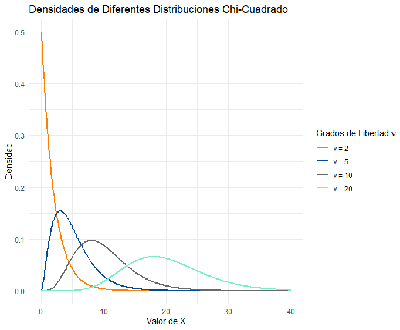
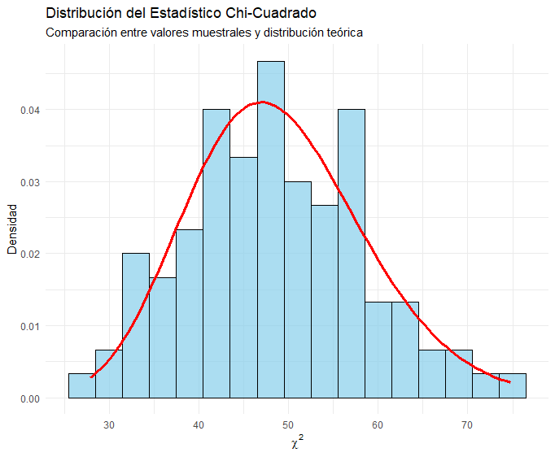
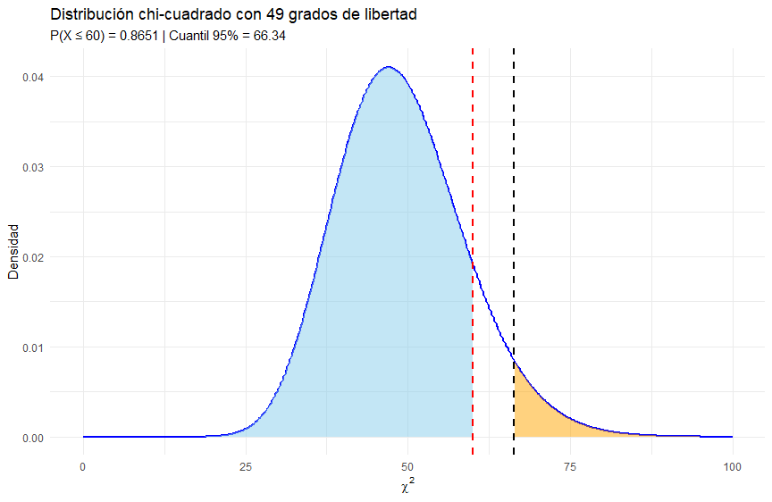

```{r setup, include=FALSE}
knitr::opts_chunk$set(echo = TRUE, message = FALSE, warning = FALSE, comment = NA)
```


</br></br>
<h2>Introducción</h2>

En estadística inferencial, el concepto de **distribuciones de muestreo** es fundamental para la estimación de parámetros y la realización de pruebas de hipótesis. Una distribución de muestreo describe la variabilidad de un **estadístico muestral**, como la media o la varianza, cuando se extraen múltiples muestras de una misma población. Estas distribuciones permiten modelar la incertidumbre y evaluar la **precisión de las estimaciones**.

Existen varias distribuciones de muestreo que desempeñan un papel crucial en el análisis estadístico. Entre las más utilizadas se encuentran la **distribución t de Student**, la **distribución chi-cuadrado** y la **distribución F de Fisher**, cada una con aplicaciones específicas en la inferencia estadística.


</br></br>
<h3>Chi-Cuadrado (\(\chi^2\))</h3>

Esta distribución es ampliamente utilizada en pruebas de hipótesis y estimaciones de varianza en inferencia estadística, especialmente en la prueba **Chi-Cuadrado de bondad de ajuste**, prueba **de independencia en tablas de contingencia** y en la construcción de **intervalos de confianza para la varianza poblacional**.

</br></br>
<h4>Distribución Chi-Cuadrado (\(\chi^2\))</h4>


La distribución **Chi-Cuadrado** es un caso particular de la distribución **Gamma** y se define mediante un parámetro de **grados de libertad** \( \nu \), que representa el número de variables normales estándar elevadas al cuadrado y sumadas. 

La función de densidad de probabilidad de una variable aleatoria \( X \sim \chi^2_{\nu} \) está dada por:

$$
f(x; \nu) =
\frac{x^{\frac{\nu}{2} - 1} e^{-x/2}}{2^{\nu/2} \Gamma(\nu/2)}, \quad x > 0
$$  

donde \( \Gamma(\nu/2) \) es la función Gamma, definida como:

$$
\Gamma(y) = \int_0^\infty t^{y - 1} e^{-t} dt
$$


</br></br>
<h4>Relación con otras distribuciones</h4>


- Si \( X_1, X_2, \dots, X_{\nu} \) son variables independientes con distribución normal estándar \( N(0,1) \), entonces la suma de sus cuadrados sigue una distribución chi-cuadrado con \( \nu \) grados de libertad:

  $$
  X_1^2 + X_2^2 + \dots + X_{\nu}^2 \sim \chi^2_{\nu}
  $$

- La distribución **Chi-Cuadrado** es un caso particular de la **distribución Gamma** con parámetros \( \alpha = \nu/2 \) y \( \sigma = 2 \).


</br></br>
<h4>Propiedades</h4>

- **Media:**  
  $$
  E[X] = \nu
  $$  
- **Varianza:**  
  $$
  \text{Var}(X) = 2\nu
  $$  
- **Asimetría:** La distribución es sesgada a la derecha, pero conforme \( \nu \) aumenta, la distribución se aproxima a una normal \( N(\nu, 2\nu) \).


</br></br>
<h4>Relación con la varianza muestral</h4>

Si \( S^{2} \) es la **varianza muestral** de una muestra aleatoria de tamaño \( n \) extraída de una población normal con **varianza poblacional** \( \sigma^{2} \), entonces el siguiente estadístico:

\[
\chi^{2} = \frac{(n-1)S^{2}}{\sigma^{2}} = \sum_{i=1}^{n} \frac{(X_{i}-\bar{X})^{2}}{\sigma^{2}}
\]

sigue una **distribución chi-cuadrado** con \( \nu = n-1 \) **grados de libertad**.


La distribución **chi-cuadrado** aparece al analizar la **varianza muestral** y se define como:

\[
\chi^2 = \sum_{i=1}^{n} \left(\frac{X_i - \mu}{\sigma}\right)^2
\]

donde:

- \(X_i\) son observaciones de una población normal.
- \(\mu\) es la media poblacional.
- \(\sigma\) es la desviación estándar poblacional.


</br></br>
<div class="caja-ejemplo">
<h3>Ejemplo:</h3>
<p>

La **Figura 2.40** muestra como la Chi-Cuadrado con pocos grados de libertad tiene una mayor concentración de valores cercanos a cero y es más sesgada, mientras que con grados de libertad altos se distribuye más ampliamente y se asemeja a una normal.

<pre>
# Cargar librerías necesarias
library(ggplot2)
library(dplyr)

# Definir valores de grados de libertad (df) para la distribución Chi-Cuadrado
parametros <- data.frame(
  df = c(2, 5, 10, 20),  # Valores de grados de libertad
  color = c("#FF7F00", "#034A94", "#686868", "#76EEC6")  # Colores asociados
)

# Crear un rango de valores para X
x_vals <- seq(0, 40, length.out = 300)

# Generar datos para cada distribución Chi-Cuadrado
data <- expand.grid(x = x_vals, df = parametros$df) %>%
  left_join(parametros, by = "df") %>%
  mutate(densidad = dchisq(x, df = df),
         label = factor(df, labels = paste0("ν = ", parametros$df)))  # Etiqueta con ν bien formateada

# Crear la gráfica con leyenda bien presentada
plot.chi2 <- ggplot(data, aes(x = x, y = densidad, color = label)) +
  geom_line(linewidth = 1) +
  labs(title = "Densidades de Diferentes Distribuciones Chi-Cuadrado",
       x = "Valor de X",
       y = "Densidad",
       color = expression(paste("Grados de Libertad ", nu))) +  # Formato correcto para la leyenda
  scale_color_manual(values = parametros$color) +
  theme_minimal()

# Mostrar la gráfica
print(plot.chi2)
</pre>


```{r, echo=TRUE, fig.height=3.5}
# Cargar librerías necesarias
library(ggplot2)
library(dplyr)

# Definir valores de grados de libertad (df) para la distribución Chi-Cuadrado
parametros <- data.frame(
  df = c(2, 5, 10, 20),  # Valores de grados de libertad
  color = c("#FF7F00", "#034A94", "#686868", "#76EEC6")  # Colores asociados
)

# Crear un rango de valores para X
x_vals <- seq(0, 40, length.out = 300)

# Generar datos para cada distribución Chi-Cuadrado
data <- expand.grid(x = x_vals, df = parametros$df) %>%
  left_join(parametros, by = "df") %>%
  mutate(densidad = dchisq(x, df = df),
         label = factor(df, labels = paste0("ν = ", parametros$df)))  # Etiqueta con ν bien formateada

# Crear la gráfica con leyenda bien presentada
plot.chi2 <- ggplot(data, aes(x = x, y = densidad, color = label)) +
  geom_line(linewidth = 1) +
  labs(title = "Densidades de Diferentes Distribuciones Chi-Cuadrado",
       x = "Valor de X",
       y = "Densidad",
       color = expression(paste("Grados de Libertad ", nu))) +  # Formato correcto para la leyenda
  scale_color_manual(values = parametros$color) +
  theme_minimal()

# Mostrar la gráfica
# print(plot.chi2)
```


<br/><br/>
<center>
```{r, echo=FALSE, out.width="80%", fig.align = "center"}

```
**Figura 2.40** Función de densidad la chi-cuadrado para grados de libertad 2, 5, 10 y 20.
</center>
<br/><br/>


</p>
</div>


</br></br>
<div class="caja-ejemplo">
<h3>Ejemplo:</h3>
<p>


En la **Figura 2.41**, se representa la distribución del estadístico 

\[
\chi^2 = \frac{(n-1)S^2}{\sigma^2}
\]

calculado a partir de **100 muestras aleatorias** de tamaño \( n = 50 \), extraídas de una población normal con media \( 20 \) y desviación estándar \( 5 \).

Cada muestra se utilizó para calcular la **varianza muestral** \( S^2 \), la cual fue transformada mediante la expresión del estadístico **chi-cuadrado**. El histograma resultante muestra la distribución empírica de los valores obtenidos de \( \chi^2 \), y se superpone con la densidad teórica de una distribución **Chi-Cuadrado con 49 grados de libertad**.

Se observa que los valores simulados siguen de manera cercana la forma esperada de la distribución teórica, lo que confirma la validez de la **aproximación chi-cuadrado** para la **varianza muestral** en poblaciones normales.


<pre>
# Cargar librerías necesarias
library(ggplot2)

# Configuración de parámetros
set.seed(123)  # Para reproducibilidad
mu <- 20       # Media de la población
sigma <- 5     # Desviación estándar poblacional
n <- 50        # Tamaño de la muestra
df <- n - 1    # Grados de libertad (n-1)
num_muestras <- 100  # Número de muestras a generar

# Generar 100 muestras y calcular los valores de Chi-Cuadrado
chi_cuadrado_vals <- replicate(num_muestras, {
  muestra <- rnorm(n, mean = mu, sd = sigma)  # Generar muestra normal
  S2 <- var(muestra)  # Calcular varianza muestral
  (df * S2) / sigma^2  # Calcular estadístico Chi-Cuadrado
})

# Crear un data frame para la gráfica
datos <- data.frame(Chi2 = chi_cuadrado_vals)

# Crear la gráfica del histograma con la curva teórica de Chi-Cuadrado
plot.chi3<-ggplot(datos, aes(x = Chi2)) +
  geom_histogram(aes(y = after_stat(density)), binwidth = 3, fill = "skyblue", color = "black", alpha = 0.7) +  # Histograma con densidad
  stat_function(fun = function(x) dchisq(x, df = df), color = "red", linewidth = 1.2) +  # Curva teórica Chi-Cuadrado
  labs(title = "Distribución del Estadístico Chi-Cuadrado",
       subtitle = "Comparación entre valores muestrales y distribución teórica",
       x = expression(chi^2),
       y = "Densidad") +
  theme_minimal()  # Tema estético minimalista

print(plot.chi3)  
</pre>


```{r, echo=TRUE, fig.height=3.5}
# Cargar librerías necesarias
library(ggplot2)

# Configuración de parámetros
set.seed(123)  # Para reproducibilidad
mu <- 20       # Media de la población
sigma <- 5     # Desviación estándar poblacional
n <- 50        # Tamaño de la muestra
df <- n - 1    # Grados de libertad (n-1)
num_muestras <- 100  # Número de muestras a generar

# Generar 100 muestras y calcular los valores de Chi-Cuadrado
chi_cuadrado_vals <- replicate(num_muestras, {
  muestra <- rnorm(n, mean = mu, sd = sigma)  # Generar muestra normal
  S2 <- var(muestra)  # Calcular varianza muestral
  (df * S2) / sigma^2  # Calcular estadístico Chi-Cuadrado
})

# Crear un data frame para la gráfica
datos <- data.frame(Chi2 = chi_cuadrado_vals)

# Crear la gráfica del histograma con la curva teórica de Chi-Cuadrado
plot.chi3<-ggplot(datos, aes(x = Chi2)) +
  geom_histogram(aes(y = after_stat(density)), binwidth = 3, fill = "skyblue", color = "black", alpha = 0.7) +  # Histograma con densidad
  stat_function(fun = function(x) dchisq(x, df = df), color = "red", linewidth = 1.2) +  # Curva teórica Chi-Cuadrado
  labs(title = "Distribución del Estadístico Chi-Cuadrado",
       subtitle = "Comparación entre valores muestrales y distribución teórica",
       x = expression(chi^2),
       y = "Densidad") +
  theme_minimal()  # Tema estético minimalista

#print(plot.chi3)  
```


<br/><br/>
<center>
```{r, echo=FALSE, out.width="80%", fig.align = "center"}

```
**Figura 2.41** Distribución del Estadístico Chi-Cuadrado a partir de Muestras Aleatorias. 
Representación de la distribución del estadístico \( \chi^{2} = \frac{(n-1)S^{2}}{\sigma^{2}} \) 
calculado a partir de muestras aleatorias de tamaño 50 extraídas de una población normal con media 20 y desviación estándar 5.
</center>
<br/><br/>

</p>
</div


</br></br>
<div class="caja-ejemplo">
<h3>Ejemplo:</h3>
<p>

Este cejemplo  ilustra cómo calcular probabilidades y cuantiles de una distribución Chi-Cuadrado con 49 grados de libertad y cómo visualizar estos cálculos gráficamente.

Se puede calcular la probabilidad acumulada de una distribución **Chi-Cuadrado** con `pchisq()`, la cual devuelve:

$$
P(X \leq x) = \int_{0}^{x} f(t) dt
$$

donde \( f(t) \) es la función de densidad de la distribución Chi-Cuadrado. En este ejemplo $x=60$.


El cálculo de un **cuantil** \( x_p \) se obtiene con `qchisq(p, df)`, el cual devuelve el valor \( x_p \) que satisface:

$$
P(X \leq x_p) = p
$$

Esto permite determinar, por ejemplo, el **percentil 95%**  ($p=0.95$) de la distribución Chi-Cuadrado.


La **Figura 2.42** ilustra las **probabilidades acumuladas** y los **cuantiles** en la distribución Chi-Cuadrado, utilizando gráficos que resaltan las áreas bajo la curva de densidad. En particular, se muestra el cálculo de la probabilidad \( P(X \leq 60) = 0.8651 \), lo que indica que existe un 0. 8651 de probabilidad de que la variable tome un valor menor o igual a 60 (representado por el área azul).  

Además, el área amarilla representa un 0.05 de probabilidad, y la línea punteada negra marca el **percentil 95%**, correspondiente al valor crítico de **66.34**. Esto significa que el 5% de los valores más altos de la variable Chi-Cuadrado con 49 grados de libertad son superiores a este umbral.


<pre>
# Cargar librerías necesarias
library(ggplot2)

# Definir los parámetros de la distribución Chi-Cuadrado
gl <- 49  # Grados de libertad

# Generar un rango de valores para la distribución
x_vals <- seq(0, 100, length.out = 500)

# Calcular la densidad de la distribución Chi-Cuadrado
densidad <- dchisq(x_vals, df = gl)

# Crear un data frame para graficar la densidad
datos <- data.frame(X = x_vals, Densidad = densidad)

# Calcular una probabilidad P(X <= x)
x_prob <- 60  # Punto de evaluación
probabilidad <- pchisq(x_prob, df = gl)

# Calcular un cuantil P(X <= x_q) = 0.95
p_cuantil <- 0.95
x_cuantil <- qchisq(p_cuantil, df = gl)

# Graficar la función de densidad con áreas sombreadas
plot_chi <- ggplot(datos, aes(x = X, y = Densidad)) +
  geom_line(color = "blue", linewidth = 1) +
  geom_area(data = subset(datos, X <= x_prob), aes(y = Densidad), fill = "skyblue", alpha = 0.5) +
  geom_vline(xintercept = x_prob, color = "red", linetype = "dashed", linewidth = 1) +
  geom_area(data = subset(datos, X >= x_cuantil), aes(y = Densidad), fill = "orange", alpha = 0.5) +
  geom_vline(xintercept = x_cuantil, color = "darkred", linetype = "dashed", linewidth = 1) +
  labs(
    title = "Distribución Chi-Cuadrado con 49 Grados de Libertad",
    subtitle = paste0("P(X ≤ ", x_prob, ") = ", round(probabilidad, 4), 
                      " | Cuantil 95% = ", round(x_cuantil, 2)),
    x = expression(chi^2),
    y = "Densidad"
  ) +
  theme_minimal()

# Mostrar la gráfica
print(plot_chi)

# Mostrar resultados en consola
cat("Probabilidad P(X ≤", x_prob, ") =", round(probabilidad, 4), "\n")
cat("Cuantil 95% =", round(x_cuantil, 2), "\n")
</pre>


```{r, echo=TRUE, fig.height=3.5}
# Cargar librerías necesarias
library(ggplot2)

# Definir los parámetros de la distribución Chi-Cuadrado
gl <- 49  # Grados de libertad

# Generar un rango de valores para la distribución
x_vals <- seq(0, 100, length.out = 500)

# Calcular la densidad de la distribución Chi-Cuadrado
densidad <- dchisq(x_vals, df = gl)

# Crear un data frame para graficar la densidad
datos <- data.frame(X = x_vals, Densidad = densidad)

# Calcular una probabilidad P(X <= x)
x_prob <- 60  # Punto de evaluación
probabilidad <- pchisq(x_prob, df = gl)

# Calcular un cuantil P(X <= x_q) = 0.95
p_cuantil <- 0.95
x_cuantil <- qchisq(p_cuantil, df = gl)

# Graficar la función de densidad con áreas sombreadas
plot_chi <- ggplot(datos, aes(x = X, y = Densidad)) +
  geom_line(color = "blue", linewidth = 1) +
  geom_area(data = subset(datos, X <= x_prob), aes(y = Densidad), fill = "skyblue", alpha = 0.5) +
  geom_vline(xintercept = x_prob, color = "red", linetype = "dashed", linewidth = 1) +
  geom_area(data = subset(datos, X >= x_cuantil), aes(y = Densidad), fill = "orange", alpha = 0.5) +
  geom_vline(xintercept = x_cuantil, color = "darkred", linetype = "dashed", linewidth = 1) +
  labs(
    title = "Distribución Chi-Cuadrado con 49 Grados de Libertad",
    subtitle = paste0("P(X ≤ ", x_prob, ") = ", round(probabilidad, 4), 
                      " | Cuantil 95% = ", round(x_cuantil, 2)),
    x = expression(chi^2),
    y = "Densidad"
  ) +
  theme_minimal()

# Mostrar la gráfica
# print(plot_chi)

# Mostrar resultados en consola
cat("Probabilidad P(X ≤", x_prob, ") =", round(probabilidad, 4), "\n")
cat("Cuantil 95% =", round(x_cuantil, 2), "\n")
```


<br/><br/>
<center>
```{r, echo=FALSE, out.width="80%", fig.align = "center"}

```
**Figura 2.42** El área sombreada en **azul** representa la probabilidad acumulada \( P(X \leq 60) = 0.8651 \), mientras que el área **amarilla** corresponde al 5% superior de la distribución, con el **percentil 95%** ubicado en \( x = 66.34 \) (línea punteada en negro).
</center>
<br/><br/>


</p>
</div


</br></br>
<h3>F de Fisher</h3>

La **distribución F de Fisher** surge en el contexto de la inferencia estadística y se utiliza principalmente en el análisis de **comparación de varianzas** y en la **prueba de significancia en modelos de regresión**. Es una distribución de probabilidad continua que depende de dos parámetros: los **grados de libertad del numerador** \( \nu_1 \) y los **grados de libertad del denominador** \( \nu_2 \).


</br></br>
<h4>Distribución F de Fisher</h4>

Si \( X \sim F(\nu_1, \nu_2) \), la función de densidad de probabilidad  está dada por:

\[
f(x; \nu_1, \nu_2) =
\frac{\Gamma\left(\frac{\nu_1 + \nu_2}{2}\right)}{\Gamma\left(\frac{\nu_1}{2}\right) \Gamma\left(\frac{\nu_2}{2}\right)}
\left(\frac{\nu_1}{\nu_2}\right)^{\frac{\nu_1}{2}}
\frac{x^{\frac{\nu_1}{2} - 1}}{\left(1 + \frac{\nu_1}{\nu_2}x\right)^{\frac{\nu_1 + \nu_2}{2}}},
\quad x > 0
\]

donde \( \Gamma(\cdot) \) es la función Gamma.


</br></br>
<h4>Relación con otras distribuciones</h4>

Si \( U \sim \chi^2_{\nu_1} \) y \( V \sim \chi^2_{\nu_2} \) son variables aleatorias independientes con distribuciones **chi-cuadrado**, entonces la variable aleatoria definida como:

\[
F = \frac{(U/\nu_1)}{(V/\nu_2)}
\]

sigue una **distribución F de Fisher** con \( \nu_1 \) y \( \nu_2 \) grados de libertad.


</br></br>
<h4>Propiedades</h4>


- **Media:**  
  \[
  E[X] = \frac{\nu_2}{\nu_2 - 2}, \quad \text{para } \nu_2 > 2
  \]
- **Varianza:**  
  \[
  \text{Var}(X) = \frac{2\nu_2^2 (\nu_1 + \nu_2 - 2)}{\nu_1 (\nu_2 - 2)^2 (\nu_2 - 4)}, \quad \text{para } \nu_2 > 4
  \]
- **Asimetría:** La distribución es **sesgada a la derecha**, pero conforme \( \nu_1 \) y \( \nu_2 \) aumentan, la distribución se aproxima a una normal estándar.


</br></br>
<h4>Relación con varianzas muestrales</h4>

Si \( S_{1}^{2} \) y \( S_{2}^{2} \) son las **varianzas muestrales** de dos muestras aleatorias independientes de tamaño \( n_1 \) y \( n_2 \), extraídas de poblaciones normales con varianzas \( \sigma_{1}^{2} \) y \( \sigma_{2}^{2} \), respectivamente, entonces el siguiente estadístico:

\[
F=\frac{S_{1}^{2}/\sigma_{1}^{2}}{S_{2}^{2}/\sigma_{2}^{2}}=\frac{\sigma_{2}^{2}S_{1}^{2}}{\sigma_{1}^{2}S_{2}^{2}}
\]

sigue una **distribución F** con \( \nu_1 = n_1 - 1 \) y \( \nu_2 = n_2 - 1 \) grados de libertad.

Este resultado es fundamental en la **prueba F para la comparación de varianzas**, donde se evalúa si dos poblaciones normales tienen **igualdad de varianzas**, y en el **Análisis de Varianza (ANOVA)**, donde se comparan múltiples medias poblacionales.


</br></br>
<h3>t-Student</h3>

La **distribución t-Student** es una distribución de probabilidad continua utilizada en inferencia estadística cuando se trabaja con muestras pequeñas y la varianza poblacional es desconocida. Se aplica principalmente en:

- **Pruebas de hipótesis** sobre una media poblacional.
- **Construcción de intervalos de confianza** para la media cuando la varianza poblacional no es conocida.
- **Comparación de medias entre dos grupos** en la prueba t de Student.


</br></br>
<h4>Distribución t-Student</h4>

Si \( X \sim t(\nu) \), la función de densidad de probabilidad está dada por:

\[
f(x; \nu) = \frac{\Gamma\left(\frac{\nu+1}{2}\right)}{\sqrt{\nu\pi} \Gamma\left(\frac{\nu}{2}\right)} 
\left(1 + \frac{x^2}{\nu}\right)^{-\frac{\nu+1}{2}}, \quad x \in \mathbb{R}
\]

donde:

- \( \nu \) representa los **grados de libertad**.
- \( \Gamma(\cdot) \) es la función Gamma.


</br></br>
<h4>Relación con otras distribuciones</h4>

Si \( Z \sim N(0,1) \) es una variable aleatoria normal estándar y \( V \sim \chi^2_{\nu} \) es una variable aleatoria con distribución **chi-cuadrado** con \( \nu \) grados de libertad, entonces la variable:

\[
T = \frac{Z}{\sqrt{V/\nu}}
\]

sigue una **distribución t-Student** con \( \nu \) grados de libertad. 

La distribución t-Student se relaciona con la normal estándar cuando los grados de libertad son grandes, es decir:

\[
t_{\nu} \to N(0,1) \quad \text{cuando } \nu \to \infty.
\]


</br></br>
<h4>Propiedades</h4>

- **Media:**  
  \[
  E[X] = 0, \quad \text{para } \nu > 1
  \]
- **Varianza:**  
  \[
  \text{Var}(X) = \frac{\nu}{\nu - 2}, \quad \text{para } \nu > 2
  \]
- **Simetría:** La distribución es **simétrica alrededor de 0**, lo que la diferencia de la distribución F.
- **Colas más pesadas:** En comparación con la normal estándar, la t-Student tiene colas más anchas, lo que implica mayor variabilidad en muestras pequeñas.


</br></br>
<h4>Relación con estimadores muestrales</h4>


Si \( X_1, X_2, \dots, X_n \) son variables aleatorias independientes con distribución normal \( N(\mu, \sigma^2) \), la **media muestral** y la **varianza muestral** se definen como:

\[
\bar{X} = \frac{1}{n} \sum_{i=1}^{n} X_i, \quad S^2 = \frac{1}{n-1} \sum_{i=1}^{n} (X_i - \bar{X})^2.
\]

La variable aleatoria obtenida al estandarizar la diferencia entre la media muestral y la media poblacional usando la desviación estándar muestral:

\[
T = \frac{\bar{X} - \mu}{S/\sqrt{n}}
\]

sigue una **distribución t-Student** con \( \nu = n - 1 \) grados de libertad.

Este resultado es fundamental en la **prueba t para una media poblacional**, donde se compara una muestra con un valor de referencia, y en la **prueba t para dos muestras**, donde se comparan dos medias.


<div class="caja-actividad">
<h3>Actividad:</h3>

>
<p>
- Genera y grafica distintas distribuciones **t de Student** para diferentes grados de libertad (\(\nu = 2, 5, 10, 30\)). Superpón las curvas de densidad en un mismo gráfico y analizar cómo cambia la forma de la distribución conforme aumentan los grados de libertad.
- Realiza lo mismo con la distribución **F de Fisher**, considerando diferentes pares de grados de libertad (\(\nu_1 = 2, 5, 10\) y \(\nu_2 = 20\)). Compara cómo varía la asimetría de la distribución conforme cambian los grados de libertad.
- Genera  **100 muestras aleatorias de tamaño 30** de una población normal con media 50 y desviación estándar 10. Para cada muestra, calcular el estadístico: \(T = \frac{\bar{X} - \mu}{S / \sqrt{n}}\) donde \(\bar{X}\) es la media muestral y \(S\) es la desviación estándar muestral. Grafica un histograma con los valores obtenidos del estadístico \(T\) y superpón la curva teórica de la distribución **t de Student** con \( \nu = 29 \) grados de libertad.
- Realiza un experimento similar con la distribución **F de Fisher**, utilizando dos muestras independientes de tamaño 20 y 30 respectivamente, para calcular el estadístico: \(F = \frac{S_1^2}{S_2^2}\)
y compara el histograma con la curva teórica de la distribución F con parámetros \(\nu_1 = 19\) y \(\nu_2 = 29\).
</p>
>

</div>
