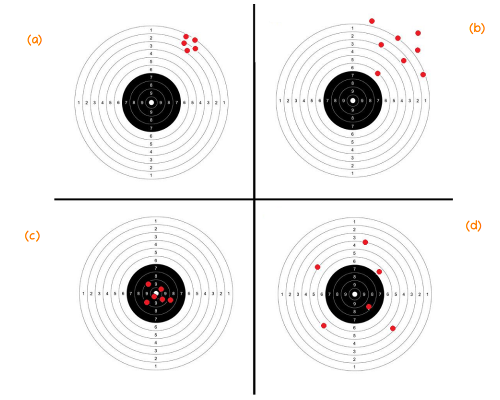

```{r setup, include=FALSE}
knitr::opts_chunk$set(echo = TRUE, message = FALSE, warning = FALSE, comment = NA)
```

</br></br>
<h2>Introducción</h2>

En estadística inferencial, un **estimador** es una función de la muestra utilizada para aproximar un **parámetro poblacional desconocido**. La calidad de un estimador se evalúa a través de ciertas propiedades que garantizan su eficiencia y confiabilidad en la estimación.
<br/>

<center>
```{r, echo=FALSE, out.width="90%", fig.align = "center"}

```
**Figura 2.45** Caracteristicas de los estimadores (a) baja varianza con sesgo   (b) alta varianza con sesgo  <br/> (c) baja varianza sin sesgo (d) alta varianza sin sesgo.
</center>

</br></br>
En el estudio de los **estimadores estadísticos**, es fundamental analizar sus propiedades de **sesgo** y **varianza**, ya que estas determinan su calidad y confiabilidad. Para ilustrar estos conceptos, podemos hacer una analogía con un **tiro al blanco** (ver **Figura 2.45**), donde:

- El **punto central** representa el **valor real del parámetro desconocido** que intentamos estimar.
- Cada **disparo** representa una **estimación basada en una muestra**.
- La **dispersión de los disparos** representa la **varianza del estimador**.
- La **desviación sistemática del centro** representa el **sesgo del estimador**.

La siguiente figura representa diferentes combinaciones de **sesgo y varianza** en los estimadores:


- **Figura (a): Estimador con sesgo pero baja varianza**  
  En este caso, el estimador presenta **alta precisión** (los valores estimados están agrupados) pero **es sesgado** (se aleja sistemáticamente del valor verdadero). Esto ocurre cuando el estimador está **mal calibrado**, lo que puede deberse a una fórmula incorrecta o un mal modelo subyacente.

- **Figura (b): Estimador con sesgo y alta varianza**  
  Aquí, además de ser **sesgado**, el estimador tiene **alta varianza**, lo que significa que las estimaciones son **altamente dispersas** y también están desplazadas respecto al valor real del parámetro. Este tipo de estimador es poco confiable, ya que no solo se aleja sistemáticamente del objetivo, sino que además tiene **gran incertidumbre** en sus estimaciones.

- **Figura (c): Estimador ideal (insesgado y con baja varianza)**  
  En este caso, el estimador **no tiene sesgo** (los valores estimados están centrados en el verdadero valor del parámetro) y tiene **baja varianza** (las estimaciones están muy agrupadas). Este es el mejor tipo de estimador, ya que es **preciso y exacto**.

- **Figura (d): Estimador insesgado pero con alta varianza**  
  Aquí, aunque el estimador **en promedio es correcto** (los disparos están alrededor del valor real), tiene **alta varianza**, lo que indica que las estimaciones individuales pueden estar lejos del valor real en cada muestra. Este tipo de estimador puede ser útil si se dispone de un gran número de observaciones, ya que el promedio de muchas estimaciones tendería al valor verdadero.


Para obtener buenos estimadores en la práctica, se busca minimizar tanto el **sesgo** como la **varianza**. Sin embargo, existe un **compromiso entre sesgo y varianza** (bias-variance tradeoff), especialmente en problemas de aprendizaje automático y modelado estadístico. 

El objetivo en la inferencia estadística es encontrar estimadores **insesgados y con la menor varianza posible**, asegurando estimaciones confiables y precisas.


</br></br>
<h2>Propiedades de los estimadores</h2>

<!-- En el centro se ubica el parámetro desconocido (punto blanco) y que tratamos de estimar utilizando para ello el estimador apropiado (figurativamente el arma que utilizamos).  En la figura ($a$) tenemos el resultado de un arma (estimador 1) que aunque tiene una alta precisión  ( poca varianza), presenta un desvío del centro  (sesgo). En la figura ($b$) se presenta el resultado de otra arma (estimador 2) que al igual que la primera que presenta un desvío del centro (sesgo), presenta una mayor varianza. La figura ($c$) representa el arma ideal (no tiene sesgo y poca varianza) y por último la figura ($d$)  que en promedio diríamos que está centrada (no sesgo), presenta una variación alta. -->


</br></br>
<h3>Insesgadez</h3>

Un estimador \( \hat{\theta} \) es insesgado si su **valor esperado** es igual al parámetro poblacional que estima, es decir:
  \[
  E[\hat{\theta}] = \theta.
  \]
  Esto significa que, en promedio, el estimador no sobrestima ni subestima el valor verdadero del parámetro.
  

</br></br>
<h3>Consistencia</h3>

Un estimador es consistente si, a medida que el **tamaño de la muestra** aumenta, el estimador se acerca al verdadero valor del parámetro. Formalmente:
  \[
  \hat{\theta}_n \xrightarrow{P} \theta \quad \text{cuando } n \to \infty.
  \]

Para evaluar la **consistencia** de un estimador, es necesario verificar que, a medida que el tamaño de la muestra (\( n \)) aumenta, el estimador converge en probabilidad al verdadero valor del parámetro que se desea estimar. Esto se expresa formalmente como:

\[
\lim_{n \to \infty} P(|\hat{\theta}_n - \theta| > \epsilon) = 0
\]

donde \( \hat{\theta}_n \) es el estimador basado en una muestra de tamaño \( n \), \( \theta \) es el parámetro verdadero y \( \epsilon \) es cualquier número positivo pequeño.

Para demostrar la consistencia de un estimador, generalmente se siguen estos pasos:

1. **Insesgadez o sesgo asintótico nulo**: Verificar que el estimador es insesgado, es decir, \( E[\hat{\theta}_n] = \theta \), o que el sesgo disminuye a medida que \( n \) aumenta.

2. **Varianza que disminuye con \( n \)**: Comprobar que la varianza del estimador, \( \text{Var}(\hat{\theta}_n) \), tiende a cero cuando \( n \) tiende a infinito.

Si ambas condiciones se cumplen, el estimador \( \hat{\theta}_n \) es consistente para el parámetro \( \theta \).


</br></br>
<h3>Eficiencia</h3>

Se dice que un estimador es eficiente si tiene la **menor varianza posible** dentro de la clase de estimadores insesgados. Es decir, dado dos estimadores \( \hat{\theta}_1 \) y \( \hat{\theta}_2 \), se prefiere aquel con menor varianza:
  \[
  \text{Var}(\hat{\theta}_1) < \text{Var}(\hat{\theta}_2).
  \]


</br></br>
<h3>Suficiencia</h3>

Un estimador es suficiente si contiene **toda la información disponible** en la muestra acerca del parámetro que se desea estimar. Esto implica que no hay otro estimador basado en la misma muestra que proporcione **mejor información** sobre el parámetro.


</br></br>
<h3>Robustez</h3>

Un estimador es robusto si su desempeño **no se ve afectado significativamente** por la presencia de valores atípicos o pequeñas desviaciones en los supuestos del modelo.


</br></br>
<h2>Importancia de los estimadores</h2>

El estudio de las propiedades de los estimadores es fundamental para:

1. **Construcción de Intervalos de Confianza:** Se requiere que los estimadores sean insesgados y eficientes para obtener intervalos confiables.
2. **Pruebas de Hipótesis:** Se utilizan estimadores consistentes y eficientes para tomar decisiones estadísticas rigurosas.
3. **Modelos de Regresión y Predicción:** En machine learning y econometría, los estimadores juegan un papel clave en la estimación de parámetros en modelos predictivos.
4. **Análisis de Riesgos y Fiabilidad:** En ingeniería y finanzas, se utilizan estimadores para evaluar la confiabilidad de sistemas y riesgos de inversión.

Las **propiedades de los estimadores** garantizan la calidad de la inferencia estadística, permitiendo obtener conclusiones precisas y confiables en diversas aplicaciones del mundo real.


</br></br>
<div class="caja-ejemplo">
<h3>Ejemplo:</h3>
<p>

Se tiene una población ($X$) que sigue una **distribución Exponencial** con parámetro \( \lambda \), donde se cumplen las siguientes propiedades:

- **Media poblacional**:  
  \[
  E[X] = \frac{1}{\lambda}
  \]
- **Varianza poblacional**:  
  \[
  \text{Var}(X) = \frac{1}{\lambda^2}
  \]

Dada una muestra aleatoria independiente e identicamente distribuida de tamaño \( n \), \( X_1, X_2, \dots, X_n \) de la población $X$, se consideran los siguientes estimadores para el parámetro \( \theta=\frac{1}{\lambda} \):

\[
\widehat{\theta}_{1} = \dfrac{1}{6} \sum_{i=1}^{\frac{n}{2}} X_i + \dfrac{1}{3} \sum_{i=\frac{n}{2}+1}^{n} X_i
\]

\[
\widehat{\theta}_{2} = \dfrac{1}{n(n+1)} \sum_{i=1}^{n} i X_i
\]

\[
\widehat{\theta}_{3} = \dfrac{1}{n} \sum_{i=1}^{n} X_i
\]


</br></br>
**Paso 1: Verificación del insesgamiento de los estimadores**

Para verificar si los estimadores son insesgados, se calcula la esperanza matemática de cada uno:


**Esperanza de \( \widehat{\theta}_{1} \)**

\[
E\big[\widehat{\theta}_{1}\big] = E\Bigg[\dfrac{1}{6} \sum_{i=1}^{\frac{n}{2}} X_i + \dfrac{1}{3} \sum_{i=\frac{n}{2}+1}^{n} X_i\Bigg]
\]

Dado que la esperanza es lineal:

\[
E\big[\widehat{\theta}_{1}\big] = \dfrac{1}{6} \sum_{i=1}^{\frac{n}{2}} E[X_i] + \dfrac{1}{3} \sum_{i=\frac{n}{2}+1}^{n} E[X_i]
\]

\[
= \dfrac{1}{6} \sum_{i=1}^{\frac{n}{2}} \frac{1}{\lambda} + \dfrac{1}{3} \sum_{i=\frac{n}{2}+1}^{n} \frac{1}{\lambda}
\]

\[
= \dfrac{\frac{n}{2} \frac{1}{\lambda}}{6} + \dfrac{\frac{n}{2} \frac{1}{\lambda}}{3} = \frac{1}{\lambda}=\theta
\]

Concluimos que \( \widehat{\theta}_{1} \) es **insesgado**.


</br>
**Esperanza de \( \widehat{\theta}_{2} \)**

\[
E\big[\widehat{\theta}_{2}\big] = E\Bigg[\dfrac{1}{n(n+1)} \sum_{i=1}^{n} i X_i\Bigg]
\]

Usando la linealidad de la esperanza:

\[
E\big[\widehat{\theta}_{2}\big] = \dfrac{1}{n(n+1)} \sum_{i=1}^{n} i E[X_i]
\]

\[
= \dfrac{1}{n(n+1)} \sum_{i=1}^{n} i \frac{1}{\lambda}
\]

Dado que la suma de los primeros \( n \) números naturales es:

\[
\sum_{i=1}^{n} i = \frac{n(n+1)}{2}
\]

Entonces:

\[
E\big[\widehat{\theta}_{2}\big] = \dfrac{1}{n(n+1)} \cdot \frac{n(n+1)}{2} \frac{1}{\lambda} = \frac{1}{\lambda}=\theta
\]

Concluimos que \( \widehat{\theta}_{2} \) es **insesgado**.


</br>
**Esperanza de \( \widehat{\theta}_{3} \)**

\[
E\big[\widehat{\theta}_{3}\big] = E\Bigg[\dfrac{1}{n} \sum_{i=1}^{n} X_i\Bigg]
\]

Por la linealidad de la esperanza:

\[
E\big[\widehat{\theta}_{3}\big] = \dfrac{1}{n} \sum_{i=1}^{n} E[X_i]
\]

\[
= \dfrac{1}{n} \sum_{i=1}^{n} \frac{1}{\lambda} = \frac{1}{\lambda}=\theta
\]

Concluimos que \( \widehat{\theta}_{3} \) es **insesgado**.


</br></br>
**Paso 2: Para determinar cuál de los estimadores es más eficiente**

Para determinar cuál de los estimadores es más eficiente, calculamos sus varianzas.


</br>
**Varianza de \( \widehat{\theta}_{1} \)**

\[
\text{Var}\big[\widehat{\theta}_{1}\big] = \text{Var}\Bigg[\dfrac{1}{6} \sum_{i=1}^{\frac{n}{2}} X_i + \dfrac{1}{3} \sum_{i=\frac{n}{2}+1}^{n} X_i\Bigg]
\]

Dado que la varianza de una suma de variables independientes es la suma de las varianzas:

\[
\text{Var}\big[\widehat{\theta}_{1}\big] = \dfrac{1}{36} \sum_{i=1}^{\frac{n}{2}} \text{Var}(X_i) + \dfrac{1}{9} \sum_{i=\frac{n}{2}+1}^{n} \text{Var}(X_i)
\]

\[
= \dfrac{1}{36} \sum_{i=1}^{\frac{n}{2}} \frac{1}{\lambda^2} + \dfrac{1}{9} \sum_{i=\frac{n}{2}+1}^{n} \frac{1}{\lambda^2}
\]

\[
= \dfrac{\frac{n}{2} \frac{1}{\lambda^2}}{36} + \dfrac{\frac{n}{2} \frac{1}{\lambda^2}}{9} = \dfrac{10}{36} \frac{1}{\lambda^2}
\]


</br>
**Varianza de \( \widehat{\theta}_{2} \)**

\[
\text{Var}\big[\widehat{\theta}_{2}\big] = \dfrac{(2n+1)}{6n(n+1)} \frac{1}{\lambda^2}
\]


</br>
**Varianza de \( \widehat{\theta}_{3} \)**

\[
\text{Var}\big[\widehat{\theta}_{3}\big] = \dfrac{1}{n} \frac{1}{\lambda^2}
\]


Para determinar cuál de los estimadores tiene menor varianza, se comparan las varianzas calculadas de cada uno. Para comparar estas varianzas, analizamos sus coeficientes:

</br></br>
1. **Comparación entre \( \widehat{\theta}_{1} \) y \( \widehat{\theta}_{3} \)**:

   \[
   \frac{5}{18} \quad \text{vs.} \quad \frac{1}{n}
   \]

   Dado que \( \frac{5}{18} \approx 0.2778 \), para que \( \frac{1}{n} \) sea menor, \( n \) debe ser mayor que 3.6. Por lo tanto, para \( n \geq 4 \), \( \widehat{\theta}_{3} \) tiene menor varianza que \( \widehat{\theta}_{1} \).

</br>
2. **Comparación entre \( \widehat{\theta}_{2} \) y \( \widehat{\theta}_{3} \)**:

   \[
   \frac{2n + 1}{6n(n + 1)} \quad \text{vs.} \quad \frac{1}{n}
   \]

   Simplificando, la relación es:

   \[
   \frac{2n + 1}{6n(n + 1)} = \frac{2 + \frac{1}{n}}{6(n + 1)}
   \]

   Para que esta fracción sea menor que \( \frac{1}{n} \), se requiere que:

   \[
   \frac{2 + \frac{1}{n}}{6(n + 1)} < \frac{1}{n}
   \]

   Resolviendo esta desigualdad, se encuentra que para \( n \geq 2 \), \( \widehat{\theta}_{3} \) tiene menor varianza que \( \widehat{\theta}_{2} \).

</br></br>
Por tanto, para muestras de tamaño \( n \geq 4 \), el estimador \( \widehat{\theta}_{3} = \frac{1}{n} \sum_{i=1}^{n} X_i \) es el más eficiente, ya que presenta la menor varianza entre los tres estimadores analizados.


</br></br>
**Paso 3: Verificación de consistencia**

Para evaluar la **consistencia** del estimador \( \widehat{\theta}_{3} = \frac{1}{n} \sum_{i=1}^{n} X_i \), analizamos el comportamiento de su varianza a medida que el tamaño de la muestra \( n \) tiende a infinito.


Se observa que, a medida que \( n \) aumenta, la varianza de \( \widehat{\theta}_{3} \) disminuye. Específicamente:

\[
\lim_{n \to \infty} \text{Var}(\widehat{\theta}_{3}) = \lim_{n \to \infty} \frac{1}{n \lambda^2} = 0
\]

Esta propiedad indica que, conforme el tamaño de la muestra se incrementa, la dispersión del estimador alrededor del verdadero valor del parámetro disminuye, lo que implica que \( \widehat{\theta}_{3} \) es un **estimador consistente** de \( \frac{1}{\lambda} \).


Como la **varianza de \( \widehat{\theta}_{3} \)** es la menor de todas, se concluye que **\( \widehat{\theta}_{3} \) es el estimador más eficiente**, además de ser insesgado y consistente. Esto significa que **proporciona la mejor estimación de \( \frac{1}{\lambda} \) con menor dispersión** en sus valores.


</p>
</div>


</br></br>
<div class="caja-ejemplo">
<h3>Ejemplo:</h3>
<p>

Este ejemplo es una continuación del ejemplo anterior y consiste en realizar  cálculo numéricos para determinar
el mejor estimador entre los tres estimadores.
 
 

 
</br></br>
**Paso 1: Verificación del insesgamiento de los estimadores**

Para evaluar la **insesgadez** de los estimadores \( \widehat{\theta}_{1} \), \( \widehat{\theta}_{2} \) y \( \widehat{\theta}_{3} \) para el parámetro \( \theta = \frac{1}{\lambda} \) de una distribución exponencial, se realizó una simulación en **R**. En esta simulación, se generaron 10,000 muestras aleatorias de tamaño \( n = 10 \) de una distribución exponencial con \( \lambda = 2 \), lo que implica que el valor teórico de \( \theta \) es 0.5. Para cada muestra, se calcularon los tres estimadores mencionados, y posteriormente se obtuvo la media de las estimaciones para cada estimador.

Los resultados obtenidos fueron:

- **Valor teórico de \( \theta \)**: 0.5
- **Media del Estimador 1**: 1.248413
- **Media del Estimador 2**: 0.2498655
- **Media del Estimador 3**: 0.498731

La interpretación de los resultados:

- **Estimador 1 (\( \widehat{\theta}_{1} \))**: La media de este estimador es significativamente mayor que el valor teórico de \( \theta \), lo que indica que \( \widehat{\theta}_{1} \) es un estimador **sesgado** y **sobrestima** el parámetro.

- **Estimador 2 (\( \widehat{\theta}_{2} \))**: La media de este estimador es considerablemente menor que \( \theta \), sugiriendo que \( \widehat{\theta}_{2} \) es también un estimador **sesgado**, pero en este caso **subestima** el parámetro.

- **Estimador 3 (\( \widehat{\theta}_{3} \))**: La media de este estimador es muy cercana al valor teórico de \( \theta \), lo que indica que \( \widehat{\theta}_{3} \) es un estimador **insesgado**.

Estos resultados demuestran que, entre los tres estimadores evaluados, \( \widehat{\theta}_{3} \) es el único que proporciona una estimación insesgada del parámetro \( \theta \). La **Figura 2.46** ilustra las medias muestrales con las lineas punteadas, y se puede notar como la linea azul se aproxima al valor teórico.


<pre>
# Definir funciones para cada estimador

estimador1 <- function(muestra) {
  n <- length(muestra)
  mitad <- n / 2
  (1/6) * sum(muestra[1:mitad]) + (1/3) * sum(muestra[(mitad + 1):n])
}

estimador2 <- function(muestra) {
  n <- length(muestra)
  (1 / (n * (n + 1))) * sum((1:n) * muestra)
}

estimador3 <- function(muestra) {
  mean(muestra)
}

# Establecer parámetros
lambda <- 2  # Parámetro de la distribución exponencial
theta <- 1 / lambda  # Valor teórico de theta
n <- 10  # Tamaño de la muestra
num_simulaciones <- 10000  # Número de simulaciones

# Generar una matriz donde cada columna es una muestra de tamaño n
set.seed(123)  # Para reproducibilidad
muestras <- matrix(rexp(n * num_simulaciones, rate = lambda), nrow = n, ncol = num_simulaciones)


# Aplicar las funciones de los estimadores a cada columna de la matriz
estimaciones1 <- apply(muestras, 2, estimador1)
estimaciones2 <- apply(muestras, 2, estimador2)
estimaciones3 <- apply(muestras, 2, estimador3)

# Calcular las medias de los estimadores
media_est1 <- mean(estimaciones1)
media_est2 <- mean(estimaciones2)
media_est3 <- mean(estimaciones3)

# Mostrar resultados
cat("Valor teórico de theta:", theta, "\n")
cat("Media del Estimador 1:", media_est1, "\n")
cat("Media del Estimador 2:", media_est2, "\n")
cat("Media del Estimador 3:", media_est3, "\n")
</pre>

```{r, echo=TRUE, fig.height=3.5}
# Definir funciones para cada estimador

estimador1 <- function(muestra) {
  n <- length(muestra)
  mitad <- n / 2
  (1/6) * sum(muestra[1:mitad]) + (1/3) * sum(muestra[(mitad + 1):n])
}

estimador2 <- function(muestra) {
  n <- length(muestra)
  (1 / (n * (n + 1))) * sum((1:n) * muestra)
}

estimador3 <- function(muestra) {
  mean(muestra)
}

# Establecer parámetros
lambda <- 2  # Parámetro de la distribución exponencial
theta <- 1 / lambda  # Valor teórico de theta
n <- 10  # Tamaño de la muestra
num_simulaciones <- 10000  # Número de simulaciones

# Generar una matriz donde cada columna es una muestra de tamaño n
set.seed(123)  # Para reproducibilidad
muestras <- matrix(rexp(n * num_simulaciones, rate = lambda), nrow = n, ncol = num_simulaciones)


# Aplicar las funciones de los estimadores a cada columna de la matriz
estimaciones1 <- apply(muestras, 2, estimador1)
estimaciones2 <- apply(muestras, 2, estimador2)
estimaciones3 <- apply(muestras, 2, estimador3)

# Calcular las medias de los estimadores
media_est1 <- mean(estimaciones1)
media_est2 <- mean(estimaciones2)
media_est3 <- mean(estimaciones3)

# Mostrar resultados
#cat("Valor teórico de theta:", theta, "\n")
#cat("Media del Estimador 1:", media_est1, "\n")
#cat("Media del Estimador 2:", media_est2, "\n")
#cat("Media del Estimador 3:", media_est3, "\n")
```


<pre>
Valor teórico de theta: 0.5 
Media del Estimador 1: 1.248413 
Media del Estimador 2: 0.2498655 
Media del Estimador 3: 0.498731 
</pre>


</br></br>
**Paso 2: Para determinar cuál de los estimadores es más eficiente**


Para evaluar la **eficiencia** de los estimadores \( \widehat{\theta}_{1} \), \( \widehat{\theta}_{2} \) y \( \widehat{\theta}_{3} \) para el parámetro \( \theta = \frac{1}{\lambda} \), se realizó una simulación en **R**. En esta simulación, se generaron **10,000 muestras aleatorias** de tamaño \( n = 10 \) de una distribución exponencial con \( \lambda = 2 \), lo que implica que el valor teórico de \( \theta \) es **0.5**.  

Para cada muestra, se calcularon los tres estimadores mencionados y posteriormente se obtuvieron la **varianza** y el **coeficiente de variación (CV)** de las estimaciones para cada estimador. Además, se construyó un **gráfico de cajas** para visualizar la dispersión y la variabilidad de los estimadores.

Los resultados obtenidos son los siguientes:  

- **Varianza de los Estimadores:** 

  - \( \text{Var}(\widehat{\theta}_{1}) = 0.1703 \)
  - \( \text{Var}(\widehat{\theta}_{2}) = 0.0079 \)
  - \( \text{Var}(\widehat{\theta}_{3}) = 0.0243 \)

- **Coeficiente de Variación (CV):**  

  - \( CV(\widehat{\theta}_{1}) = 0.3306 \)
  - \( CV(\widehat{\theta}_{2}) = 0.3547 \)
  - \( CV(\widehat{\theta}_{3}) = 0.3128 \)

---

La interpretación de los resultados:  

- **Varianza y Coeficiente de Variación (CV):**  La **varianza** es un indicador clave de **eficiencia**, ya que un estimador más eficiente debe tener menor varianza. Se observa que
  \( \widehat{\theta}_{2} \) tiene la **menor varianza**, y  \( \widehat{\theta}_{1} \) presenta la **mayor varianza**. Además,  \( \widehat{\theta}_{3} \) presenta el menor **coeficiente de variación**, lo que indica que tiene la mejor estabilidad relativa entre las estimaciones. Aunque \( \widehat{\theta}_{2} \) tiene la menor varianza, su **CV es el más alto**. Adicionalmente, \( \widehat{\theta}_{1} \)  muestra consistentemente alta variabilidad y poca eficiencia.

- **Gráfico de cajas** (ver **Figura 2.46**): Se observa que el **Estimador 2** tiene la menor dispersión, lo que respalda su baja varianza, pero su distribución muestra estar **sesgada**. El **Estimador 3** muestra un **buen equilibrio entre baja varianza y centramiento en el valor verdadero**, lo que lo hace más confiable en general. El **Estimador 1** tiene **alta dispersión**, con valores extremos y una distribución más asimétrica.


<pre>
# Cargar las librerías necesarias
library(ggplot2)

# Definir funciones para cada estimador
estimador1 <- function(muestra) {
  n <- length(muestra)
  mitad <- n / 2
  (1/6) * sum(muestra[1:mitad]) + (1/3) * sum(muestra[(mitad + 1):n])
}

estimador2 <- function(muestra) {
  n <- length(muestra)
  (1 / (n * (n + 1))) * sum((1:n) * muestra)
}

estimador3 <- function(muestra) {
  mean(muestra)
}

# Establecer parámetros
lambda <- 2  # Parámetro de la distribución exponencial
theta <- 1 / lambda  # Valor teórico de theta
n <- 10  # Tamaño de la muestra
num_simulaciones <- 10000  # Número de simulaciones

# Generar una matriz donde cada columna es una muestra de tamaño n
set.seed(123)  # Para reproducibilidad
muestras <- matrix(rexp(n * num_simulaciones, rate = lambda), nrow = n, ncol = num_simulaciones)

# Aplicar las funciones de los estimadores a cada columna de la matriz
estimaciones1 <- apply(muestras, 2, estimador1)
estimaciones2 <- apply(muestras, 2, estimador2)
estimaciones3 <- apply(muestras, 2, estimador3)

# Calcular las varianzas de los estimadores
var_est1 <- var(estimaciones1)
var_est2 <- var(estimaciones2)
var_est3 <- var(estimaciones3)

# Calcular los coeficientes de variación de los estimadores
cv_est1 <- sd(estimaciones1) / mean(estimaciones1)
cv_est2 <- sd(estimaciones2) / mean(estimaciones2)
cv_est3 <- sd(estimaciones3) / mean(estimaciones3)

# Mostrar resultados
cat("Varianza del Estimador 1:", var_est1, "\n")
cat("Varianza del Estimador 2:", var_est2, "\n")
cat("Varianza del Estimador 3:", var_est3, "\n")
cat("Coeficiente de Variación del Estimador 1:", cv_est1, "\n")
cat("Coeficiente de Variación del Estimador 2:", cv_est2, "\n")
cat("Coeficiente de Variación del Estimador 3:", cv_est3, "\n")

# Crear un data frame para los boxplots
datos <- data.frame(
  Estimaciones = c(estimaciones1, estimaciones2, estimaciones3),
  Estimador = factor(rep(c("Estimador 1", "Estimador 2", "Estimador 3"), each = num_simulaciones))
)

# Calcular las medias de los estimadores para añadir líneas horizontales
medias_estimadores <- aggregate(Estimaciones ~ Estimador, datos, mean)

# Generar el gráfico de cajas comparativo con líneas en las medias
plot.ins.efi<-ggplot(datos, aes(x = Estimador, y = Estimaciones, fill = Estimador)) +
  geom_boxplot(alpha = 0.7) +
  geom_hline(data = medias_estimadores, aes(yintercept = Estimaciones, color = Estimador),
             linetype = "dashed", size = 1) +
  labs(title = "Comparación de Estimadores para θ = 0.5",
       y = "Estimaciones",
       x = "Estimador") +
  theme_minimal() +
  theme(legend.position = "none")


print(plot.ins.efi)
</pre>


```{r, echo=TRUE, fig.height=3.5}
# Cargar las librerías necesarias
library(ggplot2)

# Definir funciones para cada estimador
estimador1 <- function(muestra) {
  n <- length(muestra)
  mitad <- n / 2
  (1/6) * sum(muestra[1:mitad]) + (1/3) * sum(muestra[(mitad + 1):n])
}

estimador2 <- function(muestra) {
  n <- length(muestra)
  (1 / (n * (n + 1))) * sum((1:n) * muestra)
}

estimador3 <- function(muestra) {
  mean(muestra)
}

# Establecer parámetros
lambda <- 2  # Parámetro de la distribución exponencial
theta <- 1 / lambda  # Valor teórico de theta
n <- 10  # Tamaño de la muestra
num_simulaciones <- 10000  # Número de simulaciones

# Generar una matriz donde cada columna es una muestra de tamaño n
set.seed(123)  # Para reproducibilidad
muestras <- matrix(rexp(n * num_simulaciones, rate = lambda), nrow = n, ncol = num_simulaciones)

# Aplicar las funciones de los estimadores a cada columna de la matriz
estimaciones1 <- apply(muestras, 2, estimador1)
estimaciones2 <- apply(muestras, 2, estimador2)
estimaciones3 <- apply(muestras, 2, estimador3)

# Calcular las varianzas de los estimadores
var_est1 <- var(estimaciones1)
var_est2 <- var(estimaciones2)
var_est3 <- var(estimaciones3)

# Calcular los coeficientes de variación de los estimadores
cv_est1 <- sd(estimaciones1) / mean(estimaciones1)
cv_est2 <- sd(estimaciones2) / mean(estimaciones2)
cv_est3 <- sd(estimaciones3) / mean(estimaciones3)

# Mostrar resultados
#cat("Varianza del Estimador 1:", var_est1, "\n")
#cat("Varianza del Estimador 2:", var_est2, "\n")
#cat("Varianza del Estimador 3:", var_est3, "\n")
#cat("Coeficiente de Variación del Estimador 1:", cv_est1, "\n")
#cat("Coeficiente de Variación del Estimador 2:", cv_est2, "\n")
#cat("Coeficiente de Variación del Estimador 3:", cv_est3, "\n")

# Crear un data frame para los boxplots
datos <- data.frame(
  Estimaciones = c(estimaciones1, estimaciones2, estimaciones3),
  Estimador = factor(rep(c("Estimador 1", "Estimador 2", "Estimador 3"), each = num_simulaciones))
)

# Calcular las medias de los estimadores para añadir líneas horizontales
medias_estimadores <- aggregate(Estimaciones ~ Estimador, datos, mean)

# Generar el gráfico de cajas comparativo con líneas en las medias
plot.ins.efi<-ggplot(datos, aes(x = Estimador, y = Estimaciones, fill = Estimador)) +
  geom_boxplot(alpha = 0.7) +
  geom_hline(data = medias_estimadores, aes(yintercept = Estimaciones, color = Estimador),
             linetype = "dashed", size = 1) +
  labs(title = "Comparación de Estimadores para θ = 0.5",
       y = "Estimaciones",
       x = "Estimador") +
  theme_minimal() +
  theme(legend.position = "none")


#print(plot.ins.efi)
```

<pre>
Varianza del Estimador 1: 0.1703439 
Varianza del Estimador 2: 0.007856289 
Varianza del Estimador 3: 0.0243361 
Coeficiente de Variación del Estimador 1: 0.3306018
Coeficiente de Variación del Estimador 2: 0.3547337 
Coeficiente de Variación del Estimador 3: 0.3127945 
</pre>


<center>
```{r, echo=FALSE, out.width="90%", fig.align = "center"}

```
**Figura 2.46** Comparación de estimaciones de los tres estimadores de $\theta$.
</center>


</br></br>
**Paso 3: Verificación de consistencia**


Para evaluar la **consistencia** de los estimadores \( \widehat{\theta}_{1} \), \( \widehat{\theta}_{2} \) y \( \widehat{\theta}_{3} \) para el parámetro \( \theta = \frac{1}{\lambda} \), se realizó una simulación en **R**. En esta simulación, se generaron **10,000 muestras aleatorias** de distintos tamaños \( n = 10, 20, 30, 50, 100, 500, 1000 \) de una distribución exponencial con parámetro \( \lambda = 2 \), lo que implica que el valor teórico de \( \theta \) es **0.5**.  

Para cada muestra, se calcularon los tres estimadores mencionados y posteriormente se obtuvieron la **varianza** y el **coeficiente de variación (CV)** de las estimaciones para cada estimador. Además, se construyó un **gráfico de dispersión** del coeficiente de variación frente al tamaño de la muestra (ver **Figura 2.47**) para evaluar si la variabilidad disminuye al aumentar \( n \).

En la **Figura 2.47** se observa que el **CV** disminuye conforme aumenta el tamaño muestral, lo cual indica que los estimadores son consistentes. A medida que $n$ crece, la dispersión en las estimaciones se reduce, tendiendo a cero. Los tres estimadores analizados cumplen con la propiedad de consistencia, ya que conforme el tamaño de la muestra aumenta, la variabilidad de sus estimaciones disminuye.


<pre>
# Cargar las librerías necesarias
library(ggplot2)

# Definir funciones para cada estimador
estimador1 <- function(muestra) {
  n <- length(muestra)
  mitad <- n / 2
  (1/6) * sum(muestra[1:mitad]) + (1/3) * sum(muestra[(mitad + 1):n])
}

estimador2 <- function(muestra) {
  n <- length(muestra)
  (1 / (n * (n + 1))) * sum((1:n) * muestra)
}

estimador3 <- function(muestra) {
  mean(muestra)
}

# Establecer parámetros
lambda <- 2  # Parámetro de la distribución exponencial
theta <- 1 / lambda  # Valor teórico de theta
num_simulaciones <- 10000  # Número de simulaciones
tamaños_muestra <- c(10, 20, 30, 50, 100, 500, 1000)  # Diferentes tamaños de muestra

# Inicializar lista para almacenar los coeficientes de variación
coef_variacion <- data.frame()

# Bucle para analizar cada tamaño de muestra
set.seed(123)  # Para reproducibilidad
for (n in tamaños_muestra) {
  # Generar una matriz donde cada columna es una muestra de tamaño n
  muestras <- matrix(rexp(n * num_simulaciones, rate = lambda), nrow = n, ncol = num_simulaciones)
  
  # Aplicar las funciones de los estimadores a cada columna de la matriz
  estimaciones1 <- apply(muestras, 2, estimador1)
  estimaciones2 <- apply(muestras, 2, estimador2)
  estimaciones3 <- apply(muestras, 2, estimador3)
  
  # Calcular los coeficientes de variación de los estimadores
  cv_est1 <- sd(estimaciones1) / mean(estimaciones1)
  cv_est2 <- sd(estimaciones2) / mean(estimaciones2)
  cv_est3 <- sd(estimaciones3) / mean(estimaciones3)
  
  # Almacenar los resultados en un data frame
  coef_variacion <- rbind(coef_variacion, data.frame(n = n, Estimador = "Estimador 1", CV = cv_est1))
  coef_variacion <- rbind(coef_variacion, data.frame(n = n, Estimador = "Estimador 2", CV = cv_est2))
  coef_variacion <- rbind(coef_variacion, data.frame(n = n, Estimador = "Estimador 3", CV = cv_est3))
}

# Graficar el coeficiente de variación en función del tamaño de la muestra
plot_cv <- ggplot(coef_variacion, aes(x = n, y = CV, color = Estimador)) +
  geom_point(size = 3) +
  geom_line() +
  geom_hline(yintercept = 0, linetype = "dashed", color = "black") +
  scale_x_log10() +  # Escala logarítmica para mayor claridad
  labs(title = "Evaluacion de Consistencia: Coeficiente de Variacion",
       x = "Tamaño de Muestra (n)", 
       y = "Coeficiente de Variacion") +
  theme_minimal()

print(plot_cv)

print(coef_variacion)
</pre>

```{r, echo=TRUE, fig.height=3.5}
# Cargar las librerías necesarias
library(ggplot2)

# Definir funciones para cada estimador
estimador1 <- function(muestra) {
  n <- length(muestra)
  mitad <- n / 2
  (1/6) * sum(muestra[1:mitad]) + (1/3) * sum(muestra[(mitad + 1):n])
}

estimador2 <- function(muestra) {
  n <- length(muestra)
  (1 / (n * (n + 1))) * sum((1:n) * muestra)
}

estimador3 <- function(muestra) {
  mean(muestra)
}

# Establecer parámetros
lambda <- 2  # Parámetro de la distribución exponencial
theta <- 1 / lambda  # Valor teórico de theta
num_simulaciones <- 10000  # Número de simulaciones
tamaños_muestra <- c(10, 20, 30, 50, 100, 500, 1000)  # Diferentes tamaños de muestra

# Inicializar lista para almacenar los coeficientes de variación
coef_variacion <- data.frame()

# Bucle para analizar cada tamaño de muestra
set.seed(123)  # Para reproducibilidad
for (n in tamaños_muestra) {
  # Generar una matriz donde cada columna es una muestra de tamaño n
  muestras <- matrix(rexp(n * num_simulaciones, rate = lambda), nrow = n, ncol = num_simulaciones)
  
  # Aplicar las funciones de los estimadores a cada columna de la matriz
  estimaciones1 <- apply(muestras, 2, estimador1)
  estimaciones2 <- apply(muestras, 2, estimador2)
  estimaciones3 <- apply(muestras, 2, estimador3)
  
  # Calcular los coeficientes de variación de los estimadores
  cv_est1 <- sd(estimaciones1) / mean(estimaciones1)
  cv_est2 <- sd(estimaciones2) / mean(estimaciones2)
  cv_est3 <- sd(estimaciones3) / mean(estimaciones3)
  
  # Almacenar los resultados en un data frame
  coef_variacion <- rbind(coef_variacion, data.frame(n = n, Estimador = "Estimador 1", CV = cv_est1))
  coef_variacion <- rbind(coef_variacion, data.frame(n = n, Estimador = "Estimador 2", CV = cv_est2))
  coef_variacion <- rbind(coef_variacion, data.frame(n = n, Estimador = "Estimador 3", CV = cv_est3))
}

# Graficar el coeficiente de variación en función del tamaño de la muestra
plot_cv <- ggplot(coef_variacion, aes(x = n, y = CV, color = Estimador)) +
  geom_point(size = 3) +
  geom_line() +
  geom_hline(yintercept = 0, linetype = "dashed", color = "black") +
  scale_x_log10() +  # Escala logarítmica para mayor claridad
  labs(title = "Evaluacion de Consistencia: Coeficiente de Variacion",
       x = "Tamaño de Muestra (n)", 
       y = "Coeficiente de Variacion") +
  theme_minimal()

#print(plot_cv)
#print(coef_variacion)

```


<pre>
> print(coef_variacion)
      n   Estimador         CV
1    10 Estimador 1 0.33060175
2    10 Estimador 2 0.35473370
3    10 Estimador 3 0.31279452
4    20 Estimador 1 0.23689125
5    20 Estimador 2 0.25632951
6    20 Estimador 3 0.22459629
7    30 Estimador 1 0.19179189
8    30 Estimador 2 0.20714191
9    30 Estimador 3 0.18114533
10   50 Estimador 1 0.15014740
11   50 Estimador 2 0.16372327
12   50 Estimador 3 0.14211278
13  100 Estimador 1 0.10373008
14  100 Estimador 2 0.11350184
15  100 Estimador 3 0.09845090
16  500 Estimador 1 0.04722745
17  500 Estimador 2 0.05151957
18  500 Estimador 3 0.04499032
19 1000 Estimador 1 0.03296889
20 1000 Estimador 2 0.03622084
21 1000 Estimador 3 0.03128261
</pre>


<center>
```{r, echo=FALSE, out.width="90%", fig.align = "center"}

```
**Figura 2.47** Comparación de los CV de los tres estimadores de $\theta$ conforme el tamaño de muestra crece.
</center></p>
</div>
