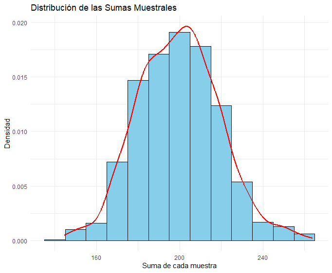

```{r setup, include=FALSE}
knitr::opts_chunk$set(echo = TRUE, message = FALSE, warning = FALSE, comment = NA)
```


El **Teorema del Límite Central (TLC)** es uno de los resultados fundamentales de la teoría de la probabilidad y la estadística inferencial. Establece que, bajo ciertas condiciones, la distribución de la suma (o el promedio) de un gran número de variables aleatorias independientes e idénticamente distribuidas (i.i.d.) tiende a una **distribución normal**, independientemente de la distribución original de las variables.

El TLC fue formulado en su versión más general por el matemático francés **Pierre-Simon Laplace** en el siglo XIX, aunque versiones más tempranas fueron propuestas por **Abraham de Moivre** en 1733 y posteriormente formalizadas por **Carl Friedrich Gauss** en el contexto de la teoría de errores. Sin embargo, el desarrollo más riguroso del teorema fue logrado por **Aleksandr Lyapunov** en 1901, quien estableció condiciones más generales para su validez.


El TLC es crucial en la estadística inferencial porque permite justificar el uso de la **distribución normal** en muchas aplicaciones prácticas. Algunas de sus aplicaciones incluyen:

- **Inferencia estadística:** Justifica la validez de los intervalos de confianza y pruebas de hipótesis basadas en la normalidad.

- **Aproximaciones de distribuciones:** Facilita el cálculo de probabilidades en distribuciones desconocidas.

- **Análisis de grandes datos:** Esencial en el muestreo y estimación de parámetros poblacionales.

Existen diversas formulaciones del TLC, dependiendo de la cantidad y tipo de variables aleatorias involucradas. A continuación, se presentan las versiones más comunes:


</br></br>
<h3>Versión para la media muestral</h3>


Si \( X_1, X_2, \dots, X_n \) son variables aleatorias independientes e idénticamente distribuidas (i.i.d.) de una población \( X \) con media \( \mu \) y varianza \( \sigma^2 \), entonces la **media muestral**:

\[
\bar{X} = \frac{1}{n} \sum_{i=1}^{n} X_i
\]

**converge en distribución** a una distribución normal a medida que \( n \) tiende a infinito:

\[
\bar{X} \xrightarrow{d} N\left(\mu, \frac{\sigma^2}{n}\right).
\]

Esto significa que, cuando el tamaño muestral es lo suficientemente grande, la distribución de la media muestral se aproxima a una distribución normal, independientemente de la distribución original de los datos. Este resultado es fundamental en estadística inferencial, ya que justifica el uso de la normalidad en la construcción de **intervalos de confianza** y **pruebas de hipótesis**.


</br></br>
<h3>Versión para la suma de variables aleatorias</h3>

Si \( X_1, X_2, \dots, X_n \) son variables aleatorias independientes e idénticamente distribuidas (i.i.d.) de una población \( X \) con media \( \mu \) y varianza \( \sigma^2 \), entonces la **suma muestral**:

\[
S_n = \sum_{i=1}^{n} X_i
\]

**converge en distribución** a una distribución normal a medida que \( n \) tiende a infinito:

\[
S_n \xrightarrow{d} N\left(n\mu, n\sigma^2\right).
\]

Esto implica que, cuando el tamaño muestral es suficientemente grande, la distribución de la suma de las observaciones se aproxima a una **distribución normal**, independientemente de la distribución original de los datos. Este resultado es fundamental en estadística, ya que permite aproximar distribuciones desconocidas mediante la normal, facilitando el cálculo de probabilidades y la aplicación de métodos inferenciales como **pruebas de hipótesis** y **análisis de riesgos en modelos de acumulación de valores**.


</br></br>
<h3>Versión para la diferencia de medias muestrales</h3>


Sea \( X_1, X_2, \dots, X_{n_1} \) una muestra aleatoria de tamaño \( n_1 \) extraída de una población con media \( \mu_X \) y varianza \( \sigma_X^2 \), y sea \( Y_1, Y_2, \dots, Y_{n_2} \) una muestra independiente de tamaño \( n_2 \) proveniente de otra población con media \( \mu_Y \) y varianza \( \sigma_Y^2 \). La **diferencia de medias muestrales** está dada por:

\[
\bar{X} - \bar{Y} = \left( \frac{1}{n_1} \sum_{i=1}^{n_1} X_i \right) - \left( \frac{1}{n_2} \sum_{j=1}^{n_2} Y_j \right).
\]

Cuando \( n_1 \) y \( n_2 \) son lo suficientemente grandes, la **diferencia de medias** **converge en distribución** a una distribución normal:

\[
\bar{X} - \bar{Y} \xrightarrow{d} N\left(\mu_X - \mu_Y, \frac{\sigma_X^2}{n_1} + \frac{\sigma_Y^2}{n_2} \right).
\]

Esto implica que, cuando los tamaños muestrales son suficientemente grandes, la distribución de la diferencia de las medias muestrales se aproxima a una **distribución normal**, independientemente de la distribución original de las poblaciones. Este resultado es fundamental en inferencia estadística, ya que permite aplicar **pruebas de hipótesis sobre la diferencia de medias** y construir **intervalos de confianza** en estudios comparativos entre dos poblaciones.


</br></br>
<h3>Versión para una proporción</h3>


Sea \( X \) una variable aleatoria que representa el número de éxitos en una muestra aleatoria de tamaño \( n \) extraída de una población con proporción poblacional \( p \), donde \( X \sim Bin(n, p) \). La **proporción muestral** está definida como:

\[
\hat{p} = \frac{X}{n}.
\]

Cuando el tamaño muestral \( n \) es lo suficientemente grande, la **proporción muestral** **converge en distribución** a una distribución normal:

\[
\hat{p} \xrightarrow{d} N\left(p, \frac{p(1 - p)}{n} \right).
\]

Esto implica que, cuando el tamaño muestral es grande, la distribución de la proporción muestral se aproxima a una **distribución normal**, independientemente de la distribución original de los datos. Este resultado es fundamental en la estadística inferencial, ya que permite aplicar **pruebas de hipótesis sobre una proporción poblacional** y construir **intervalos de confianza** para la estimación de proporciones en poblaciones finitas e infinitas.


</br></br>
<h3>Versión para la diferencia de proporciones</h3>

Sea \( \hat{p}_1 \) la proporción muestral de una población con proporción poblacional \( p_1 \), basada en una muestra aleatoria de tamaño \( n_1 \), y \( \hat{p}_2 \) la proporción muestral de una segunda población con proporción poblacional \( p_2 \), basada en una muestra independiente de tamaño \( n_2 \). La **diferencia de proporciones muestrales** está dada por:

\[
\hat{p}_1 - \hat{p}_2 = \left( \frac{X_1}{n_1} \right) - \left( \frac{X_2}{n_2} \right),
\]

donde \( X_1 \sim Bin(n_1, p_1) \) y \( X_2 \sim Bin(n_2, p_2) \) representan los conteos de éxitos en cada muestra.

Cuando \( n_1 \) y \( n_2 \) son lo suficientemente grandes, la **diferencia de proporciones** **converge en distribución** a una distribución normal:

\[
\hat{p}_1 - \hat{p}_2 \xrightarrow{d} N\left(p_1 - p_2, \frac{p_1(1 - p_1)}{n_1} + \frac{p_2(1 - p_2)}{n_2} \right).
\]

Esto implica que, cuando los tamaños muestrales son suficientemente grandes, la distribución de la diferencia de las proporciones muestrales se aproxima a una **distribución normal**, independientemente de la distribución original de los datos. Este resultado es fundamental en la estadística inferencial, ya que permite aplicar **pruebas de hipótesis sobre la diferencia de proporciones** y construir **intervalos de confianza** en estudios de comparación de proporciones entre dos grupos.


</br></br>
<div class="caja-ejemplo">
<h3>Ejemplo:</h3>
<p>

La **distribución exponencial** es comúnmente utilizada para modelar **tiempos de espera** o **tiempos hasta la ocurrencia de un evento**, como el tiempo entre llegadas de clientes a un sistema de atención, la vida útil de componentes electrónicos o el tiempo hasta que ocurre un fallo en un sistema.

Supongamos que un **centro de llamadas de atención al cliente** recibe llamadas de manera aleatoria y queremos modelar el **tiempo que transcurre entre una llamada y la siguiente**. Se ha determinado que, en promedio, hay **una llamada cada 2 minutos**, lo que implica que el tiempo entre llamadas sigue una **distribución exponencial** con parámetro \( \lambda = \frac{1}{2} \), ya que la media de una distribución exponencial está dada por:

\[
E[X] = \frac{1}{\lambda}.
\]

Dado que \( E[X] = 2 \), se tiene que \( \lambda = \frac{1}{2} \).

La **varianza** de la distribución exponencial está dada por:

\[
\text{Var}(X) = \frac{1}{\lambda^2}.
\]

Sustituyendo \( \lambda = \frac{1}{2} \), se obtiene:

\[
\text{Var}(X) = \frac{1}{(1/2)^2} = 4.
\]


La **función de densidad de probabilidad** de la variable aleatoria \( X \), que representa el tiempo entre llamadas (en minutos), está dada por:

\[
f(x) =
\begin{cases}
\frac{1}{2} e^{-x/2}, & x > 0 \\
0, & x \leq 0
\end{cases}
\]

donde:

- \( X \) representa el tiempo transcurrido entre dos llamadas consecutivas, medido en minutos.

- \( \lambda = \frac{1}{2} \) es la **tasa de ocurrencia** de los eventos (en este caso, llamadas por minuto).

Para el contexto de este problema:

 a. Explica el Teorema del Límite Central para un $n = 100$:
    
    - Genera 1000 muestras de tamaño $n = 100$. Calcula la suma muestral de cada muestra. Elabora un histograma de las sumas muestrales.
    
    - Obtén el promedio y la varianza de estas 1000 sumas muestrales.
    
    - Aplica un test de normalidad (nivel de significancia $\alpha = 0.05$) a las 1000 sumas e interpreta el resultado.
    
    - Explica cómo se evidencia el Teorema del Límite Central en el comportamiento de las sumas muestrales.

b. Explica el Teorema del Límite Central varaindo el $n$:
    
    - Repite el análisis anterior utilizando muestras 1000 muestras de tamaños: $n = 5, 10, 80, 200, 500, 2000$.
    
    - Para cada tamaño de muestra:
    
      - Calcula el promedio y la varianza de las 1000 sumas.
      
      - Elabora un histograma de las 1000 sumas muestrales.
      
      - Aplica un test de normalidad ($\alpha = 0.05$) para las 1000 sumas.
      
    - Concluye sobre la relación entre el tamaño muestral y la validez del Teorema del Límite Central.


---


Respecto a la parte (a) de la simulación, a continuación se presentan los códigos:

<pre>
# Cargar librerías necesarias
library(ggplot2)
library(qqplotr)  # Para el Q-Q plot con ggplot2
library(nortest)  # Para test de Kolmogorov-Smirnov

# Definir parámetros
set.seed(123)  # Fijar semilla para reproducibilidad
lambda <- 1/2  # Parámetro de la distribución exponencial
n <- 100       # Tamaño de cada muestra
num_muestras <- 1000  # Número de muestras

# Generar una matriz donde cada columna es una muestra de tamaño n
muestras <- matrix(rexp(n * num_muestras, rate = lambda), nrow = n, ncol = num_muestras)

# Definir función para calcular la suma de una muestra
suma_muestral <- function(x) {
  sum(x)
}

# Aplicar la función a cada columna de la matriz para obtener la suma muestral
sumas_muestrales <- apply(muestras, 2, suma_muestral)

# Crear un data frame con los resultados para graficar
datos_sumas <- data.frame(Suma = sumas_muestrales)

# Graficar el histograma de las sumas muestrales con densidad
plot.tlc1<- ggplot(datos_sumas, aes(x = Suma)) +
  geom_histogram(binwidth = 10, fill = "skyblue", color = "black", aes(y = after_stat(density))) +
  geom_density(color = "red", linewidth = 1) +
  labs(title = "Distribución de las Sumas Muestrales",
       x = "Suma de cada muestra",
       y = "Densidad") +
  theme_minimal()


print(plot.tlc1)

# Calcular el promedio y la varianza de las sumas muestrales
promedio_sumas <- mean(sumas_muestrales)
varianza_sumas <- var(sumas_muestrales)

# Mostrar los resultados
cat("Promedio de las sumas muestrales:", promedio_sumas, "\n")
cat("Varianza de las sumas muestrales:", varianza_sumas, "\n")


# Aplicar el test de normalidad de Shapiro-Wilk
shapiro_test <- shapiro.test(sumas_muestrales)
cat("Test de Shapiro-Wilk:\n")
print(shapiro_test)

# Aplicar el test de Kolmogorov-Smirnov contra una normal teórica
ks_test <- ks.test(sumas_muestrales, "pnorm", mean = promedio_sumas, sd = sqrt(varianza_sumas))
cat("Test de Kolmogorov-Smirnov:\n")
print(ks_test)
</pre>


```{r, echo=TRUE, fig.height=3.5}
# Cargar librerías necesarias
library(ggplot2)
library(qqplotr)  # Para el Q-Q plot con ggplot2
library(nortest)  # Para test de Kolmogorov-Smirnov

# Definir parámetros
set.seed(123)  # Fijar semilla para reproducibilidad
lambda <- 1/2  # Parámetro de la distribución exponencial
n <- 100       # Tamaño de cada muestra
num_muestras <- 1000  # Número de muestras

# Generar una matriz donde cada columna es una muestra de tamaño n
muestras <- matrix(rexp(n * num_muestras, rate = lambda), nrow = n, ncol = num_muestras)

# Definir función para calcular la suma de una muestra
suma_muestral <- function(x) {
  sum(x)
}

# Aplicar la función a cada columna de la matriz para obtener la suma muestral
sumas_muestrales <- apply(muestras, 2, suma_muestral)

# Crear un data frame con los resultados para graficar
datos_sumas <- data.frame(Suma = sumas_muestrales)

# Graficar el histograma de las sumas muestrales con densidad
plot.tlc1<- ggplot(datos_sumas, aes(x = Suma)) +
  geom_histogram(binwidth = 10, fill = "skyblue", color = "black", aes(y = after_stat(density))) +
  geom_density(color = "red", linewidth = 1) +
  labs(title = "Distribución de las Sumas Muestrales",
       x = "Suma de cada muestra",
       y = "Densidad") +
  theme_minimal()


# print(plot.tlc1)

# Calcular el promedio y la varianza de las sumas muestrales
promedio_sumas <- mean(sumas_muestrales)
varianza_sumas <- var(sumas_muestrales)

# Mostrar los resultados
# cat("Promedio de las sumas muestrales:", promedio_sumas, "\n")
# cat("Varianza de las sumas muestrales:", varianza_sumas, "\n")


# Aplicar el test de normalidad de Shapiro-Wilk
shapiro_test <- shapiro.test(sumas_muestrales)
cat("Test de Shapiro-Wilk:\n")
# print(shapiro_test)

# Aplicar el test de Kolmogorov-Smirnov contra una normal teórica
ks_test <- ks.test(sumas_muestrales, "pnorm", mean = promedio_sumas, sd = sqrt(varianza_sumas))
cat("Test de Kolmogorov-Smirnov:\n")
# (ks_test)
```


<br/><br/>
<center>
```{r, echo=FALSE, out.width="80%", fig.align = "center"}

```
**Figura 2.43** Histograma de las 1000 sumas calculadas por cada muestra.
</center>
<br/><br/>


A continuación se presentan los resultados de renderizar los códigos:

<pre>
> cat("Promedio de las sumas muestrales:", promedio_sumas, "\n")
Promedio de las sumas muestrales: 199.4924 
> cat("Varianza de las sumas muestrales:", varianza_sumas, "\n")
Varianza de las sumas muestrales: 382.5936 
</pre>


<pre>
> print(shapiro_test)

	Shapiro-Wilk normality test

data:  sumas_muestrales
W = 0.99723, p-value = 0.08331
</pre>


<pre>
> print(ks_test)

	Asymptotic one-sample Kolmogorov-Smirnov test

data:  sumas_muestrales
D = 0.022277, p-value = 0.7038
alternative hypothesis: two-sided
</pre>


---


**Evaluación de la normalidad en las sumas muestrales**:

La **Figura 2.43** muestra el histograma de las **1000 sumas** calculadas a partir de las muestras generadas de tamaño $n=100$. Se observa que la distribución de las sumas es **simétrica y centrada** alrededor de **200**, lo que sugiere que las sumas muestrales siguen un comportamiento cercano a una **distribución normal**.

Además, los valores del **promedio** y la **varianza** de las 1000 sumas obtenidas (\(\bar{S} = 199.4924\) y \(s^2 = 382.5936\)) presentan una **gran proximidad** a los valores teóricos esperados \(E[S] = n\mu=(100)(2)=200\) y \(\text{Var}(S) = n\sigma^2=(100)(4)=400\). Esto sugiere que:

\[
S_n \approx N(n\mu, n\sigma^2)
\]

Para evaluar formalmente la normalidad de las sumas muestrales, se aplicaron los siguientes **tests de normalidad**:

**1. Test de normalidad de Shapiro-Wilk y Kolmogorov-Smirnov**

Ambos tests evalúan si una muestra proviene de una población con **distribución normal**.

- **Hipótesis nula \(H_0\)**:  
  *La muestra proviene de una distribución normal*.

- **Hipótesis alternativa \(H_1\)**:  
  *La muestra no proviene de una distribución normal*.

- **Criterio de decisión**:

  - Si el **\( valor-p \) es mayor que $\alpha = 0.05$**, *no se rechaza \( H_0 \)*, lo que sugiere que los datos **podrían seguir** una distribución normal.
  
  - Si el **\( valor-p \) es menor que $\alpha = 0.05$**, *se rechaza \( H_0 \)* en favor de \( H_A \), indicando que los datos **no siguen** una distribución normal.

Estos tests permiten evaluar la **validez del Teorema del Límite Central (TLC)**, ya que este establece que las **sumas muestrales de variables independientes tienden a distribuirse normalmente** conforme el tamaño muestral aumenta.

---

**Resultados de los tests de normalidad**
Los $valores-p$ obtenidos en los tests fueron:

- **Shapiro-Wilk:** \( valor-p = 0.08331 \)

- **Kolmogorov-Smirnov:** \( valor-p = 0.7038 \)

Dado que en ambos casos el **\( valor-p \) es mayor a \(\alpha = 0.05\)**, **no se rechaza la hipótesis nula**, lo que indica que las sumas muestrales pueden considerarse como provenientes de una distribución normal con un nivel de significancia del **5%** ($\alpha = 0.05$).

Estos resultados proporcionan **evidencia empírica** que respalda la validez del **Teorema del Límite Central**, confirmando que la distribución de las sumas se aproxima a una normal, incluso cuando los datos originales provienen de una distribución exponencial.


---

Respecto a la parte (b) de la simulación, a continuación se presentan los códigos:


<pre>
# Cargar librerías necesarias
library(ggplot2)
library(qqplotr)   # Para Q-Q plot
library(nortest)   # Para test de normalidad Kolmogorov-Smirnov
library(gridExtra) # Para organizar múltiples gráficos en una ventana

# Definir parámetros
set.seed(123)  # Para reproducibilidad
lambda <- 1/2  # Parámetro de la distribución exponencial
tamanos_muestras <- c(5, 10, 80, 200, 500, 2000)  # Diferentes tamaños de muestra
num_muestras <- 1000  # Número de muestras

# Inicializar listas para almacenar resultados
resultados <- list()
graficos <- list()

# Iterar sobre cada tamaño de muestra
for (n in tamanos_muestras) {
  
  # Generar una matriz donde cada columna es una muestra de tamaño n
  muestras <- matrix(rexp(n * num_muestras, rate = lambda), nrow = n, ncol = num_muestras)
  
  # Calcular la suma muestral para cada muestra
  sumas_muestrales <- apply(muestras, 2, sum)
  
  # Calcular el promedio y la varianza de las sumas
  promedio_sumas <- mean(sumas_muestrales)
  varianza_sumas <- var(sumas_muestrales)
  
  # Guardar resultados en una lista
  resultados[[as.character(n)]] <- list(
    "Promedio" = promedio_sumas,
    "Varianza" = varianza_sumas
  )
  
  # Crear un data frame con los resultados para graficar
  datos_sumas <- data.frame(Suma = sumas_muestrales)
  
  # Graficar el histograma con densidad
  p <- ggplot(datos_sumas, aes(x = Suma)) +
    geom_histogram(binwidth = 10, fill = "skyblue", color = "black", aes(y = after_stat(density))) +
    geom_density(color = "red", linewidth = 1) +
    labs(title = paste("n =", n),
         x = "Suma de cada muestra",
         y = "Densidad") +
    theme_minimal()
  
  # Almacenar gráficos
  graficos[[as.character(n)]] <- p
  
  # Aplicar tests de normalidad
  shapiro_test <- shapiro.test(sumas_muestrales)
  ks_test <- ks.test(sumas_muestrales, "pnorm", mean = promedio_sumas, sd = sqrt(varianza_sumas))
  
  # Mostrar resultados en consola
  cat("\n-----------------------------------\n")
  cat("Resultados para n =", n, "\n")
  cat("Promedio de sumas muestrales:", promedio_sumas, "\n")
  cat("Varianza de sumas muestrales:", varianza_sumas, "\n")
  cat("Test de Shapiro-Wilk: valor-p =", shapiro_test$p.value, "\n")
  cat("Test de Kolmogorov-Smirnov: valor-p =", ks_test$p.value, "\n")
}

# Organizar todos los gráficos en una sola ventana
grid.arrange(grobs = graficos, ncol = 3)
</pre>


```{r, echo=TRUE, fig.height=3.5}
# Cargar librerías necesarias
library(ggplot2)
library(qqplotr)   # Para Q-Q plot
library(nortest)   # Para test de normalidad Kolmogorov-Smirnov
library(gridExtra) # Para organizar múltiples gráficos en una ventana

# Definir parámetros
set.seed(123)  # Para reproducibilidad
lambda <- 1/2  # Parámetro de la distribución exponencial
tamanos_muestras <- c(5, 10, 80, 200, 500, 2000)  # Diferentes tamaños de muestra
num_muestras <- 1000  # Número de muestras

# Inicializar listas para almacenar resultados
resultados <- list()
graficos <- list()

# Iterar sobre cada tamaño de muestra
for (n in tamanos_muestras) {
  
  # Generar una matriz donde cada columna es una muestra de tamaño n
  muestras <- matrix(rexp(n * num_muestras, rate = lambda), nrow = n, ncol = num_muestras)
  
  # Calcular la suma muestral para cada muestra
  sumas_muestrales <- apply(muestras, 2, sum)
  
  # Calcular el promedio y la varianza de las sumas
  promedio_sumas <- mean(sumas_muestrales)
  varianza_sumas <- var(sumas_muestrales)
  
  # Guardar resultados en una lista
  resultados[[as.character(n)]] <- list(
    "Promedio" = promedio_sumas,
    "Varianza" = varianza_sumas
  )
  
  # Crear un data frame con los resultados para graficar
  datos_sumas <- data.frame(Suma = sumas_muestrales)
  
  # Graficar el histograma con densidad
  p <- ggplot(datos_sumas, aes(x = Suma)) +
    geom_histogram(binwidth = 10, fill = "skyblue", color = "black", aes(y = after_stat(density))) +
    geom_density(color = "red", linewidth = 1) +
    labs(title = paste("n =", n),
         x = "Suma de cada muestra",
         y = "Densidad") +
    theme_minimal()
  
  # Almacenar gráficos
  graficos[[as.character(n)]] <- p
  
  # Aplicar tests de normalidad
  shapiro_test <- shapiro.test(sumas_muestrales)
  ks_test <- ks.test(sumas_muestrales, "pnorm", mean = promedio_sumas, sd = sqrt(varianza_sumas))
  
  # Mostrar resultados en consola
  #cat("\n-----------------------------------\n")
  #cat("Resultados para n =", n, "\n")
  #cat("Promedio de sumas muestrales:", promedio_sumas, "\n")
  #cat("Varianza de sumas muestrales:", varianza_sumas, "\n")
  #cat("Test de Shapiro-Wilk: valor-p =", shapiro_test$p.value, "\n")
  #cat("Test de Kolmogorov-Smirnov: valor-p =", ks_test$p.value, "\n")
}

# Organizar todos los gráficos en una sola ventana
# grid.arrange(grobs = graficos, ncol = 3)
```


---


<br/><br/>
<center>
```{r, echo=FALSE, out.width="80%", fig.align = "center"}

```
**Figura 2.44** Histograma de las 1000 sumas calculadas por cada muestra de tamaños de $n = 5, 10, 80, 200, 500, 2000$.
</center>
<br/><br/>

<pre>
-----------------------------------
Resultados para n = 5 
Promedio de sumas muestrales: 10.0867 
Varianza de sumas muestrales: 20.37322 
Test de Shapiro-Wilk: valor-p = 2.780042e-16 
Test de Kolmogorov-Smirnov: valor-p = 0.0006052599 

-----------------------------------
Resultados para n = 10 
Promedio de sumas muestrales: 20.14694 
Varianza de sumas muestrales: 40.20084 
Test de Shapiro-Wilk: valor-p = 4.53899e-09 
Test de Kolmogorov-Smirnov: valor-p = 0.08104603 

-----------------------------------
Resultados para n = 80 
Promedio de sumas muestrales: 159.3497 
Varianza de sumas muestrales: 312.4678 
Test de Shapiro-Wilk: valor-p = 0.03527495 
Test de Kolmogorov-Smirnov: valor-p = 0.2258247 

-----------------------------------
Resultados para n = 200 
Promedio de sumas muestrales: 398.6901 
Varianza de sumas muestrales: 787.8698 
Test de Shapiro-Wilk: valor-p = 0.02210118 
Test de Kolmogorov-Smirnov: valor-p = 0.4179235 

-----------------------------------
Resultados para n = 500 
Promedio de sumas muestrales: 1001.354 
Varianza de sumas muestrales: 1987.363 
Test de Shapiro-Wilk: valor-p = 0.8243656 
Test de Kolmogorov-Smirnov: valor-p = 0.9836838 

-----------------------------------
Resultados para n = 2000 
Promedio de sumas muestrales: 3998.977 
Varianza de sumas muestrales: 7882.959 
Test de Shapiro-Wilk: valor-p = 0.6293026 
Test de Kolmogorov-Smirnov: valor-p = 0.6349088 
</pre>
---

**Evaluación de la normalidad en las sumas muestrales**:


La **Figura 2.44** presenta los histogramas de las **1000 sumas** obtenidas a partir de muestras generadas con tamaños \( n = 5, 10, 80, 200, 500, 2000 \). Se observa que, a medida que \( n \) aumenta, la distribución de las sumas **se vuelve más simétrica** y está **centrada** en valores cercanos a \( n\mu \), lo que sugiere que las sumas muestrales siguen un comportamiento **aproximadamente normal** conforme lo predice el **Teorema del Límite Central (TLC)**.


Los valores del **promedio** y la **varianza** de las 1000 sumas presentan una **alta coincidencia** con los valores teóricos esperados:

\[
E[S] = n\mu, \quad \text{Var}(S) = n\sigma^2.
\]

Por ejemplo:

- Para \( n = 5 \):  
  \[
  \bar{S} = 10.0867, \quad s^2 = 20.3732
  \]
  Valores esperados:  
  \[
  E[S] = 10, \quad \text{Var}(S) = 20.
  \]

- Para \( n = 2000 \):  
  \[
  \bar{S} = 3998.977, \quad s^2 = 7882.959
  \]
  Valores esperados:  
  \[
  E[S] = 4000, \quad \text{Var}(S) = 8000.
  \]

Comportamiento de la varianza:

Un aspecto importante es que **la varianza de las sumas muestrales aumenta con el tamaño de la muestra**. Esto es consistente con la relación teórica:

\[
\text{Var}(S) = n\sigma^2.
\]

A medida que \( n \) crece, la dispersión de las sumas se incrementa, reflejando la acumulación de la variabilidad de cada observación individual.

Estos resultados confirman que, a medida que el tamaño de muestra aumenta:

1. **Las distribuciones de las sumas muestrales se asemejan más a una normal**.

2. **Las medias muestrales se aproximan a los valores esperados \( n\mu \)**.

3. **Las varianzas de las sumas crecen proporcionalmente a \( n\sigma^2 \), como lo predice la teoría**.


Esto sugiere que:

\[
S_n \approx N(n\mu, n\sigma^2)
\]

Para evaluar formalmente la normalidad de las sumas muestrales, se aplicaron los siguientes **tests de normalidad** antes mencionados.


**1. Análisis de los resultados por tamaño de muestra**

- **\( n = 5 \) y \( n = 10 \)**

  - Ambos test presentan **valores-p menores a 0.05**, indicando que las sumas **no siguen una distribución normal**.
  
  - Esto era **esperado**, ya que con muestras pequeñas el Teorema del Límite Central (TLC) no garantiza normalidad.
  
  - El **\( valor-p \) extremadamente bajo en Shapiro-Wilk** sugiere que la distribución de las sumas aún conserva la asimetría de la distribución exponencial original.

- **\( n = 80 \)**
  - **Kolmogorov-Smirnov** muestra un **\( valor-p \) de 0.2258**, lo que **no permite rechazar la normalidad**.
  
  - **Shapiro-Wilk**, en cambio, presenta un **\( valor-p \) de 0.035**, lo que **rechaza la normalidad a nivel \( \alpha = 0.05 \)**.
  
  - Aunque la distribución de sumas ya es visualmente **cercana a una normal**, el test de Shapiro-Wilk es **más estricto**, lo que sugiere que para \( n = 80 \) aún hay pequeñas desviaciones detectables.

- **\( n = 200 \)**

  - Similar al caso anterior:
  
    - **Shapiro-Wilk** da un **\( valor-p \) de 0.022**, lo que indica **rechazo de la normalidad**.
    
    - **Kolmogorov-Smirnov** da un **\( valor-p \) de 0.4179**, indicando que no hay suficiente evidencia para rechazar la normalidad.
    
  - Este comportamiento sugiere que **Shapiro-Wilk es más exigente** cuando se aplican 1000 muestras, detectando pequeñas desviaciones que en otras circunstancias podrían no ser significativas.

- **\( n = 500 \) y \( n = 2000 \)**

  - En estos casos, **ambos test no rechazan la normalidad** (\( valor-p \gg 0.05 \)).
  
  - Esto confirma que la **distribución de sumas se ajusta bien a una normal**, validando el Teorema del Límite Central en estos tamaños muestrales.

**2. Impacto de la Cantidad de Muestras en los Test de Normalidad**

- Se observa que para \( n = 80 \) y \( n = 200 \), **Shapiro-Wilk rechaza la normalidad**, aunque Kolmogorov-Smirnov **no lo hace**.

- Esto puede deberse a que **Shapiro-Wilk es más sensible**, y al aplicarlo a **1000 muestras en lugar de 100**, detecta pequeñas desviaciones de la normalidad que, en contextos habituales, no serían significativas.

- Para valores de \( n \geq 500 \), **ambos test confirman la normalidad**, validando la aplicación del TLC.

De lo anterior se puede decir: 

- **Para tamaños de muestra pequeños (\( n = 5, 10 \))**, la distribución de sumas sigue sin ajustarse a una normal.

- **Para \( n = 80 \) y \( n = 200 \)**, aunque visualmente la distribución parece normal, **Shapiro-Wilk sigue rechazando la normalidad**, probablemente debido a la **cantidad de muestras analizadas (1000 en lugar de 100)**.

- **Para \( n = 500 \) y \( n = 2000 \)**, **ambos test confirman la normalidad**, validando el **Teorema del Límite Central** para la suma de variables aleatorias.

Si se desea evaluar la **normalidad** en tamaños de muestra intermedios (\( n \approx 80-200 \)), se recomienda aplicar la prueba sobre un número **menor de muestras**. Esto se debe a que, con un gran número de muestras, el **test de Shapiro-Wilk** tiende a **rechazar la normalidad** incluso cuando las desviaciones son insignificantes.

Esta observación plantea preguntas clave sobre la aplicación de los **tests de normalidad** en diferentes escenarios:

- ¿Cuándo es más adecuado utilizar **Kolmogorov-Smirnov** en lugar de **Shapiro-Wilk**?

- ¿Cómo influye el **tamaño de la muestra** en la capacidad del test para detectar desviaciones de la normalidad?

- ¿Cuál es el **nivel de significancia** óptimo a emplear en función del tamaño muestral?

- ¿Cómo afecta el **tamaño del efecto** la interpretación del  \( valor-p \) en estas pruebas?

Para responder estas preguntas, es necesario profundizar en los conceptos de **pruebas de hipótesis**, analizando aspectos como el **nivel de significancia (\(\alpha\))**, el **tamaño del efecto** y la interpretación del **\( valor-p \)**. Una mejor comprensión de estos temas permitirá optimizar el análisis de **normalidad** y, con ello, mejorar la interpretación del **Teorema del Límite Central** en diferentes contextos estadísticos.

</p>
</div>


