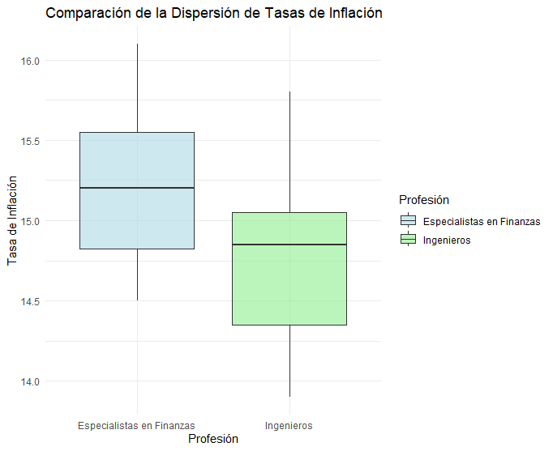

```{r setup, include=FALSE}
knitr::opts_chunk$set(echo = TRUE, message = FALSE, warning = FALSE, comment = NA)

# install.packages('gtools')
# install.packages("TeachingSampling")
#install.packages("devtools") # solo una vez
#devtools::install_github("dgonxalex80/paqueteMETODOS")


#load library
library(gtools)
library(TeachingSampling)
library(readr)
library(paqueteMETODOS)

c1="#FF7F00"
c2="#034A94"
c3="#0EB0C6"
c4="#686868"

data("CarreraLuz22")
data("evaluacion")

```


</br></br>
<h2>Introducción</h2>

En muchos estudios estadísticos, es común comparar dos poblaciones para determinar si existen diferencias significativas entre sus parámetros, como la **media**, la **proporción** o la **varianza**. Para ello, se construyen **intervalos de confianza para parámetros dos poblaciones**, lo que permite realizar inferencias sobre la relación entre ambos grupos con un determinado nivel de certeza.  

Dependiendo del tipo de variable y de la información disponible, estos intervalos pueden construirse para:

- **Diferencia de medias poblacionales** ($\mu_1 - \mu_2$), considerando muestras **independientes o pareadas**.

- **Diferencia de proporciones poblacionales** ($p_1 - p_2$), aplicable en estudios de encuestas o proporciones de éxito en dos grupos.

- **Razón de varianzas** ($\sigma_1^2 / \sigma_2^2$), útil en el análisis de dispersión en dos conjuntos de datos.  

Para la construcción de estos intervalos, se requiere considerar el **tamaño muestral**, la **distribución de los datos**, y si las **varianzas poblacionales** son conocidas o desconocidas. En algunos casos, el **Teorema Central del Límite** permite aproximar la distribución de la diferencia muestral a una distribución normal estándar, facilitando el cálculo de los intervalos de confianza.  


</br></br>
<h2>Intervalos de confianza para dos poblaciones</h2>

La **Tabla 2.10** presenta los intervalos de confianza para la comparación de parámetros de dos poblaciones, con sus respectivos estimadores y supuestos.  


<br/><br/>
<center>
**Tabla 2.10** Intervalos de confianza para parámetros de dos poblaciones.
</center> 
| **Parámetro** | **Estimador por IC** | **Supuestos e información** |
|:------------:|:------------------------------------------------------------:|:------------------------------------------------------:|
| \( \mu_{d} \) | \( \bar{d} \pm t_{\alpha/2, v=n-1} \dfrac{s_{d}}{\sqrt{n}} \) | **Grupos pareados**: <br/> \( d_i = x_{1i} - x_{2i} \) es la diferencia de los valores de las variables para una misma unidad muestral, <br/> $\bar{d}$ es el promedio de las diferencias, <br/> las diferencias se distribuyen normal \( D \sim N(\mu_{d}, \sigma^{2}_{d}) \) <br/> o \( n \geq 30 \)  
| \( \mu_{1}-\mu_{2} \) | \( (\bar{x}_{1}-\bar{x}_{2}) \pm t_{\alpha/2,v} s_{p} \sqrt{\frac{1}{n_{1}}+\frac{1}{n_{2}}} \) | **Grupos independientes**: <br/> Las variables se distribuyen normal \( X_{1} \sim N(\mu_{1}, \sigma^{2}_{1}) \) y \( X_{2} \sim N(\mu_{2}, \sigma^{2}_{2}) \), varianzas poblacionales **iguales** (\(\sigma^2_1 = \sigma^2_2\) desconocidas), <br/> $\bar{x}_{1}$ y $\bar{x}_{2}$ son los promedios muestrales por cada variable. <br/> $s_{1}^{2}$ y $s_{2}^{2}$ son las varianzas muestrales por cada variable. <br/> Además,  \( s_{p}^{2} = \dfrac{(n_{1}-1)s_{1}^{2}+(n_{2}-1)s_{2}^{2}}{n_{1}+n_{2}-2} \) y \( v = n_{1} + n_{2} - 2 \) |
| \( \mu_{1}-\mu_{2} \) | \( (\bar{x}_{1}-\bar{x}_{2}) \pm t_{\alpha/2, v^{*}}\sqrt{\frac{s_{1}^{2}}{n_{1}}+\frac{s_{2}^{2}}{n_{2}}} \) | **Grupos independientes**: <br/> Las variables se distribuyen normal \( X_{1} \sim N(\mu_{1}, \sigma^{2}_{1}) \) y \( X_{2} \sim N(\mu_{2}, \sigma^{2}_{2}) \), <br/> varianzas poblacionales **diferentes** (\(\sigma^2_1 \neq \sigma^2_2\) desconocidas), <br/> $\bar{x}_{1}$ y $\bar{x}_{2}$ son los promedios muestrales por cada variable. <br/> $s_{1}^{2}$ y $s_{2}^{2}$ son las varianzas muestrales por cada variable. <br/> Además,\( v^{*} = \frac{(s_{1}^{2}/n_{1}+s_{2}^{2}/n_{2})^{2}}{\Big[(s_{1}^{2}/n_{1})^{2}/(n_{1}-1)\Big] + \Big[(s_{2}^{2}/n_{2})^{2}/(n_{2}-1)\Big]} \) | 
| \( p_{1}-p_{2} \) | \( (\widehat{p}_{1}-\widehat{p}_{2}) \pm z_{\alpha/2} \sqrt{\dfrac{\widehat{p}_{1}(1-\widehat{p}_{1})}{n_{1}}+\dfrac{\widehat{p}_{2}(1-\widehat{p}_{2})}{n_{2}}} \) | \( n_{1} \gg 30 \), \( n_{2} \gg 30 \), además \( n_{1}\widehat{p}_{1} \geq 5 \), \( n_{1}(1-\widehat{p}_{1}) \geq 5 \), \( n_{2}\widehat{p}_{2} \geq 5 \), \( n_{2}(1-\widehat{p}_{2}) \geq 5 \) |
| \( \dfrac{\sigma^{2}_{1}}{\sigma^{2}_{2}} \) | \( \Bigg(\dfrac{s^{2}_{1}}{s^{2}_{2}} \dfrac{1}{f_{\alpha/2}(v_{1},v_{2})}, \dfrac{s^{2}_{1}}{s^{2}_{2}} \dfrac{1}{f_{1-\alpha/2}(v_{1},v_{2})}\Bigg) \) | **Grupos independientes**: <br/> Las variables se distribuyen normal \( X_{1} \sim N(\mu_{1}, \sigma^{2}_{1}) \), \( X_{2} \sim N(\mu_{2}, \sigma^{2}_{2}) \).  <br/> $s_{1}^{2}$ y $s_{2}^{2}$ son las varianzas muestrales por cada variable.  |


- $z_{\alpha/2}$: cuantil de la distribución normal estándar que deja un área de $\alpha/2$ en la cola derecha de la distribución. 

-  $t_{\alpha/2,v}$: cuantil de la distribución t-Student con $v$ grados de libertad, que deja un área de $\alpha/2$ en la cola derecha de la distribución. 

- $\chi^{2}_{\alpha/2,v}$: cuantil de la distribución chi-cuadrado con $v$ grados de libertad, que deja un área de $\alpha/2$ en la cola derecha de la distribución.


- $f_{\alpha/2}(v_{1},v_{2})$: cuantil de la distribución F de Fisher con $v_{1}$ y  $v_{2}$ como grados de libertad, que deja un área de $\alpha/2$ en la cola derecha de la distribución.


</br></br>
<div class="caja-ejemplo">
<h3>Ejemplo:</h3>
<p>

Se afirma que una persona podrá reducir su peso en un período de **dos semanas** en un promedio de **4.5 kilogramos** con una nueva dieta. Para evaluar esta afirmación, se registraron los **pesos iniciales y finales** de **7 mujeres** que siguieron la dieta.  

**Datos recopilados (muestra pareada: una misma unidad muestral con dos datos, antes y después)** 

- **Peso antes de la dieta**: $\{58.2, 60.3, 61.3, 69.0, 64.0, 62.6, 56.7\}$ 

- **Peso después de la dieta**: $\{60.0, 54.9, 58.1, 62.1, 58.5, 59.9, 54.4\}$  

Se desea calcular un **intervalo de confianza del 95%** para la **diferencia de medias**, suponiendo que las diferencias de los pesos siguen una **distribución normal**.  


---

Sea \( X_1 \) el peso antes de la dieta y \( X_2 \) el peso después de la dieta. Dado que ambos valores corresponden a la misma unidad muestral, se calcula la diferencia entre los pesos antes y después como:

\[
d_i = x_{1i} - x_{2i}
\]

Si la diferencia \( d_i \) sigue una distribución normal, se puede aplicar un **test paramétrico** para evaluar el efecto de la dieta. En general, es recomendable realizar una **prueba de normalidad** sobre la diferencia \( d_i \) antes de proceder con el análisis estadístico. Sin embargo, en este caso, no es necesario aplicarla, ya que se **supone** que la diferencia sigue una distribución normal.


**Cálculo en R**  

El siguiente código en **R** permite calcular el intervalo de confianza para la diferencia  en datos pareados:  

<pre>
# Definir los datos
peso.ant <- c(58.2, 60.3, 61.3, 69.0, 64.0, 62.6, 56.7)
peso.des <- c(60.0, 54.9, 58.1, 62.1, 58.5, 59.9, 54.4)

# Prueba t pareada con intervalo de confianza del 95%
resultado <- t.test(peso.ant, peso.des, paired = TRUE, conf.level = 0.95)

# Mostrar intervalo de confianza
print(resultado$conf.int)
</pre>


```{r, echo=TRUE}
# Definir los datos
peso.ant <- c(58.2, 60.3, 61.3, 69.0, 64.0, 62.6, 56.7)
peso.des <- c(60.0, 54.9, 58.1, 62.1, 58.5, 59.9, 54.4)

# Prueba t pareada con intervalo de confianza del 95%
resultado <- t.test(peso.ant, peso.des, paired = TRUE, conf.level = 0.95)

# Mostrar intervalo de confianza
print(resultado$conf.int)
```


**Interpretación del resultado**  

El **intervalo de confianza del 95%** para la diferencia entre los promedios de peso **antes y después** de la dieta es **$(0.80, 6.11)$** kilogramos. Dado que **ambos valores del intervalo son positivos**, se puede concluir con una confianza del 95% que, en promedio, el peso después de la dieta **es mayor** que el peso antes de la dieta.  

Por el momento, con una confianza del 95%, se podría inferir que **la dieta no produjo la reducción de peso esperada**, ya que el intervalo indica un posible aumento. Sin embargo,  esta afirmación se analizará con mayor profundidad en los siguientes temas, donde se realizará una **prueba de hipótesis** para confirmar o refutar esta conclusión.


</p>
</div>


<div class="caja-nota">
<h3>Nota: IC para $\mu_d$ </h3>
>
<p>
| **Intervalo de confianza (IC) para \( \mu_d \)** | **Interpretación** |
|---------------------------------|--------------------------------------------------------------|
| **$(-,-)$** | Ambos límites del IC son negativos, lo que indica que \( \mu_d < 0 \), es decir, en promedio \( X_1 < X_2 \). Esto sugiere que la segunda medición (después del tratamiento, intervención o segundo tiempo de medición) **es significativamente mayor** que la primera. |
| **$(-,+)$** | El límite inferior es negativo y el superior es positivo, lo que significa que el IC incluye el valor cero. En este caso, **no hay evidencia suficiente** para concluir que hay una diferencia significativa entre las dos mediciones, es decir, \( \mu_d = 0 \) es una posibilidad válida. |
| **$(+,+)$** | Ambos límites del IC son positivos, lo que sugiere que \( \mu_d > 0 \), es decir, en promedio \( X_1 > X_2 \). Esto indica que la primera medición **es significativamente mayor** que la segunda. |
</p>
>
</div>


</br></br>
<div class="caja-ejemplo">
<h3>Ejemplo:</h3>
<p>

A **seis ingenieros** que trabajan para el estado y **ocho especialistas en finanzas** del sector privado se les solicitó realizar un **pronóstico de la tasa de inflación** para el próximo año. Los pronósticos entregados fueron los siguientes:  


| Profesión                 | Tasa (%) |
|---------------------------|---------|
| **Ingenieros**            | 14.2, 15.1, 13.9, 14.9, 14.8, 15.8 |
| **Especialistas finanzas** | 15.7, 16.1, 15.2, 14.9, 14.6, 14.5, 15.2, 15.5 |

Se desea determinar si ambos grupos están realizando **pronósticos similares**. Para ello, se construirá un **intervalo de confianza del 95%** para la **diferencia de medias** entre los pronósticos de inflación proporcionados por los dos grupos. Se asume que los datos de  ambas muestras provienen de una población que sigue una **distribución normal**.  

---  

En este ejemplo, los pronósticos de tasas en ambos grupos (**ingenieros** y **especialistas en finanzas**) provienen de unidades muestrales diferentes: **6 ingenieros** y **8 especialistas en finanzas**. Dado que los grupos son independientes, es adecuado analizar el **parámetro de diferencia de medias**. 

Definimos:

- \( X_1 \): Pronóstico de tasa de los ingenieros.

- \( X_2 \): Pronóstico de tasa de los especialistas en finanzas.

- El parámetro de interés es la **diferencia de medias poblacionales**:  
  $\mu_1 - \mu_2$

Antes de calcular un intervalo de confianza (IC) para la diferencia de medias $\left( \mu_1 - \mu_2\right)$, se recomienda realizar una **prueba de normalidad** en cada grupo para verificar si las poblaciones de origen siguen una distribución normal. Sin embargo, en este caso, se **supone** que ambas poblaciones son normales, por lo que no es necesario aplicar estas pruebas. Bajo esta suposición, es posible calcular un **intervalo de confianza paramétrico** para la diferencia de medias.

En este punto del problema, no se conocen las varianzas poblacionales \( \sigma_1^2 \) y \( \sigma_2^2 \). Para determinar si estas varianzas pueden considerarse **iguales o distintas** (aunque desconocidas), es necesario calcular un **intervalo de confianza para el cociente de varianzas** $\left( \frac{\sigma_1^2}{\sigma_2^2} \right)$.


Este paso es crucial, ya que la decisión sobre la **igualdad o diferencia de varianzas** afectará la selección de la **fórmula adecuada** para calcular el intervalo de confianza de la diferencia de medias.


**Cálculo en R**  

Dado que se trata de **grupos independientes**, el procedimiento requiere evaluar la relación entre sus **varianzas poblacionales** (iguales o diferentes) para seleccionar la metodología adecuada.  


<pre>
# Cargar librerías necesarias
library(ggplot2)
library(dplyr)

# Definir los datos
inf_ing <- c(14.2, 15.1, 13.9, 14.9, 14.8, 15.8)
inf_fin <- c(15.7, 16.1, 15.2, 14.9, 14.6, 14.5, 15.2, 15.5)

# Crear un data frame en formato largo para ggplot2
data <- data.frame(
  Profesion = rep(c("Ingenieros", "Especialistas Finanzas"), 
                  times = c(length(inf_ing), length(inf_fin))),
  Tasa = c(inf_ing, inf_fin)
)

# Crear el gráfico de boxplot comparativo
ggplot(data, aes(x = Profesion, y = Tasa, fill = Profesion)) +
  geom_boxplot(alpha = 0.6, outlier.color = "red", outlier.size = 3) + 
  scale_fill_manual(values = c("lightblue", "lightgreen")) +
  labs(title = "Comparacion de la dispersion de tasas de inflacion",
       x = "Profesion",
       y = "Tasa de inflacion") +
  theme_minimal()

# Prueba de igualdad de varianzas
varianza_test <- var.test(inf_ing, inf_fin)

# Prueba t para la diferencia de medias (asumiendo varianzas iguales)
t_test <- t.test(inf_ing, inf_fin, paired = FALSE, var.equal = TRUE, conf.level = 0.95)

# Mostrar los resultados de las pruebas estadísticas
print(varianza_test$conf.int)
print(t_test$conf.int)
</pre>


```{r, echo=TRUE}
# Cargar librerías necesarias
library(ggplot2)
library(dplyr)

# Definir los datos
inf_ing <- c(14.2, 15.1, 13.9, 14.9, 14.8, 15.8)
inf_fin <- c(15.7, 16.1, 15.2, 14.9, 14.6, 14.5, 15.2, 15.5)

# Crear un data frame en formato largo para ggplot2
data <- data.frame(
  Profesion = rep(c("Ingenieros", "Especialistas Finanzas"), 
                  times = c(length(inf_ing), length(inf_fin))),
  Tasa = c(inf_ing, inf_fin)
)

# Crear el gráfico de boxplot comparativo
plot.tasas<- ggplot(data, aes(x = Profesion, y = Tasa, fill = Profesion)) +
  geom_boxplot(alpha = 0.6, outlier.color = "red", outlier.size = 3) + 
  scale_fill_manual(values = c("lightblue", "lightgreen")) +
  labs(title = "Comparacion de la dispersion de tasas de inflacion",
       x = "Profesion",
       y = "Tasa de inflacion") +
  theme_minimal()

# Prueba de igualdad de varianzas
varianza_test <- var.test(inf_ing, inf_fin)

# Prueba t para la diferencia de medias (asumiendo varianzas iguales)
t_test <- t.test(inf_ing, inf_fin, paired = FALSE, var.equal = TRUE, conf.level = 0.95)

# Mostrar los resultados de las pruebas estadísticas
#print(varianza_test$conf.int)
#print(t_test$conf.int)
#print(plot.tasas)
```


<br/><br/>
<center>
```{r, echo=FALSE, out.width="80%", fig.align = "center"}

```
**Figura 2.49** Comparación de distribución de las tasas.
</center>
<br/><br/>


**Resultados e interpretación**  

1. **Evaluación de la igualdad de varianzas**

   - Se obtiene un **intervalo de confianza** para la razón de varianzas de **(0.287663, 10.419190)**.  
   
   - Dado que el intervalo **contiene el valor 1**, se **asume igualdad de varianzas** con una confianza del 95%. Sin embargo, este procedimiento debe confirmarse mediante una **prueba de hipótesis**, que será vista en la unidad de **prueba de hipótesis**.  

2. **Intervalo de confianza para la diferencia de medias**  

   - El intervalo de confianza **del 95%** para la diferencia de medias entre los pronósticos de inflación de ambos grupos es:  
     $$(-1.1382065, 0.2798732)$$  
     
   - Como este intervalo **incluye el valor 0**, no se puede concluir que haya una **diferencia significativa** entre los pronósticos de los ingenieros y los especialistas en finanzas.  


Dado que el intervalo de confianza incluye el valor **0**, se concluye con un 95% de confianza que **no hay suficiente evidencia estadística para afirmar que los pronósticos de inflación de los ingenieros y los especialistas en finanzas son significativamente diferentes**. 

</p>
</div>


<div class="caja-nota">
<h3>Nota: IC para \( \mu_1 - \mu_2 \)</h3>
>
<p>
| Intervalo de confianza (IC) | Interpretación |
|----------------------------|------------------------------------------------------------------|
| **$(-,-)$** | Ambos límites del IC son negativos, lo que indica que \( \mu_1 < \mu_2 \). En este caso, se concluye que la media de la primera población es significativamente menor que la de la segunda. |
| **$(-,+)$** | El límite inferior es negativo y el superior es positivo, lo que significa que el IC incluye el valor cero. En este caso, no se puede descartar la posibilidad de que \( \mu_1 = \mu_2 \), es decir, no hay evidencia suficiente para afirmar una diferencia significativa entre las medias. |
| **$(+,+)$** | Ambos límites del IC son positivos, lo que sugiere que \( \mu_1 > \mu_2 \). Esto indica que la media de la primera población es significativamente mayor que la de la segunda. |
</p>
>
</div>


<div class="caja-nota">
<h3>Nota: IC para $\dfrac{\sigma^{2}_{1}}{\sigma^{2}_{2}}$ </h3>
>
<p>
| Intervalo de confianza (IC) | Interpretación |
|----------------------------|------------------------------------------------------------------|
| **$(0, a)$ con \( a < 1 \)** | Ambos límites del IC están por debajo de 1, lo que indica que \( \sigma_1^2 < \sigma_2^2 \). En este caso, la varianza de la primera población es significativamente menor que la de la segunda. |
| **$(a, b)$ con \( a < 1 \) y \( b > 1 \)** | El intervalo incluye el valor 1, lo que significa que no se puede rechazar la hipótesis de igualdad de varianzas. No hay suficiente evidencia para concluir que una varianza sea mayor que la otra. |
| **$(a, b)$ con \( a > 1 \) y \( b > 1 \)** | Ambos límites del IC son mayores que 1, lo que indica que \( \sigma_1^2 > \sigma_2^2 \). En este caso, la varianza de la primera población es significativamente mayor que la de la segunda. |
</p>
>
</div>


</br></br>
<div class="caja-ejemplo">
<h3>Ejemplo:</h3>
<p>

En este ejemplo se supone el mismo caso del ejemplo anterior, pero con los siguientes datos:

| Profesión                 | Tasa (%) |
|---------------------------|---------|
| **Ingenieros**            | 12.2, 11.1, 13.9, 15.9, 14.5, 15.1 |
| **Especialistas finanzas** | 13.7, 12.1, 12.2, 13.9, 13.6, 13.5, 13.2, 13.5 |

---

**Cálculo en R**  

<pre>
# Cargar librerías necesarias
library(ggplot2)
library(dplyr)

# Definir los datos
inf_ing <- c(12.2, 11.1, 13.9, 15.9, 14.5, 15.1)
inf_fin <- c(13.7, 12.1, 12.2, 13.9, 13.6, 13.5, 13.2, 13.5)

# Crear un data frame en formato largo para ggplot2
data <- data.frame(
  Profesion = rep(c("Ingenieros", "Especialistas Finanzas"), 
                  times = c(length(inf_ing), length(inf_fin))),
  Tasa = c(inf_ing, inf_fin)
)

# Calcular estadísticos descriptivos por grupo
resumen_stats <- data %>%
  group_by(Profesion) %>%
  summarise(
    Media = mean(Tasa),
    Mediana = median(Tasa),
    Varianza = var(Tasa),
    Cuartil_1 = quantile(Tasa, 0.25),
    Cuartil_3 = quantile(Tasa, 0.75)
  )

# Mostrar resumen estadístico
print(resumen_stats)

# Crear el gráfico de boxplot comparativo con ggplot2
plot.tasas2 <- ggplot(data, aes(x = Profesion, y = Tasa, fill = Profesion)) +
  geom_boxplot(alpha = 0.6, outlier.color = "red", outlier.size = 3) + 
  scale_fill_manual(values = c("lightblue", "lightgreen")) +
  labs(title = "Comparación de la Dispersión de Tasas de Inflación",
       x = "Profesión",
       y = "Tasa de Inflación (%)") +
  theme_minimal()

# Prueba de igualdad de varianzas
varianza_test <- var.test(inf_ing, inf_fin)

# Prueba t para la diferencia de medias (sin asumir varianzas iguales)
t_test <- t.test(inf_ing, inf_fin, paired = FALSE, var.equal = FALSE, conf.level = 0.95)

# Mostrar los resultados de las pruebas estadísticas
print(varianza_test$conf.int)
print(t_test$conf.int)
print(plot.tasas2)
</pre>


```{r, echo=TRUE, message=FALSE, warning=FALSE}
# Cargar librerías necesarias
library(ggplot2)
library(dplyr)

# Definir los datos
inf_ing <- c(12.2, 11.1, 13.9, 15.9, 14.5, 15.1)
inf_fin <- c(13.7, 12.1, 12.2, 13.9, 13.6, 13.5, 13.2, 13.5)

# Crear un data frame en formato largo para ggplot2
data <- data.frame(
  Profesion = rep(c("Ingenieros", "Especialistas Finanzas"), 
                  times = c(length(inf_ing), length(inf_fin))),
  Tasa = c(inf_ing, inf_fin)
)

# Calcular estadísticos descriptivos por grupo
resumen_stats <- data %>%
  group_by(Profesion) %>%
  summarise(
    Media = mean(Tasa),
    Mediana = median(Tasa),
    Varianza = var(Tasa),
    Cuartil_1 = quantile(Tasa, 0.25),
    Cuartil_3 = quantile(Tasa, 0.75)
  )

# Mostrar resumen estadístico
#print(resumen_stats)

# Crear el gráfico de boxplot comparativo con ggplot2
plot.tasas2 <- ggplot(data, aes(x = Profesion, y = Tasa, fill = Profesion)) +
  geom_boxplot(alpha = 0.6, outlier.color = "red", outlier.size = 3) + 
  scale_fill_manual(values = c("lightblue", "lightgreen")) +
  labs(title = "Comparación de la Dispersión de Tasas de Inflación",
       x = "Profesión",
       y = "Tasa de Inflación (%)") +
  theme_minimal()

# Prueba de igualdad de varianzas
varianza_test <- var.test(inf_ing, inf_fin)

# Prueba t para la diferencia de medias (sin asumir varianzas iguales)
t_test <- t.test(inf_ing, inf_fin, paired = FALSE, var.equal = FALSE, conf.level = 0.95)

# Mostrar los resultados de las pruebas estadísticas
# print(varianza_test$conf.int)
# print(t_test$conf.int)
# print(plot.tasas2)
```


1. **Evaluación de la igualdad de varianzas**  

- Se obtiene un **intervalo de confianza** para la razón de varianzas de **(1.324813, 47.984900)**.  

- Dado que el intervalo **no contiene el valor 1**, se **rechaza la hipótesis de igualdad de varianzas** sujeto a una confianza del 95%, por lo que no es válido asumir que las poblaciones tienen la misma variabilidad.  

- Debido a esto, se procede con el intervalo de diferencia de medias sin asumir igualdad de varianzas.


2. **Intervalo de confianza para la diferencia de medias**  

- El intervalo de confianza **del 95%** para la diferencia de medias entre los pronósticos de inflación de ambos grupos es:  
  $$
  (-1.329604, 2.471270)
  $$  
  
- Como este intervalo **incluye el valor 0**, **no se puede concluir que haya una diferencia significativa** entre los pronósticos de los ingenieros y los especialistas en finanzas con una confianza del 95%.


 3. **Comparación de estadísticos descriptivos**  

| Profesión                 | Media | Mediana | Varianza | Cuartil 1 | Cuartil 3 |
|---------------------------|------:|--------:|---------:|----------:|----------:|
| **Ingenieros**            | 13.8  | 14.2    | 3.29     | 12.6      | 15.0      |
| **Especialistas finanzas** | 13.2  | 13.5    | 0.470    | 13.0      | 13.6      |


- Se observa que los **ingenieros presentan una mayor dispersión** en sus valores de tasa de inflación en comparación con los **especialistas en finanzas**, quienes tienen una variabilidad menor. 

- La media de los ingenieros es ligeramente mayor, pero debido a la gran dispersión de los datos, la diferencia **no es significativa estadísticamente**.  


<br/><br/>
<center>
```{r, echo=FALSE, out.width="80%", fig.align = "center"}
knitr::include_graphics("img/fig250.png")
```
**Figura 2.50** Comparación de distribución de las tasas.
</center>
<br/><br/>


</p>
</div>


</br></br>
<div class="caja-ejemplo">
<h3>Ejemplo:</h3>
<p>
En un estudio de mercado, se encuestaron **200 clientes** para conocer su preferencia por el tamaño especial de pizza antes y después de una campaña publicitaria realizada en radio y televisión.  

Antes de la campaña, el **20%** de los clientes expresó preferencia por dicho producto. Tras la campaña, se seleccionó una nueva muestra del mismo tamaño, en la que el **22%** de los clientes manifestó preferir el tamaño especial.  

El objetivo es determinar, a partir de estos resultados, si la campaña publicitaria tuvo un impacto significativo en la preferencia de los clientes mediante un **intervalo de confianza del 95% para la diferencia de proporciones**.  

---
 
En este caso, se comparan dos proporciones:

- **\( p_1 \)**: Proporción de clientes que prefieren el tamaño especial antes de la campaña. 

- **\( p_2 \)**: Proporción de clientes que prefieren el tamaño especial después de la campaña.  

Para aplicar la prueba de hipótesis sobre la diferencia de proporciones, es necesario verificar los siguientes **supuestos**:

1. **Tamaño de muestra suficiente:** Ambas muestras deben ser lo suficientemente grandes para que la distribución muestral de la proporción se aproxime a una normal.

2. **Frecuencias esperadas:** Se debe cumplir que \( n_1 \widehat{p}_1 \geq 5 \), \( n_1 (1 - \widehat{p}_1) \geq 5 \), \( n_2 \widehat{p}_2 \geq 5 \) y \( n_2 (1 - \widehat{p}_2) \geq 5 \).

Los valores proporcionados son:

\[
\begin{aligned}
n_1 &= 200  & \text{(Tamaño de la primera muestra)} \\
\widehat{p}_1 &= 0.20  & \text{(Proporción muestral antes de la campaña)} \\
n_2 &= 200  & \text{(Tamaño de la segunda muestra)} \\
\widehat{p}_2 &= 0.22  & \text{(Proporción muestral después de la campaña)} \\
\end{aligned}
\]

Verificación de los valores:

\[
\begin{aligned}
n_1 \cdot \widehat{p}_1 &= 200 \times 0.20 = 40, & \quad n_1 \cdot (1 - \widehat{p}_1) &= 200 \times 0.80 = 160. \\
n_2 \cdot \widehat{p}_2 &= 200 \times 0.22 = 44, & \quad n_2 \cdot (1 - \widehat{p}_2) &= 200 \times 0.78 = 156.
\end{aligned}
\]

| **Muestra**               | \( n \)  | \( \widehat{p} \) | \( n \cdot \widehat{p} \) | \( n \cdot (1 - \widehat{p}) \) |
|---------------------------|------:|-------------:|-----------------:|---------------------:|
| **Antes de la campaña**   | 200  | 0.20        | 40               | 160                  |
| **Después de la campaña** | 200  | 0.22        | 44               | 156                  |

Se cumplen todas las condiciones requeridas, ya que los valores \( n \cdot \widehat{p} \) y \( n \cdot (1 - \widehat{p}) \), por tanto  se puede aplicar la aproximación normal para determinar el intervalo de confianza para la diferencia de proporciones.

---

**Cálculo del intervalo de confianza**

Dado que ambas muestras son lo suficientemente grandes y se cumplen los supuestos, la diferencia de proporciones se puede aproximar mediante una distribución normal estándar:

\[
(p_1 - p_2) \pm Z_{\alpha/2} \sqrt{\frac{\widehat{p}_1(1-\widehat{p}_1)}{n_1} + \frac{\widehat{p}_2(1-\widehat{p}_2)}{n_2}}
\]

Sustituyendo los valores:

\[
(0.20 - 0.22) \pm 1.96 \sqrt{\frac{0.20 \times (1-0.20)}{200} + \frac{0.22 \times (1-0.22)}{200}}
\]

\[
(-0.0998, 0.0598)
\]


El intervalo de confianza del **95%** para la diferencia de proporciones es **(-0.0998, 0.0598)**. Esto indica que la diferencia entre la proporción de clientes que prefieren el tamaño especial **antes y después de la campaña publicitaria** está contenida en este rango con una confianza del 95%.  

Dado que el intervalo incluye el **cero**, **no se puede concluir** que la preferencia por el tamaño especial de pizza haya cambiado significativamente después de la campaña publicitaria. En otras palabras, **no hay suficiente evidencia para afirmar que la campaña tuvo un impacto en la preferencia de los clientes** con una confianza del 95%.  

---

 **Validación con R**  

El cálculo puede verificarse en **R** y aproximarse utilizando la función `prop.test()`:

<pre>
# Definir parámetros del problema
n1 <- 200  # Tamaño de la primera muestra
n2 <- 200  # Tamaño de la segunda muestra
p1_hat <- 40 / n1  # Proporción muestral antes de la campaña (40 clientes prefieren el producto)
p2_hat <- 44 / n2  # Proporción muestral después de la campaña (44 clientes prefieren el producto)
alpha <- 0.05  # Nivel de significancia
z_alpha <- qnorm(1 - alpha / 2)  # Percentil de la normal estándar para un IC del 95%

# Cálculo del intervalo de confianza con la fórmula tradicional (Wald)
se_wald <- sqrt((p1_hat * (1 - p1_hat) / n1) + (p2_hat * (1 - p2_hat) / n2))  # Error estándar
ic_wald1 <- c((p1_hat - p2_hat) - z_alpha * se_wald, (p1_hat - p2_hat) + z_alpha * se_wald)
ic_wald2 <- prop.test(c(40, 44), c(n1, n2), correct = FALSE)$conf.int  # otra forma test Wald

# Cálculo del intervalo de confianza con prop.test()
ic_prop_test <- prop.test(c(40, 44), c(n1, n2), correct = TRUE)$conf.int  # Corrección de continuidad

# Mostrar resultados
cat("Intervalo de confianza con la fórmula tradicional (Wald):", ic_wald1, "\n")
cat("Intervalo de confianza con la fórmula tradicional (Wald):", ic_wald2, "\n")
cat("Intervalo de confianza con prop.test() (Wilson con corrección de continuidad):", ic_prop_test, "\n")
</pre>


```{r, echo=TRUE, message=FALSE, warning=FALSE}
# Definir parámetros del problema
n1 <- 200  # Tamaño de la primera muestra
n2 <- 200  # Tamaño de la segunda muestra
p1_hat <- 40 / n1  # Proporción muestral antes de la campaña (40 clientes prefieren el producto)
p2_hat <- 44 / n2  # Proporción muestral después de la campaña (44 clientes prefieren el producto)
alpha <- 0.05  # Nivel de significancia
z_alpha <- qnorm(1 - alpha / 2)  # Percentil de la normal estándar para un IC del 95%

# Cálculo del intervalo de confianza con la fórmula tradicional (Wald)
se_wald <- sqrt((p1_hat * (1 - p1_hat) / n1) + (p2_hat * (1 - p2_hat) / n2))  # Error estándar
ic_wald1 <- c((p1_hat - p2_hat) - z_alpha * se_wald, (p1_hat - p2_hat) + z_alpha * se_wald)
ic_wald2 <- prop.test(c(40, 44), c(n1, n2), correct = FALSE)$conf.int  # otra forma test Wald

# Cálculo del intervalo de confianza con prop.test()
ic_prop_test <- prop.test(c(40, 44), c(n1, n2), correct = TRUE)$conf.int  # Corrección de continuidad

# Mostrar resultados
#cat("Intervalo de confianza con la fórmula tradicional (Wald):", ic_wald1, "\n")
#cat("Intervalo de confianza con la fórmula tradicional (Wald):", ic_wald2, "\n")
#cat("Intervalo de confianza con prop.test() (Wilson con corrección de continuidad):", ic_prop_test, "\n")
```


<pre>
IC:  (Wald): -0.09980688 0.05980688
IC: (Corrección de continuidad): -0.1048069 0.06480688 
</pre>


---

**Comparación de métodos para el cálculo del intervalo de confianza**


Los resultados obtenidos con la función `prop.test()` varían dependiendo de si se usa la opción `correct = FALSE` o `correct = TRUE`. Esta diferencia se debe a la **corrección de continuidad** aplicada en la prueba de diferencia de proporciones.

Cuando se usa `correct = FALSE`, se calcula el **intervalo de confianza mediante la aproximación tradicional de Wald**, la cual asume que la diferencia de proporciones sigue una distribución normal:

\[
(p_1 - p_2) \pm Z_{\alpha/2} \cdot \sqrt{\frac{\widehat{p}_1(1 - \widehat{p}_1)}{n_1} + \frac{\widehat{p}_2(1 - \widehat{p}_2)}{n_2}}
\]

Este método **no ajusta los valores observados**, lo que puede generar **intervalos de confianza más estrechos** de lo deseado, especialmente cuando:

- Las proporciones están cercanas a 0 o 1.

- El tamaño de la muestra es pequeño.

Por otro lado, al utilizar `correct = TRUE`, la función implementa el **intervalo de confianza de Wilson con corrección de continuidad de Yates**, el cual **ajusta los valores observados** para reducir el sesgo en la estimación de la diferencia de proporciones. Esta corrección es especialmente útil cuando:

- Se trabaja con muestras pequeñas.

- Las proporciones están cerca de los límites extremos (0 o 1).

- Se busca evitar una sobreestimación de la precisión del intervalo.

En general, la **corrección de continuidad de Yates** hace que los intervalos de confianza sean **más conservadores**, aumentando ligeramente su amplitud para compensar posibles errores en la aproximación normal.
 

</p>
</div>


<div class="caja-nota">
<h3>Nota: IC para \( p_1 - p_2 \)</h3>
>
<p>
| Intervalo de confianza (IC) | Interpretación |
|----------------------------|------------------------------------------------------------------|
| **$(a, b)$ con \( a < 0 \) y \( b < 0 \)** | Ambos límites del IC son negativos, lo que indica que \( p_1 < p_2 \). En este caso, la proporción de la primera población es significativamente menor que la de la segunda. |
| **$(a, b)$ con \( a < 0 \) y \( b > 0 \)** | El intervalo incluye el valor 0, lo que significa que no se puede rechazar la hipótesis de igualdad de proporciones. No hay suficiente evidencia para concluir que una proporción sea mayor que la otra. |
| **$(a, b)$ con \( a > 0 \) y \( b > 0 \)** | Ambos límites del IC son positivos, lo que indica que \( p_1 > p_2 \). En este caso, la proporción de la primera población es significativamente mayor que la de la segunda. |
</p>
>
</div>


