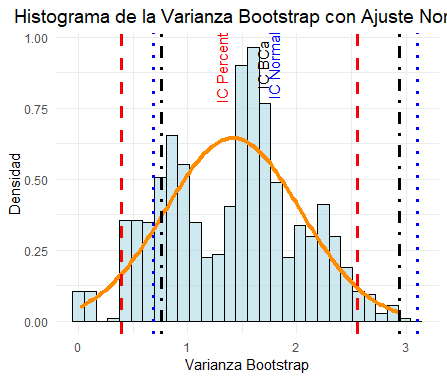

</br></br>
<div class="caja-ejemplo">
<h3>Caso 1:</h3>
<p>

El artículo *"In-use Emissions from Heavy Duty Diesel Vehicles" (J. Yanowitz, 2001)* presenta mediciones de **eficiencia de combustible** en millas por galón para una muestra de siete camiones. Los datos registrados corresponden a una muestra de tamaño \( n = 7 \):

\[
7.69, \quad 4.97, \quad 4.56, \quad 6.49, \quad 4.34, \quad 6.24, \quad 4.45
\]

Se asume que esta muestra es aleatoria y representativa de la población de camiones en estudio. El objetivo es construir un **intervalo de confianza del 95%** para la **varianza poblacional** de la eficiencia de combustible. Sin embargo, dado que **se desconoce la distribución subyacente de los datos** y la muestra es pequeña, no es apropiado aplicar métodos paramétricos tradicionales, que requieren asumir una distribución normal. En este caso, se recurre a técnicas **no paramétricas** para estimar el intervalo de confianza, como el método **bootstrap**, el cual no depende de supuestos sobre la distribución de los datos.


----

A continuación se presentan los códigos para determinar los 3 tipos de intervalos de confianza Bootstrap: Percentil, Normal y BCa.  La **Figura 2.76** muestra la distribución de las varianzas bootstrap. Las lineas verticales representan los limites de los intervalos de confianza bootstrap de la varianza: Percentil, Normal y BCa.


<pre>
# Cargar librerías necesarias
library(boot)
library(ggplot2)

set.seed(123)  # Para asegurar reproducibilidad

# Datos originales
X <- c(7.69, 4.97, 4.56, 6.49, 4.34, 6.24, 4.45)

# Función para calcular la estadística de interés (varianza)
boot_function <- function(data, indices) {
  return(var(data[indices]))
}

# Número de muestras bootstrap
B <- 1000  

# Generar muestras bootstrap usando la librería boot
boot_results <- boot(data = X, statistic = boot_function, R = B)

# Obtener la distribución de varianzas bootstrap
bootstrap_var <- boot_results$t

# Calcular la media y desviación estándar de las varianzas bootstrap
mean_bootstrap <- mean(bootstrap_var)
sd_bootstrap <- sd(bootstrap_var)

# Intervalos de Confianza Bootstrap

alpha <- 0.05

# Intervalo de Confianza Percentil
IC.p <- boot.ci(boot_results, type = "perc")$percent[4:5]

# Intervalo de Confianza Normal
IC.N <- boot.ci(boot_results, type = "norm")$normal[2:3]

# Intervalo de Confianza BCa
IC.BCa <- boot.ci(boot_results, type = "bca")$bca[4:5]

# Crear un dataframe para ggplot
df <- data.frame(bootstrap_var)

# Crear datos para la curva normal ajustada
x_vals <- seq(min(bootstrap_var), max(bootstrap_var), length.out = 100)
normal_curve <- data.frame(
  x = x_vals,
  y = dnorm(x_vals, mean = mean_bootstrap, sd = sd_bootstrap) # Corrección: Basado en varianza
)

# Grafica 

plot.boot.c<-ggplot(df, aes(x = bootstrap_var)) +
  geom_histogram(aes(y = after_stat(density)), bins = 30, fill = "lightblue", color = "black", alpha = 0.6) + # Corrección en el eje x
  geom_line(data = normal_curve, aes(x = x, y = y), color = "darkorange", linewidth = 1.5) + # Corrección: Curva normal basada en varianza
  geom_vline(xintercept = IC.p, color = "red", linetype = "dashed", linewidth = 1.2) + # IC Percentil
  geom_vline(xintercept = IC.N, color = "blue", linetype = "dotted", linewidth = 1.2) + # IC Normal
  geom_vline(xintercept = IC.BCa, color = "black", linetype = "dotdash", linewidth = 1.2) + # IC BCa (cambiado a negro)
  labs(title = "Varianza Bootstrap",
       x = "Varianza Bootstrap", y = "Densidad") +
  theme_minimal() +
  theme(plot.title = element_text(hjust = 0.5, size = 14)) +
  annotate("text", x = mean(IC.p), y = 0.9, label = "IC Percentil", color = "red", angle = 90, vjust = -1) +
  annotate("text", x = mean(IC.N), y = 0.9, label = "IC Normal", color = "blue", angle = 90, vjust = -0.5) +
  annotate("text", x = mean(IC.BCa), y = 0.9, label = "IC BCa", color = "black", angle = 90, vjust = -1) # Cambiado a negro

print(plot.boot.c)
IC.p 
IC.N
IC.BCa
</pre>


```{r,echo=TRUE,warning=FALSE}
# Cargar librerías necesarias
library(boot)
library(ggplot2)

set.seed(123)  # Para asegurar reproducibilidad

# Datos originales
X <- c(7.69, 4.97, 4.56, 6.49, 4.34, 6.24, 4.45)

# Función para calcular la estadística de interés (varianza)
boot_function <- function(data, indices) {
  return(var(data[indices]))
}

# Número de muestras bootstrap
B <- 1000  

# Generar muestras bootstrap usando la librería boot
boot_results <- boot(data = X, statistic = boot_function, R = B)

# Obtener la distribución de varianzas bootstrap
bootstrap_var <- boot_results$t

# Calcular la media y desviación estándar de las varianzas bootstrap
mean_bootstrap <- mean(bootstrap_var)
sd_bootstrap <- sd(bootstrap_var)

#  Intervalos de Confianza 

alpha <- 0.05

# Intervalo de Confianza Percentil
IC.p <- boot.ci(boot_results, type = "perc")$percent[4:5]

# Intervalo de Confianza Normal
IC.N <- boot.ci(boot_results, type = "norm")$normal[2:3]

# Intervalo de Confianza BCa
IC.BCa <- boot.ci(boot_results, type = "bca")$bca[4:5]

# Crear un dataframe para ggplot
df <- data.frame(bootstrap_var)

# Crear datos para la curva normal ajustada
x_vals <- seq(min(bootstrap_var), max(bootstrap_var), length.out = 100)
normal_curve <- data.frame(
  x = x_vals,
  y = dnorm(x_vals, mean = mean_bootstrap, sd = sd_bootstrap) # Corrección: Basado en varianza
)

# Graficar con ggplot2 

plot.boot.c<-ggplot(df, aes(x = bootstrap_var)) +
  geom_histogram(aes(y = after_stat(density)), bins = 30, fill = "lightblue", color = "black", alpha = 0.6) + # Corrección en el eje x
  geom_line(data = normal_curve, aes(x = x, y = y), color = "darkorange", linewidth = 1.5) + # Corrección: Curva normal basada en varianza
  geom_vline(xintercept = IC.p, color = "red", linetype = "dashed", linewidth = 1.2) + # IC Percentil
  geom_vline(xintercept = IC.N, color = "blue", linetype = "dotted", linewidth = 1.2) + # IC Normal
  geom_vline(xintercept = IC.BCa, color = "black", linetype = "dotdash", linewidth = 1.2) + # IC BCa (cambiado a negro)
  labs(title = "Histograma de la Varianza Bootstrap con Ajuste Normal",
       x = "Varianza Bootstrap", y = "Densidad") +
  theme_minimal() +
  theme(plot.title = element_text(hjust = 0.5, size = 14)) +
  annotate("text", x = mean(IC.p), y = 0.9, label = "IC Percentil", color = "red", angle = 90, vjust = -1) +
  annotate("text", x = mean(IC.N), y = 0.9, label = "IC Normal", color = "blue", angle = 90, vjust = -0.5) +
  annotate("text", x = mean(IC.BCa), y = 0.9, label = "IC BCa", color = "black", angle = 90, vjust = -1) # Cambiado a negro

#print(plot.boot.c)
#IC.p 
#IC.N
#IC.BCa

```


<br/><br/>
<center>
```{r, echo=FALSE, out.width="80%", fig.align = "center"}

```
</center>
**Figura 2.76** Distribución de las varianzas bootstrap con ajuste de curnva normal. Las lineas representan los limites de los intervalos de confianza bootstrap de la varianza: Percentil, Normal y BCa.
<br/><br/>


---

A partir de la simulación bootstrap, se obtuvieron los siguientes **intervalos de confianza al 95%** para la varianza de la población:

\[
\begin{aligned}
\textbf{IC Percentil} &= [0.3902849, 2.5560492] \\
\textbf{IC Normal} &= [0.6845046, 3.1068192] \\
\textbf{IC BCa} &= [0.7547304, 2.9371905]
\end{aligned}
\]


Si la distribución de las varianzas bootstrap es simétrica y similar a una normal, el IC Normal es una opción adecuada, ya que la aproximación normal resulta válida en este caso. Si la distribución presenta una ligera asimetría, el IC Percentil es una mejor alternativa, pues se basa en los percentiles de la distribución empírica y no asume normalidad. En cambio, si la distribución es marcadamente asimétrica o presenta sesgo, el IC BCa es la mejor elección, ya que corrige tanto el sesgo como la aceleración, proporcionando un intervalo más preciso cuando la distribución no es simétrica.


La mejor manera de elegir entre estos tres intervalos es aplicar un test de normalidad y analizar la asimetría y curtosis de la distribución de las varianzas bootstrap.

---

Para verificar si la distribución de las varianzas bootstrap sigue una distribución normal, se pueden calcular estadísticas de asimetría y curtosis, así como aplicar los tests de normalidad. Sin embargo, no todos los tests son adecuados para $B=1,000$, por lo que se recomienda seleccionar aquellos que funcionan mejor con muestras grandes.

Si el test no rechaza la normalidad, se recomienda usar el IC Normal.  Si el test rechaza la normalidad, es mejor usar IC BCa o Percentil. Para  $B=1,000$, se sugiere usar un nivel de significancia más exigente como porm ejemplo de 0.01.

---

Los códigos para implementar los tests de normalidad se presentan a continuación:


<pre>
# options(repos = c(CRAN = "https://cloud.r-project.org"))

# Instalar y cargar paquetes necesarios
install.packages("nortest")
install.packages("moments")
library(nortest)
library(moments)
library(boot)

set.seed(123)  # Para asegurar reproducibilidad

# Datos originales
X <- c(7.69, 4.97, 4.56, 6.49, 4.34, 6.24, 4.45)

# Función para calcular la estadística de interés (en este caso, la media)
boot_function <- function(data, indices) {
  return(var(data[indices]))
}

# Número de muestras bootstrap
B <- 1000  

# Generar muestras bootstrap usando la librería boot
boot_results <- boot(data = X, statistic = boot_function, R = B)

# Obtener la distribución de medias bootstrap
bootstrap_var <- boot_results$t

# Test de Anderson-Darling
ad_test <- ad.test(bootstrap_var)

# Test de Cramer-von Mises
cvm_test <- cvm.test(bootstrap_var)

# Test de Lilliefors (Kolmogorov-Smirnov modificado)
lillie_test <- lillie.test(bootstrap_var)

# Test de D'Agostino-Pearson (manual: usa asimetría y curtosis)
skewness_value <- skewness(bootstrap_var)
kurtosis_value <- kurtosis(bootstrap_var)

# Mostrar resultados
list(
  Anderson_Darling_p_value = ad_test$p.value,
  Cramer_von_Mises_p_value = cvm_test$p.value,
  Lilliefors_p_value = lillie_test$p.value,
  DAgostino_Pearson_Skewness = skewness_value,
  DAgostino_Pearson_Kurtosis = kurtosis_value
)
</pre>


```{r,echo=TRUE,warning=FALSE}
#options(repos = c(CRAN = "https://cloud.r-project.org"))
# Instalar y cargar paquetes necesarios (solo si no están instalados)
#if (!require(nortest)) install.packages("nortest", dependencies = TRUE)
#if (!require(moments)) install.packages("moments", dependencies = TRUE)
#if (!require(boot)) install.packages("boot", dependencies = TRUE)

# Cargar las librerías
library(nortest)
library(moments)
library(boot)

set.seed(123)  # Para asegurar reproducibilidad

# Datos originales
X <- c(7.69, 4.97, 4.56, 6.49, 4.34, 6.24, 4.45)

# Función para calcular la estadística de interés (en este caso, la varianza)
boot_function <- function(data, indices) {
  return(var(data[indices]))  # Calcula la varianza en cada muestra bootstrap
}

# Número de muestras bootstrap
B <- 1000  

# Generar muestras bootstrap usando la librería boot
boot_results <- boot(data = X, statistic = boot_function, R = B)

# Obtener la distribución de varianzas bootstrap
bootstrap_var <- boot_results$t

# Test de Anderson-Darling
ad_test <- ad.test(bootstrap_var)

# Test de Cramer-von Mises
cvm_test <- cvm.test(bootstrap_var)

# Test de Lilliefors (Kolmogorov-Smirnov modificado)
lillie_test <- lillie.test(bootstrap_var)

# Test de D'Agostino-Pearson (manual: usa asimetría y curtosis)
skewness_value <- skewness(bootstrap_var)
kurtosis_value <- kurtosis(bootstrap_var)

# Mostrar resultados correctamente
results <- list(
  Anderson_Darling_p_value = ad_test$p.value,
  Cramer_von_Mises_p_value = cvm_test$p.value,
  Lilliefors_p_value = lillie_test$p.value,
  DAgostino_Pearson_Skewness = skewness_value,
  DAgostino_Pearson_Kurtosis = kurtosis_value
)

# Imprimir resultados
#print(results)
```


---

La **Tabla 2.22** presenta los resultados obtenidos para evaluar si la distribución de las varianzas bootstrap sigue una distribución normal.

<br/><br/>
<center>
**Tabla 2.22** Resultados de algunos  tests de normalidad y estadísticas para revisar simetría.
</center> 

| **Test** | **Resultado** | **Interpretación** |
|-----------------------------|--------------|----------------|
| **Anderson-Darling \( p \)-valor** | \( 1.177393e-14 \) | Se rechaza la normalidad, pues \( valor-p < 0.01 \). |
| **Cramer-von Mises \( p \)-valor** | \( 7.37e-10 \) | Se rechaza la normalidad, ya que \( valor-p < 0.01 \). |
| **Lilliefors \( p \)-valor** | \( 8.314219e-14 \) | Se rechaza la normalidad, pues \( valor-p < 0.01 \). |
| **D'Agostino-Pearson Skewness** | \( -0.0007530777 \) | Indica que la distribución es casi simétrica, lo que podría sugerir una forma cercana a la normal. |
| **D'Agostino-Pearson Kurtosis** | \( 2.354766 \) | Es cercano a 3, lo que sugiere colas similares a la normal, aunque no confirma normalidad. |


Los tres tests de normalidad (Anderson-Darling, Cramer-von Mises y Lilliefors) tienen **\( valor-p \) menores a 0.01**, lo que significa que **se rechaza** la hipótesis nula de **normalidad**. Esto indica que la distribución de las varianzas bootstrap **no es  normal** con una significancia incluso menor al 1%.

**Los valores de asimetría  y curtosis  están dentro del rango esperado para una distribución normal**, sugieren que la distribución de las varianzas bootstrap es aproximadamente normal.

Dado que los tests de normalidad han rechazado la normalidad en la distribución de las varianzas bootstrap, no se recomienda utilizar el IC Normal. En su lugar, la mejor opción es el IC BCa, ya que ajusta el sesgo y la aceleración. Si se prefiere un método más simple sin corrección de sesgo, el IC Percentil también es una alternativa aceptable, aunque menos precisa.


</p>
</div>


</br></br>
<div class="caja-ejemplo">
<h3>Caso 2:</h3>
<p>

La llegada de vehículos a una gasolinera se distribuye según una **ley de Poisson**, donde \( \lambda \) representa el número de vehículos que llegan a la estación de servicio en un minuto. Durante un mes, se seleccionan aleatoriamente **100 intervalos de 1 minuto** dentro del horario comercial de la gasolinera. Se observa que el **promedio** de vehículos por minuto es **igual a 2**. Se requiere calcular una **estimación de máxima verosimilitud** para el parámetro \( \lambda \) a partir de la información proporcionada.

Se dispone de una **muestra observada** de tamaño \( n = 100 \), la cual proviene de una **muestra aleatoria independiente e idénticamente distribuida (i.i.d.)**:

\[
X_1, X_2, \dots, X_n \sim \text{Poisson}(\lambda)
\]

Se sabe que el **promedio observado de vehículos por minuto** es igual a **2**. Con esta información, se busca determinar el estimador de máxima verosimilitud (EMV) de \( \lambda \).


Dado que los datos \( X_i \) son i.i.d., la función de verosimilitud se expresa como:

\[
L(\lambda) = \prod_{i=1}^{n} P(X_i = x_i) = \prod_{i=1}^{n} \frac{\lambda^{x_i} e^{-\lambda}}{x_i!}
\]

Tomando logaritmo:

\[
\ell(\lambda) = \sum_{i=1}^{n} x_i \log \lambda - n \lambda - \sum_{i=1}^{n} \log(x_i!)
\]

Derivando y resolviendo:

\[
\frac{d\ell}{d\lambda} = \frac{\sum x_i}{\lambda} - n = 0
\]

Despejando \( \lambda \):

\[
\hat{\lambda} = \frac{1}{n} \sum_{i=1}^{n} x_i
\]

Dado que el **promedio observado** es **2**, la estimación máximo verosimil del parámetro es 2:

\[
\hat{\lambda} = 2
\]


El código siguiente en **R** realiza la **estimación de máxima verosimilitud (EMV)** del parámetro \( \lambda \) en un proceso de Poisson, que modela la llegada de vehículos a una gasolinera. Primero, simula una muestra de **100 observaciones** con \( \lambda = 2 \), luego define la función de **log-verosimilitud** y su versión negativa para optimización. Utiliza el **método de Brent** en `optim()` para encontrar el valor de \( \lambda \) que maximiza la log-verosimilitud, obteniendo como **estimador la media muestral**. Finalmente, genera un gráfico que muestra la **curva de log-verosimilitud** y una línea vertical en el **EMV estimado**, visualizando el punto donde la función alcanza su máximo.
  
<pre>
# Cargar la librería ggplot2
library(ggplot2)

# Simulación de datos observados
set.seed(123)
n <- 100  
datos <- rpois(n, lambda = 2)  

# Función de log-verosimilitud
log_verosimilitud <- function(lambda, datos) {
  if (lambda <= 0) return(-Inf)  
  n <- length(datos)
  return(sum(datos) * log(lambda) - n * lambda)
}

# Función negativa de log-verosimilitud
neg_log_verosimilitud <- function(lambda) {
  -log_verosimilitud(lambda, datos)  
}

# Optimización para encontrar el EMV
opt_result <- optim(par = 1, fn = function(lambda) neg_log_verosimilitud(lambda), 
                    method = "Brent", lower = 0.01, upper = 10)

lambda_opt <- opt_result$par

# Mostrar resultado sin caracteres problemáticos
cat("EMV obtenido por optimizacion:", lambda_opt, "\n")

# Rango de valores para lambda
lambda_vals <- seq(0.5, 4, length.out = 100)

# Evaluación de la log-verosimilitud en cada punto
log_like_vals <- sapply(lambda_vals, function(l) log_verosimilitud(l, datos))

# Gráfico de la log-verosimilitud

# Crear un data frame con los valores de lambda y log-verosimilitud
df <- data.frame(lambda = lambda_vals, log_verosimilitud = log_like_vals)

# Crear el gráfico con ggplot2
plot_log <- ggplot(df, aes(x = lambda, y = log_verosimilitud)) +
  geom_line(color = "blue", size = 1) +  # Línea de log-verosimilitud
  geom_vline(xintercept = lambda_opt, linetype = "dashed", color = "red", size = 1) +  # Línea vertical en EMV
  labs(title = "Estimación de Máxima Verosimilitud para Poisson",
       x = expression(lambda),
       y = "Log-Verosimilitud") +
  theme_minimal() +  # Estilo limpio y moderno
  theme(plot.title = element_text(hjust = 0.5, face = "bold"))  # Centrar título y negrita

# Mostrar el gráfico
print(plot_log)
</pre>


```{r,echo=TRUE,include=FALSE}
# Cargar la librería ggplot2
library(ggplot2)

# Simulación de datos observados
set.seed(123)
n <- 100  
datos <- rpois(n, lambda = 2)  

# Función de log-verosimilitud
log_verosimilitud <- function(lambda, datos) {
  if (lambda <= 0) return(-Inf)  
  n <- length(datos)
  return(sum(datos) * log(lambda) - n * lambda)
}

# Función negativa de log-verosimilitud
neg_log_verosimilitud <- function(lambda) {
  -log_verosimilitud(lambda, datos)  
}

# Optimización para encontrar el EMV
opt_result <- optim(par = 1, fn = function(lambda) neg_log_verosimilitud(lambda), 
                    method = "Brent", lower = 0.01, upper = 10)

lambda_opt <- opt_result$par

# Mostrar resultado sin caracteres problemáticos
cat("EMV obtenido por optimizacion:", lambda_opt, "\n")

# Rango de valores para lambda
lambda_vals <- seq(0.5, 4, length.out = 100)

# Evaluación de la log-verosimilitud en cada punto
log_like_vals <- sapply(lambda_vals, function(l) log_verosimilitud(l, datos))

# Gráfico de la log-verosimilitud

# Crear un data frame con los valores de lambda y log-verosimilitud
df <- data.frame(lambda = lambda_vals, log_verosimilitud = log_like_vals)

# Crear el gráfico con ggplot2
plot_log <- ggplot(df, aes(x = lambda, y = log_verosimilitud)) +
  geom_line(color = "blue", size = 1) +  # Línea de log-verosimilitud
  geom_vline(xintercept = lambda_opt, linetype = "dashed", color = "red", size = 1) +  # Línea vertical en EMV
  labs(title = "Estimación de Máxima Verosimilitud para Poisson",
       x = expression(lambda),
       y = "Log-Verosimilitud") +
  theme_minimal() +  # Estilo limpio y moderno
  theme(plot.title = element_text(hjust = 0.5, face = "bold"))  # Centrar título y negrita

# Mostrar el gráfico
#print(plot_log)

```


<br/><br/>
<center>
```{r, echo=FALSE, out.width="80%", fig.align = "center"}
knitr::include_graphics("img/fig277.png")
```
**Figura 2.77** La **log-verosimilitud** en función del parámetro \( \lambda \).
</center>
<br/><br/>


El gráfico de la **Figura 2.77** muestra la **log-verosimilitud** en función del parámetro \( \lambda \), que representa el número esperado de llegadas de vehículos a la gasolinera por minuto.

- La **curva azul** representa la función de **log-verosimilitud** \( \ell(\lambda) \), la cual alcanza su máximo en el estimador de máxima verosimilitud (EMV).  La forma de la curva  indica cómo varía la log-verosimilitud con respecto a \( \lambda \).

- La **línea roja discontinua** indica el valor estimado de \( \lambda \) obtenido mediante optimización numérica, coincidiendo con el máximo de la función de log-verosimilitud. En este caso, el **estimador \( \hat{\lambda} \) se encuentra aproximadamente en 2**, lo que coincide con la media de la muestra.


Este gráfico **confirma visualmente** que el estimador de máxima verosimilitud (EMV) para \( \lambda \) es el punto donde la log-verosimilitud es **máxima**, lo que respalda el cálculo analítico y la optimización numérica realizada.


</p>
</div>