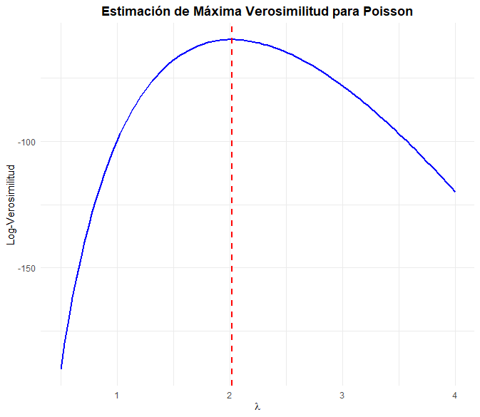

</br></br>
<div class="caja-ejemplo">
<h3>Caso 2:</h3>
<p>

La llegada de vehículos a una gasolinera se distribuye según una **ley de Poisson**, donde \( \lambda \) representa el número de vehículos que llegan a la estación de servicio en un minuto. Durante un mes, se seleccionan aleatoriamente **100 intervalos de 1 minuto** dentro del horario comercial de la gasolinera. Se observa que el **promedio** de vehículos por minuto es **igual a 2**. Se requiere calcular una **estimación de máxima verosimilitud** para el parámetro \( \lambda \) a partir de la información proporcionada.

Se dispone de una **muestra observada** de tamaño \( n = 100 \), la cual proviene de una **muestra aleatoria independiente e idénticamente distribuida (i.i.d.)**:

\[
X_1, X_2, \dots, X_n \sim \text{Poisson}(\lambda)
\]

Se sabe que el **promedio observado de vehículos por minuto** es igual a **2**. Con esta información, se busca determinar el estimador de máxima verosimilitud (EMV) de \( \lambda \).


Dado que los datos \( X_i \) son i.i.d., la función de verosimilitud se expresa como:

\[
L(\lambda) = \prod_{i=1}^{n} P(X_i = x_i) = \prod_{i=1}^{n} \frac{\lambda^{x_i} e^{-\lambda}}{x_i!}
\]

Tomando logaritmo:

\[
\ell(\lambda) = \sum_{i=1}^{n} x_i \log \lambda - n \lambda - \sum_{i=1}^{n} \log(x_i!)
\]

Derivando y resolviendo:

\[
\frac{d\ell}{d\lambda} = \frac{\sum x_i}{\lambda} - n = 0
\]

Despejando \( \lambda \):

\[
\hat{\lambda} = \frac{1}{n} \sum_{i=1}^{n} x_i
\]

Dado que el **promedio observado** es **2**, obtenemos:

\[
\hat{\lambda} = 2
\]


El código siguiente en **R** realiza la **estimación de máxima verosimilitud (EMV)** del parámetro \( \lambda \) en un proceso de Poisson, que modela la llegada de vehículos a una gasolinera. Primero, simula una muestra de **100 observaciones** con \( \lambda = 2 \), luego define la función de **log-verosimilitud** y su versión negativa para optimización. Utiliza el **método de Brent** en `optim()` para encontrar el valor de \( \lambda \) que maximiza la log-verosimilitud, obteniendo como **estimador la media muestral**. Finalmente, genera un gráfico que muestra la **curva de log-verosimilitud** y una línea vertical en el **EMV estimado**, visualizando el punto donde la función alcanza su máximo.
  
<pre>
# Cargar la librería ggplot2
library(ggplot2)

# Simulación de datos observados
set.seed(123)
n <- 100  
datos <- rpois(n, lambda = 2)  

# Función de log-verosimilitud
log_verosimilitud <- function(lambda, datos) {
  if (lambda <= 0) return(-Inf)  
  n <- length(datos)
  return(sum(datos) * log(lambda) - n * lambda)
}

# Función negativa de log-verosimilitud
neg_log_verosimilitud <- function(lambda) {
  -log_verosimilitud(lambda, datos)  
}

# Optimización para encontrar el EMV
opt_result <- optim(par = 1, fn = function(lambda) neg_log_verosimilitud(lambda), 
                    method = "Brent", lower = 0.01, upper = 10)

lambda_opt <- opt_result$par

# Mostrar resultado sin caracteres problemáticos
cat("EMV obtenido por optimizacion:", lambda_opt, "\n")

# Rango de valores para lambda
lambda_vals <- seq(0.5, 4, length.out = 100)

# Evaluación de la log-verosimilitud en cada punto
log_like_vals <- sapply(lambda_vals, function(l) log_verosimilitud(l, datos))

# Gráfico de la log-verosimilitud

# Crear un data frame con los valores de lambda y log-verosimilitud
df <- data.frame(lambda = lambda_vals, log_verosimilitud = log_like_vals)

# Crear el gráfico con ggplot2
plot_log <- ggplot(df, aes(x = lambda, y = log_verosimilitud)) +
  geom_line(color = "blue", size = 1) +  # Línea de log-verosimilitud
  geom_vline(xintercept = lambda_opt, linetype = "dashed", color = "red", size = 1) +  # Línea vertical en EMV
  labs(title = "Estimación de Máxima Verosimilitud para Poisson",
       x = expression(lambda),
       y = "Log-Verosimilitud") +
  theme_minimal() +  # Estilo limpio y moderno
  theme(plot.title = element_text(hjust = 0.5, face = "bold"))  # Centrar título y negrita

# Mostrar el gráfico
print(plot_log)
</pre>


```{r,echo=TRUE}
# Cargar la librería ggplot2
library(ggplot2)

# Simulación de datos observados
set.seed(123)
n <- 100  
datos <- rpois(n, lambda = 2)  

# Función de log-verosimilitud
log_verosimilitud <- function(lambda, datos) {
  if (lambda <= 0) return(-Inf)  
  n <- length(datos)
  return(sum(datos) * log(lambda) - n * lambda)
}

# Función negativa de log-verosimilitud
neg_log_verosimilitud <- function(lambda) {
  -log_verosimilitud(lambda, datos)  
}

# Optimización para encontrar el EMV
opt_result <- optim(par = 1, fn = function(lambda) neg_log_verosimilitud(lambda), 
                    method = "Brent", lower = 0.01, upper = 10)

lambda_opt <- opt_result$par

# Mostrar resultado sin caracteres problemáticos
cat("EMV obtenido por optimizacion:", lambda_opt, "\n")

# Rango de valores para lambda
lambda_vals <- seq(0.5, 4, length.out = 100)

# Evaluación de la log-verosimilitud en cada punto
log_like_vals <- sapply(lambda_vals, function(l) log_verosimilitud(l, datos))

# Gráfico de la log-verosimilitud

# Crear un data frame con los valores de lambda y log-verosimilitud
df <- data.frame(lambda = lambda_vals, log_verosimilitud = log_like_vals)

# Crear el gráfico con ggplot2
plot_log <- ggplot(df, aes(x = lambda, y = log_verosimilitud)) +
  geom_line(color = "blue", size = 1) +  # Línea de log-verosimilitud
  geom_vline(xintercept = lambda_opt, linetype = "dashed", color = "red", size = 1) +  # Línea vertical en EMV
  labs(title = "Estimación de Máxima Verosimilitud para Poisson",
       x = expression(lambda),
       y = "Log-Verosimilitud") +
  theme_minimal() +  # Estilo limpio y moderno
  theme(plot.title = element_text(hjust = 0.5, face = "bold"))  # Centrar título y negrita

# Mostrar el gráfico
#print(plot_log)

```


<br/><br/>
<center>
```{r, echo=FALSE, out.width="80%", fig.align = "center"}

```
**Figura 2.77** La **log-verosimilitud** en función del parámetro \( \lambda \).
</center>
<br/><br/>


El siguiente gráfico de la **Figura 2.77** muestra la **log-verosimilitud** en función del parámetro \( \lambda \), que representa el número esperado de llegadas de vehículos a la gasolinera por minuto.

- La **curva azul** representa la función de **log-verosimilitud** \( \ell(\lambda) \), la cual alcanza su máximo en el estimador de máxima verosimilitud (EMV).  La forma de la curva  indica cómo varía la log-verosimilitud con respecto a \( \lambda \).

- La **línea roja discontinua** indica el valor estimado de \( \lambda \) obtenido mediante optimización numérica, coincidiendo con el máximo de la función de log-verosimilitud. En este caso, el **estimador \( \hat{\lambda} \) se encuentra aproximadamente en 2**, lo que coincide con la media de la muestra.


Este gráfico **confirma visualmente** que el estimador de máxima verosimilitud (EMV) para \( \lambda \) es el punto donde la log-verosimilitud es **máxima**, lo que respalda el cálculo analítico y la optimización numérica realizada.


</p>
</div>