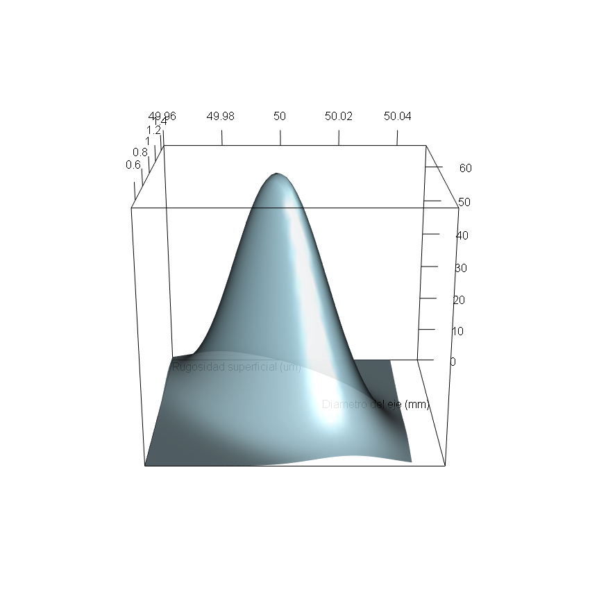

</br></br>
<div class="caja-ejemplo">
<h3>Problema 1:</h3>
<p>

Una fábrica de mecanizado de precisión produce ejes metálicos utilizados en motores eléctricos de maquinaria industrial.  Estos componentes deben cumplir con altos estándares de calidad, ya que cualquier desviación en sus dimensiones o en la calidad de la superficie puede afectar el ensamblaje, el rendimiento y la vida útil del motor.  

En este proceso de fabricación, dos variables clave determinan la calidad del eje:  

- **\( X \) : Diámetro del eje (en milímetros, mm)**  

- **\( Y \) : Rugosidad superficial del eje (en micrómetros, \(\mu m\))**  

El **diámetro y la rugosidad**, se pueden modelar mediante una **distribución normal bivariada**, expresada como:

\[
(X, Y) \sim N_2 \left( 
\boldsymbol{\mu},  
\Sigma
\right)
\]

donde:

- \( \boldsymbol{\mu} \) representa el **vector de medias** del proceso.  

- \( \Sigma \) es la **matriz de covarianza**, que describe la dispersión conjunta de ambas variables.  

El propósito de este análisis es **evaluar la conformidad del proceso de fabricación**, mediante el cálculo de:  

- La probabilidad de que un eje cumpla simultáneamente con las especificaciones de **diámetro y rugosidad**.  

- La probabilidad de que un eje tenga una **rugosidad aceptable** dado que su **diámetro está dentro del rango especificado**.  

- La **rugosidad esperada** para un diámetro específico, lo que permitirá prever la calidad superficial de los ejes en producción.  

Este estudio permitirá **determinar si el control del diámetro es suficiente para garantizar la calidad de la rugosidad** o si se requieren **ajustes adicionales en el proceso de mecanizado**.

Para analizar la conformidad del proceso de fabricación, se presentan a continuación:  

- **Parámetros del modelo normal bivariado**: Se definen las medias, varianzas y covarianza del diámetro del eje y la rugosidad superficial. 

- **Función de densidad conjunta**: Se describe matemáticamente la distribución conjunta de \( X \) y \( Y \), lo que permite modelar su comportamiento probabilístico. 

- **Representación gráfica**: Se visualiza la densidad conjunta mediante:

   - Un **gráfico tridimensional**, que muestra la forma de la distribución. 
   
   - Un **mapa de calor con curvas de nivel**, que permite identificar las combinaciones más probables de diámetro y rugosidad.  

Estos elementos permitirán comprender cómo se distribuyen los valores del diámetro y la rugosidad en el proceso de fabricación y evaluar la probabilidad de conformidad con las especificaciones establecidas.

---

**Parámetros**:

<br/>
**Medias**  

\[
\boldsymbol{\mu}=\begin{bmatrix} 
\mu_X \\ \mu_Y 
\end{bmatrix} =
\begin{bmatrix} 
50.00 \\ 1.0
\end{bmatrix}
\]

- **\( \mu_X = 50.00 \) mm** → **Diámetro nominal del eje**. 

- **\( \mu_Y = 1.0 \) \(\mu m\)** → **Rugosidad superficial promedio**.  

<br/>
**Matriz de covarianza**  

En la normal bivariada se cumple que $\text{Cov}(X, Y) = \rho \sigma_X \sigma_Y$, por tanto, la matriz de covarianzas queda como se muestra a continuación:

$$
\begin{align}
\Sigma &= 
\begin{bmatrix} 
\text{Cov}(X, X) & \text{Cov}(X, Y) \\ 
\text{Cov}(X, Y) & \text{Cov}(Y, Y) 
\end{bmatrix}  \\
&= 
\begin{bmatrix} 
\sigma_X^2 & \text{Cov}(X, Y) \\ 
\text{Cov}(X, Y) & \sigma_Y^2 
\end{bmatrix}  \\
&= 
\begin{bmatrix} 
\sigma_X^2 & \rho \sigma_X \sigma_Y \\ 
\rho \sigma_X \sigma_Y & \sigma_Y^2 
\end{bmatrix}  \\
&=
\begin{bmatrix} 
0.015^2 & -0.6 \times (0.015) \times (0.2) \\ 
-0.6 \times (0.015) \times (0.2) & 0.2^2 
\end{bmatrix}  \\
&=
\begin{bmatrix} 
0.000225 & -0.0018 \\ 
-0.0018 & 0.04
\end{bmatrix}  
\end{align}
$$ 


Donde:

- **$\sigma_X = 0.015$ mm** → **Desviación estándar del diámetro**.

- **$\sigma_Y = 0.2$ $\mu m$** → **Desviación estándar de la rugosidad**.

- **$\rho = -0.6$** → **Correlación de Pearson entre diámetro y rugosidad**.


Esta matriz describe la **dispersión conjunta de ambas variables**, donde la **covarianza negativa indica que un mayor diámetro tiende a estar asociado con una menor rugosidad**. 


---

**Función de densidad conjunta**:

Dado que el **diámetro del eje** \( X \) y la **rugosidad superficial** \( Y \) siguen una **distribución normal bivariada**, su **función de densidad conjunta** está dada por:

\[
\scriptsize
f(x, y) = \frac{1}{2\pi \sigma_X \sigma_Y \sqrt{1 - \rho^2}} 
\exp \left( -\frac{1}{2(1 - \rho^2)} 
\left[ \frac{(x - \mu_X)^2}{\sigma_X^2} + \frac{(y - \mu_Y)^2}{\sigma_Y^2} - 2\rho \frac{(x - \mu_X)(y - \mu_Y)}{\sigma_X \sigma_Y} \right] \right)
\]

Sustituyendo los valores de los parámetros:

\[
\mu_X = 50.00, \quad \sigma_X = 0.015, \quad \mu_Y = 1.0, \quad \sigma_Y = 0.2, \quad \rho = -0.6
\]

\[
\tiny
f(x, y) = \frac{1}{2\pi (0.015)(0.2) \sqrt{1 - (-0.6)^2}} 
\exp \left( -\frac{1}{2(1 - (-0.6)^2)} 
\left[ \frac{(x - 50.00)^2}{0.015^2} + \frac{(y - 1.0)^2}{0.2^2} - 2(-0.6) \frac{(x - 50.00)(y - 1.0)}{(0.015)(0.2)} \right] \right)
\]

Calculando los términos constantes:

\[
\scriptsize
f(x, y) = \frac{1}{2\pi (0.015)(0.2) \times 0.8} 
\exp \left( -\frac{1}{1.6} 
\left[ 4444(x - 50.00)^2 + 25(y - 1.0)^2 + 4.0(x - 50.00)(y - 1.0) \right] \right)
\]

---

**Representación gráfica de la función de densidad conjunta**  

Los códigos de **R** para dibujar la distribución normal bivariada son los siguientes:

<pre>
# Cargar librerías necesarias
library(mvtnorm)  # Para la función dmvnorm()
library(rgl)  # Para gráficos 3D interactivos

# Definir parámetros de la distribución normal bivariada
mu_X <- 50.00   # Media del diametro
sigma_X <- 0.015  # Desviación estándar del diametro (ajustada)
mu_Y <- 1.0     # Media de la rugosidad (ajustada)
sigma_Y <- 0.2   # Desviación estándar de la rugosidad (ajustada)
rho <- -0.6      # Correlación (ajustada)

# Crear la matriz de covarianza
Sigma <- matrix(c(sigma_X^2, rho * sigma_X * sigma_Y, 
                  rho * sigma_X * sigma_Y, sigma_Y^2), 
                ncol = 2)

# Definir el rango de valores para X y Y
x_vals <- seq(49.96, 50.04, length.out = 50)  # Ajustado a la nueva variabilidad
y_vals <- seq(0.5, 1.5, length.out = 50)  # Ajustado a la nueva rugosidad

# Crear una cuadrícula de puntos para evaluar la densidad
grid <- expand.grid(X = x_vals, Y = y_vals)

# Calcular la densidad conjunta usando dmvnorm() de mvtnorm
grid$Density <- dmvnorm(grid, mean = c(mu_X, mu_Y), sigma = Sigma)

# Convertir datos en matriz para gráfico 3D
z_matrix <- matrix(grid$Density, nrow = length(x_vals), ncol = length(y_vals))

# Abrir dispositivo de gráfico 3D en RGL
open3d()
par3d(windowRect = c(50, 50, 900, 900))  # Ajustar tamaño de la ventana

# Graficar la campana bivariada en 3D con ejes visibles
persp3d(x_vals, y_vals, z_matrix, col = "lightblue", alpha = 0.9,
        xlab = "", ylab = "", zlab = "", axes = TRUE,  # Mantener ejes sin etiquetas predeterminadas
        theta = 45, phi = 30, expand = 0.8, zoom = 0.9)

# Ajustar tamaño de etiquetas de los ejes para evitar superposición
par3d(cex = 1.0)

# Agregar nombres de los ejes manualmente sin acentos
text3d(x = 50.05, y = 1.0, z = 0, texts = "Diametro del eje (mm)", adj = c(1, 0))
text3d(x = 49.96, y = 1.5, z = 0, texts = "Rugosidad superficial (um)", adj = c(0, 1))

# Guardar el gráfico en un archivo PNG con buena resolución
rgl.snapshot("densidad_bivariada.png", fmt = "png")

# Cerrar el dispositivo gráfico correctamente
close3d()
</pre>


```{r, echo=TRUE,warning=FALSE}
# Cargar librerías necesarias
library(mvtnorm)  # Para la función dmvnorm()
library(rgl)  # Para gráficos 3D interactivos

# Definir parámetros de la distribución normal bivariada
mu_X <- 50.00   # Media del diametro
sigma_X <- 0.015  # Desviación estándar del diametro (ajustada)
mu_Y <- 1.0     # Media de la rugosidad (ajustada)
sigma_Y <- 0.2   # Desviación estándar de la rugosidad (ajustada)
rho <- -0.6      # Correlación (ajustada)

# Crear la matriz de covarianza
Sigma <- matrix(c(sigma_X^2, rho * sigma_X * sigma_Y, 
                  rho * sigma_X * sigma_Y, sigma_Y^2), 
                ncol = 2)

# Definir el rango de valores para X y Y
x_vals <- seq(49.96, 50.04, length.out = 50)  # Ajustado a la nueva variabilidad
y_vals <- seq(0.5, 1.5, length.out = 50)  # Ajustado a la nueva rugosidad

# Crear una cuadrícula de puntos para evaluar la densidad
grid <- expand.grid(X = x_vals, Y = y_vals)

# Calcular la densidad conjunta usando dmvnorm() de mvtnorm
grid$Density <- dmvnorm(grid, mean = c(mu_X, mu_Y), sigma = Sigma)

# Convertir datos en matriz para gráfico 3D
z_matrix <- matrix(grid$Density, nrow = length(x_vals), ncol = length(y_vals))

# Abrir dispositivo de gráfico 3D en RGL
# open3d()
# par3d(windowRect = c(50, 50, 900, 900))  # Ajustar tamaño de la ventana

# Graficar la campana bivariada en 3D con ejes visibles
persp3d(x_vals, y_vals, z_matrix, col = "lightblue", alpha = 0.9,
        xlab = "", ylab = "", zlab = "", axes = TRUE,  # Mantener ejes sin etiquetas predeterminadas
        theta = 45, phi = 30, expand = 0.8, zoom = 0.9)

# Ajustar tamaño de etiquetas de los ejes para evitar superposición
par3d(cex = 1.0)

# Agregar nombres de los ejes manualmente sin acentos
text3d(x = 50.05, y = 1.0, z = 0, texts = "Diametro del eje (mm)", adj = c(1, 0))
text3d(x = 49.96, y = 1.5, z = 0, texts = "Rugosidad superficial (um)", adj = c(0, 1))

# Guardar el gráfico en un archivo PNG con buena resolución
rgl.snapshot("densidad_bivariada.png", fmt = "png")

# Cerrar el dispositivo gráfico correctamente
close3d()
```


<br/><br/>
<center>
```{r, echo=FALSE, out.width="80%", fig.align = "center"}

```
</center>
**Figura 2.80** Densidad conjunta de la normal bivariada. Los ejes \( X \) y \( Y \) corresponde a las variables del del diámetro y rugosidad, mientras que la altura corresponde a la densidad conjunta.
<br/><br/>

Los códigos de **R** para crear el mapa de calor y curvas de nivel de la distribución normal bivariada son los siguientes:

<pre>
# Cargar librerías necesarias
library(ggplot2)
library(mvtnorm)  # Para usar dmvnorm()
library(reshape2)  # Para convertir la matriz en formato adecuado para ggplot

# Definir parámetros de la distribución normal bivariada
mu_X <- 50.00   # Media del diámetro
sigma_X <- 0.015  # Desviación estándar del diámetro (ajustada)
mu_Y <- 1.0     # Media de la rugosidad (ajustada)
sigma_Y <- 0.2   # Desviación estándar de la rugosidad (ajustada)
rho <- -0.6      # Correlación (ajustada)

# Crear la matriz de covarianza
Sigma <- matrix(c(sigma_X^2, rho * sigma_X * sigma_Y, 
                  rho * sigma_X * sigma_Y, sigma_Y^2), 
                ncol = 2)

# Definir el rango de valores para X y Y
x_vals <- seq(49.96, 50.04, length.out = 100)  # Ajustado a la nueva variabilidad
y_vals <- seq(0.5, 1.5, length.out = 100)  # Ajustado a la nueva rugosidad

# Crear una cuadrícula de puntos para evaluar la densidad
grid <- expand.grid(X = x_vals, Y = y_vals)

# Calcular la densidad conjunta usando dmvnorm() de mvtnorm
grid$Density <- dmvnorm(grid, mean = c(mu_X, mu_Y), sigma = Sigma)

# Graficar la densidad en 3D con ggplot (corregido)
plot_niv <- ggplot(grid, aes(x = X, y = Y)) +
  geom_raster(aes(fill = Density), interpolate = TRUE) +  # Mapa de calor de densidad
  stat_contour(aes(z = Density), bins = 10, color = "black") +  # Curvas de nivel sin leyenda
  scale_fill_gradient(low = "blue", high = "red") +
  guides(color = "none") +  # Elimina la leyenda de los niveles de densidad
  labs(title = "Densidad conjunta del diámetro y la rugosidad",
       x = "Diámetro del eje (mm)",
       y = "Rugosidad superficial (um)",
       fill = "Densidad") +
  theme_minimal()

print(plot_niv)
</pre>

```{r, echo=TRUE,warning=FALSE}
# Cargar librerías necesarias
library(ggplot2)
library(mvtnorm)  # Para usar dmvnorm()
library(reshape2)  # Para convertir la matriz en formato adecuado para ggplot

# Definir parámetros de la distribución normal bivariada
mu_X <- 50.00   # Media del diámetro
sigma_X <- 0.015  # Desviación estándar del diámetro (ajustada)
mu_Y <- 1.0     # Media de la rugosidad (ajustada)
sigma_Y <- 0.2   # Desviación estándar de la rugosidad (ajustada)
rho <- -0.6      # Correlación (ajustada)

# Crear la matriz de covarianza
Sigma <- matrix(c(sigma_X^2, rho * sigma_X * sigma_Y, 
                  rho * sigma_X * sigma_Y, sigma_Y^2), 
                ncol = 2)

# Definir el rango de valores para X y Y
x_vals <- seq(49.96, 50.04, length.out = 100)  # Ajustado a la nueva variabilidad
y_vals <- seq(0.5, 1.5, length.out = 100)  # Ajustado a la nueva rugosidad

# Crear una cuadrícula de puntos para evaluar la densidad
grid <- expand.grid(X = x_vals, Y = y_vals)

# Calcular la densidad conjunta usando dmvnorm() de mvtnorm
grid$Density <- dmvnorm(grid, mean = c(mu_X, mu_Y), sigma = Sigma)

# Graficar la densidad en 3D con ggplot (corregido)
plot_niv <- ggplot(grid, aes(x = X, y = Y)) +
  geom_raster(aes(fill = Density), interpolate = TRUE) +  # Mapa de calor de densidad
  stat_contour(aes(z = Density), bins = 10, color = "black") +  # Curvas de nivel sin leyenda
  scale_fill_gradient(low = "blue", high = "red") +
  guides(color = "none") +  # Elimina la leyenda de los niveles de densidad
  labs(title = "Densidad conjunta del diámetro y la rugosidad",
       x = "Diámetro del eje (mm)",
       y = "Rugosidad superficial (um)",
       fill = "Densidad") +
  theme_minimal()

# print(plot_niv)
```

La **Figura 2.80** muestra la densidad conjunta de la normal bivariada del problema en estudio.  

La **Figura 2.81** representa la **distribución de densidad conjunta del diámetro del eje \( X \) y la rugosidad superficial \( Y \)** mediante un **mapa de calor y curvas de nivel**, donde se destacan los siguientes aspectos:  

- **Las zonas en rojo indican los valores más probables de diámetro y rugosidad**, es decir, las combinaciones de \( X \) y \( Y \) que ocurren con mayor frecuencia en el proceso de mecanizado.  

- **Las zonas en azul representan valores menos probables**, indicando combinaciones de diámetro y rugosidad que se presentan con menor frecuencia en la producción.  

- **El pico de densidad (zona roja central) se encuentra cerca de (50.00, 1.0)**, lo que coincide con el **vector de medias** de la distribución, reflejando que estos valores son los más comunes en el proceso de fabricación.  

- **La forma elíptica inclinada de las curvas de nivel refleja la estructura de la covarianza**. La inclinación negativa de la elipse confirma que la **correlación es \(\rho = -0.6\)**, lo que indica que **un mayor diámetro tiende a estar asociado con una menor rugosidad superficial**.  


<br/><br/>
<center>
```{r, echo=FALSE, out.width="80%", fig.align = "center"}
knitr::include_graphics("img/fig281.png")
```
**Figura 2.81** Curvas de nivel de la densidad conjunta de la normal bivariada.
</center>
<br/><br/>


---

**Cómputo de probabilidad conjunta:**

Un cliente requiere que los ejes fabricados cumplan con las siguientes condiciones:  

- **Diámetro del eje \( X \)**: Entre **49.98 mm y 50.02 mm**.  

- **Rugosidad superficial del eje \( Y \)**: Entre **0.6 y 1.2 μm**.  

Se busca calcular la probabilidad conjunta de que un eje seleccionado al azar cumpla con ambas especificaciones. Como ambas variables son continuas en la normal bivariada es necesario integrar la función de densidad conjunta como se muestra a continuación:  

\[
P(49.98 \leq X \leq 50.02, 0.6< Y < 1.2)=\int_{49.98}^{50.02} \int_{0.6}^{1.2} f_{X,Y}(x, y) \, dy \, dx
\]

donde  \( f_{X,Y}(x,y) \) es la **función de densidad conjunta de la normal bivariada**.


<br/>
Los códigos de **R** para calcular la probabiidad conjunta son los siguientes:

<pre>
# Cargar librerías necesarias
library(mvtnorm)  # Para calcular probabilidades en la normal bivariada

# Definir los parámetros de la normal bivariada
mu_X <- 50.00   # Media del diámetro
sigma_X <- 0.015  # Desviación estándar del diámetro (ajustada)
mu_Y <- 1.0     # Media de la rugosidad (ajustada)
sigma_Y <- 0.2   # Desviación estándar de la rugosidad (ajustada)
rho <- -0.6      # Correlación (ajustada)

# Crear la matriz de covarianza
Sigma <- matrix(c(sigma_X^2, rho * sigma_X * sigma_Y, 
                  rho * sigma_X * sigma_Y, sigma_Y^2), 
                ncol = 2)

# Definir los límites del intervalo para X y Y
x_min <- 49.98
x_max <- 50.02
y_min <- 0.6
y_max <- 1.2

# Calcular la probabilidad P(49.98 ≤ X ≤ 50.02, 0.6 < Y < 1.2)
probabilidad <- pmvnorm(lower = c(x_min, y_min), upper = c(x_max, y_max),
                        mean = c(mu_X, mu_Y), sigma = Sigma)

# Mostrar el resultado
probabilidad
</pre>

```{r, echo=TRUE,warning=FALSE}
# Cargar librerías necesarias
library(mvtnorm)  # Para calcular probabilidades en la normal bivariada

# Definir los parámetros de la normal bivariada
mu_X <- 50.00   # Media del diámetro
sigma_X <- 0.015  # Desviación estándar del diámetro (ajustada)
mu_Y <- 1.0     # Media de la rugosidad (ajustada)
sigma_Y <- 0.2   # Desviación estándar de la rugosidad (ajustada)
rho <- -0.6      # Correlación (ajustada)

# Crear la matriz de covarianza
Sigma <- matrix(c(sigma_X^2, rho * sigma_X * sigma_Y, 
                  rho * sigma_X * sigma_Y, sigma_Y^2), 
                ncol = 2)

# Definir los límites del intervalo para X y Y
x_min <- 49.98
x_max <- 50.02
y_min <- 0.6
y_max <- 1.2

# Calcular la probabilidad P(49.98 ≤ X ≤ 50.02, 0.6 < Y < 1.2)
probabilidad <- pmvnorm(lower = c(x_min, y_min), upper = c(x_max, y_max),
                        mean = c(mu_X, mu_Y), sigma = Sigma)

# Mostrar el resultado
probabilidad
```


El resultado de la probabilidad conjunta es **0.6979**, lo que indica que, en una **producción a gran escala**, aproximadamente **el 69.8% de las piezas fabricadas cumplen con los requisitos del cliente**: 

- **Diámetros entre 49.98 mm y 50.02 mm**. 

- **Rugosidad superficial entre 0.6 y 1.2 μm**.    

Existe un **30.2% de piezas fuera de tolerancia**, lo que podría requerir ajustes en el proceso de fabricación.  

---

**Cómputo de probabilidad condicional:**

Se busca calcular la probabilidad condicional de \( Y \) condicionada a un rango de valores para \( X \):  

\[
P(Y < 1.2 \mid 49.98 \leq X \leq 50.02)=\frac{P(49.98 \leq X \leq 50.02, Y < 1.2)}{P(49.98 \leq X \leq 50.02)}
\]

Cada expresión se determina como:

- El numerador de la fracción:

\[
P(49.98 \leq X \leq 50.02, Y < 1.2) =
\int_{49.98}^{50.02} \int_{0}^{1.2} f_{X,Y}(x, y) \, dy \, dx
\]


- El denominador de la fracción:

\[
P(49.98 \leq X \leq 50.02) =
\int_{49.98}^{50.02}\int_{0}^{\infty} f_{X,Y}(x, y) \, dy \, dx
\]


<br/>
Los códigos para determinar la probabilidad condicional con **R** son:

<pre>
# Cargar librerías necesarias
library(mvtnorm)  # Para calcular probabilidades en la normal bivariada

# Definir los parámetros de la normal bivariada
mu_X <- 50.00   # Media del diámetro
sigma_X <- 0.015  # Desviación estándar del diámetro (ajustada)
mu_Y <- 1.0     # Media de la rugosidad (ajustada)
sigma_Y <- 0.2   # Desviación estándar de la rugosidad (ajustada)
rho <- -0.6      # Correlación (ajustada)

# Crear la matriz de covarianza
Sigma <- matrix(c(sigma_X^2, rho * sigma_X * sigma_Y, 
                  rho * sigma_X * sigma_Y, sigma_Y^2), 
                ncol = 2)

# Definir los límites para el diámetro en especificación
x_min <- 49.98
x_max <- 50.02

# Definir el límite superior para la rugosidad
y_max <- 1.2

# Calcular la probabilidad conjunta P(49.98 ≤ X ≤ 50.02, Y < 1.2)
probabilidad_conjunta <- pmvnorm(lower = c(x_min, -Inf), upper = c(x_max, y_max),
                                 mean = c(mu_X, mu_Y), sigma = Sigma)

# Calcular la probabilidad marginal P(49.98 ≤ X ≤ 50.02)
probabilidad_x <- pmvnorm(lower = c(x_min, -Inf), upper = c(x_max, Inf),
                          mean = c(mu_X, mu_Y), sigma = Sigma)

# Calcular la probabilidad condicional
probabilidad_condicional <- probabilidad_conjunta / probabilidad_x

# Mostrar el resultado
probabilidad_condicional
</pre>


```{r, echo=TRUE, warning=FALSE, message=FALSE}
# Cargar librerías necesarias
library(mvtnorm)  # Para calcular probabilidades en la normal bivariada

# Definir los parámetros de la normal bivariada
mu_X <- 50.00   # Media del diámetro
sigma_X <- 0.015  # Desviación estándar del diámetro (ajustada)
mu_Y <- 1.0     # Media de la rugosidad (ajustada)
sigma_Y <- 0.2   # Desviación estándar de la rugosidad (ajustada)
rho <- -0.6      # Correlación (ajustada)

# Crear la matriz de covarianza
Sigma <- matrix(c(sigma_X^2, rho * sigma_X * sigma_Y, 
                  rho * sigma_X * sigma_Y, sigma_Y^2), 
                ncol = 2)

# Definir los límites para el diámetro en especificación
x_min <- 49.98
x_max <- 50.02

# Definir el límite superior para la rugosidad
y_max <- 1.2

# Calcular la probabilidad conjunta P(49.98 ≤ X ≤ 50.02, Y < 1.2)
probabilidad_conjunta <- pmvnorm(lower = c(x_min, -Inf), upper = c(x_max, y_max),
                                 mean = c(mu_X, mu_Y), sigma = Sigma)

# Calcular la probabilidad marginal P(49.98 ≤ X ≤ 50.02)
probabilidad_x <- pmvnorm(lower = c(x_min, -Inf), upper = c(x_max, Inf),
                          mean = c(mu_X, mu_Y), sigma = Sigma)

# Calcular la probabilidad condicional
probabilidad_condicional <- probabilidad_conjunta / probabilidad_x

# Mostrar el resultado
probabilidad_condicional
```


El resultado de la probabilidad condicional es **0.8664**, lo que indica que **si un eje fabricado tiene su diámetro dentro del rango especificado de \(49.98 \leq X \leq 50.02\), hay un 0.8664 de probabilidad de que su rugosidad sea menor a 1.2 μm**.  Por tanto, en una **producción a gran escala**, esto significa que aproximadamente **el 86.64% de los ejes con un diámetro entre 49.98 mm y 50.02 mm cumplirán con el requisito de rugosidad menor a 1.2 μm**.  


---

**Cómputo de esperanza condicional:**

Se busca calcular la esperanza condicional de \( Y \) dado un valor específico de \( X =  50.01 \):

\[
E[Y \mid X = 50.01]
\]


La esperanza condicional de \( Y \) dado un valor específico de \( X = x \) se define como:

\[
E[Y \mid X = x] = \int_{-\infty}^{\infty} y f_{Y|X}(y|x) \, dy
\]

donde \( f_{Y|X}(y|x) \) es la **función de densidad condicional de \( Y \) dado \( X = x \)**. 


La **densidad condicional** de \( Y \) dado un valor específico de \( X = x \) se define como:

\[
f_{Y|X}(y|x) = \frac{f_{X,Y}(x,y)}{f_X(x)}
\]

donde:  

- \( f_{X,Y}(x,y) \) es la **densidad conjunta** de \( (X, Y) \).  

- \( f_X(x) \) es la **densidad marginal** de \( X \), obtenida integrando la función de densidad conjunta sobre \( Y \).  


\[
f_{Y|X}(y|x) = \frac{1}{\sqrt{2\pi \sigma_{Y|X}^2}} \exp\left(-\frac{(y - \mu_{Y|X})^2}{2\sigma_{Y|X}^2} \right)
\]

donde:

- \( \mu_{Y|X} = \mu_Y + \rho \frac{\sigma_Y}{\sigma_X} (x - \mu_X) \) es la **media condicional**. 

- \( \sigma_{Y|X}^2 = \sigma_Y^2 (1 - \rho^2) \) es la **varianza condicional**. 


La **esperanza condicional de \( Y \) dado \( X = x \)** se define como:

\[
E[Y \mid X = x] = \int_{-\infty}^{\infty} y f_{Y|X}(y|x) \, dy
\]

Sustituyendo la densidad condicional:

\[
E[Y \mid X = x] = \int_{-\infty}^{\infty} y \cdot \frac{1}{\sqrt{2\pi \sigma_{Y|X}^2}} \exp\left(-\frac{(y - \mu_{Y|X})^2}{2\sigma_{Y|X}^2} \right) dy
\]

Entonces, 

\[
E[Y \mid X = x] = \mu_{Y|X} = \mu_Y + \rho \frac{\sigma_Y}{\sigma_X} (x - \mu_X)
\]

La esperanza condicional se determina en **R** con los códigos:

<pre>
# Definir los parámetros de la normal bivariada
mu_X <- 50.00   # Media del diámetro
sigma_X <- 0.015  # Desviación estándar del diámetro (ajustada)
mu_Y <- 1.0     # Media de la rugosidad (ajustada)
sigma_Y <- 0.2   # Desviación estándar de la rugosidad (ajustada)
rho <- -0.6      # Correlación (ajustada)

# Valor de X para calcular la esperanza condicional
x_given <- 50.01

# Calcular la esperanza condicional E[Y | X = x_given]
esperanza_condicional <- mu_Y + rho * (sigma_Y / sigma_X) * (x_given - mu_X)

# Mostrar el resultado
esperanza_condicional
</pre>

```{r, echo=TRUE, warning=FALSE, message=FALSE}
# Definir los parámetros de la normal bivariada
mu_X <- 50.00   # Media del diámetro
sigma_X <- 0.015  # Desviación estándar del diámetro (ajustada)
mu_Y <- 1.0     # Media de la rugosidad (ajustada)
sigma_Y <- 0.2   # Desviación estándar de la rugosidad (ajustada)
rho <- -0.6      # Correlación (ajustada)

# Valor de X para calcular la esperanza condicional
x_given <- 50.01

# Calcular la esperanza condicional E[Y | X = x_given]
esperanza_condicional <- mu_Y + rho * (sigma_Y / sigma_X) * (x_given - mu_X)

# Mostrar el resultado
esperanza_condicional
```

La **esperanza condicional de la rugosidad** dado un diámetro fijo de **50.01 mm** es **0.92 μm**.  Esto significa que, en una **producción a gran escala**, el **promedio esperado de la rugosidad** para los ejes que tienen un diámetro de **50.01 mm** será de aproximadamente **0.92 μm**.  

Este resultado sugiere que **si el diámetro de los ejes se mantiene muy cerca de 50.01 mm**, la rugosidad tenderá a estar alrededor de **0.92 μm**, lo que puede ayudar a prever la calidad superficial de los ejes fabricados.  

---

<br/><br/>
**Relación con la regresión lineal**  

Hasta este punto, se ha analizado la relación entre **el diámetro del eje \( X\) y la rugosidad superficial \( Y\)**, evaluando probabilidades conjuntas, condicionales y valores esperados en el contexto del **control de calidad en la fabricación de ejes metálicos**.  

Sin embargo, el análisis realizado tiene una conexión importante con la **regresión lineal**, una técnica ampliamente utilizada en estadística para modelar relaciones entre variables. 


- **Relación entre la esperanza condicional y la regresión lineal**  

  En los cálculos anteriores, se determino que la **esperanza condicional de la rugosidad \( Y \) dado un diámetro         específico \( X = x \)** está dada por la ecuación:

  \[
  E[Y \mid X = x] = \mu_Y + \rho \frac{\sigma_Y}{\sigma_X} (x - \mu_X)
  \]

  Esta ecuación es equivalente a la **ecuación de una regresión lineal simple**:

  \[
  E[Y \mid X = x] = \beta_0 + \beta_1 x
  \]

  donde los coeficientes de regresión son:

  - **Intercepto:** \( \beta_0 = \mu_Y - \rho \frac{\sigma_Y}{\sigma_X} \mu_X \) 

  - **Pendiente:** \( \beta_1 = \rho \frac{\sigma_Y}{\sigma_X} \)  


  **¿Qué significa esto en el contexto del problema?** 

    - La ecuación muestra que se **puede predecir la rugosidad esperada en función del diámetro**, lo que es clave para    el **control de calidad**.  

    - La pendiente **\( \beta_1 \)** nos indica la dirección y magnitud del efecto del diámetro sobre la rugosidad.  

    - Como **\( \rho < 0 \)** en este problema, esto significa que **un mayor diámetro tiende a estar asociado con una menor rugosidad**.  


- **Varianza condicional y dispersión en la regresión** 

  La **varianza condicional** está dada por:

  \[
  Var(Y \mid X = x) = \sigma_Y^2 (1 - \rho^2)
  \]

  donde:

  - \( \sigma_Y^2 \) es la varianza total de la rugosidad. 

  - \( \rho \) es el **coeficiente de correlación** entre \( X \) y \( Y \). 

  De esta expresión se puede decir en términos de control de calidad que aunque **se puede predecir un valor     esperado de rugosidad para un diámetro dado**, siempre habrá **cierta variabilidad residual** debida a otros         factores en el proceso de fabricación (herramientas, vibraciones, desgaste, etc.). 

    - **¿Cómo afecta el valor de \( \rho  \)?**

      - Si \( \rho = 0 \) **(no hay correlación entre diámetro y rugosidad)**: \( Var(Y \mid X = x) = \sigma_Y^2\). En         consecuencia, la varianza condicional **no cambia**, es decir, la dispersión de la rugosidad es la misma                 independientemente del valor de \( X \).   En términos prácticos, esto significa que **el diámetro no aporta         información útil para predecir la rugosidad**, por lo que controlar \( X \) no ayuda a mejorar la calidad del            acabado     superficial.  

      - Si \( \rho \) está cerca de \( \pm 1 \) **(correlación fuerte entre diámetro y rugosidad)**: 
  \(Var(Y \mid X = x)\approx 0\). La varianza condicional se reduce significativamente.  **Cuando \( \rho \to \pm1 \), la varianza condicional tiende a     0, lo que significa que la rugosidad es totalmente predecible a partir del diámetro**.  En términos industriales,    esto implica que **controlar \( X \) con precisión garantizaría la rugosidad deseada, eliminando prácticamente la        variabilidad en \( Y \)**.  

      - Si \( \rho \) es moderado (\( -1 < \rho < 1 \)):  La varianza condicional es **menor que la varianza total** de     \( Y \), pero sigue habiendo cierta variabilidad.  **A mayor \( |\rho| \), menor será la varianza condicional**, lo     que significa que **la predicción de rugosidad basada en el diámetro es más confiable**.  **A menor \( |\rho| \),       mayor será la variabilidad en la rugosidad, lo que indica que hay otros factores en el proceso de mecanizado que         influyen en \( Y \)**.  

      En este problema, el coeficiente de correlación entre el **diámetro del eje \( X \)** y la **rugosidad          superficial \(     Y \)** es **\( \rho = -0.6 \)**.  

      La **varianza condicional de \( Y \) dado \( X \)** está dada por:

      \[
      Var(Y \mid X = x) = \sigma_Y^2 (1 - \rho^2)
      \]

      Sustituyendo los valores del problema:

      \[
      Var(Y \mid X = x) = (0.2)^2 (1 - (-0.6)^2)
      \]

      \[
       = 0.04 \times (1 - 0.36) = 0.04 \times 0.64 = 0.0256
      \]

       Tomando la raíz cuadrada para obtener la **desviación estándar condicional**:

      \[
       \sigma_{Y \mid X} = \sqrt{0.0256} = 0.16
      \]

      Antes de considerar el diámetro \( X \), la rugosidad tenía una desviación estándar de **\( \sigma_Y = 0.2 \)  μm**.    Después de condicionar en \( X \), la desviación estándar se reduce a **\( \sigma_{Y|X} = 0.16 \) μm**, lo que         significa que **la dispersión en la rugosidad disminuye un 20%** cuando se conoce el diámetro. Por tanto, el  control     del diámetro ayuda a reducir la incertidumbre en la rugosidad. 


        Dado que \( |\rho| \) no es cercano a 1, la reducción de la variabilidad en \( Y \) es moderada**, lo que sugiere que     **el control del diámetro es útil, pero no suficiente por sí solo para garantizar una rugosidad óptima.


- **Relación entre la probabilidad condicional y la regresión**: 

    - Se ha calculado la **probabilidad condicional**: \(
  P(Y < 1.2 \mid 49.98 \leq X \leq 50.02)\), que mide **qué tan probable es que la rugosidad esté dentro del rango deseado cuando el diámetro está dentro de las especificaciones**.  

    - En **regresión lineal**, se usa la ecuación de la recta de regresión para hacer predicciones de $Y$, pero también se tiene     en cuenta la dispersión de los datos alrededor de la recta. 

    - La probabilidad condicional intuitivamente se puede comparar **con el cálculo de la probabilidad de que los valores predichos de \( Y \),     más su variabilidad residual, estén dentro de un intervalo de aceptación**. 

</p>
</div>