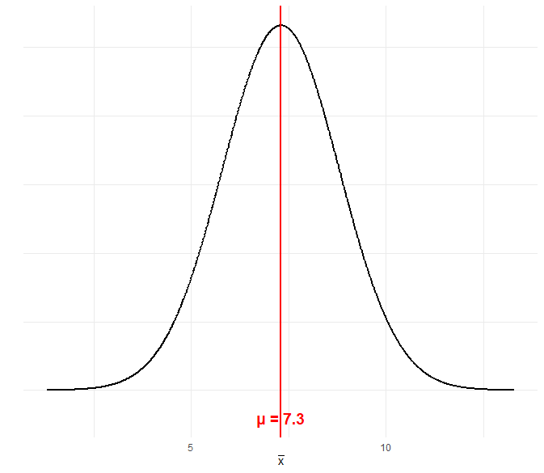

```{r setup, include=FALSE}
knitr::opts_chunk$set(echo = TRUE, message = FALSE, warning = FALSE, comment = NA)

# install.packages('gtools')
# install.packages("TeachingSampling")

#load library
library(gtools)
library(TeachingSampling)
library(readr)
library(paqueteMETODOS)

c1="#FF7F00"
c2="#034A94"
c3="#0EB0C6"
c4="#686868"

data("CarreraLuz22")
data("evaluacion")
CarreraLuz22_c2 = subset(CarreraLuz22, CarreraLuz22$categoria=="2. Abierta")
CarreraLuz22_c3 = subset(CarreraLuz22, CarreraLuz22$categoria=="3. Veteranos A")
```


</br></br>
<h2>Prueba sobre la media</h2>


</br></br>
<h3>Contexto del problema</h3>


Se analiza el caso de una carrera universitaria en la que, históricamente, el tiempo promedio requerido para completarla ha sido de **7.30 años**. El término *históricamente* hace referencia a que este valor ha sido estimado a partir de registros acumulados durante varios años, reflejando el desempeño de generaciones anteriores de estudiantes bajo un plan de estudios que ha sido reemplazado.  

Recientemente, se implementó una modificación en el plan curricular con el propósito de optimizar la trayectoria académica. Como consecuencia de este cambio, se plantea la hipótesis de que el tiempo promedio de graduación podría haber variado.  

En este contexto, el valor de **7.30 años** representa la **media poblacional** correspondiente a los estudiantes que completaron la carrera bajo el plan de estudios anterior. Dado que esta población ya está completamente definida y sus registros se encuentran disponibles, este valor se considera un parámetro conocido.  

El objetivo del análisis es realizar una inferencia sobre la **media poblacional** de los estudiantes que cursan la carrera bajo el nuevo plan. Sin embargo, esta población no es completamente accesible, ya que incluye tanto a los estudiantes que han egresado como a aquellos que aún se encuentran cursando y a quienes ingresarán en los próximos años mientras el nuevo plan continúe vigente.  

Dado que no es posible observar a todos los promedios de notas en su totalidad, la única alternativa es analizar una **muestra representativa** de las notas de los egresados que ya han completado la carrera con el nuevo plan de estudios y evaluar si el tiempo promedio de graduación en esta muestra es significativamente diferente del valor histórico de **7.30 años**.  

Este procedimiento permite determinar si el cambio curricular ha tenido un efecto estadísticamente significativo en la duración de los estudios, proporcionando evidencia empírica para evaluar la efectividad de la reforma académica.


</br></br>
<h3>Formulación de hipótesis</h3>


En este análisis, se formulan la **hipótesis nula** y la **hipótesis alternativa** de la siguiente manera:  

\[
H_0: \mu = 7.30
\]

\[
H_1: \mu \neq 7.30
\]

La **hipótesis nula** \(\left(H_0\right)\) establece que la media poblacional del tiempo de graduación bajo el nuevo plan de estudios es la misma que la registrada históricamente, es decir, **no se han producido cambios significativos** en la duración de la carrera.  

Por otro lado, la **hipótesis alternativa** \(\left(H_1\right)\) plantea que el tiempo promedio requerido para completar la carrera **es diferente** al valor histórico de **7.30 años**, lo que indicaría que la reforma curricular ha generado un impacto en la duración de los estudios.  

Cabe destacar que la hipótesis alternativa no especifica si el tiempo promedio ha aumentado o disminuido, sino únicamente que **ha cambiado** con respecto al plan anterior. Por esta razón, se trata de una **prueba bilateral** o **de dos colas**, cuyo propósito es detectar cualquier desviación significativa sin realizar una suposición previa sobre la dirección del cambio.  


</br></br>
<h3>Distribución normal y medias muestrales</h3>


La **Figura 2.53** presenta la distribución de las medias muestrales bajo la hipótesis nula. La curva se encuentra centrada en la media hipotética, lo que representa el escenario en el que \(\left(H_0\right)\) es verdadera. Esta distribución asigna probabilidades a los distintos valores de la media muestral (\(\bar{x}\)), indicando que el valor más probable se encuentra en torno a **7.30 años**. A medida que los valores se alejan de este punto central, la probabilidad de obtener medias muestrales disminuye, lo que se refleja en la reducción del área bajo la curva.

```{r, echo=FALSE, out.width="80%", fig.align = "center"}
# Cargar librería para gráficos
library(ggplot2)

# Definir los parámetros de la distribución normal
mu <- 7.3  # Media poblacional
sigma <- 1.5  # Desviación estándar
x <- seq(mu - 4 * sigma, mu + 4 * sigma, length.out = 1000)  # Rango de valores
y <- dnorm(x, mean = mu, sd = sigma)  # Densidad de la normal

# Crear el gráfico
plot.253<-ggplot(data = data.frame(x, y), aes(x, y)) +
  geom_line(color = "black", size = 1) +  # Curva de densidad
  geom_vline(xintercept = mu, color = "red", linetype = "solid", size = 1) +  # Línea roja en la media
  annotate("text", x = mu, y = -0.02, label = "μ = 7.3", color = "red", size = 5, fontface = "bold") +  # Etiqueta en la media
  labs(x = expression(bar(x)), y = "") +  # Etiqueta del eje x con x-barra
  theme_minimal() +
  theme(axis.text.y = element_blank(),  # Ocultar etiquetas del eje Y
        axis.ticks.y = element_blank())  # Ocultar marcas del eje Y

#print(plot.253)
```


<br/><br/>
<center>
```{r, echo=FALSE, out.width="80%", fig.align = "center"}

```
**Figura 2.53** Distribución de las medias muestrales bajo la hipótesis nula.
</center>
<br/><br/>


</br></br>
<h3> Evaluación de la evidencia</h3>


Para llevar a cabo la prueba de hipótesis, se requiere una muestra. Se supone que se selecciona un grupo de **100 egresados** mediante un muestreo aleatorio simple y que el tiempo promedio de graduación observado es de **7.50 años**, con una desviación estándar de **1.30 años** (\(\bar{x} = 7.50\), \(s = 1.30\)). En este contexto, se requiere un criterio que permita determinar si este valor es compatible con la hipótesis nula (\(\mu = 7.30\)) o si constituye evidencia suficiente para rechazarla en favor de la hipótesis alternativa (\(\mu \neq 7.30\)).

El criterio de decisión se basa en evaluar la probabilidad de obtener el valor observado bajo la suposición de que la hipótesis nula es verdadera. Dado que en variables continuas no es posible calcular probabilidades exactas para valores individuales (pues la probabilidad en un valor concreto es cero), se estima la probabilidad de obtener valores iguales o más extremos que el observado (\(\bar{x} = 7.50\)).

\[
\text{¿Qué tan alejado?} \quad \Rightarrow \quad \text{¿Qué tan poco probable si \(H_0\) es cierta?}
\]

De este modo, se establece un umbral para la probabilidad máxima de ocurrencia del valor muestral. En otras palabras, se define un límite para el área extrema en la distribución, permitiendo determinar qué tan alejado es "suficientemente alejado" para considerar que el resultado es poco probable bajo \(H_0\).


</br></br>
<h3> La toma de decisión</h3>


La hipótesis nula \(\left(H_0\right)\) se rechaza cuando la probabilidad de obtener un valor como el observado, o uno aún más extremo, es suficientemente baja. El umbral que define esta baja probabilidad puede establecerse previamente, por ejemplo, en **0.05**. Esto implica que se consideran como altamente improbables aquellos resultados cuya probabilidad de ocurrencia sea menor a **0.05** bajo la suposición de que \(H_0\) es cierta. En estos casos, la decisión será rechazar \(H_0\).  

Por el contrario, si los valores observados presentan una probabilidad superior a **0.05**, se consideran como resultados esperables dentro de la variabilidad muestral, lo que conduce a no rechazar \(H_0\).

De acuerdo con la distribución normal, los valores de \( z = \pm 1.96 \) delimitan un área central del **95%**, lo que implica que dejan fuera un área total del **5%**. Esto significa que la probabilidad de que un valor de \( z \) sea superior a **1.96** o inferior a **-1.96** es de **0.05**, distribuida equitativamente en ambas colas de la distribución normal (ver **Figura 2.54** y **Figura 2.55**).  

En consecuencia, los valores de \( z \) que exceden estos límites representan eventos cuya probabilidad de ocurrencia bajo la hipótesis nula es **baja**, lo que los convierte en posibles indicadores de una diferencia estadísticamente significativa.

```{r, echo=FALSE, out.width="80%", fig.align = "center"}
# Cargar librería para gráficos
library(ggplot2)

# Definir los parámetros de la distribución normal
mu <- 7.3  # Media poblacional
sigma <- 1.5  # Desviación estándar
x <- seq(mu - 4 * sigma, mu + 4 * sigma, length.out = 1000)  # Rango de valores
y <- dnorm(x, mean = mu, sd = sigma)  # Densidad de la normal

# Valores críticos para un nivel de significancia del 5% en una prueba bilateral
z_crit <- qnorm(0.975)  # ±1.96
x_crit_left <- mu + (-z_crit) * sigma
x_crit_right <- mu + (z_crit) * sigma

# Crear el gráfico
plot254<-ggplot(data.frame(x, y), aes(x, y)) +
  geom_line(color = "blue", size = 1) +  # Curva de densidad
  geom_segment(aes(x = mu, xend = mu, y = 0, yend = max(y)), color = "red", linetype = "solid", size = 1) +  # Línea roja en μ hasta densidad=0
  geom_segment(aes(x = x_crit_left, xend = x_crit_left, y = 0, yend = dnorm(mu, mu, sigma)), linetype = "dashed", color = "black", size = 1) +  # Línea punteada izquierda hasta 0
  geom_segment(aes(x = x_crit_right, xend = x_crit_right, y = 0, yend = dnorm(mu, mu, sigma)), linetype = "dashed", color = "black", size = 1) +  # Línea punteada derecha hasta 0
  geom_area(data = subset(data.frame(x, y), x < x_crit_left), aes(x, y), fill = "green", alpha = 0.7) +  # Área crítica izquierda
  geom_area(data = subset(data.frame(x, y), x > x_crit_right), aes(x, y), fill = "green", alpha = 0.7) +  # Área crítica derecha
  annotate("text", x = x_crit_left, y = dnorm(mu, mu, sigma) * 1.02, label = sprintf("%.2f", x_crit_left), size = 5, fontface = "bold") +  # Valor en eje X izquierdo alineado con μ
  annotate("text", x = x_crit_right, y = dnorm(mu, mu, sigma) * 1.02, label = sprintf("%.2f", x_crit_right), size = 5, fontface = "bold") +  # Valor en eje X derecho alineado con μ
  annotate("text", x = x_crit_left, y = dnorm(x_crit_left, mu, sigma) / 2, label = "0.025", size = 5, fontface = "bold") +  # Área izquierda
  annotate("text", x = x_crit_right, y = dnorm(x_crit_right, mu, sigma) / 2, label = "0.025", size = 5, fontface = "bold") +  # Área derecha
  annotate("text", x = mu, y = -0.02, label = "μ = 7.3", color = "red", size = 5, fontface = "bold") +  # Etiqueta en la media
  labs(title = "Distribución Normal con μ = 7.3 y Áreas Críticas",
       x = expression(bar(x)),  # Etiqueta del eje X con la media muestral en símbolo
       y = "Densidad") +
  theme_minimal()

#print(plot254)

```


<br/><br/>
<center>
```{r, echo=FALSE, out.width="80%", fig.align = "center"}
knitr::include_graphics("img/fig254.png")
```
**Figura 2.54** Áreas extremas que totalizan una probabilidad de 0.05 para el promedio muestral.
</center>
<br/><br/>


```{r, echo=FALSE, out.width="80%", fig.align = "center"}
# Cargar librería para gráficos
library(ggplot2)

# Definir los parámetros de la distribución normal estándar
mu_z <- 0  # Media de la normal estándar
sigma_z <- 1  # Desviación estándar de la normal estándar
x <- seq(mu_z - 4 * sigma_z, mu_z + 4 * sigma_z, length.out = 1000)  # Rango de valores
y <- dnorm(x, mean = mu_z, sd = sigma_z)  # Densidad de la normal estándar

# Valores críticos para un nivel de significancia del 5% en una prueba bilateral
z_crit <- qnorm(0.975)  # ±1.96
x_crit_left <- mu_z + (-z_crit) * sigma_z
x_crit_right <- mu_z + (z_crit) * sigma_z

# Crear el gráfico
plot255<-ggplot(data.frame(x, y), aes(x, y)) +
  geom_line(color = "blue", size = 1) +  # Curva de densidad
  geom_segment(aes(x = mu_z, xend = mu_z, y = 0, yend = max(y)), color = "red", linetype = "solid", size = 1) +  # Línea roja en μ_z hasta densidad=0
  geom_segment(aes(x = x_crit_left, xend = x_crit_left, y = 0, yend = dnorm(mu_z, mu_z, sigma_z)), linetype = "dashed", color = "black", size = 1) +  # Línea punteada izquierda hasta 0
  geom_segment(aes(x = x_crit_right, xend = x_crit_right, y = 0, yend = dnorm(mu_z, mu_z, sigma_z)), linetype = "dashed", color = "black", size = 1) +  # Línea punteada derecha hasta 0
  geom_area(data = subset(data.frame(x, y), x < x_crit_left), aes(x, y), fill = "green", alpha = 0.7) +  # Área crítica izquierda
  geom_area(data = subset(data.frame(x, y), x > x_crit_right), aes(x, y), fill = "green", alpha = 0.7) +  # Área crítica derecha
  annotate("text", x = x_crit_left, y = dnorm(mu_z, mu_z, sigma_z) * 1.02, label = sprintf("%.2f", x_crit_left), size = 5, fontface = "bold") +  # Valor en eje X izquierdo alineado con μ_z
  annotate("text", x = x_crit_right, y = dnorm(mu_z, mu_z, sigma_z) * 1.02, label = sprintf("%.2f", x_crit_right), size = 5, fontface = "bold") +  # Valor en eje X derecho alineado con μ_z
  annotate("text", x = x_crit_left, y = dnorm(x_crit_left, mu_z, sigma_z) / 2, label = "0.025", size = 5, fontface = "bold") +  # Área izquierda
  annotate("text", x = x_crit_right, y = dnorm(x_crit_right, mu_z, sigma_z) / 2, label = "0.025", size = 5, fontface = "bold") +  # Área derecha
  annotate("text", x = mu_z, y = -0.02, label = "μ_z = 0", color = "red", size = 5, fontface = "bold") +  # Etiqueta en la media estándar
  labs(title = "Distribución Normal Estándar con μ_z = 0 y Áreas Críticas",
       x = "Z",
       y = "Densidad") +
  theme_minimal()
```


<br/><br/>
<center>
```{r, echo=FALSE, out.width="80%", fig.align = "center"}

```
**Figura 2.55** Áreas extremas que totalizan una probabilidad de 0.05 para el promedio muestral estandarizado ($Z$).
</center>
<br/><br/>


Los valores de la media muestral (\(\bar{x}\)) que correspondan a puntajes \(z\) superiores a **1.96** o inferiores a **-1.96** presentan una probabilidad menor a **0.05**, por lo que se consideran poco probables bajo la hipótesis nula y conducen a su rechazo.  

Por el contrario, los valores de \(z\) comprendidos en el intervalo \([-1.96, 1.96]\) tienen una probabilidad superior a **0.05**, lo que los clasifica como valores esperables dentro de la variabilidad muestral y, en consecuencia, llevan a no rechazar \(H_0\).  

Los valores **-1.96** y **1.96** se denominan **valores críticos** de \(z\) y se representan con un subíndice: \(z_c\).

En este caso, el valor observado de la media muestral es \(\bar{x} = 7.50\). A partir de este punto, este valor se denotará como \(\bar{x}_{obs}\) para referirse a la media observada en la muestra.  

El puntaje \(z\) correspondiente a \(\bar{x}_{obs}\) se denomina **\(z\) observado** y se representa como \(z_{obs}\). Su valor se calcula mediante la siguiente expresión:

\[
z_{obs} = \frac{\bar{x}_{obs} - \mu}{s / \sqrt{n}}
\]

Sustituyendo los valores específicos del problema:

\[
z_{obs} = \frac{7.50 - 7.30}{1.30 / \sqrt{100}} = 1.54
\]

Este valor representa la transformación a puntaje \(z\) de la media muestral observada, lo que permite medir cuántas desviaciones estándar se encuentra \(\bar{x}\) por encima o por debajo de la media hipotética \(\mu\). Este cálculo recibe el nombre de **estadístico de prueba** y constituye el valor clave para la toma de decisiones en la prueba de hipótesis.

El puntaje \(z_{obs} = 1.54\) no se encuentra en la zona extrema de la distribución, ya que no supera el umbral de **1.96** en valor absoluto. Por el contrario, se sitúa dentro del intervalo \([-1.96, 1.96]\), correspondiente a la región central de la distribución, donde se encuentran los valores más probables.  

En consecuencia, la decisión es **no rechazar \(H_0\)**, lo que indica que no se dispone de suficiente evidencia para concluir que el tiempo requerido para completar la carrera ha cambiado respecto al valor histórico.  

Dicho de otra manera, el valor observado de la media muestral \(\bar{x}_{obs} = 7.50\) es un resultado esperable bajo la suposición de que la media poblacional es \(\mu = 7.30\). Por lo tanto, una media muestral de **7.50 años** es compatible con una media poblacional de **7.30 años**.

Debido al procedimiento seguido en el razonamiento y la toma de decisiones, se establece que los valores de \(z\) comprendidos en el intervalo \([-1.96, 1.96]\) conforman la **zona de no rechazo** de \(H_0\).  

Por otro lado, los valores de \(z\) que exceden estos límites, es decir, aquellos mayores a **1.96** o menores a **-1.96**, constituyen la **zona de rechazo** de \(H_0\). Estos valores indican observaciones cuya probabilidad de ocurrencia bajo la hipótesis nula es lo suficientemente baja como para considerarlas evidencia en favor de la hipótesis alternativa.


Luego de establecer **0.05** como el umbral de probabilidad para definir eventos poco probables, quedaron determinados los valores críticos de \(z\) (\(z_c\)), los cuales delimitan las zonas de rechazo y de no rechazo de \(H_0\).

> *"La **zona de rechazo** de \(H_0\) corresponde al conjunto de valores extremos de la distribución, donde la probabilidad de encontrar los valores muestrales es baja si \(H_0\) es verdadera."*

> *"Por otro lado, la **zona de no rechazo** de \(H_0\) se compone de los valores centrales de la distribución, donde la probabilidad de encontrar los valores muestrales es mayor si \(H_0\) es verdadera. Esta zona incluye los valores muestrales compatibles con el valor paramétrico que sostiene \(H_0\)."*

El procedimiento seguido consistió en calcular el puntaje \(z\) correspondiente al valor observado de la media muestral (\(\bar{x}\)) y luego determinar si este valor se encuentra dentro de la zona de rechazo o de no rechazo de \(H_0\).


La elección de **0.05** como umbral para definir una probabilidad baja no es obligatoria y podría haber sido distinta. Este valor tiene una larga tradición histórica, ya que Fisher lo utilizaba regularmente, aunque aclaraba que no era un criterio absoluto ni necesariamente óptimo en todas las situaciones.  

Este umbral se conoce como **nivel de significación** y se representa con la letra **\(\alpha\)** (alfa). Su interpretación corresponde a la probabilidad de obtener un valor igual o más extremo que el observado bajo la suposición de que la hipótesis nula es verdadera. Es decir, se trata de una **probabilidad condicional**, expresada de la siguiente manera:

\[
P(z \leq -1.96 \cup z \geq 1.96 \mid H_0 \text{ verdadera}) = 0.05
\]

Es fundamental recordar que \(\alpha\) mide la **probabilidad de que el estadístico \(z\) se ubique en la región de rechazo** (es decir, más allá de los puntos críticos) bajo la suposición de que \(H_0\) es cierta.

El valor seleccionado para \(\alpha\) determina qué valores se considerarán como poco probables. En este caso, se han definido como aquellos cuya probabilidad de ocurrencia es tan baja como **0.05**.  

Sin embargo, es posible utilizar un nivel de significación distinto, por ejemplo, **10%**. En este escenario, los valores críticos de \(z\) cambiarán, ya que los puntos que delimitan un área extrema del **0.1** corresponden a:

\[
z_c = \pm 1.64
\]

Esto implica que, con un nivel de significación de **10%**, se acepta un mayor margen de error en la toma de decisiones, y la región de rechazo abarca valores menos extremos en comparación con el caso en el que \(\alpha = 0.05\).

En este escenario, la probabilidad de que el estadístico \(z\) tome un valor en la región de rechazo bajo la suposición de que \(H_0\) es verdadera se expresa de la siguiente manera:

\[
P(z \leq -1.64 \cup z \geq 1.64 \mid H_0 \text{ verdadera}) = 0.10
\]

Se denomina **nivel de significación** a la probabilidad de que el valor muestral se ubique en la zona de rechazo de \(H_0\), en caso de que \(H_0\) sea verdadera. Este nivel se representa mediante \(\alpha\) y es seleccionado por el equipo de investigación en función del contexto y los criterios del estudio.


Otro nivel de significación frecuentemente utilizado es **1%**. En este caso, los valores críticos de \(z\) corresponden a:

\[
z_c = \pm 2.56
\]

Por lo tanto, la regla de decisión se establece de la siguiente manera:  

- Si el valor de \(z\) correspondiente a la media muestral observada (\(\bar{x}\)) se encuentra en el intervalo \([-2.56, 2.56]\), **no se debe rechazar \(H_0\)**.  

- Si el valor de \(z\) es inferior a **-2.56** o superior a **2.56**, **se debe rechazar \(H_0\)**.

La probabilidad condicional se expresa de la siguiente manera:

\[
P(z \leq -2.56 \cup z \geq 2.56 \mid H_0 \text{ verdadera}) = 0.01
\]

Al igual que en los casos anteriores, cuando se establecen los valores críticos en términos de puntajes \(z\), estos son **fijos** y no dependen de los resultados muestrales obtenidos. Constituyen una **regla de decisión** definida a priori, utilizada para determinar si se debe rechazar la hipótesis nula.  

Cuanto más pequeño sea el nivel de significación \(\alpha\), más **exigente** será la prueba, en el sentido de que solo permitirá el rechazo de \(H_0\) si los valores observados se encuentran muy alejados de la media hipotética.  

Por el contrario, un nivel de significación de \(\alpha = 0.10\) se considera **menos restrictivo**, ya que permite el rechazo de \(H_0\) con menores desviaciones del valor hipotético, lo que aumenta la tolerancia a la variabilidad muestral.


De manera general, si se define \(z_{\alpha/2}\) como el puntaje \(z\) correspondiente a un área acumulada de \(\alpha/2\) en la distribución normal estándar (es decir, el percentil \(\alpha/2\)), y \(z_{(1-\alpha/2)}\) como el percentil \((1-\alpha/2)\), la expresión de la probabilidad condicional se puede formular de la siguiente manera:

\[
P(z \leq z_{\alpha/2} \cup z \geq z_{(1-\alpha/2)} \mid H_0 \text{ verdadera}) = \alpha
\]

Esta expresión indica que la probabilidad total de que el estadístico \(z\) se ubique en la región de rechazo de \(H_0\), bajo la suposición de que \(H_0\) es verdadera, es igual al nivel de significación \(\alpha\). Los valores críticos \(z_{\alpha/2}\) y \(z_{(1-\alpha/2)}\) se determinan a priori en función del nivel de significación seleccionado para la prueba de hipótesis.
`

Las representaciones gráficas de las áreas de rechazo para los tres niveles de significación mencionados se pueden ver en las **Figuras** **2.55**, **2.56** y **2.57**.


```{r, echo=FALSE, out.width="80%", fig.align = "center"}
# Cargar librería para gráficos
library(ggplot2)

# Definir los parámetros de la distribución normal estándar
mu_z <- 0  # Media de la normal estándar
sigma_z <- 1  # Desviación estándar de la normal estándar
x <- seq(mu_z - 4 * sigma_z, mu_z + 4 * sigma_z, length.out = 1000)  # Rango de valores
y <- dnorm(x, mean = mu_z, sd = sigma_z)  # Densidad de la normal estándar

# Valores críticos para un nivel de significancia del 10% en una prueba bilateral (5% en cada cola)
z_crit <- qnorm(0.95)  # ±1.645 para 5% en cada cola
x_crit_left <- mu_z + (-z_crit) * sigma_z
x_crit_right <- mu_z + (z_crit) * sigma_z

# Crear el gráfico
plot256<-ggplot(data.frame(x, y), aes(x, y)) +
  geom_line(color = "blue", size = 1) +  # Curva de densidad
  geom_segment(aes(x = mu_z, xend = mu_z, y = 0, yend = max(y)), color = "red", linetype = "solid", size = 1) +  # Línea roja en μ_z hasta densidad=0
  geom_segment(aes(x = x_crit_left, xend = x_crit_left, y = 0, yend = dnorm(mu_z, mu_z, sigma_z)), linetype = "dashed", color = "black", size = 1) +  # Línea punteada izquierda hasta 0
  geom_segment(aes(x = x_crit_right, xend = x_crit_right, y = 0, yend = dnorm(mu_z, mu_z, sigma_z)), linetype = "dashed", color = "black", size = 1) +  # Línea punteada derecha hasta 0
  geom_area(data = subset(data.frame(x, y), x < x_crit_left), aes(x, y), fill = "green", alpha = 0.7) +  # Área crítica izquierda
  geom_area(data = subset(data.frame(x, y), x > x_crit_right), aes(x, y), fill = "green", alpha = 0.7) +  # Área crítica derecha
  annotate("text", x = x_crit_left, y = dnorm(mu_z, mu_z, sigma_z) * 1.02, label = sprintf("%.2f", x_crit_left), size = 5, fontface = "bold") +  # Valor en eje X izquierdo alineado con μ_z
  annotate("text", x = x_crit_right, y = dnorm(mu_z, mu_z, sigma_z) * 1.02, label = sprintf("%.2f", x_crit_right), size = 5, fontface = "bold") +  # Valor en eje X derecho alineado con μ_z
  annotate("text", x = x_crit_left, y = dnorm(x_crit_left, mu_z, sigma_z) / 2, label = "0.05", size = 5, fontface = "bold") +  # Área izquierda
  annotate("text", x = x_crit_right, y = dnorm(x_crit_right, mu_z, sigma_z) / 2, label = "0.05", size = 5, fontface = "bold") +  # Área derecha
  annotate("text", x = mu_z, y = -0.02, label = "μ_z = 0", color = "red", size = 5, fontface = "bold") +  # Etiqueta en la media estándar
  labs(title = "Distribución Normal Estándar con μ_z = 0 y Áreas Críticas",
       x = "Z",
       y = "Densidad") +
  theme_minimal()
```


<br/><br/>
<center>
```{r, echo=FALSE, out.width="80%", fig.align = "center"}
knitr::include_graphics("img/fig256.png")
```
**Figura 2.56** Comparación de las zonas de rechazo de  $H_0$ con nivel de significación del 10%.
</center>
<br/><br/>


```{r, echo=FALSE, out.width="80%", fig.align = "center"}
# Cargar librería para gráficos
library(ggplot2)

# Definir los parámetros de la distribución normal estándar
mu_z <- 0  # Media de la normal estándar
sigma_z <- 1  # Desviación estándar de la normal estándar
x <- seq(mu_z - 4 * sigma_z, mu_z + 4 * sigma_z, length.out = 1000)  # Rango de valores
y <- dnorm(x, mean = mu_z, sd = sigma_z)  # Densidad de la normal estándar

# Valores críticos para un nivel de significancia del 1% en una prueba bilateral (0.5% en cada cola)
z_crit <- qnorm(0.995)  # ±2.576 para 0.5% en cada cola
x_crit_left <- mu_z + (-z_crit) * sigma_z
x_crit_right <- mu_z + (z_crit) * sigma_z

# Crear el gráfico
plot257<-ggplot(data.frame(x, y), aes(x, y)) +
  geom_line(color = "blue", size = 1) +  # Curva de densidad
  annotate("segment", x = mu_z, xend = mu_z, y = 0, yend = max(y), color = "red", linetype = "solid", size = 1) +  # Línea roja en μ_z hasta densidad=0
  annotate("segment", x = x_crit_left, xend = x_crit_left, y = 0, yend = dnorm(mu_z, mu_z, sigma_z), linetype = "dashed", color = "black", size = 1) +  # Línea punteada izquierda hasta 0
  annotate("segment", x = x_crit_right, xend = x_crit_right, y = 0, yend = dnorm(mu_z, mu_z, sigma_z), linetype = "dashed", color = "black", size = 1) +  # Línea punteada derecha hasta 0
  geom_area(data = subset(data.frame(x, y), x < x_crit_left), aes(x, y), fill = "green", alpha = 0.7) +  # Área crítica izquierda
  geom_area(data = subset(data.frame(x, y), x > x_crit_right), aes(x, y), fill = "green", alpha = 0.7) +  # Área crítica derecha
  annotate("text", x = x_crit_left, y = dnorm(mu_z, mu_z, sigma_z) * 1.02, label = sprintf("%.2f", x_crit_left), size = 5, fontface = "bold") +  # Valor en eje X izquierdo alineado con μ_z
  annotate("text", x = x_crit_right, y = dnorm(mu_z, mu_z, sigma_z) * 1.02, label = sprintf("%.2f", x_crit_right), size = 5, fontface = "bold") +  # Valor en eje X derecho alineado con μ_z
  annotate("text", x = x_crit_left, y = dnorm(x_crit_left, mu_z, sigma_z) / 2, label = "0.005", size = 5, fontface = "bold") +  # Área izquierda
  annotate("text", x = x_crit_right, y = dnorm(x_crit_right, mu_z, sigma_z) / 2, label = "0.005", size = 5, fontface = "bold") +  # Área derecha
  annotate("text", x = mu_z, y = -0.02, label = "μ_z = 0", color = "red", size = 5, fontface = "bold") +  # Etiqueta en la media estándar
  labs(title = "Distribución Normal Estándar con μ_z = 0 y Áreas Críticas (0.5% en cada cola)",
       x = "Z",
       y = "Densidad") +
  theme_minimal()
```


<br/><br/>
<center>
```{r, echo=FALSE, out.width="80%", fig.align = "center"}

```
**Figura 2.57** Comparación de las zonas de rechazo de  $H_0$ con nivel de significación del 1%.
</center>
<br/><br/>


---


Para la misma carrera universitaria del ejemplo anterior, el promedio de calificaciones al egreso, según los registros históricos, era de **6.50**. Se plantea la interrogante de si, luego de la modificación en el plan de estudios, este promedio ha cambiado o si permanece inalterado.  

En este caso, la formulación de las hipótesis se establece de la siguiente manera:

\[
H_0: \mu = 6.50
\]

\[
H_1: \mu \neq 6.50
\]

La **hipótesis nula** \(\left(H_0\right)\) indica que el promedio de calificaciones al egreso no ha sufrido modificaciones tras la implementación del nuevo plan de estudios, manteniéndose en **6.50**.  

Por otro lado, la **hipótesis alternativa** \(\left(H_1\right)\) plantea que el promedio de calificaciones es **diferente** al valor histórico de **6.50**, lo que sugiere que la reforma académica podría haber generado un impacto en el rendimiento estudiantil.  

Dado que la hipótesis alternativa no especifica la dirección del cambio, se trata de una **prueba bilateral**, cuyo objetivo es detectar cualquier desviación significativa en la calificación promedio, sin asumir previamente si el cambio ha sido un aumento o una disminución.


Por la misma razón expuesta anteriormente, no es posible analizar a la población completa, por lo que se utilizan los datos obtenidos en una muestra. En este caso, se observa que el promedio de calificaciones de una muestra de **100 egresadas y egresados** es de **6.65**, con una desviación estándar de **0.60**. Es decir:

\[
\bar{x} = 6.65, \quad s = 0.60
\]

A un nivel de significación del **5%**, los valores críticos de \(z\) corresponden a:

\[
z_c = \pm 1.96
\]

Para determinar si el valor observado de la media muestral es compatible con la hipótesis nula, se calcula el **estadístico de prueba**, transformando la media muestral en un puntaje \(z\):

\[
z_{obs} = \frac{\bar{x}_{obs} - \mu}{s / \sqrt{n}}
\]

Sustituyendo los valores observados:

\[
z_{obs} = \frac{6.65 - 6.50}{0.60 / \sqrt{100}} = 2.50
\]

El valor observado de la media muestral \(\bar{x} = 6.65\) corresponde a un puntaje \(z\) que supera el punto crítico de **1.96** en valor absoluto. En consecuencia, este resultado se encuentra en la **zona de rechazo** de \(H_0\), lo que lleva a la decisión de **rechazar \(H_0\)** y concluir que el promedio de calificaciones al egreso es **significativamente diferente** del promedio histórico de **6.50**.


En ambos ejemplos se observa que la **regla de decisión** depende del nivel de significación seleccionado.  

Cuando el nivel de significación se fija en **5%**, la regla se expresa de la siguiente manera:

- Si el valor de \(z\) correspondiente a la media muestral observada (\(\bar{x}\)) se encuentra en el intervalo \([-1.96, 1.96]\), **no se puede rechazar \(H_0\)**.

- Si el valor de \(z\) es inferior a **-1.96** o superior a **1.96**, **se debe rechazar \(H_0\)**.

Por otro lado, cuando el nivel de significación es **10%**, la regla de decisión se modifica:

- Si el valor de \(z\) correspondiente a la media muestral observada (\(\bar{x}\)) se encuentra en el intervalo \([-1.64, 1.64]\), **no se puede rechazar \(H_0\)**.

- Si el valor de \(z\) es inferior a **-1.64** o superior a **1.64**, **se debe rechazar \(H_0\)**.

Estos umbrales reflejan la influencia del nivel de significación en la toma de decisiones, estableciendo diferentes grados de exigencia para considerar un resultado como evidencia suficiente para rechazar la hipótesis nula.


Se analizará con mayor detalle el significado de la probabilidad que ha sido fijada en **0.05**, aunque también podría establecerse en **0.10** o **0.01**, y que se denota como \(\alpha\). Esta probabilidad representa la **probabilidad de obtener el valor observado en la muestra (o uno más extremo) bajo la suposición de que \(H_0\) es verdadera**.  

Cada vez que se obtienen valores muestrales que se encuentran en la región de rechazo, la decisión es **rechazar \(H_0\)**. Sin embargo, si la hipótesis nula fuera efectivamente verdadera, esta decisión sería incorrecta. No obstante, dado que el verdadero valor del parámetro poblacional es desconocido, no es posible verificar directamente si la decisión es acertada o errónea.  

Lo que sí se puede concluir es que, al fijar \(\alpha = 0.05\), se establece que la **probabilidad de cometer un error al rechazar una hipótesis nula que realmente es verdadera es del 5%**.  

En el segundo ejemplo, donde la decisión fue **rechazar \(H_0\)**, resulta fundamental indicar el nivel de significación con el que se ha tomado la decisión, ya que este valor (**5%**) representa la **probabilidad de haber cometido un error al rechazar \(H_0\)**. En otras palabras, mide la probabilidad de haber obtenido un promedio muestral de **6.65** únicamente por azar. Dado que esta probabilidad es pequeña, la decisión adoptada fue **rechazar \(H_0\)**.


</br></br>
<h3> Puntos críticos en términos del estimador</h3>


Existe una alternativa para establecer las **zonas de aceptación y rechazo**, que consiste en fijar los puntos críticos en términos de la media muestral \(\bar{x}\), en lugar de hacerlo utilizando los puntajes \(z\).  

En este enfoque, en lugar de determinar los valores críticos \(z_c\), se calculan los **valores críticos de la media muestral**, denotados como \(\bar{x}_c\). Estos valores representan los límites dentro de los cuales la media muestral es considerada compatible con la hipótesis nula.  

El procedimiento consiste en transformar los valores críticos de \(z\) a la escala de la media muestral utilizando la siguiente expresión:

\[
\bar{x}_c = \mu \pm z_c \cdot \frac{s}{\sqrt{n}}
\]

De esta manera, se define directamente el intervalo de valores de \(\bar{x}\) dentro del cual \(H_0\) no será rechazada. Si la media muestral observada se encuentra fuera de este intervalo, la decisión será rechazar \(H_0\).


En el ejemplo sobre el tiempo requerido para completar una carrera universitaria y con un nivel de significación del **5%**, los valores críticos de la media muestral \(\bar{x}_c\) se calculan de la siguiente manera:

\[
\bar{x}_c = \mu \pm z_c \cdot \frac{s}{\sqrt{n}}
\]

Sustituyendo los valores correspondientes:

\[
\bar{x}_c = 7.30 \pm 1.96 \cdot \frac{1.30}{\sqrt{100}}
\]

\[
\bar{x}_c = 7.30 \pm 0.25
\]

Al realizar las operaciones, se obtiene:

\[
\bar{x}_c = [7.05, 7.55]
\]

Estos valores representan los puntos críticos expresados en términos de la variable original. Con base en estos resultados, la **regla de decisión** se define de la siguiente manera:

- Si el valor observado de la media muestral \(\bar{x}_{obs}\) se encuentra en el intervalo **[7.05, 7.55]**, **no se puede rechazar \(H_0\)**.

- Si el valor observado de \(\bar{x}_{obs}\) es inferior a **7.05** o superior a **7.55**, **se debe rechazar \(H_0\)**.

La expresión en términos de probabilidad condicional es:

\[
P(\bar{x} \leq 7.05 \cup \bar{x} \geq 7.55 \mid \mu = 7.30) = 0.05
\]

Esto indica que la **probabilidad de obtener un valor de \(\bar{x}\) inferior a 7.05 o superior a 7.55, bajo la suposición de que la media poblacional es 7.30, es del 0.05**. 

Este enfoque permite establecer los puntos críticos directamente en la escala original de la variable de interés, facilitando la interpretación de la prueba de hipótesis.


Al realizar la prueba, se observa que el valor de la media muestral observada es:

\[
\bar{x}_{obs} = 7.50
\]

Este valor no excede los puntos críticos previamente calculados (**7.05** y **7.55**), por lo que se encuentra dentro de la **zona de no rechazo** de \(H_0\).  

En consecuencia, la decisión es **no rechazar \(H_0\)**, lo que indica que no se dispone de suficiente evidencia para concluir que el tiempo requerido para completar la carrera ha cambiado respecto al valor histórico.  

La **regla de decisión** sigue siendo la misma que en el enfoque basado en los puntajes \(z\), pero ahora está expresada directamente en términos de la media muestral \(\bar{x}\). Del mismo modo, la **conclusión** permanece inalterada: **no se rechaza \(H_0\)** y, por lo tanto, no se puede afirmar que el tiempo de graduación haya experimentado un cambio significativo.

Volviendo al caso del promedio de calificaciones al egreso, los valores críticos de la media muestral se calculan mediante la siguiente expresión:

\[
\bar{x}_c = \mu \pm z_c \cdot \frac{s}{\sqrt{n}}
\]

Sustituyendo los valores específicos del problema:

\[
\bar{x}_c = 6.50 \pm 1.96 \cdot \frac{0.60}{\sqrt{100}}
\]

\[
\bar{x}_c = 6.50 \pm 0.12
\]

Esto da como resultado los siguientes valores críticos:

\[
\bar{x}_c = [6.38, 6.62]
\]

El valor observado de la media muestral es **6.65**, lo que **supera el punto crítico superior** (\(6.62\)) y, por lo tanto, se encuentra en la **zona de rechazo** de \(H_0\).  

En consecuencia, la decisión es **rechazar \(H_0\)**, lo que indica que, con la implementación del nuevo plan de estudios, la calificación promedio al egreso **difiere significativamente** del valor histórico.  

Esta conclusión es **equivalente** a la obtenida cuando el análisis se realiza en términos del puntaje \(z\), lo que demuestra que ambas metodologías conducen al mismo resultado.


</br></br>
<h4> Comparación de los dos procedimientos</h4>


A. Uso de valores críticos de \(z\)

1. **Determinación de los valores críticos**  
   Se establece el nivel de significación \(\alpha\) y se determinan los valores críticos de \(z\), denotados como \(z_c\), que dejan una probabilidad de \(\alpha/2\) en cada extremo de la distribución normal estándar.

2. **Cálculo del estadístico de prueba**  
   Se transforma el valor observado de la media muestral \(\bar{x}_{obs}\) en un puntaje \(z\) utilizando la siguiente expresión:

   \[
   z_{obs} = \frac{\bar{x}_{obs} - \mu}{s / \sqrt{n}}
   \]

3. **Decisión basada en la posición de \(z_{obs}\)**  
   Se evalúa la ubicación de \(z_{obs}\) dentro de la distribución normal estándar:

   - Si \(z_{obs}\) se encuentra dentro del intervalo \([-z_c, z_c]\), **no se rechaza \(H_0\)**.
   
   - Si \(z_{obs}\) es menor que \(-z_c\) o mayor que \(z_c\), **se rechaza \(H_0\)**.

Este procedimiento permite tomar una decisión sobre la hipótesis nula comparando directamente el estadístico de prueba con los valores críticos en la escala de \(z\).

Para un nivel de significación de 0.05 (ó 5%), la **Figura 2.58** ilustra la aplicación de la regla para el primer ejemplo.

```{r, echo=FALSE, out.width="80%", fig.align = "center"}
# Cargar librerías
library(ggplot2)

# Definir los parámetros de la distribución normal estándar
mu_z <- 0  # Media de la normal estándar
sigma_z <- 1  # Desviación estándar de la normal estándar
x <- seq(mu_z - 4 * sigma_z, mu_z + 4 * sigma_z, length.out = 1000)  # Rango de valores
y <- dnorm(x, mean = mu_z, sd = sigma_z)  # Densidad de la normal estándar

# Valores críticos para un nivel de significancia del 5% en una prueba bilateral (α = 0.05)
z_crit <- qnorm(0.975)  # ±1.96
x_crit_left <- -z_crit
x_crit_right <- z_crit

# Valor observado
z_obs <- 1.54

# Crear el gráfico
plot258<-ggplot(data.frame(x, y), aes(x, y)) +
  geom_line(color = "black", size = 1) +  # Curva de densidad
  geom_segment(aes(x = mu_z, xend = mu_z, y = 0, yend = max(y)), color = "red", size = 1) +  # Línea roja en la media estándar
  geom_segment(aes(x = x_crit_left, xend = x_crit_left, y = 0, yend = dnorm(mu_z, mu_z, sigma_z)), linetype = "dashed", color = "black", size = 1) +  # Línea punteada izquierda hasta 0
  geom_segment(aes(x = x_crit_right, xend = x_crit_right, y = 0, yend = dnorm(mu_z, mu_z, sigma_z)), linetype = "dashed", color = "black", size = 1) +  # Línea punteada derecha hasta 0
  geom_area(data = subset(data.frame(x, y), x < x_crit_left), aes(x, y), fill = "green", alpha = 0.7) +  # Área crítica izquierda
  geom_area(data = subset(data.frame(x, y), x > x_crit_right), aes(x, y), fill = "green", alpha = 0.7) +  # Área crítica derecha
  annotate("text", x = x_crit_left, y = dnorm(x_crit_left, mu_z, sigma_z) / 2, label = "0.025", size = 5, fontface = "bold") +  # Área izquierda
  annotate("text", x = x_crit_right, y = dnorm(x_crit_right, mu_z, sigma_z) / 2, label = "0.025", size = 5, fontface = "bold") +  # Área derecha
  annotate("segment", x = z_obs, xend = z_obs, y = 0, yend = dnorm(z_obs, mu_z, sigma_z), color = "black", size = 1) +  # Línea para z_obs
  annotate("point", x = z_obs, y = dnorm(z_obs, mu_z, sigma_z), color = "black", size = 4) +  # Punto en z_obs
  annotate("text", x = z_obs + 0.5, y = dnorm(z_obs, mu_z, sigma_z) + 0.03, label = expression(z[obs] == 1.54), size = 5, fontface = "bold") +  # Etiqueta de z_obs más arriba
  annotate("text", x = x_crit_left, y = -0.02, label = "-1.96", size = 5, fontface = "bold") +  # Valor crítico izquierdo
  annotate("text", x = x_crit_right, y = -0.02, label = "1.96", size = 5, fontface = "bold") +  # Valor crítico derecho
  annotate("text", x = mu_z, y = -0.02, label = "0", color = "red", size = 5, fontface = "bold") +  # Etiqueta en la media estándar
  labs(title = "Distribución Normal Estándar con Áreas Críticas",
       x = "z",
       y = "Densidad") +
  theme_minimal()
```


<br/><br/>
<center>
```{r, echo=FALSE, out.width="80%", fig.align = "center"}

```
**Figura 2.58** Ubicación de la zona de rechazo de  $H_0$ a un nivel de significación de 0.05, sobre puntajes estándar $z$, y del valor observado.
</center>
<br/><br/>


B. Uso de valores críticos de \(\bar{x}\)

1. **Determinación de los valores críticos de \(z\)**  
   Se establece el nivel de significación \(\alpha\) y se determinan los valores críticos de \(z\), denotados como \(z_c\), que dejan una probabilidad de \(\alpha/2\) en cada extremo de la distribución normal estándar.

2. **Cálculo de los valores críticos de la media muestral**  
   Se transforman los valores críticos \(z_c\) a la escala de la media muestral \(\bar{x}\) utilizando la siguiente expresión:

   \[
   \bar{x}_c = \mu \pm z_c \cdot \frac{s}{\sqrt{n}}
   \]

3. **Decisión basada en la posición de \(\bar{x}_{obs}\)**  
   Se evalúa la ubicación de la media muestral observada \(\bar{x}_{obs}\) dentro de la distribución de probabilidad de \(\bar{x}\):

   - Si \(\bar{x}_{obs}\) se encuentra dentro del intervalo \([\bar{x}_c^-, \bar{x}_c^+]\), **no se rechaza \(H_0\)**.
   
   - Si \(\bar{x}_{obs}\) es menor que \(\bar{x}_c^-\) o mayor que \(\bar{x}_c^+\), **se rechaza \(H_0\)**.

Este procedimiento permite tomar una decisión sobre la hipótesis nula comparando directamente el valor observado de la media muestral con los valores críticos en la escala original de la variable de estudio.

Para un nivel de significación de 0.05 (ó 5%), la **Figura 2.59** ilustra la aplicación de la regla para el primer ejemplo.

```{r, echo=FALSE, out.width="80%", fig.align = "center"}
# Cargar librerías
library(ggplot2)

# Definir los parámetros de la distribución normal
mu <- 7.3  # Media poblacional
sigma <- 0.15  # Desviación estándar
x <- seq(mu - 4 * sigma, mu + 4 * sigma, length.out = 1000)  # Rango de valores
y <- dnorm(x, mean = mu, sd = sigma)  # Densidad de la normal

# Valores críticos para un nivel de significancia del 5% en una prueba bilateral (α = 0.05)
z_crit <- qnorm(0.975)  # ±1.96
x_crit_left <- mu - z_crit * sigma
x_crit_right <- mu + z_crit * sigma

# Valor observado
x_obs <- 7.5

# Crear el gráfico
plot259<-ggplot(data.frame(x, y), aes(x, y)) +
  geom_line(color = "black", size = 1) +  # Curva de densidad
  annotate("segment", x = mu, xend = mu, y = 0, yend = max(y), color = "red", size = 1) +  # Línea roja en μ
  annotate("segment", x = x_crit_left, xend = x_crit_left, y = 0, yend = dnorm(mu, mu, sigma), linetype = "dashed", color = "black", size = 1) +  # Línea punteada izquierda hasta 0
  annotate("segment", x = x_crit_right, xend = x_crit_right, y = 0, yend = dnorm(mu, mu, sigma), linetype = "dashed", color = "black", size = 1) +  # Línea punteada derecha hasta 0
  geom_area(data = subset(data.frame(x, y), x < x_crit_left), aes(x, y), fill = "green", alpha = 0.7) +  # Área crítica izquierda
  geom_area(data = subset(data.frame(x, y), x > x_crit_right), aes(x, y), fill = "green", alpha = 0.7) +  # Área crítica derecha
  annotate("text", x = x_crit_left, y = dnorm(x_crit_left, mu, sigma) / 2, label = "0.025", size = 5, fontface = "bold") +  # Área izquierda
  annotate("text", x = x_crit_right, y = dnorm(x_crit_right, mu, sigma) / 2, label = "0.025", size = 5, fontface = "bold") +  # Área derecha
  annotate("segment", x = x_obs, xend = x_obs, y = 0, yend = dnorm(x_obs, mu, sigma), color = "black", size = 1) +  # Línea para x_obs
  annotate("point", x = x_obs, y = dnorm(x_obs, mu, sigma), color = "black", size = 4) +  # Punto en x_obs
  annotate("text", x = x_obs + 0.09, y = dnorm(x_obs, mu, sigma) + 0.06, 
           label = "bar(x)[obs] == 7.5", parse = TRUE, size = 5, fontface = "bold") +  # Etiqueta de x_obs corregida
  annotate("text", x = x_crit_left, y = -0.005, label = sprintf("%.2f", x_crit_left), size = 5, fontface = "bold") +  # Valor crítico izquierdo
  annotate("text", x = x_crit_right, y = -0.005, label = sprintf("%.2f", x_crit_right), size = 5, fontface = "bold") +  # Valor crítico derecho
  annotate("text", x = mu, y = -0.005, label = "7.3", color = "red", size = 5, fontface = "bold") +  # Etiqueta en la media
  labs(title = "Distribución de la Media Muestral con Áreas Críticas",
       x = expression(bar(x)),  # Eje X con x-barra
       y = "Densidad") +
  theme_minimal()
```


<br/><br/>
<center>
```{r, echo=FALSE, out.width="80%", fig.align = "center"}
knitr::include_graphics("img/fig259.png")
```
**Figura 2.59** Ubicación de la zona de rechazo de  $H_0$ a un nivel de significación de 0.05, sobre los valores de la media muestral y el valor observado de la media en la muestra.
</center>
<br/><br/>


La diferencia entre los dos enfoques para establecer los puntos críticos radica en la forma en que se comparan los valores observados con los valores de referencia.

1. **Uso de valores críticos de \(z\)**  

   - Se determinan los valores críticos \(z_c\) a partir del nivel de significación \(\alpha\).  
   
   - Se transforma el valor muestral observado de \(\bar{x}_{obs}\) en un puntaje \(z_{obs}\). 
   
   - La decisión se toma comparando \(z_{obs}\) con los valores críticos \(z_c\).

2. **Uso de valores críticos de \(\bar{x}\)**  

   - Los valores críticos \(z_c\) se transforman en puntos críticos de la media muestral \(\bar{x}_c\). 
   
   - Se compara directamente el valor observado \(\bar{x}_{obs}\) con los valores críticos de \(\bar{x}\), sin necesidad de transformarlo a la escala de \(z\).  

Ambos procedimientos conducen a la misma conclusión en la prueba de hipótesis, pero el segundo método permite interpretar los resultados directamente en la escala original de la variable de estudio, facilitando su comprensión y aplicación en contextos no estadísticos.

Las **Figuras** **2.58** y **2.59** representan el mismo concepto utilizando diferentes escalas. El primero emplea la escala estandarizada del puntaje \(z\), mientras que el segundo utiliza la escala de la media muestral \(\bar{x}\).  

Ambos procedimientos son **equivalentes** y pueden aplicarse indistintamente. En los gráficos, las curvas presentan la misma forma, ya que el eje horizontal ha sido ajustado para reflejar la correspondencia entre ambas representaciones. Sin embargo, es importante recordar que la variabilidad de las distribuciones es distinta.  

- La primera distribución corresponde a la **normal estándar**, con \(\sigma = 1\), ya que los valores han sido transformados a la escala de \(z\).  

- La segunda distribución representa la **distribución normal de las medias muestrales** (\(\bar{x}\)), cuya desviación estándar depende de la varianza poblacional y del tamaño de la muestra. En este caso, la desviación estándar de \(\bar{x}\) se obtiene como:

\[
\sigma_{\bar{x}} = \frac{\sigma}{\sqrt{n}} = 0.13
\]


---

</br></br>
<h3> Pruebas unilaterales</h3>


Con frecuencia, la hipótesis alternativa no solo establece que la media poblacional difiere del valor hipotético, sino que también especifica la dirección en la que se espera dicha diferencia.  


</br></br>
<div class="caja-ejemplo">
<h3>Ejemplo:</h3>
<p>

Por ejemplo, en el caso del promedio de calificaciones al egreso, podría plantearse la hipótesis de que, tras la modificación del plan de estudios, la calificación promedio ha **aumentado** en comparación con el valor histórico de **6.50**. En este escenario, la hipótesis alternativa se formula de la siguiente manera:

\[
H_1: \mu > 6.50
\]

Este planteamiento define una **prueba unilateral** hacia la derecha, en la que la hipótesis nula solo se rechazará si la media muestral observada es **sustancialmente mayor** que **6.50**.  

Para un nivel de significación del **5%**, el valor crítico de \(z\) que se utiliza es aquel que delimita un área de **0.05** en la cola superior de la distribución normal estándar. Este valor crítico es:

\[
z_c = 1.645
\]

Dado que la región de rechazo se encuentra únicamente en la cola superior de la distribución, los valores muestrales significativamente mayores a **6.50** conducirán al rechazo de \(H_0\), mientras que los valores menores o cercanos a **6.50** no proporcionarán evidencia suficiente para rechazar la hipótesis nula.


Es importante señalar la diferencia entre esta prueba unilateral y las pruebas bilaterales tratadas anteriormente.  

En las pruebas bilaterales, con un nivel de significación del **5%**, se determinaban **dos** valores críticos de \(z\), de manera que la probabilidad total en las colas extremas sumara **0.05**. Esto equivale a encontrar los valores de \(z\) que dejan un **95%** del área en la región central de la distribución.  

En contraste, en la prueba unilateral, el interés se centra únicamente en valores que **excedan** el umbral fijado. Por esta razón, se determina **un único** valor crítico de \(z\), que deja exactamente **5%** del área en la cola superior de la distribución normal estándar.  

Este valor crítico es:

\[
z_c = 1.64
\]

Dado que la región de rechazo se encuentra exclusivamente en la cola superior, los valores muestrales que superen este umbral proporcionarán evidencia suficiente para rechazar \(H_0\), mientras que los valores menores no justificarán su rechazo (ver **Figura 2.60**).


```{r, echo=FALSE, out.width="80%", fig.align = "center"}
# Cargar librerías
library(ggplot2)

# Definir los parámetros de la distribución normal estándar
mu_z <- 0  # Media de la normal estándar
sigma_z <- 1  # Desviación estándar de la normal estándar
x <- seq(mu_z - 4 * sigma_z, mu_z + 4 * sigma_z, length.out = 1000)  # Rango de valores
y <- dnorm(x, mean = mu_z, sd = sigma_z)  # Densidad de la normal estándar

# Valor crítico para una prueba unilateral con α = 0.05 (zona de rechazo a la derecha)
z_crit <- qnorm(0.95)  # 1.64

# Crear el gráfico
plot260<-ggplot(data.frame(x, y), aes(x, y)) +
  geom_line(color = "black", size = 1) +  # Curva de densidad
  annotate("segment", x = mu_z, xend = mu_z, y = 0, yend = max(y), color = "red", size = 1) +  # Línea roja en z = 0
  annotate("segment", x = z_crit, xend = z_crit, y = 0, yend = dnorm(z_crit, mu_z, sigma_z), linetype = "solid", color = "black", size = 1) +  # Línea en el valor crítico
  geom_area(data = subset(data.frame(x, y), x > z_crit), aes(x, y), fill = "green", alpha = 0.7) +  # Área crítica derecha
  annotate("text", x = z_crit, y = -0.02, label = "z[c] == 1.64", parse = TRUE, size = 5, fontface = "bold") +  # Etiqueta del valor crítico
  annotate("text", x = mu_z, y = -0.02, label = "0", color = "red", size = 5, fontface = "bold") +  # Etiqueta en la media estándar
  labs(title = "Distribución Normal Estándar con Región Crítica",
       x = "z",
       y = "") +
  theme_minimal() +
  theme(axis.text.y = element_blank(),  # Ocultar etiquetas del eje Y
        axis.ticks.y = element_blank())  # Ocultar marcas del eje Y
```


<br/><br/>
<center>
```{r, echo=FALSE, out.width="80%", fig.align = "center"}

```
**Figura 2.60** Ubicación de la zona de rechazo de $H_0$ para una prueba unilateral derecha a un nivel de significación del 5%.
</center>
<br/><br/>

</p>
</div>


Por oposición a las pruebas bilaterales, las **pruebas unilaterales** se denominan **pruebas de una cola**, ya que la región de rechazo se encuentra únicamente en una de las colas de la distribución.  

Como se observa en el gráfico, el conjunto de valores de \(z\) que conducen al rechazo de \(H_0\) se ubica exclusivamente en la cola derecha de la distribución normal estándar. Esto significa que solo los valores **suficientemente grandes** de \(z\) proporcionarán evidencia suficiente para rechazar la hipótesis nula.  

Este enfoque se utiliza cuando la hipótesis alternativa especifica una dirección particular del cambio, como en el caso de una mejora en el rendimiento académico o un incremento en una variable de interés. En contraste, las pruebas bilaterales evalúan desviaciones en **ambas direcciones**, sin asumir previamente el sentido del posible cambio.


</br></br>
<div class="caja-ejemplo">
<h3>Ejemplo:</h3>
<p>

En la situación en la que el interés se centra en determinar si el promedio de calificaciones al egreso ha **aumentado** respecto al valor histórico, las hipótesis de la prueba se expresan de la siguiente manera:

\[
H_0: \mu \leq 6.50
\]

\[
H_1: \mu > 6.50
\]

Dado que se trata de una **prueba unilateral a la derecha**, la región de rechazo se encuentra únicamente en la cola superior de la distribución. Se procede a calcular el valor crítico de la media muestral \(\bar{x}_c\) utilizando un nivel de significación del **5%** y $\mu=6.50$:

\[
\bar{x}_c = \mu + z_c \cdot \frac{s}{\sqrt{n}}
\]

Sustituyendo los valores correspondientes:

\[
\bar{x}_c = 6.50 + 1.64 \cdot \frac{0.60}{\sqrt{100}}
\]

\[
\bar{x}_c = 6.50 + 0.10
\]

\[
\bar{x}_c = 6.60
\]

El valor **6.60** representa el **único punto crítico** relevante en esta prueba, ya que al tratarse de una prueba unilateral **solo se consideran valores superiores a 6.50**. La suma se ha realizado porque la prueba es **hacia la derecha**, lo que significa que únicamente valores **mayores** a este umbral llevarán al rechazo de \(H_0\) (ver **Figura 2.61**).


```{r, echo=FALSE, out.width="80%", fig.align = "center"}
# Cargar librerías
library(ggplot2)

# Definir los parámetros de la distribución normal
mu <- 6.5  # Media poblacional
sigma <- 0.1  # Desviación estándar
x <- seq(mu - 4 * sigma, mu + 4 * sigma, length.out = 1000)  # Rango de valores
y <- dnorm(x, mean = mu, sd = sigma)  # Densidad de la normal

# Valor crítico para una prueba unilateral con α = 0.05 (zona de rechazo a la derecha)
z_crit <- qnorm(0.95)  # 1.64
x_crit <- mu + z_crit * sigma  # Valor crítico en la escala de x

# Valor observado
x_obs <- 6.65  

# Crear el gráfico
plot261<-ggplot(data.frame(x, y), aes(x, y)) +
  geom_line(color = "black", size = 1) +  # Curva de densidad
  annotate("segment", x = mu, xend = mu, y = 0, yend = max(y), color = "red", size = 1) +  # Línea roja en μ
  annotate("segment", x = x_crit, xend = x_crit, y = 0, yend = dnorm(x_crit, mu, sigma), linetype = "solid", color = "black", size = 1) +  # Línea en el valor crítico
  geom_area(data = subset(data.frame(x, y), x >= x_crit), aes(x, y), fill = "green", alpha = 0.7) +  # Área crítica derecha correctamente coloreada
  annotate("segment", x = x_obs+0.02, xend = x_obs+0.02, y = 0, yend = dnorm(x_obs+0.02, mu, sigma), color = "black", size = 1) +  # Línea para x_obs
  annotate("point", x = x_obs+0.02, y = dnorm(x_obs+0.02, mu, sigma), color = "black", size = 4) +  # Punto en x_obs
  annotate("text", x = x_obs+0.08, y = dnorm(x_obs, mu, sigma) + 0.04, 
           label = "bar(x)[obs] == 6.65", parse = TRUE, size = 5, fontface = "bold") +  # Etiqueta de x_obs
  annotate("text", x = x_crit, y = -0.002, 
           label = "bar(x)[c] == 6.6", parse = TRUE, size = 5, fontface = "bold") +  # Etiqueta del valor crítico
  annotate("text", x = mu, y = -0.002, 
           label = "mu == 6.5", parse = TRUE, color = "red", size = 5, fontface = "bold") +  # Etiqueta en la media
  labs(title = "Distribución de la Media Muestral con Región Crítica",
       x = expression(bar(x)),  # Eje X con x-barra
       y = "") +
  theme_minimal() +
  theme(axis.text.y = element_blank(),  # Ocultar etiquetas del eje Y
        axis.ticks.y = element_blank())  # Ocultar marcas del eje Y
```


<br/><br/>
<center>
```{r, echo=FALSE, out.width="80%", fig.align = "center"}

```
**Figura 2.61** Región de rechazo unilateral derecha de $H_0: \mu \leq 6.50$ a un nivel de significación del 5%, con una muestra de 100 casos y desviación estándar 0.60, y ubicación del valor observado del estimador.
</center>
<br/><br/>


El valor observado de la media muestral es:

\[
\bar{x}_{obs} = 6.65
\]

Dado que este valor es **mayor** que el punto crítico calculado (\(\bar{x}_c = 6.60\)), se encuentra en la **zona de rechazo** de \(H_0\).  

En consecuencia, la decisión es **rechazar \(H_0\)**, lo que indica que existe evidencia suficiente para concluir que el **promedio de calificaciones al egreso es significativamente mayor** que el valor histórico de **6.50**.  

Este resultado respalda la hipótesis de que el cambio en el plan de estudios ha generado un impacto positivo en las calificaciones promedio al egreso.


Si la regla de decisión se hubiera formulado en términos del puntaje \(z\), a un nivel de significación del **5%**, se requeriría calcular el puntaje \(z\) correspondiente al valor observado de la media muestral:

\[
z_{obs} = \frac{\bar{x}_{obs} - \mu}{s / \sqrt{n}}
\]

Sustituyendo los valores específicos:

\[
z_{obs} = \frac{6.65 - 6.50}{0.60 / \sqrt{100}}
\]

\[
z_{obs} = \frac{0.15}{0.06} = 2.50
\]

Dado que este resultado **supera** el punto crítico \(z_c = 1.64\), se encuentra en la **zona de rechazo** de \(H_0\).  

En consecuencia, se concluye nuevamente que **el promedio de calificaciones al egreso es significativamente mayor** que el valor histórico de **6.50**.  

Este resultado confirma que el análisis puede realizarse indistintamente en la escala del puntaje \(z\) o en la escala de la media muestral \(\bar{x}\), obteniendo en ambos casos la misma decisión estadística.

</p>
</div>

En los párrafos anteriores se ha introducido una expresión con un significado preciso dentro del contexto estadístico. Cuando se afirma que un valor es **significativamente mayor**, no se hace referencia a la connotación habitual del término en el lenguaje cotidiano, donde suele interpretarse como sinónimo de importante, de gran magnitud o considerable.  

En el ámbito estadístico, se dice que un valor es **significativamente mayor o menor** cuando se ha rechazado \(H_0\) en una **prueba unilateral**. De manera similar, se afirma que **una diferencia es significativa** cuando la hipótesis nula rechazada corresponde a una **prueba bilateral**.  

Además, es fundamental especificar el nivel de significación utilizado en la prueba. Por lo tanto, en este caso, la conclusión debe expresarse de la siguiente manera:

> **"Según los datos observados y con un nivel de significación del 5%, la calificación promedio al egreso de la carrera es significativamente superior a la histórica."**

Este uso riguroso del término "significativo" garantiza que las conclusiones obtenidas en la prueba de hipótesis sean interpretadas correctamente dentro del marco del análisis estadístico.


> *"Un resultado es significativo cuando conduce a rechazar una $H_0$ a un determinado nivel de significación.."*  


Un resultado puede ser **significativo** a un determinado nivel de significación y no serlo a otro.  

Por ejemplo, en una prueba bilateral, si al transformar el valor observado a un puntaje \(z\) se obtiene:

\[
z = 2.3
\]

Este resultado lleva a **rechazar \(H_0\) al 5%**, ya que \(z = 2.3\) **supera el valor crítico de 1.96**. Sin embargo, al utilizar un nivel de significación más estricto, como el **1%**, la decisión cambia, ya que \(z = 2.3\) **no supera el valor crítico de 2.56**, por lo que en este caso **no se rechaza \(H_0\)**.  

En este escenario, la conclusión se expresa como:

> **"Los resultados son significativos al 5%, pero no al 1%."**

Esto pone en evidencia que el nivel de significación influye directamente en la decisión estadística, determinando qué tan exigente es el criterio para considerar un resultado como evidencia suficiente para rechazar la hipótesis nula.


</br></br>
<h3> ¿Por qué cuando $H_0: \mu \leq 6.50$ se usa $\mu = 6.50$?</h3>

La **Figura 2.62** ilustra distintas curvas normales correspondientes a diferentes valores posibles de la media bajo la hipótesis nula. Se observa que el valor de la hipótesis nula que **menos se aleja** de la región de rechazo es \(\mu = 6.5\) y el área de rechazo (color rojo) es de mayor tamaño.  

En este contexto, los cálculos matemáticos para decidir si se rechaza la hipótesis nula se realizan utilizando la **media más favorable** a la hipótesis alternativa. Es decir, si se rechaza \(H_0\) para \(\mu = 6.5\), con **mayor razón** se rechazará para cualquier otro valor de la media dentro de las posibles distribuciones normales con medias distintas.  

Sin embargo, la conclusión del test **se formula respecto a la hipótesis nula**:

\[
H_0: \mu \leq 6.50
\]

Este enfoque asegura que la decisión de rechazar \(H_0\) se basa en la situación más conservadora dentro de los valores posibles de la media bajo la hipótesis nula, garantizando así un criterio riguroso en la prueba de hipótesis.


```{r, echo=FALSE, out.width="80%", fig.align = "center"}
# Cargar librerías
library(ggplot2)

# Definir los parámetros de la distribución normal
sigma <- 0.1  # Desviación estándar
x <- seq(6, 7, length.out = 1000)  # Rango de valores ajustado de 6 a 7

# Definir las medias
medias <- c(6.5, 6.4, 6.3, 6.2)
colores <- c("blue", "purple", "orange", "green")  # Colores para cada curva

# Crear los valores de densidad para diferentes medias
densidades <- do.call(rbind, lapply(1:length(medias), function(i) {
  data.frame(
    x = x,
    y = dnorm(x, mean = medias[i], sd = sigma),
    grupo = as.factor(medias[i]),
    color = colores[i]
  )
}))

# Valor crítico para una prueba unilateral con α = 0.05 (zona de rechazo a la derecha)
z_crit <- qnorm(0.95)  # 1.64
x_crit <- medias[1] + z_crit * sigma  # Valor crítico en la escala de x

# Valor observado
x_obs <- 6.65  

# Crear el gráfico
plot262<-ggplot(densidades, aes(x, y, group = grupo, color = grupo)) +
  geom_line(size = 1.2) +  # Curvas de densidad para todas las medias
  scale_color_manual(values = colores) +  # Asignar colores distintos
  geom_vline(aes(xintercept = medias[1]), color = "blue", size = 1, linetype = "dashed") +  # Línea punteada en μ=6.5
  geom_vline(aes(xintercept = medias[2]), color = "purple", size = 1, linetype = "dashed") +  # Línea punteada en μ=6.4
  geom_vline(aes(xintercept = medias[3]), color = "orange", size = 1, linetype = "dashed") +  # Línea punteada en μ=6.3
  geom_vline(aes(xintercept = medias[4]), color = "green", size = 1, linetype = "dashed") +  # Línea punteada en μ=6.2
  geom_vline(aes(xintercept = x_crit), linetype = "solid", color = "black", size = 1) +  # Línea en el valor crítico
  geom_area(data = subset(densidades, x >= x_crit & grupo == "6.5"), aes(x, y), fill = "red", alpha = 0.7, inherit.aes = FALSE) +  # **Área crítica roja**
  geom_segment(aes(x = x_obs+0.02, xend = x_obs+0.02, y = 0, yend = dnorm(x_obs+0.02, medias[1], sigma)), color = "black", size = 1) +  # Línea para x_obs
  geom_point(aes(x = x_obs+0.02, y = dnorm(x_obs+0.02, medias[1], sigma)), color = "black", size = 4) +  # Punto en x_obs
  annotate("text", x = x_obs + 0.15, y = dnorm(x_obs+0.1, medias[1], sigma) + 0.1, 
           label = "bar(x)[obs] == 6.65", parse = TRUE, size = 5, fontface = "bold") +  # **Sube** la etiqueta de x_obs
  annotate("text", x = x_crit, y = -0.15, 
           label = "bar(x)[c] == 6.6", parse = TRUE, size = 5, fontface = "bold") +  # **Baja** la etiqueta del valor crítico a -0.06
  annotate("text", x = medias[1], y = -0.15, 
           label = "mu == 6.5", parse = TRUE, color = "blue", size = 5, fontface = "bold") +  # **Baja** la etiqueta de la media 6.5 a -0.06
  annotate("text", x = medias[2], y = -0.15, 
           label = "mu == 6.4", parse = TRUE, color = "purple", size = 5, fontface = "bold") +  # **Baja** la etiqueta de la media 6.4 a -0.06
  annotate("text", x = medias[3], y = -0.15, 
           label = "mu == 6.3", parse = TRUE, color = "orange", size = 5, fontface = "bold") +  # **Baja** la etiqueta de la media 6.3 a -0.06
  annotate("text", x = medias[4], y = -0.15, 
           label = "mu == 6.2", parse = TRUE, color = "green", size = 5, fontface = "bold") +  # **Baja** la etiqueta de la media 6.2 a -0.06
  labs(title = "Distribución de la Media Muestral con Variación de Medias",
       x = expression(bar(x)),  # Eje X con x-barra
       y = "Densidad") +
  xlim(6, 7) +  # Ajuste del eje X para mostrar de 6 a 7
  theme_minimal() +
  theme(axis.text.y = element_blank(),  # Ocultar etiquetas del eje Y
        axis.ticks.y = element_blank(),  # Ocultar marcas del eje Y
        legend.position = "none")  # Ocultar la leyenda de colores
```


<br/><br/>
<center>
```{r, echo=FALSE, out.width="80%", fig.align = "center"}
knitr::include_graphics("img/fig262.png")
```
**Figura 2.62** Comparación de curvas posibles para la $H_0$.
</center>
<br/><br/>


</br></br>
<h3>Muestras pequeñas y pruebas   t</h3>

La **distribución \( t \) de Student** se utiliza en pruebas de hipótesis cuando se trabaja con **muestras pequeñas** y la **varianza poblacional es desconocida**. Sin embargo, su aplicación está sujeta a una **restricción importante**:  


**Condiciones para el uso de la distribución \( t \)**

1. **Muestras grandes (\( n \geq 30 \))**  

   - Por el **Teorema Central del Límite (TCL)**, la distribución de la media muestral es aproximadamente normal, **independientemente de la distribución de la variable en la población**. 
   
   - Se puede utilizar la **distribución normal** para las pruebas de hipótesis.  

2. **Muestras pequeñas (\( n < 30 \))** 

   - **Si la variable en la población sigue una distribución normal**, entonces la media muestral sigue una **distribución \( t \) de Student** con \( n - 1 \) grados de libertad.  
   
   - **Si la población no tiene distribución normal**, no se puede utilizar la distribución \( t \), y se requieren procedimientos **no paramétricos**.  

Las condiciones para analizar la media poblacional se resumen en la **Tabla 2.12**.

<br/><br/>
<center>
**Tabla 2.12** Resumen de los criterios de selección.
</center> 

| Tamaño de muestra | Distribución en la población | Distribución de la media muestral |
|-------------------|----------------------------|----------------------------------|
| **Grande** \( n \geq 30 \) | **Cualquier distribución**                   | **Normal** (por TCL) |
| **Pequeña** \( n < 30 \)   | **Normal**                                   | **\( t \) de Student con \( n-1 \) grados de libertad** |
| **Pequeña** \( n < 30 \)   | **No normal** | **No se puede usar \( t \) de Student, se requieren métodos no paramétricos** |


En la mayoría de los **paquetes de análisis de datos**, las **pruebas \( t \)** se utilizan de manera genérica para realizar **pruebas de hipótesis sobre la media poblacional**. En estos procedimientos, el **estadístico de prueba** se basa en la distribución \( t \), en lugar de la distribución normal estándar (\( z \)).  

**Justificación del uso de la distribución \( t \) de Student**

- La **distribución \( t \) es la opción adecuada para muestras pequeñas** cuando la varianza poblacional es desconocida.  

- **Los paquetes estadísticos automatizan el cálculo**, utilizando la distribución \( t \) en lugar de \( z \), sin que el usuario tenga que tomar esta decisión manualmente.  

- **Cuando el tamaño de la muestra es grande**, la distribución \( t \) **converge a la normal estándar**, por lo que ambas pruebas proporcionan resultados prácticamente idénticos. 


</br></br>
<h2>Prueba sobre la proporción</h2>

De manera análoga a los intervalos de confianza, el análisis de hipótesis sobre una proporción comienza utilizando la **distribución binomial**, para luego emplear la **aproximación normal**, siempre que se cumplan los supuestos necesarios.  

El procedimiento sigue los mismos pasos que en el caso de la media. En primer lugar, se **plantean las hipótesis nula y alternativa**:  

- La **hipótesis nula** establece un valor específico para la proporción poblacional.  

- La **hipótesis alternativa** puede adoptar tres formas:  

  - Indicar que la proporción poblacional es **diferente** al valor propuesto por \(H_0\) (**prueba bilateral**). 
  
  - Plantear que la proporción es **mayor** (**prueba unilateral derecha**).  
  
  - Establecer que la proporción es **menor** (**prueba unilateral izquierda**).  

Una vez determinado el **nivel de significación** (\(\alpha\)) y la dirección de la prueba (bilateral o unilateral), es necesario identificar los valores de la proporción muestral **\(\hat{p}\)** que delimitan las regiones de rechazo.  

- En una **prueba unilateral derecha**, el área de significación se encuentra en la **cola superior** de la distribución. 

- En una **prueba unilateral izquierda**, el área de significación se sitúa en la **cola inferior**. 

- En una **prueba bilateral**, la probabilidad \(\alpha\) se distribuye **simétricamente** en ambas colas.  

Dado que la distribución binomial describe el conteo de éxitos en una muestra de tamaño \(n\), es necesario transformar la **proporción de éxitos** (\(p\)) en el **número de éxitos** (\(X\)). Esta transformación se aplica tanto a la **proporción hipotética** (\(P\)) como a la **proporción observada** (\(\hat{p}\)):

\[
P = \frac{X}{n}
\]

Lo que equivale a:

\[
X = P \cdot n
\]

Del mismo modo, para la proporción muestral:

\[
\hat{p} = \frac{\hat{x}}{n}
\]

Que se reescribe como:

\[
\hat{x} = \hat{p} \cdot n
\]

Esta conversión es fundamental para utilizar la distribución binomial en la prueba de hipótesis sobre proporciones, permitiendo luego la aproximación normal cuando se cumplen las condiciones necesarias.


</br></br>
<div class="caja-ejemplo">
<h3>Ejemplo:</h3>
<p>

Supóngase que, hace tres meses, un partido político tenía una intención de voto equivalente al **30%** del padrón electoral. Tras algunas acciones de campaña, se considera que esta proporción pudo haber **aumentado**. Con base en esta hipótesis, se plantea la siguiente prueba:

\[
H_0: P \leq 0.30
\]

\[
H_1: P > 0.30
\]

Esta hipótesis será evaluada mediante una **muestra de 50 casos**. Al igual que en el caso de la media, estos valores se establecen de manera **hipotética** como aproximaciones al parámetro poblacional, que en este caso es la **proporción poblacional** (\(P\)).  

La hipótesis nula \(H_0\) indica que la proporción de votos sigue siendo **la misma** o menor que hace tres meses.  

Dado que el interés radica en identificar un posible **aumento** en la intención de voto, se trata de una **prueba unilateral derecha**, en la cual la hipótesis alternativa \(H_1\) plantea que la proporción de votantes a favor del partido ha aumentado respecto al valor inicial de **0.30**.  

El siguiente paso en la prueba consistirá en determinar si la evidencia muestral respalda el rechazo de \(H_0\) en favor de \(H_1\).


Se establece un nivel de significación del **5%** y, para determinar los puntos críticos bajo un modelo binomial, se transforma el valor hipotético de \(P\) al número esperado de éxitos en la muestra, utilizando la siguiente expresión:

\[
X = P \cdot n
\]

Sustituyendo los valores específicos:

\[
X = 0.30 \cdot 50 = 15
\]

Dado que la prueba es **unilateral derecha**, el punto crítico corresponde al menor valor de \(X\) que deja un **5%** de los valores posibles en la cola superior de la distribución binomial. Esto implica determinar el **percentil 95** de la distribución binomial con los parámetros:

\[
n = 50, \quad P = 0.30, \quad P(X > x) = 0.05
\]

Como la región de rechazo se encuentra en la cola superior de la distribución, se busca el valor de \(X\) que satisface la siguiente condición:

\[
P(X \leq x) = 0.95
\]

El cálculo del **percentil 95** se realiza con la siguiente instrucción en **R** obteniedo como resultado 20:

<pre>
# Cargar librería necesaria
library(stats)

# Definir los parámetros
n <- 50  # Tamaño de la muestra
p <- 0.30  # Proporción poblacional hipotética

# Calcular el percentil 95 de la distribución binomial
percentil_95 <- qbinom(0.95, n, p)

# Mostrar el resultado
percentil_95
</pre>


```{r,echo=TRUE}
# Cargar librería necesaria
library(stats)

# Definir los parámetros
n <- 50  # Tamaño de la muestra
p <- 0.30  # Proporción poblacional hipotética

# Calcular el percentil 95 de la distribución binomial
percentil_95 <- qbinom(0.95, n, p)

# Mostrar el resultado
percentil_95
```

El número de éxitos obtenido es **20**, lo que indica que el valor de \(\hat{x}\) que es superado por el **5%** de los valores muestrales posibles es precisamente **20**.  


Si la proporción de votos que el candidato tiene en la población total fuera del **30%** (hipótesis nula), entonces en una muestra de **50** casos, se esperaría observar aproximadamente **15 votos** a su favor. Este valor corresponde al **30% de 50**, que representa la **media de la distribución binomial**, es decir, su esperanza matemática:

\[
E(X) = P \cdot n = 0.30 \cdot 50 = 15
\]

Dado que el criterio de significación es del **5%**, se establece el valor de **20 votos** como **punto crítico**. Esto implica que si la proporción de votos en la población fuera realmente del **30%**, la probabilidad de obtener **más de 20 votos** en una muestra de **50** es menor al **5%**.  

Con base en este resultado, la **regla de decisión** se define de la siguiente manera:

- **Si el número de votos observados en la muestra es mayor que 20**, **se rechaza \(H_0\)**, lo que sugiere que la proporción de votos ha aumentado significativamente.

- **Si el número de votos observados en la muestra es menor o igual a 20**, **no se rechaza \(H_0\)**, lo que indica que no hay suficiente evidencia para concluir que la proporción de votos ha cambiado respecto al **30%** inicial.

Este criterio permite evaluar si los cambios en la intención de voto observados en la muestra son suficientemente grandes como para considerar que la proporción poblacional ha aumentado de manera significativa.


Si en la encuesta realizada sobre la muestra de **50** casos se observa que **16 personas** indican que votarán por el candidato, la proporción muestral se calcula como:

\[
\hat{p} = \frac{16}{50} = 0.32 \quad \text{(32%)}
\]

Dado que la regla de decisión establece que la hipótesis nula solo se rechaza si el número de votos observados es **mayor que 20**, y en este caso se han registrado **16 votos**, la decisión es **no rechazar \(H_0\)**.  

Esto implica que, con base en la muestra obtenida, **no hay suficiente evidencia estadística** para concluir que la proporción de votos que el candidato tiene en la población haya aumentado significativamente respecto al **30%** previo.  

El **punto crítico** establecido en **20 éxitos** en la muestra equivale a una proporción crítica de:

\[
\hat{p}_c = \frac{20}{50} = 0.40 \quad \text{(40%)}
\]

Por lo tanto, la comparación del **número de éxitos muestrales** con el **punto crítico** puede expresarse de dos maneras equivalentes:

- **En términos absolutos:** la comparación de los **16 éxitos observados** frente a los **20 éxitos del punto crítico**.

- **En términos de proporción:** la comparación del **32% muestral** (\(\hat{p} = 0.32\)) frente al **40% crítico** (\(\hat{p}_c = 0.40\)).

Ambas interpretaciones llevan a la misma conclusión en la prueba de hipótesis, evidenciando que la proporción observada en la muestra no supera el umbral establecido para el rechazo de la hipótesis nula.


</p>
</div>


Si se dispone de una muestra de **mayor tamaño** y se cumple la condición de normalidad:

\[
n \cdot P \geq 5 \quad \text{y} \quad n \cdot (1 - P) \geq 5
\]

entonces se puede utilizar la **aproximación normal** de la distribución binomial para la prueba de hipótesis.  

Para ello, se establece un **nivel de significación del 5%**, lo que en una **prueba unilateral** determina un valor crítico de:

\[
z_c = 1.64
\]

Bajo esta aproximación, la **zona de rechazo** se define en términos del estadístico \(z\), quedando establecida de la siguiente manera:

- **Región de rechazo**: valores de \(z\) **mayores** que **1.64**.

- **Región de no rechazo**: valores de \(z\) **menores o iguales** a **1.64**.


Una vez establecido el **nivel de significación** (\(\alpha\)) y determinada la **lateralidad de la prueba** (en este caso, una **prueba unilateral derecha**), queda definido el punto crítico en términos del **puntaje \(z\)**.  


La principal diferencia al transformar una proporción muestral en un puntaje \(z\) radica en el cálculo de su **error estándar**, que en la aproximación normal de la distribución muestral de \(\hat{p}\) se expresa como:

\[
\sigma_{\hat{p}} = \sqrt{\frac{P \cdot (1 - P)}{n}}
\]

En la construcción de **intervalos de confianza**, se utiliza una estimación de la varianza basada en la proporción muestral, dado que el valor de la **proporción poblacional** es desconocido. Es decir, se emplea la aproximación:

\[
\hat{p} \cdot (1 - \hat{p})
\]

Sin embargo, en una **prueba de hipótesis**, la situación es diferente, ya que se cuenta con una **proporción poblacional hipotética** (\(P\)), que es la que se debe utilizar para calcular el **error estándar** \(\sigma_{\hat{p}}\).


Dado lo anterior, la transformación del valor observado en la muestra al puntaje \(z\) se realiza con la siguiente expresión:

\[
z_{obs} = \frac{\hat{p}_{obs} - P}{\sqrt{\frac{P \cdot (1 - P)}{n}}}
\]

Este es el **estadístico de prueba** que se debe utilizar cuando la aproximación normal a la distribución binomial es válida.  

La **decisión** sobre la hipótesis nula dependerá de la posición del valor calculado \(z_{obs}\):

- **Si \(z_{obs}\) se encuentra en la zona de rechazo**, **se rechaza \(H_0\)**, lo que indica que la proporción muestral observada es significativamente mayor que la proporción poblacional hipotética.

- **Si \(z_{obs}\) se encuentra en la zona de no rechazo**, **no se rechaza \(H_0\)**, lo que implica que no hay suficiente evidencia para concluir que la proporción poblacional ha cambiado.


</br></br>
<div class="caja-ejemplo">
<h3>Ejemplo:</h3>
<p>


Siguiendo con el ejemplo, se mantienen las mismas hipótesis establecidas anteriormente:

\[
H_0: P \leq 0.30
\]

\[
H_1: P > 0.30
\]

En este caso, la muestra ha sido ampliada a **200 personas habilitadas para votar**, y se observa que **64 de ellas** afirman que votarán por el candidato. Esto resulta en una proporción muestral de:

\[
\hat{p} = \frac{64}{200} = 0.32
\]

El objetivo es determinar si esta proporción observada puede considerarse un aumento real respecto del **30%** establecido en la hipótesis nula, o si la diferencia es atribuible al azar.


Para evaluar la significancia de la diferencia, se transforma el valor observado de la proporción muestral en un **puntaje \(z\)** utilizando la siguiente expresión:

\[
z_{obs} = \frac{\hat{p}_{obs} - P}{\sqrt{\frac{P \cdot (1 - P)}{n}}}
\]

Sustituyendo los valores correspondientes:

\[
z_{obs} = \frac{0.32 - 0.30}{\sqrt{\frac{0.30 \cdot (1 - 0.30)}{200}}}
\]

\[
z_{obs} = \frac{0.02}{0.0324} = 0.617
\]

Dado que este valor de **\(z_{obs}\)** **no supera el punto crítico** establecido en **\(z_c = 1.64\)**, se sitúa dentro de la **zona de no rechazo** de \(H_0\).  

Por lo tanto, la decisión es **no rechazar \(H_0\)**, lo que indica que no hay suficiente evidencia estadística para concluir que la proporción de votos ha aumentado respecto del **30%** original.


Para expresar la prueba en términos del estimador \(\hat{p}\), se transforma el **punto crítico** utilizando la siguiente expresión:

\[
\hat{p}_c = P + z_c \cdot \sqrt{\frac{P \cdot (1 - P)}{n}}
\]

Dado que se trata de una **prueba unilateral derecha**, solo se utiliza el **signo positivo** en la ecuación:

\[
\hat{p}_c = 0.30 + 1.64 \cdot \sqrt{\frac{0.30 \cdot (1 - 0.30)}{200}}
\]

\[
\hat{p}_c = 0.30 + 0.053 = 0.353
\]

Esto indica que el punto crítico de la proporción muestral es **0.353**. Por lo tanto:

- Si \(\hat{p}_{obs} > 0.353\), se **rechaza \(H_0\)**.

- Si \(\hat{p}_{obs} \leq 0.353\), **no se rechaza \(H_0\)**.

Dado que en este caso \(\hat{p}_{obs} = 0.32\), la decisión sigue siendo **no rechazar \(H_0\)**.


</p>
</div>


La **Tabla 2.13** resume las pruebas de hipótesis más comunes para una muestra, especificando el **parámetro de interés**, su **estimador**, el **estadístico de prueba**, y los **supuestos necesarios**. El estadístico $t$ se distribuye **t Student ** con $n-1$ grados de libertad y el estadístico $z$ se distribuye **normal estándar** con media 0 y desviación estándar de 1.

<br/><br/>
<center>
**Tabla 2.13** Resumen de los criterios de selección.
</center> 

| Parámetro | Estimador | Estadístico de prueba | Supuestos |
|-----------|------------|----------------------|---------------------------|
| **Media** \( \mu \) | Media muestral \( \bar{x} \) | \( t = \frac{\bar{x} - \mu}{s / \sqrt{n}} \) | \( n \geq 30 \) ó \( X \) normal en la población |
| **Proporción** \( P \) | Proporción muestral \( \hat{p} \) | \( z = \frac{\hat{p} - P}{\sqrt{P(1-P)/n}} \) | \( n \cdot P \geq 5 \) y \( n \cdot (1-P) \geq 5 \) |


---

</br></br>
<h2>Tipos de error en las pruebas de hipótesis</h2>


Dado que la decisión de aceptar o rechazar la hipótesis nula \(\left(H_0\right)\) se basa en un criterio probabilístico, **siempre existe la posibilidad de tomar una decisión incorrecta**.  

Esta situación ocurre porque las muestras son seleccionadas de manera **aleatoria**, lo que implica que la muestra utilizada para realizar la inferencia puede no ser representativa de la población. En particular, puede suceder que la muestra analizada corresponda a un **caso extremo**, lo que podría llevar a una conclusión errónea.  

Aunque la probabilidad de obtener una muestra atípica es **baja**, no se puede descartar completamente. Este riesgo es inherente a cualquier procedimiento de inferencia estadística y se cuantifica a través de los **errores tipo I y tipo II**, los cuales dependen del nivel de significación (\(\alpha\)) y del poder estadístico de la prueba.


</br></br>
<h3>Nivel de significación y error tipo I  </h3>

Como se ha observado, el **nivel de significación** (\(\alpha\)) mide la **probabilidad de obtener un determinado resultado muestral bajo la suposición de que \(H_0\) es cierta**. Este valor se establece como una **probabilidad pequeña**, comúnmente fijada en **0.05** o **0.01**, y define el umbral a partir del cual se considera que el resultado es **suficientemente improbable** como para rechazar \(H_0\).  

Si la hipótesis nula es verdadera y la muestra seleccionada es **extrema**, es decir, su valor se encuentra en alguna de las colas de la distribución, la decisión será **rechazar \(H_0\)**. En este caso, la decisión será errónea, ya que el rechazo no se debe a que \(H_0\) sea realmente falsa, sino a que la muestra tomada pertenece a un **evento poco probable** bajo la hipótesis nula. 

La decisión de **rechazar \(H_0\)** puede deberse a dos razones:

1. **\(H_0\) es realmente falsa**, en cuyo caso la decisión es correcta.

2. **\(H_0\) es verdadera, pero la muestra seleccionada es extrema**, lo que lleva a una conclusión errónea.

Dado que la inferencia estadística se basa en muestras y no en la observación de toda la población, **siempre existe la posibilidad de cometer errores en la decisión**. En este contexto, el nivel de significación **mide la probabilidad de cometer un error al rechazar una hipótesis nula verdadera**, es decir:

\[
P(\text{Rechazar } H_0 \mid H_0 \text{ verdadera}) = \alpha
\]

Este tipo de error, conocido como **Error de Tipo I (ETI)**, **no es un error de cálculo ni una equivocación**, sino una imprecisión inherente a todos los procesos de inferencia estadística. Se trata de una consecuencia natural de la variabilidad muestral y del establecimiento de un criterio de decisión basado en probabilidades.  

Dado que la posibilidad de cometer un **error tipoI** no puede eliminarse por completo, se controla estableciendo un **nivel de significación adecuado**, asegurando que la probabilidad de tomar una decisión incorrecta sea baja y acorde con la precisión deseada en el análisis.


> *"El Error de Tipo I consiste en rechazar la   $H_0$
cuando esta es verdadera. Su probabilidad está fijada de antemano y es   $\alpha$, el nivel de significación de la prueba."*

El establecimiento del nivel de significación \(\alpha\) implica aceptar un **riesgo controlado** de cometer un **error tipoI (ETI)**. Es decir, al fijar un valor para \(\alpha\), se establece el umbral de probabilidad con el cual se está dispuesto a aceptar la posibilidad de **rechazar \(H_0\) cuando en realidad es verdadera**.  

Por ejemplo, en un experimento diseñado para evaluar si un fármaco produce efectos sobre una determinada patología, la hipótesis nula se formula como:

\[
H_0: \text{El fármaco no tiene efecto sobre la patología}
\]

Si se comete un **error tipoI**, la conclusión será que el fármaco tiene efecto (**rechazo incorrecto de \(H_0\)**), cuando en realidad **no lo tiene**.  


Dado que en la práctica **no se conoce si \(H_0\) es verdadera o falsa**, cada vez que se toma la decisión de **rechazar \(H_0\)**, se debe recordar que existe una probabilidad \(\alpha\) de haber tomado una decisión incorrecta. Es decir, si el nivel de significación se ha fijado en **5%**, entonces hay una probabilidad del **0.05** de que el rechazo de \(H_0\) sea un error debido a la variabilidad muestral, y no a un verdadero efecto del fármaco.  

Por esta razón, en aplicaciones críticas, como en estudios clínicos o investigaciones científicas, se utilizan niveles de significación más estrictos, como **\( \alpha = 0.01 \) o \( \alpha = 0.001 \)**, con el fin de minimizar la posibilidad de cometer un **error tipoI** y evitar conclusiones erróneas con consecuencias graves.


</br></br>
<h3>Error tipo II  </h3>


Además del **error tipoI (ETI)**, existe otro tipo de error en la inferencia estadística, denominado **error tipoII (ETII)**. Este error ocurre cuando **no se rechaza \(H_0\) a pesar de que esta es falsa**.  


En el experimento sobre la efectividad de un fármaco en el tratamiento de una patología, la hipótesis nula se establece como:

\[
H_0: \text{El fármaco no tiene efecto sobre la patología}
\]

Si se comete un **error tipoII**, la conclusión será que el fármaco **no tiene efecto** (**no se rechaza \(H_0\)**), cuando en realidad **sí lo tiene** (\(H_0\) es falsa). Es decir, se deja pasar una oportunidad de detectar un efecto real debido a la variabilidad muestral.  


La probabilidad de cometer el **error tipoII** se denota como \(\beta\), y su probabilidad está relacionada con el **nivel de significación** (\(\alpha\)) y con el **poder estadístico** de la prueba (\(1 - \beta\)):

- **\(\alpha\)**: Probabilidad de cometer un **error tipoI** (rechazar \(H_0\) cuando es verdadera).

- **\(\beta\)**: Probabilidad de cometer un **error tipoII** (no rechazar \(H_0\) cuando es falsa).

- **\(1 - \beta\)**: **Poder estadístico**, es decir, la capacidad de la prueba para detectar un efecto real cuando este existe.


Cometer un **error tipoII** puede tener consecuencias importantes, especialmente en contextos como la investigación médica, donde no detectar un efecto significativo puede llevar a la conclusión errónea de que un tratamiento no es eficaz, cuando en realidad sí lo es.  

Para reducir la probabilidad de un **error tipoII**, es fundamental:

- **Aumentar el tamaño de la muestra**, lo que disminuye la variabilidad muestral.

- **Incrementar el nivel de significación (\(\alpha\))**, aunque esto incrementa el riesgo de un **error tipoI**.

- **Asegurar que la prueba tenga suficiente poder estadístico (\(1 - \beta\))**.

El balance entre los errores tipo I y tipo II es un aspecto clave en el diseño experimental y en la toma de decisiones estadísticas.


> *"Se llama Error de Tipo II a la decisión de no rechazar una hipótesis nula cuando ésta es falsa."*


</br></br>
<h3>Impacto diferencial de los errores tipo I y tipo II </h3>


El costo de cometer un **error tipoI (ETI)** o un **error tipoII (ETII)** varía según el contexto de la prueba de hipótesis. La gravedad de cada error depende de las implicaciones prácticas de la decisión que se tome con base en los resultados estadísticos.  


Cuando se analiza la efectividad de un tratamiento médico, la hipótesis nula se establece como:

\[
H_0: \text{La intervención terapéutica no tiene efectos}
\]

En este caso, los posibles errores se interpretan de la siguiente manera:

- **Error tipoI (ETI):** Se concluye que la intervención tiene efecto (**se rechaza \(H_0\)**) cuando en realidad no lo tiene. 

  - Esto llevaría a recomendar un tratamiento que en realidad **no es efectivo**, lo que podría exponer a los pacientes a riesgos innecesarios o efectos secundarios sin obtener beneficios terapéuticos.  
  
  - Si la intervención es altamente riesgosa, el **error tipo I** es particularmente grave, ya que implicaría someter a los pacientes a un procedimiento peligroso sin justificación científica.  

- **Error tipo II (ETII):** Se concluye que la intervención **no tiene efecto** (**no se rechaza \(H_0\)**) cuando en realidad sí lo tiene. 

  - Esto llevaría a **descartar un tratamiento que sí es beneficioso**, lo que privaría a los pacientes de una terapia efectiva.  
  
  - En este caso, el **error tipo II** representa la pérdida de una oportunidad de mejora en la salud de los pacientes.  


La determinación de cuál error es más grave depende del contexto específico de la investigación o aplicación. En algunos casos, es preferible **minimizar la probabilidad de un error tipo I**, mientras que en otros se prioriza **reducir el error tipo II**.  

- En estudios clínicos de tratamientos con **efectos adversos potencialmente graves**, se suele utilizar un nivel de significación **más estricto** (\(\alpha = 0.01\) o \(\alpha = 0.001\)) para minimizar la probabilidad de un **error tipo I**.

- En investigaciones donde el objetivo es **detectar efectos beneficiosos con alta sensibilidad**, se busca aumentar el **poder estadístico** (\(1 - \beta\)) para reducir la probabilidad de un **error tipo II**.

La decisión sobre qué error es más grave **no pertenece al ámbito de la estadística**, sino que debe ser evaluada en función del impacto y las consecuencias prácticas de cada decisión.


</br></br>
<h3>Falsos positivos y falsos negativos</h3>


En el ámbito de las pruebas diagnósticas y la inferencia estadística, los **errores tipo I y tipo II** tienen equivalentes en términos de resultados erróneos en pruebas médicas o experimentos científicos.  


- **Falso positivo:** Ocurre cuando una prueba produce un resultado **positivo** en una persona sana. En términos generales, este tipo de error consiste en **concluir que "algo sucedió" cuando en realidad no fue así**.  

  - En pruebas de hipótesis, un **falso positivo equivale a un error tipo I (ETI)**, es decir, se **rechaza \(H_0\) cuando en realidad es verdadera**.  

- **Falso negativo:** Se produce cuando una prueba da un resultado **negativo** en una persona que sí está enferma. Este error consiste en **creer que "nada sucedió" cuando en realidad sí sucedió**.  

  - En pruebas de hipótesis, un **falso negativo equivale a un error tipo II (ETII)**, es decir, **no se rechaza \(H_0\) cuando en realidad es falsa**.  


</br></br>
<h3>Implicaciones de los errores en pruebas de hipótesis </h3>


El análisis de estos errores permite destacar dos aspectos fundamentales de las pruebas de hipótesis:

1. **Las conclusiones son probabilísticas, no absolutas.**

   - Una prueba de hipótesis no establece verdades absolutas, sino que proporciona **evidencia** a favor o en contra de una hipótesis con cierto nivel de confianza. 
   
   - Aun cuando una prueba sugiera un resultado significativo, siempre existe una **probabilidad de error** asociada a la decisión tomada.

2. **Toda conclusión proveniente de procedimientos estadísticos está sujeta a error.** 

   - Ninguna prueba de hipótesis es infalible, ya que se basa en muestras y no en el análisis de toda la población. 
   
   - Tanto los **errores tipo I y tipo II** como los **falsos positivos y falsos negativos** son consecuencias naturales de la variabilidad inherente a los datos.


Estos errores **no representan fallos en el procedimiento de prueba de hipótesis**, sino que reflejan **las limitaciones inherentes al proceso de generación de conocimiento**. En estadística y en cualquier disciplina científica, **no existen certezas absolutas, solo aproximaciones basadas en la evidencia disponible**.  

Comprender esta naturaleza probabilística es esencial para interpretar correctamente los resultados de pruebas estadísticas y para tomar decisiones informadas en diversos campos de aplicación, desde la medicina hasta la investigación científica.


</br></br>
<h3>Relación entre error tipo I, tamaño de muestra y potencia de una prueba</h3>


A diferencia del **error tipo I (ETI)**, cuya probabilidad \(\alpha\) se fija de antemano al establecer el nivel de significación de la prueba, la **probabilidad de cometer un error tipo II (ETII)** no es un valor predefinido, sino que depende del **valor real del parámetro** en la población.  

El riesgo de no rechazar \(H_0\) cuando en realidad es falsa depende de **qué tan diferente sea el valor real del parámetro respecto al valor especificado en \(H_0\)**. Intuitivamente, **es más difícil detectar una diferencia pequeña que una diferencia grande**:

- **Si la diferencia entre el valor real y el valor hipotético es pequeña**, es más probable que la variabilidad muestral impida detectarla, lo que aumenta la probabilidad de cometer un **error tipo II** (\(\beta\)).

- **Si la diferencia entre el valor real y el valor hipotético es grande**, es menos probable que se confundan ambos valores, reduciendo así la probabilidad de cometer un **error tipo II**.  

En términos generales, **es más fácil confundir valores cercanos que valores muy distintos**, lo que explica por qué la probabilidad de cometer un **error tipo II** varía según la distancia entre el verdadero valor del parámetro y el valor hipotético.


Se denota con \(\beta\) la **probabilidad de cometer un error tipo II**, es decir:

\[
\beta = P(\text{No rechazar } H_0 \mid H_0 \text{ es falsa})
\]

Para determinar \(\beta\), es necesario considerar las diferentes **posibilidades del verdadero valor del parámetro** y evaluar cómo afecta la distribución muestral en cada caso.  

A continuación se explorará el cálculo de \(\beta\) y su relación con el **poder estadístico** de la prueba, el cual se define como:

\[
1 - \beta = P(\text{Rechazar } H_0 \mid H_0 \text{ es falsa})
\]

Este concepto es clave en el diseño experimental y permite ajustar los parámetros de la prueba para minimizar el riesgo de cometer un **error tipo II**.

El gráfico de la **Figura 2.63**  ilustra una prueba de hipótesis **unilateral derecha** aplicada a la media poblacional, donde las hipótesis se formulan de la siguiente manera:

\[
H_0: \mu \leq \mu_0
\]

\[
H_1: \mu > \mu_0
\]

 


```{r,echo=FALSE,warning=FALSE}
# Cargar librerías
library(tidyverse)
library(ggplot2)

# Parámetros de las distribuciones
m1 <- 0     # Media de H0
sd1 <- 1.5  # Desviación estándar de H0
m2 <- 3.5   # Media de HA
sd2 <- 1.5  # Desviación estándar de HA

z_crit <- qnorm(1 - (0.05 / 2), m1, sd1) # Valor crítico para alfa = 0.05

# Definir el rango de x
min_x <- min(m1 - sd1 * 4, m2 - sd2 * 4)
max_x <- max(m1 + sd1 * 4, m2 + sd2 * 4)
x <- seq(min_x, max_x, 0.01) # Secuencia de valores

# Generar distribuciones normales
y1 <- dnorm(x, m1, sd1) # H0
df1 <- data.frame(x, y = y1)

y2 <- dnorm(x, m2, sd2) # HA
df2 <- data.frame(x, y = y2)

# Definir áreas clave: α, β, potencia y 1 - α
y.poly <- pmin(y1, y2)

poly1 <- data.frame(x, y = y.poly) %>% filter(x >= z_crit) %>%
  rbind(c(z_crit, 0)) # Área de α

poly2 <- df2 %>% filter(x <= z_crit) %>%
  rbind(c(z_crit, 0)) # Área de β

poly3 <- df2 %>% filter(x >= z_crit) %>%
  rbind(c(z_crit, 0)) # Potencia = 1 - β

poly4 <- df1 %>% filter(x <= z_crit) %>%
  rbind(c(z_crit, 0)) # Correcto (1 - Alpha)

# Asignar etiquetas a las áreas con los nuevos nombres
poly1$id <- "ETI (Alpha)"      # error tipo I (α)
poly2$id <- "ETII (Beta)"      # error tipo II (β)
poly3$id <- "Potencia (1 - Beta)" # Potencia (1 - β)
poly4$id <- "Correcto (1 - Alpha)" # Nueva área 1 - α con líneas punteadas

# Unión de datos para las regiones
poly <- rbind(poly1, poly2, poly3, poly4)
poly$id <- factor(poly$id, levels = c("Potencia (1 - Beta)", "ETII (Beta)", "ETI (Alpha)", "Correcto (1 - Alpha)"))

# Generar la gráfica con ggplot2
plot263<-ggplot() +
  # Curvas de densidad sólidas en azul y rojo
  geom_line(data = df1, aes(x, y), color = "blue", linewidth = 1) + # H0
  geom_line(data = df2, aes(x, y), color = "red", linewidth = 1) + # HA

  # Áreas coloreadas para ETI, ETII y Potencia
  geom_polygon(data = poly, aes(x, y, fill = id), alpha = 0.5) + 
  scale_fill_manual(values = c("green", "purple", "orange", NA)) + # Colores personalizados

  # Región de Correcto (1 - Alpha) con líneas punteadas azules
  geom_polygon(data = poly4, aes(x, y), fill = NA, color = "blue", linetype = "dotted", size = 1) +

  # Línea vertical punteada en x_c
  geom_vline(xintercept = z_crit, color = "black", linetype = "dashed", size = 1) +

  # Etiqueta del promedio muestral en x_c (alineado con mu_0 y mu_1)
  

  theme_minimal() +
  labs(title = "Regiones de ETI, ETII, Potencia y Correcto (1 - Alpha)",
       x = "",
       y = "",
       fill = "Área") +  # Se mantiene el título de la leyenda
  theme(legend.position = "top", # Ubicación de la leyenda
        axis.text.y = element_blank(),  # Ocultar números en eje Y
        axis.ticks.y = element_blank(), # Quitar marcas en eje Y
        axis.text.x = element_text(size = 12),  # Ajustar tamaño del texto en eje X
        axis.ticks.x = element_blank()) + # Quitar marcas en eje X

  # Reemplazar los números del eje X con solo mu_0 y mu_1
  scale_x_continuous(breaks = c(m1, m2, z_crit), labels = expression(mu[0], mu[1], bar(x)[c]))
```


<br/><br/>
<center>
```{r, echo=FALSE, out.width="80%", fig.align = "center"}
knitr::include_graphics("img/fig263.png")
```
**Figura 2.63** Relaciones entre errores tipo I y II, potencia.
</center>
<br/><br/>


En esta prueba, \(\mu_0\) representa un valor **determinado e hipotético** para la media poblacional bajo la hipótesis nula. En el gráfico, se ha ubicado este valor junto con la **zona de rechazo** de \(H_0\), estableciendo un **nivel de significación** de:

\[
\alpha = 0.05
\]

Además, se ha representado otra curva que ilustra la distribución de la media muestral bajo una **media poblacional alternativa**.  

- **Curva izquierda (azul):** Representa la distribución de probabilidad de \(\bar{x}\) si la hipótesis nula fuera **verdadera** (\(\mu = \mu_0\)).  

- **Curva derecha (roja):** Representa la distribución de probabilidad de \(\bar{x}\) si la hipótesis nula fuera **falsa**, es decir, si la verdadera media poblacional fuera \(\mu_1\), donde \(\mu_1 > \mu_0\).  


La **curva azul** representa la distribución de la media muestral \(\bar{x}\) bajo la hipótesis nula \(H_0\). En este contexto:

- Si \(H_0\) es **verdadera**, \(\bar{x}\) tiene una **probabilidad \(\alpha\)** de ubicarse en la **zona de rechazo**.  

- Si \(H_0\) es **verdadera** y \(\bar{x}\) cae dentro de la zona de rechazo, se cometerá un **error tipo I (ETI)** al rechazar incorrectamente \(H_0\).  

- El complemento del nivel de significación, es decir, **\(1 - \alpha\)**, representa la **probabilidad de tomar la decisión correcta cuando \(H_0\) es verdadera**. Este valor corresponde a la **probabilidad de que \(\bar{x}\) se encuentre dentro de la región de no rechazo** bajo la hipótesis nula.  


La **curva roja** representa la distribución de la media muestral \(\bar{x}\) bajo la hipótesis alternativa. En este contexto:

- **Si \(H_0\) es falsa**, \(\bar{x}\) tiene una **probabilidad \(1 - \beta\)** de ubicarse en la **zona de rechazo**, lo que llevará a tomar la **decisión correcta de rechazar una \(H_0\) falsa**.

- **Si \(H_0\) es falsa**, la probabilidad de no rechazarla es **\(\beta\)**, lo que equivale a aceptar erróneamente una hipótesis nula falsa.


En una prueba de hipótesis, existen **dos posibles estados de la realidad** y **dos decisiones posibles** con base en los datos muestrales. Esto da lugar a **cuatro combinaciones** que pueden ocurrir, con sus respectivas probabilidades (ver **Tabla 2.14**).

<br/><br/>
<center>
**Tabla 2.14** Combinaciones de estados de realidad y decisiones en pruebas de hipótesis.
</center> 


| **Estado de la realidad** | **No rechazar \(H_0\)** | **Rechazar \(H_0\)** |
|---------------------------|------------------------|----------------------|
| \(H_0\) **verdadera**    | Decisión correcta (\(1 - \alpha\)) | **Error tipo I** (\(\alpha\)) |
| \(H_0\) **falsa**        | **Error tipo II** (\(\beta\)) | Decisión correcta (\(1 - \beta\)) |


```{r,echo=FALSE,warning=FALSE}

# Cargar librerías
library(tidyverse)
library(ggplot2)

# Parámetros de las distribuciones
m1 <- 0     # Media de H0
sd1 <- 1.5  # Desviación estándar de H0
m2 <- 3.5   # Media de HA
sd2 <- 1.5  # Desviación estándar de HA

z_crit <- qnorm(1 - (0.05 / 2), m1, sd1) # Valor crítico para alfa = 0.05

# Definir el rango de x
min_x <- min(m1 - sd1 * 4, m2 - sd2 * 4)
max_x <- max(m1 + sd1 * 4, m2 + sd2 * 4)
x <- seq(min_x, max_x, 0.01) # Secuencia de valores

# Generar distribuciones normales
y1 <- dnorm(x, m1, sd1) # H0
df1 <- data.frame(x, y = y1)

y2 <- dnorm(x, m2, sd2) # HA
df2 <- data.frame(x, y = y2)

# Definir áreas clave: α y potencia
poly1 <- df1 %>% filter(x >= z_crit) %>%
  rbind(c(z_crit, 0)) # Área de α

poly2 <- df2 %>% filter(x >= z_crit) %>%
  rbind(c(z_crit, 0)) # Potencia = 1 - β

# Asignar etiquetas a las áreas con los nombres correctos
poly1$id <- "ETI (Alpha)"      # error tipo I (α)
poly2$id <- "Potencia (1 - Beta)" # Potencia (1 - β)

# Unión de datos para las regiones
poly <- rbind(poly1, poly2)
poly$id <- factor(poly$id, levels = c("Potencia (1 - Beta)", "ETI (Alpha)"))

# Generar la gráfica con ggplot2
plot264<-ggplot() +
  # Curvas de densidad sólidas en azul y rojo
  geom_line(data = df1, aes(x, y), color = "blue", linewidth = 1) + # H0
  geom_line(data = df2, aes(x, y), color = "red", linewidth = 1) + # HA

  # Áreas coloreadas para ETI y Potencia
  geom_polygon(data = poly, aes(x, y, fill = id), alpha = 0.5) + 
  scale_fill_manual(values = c("green", "orange")) + # Solo dos colores: Potencia y ETI

  # Línea vertical punteada en x_c
  geom_vline(xintercept = z_crit, color = "black", linetype = "dashed", size = 1) +

  # Etiqueta de x_c (valor crítico)
  #annotate("text", x = z_crit, y = -0.02, 
           #label = expression(bar(x)[c]), parse = TRUE, size = 5) +

  # Configuración del tema
  theme_minimal() +
  labs(title = "Regiones de ETI (Alpha) y Potencia (1 - Beta)",
       x = "",
       y = "",
       fill = "Área") +  # Se mantiene el título de la leyenda
  theme(legend.position = "top", # Ubicación de la leyenda
        axis.text.y = element_blank(),  # Ocultar números en eje Y
        axis.ticks.y = element_blank(), # Quitar marcas en eje Y
        axis.text.x = element_text(size = 12),  # Ajustar tamaño del texto en eje X
        axis.ticks.x = element_blank()) + # Quitar marcas en eje X

  # Reemplazar los números del eje X con solo mu_0 y mu_1
  scale_x_continuous(breaks = c(m1, m2, z_crit), labels = expression(mu[0], mu[1], bar(x)[c]))
```


<br/><br/>
<center>
```{r, echo=FALSE, out.width="80%", fig.align = "center"}

```
**Figura 2.64** Comparación entre error tipo I y potencia del test.
</center>
<br/><br/>


La **Figura 2.64** ilustra la relación entre el **nivel de significación** (\(\alpha\)), la **potencia de la prueba** (\(1 - \beta\)) y la **probabilidad de cometer un error tipo II** (\(\beta\)):  


- **El punto crítico \(x_c\)** define la frontera entre la **zona de no rechazo** y la **zona de rechazo** de \(H_0\).

- **El área amarilla** representa el **nivel de significación (\(\alpha\))**, es decir, la probabilidad de rechazar incorrectamente \(H_0\) cuando es verdadera (**error tipo I**).

- **El área verde** representa la **potencia de la prueba (\(1 - \beta\))**, que indica la probabilidad de rechazar correctamente \(H_0\) cuando es falsa.

- **El área restante (color complementario a verde y amarillo)** representa la **probabilidad de cometer un error tipo II (\(\beta\))**, es decir, aceptar incorrectamente \(H_0\) cuando es falsa.
 


La **Figura 2.65** muestra como la reducción del nivel de significación **del 5% al 1%** provoca un **desplazamiento del punto crítico hacia la derecha** en la distribución bajo la hipótesis nula. Como consecuencia, disminuye \(1- \beta\), por tanto aumenta el área bajo la **curva correspondiente a \(H_0\) falsa**, lo que incrementa la probabilidad de cometer un **error tipo II (\(\beta\))**.  

- **Al reducir el nivel de significación \(\alpha\), se hace la prueba más estricta**, disminuyendo la probabilidad de **rechazar \(H_0\) por error** (error tipo I).  

- **Sin embargo, este cambio aumenta la probabilidad de aceptar erróneamente \(H_0\)** cuando en realidad es falsa, es decir, incrementa el **error tipo II (\(\beta\))**.

- **El poder de la prueba (\(1 - \beta\)) se reduce**, ya que ahora es más difícil detectar un efecto real cuando existe.  

```{r,echo=FALSE,warning=FALSE}

#Sys.setlocale("LC_ALL", "es_ES.UTF-8")


# Cargar librerías
library(tidyverse)
library(ggplot2)
library(gridExtra)

# Parámetros de las distribuciones
m1 <- 0     # Media de H0
sd1 <- 1.5  # Desviación estándar de H0
m2 <- 3.5   # Media de HA
sd2 <- 1.5  # Desviación estándar de HA

z_crit <- qnorm(1 - (0.05 / 2), m1, sd1) # Valor crítico para alfa = 0.05

# Definir el rango de x
min_x <- min(m1 - sd1 * 4, m2 - sd2 * 4)
max_x <- max(m1 + sd1 * 4, m2 + sd2 * 4)
x <- seq(min_x, max_x, 0.01) # Secuencia de valores

# Generar distribuciones normales
y1 <- dnorm(x, m1, sd1) # H0
df1 <- data.frame(x, y = y1)

y2 <- dnorm(x, m2, sd2) # HA
df2 <- data.frame(x, y = y2)

# Definir áreas clave: α y potencia
poly1 <- df1 %>% filter(x >= z_crit) %>%
  rbind(c(z_crit, 0)) # Área de α

poly2 <- df2 %>% filter(x >= z_crit) %>%
  rbind(c(z_crit, 0)) # Potencia = 1 - β

# Asignar etiquetas a las áreas con los nombres correctos
poly1$id <- "ETI (Alpha)"      # error tipo I (α)
poly2$id <- "Potencia (1 - Beta)" # Potencia (1 - β)

# Unión de datos para las regiones
poly <- rbind(poly1, poly2)
poly$id <- factor(poly$id, levels = c("Potencia (1 - Beta)", "ETI (Alpha)"))

# Generar la gráfica con ggplot2
plot1<-ggplot() +
  # Curvas de densidad sólidas en azul y rojo
  geom_line(data = df1, aes(x, y), color = "blue", linewidth = 1) + # H0
  geom_line(data = df2, aes(x, y), color = "red", linewidth = 1) + # HA

  # Áreas coloreadas para ETI y Potencia
  geom_polygon(data = poly, aes(x, y, fill = id), alpha = 0.5) + 
  scale_fill_manual(values = c("green", "orange")) + # Solo dos colores: Potencia y ETI

  # Línea vertical punteada en x_c
  geom_vline(xintercept = z_crit, color = "black", linetype = "dashed", size = 1) +

  # Etiqueta de x_c (valor crítico)
  #annotate("text", x = z_crit, y = -0.02, 
           #label = expression(bar(x)[c]), parse = TRUE, size = 5) +

  # Configuración del tema
  theme_minimal() +
  labs(title = "Alpha=0.05",
       x = "",
       y = "",
       fill = "Área") +  # Se mantiene el título de la leyenda
  theme(legend.position = "top", # Ubicación de la leyenda
        axis.text.y = element_blank(),  # Ocultar números en eje Y
        axis.ticks.y = element_blank(), # Quitar marcas en eje Y
        axis.text.x = element_text(size = 12),  # Ajustar tamaño del texto en eje X
        axis.ticks.x = element_blank()) + # Quitar marcas en eje X

  # Reemplazar los números del eje X con solo mu_0 y mu_1
  scale_x_continuous(breaks = c(m1, m2, z_crit), labels = expression(mu[0], mu[1], bar(x)[c]))

# Parámetros de las distribuciones
m1 <- 0     # Media de H0
sd1 <- 1.5  # Desviación estándar de H0
m2 <- 3.5   # Media de HA
sd2 <- 1.5  # Desviación estándar de HA

z_crit <- qnorm(1 - (0.03 / 2), m1, sd1) # Valor crítico para alfa = 0.05

# Definir el rango de x
min_x <- min(m1 - sd1 * 4, m2 - sd2 * 4)
max_x <- max(m1 + sd1 * 4, m2 + sd2 * 4)
x <- seq(min_x, max_x, 0.01) # Secuencia de valores

# Generar distribuciones normales
y1 <- dnorm(x, m1, sd1) # H0
df1 <- data.frame(x, y = y1)

y2 <- dnorm(x, m2, sd2) # HA
df2 <- data.frame(x, y = y2)

# Definir áreas clave: α y potencia
poly1 <- df1 %>% filter(x >= z_crit) %>%
  rbind(c(z_crit, 0)) # Área de α

poly2 <- df2 %>% filter(x >= z_crit) %>%
  rbind(c(z_crit, 0)) # Potencia = 1 - β

# Asignar etiquetas a las áreas con los nombres correctos
poly1$id <- "ETI (Alpha)"      # error tipo I (α)
poly2$id <- "Potencia (1 - Beta)" # Potencia (1 - β)

# Unión de datos para las regiones
poly <- rbind(poly1, poly2)
poly$id <- factor(poly$id, levels = c("Potencia (1 - Beta)", "ETI (Alpha)"))

# Generar la gráfica con ggplot2
plot2<-ggplot() +
  # Curvas de densidad sólidas en azul y rojo
  geom_line(data = df1, aes(x, y), color = "blue", linewidth = 1) + # H0
  geom_line(data = df2, aes(x, y), color = "red", linewidth = 1) + # HA

  # Áreas coloreadas para ETI y Potencia
  geom_polygon(data = poly, aes(x, y, fill = id), alpha = 0.5) + 
  scale_fill_manual(values = c("green", "orange")) + # Solo dos colores: Potencia y ETI

  # Línea vertical punteada en x_c
  geom_vline(xintercept = z_crit, color = "black", linetype = "dashed", size = 1) +

  # Etiqueta de x_c (valor crítico)
  #annotate("text", x = z_crit, y = -0.02, 
           #label = expression(bar(x)[c]), parse = TRUE, size = 5) +

  # Configuración del tema
  theme_minimal() +
  labs(title = "Alpha=0.02",
       x = "",
       y = "",
       fill = "Área") +  # Se mantiene el título de la leyenda
  theme(legend.position = "top", # Ubicación de la leyenda
        axis.text.y = element_blank(),  # Ocultar números en eje Y
        axis.ticks.y = element_blank(), # Quitar marcas en eje Y
        axis.text.x = element_text(size = 12),  # Ajustar tamaño del texto en eje X
        axis.ticks.x = element_blank()) + # Quitar marcas en eje X

  # Reemplazar los números del eje X con solo mu_0 y mu_1
  scale_x_continuous(breaks = c(m1, m2, z_crit), labels = expression(mu[0], mu[1], bar(x)[c]))

# Parámetros de las distribuciones
m1 <- 0     # Media de H0
sd1 <- 1.5  # Desviación estándar de H0
m2 <- 3.5   # Media de HA
sd2 <- 1.5  # Desviación estándar de HA

z_crit <- qnorm(1 - (0.01 / 2), m1, sd1) # Valor crítico para alfa = 0.05

# Definir el rango de x
min_x <- min(m1 - sd1 * 4, m2 - sd2 * 4)
max_x <- max(m1 + sd1 * 4, m2 + sd2 * 4)
x <- seq(min_x, max_x, 0.01) # Secuencia de valores

# Generar distribuciones normales
y1 <- dnorm(x, m1, sd1) # H0
df1 <- data.frame(x, y = y1)

y2 <- dnorm(x, m2, sd2) # HA
df2 <- data.frame(x, y = y2)

# Definir áreas clave: α y potencia
poly1 <- df1 %>% filter(x >= z_crit) %>%
  rbind(c(z_crit, 0)) # Área de α

poly2 <- df2 %>% filter(x >= z_crit) %>%
  rbind(c(z_crit, 0)) # Potencia = 1 - β

# Asignar etiquetas a las áreas con los nombres correctos
poly1$id <- "ETI (Alpha)"      # Error Tipo I (α)
poly2$id <- "Potencia (1 - Beta)" # Potencia (1 - β)

# Unión de datos para las regiones
poly <- rbind(poly1, poly2)
poly$id <- factor(poly$id, levels = c("Potencia (1 - Beta)", "ETI (Alpha)"))

# Generar la gráfica con ggplot2
plot3<-ggplot() +
  # Curvas de densidad sólidas en azul y rojo
  geom_line(data = df1, aes(x, y), color = "blue", linewidth = 1) + # H0
  geom_line(data = df2, aes(x, y), color = "red", linewidth = 1) + # HA

  # Áreas coloreadas para ETI y Potencia
  geom_polygon(data = poly, aes(x, y, fill = id), alpha = 0.5) + 
  scale_fill_manual(values = c("green", "orange")) + # Solo dos colores: Potencia y ETI

  # Línea vertical punteada en x_c
  geom_vline(xintercept = z_crit, color = "black", linetype = "dashed", size = 1) +

  # Etiqueta de x_c (valor crítico)
  #annotate("text", x = z_crit, y = -0.02, 
           #label = expression(bar(x)[c]), parse = TRUE, size = 5) +

  # Configuración del tema
  theme_minimal() +
  labs(title = "Alpha=0.01",
       x = "",
       y = "",
       fill = "Área") +  # Se mantiene el título de la leyenda
  theme(legend.position = "top", # Ubicación de la leyenda
        axis.text.y = element_blank(),  # Ocultar números en eje Y
        axis.ticks.y = element_blank(), # Quitar marcas en eje Y
        axis.text.x = element_text(size = 12),  # Ajustar tamaño del texto en eje X
        axis.ticks.x = element_blank()) + # Quitar marcas en eje X

  # Reemplazar los números del eje X con solo mu_0 y mu_1
  scale_x_continuous(breaks = c(m1, m2, z_crit), labels = expression(mu[0], mu[1], bar(x)[c]))

#print(plot1)
#print(plot2)
#print(plot3)
#grid.arrange(plot1, plot2, plot3, ncol = 1)
```


<br/><br/>
<center>
```{r, echo=FALSE, out.width="80%", fig.align = "center"}

```
**Figura 2.65** Comparación entre error tipo I y potencia del test variando alpha.
</center>
<br/><br/>


También es posible mostrar graficamente que  si la verdadera media poblacional **se aleja significativamente** de la media hipotética bajo la hipótesis nula (\(\mu_0\)), la **probabilidad de cometer un error tipo II (\(\beta\)) disminuye**.  

- Para valores de la media poblacional cercanos a \(\mu_0\), la distribución de la media muestral bajo \(H_1\) **se superpone en gran medida con la distribución bajo \(H_0\)**, lo que **aumenta la probabilidad de no detectar la diferencia** y aceptar incorrectamente \(H_0\).  

- A medida que la **verdadera media poblacional se aleja** (\(\mu_3 > \mu_1 > \mu_0\)), la **superposición entre ambas distribuciones se reduce**, lo que **disminuye la probabilidad de cometer un error tipo II (\(\beta\))**.

- Este comportamiento indica que la prueba tiene **mayor capacidad de detección** cuando la diferencia entre la media real y la media hipotética es grande.  


</br></br>
<div class="caja-ejemplo">
<h3>Ejemplo:</h3>
<p>
Se considera la prueba unilateral derecha sobre el promedio de notas al egreso de una carrera universitaria, con las siguientes hipótesis:

\[
H_0: \mu  \leq 6.50
\]

\[
H_1: \mu > 6.50
\]

El objetivo es determinar la probabilidad de **no rechazar incorrectamente \(H_0\)** si la **verdadera media** de notas al egreso fuera **6.55**. Es decir, se busca calcular la probabilidad de cometer un **error tipo II (\(\beta\))**, que corresponde a:

\[
\beta = P(\text{No rechazar } H_0 \mid H_0 \text{ es falsa})=P(\bar{x} < \bar{x}_c \mid \mu = 6.55)
\]

donde:

- \( \bar{x}_c \) es el **punto crítico** previamente calculado, que a un **nivel de significación del 5%** es **6.60**.

- La distribución de la media muestral bajo **\(H_1\)** (cuando \(\mu = 6.55\)) sigue una distribución normal con media **6.55** y un error estándar que depende de la desviación estándar muestral y el tamaño de la muestra.


En este caso, la **probabilidad de cometer un error tipo II (\(\beta\))** se define como el **área bajo la curva inferior** que está por debajo del **punto crítico \(x_c = 6.60\)**.  

Para determinar \(\beta\), es necesario calcular la **probabilidad acumulada bajo la distribución normal** cuando la verdadera media es \(\mu = 6.55\), lo cual requiere transformar el punto crítico a un **puntaje estándar \(z\)**:

\[
z = \frac{x_c - \mu_1}{\sigma_{\bar{x}}}
\]

donde:

- \(x_c = 6.60\) es el **punto crítico**, determinado previamente con un **nivel de significación del 5%**.

- \(\mu_1 = 6.55\) es la **verdadera media poblacional bajo \(H_1\)**.

- \(\sigma_{\bar{x}}\) es el **error estándar de la media**, dado por:

\[
\sigma_{\bar{x}} = \frac{\sigma}{\sqrt{n}}
\]

Sustituyendo los valores:

\[
z = \frac{6.60 - 6.55}{\frac{0.60}{\sqrt{100}}} = \frac{0.05}{0.06} = 0.83
\]

A partir de la **función de distribución acumulada de la normal estándar**, se obtiene:

\[
P(Z < 0.83) = 0.7977
\]

Por lo tanto, la **probabilidad de cometer un error tipo II (\(\beta\))** es **0.7977**. Es decir, si el verdadero promedio al egreso fuera de 6.55, habría una probabilidad de 0.7967 de creer que sigue siendo igual al histórico, de 6.60.


La **potencia de una prueba estadística** se define como la probabilidad de detectar correctamente un efecto real cuando este existe. Se calcula como:

\[
\text{Potencia} = 1 - \beta
\]

Sustituyendo el valor previamente calculado de \(\beta = 0.7967\):

\[
\text{Potencia} = 1 - 0.7967 = 0.2033
\]

Esto indica que la probabilidad de detectar correctamente una diferencia de **0.05** entre la **media real** (\(\mu = 6.55\)) y la **media hipotética** (\(\mu_0 = 6.50\)), con un **nivel de significación del 5%** y una **muestra de 100 observaciones**, es **0.2033**.

El código de **R** para determinar la probabilidad de cometer el error tipo II y la potencia del test es el siguiente:

<pre>
# Definir parámetros
mu_1 <- 6.55  # Verdadera media poblacional bajo H1
sigma <- 0.60  # Desviación estándar poblacional
n <- 100       # Tamaño de la muestra
x_critico <- 6.60  # Punto crítico

# Calcular el error estándar
se <- sigma / sqrt(n)

# Calcular el puntaje Z asociado a Beta
z_beta <- (x_critico - mu_1) / se
beta <- pnorm(z_beta)  # Área acumulada a la izquierda de z_beta
potencia<-1-beta

# Mostrar resultados
cat("Puntaje Z asociado a Beta:", round(z_beta, 3), "\n")
cat("Probabilidad de cometer un error tipo II (Beta):", round(beta, 4), "\n")
cat("Potencia:", round(potencia, 4), "\n")
</pre>


```{r, echo=TRUE}
# Definir parámetros
mu_1 <- 6.55  # Verdadera media poblacional bajo H1
sigma <- 0.60  # Desviación estándar poblacional
n <- 100       # Tamaño de la muestra
x_critico <- 6.60  # Punto crítico

# Calcular el error estándar
se <- sigma / sqrt(n)

# Calcular el puntaje Z asociado a Beta
z_beta <- (x_critico - mu_1) / se
beta <- pnorm(z_beta)  # Área acumulada a la izquierda de z_beta
potencia<-1-beta

# Mostrar resultados
cat("Puntaje Z asociado a Beta:", round(z_beta, 3), "\n")
cat("Probabilidad de cometer un error tipo II (Beta):", round(beta, 4), "\n")
cat("Potencia:", round(potencia, 4), "\n")
```

Ota alternativa para aproximar el resultado es el siguiente:

<pre>
# Definir parámetros
mu_0<-6.5 
mu_1 <- 6.55  # Verdadera media poblacional bajo H1

sigma <- 0.60  # Desviación estándar poblacional
n <- 100       # Tamaño de la muestra


d<-mu_1-mu_0

power.t.test(n=n,delta=d,sig.level=0.05,type= "one.sample", alternative="one.sided",sd=sigma)$power
</pre>

```{r, echo=TRUE}
# Definir parámetros
mu_0<-6.5 
mu_1 <- 6.55  # Verdadera media poblacional bajo H1

sigma <- 0.60  # Desviación estándar poblacional
n <- 100       # Tamaño de la muestra


d<-mu_1-mu_0

power.t.test(n=n,delta=d,sig.level=0.05,type= "one.sample", alternative="one.sided",sd=sigma)$power
```


</p>
</div>


</br></br>
<h3>Curva de potencia</h3>


Dado que la **verdadera media poblacional** es desconocida, solo es posible **conjeturar** sobre ella y calcular la **probabilidad de cometer un error tipo II (\(\beta\))** y la **potencia de la prueba (\(1 - \beta\))** para distintos valores posibles de la media poblacional alternativa.  

La **Figura 2.66** ilustra cómo varía la potencia cuando se consideran **valores diferentes** de la media alternativa. En la práctica, resulta más útil calcular la **potencia de la prueba para un rango más amplio de valores de la media alternativa**, lo que permite evaluar la **calidad de la prueba estadística**.  


El cálculo de \(\beta\) y \(1 - \beta\) sigue el mismo procedimiento descrito anteriormente, pero se repite para cada **posible valor de la media alternativa \(\mu_k\)**. Este procedimiento puede automatizarse en **R** para mayor eficiencia.  

Para este cálculo, se mantiene constante:  

- **El punto crítico \(x_c = 6.60\)** (determinado previamente con un nivel de significación del 5%).  

- **La desviación estándar \(\sigma = 0.60\)**.  

- **El tamaño de la muestra \(n = 100\)**.  

Para cada media alternativa \(\mu_k\), se calcula el **puntaje estándar \(z\)** y se obtiene \(\beta\) a partir de la función de distribución acumulada de la normal estándar:

\[
z_k = \frac{x_c - \mu_k}{\sigma_{\bar{x}}}
\]

\[
\beta_k = P(Z < z_k)
\]

Finalmente, la **potencia de la prueba** se obtiene como:

\[
\text{Potencia} = 1 - \beta_k
\]

El código de **R** es para calcular las potencias y crear  la curva de potencia  es el siguiente:

<pre>
# Definir parámetros fijos
sigma <- 0.60  # Desviación estándar poblacional
n <- 100       # Tamaño de la muestra
x_critico <- 6.60  # Punto crítico

# Calcular el error estándar
se <- sigma / sqrt(n)

# Definir un rango de valores posibles para la media alternativa (mu_k)
mu_k_values <- seq(6.50, 6.70, by = 0.01)  # Medias desde 6.50 hasta 6.70

# Calcular Beta y Potencia para cada media alternativa
results <- data.frame(
  mu_k = mu_k_values,
  z_k = (x_critico - mu_k_values) / se,
  beta_k = pnorm((x_critico - mu_k_values) / se),
  potencia = 1 - pnorm((x_critico - mu_k_values) / se)
)

# Mostrar resultados en tabla
library(knitr)
# kable(results, digits = 4, caption = "Cálculo de la potencia para diferentes valores de la media alternativa")

# Crear el gráfico de Potencia en función de la media alternativa
plot266<-plot.potencia<-ggplot(results, aes(x = mu_k, y = potencia)) +
  geom_line(color = "red", size = 1) +
  geom_point(color = "red", size = 2) +
  labs(title = "Potencia de la prueba en función de la media alternativa",
       x = "Media alternativa (\u03bc_k)",
       y = "Potencia (1 - \u03b2)") +
  theme_minimal()
</pre>


```{r, echo=TRUE}
# Definir parámetros fijos
sigma <- 0.60  # Desviación estándar poblacional
n <- 100       # Tamaño de la muestra
x_critico <- 6.60  # Punto crítico

# Calcular el error estándar
se <- sigma / sqrt(n)

# Definir un rango de valores posibles para la media alternativa (mu_k)
mu_k_values <- seq(6.50, 6.70, by = 0.01)  # Medias desde 6.50 hasta 6.70

# Calcular Beta y Potencia para cada media alternativa
results <- data.frame(
  mu_k = mu_k_values,
  z_k = (x_critico - mu_k_values) / se,
  beta_k = pnorm((x_critico - mu_k_values) / se),
  potencia = 1 - pnorm((x_critico - mu_k_values) / se)
)

# Mostrar resultados en tabla
library(knitr)
# kable(results, digits = 4, caption = "Cálculo de la potencia para diferentes valores de la media alternativa")

# Crear el gráfico de Potencia en función de la media alternativa
plot266<-plot.potencia<-ggplot(results, aes(x = mu_k, y = potencia)) +
  geom_line(color = "red", size = 1) +
  geom_point(color = "red", size = 2) +
  labs(title = "Potencia de la prueba en función de la media alternativa",
       x = "Media alternativa (\u03bc_k)",
       y = "Potencia (1 - \u03b2)") +
  theme_minimal()

```


Los resultados se pueden ver en la **Tabla 2.15** y en la **Figura 2.66**.

<br/><br/>
<center>
**Tabla 2.15** Potencia con \(\mu_0 = 6.50\), \(\alpha = 0.05\) y \(n = 100\).
</center> 
<pre>
| mu_k|     z_k| beta_k| potencia|
|----:|-------:|------:|--------:|
| 6.50|  1.6667| 0.9522|   0.0478|
| 6.51|  1.5000| 0.9332|   0.0668|
| 6.52|  1.3333| 0.9088|   0.0912|
| 6.53|  1.1667| 0.8783|   0.1217|
| 6.54|  1.0000| 0.8413|   0.1587|
| 6.55|  0.8333| 0.7977|   0.2023|
| 6.56|  0.6667| 0.7475|   0.2525|
| 6.57|  0.5000| 0.6915|   0.3085|
| 6.58|  0.3333| 0.6306|   0.3694|
| 6.59|  0.1667| 0.5662|   0.4338|
| 6.60|  0.0000| 0.5000|   0.5000|
| 6.61| -0.1667| 0.4338|   0.5662|
| 6.62| -0.3333| 0.3694|   0.6306|
| 6.63| -0.5000| 0.3085|   0.6915|
| 6.64| -0.6667| 0.2525|   0.7475|
| 6.65| -0.8333| 0.2023|   0.7977|
| 6.66| -1.0000| 0.1587|   0.8413|
| 6.67| -1.1667| 0.1217|   0.8783|
| 6.68| -1.3333| 0.0912|   0.9088|
| 6.69| -1.5000| 0.0668|   0.9332|
| 6.70| -1.6667| 0.0478|   0.9522|
</pre>


<br/><br/>
<center>
```{r, echo=FALSE, out.width="80%", fig.align = "center"}

```
**Figura 2.66** Curva de potencia con \(\mu_0 = 6.50\), \(\alpha = 0.05\) y \(n = 100\).
</center>
<br/><br/>


Otra opción para calcular potencias y crear la curva de potencia es usar ´power.t.test´. El código realiza un análisis de potencia estadística para una prueba t de una muestra (´type="one.sample"´) con hipótesis unilateral (´alternative="one.sided"´). Los resultados se pueden ver en la **Tabla 2.16** y **Figura 2.67**.


<pre>
# Cargar librerías necesarias
library(ggplot2)
library(knitr)

# Definir parámetros fijos
mu_0 <- 6.50   # Media bajo H0
sigma <- 0.60  # Desviación estándar poblacional
n <- 100       # Tamaño de la muestra
alpha <- 0.05  # Nivel de significación

# Definir un rango de valores posibles para la media alternativa (mu_k)
mu_k_values <- seq(6.45, 6.70, by = 0.01)  # Medias desde 6.45 hasta 6.70
delta_values <- mu_k_values - mu_0  # Diferencia entre la media alternativa y la media nula

# Calcular la potencia usando power.t.test()
power_values <- sapply(delta_values, function(d) {
  power.t.test(n=n, delta=d, sig.level=alpha, type="one.sample", alternative="one.sided", sd=sigma)$power
})

# Crear un data frame con los resultados
results <- data.frame(
  mu_k = mu_k_values,
  delta = delta_values,
  potencia = power_values
)

# Mostrar los resultados en tabla
kable(results, digits = 4, caption = "Cálculo de la potencia para diferentes valores de la media alternativa usando power.t.test()")

# Crear el gráfico de la curva de potencia
ggplot(results, aes(x = mu_k, y = potencia)) +
  geom_line(color = "blue", size = 1) +
  geom_point(color = "blue", size = 2) +
  geom_hline(yintercept = 0.8, color = "gray", linetype = "dashed") +
  annotate("text", x = max(mu_k_values) - 0.02, y = 0.82, label = "80% Potencia (Referencia)", color = "gray", size = 4) +
  labs(title = "Curva de Potencia con Prueba t ($\\mu_0 = 6.50$, $\\alpha = 0.05$, $n = 100$)",
       x = "Media alternativa (\u03bc_k)",
       y = "Potencia (1 - \u03b2)") +
  theme_minimal()
</pre


```{r, echo=TRUE}
# Cargar librerías necesarias
library(ggplot2)
library(knitr)

# Definir parámetros fijos
mu_0 <- 6.50   # Media bajo H0
sigma <- 0.60  # Desviación estándar poblacional
n <- 100       # Tamaño de la muestra
alpha <- 0.05  # Nivel de significación

# Definir un rango de valores posibles para la media alternativa (mu_k)
mu_k_values <- seq(6.45, 6.70, by = 0.01)  # Medias desde 6.45 hasta 6.70
delta_values <- mu_k_values - mu_0  # Diferencia entre la media alternativa y la media nula

# Calcular la potencia usando power.t.test()
power_values <- sapply(delta_values, function(d) {
  power.t.test(n=n, delta=d, sig.level=alpha, type="one.sample", alternative="one.sided", sd=sigma)$power
})

# Crear un data frame con los resultados
results <- data.frame(
  mu_k = mu_k_values,
  delta = delta_values,
  potencia = power_values
)

# Mostrar los resultados en tabla
kable(results, digits = 4, caption = "Cálculo de la potencia para diferentes valores de la media alternativa usando power.t.test()")

# Crear el gráfico de la curva de potencia
plot267<-ggplot(results, aes(x = mu_k, y = potencia)) +
  geom_line(color = "blue", size = 1) +
  geom_point(color = "blue", size = 2) +
  geom_hline(yintercept = 0.8, color = "gray", linetype = "dashed") +
  annotate("text", x = max(mu_k_values) - 0.02, y = 0.82, label = "80% Potencia (Referencia)", color = "gray", size = 4) +
  labs(title = "Curva de Potencia con Prueba t ($\\mu_0 = 6.50$, $\\alpha = 0.05$, $n = 100$)",
       x = "Media alternativa (\u03bc_k)",
       y = "Potencia (1 - \u03b2)") +
  theme_minimal()
```


<br/><br/>
<center>
**Tabla 2.16** Potencia con \(\mu_0 = 6.50\), \(\alpha = 0.05\) y \(n = 100\).
</center> 
<pre>
Table: Cálculo de la potencia para diferentes valores de la media alternativa usando power.t.test()
| mu_k| delta| potencia|
|----:|-----:|--------:|
| 6.45| -0.05|   0.0067|
| 6.46| -0.04|   0.0105|
| 6.47| -0.03|   0.0161|
| 6.48| -0.02|   0.0241|
| 6.49| -0.01|   0.0351|
| 6.50|  0.00|   0.0500|
| 6.51|  0.01|   0.0695|
| 6.52|  0.02|   0.0945|
| 6.53|  0.03|   0.1254|
| 6.54|  0.04|   0.1629|
| 6.55|  0.05|   0.2069|
| 6.56|  0.06|   0.2573|
| 6.57|  0.07|   0.3134|
| 6.58|  0.08|   0.3742|
| 6.59|  0.09|   0.4384|
| 6.60|  0.10|   0.5042|
| 6.61|  0.11|   0.5698|
| 6.62|  0.12|   0.6336|
| 6.63|  0.13|   0.6939|
| 6.64|  0.14|   0.7494|
| 6.65|  0.15|   0.7990|
| 6.66|  0.16|   0.8422|
| 6.67|  0.17|   0.8788|
| 6.68|  0.18|   0.9090|
| 6.69|  0.19|   0.9332|
| 6.70|  0.20|   0.9521|
</pre>


<br/><br/>
<center>
```{r, echo=FALSE, out.width="80%", fig.align = "center"}
knitr::include_graphics("img/fig267.png")
```
**Figura 2.67** Curva de potencia con \(\mu_0 = 6.50\), \(\alpha = 0.05\) y \(n = 100\).
</center>
<br/><br/>


En el contexto de una **prueba  unilateral**, la **potencia de la prueba (\(1 - \beta\))** varía en función de los diferentes valores posibles de la **media alternativa** (\(\mu_k\)).  

A medida que la **verdadera media poblacional** se aleja de la **media nula** (\(\mu_0 = 6.50\)), la **probabilidad de cometer un error tipo II (\(\beta\)) disminuye**, y, en consecuencia, la **potencia de la prueba aumenta** (ver **Tablas 2.13** y **2.14**).  

- **Cuando la media alternativa (\(\mu_k\)) es cercana a la media nula (\(\mu_0\)), la potencia es baja**, lo que implica una **alta probabilidad de no rechazar incorrectamente \(H_0\)**.  

- **Cuando la diferencia entre \(\mu_k\) y \(\mu_0\) aumenta, la potencia se incrementa**, ya que la prueba se vuelve más efectiva en detectar la diferencia.  

- Este comportamiento se **representa gráficamente mediante la curva de potencia**, donde el eje **\(x\)** corresponde a los valores de la media alternativa (\(\mu_k\)), y el eje **\(y\)** representa la **potencia** (ver **Figuras 2.66** y **2.67**).  


</br></br>
<h3>Significación estadística y \(valor-p\)</h3>


Hasta este punto, se ha indicado que el **equipo de investigación** es quien **establece el nivel de significación estadística** al realizar una prueba de hipótesis. A partir de este valor, se determinan las **zonas de rechazo y no rechazo** de la hipótesis nula (\(H_0\)).  

**Proceso de decisión en una prueba de hipótesis**:  

1. **Determinación del nivel de significación (\(\alpha\))**:  

   - Se fija un umbral que define la probabilidad de cometer un **error tipo I (\(\alpha\))**.  
   
   - Valores típicos de \(\alpha\) son **0.05, 0.01 o 0.10**, dependiendo del contexto del estudio.  

2. **Definición de las zonas de rechazo y no rechazo**:  

   - Se determinan los **valores críticos** para la estadística de prueba, utilizando distribuciones teóricas (normal, t, chi-cuadrado, etc.).  
   
   - Estas zonas pueden expresarse en términos de **valores estandarizados (z o t)** o **directamente sobre el estimador** (media muestral, proporción, etc.).  

3. **Cálculo del valor de la estadística de prueba con los datos muestrales**.  

4. **Comparación con los valores críticos**: 

   - Si la estadística de prueba cae en la **zona de rechazo**, se concluye que hay suficiente evidencia para **rechazar \(H_0\)**. 
   
   - Si cae en la **zona de no rechazo**, no se puede descartar \(H_0\) con los datos disponibles.  

5. **Comunicación de los resultados**:  

   - La forma en que se reporta el resultado de la prueba es mediante expresiones como:  

\[
\text{"Se rechaza \(H_0\) a un nivel del 5%."}
\]

Esto indica que, dado un **nivel de significación de 5%**, la evidencia muestral respalda la hipótesis alternativa \(H_1\) con un **riesgo del 5% de cometer un error tipo I**.


**Importancia de la magnitud del puntaje \( z_{obs} \) en una prueba unilateral derecha*  *

En una **prueba unilateral derecha** con un nivel de significación del **5%**, el **puntaje crítico \( z_c \)** que define la frontera entre la **zona de rechazo y la zona de no rechazo** es:

\[
z_c = 1.64
\]

Esto significa que si el **puntaje observado \( z_{obs} \)** es mayor a 1.64, se concluye que hay suficiente evidencia para **rechazar \(H_0\)**.


**Diferencia en la magnitud de \( z_{obs} \)**

- **Si \( z_{obs} = 2.00 \), se rechaza \( H_0 \) porque está por encima del punto crítico, pero cerca del umbral**.  
- **Si \( z_{obs} = 3.20 \), también se rechaza \( H_0 \), pero la evidencia es más fuerte**, ya que el valor se aleja significativamente de la hipótesis nula.  

Esta diferencia es relevante, pues aunque en ambos casos se rechaza \( H_0 \), el grado de evidencia proporcionado por la muestra es distinto. Un **puntaje \( z \) más alto indica una diferencia más pronunciada entre el valor observado y el valor hipotético**.

Para visualizar esto, se consideran dos estadísticos de prueba diferentes (ver **Figura 2.68**), denotados como:

\[
z_{obs}^{(a)} = 2.00, \quad z_{obs}^{(b)} = 3.20
\]


```{r, echo=FALSE}
# Cargar librerías
library(ggplot2)

# Parámetros de la distribución normal estándar
mu_z <- 0   # Media de la normal estándar
sigma_z <- 1  # Desviación estándar
x <- seq(mu_z - 4 * sigma_z, mu_z + 4 * sigma_z, length.out = 1000)  # Rango de valores
y <- dnorm(x, mean = mu_z, sd = sigma_z)  # Densidad de la normal estándar

# Valores críticos y observados
z_crit <- 1.64  # Valor crítico
z_obs_a <- 2.0  # Primer valor observado
z_obs_b <- 3.2  # Segundo valor observado

# Crear el gráfico
plot268<-ggplot(data.frame(x, y), aes(x, y)) +
  # Curva de densidad
  geom_line(color = "black", size = 1) +  
  
  # Línea vertical en la media (roja)
  geom_segment(aes(x = mu_z, xend = mu_z, y = 0, yend = dnorm(mu_z, mu_z, sigma_z)), 
               color = "red", size = 1) +  
  
  # Línea punteada en el valor crítico
  geom_segment(aes(x = z_crit, xend = z_crit, y = 0, yend = dnorm(z_crit, mu_z, sigma_z)), 
               color = "black", linetype = "dashed", size = 1) +
  
  # Región crítica (área verde)
  geom_area(data = subset(data.frame(x, y), x >= z_crit), aes(x, y), fill = "green", alpha = 0.7) +
  
  # Líneas y puntos para los valores observados
  geom_segment(aes(x = z_obs_a, xend = z_obs_a, y = 0, yend = dnorm(z_obs_a, mu_z, sigma_z)), 
               color = "black", size = 1) +
  geom_segment(aes(x = z_obs_b, xend = z_obs_b, y = 0, yend = dnorm(z_obs_b, mu_z, sigma_z)), 
               color = "black", size = 1) +
  geom_point(aes(x = z_obs_a, y = dnorm(z_obs_a, mu_z, sigma_z)), color = "black", size = 3) +
  geom_point(aes(x = z_obs_b, y = dnorm(z_obs_b, mu_z, sigma_z)), color = "black", size = 3) +

  # Etiquetas de valores
  annotate("text", x = z_crit, y = -0.02, label = "z[c] == 1.64", parse = TRUE, size = 5) +
  annotate("text", x = z_obs_a + 0.15, y = dnorm(z_obs_a, mu_z, sigma_z) + 0.02, 
           label = "z[obs]^{(a)} == 2", parse = TRUE, size = 5) +
  annotate("text", x = z_obs_b + 0.15, y = dnorm(z_obs_b, mu_z, sigma_z) + 0.02, 
           label = "z[obs]^{(b)} == 3.2", parse = TRUE, size = 5) +

  # Configuración del tema
  theme_minimal() +
  labs(title = "", x = "z", y = "") +
  theme(axis.text.y = element_blank(), 
        axis.ticks.y = element_blank(),
        axis.text.x = element_text(size = 12),  
        axis.ticks.x = element_blank())

```


<br/><br/>
<center>
```{r, echo=FALSE, out.width="80%", fig.align = "center"}
knitr::include_graphics("img/fig268.png")
```
**Figura 2.68** Ejemplo de dos valores posibles de  
\( z_{obs}\) que conducen a rechazar  \( H_0 \).
</center>
<br/><br/>


Aunque dos valores de **\( z_{obs} \)** pueden llevar a la misma decisión de **rechazar \( H_0 \)**, su magnitud **proporciona información adicional sobre la solidez de la evidencia** en contra de la hipótesis nula.  

Por ejemplo, en una prueba unilateral derecha con un **nivel de significación del 5%**, el **puntaje crítico** que separa la zona de no rechazo de la zona de rechazo es:

\[
z_c = 1.64
\]

Dado este punto de referencia:

- **Si \( z_{obs} = 2.00 \)**, se encuentra en la zona de rechazo, pero está relativamente cerca del umbral crítico.  
- **Si \( z_{obs} = 3.20 \)**, también está en la zona de rechazo, pero su magnitud es significativamente mayor, lo que indica que la diferencia observada es menos probable bajo \( H_0 \).  

Dado que **\( z_{obs} = 3.20 \)** es menos probable bajo \( H_0 \) que **\( z_{obs} = 2.00 \)**, se puede argumentar que el primero proporciona **más evidencia en contra de la hipótesis nula**. Sin embargo, cuando los resultados se presentan de manera estándar, como:

\[
\text{"Se rechaza \( H_0 \) a un nivel del 5%."}
\]

no se distingue entre una diferencia pequeña y una diferencia grande, lo que puede llevar a interpretaciones ambiguas.  


**Interpretación del \(valor-p\) en pruebas de hipótesis **

El \(valor-p\) es una medida fundamental en la **inferencia estadística**, ya que permite cuantificar la evidencia en contra de la **hipótesis nula (\( H_0 \))**.  


El \(valor-p\) se define como la **probabilidad de obtener un resultado igual o más extremo que el observado en la muestra, suponiendo que \( H_0 \) es verdadera**. Es decir, indica **qué tan probable es que la diferencia observada ocurra solo por azar**.

Formalmente, se expresa como:

\[
valor-p = P(|U| \geq U_{obs} \mid H_0 \text{ verdadera})
\]

Donde:  

- \( U \) es el **estimador del parámetro poblacional** bajo prueba. 

- \( U_{obs} \) es el **valor observado del estadístico de prueba** en la muestra. 

- \( |U| \geq U_{obs} \) representa **resultados tan extremos o más extremos que el observado**.  


**Interpretación del \(valor-p\) **

- **Un \(valor-p\) pequeño indica que los datos observados son poco probables bajo \( H_0 \)**, lo que sugiere **evidencia en contra de la hipótesis nula**.  

- **Si \(valor-p\) es mayor que el nivel de significación (\( \alpha \)), no se rechaza \( H_0 \)**, ya que el resultado podría deberse al azar. 

- **Si \(valor-p\) es menor que \( \alpha \), se rechaza \( H_0 \)**, indicando que la diferencia observada es estadísticamente significativa.  


El \(valor-p\) es una medida que permite evaluar la fuerza de la evidencia en contra de la hipótesis nula (\( H_0 \)). Su magnitud es clave en la interpretación de los resultados de una prueba de hipótesis.  


**Cuanto más pequeño sea el \(valor-p\), mayor será la evidencia para rechazar \( H_0 \)**. Un \(valor-p\) bajo indica que el resultado observado es poco probable bajo el supuesto de que \( H_0 \) es verdadera, lo que sugiere que la hipótesis alternativa (\( H_1 \)) podría ser cierta.  

**Un \(valor-p\) grande indica que el resultado observado es compatible con \( H_0 \)**. En este caso, no hay suficiente evidencia para rechazar la hipótesis nula, lo que implica que la diferencia observada podría deberse al azar.  


</br></br>
<div class="caja-ejemplo">
<h3>Ejemplo:</h3>
<p>

Se considera el siguiente problema en el contexto de una **prueba de hipótesis para la media poblacional**:

\[
H_0: \mu \leq 6.50
\]

\[
H_1: \mu > 6.50
\]

En una muestra de **100 estudiantes**, se ha obtenido:

- **Media muestral observada**: \(\bar{x}_{obs} = 6.65\)  

- **Desviación estándar muestral**: \( s = 0.60 \)  

- **Tamaño de la muestra**: \( n = 100 \)  

Se debe calcular la **probabilidad de obtener un valor tan extremo o más extremo que el observado, si \( H_0 \) es verdadera**, tomando como cierto que \( \mu =6.50 \). Esto se expresa como la siguiente **probabilidad condicional**:

\[
P(\bar{x} \geq 6.65 \mid \mu = 6.50)
\]

Dado que se trata de una **prueba unilateral derecha**, se busca la **probabilidad de que la media muestral sea mayor o igual a 6.65**, asumiendo que la verdadera media poblacional es **6.50**.  


Para calcular esta probabilidad, se convierte la media muestral en un **puntaje \( z \)** mediante la fórmula:

\[
z = \frac{\bar{x}_{obs} - \mu}{s / \sqrt{n}}
\]

Sustituyendo los valores:

\[
z = \frac{6.65 - 6.50}{0.60 / \sqrt{100}} = \frac{0.15}{0.06} = 2.50
\]

Por lo tanto, se debe hallar la probabilidad:

\[
P(z \geq 2.50)
\]

Esta probabilidad se obtiene como el complemento de la probabilidad acumulada hasta \( z = 2.50 \):

\[
valor-p=P(z \geq 2.50) = 1 - P(z \leq 2.50)=0.006209665
\]

Realizando el cálculo usando **R**, los códigos son:

<pre>
# Cargar librerías necesarias
library(ggplot2)
library(knitr)

# Definir parámetros de la prueba
x_obs <- 6.65  # Media muestral observada
mu_0 <- 6.50   # Media bajo H0
s <- 0.60      # Desviación estándar muestral
n <- 100       # Tamaño de la muestra

# Calcular estadístico z
z_obs <- (x_obs - mu_0) / (s / sqrt(n))

# Calcular el valor p
p_value <- 1 - pnorm(z_obs)
</pre>


```{r, echo=TRUE}
# Cargar librerías necesarias
library(ggplot2)
library(knitr)

# Definir parámetros de la prueba
x_obs <- 6.65  # Media muestral observada
mu_0 <- 6.50   # Media bajo H0
s <- 0.60      # Desviación estándar muestral
n <- 100       # Tamaño de la muestra

# Calcular estadístico z
z_obs <- (x_obs - mu_0) / (s / sqrt(n))

# Calcular el valor p
p_value <- 1 - pnorm(z_obs)

```


En el caso anterior, donde \(valor-p = 0.0062 \):

- Se puede decir que **\( H_0 \) se rechaza al nivel del 5%**. 

- También se puede indicar que **\( H_0 \) se rechaza al nivel del 1%**, ya que \( valor-p < 0.01 \). 

- **Reportar el valor exacto (\( valor-p = 0.0062 \)) permite que otros investigadores interpreten la magnitud de la evidencia en contra de \( H_0 \)**.  


</p>
</div>


</br></br>
<div class="caja-ejemplo">
<h3>Ejemplo:</h3>
<p>
Se plantea una **prueba de hipótesis para la media poblacional** con el objetivo de determinar si el **número promedio de hijos e hijas por mujer en una comunidad es mayor a 2**.

**Planteamiento de hipótesis**  

\[
H_0: \mu \leq 2
\]

\[
H_1: \mu > 2
\]

Se dispone de una muestra de **150 observaciones**, para la cual se generan datos **ficticios** a partir de una **distribución normal** con una media cercana a **2.3** y una desviación estándar de **1.2**.

<pre>

# Fijar semilla para reproducibilidad
set.seed(13)

# Generar datos ficticios con distribución normal
n <- 150  # Tamaño de la muestra
mu_real <- 2.3  # Media real de la población simulada
sigma <- 1.2  # Desviación estándar
x <- rnorm(n, mean = mu_real, sd = sigma)  # Datos simulados

# Calcular estadísticos descriptivos
x_obs <- mean(x)  # Media muestral observada
s <- sd(x)  # Desviación estándar muestral
</pre>

```{r, echo=TRUE}

# Fijar semilla para reproducibilidad
set.seed(13)

# Generar datos ficticios con distribución normal
n <- 150  # Tamaño de la muestra
mu_real <- 2.3  # Media real de la población simulada
sigma <- 1.2  # Desviación estándar
x <- rnorm(n, mean = mu_real, sd = sigma)  # Datos simulados

# Calcular estadísticos descriptivos
x_obs <- mean(x)  # Media muestral observada
s <- sd(x)  # Desviación estándar muestral
```

El comando **`t.test()`** en **R** permite realizar una **prueba de hipótesis para la media poblacional**. Para su uso, se deben proporcionar los siguientes argumentos:  

1. **La variable de interés** (proveniente de una matriz de datos o un vector).

2. **El valor de la media bajo la hipótesis nula** (`mu`).  

3. **La lateralidad de la prueba**, definida con el argumento `alternative`:  

   - **Bilateral**: `alternative = "two.sided"`  
   
   - **Unilateral derecha**: `alternative = "greater"`  
   
   - **Unilateral izquierda**: `alternative = "less"`  


Los códigos para aplicar el test son:

<pre>
# Fijar semilla para reproducibilidad
set.seed(13)

# Generar datos ficticios con distribución normal
n <- 150  # Tamaño de la muestra
mu_real <- 2.3  # Media real de la población simulada
sigma <- 1.2  # Desviación estándar
x <- rnorm(n, mean = mu_real, sd = sigma)  # Datos simulados

# Calcular estadísticos descriptivos
x_obs <- mean(x)  # Media muestral observada
s <- sd(x)  # Desviación estándar muestral

# Prueba t (aproximación cuando no se usa z directamente)
t.test(x, alternative = "greater", mu = 2)
</pre>

```{r, echo=TRUE}
# Fijar semilla para reproducibilidad
set.seed(13)

# Generar datos ficticios con distribución normal
n <- 150  # Tamaño de la muestra
mu_real <- 2.3  # Media real de la población simulada
sigma <- 1.2  # Desviación estándar
x <- rnorm(n, mean = mu_real, sd = sigma)  # Datos simulados

# Calcular estadísticos descriptivos
x_obs <- mean(x)  # Media muestral observada
s <- sd(x)  # Desviación estándar muestral

# Prueba t (aproximación cuando no se usa z directamente)
t.test(x, alternative = "greater", mu = 2)
```

Los resultados del test son:

<pre>
	One Sample t-test

data:  x
t = 2.4448, df = 149, p-value = 0.007829
alternative hypothesis: true mean is greater than 2
95 percent confidence interval:
 2.073491      Inf
sample estimates:
mean of x 
 2.227528 
</pre>

Se dispone de una muestra de **150 observaciones**, con los siguientes resultados:

- **Estadístico de prueba \( t \)**: \( 2.4448 \) 

- \(valor-p= 0.007829 \) 

- **Intervalo de confianza del 95% para \( \mu \)**: \( [2.073491, +\infty) \)  


El \(valor-p=0.007829\) es menor a los niveles de significación del 5% y 1%, lo que permite rechazar 
la hipótesis nula en ambas instancias, 5% y 1% de significancia.

El intervalo de confianza al 95% para la media está limitado inferiormente por 
2.073491, es decir, con una confianza del 95%, el valor hipotético de la media se encuentra 
dentro del rango de medias mayores a 2.

</p>
</div>

 **Cuando la muestra es pequeña y la variable tiene una distribución normal en la población, se emplea la distribución \( t \) de Student con \( n-1 \) grados de libertad**. Si la muestra es grande, **se puede utilizar la distribución normal estándar, independientemente de la distribución de la población**.  
 

En la mayoría de los **paquetes de análisis de datos** la **prueba \( t \) se usa como estándar** en la evaluación de hipótesis sobre la media poblacional. En estos procedimientos, el **estadístico de prueba** se basa en la distribución \( t \), en lugar de la normal estándar (\( z \)), debido a que:

- **La distribución \( t \) es la opción adecuada para muestras pequeñas cuando la varianza poblacional es desconocida**.  

- **Cuando el tamaño de la muestra es grande (\( n \geq 30 \)), la distribución \( t \) converge a la normal estándar**, por lo que ambas pruebas producen resultados equivalentes.  


</br></br>
<div class="caja-ejemplo">
<h3>Ejemplo:</h3>
<p>

Se plantea una **prueba de hipótesis** con el objetivo de comparar la proporción de población adulta con obesidad en Argentina con el valor de referencia global reportado por la *Organización Mundial de la Salud (OMS, 2016)*. Según este informe, en 2016, el **13% de la población mundial adulta sufría de obesidad**.  


Se define como **persona obesa** a aquella cuyo **Índice de Masa Corporal (IMC)** es mayor o igual a **30**, donde el IMC se calcula como:  

\[
IMC = \frac{\text{Peso (kg)}}{\text{Altura (m)}^2}
\]

Para el presente estudio, se emplean datos de la **Encuesta Nacional de Factores de Riesgo (ENFR) 2013**, en la que la variable `"IMC_agrupado"` clasifica a las personas en las siguientes categorías:

1. **Peso normal**  

2. **Sobrepeso**  

3. **Obesidad**  

9. **No sabe/No contesta (NS/NC) sobre peso y/o talla**  

Con las siguientes frecuencias absolutas por categoría:

<pre>
     1     2     3     9   Sum 
12442 11343  6505  2075 32365
</pre>


Dado que se busca evaluar si la prevalencia de obesidad en Argentina **es superior a la media mundial del 13%**, se establece la siguiente formulación de hipótesis:

\[
H_0: P \leq 0.13
\]

\[
H_1: P > 0.13
\]

Donde: 

- \( P \) representa la **proporción de población adulta en Argentina con obesidad**. 

- La prueba es **unilateral derecha**, ya que se analiza si la prevalencia en Argentina es **mayor** que el 13% global.  


Con los códigos siguientes: 

<pre>
# Crear los datos
datos.agrupados <- data.frame(
  categoria = c(1, 2, 3),
  freq = c(12442, 11343, 6505)
)

# Extraer valores para la prueba
x <- datos.agrupados$freq[datos.agrupados$categoria == 3]  # Casos en categoría 3
n <- sum(datos.agrupados$freq)  # Total de casos
p_0 <- 0.13  # Proporción esperada bajo H0

# Realizar la prueba de proporción unilateral (prueba z para proporciones)
prop_test_result  <- prop.test(x, n, p = p_0, alternative = "greater", correct = FALSE)
</pre>

```{r, echo=TRUE}
# Crear los datos
datos.agrupados <- data.frame(
  categoria = c(1, 2, 3),
  freq = c(12442, 11343, 6505)
)

# Extraer valores para la prueba
x <- datos.agrupados$freq[datos.agrupados$categoria == 3]  # Casos en categoría 3
n <- sum(datos.agrupados$freq)  # Total de casos
p_0 <- 0.13  # Proporción esperada bajo H0

# Realizar la prueba de proporción unilateral (prueba z para proporciones)
prop_test_result  <- prop.test(x, n, p = p_0, alternative = "greater", correct = FALSE)
```


Se obtine un \(valor-p\) inferior a \(2.2 \times 10^{-16} \), por tanto se ha encontrado suficiente evidencia estadística para afirmar que la proporción de obesidad en Argentina es superior a la prevalencia mundial del 13%, con una significancia del 1%.

</p>
</div>


</br></br>
<h2>Prueba sobre la varianza</h2>


El **test de hipótesis para una varianza** es una prueba estadística utilizada para determinar si la varianza de una población es igual a un valor específico o si difiere significativamente de dicho valor. Este tipo de prueba es útil en contextos donde se requiere evaluar la dispersión de los datos en relación con un estándar o una suposición teórica.

Dado un conjunto de datos provenientes de una población normal, se desea contrastar la hipótesis sobre su varianza \( \sigma^2 \). Las **Hipótesis alternativa (\( H_1 \))** pueden ser alguna de las siguientes, donde  \( \sigma_0^2 \) es un valor dado respecto al que se quiere comparar la varianza de la población:

  - **Bilateral**: \( \sigma^2 \neq \sigma_0^2 \) (la varianza es diferente de \( \sigma_0^2 \)).
  
  - **Unilateral derecha**: \( \sigma^2 > \sigma_0^2 \) (la varianza es mayor que \( \sigma_0^2 \)).
  
  - **Unilateral izquierda**: \( \sigma^2 < \sigma_0^2 \) (la varianza es menor que \( \sigma_0^2 \)).

El test se basa en la distribución **Chi-cuadrado** (\( \chi^2 \)), dado que la varianza muestral sigue la distribución:

\[
\chi^2 = \frac{(n - 1) S^2}{\sigma_0^2}
\]

donde:

- \( n \) es el tamaño de la muestra,

- \( S^2 \) es la varianza muestral,

- \( \sigma_0^2 \) es la varianza poblacional bajo la hipótesis nula.

Bajo \( H_0 \), el estadístico \( \chi^2 \) sigue una distribución Chi-cuadrado con \( n - 1 \) grados de libertad.

La decisión de rechazar \( H_0 \) se toma comparando el valor calculado de \( \chi^2 \) con los valores críticos obtenidos de la distribución Chi-cuadrado para un nivel de significancia \( \alpha \):

- **Prueba bilateral**: Rechazar \( H_0 \) si \( \chi^2 \) cae fuera del intervalo \( (\chi^2_{\alpha/2, n-1}, \chi^2_{1-\alpha/2, n-1}) \).

- **Prueba unilateral derecha**: Rechazar \( H_0 \) si \( \chi^2 > \chi^2_{1-\alpha, n-1} \).

- **Prueba unilateral izquierda**: Rechazar \( H_0 \) si \( \chi^2 < \chi^2_{\alpha, n-1} \).

En casos donde los datos no sigan una distribución normal, se recomienda utilizar pruebas no paramétricas o métodos basados en permutaciones para evaluar la varianza.

</br></br>
<div class="caja-ejemplo">
<h3>Ejemplo:</h3>
<p>

En este ejemplo, la prueba de hipótesis para la varianza se emplea para evaluar si la **varianza de una población normal difiere de un valor específico**. En **R**, esta prueba se realiza mediante la función `varTest()` del paquete `EnvStats`, el cual requiere que la población de origen siga una distribución **normal**.


Se plantea la hipótesis nula y alternativa de la siguiente manera:

\[
H_0: \sigma^2 = 100
\]

\[
H_1: \sigma^2 \neq 100
\]

Donde: 

- \( \sigma^2 \) representa la **varianza poblacional**. 

- La prueba es **bilateral**, ya que se evalúa si la varianza es **diferente** del valor de referencia (100).  

La implementación en **R** se realiza con los siguientes códigos:

<pre>
# Instalar el paquete si no está instalado
# install.packages("EnvStats")

# Cargar librería necesaria
library(EnvStats)

# Generar datos de ejemplo
set.seed(123)
datos <- rnorm(30, mean = 50, sd = 10)  # Muestra de tamaño 30 con desviación estándar 10

# Prueba de hipótesis para la varianza (valor esperado de sigma^2 = 100)
resultado <- varTest(datos, sigma.squared = 100, alternative = "two.sided")

# Mostrar resultados
print(resultado)
</pre>

```{r, eval=FALSE}
# Instalar el paquete si no está instalado
# install.packages("EnvStats")

# Cargar librería necesaria
library(EnvStats)

# Generar datos de ejemplo
set.seed(123)
datos <- rnorm(30, mean = 50, sd = 10)  # Muestra de tamaño 30 con desviación estándar 10

# Prueba de hipótesis para la varianza (valor esperado de sigma^2 = 100)
resultado <- varTest(datos, sigma.squared = 100, alternative = "two.sided")

# Mostrar resultados
print(resultado)
```

Se ha llevado a cabo una **prueba de hipótesis para la varianza poblacional**, evaluando si la varianza de la población es **igual a 100**, bajo el supuesto de **normalidad**.  


A partir de la muestra analizada, se obtienen los siguientes valores:

- **Estadístico de prueba \( \chi^2 \)**: \( 27.91022 \).  

- **Grados de libertad**: \( v = n - 1 = 29 \).  

- **Valor \( p \)**: \( 0.954565 \).  

- **Nivel de significación (\( \alpha \)) considerado**: \( 5\% \) (\( 0.05 \)).  


Dado que el **\(valor-p\) obtenido es mayor que el nivel de significación del 5%**, **no se rechaza la hipótesis nula** \( H_0 \), lo que indica que **no hay evidencia suficiente para afirmar que la varianza poblacional difiere de 100 con una significancia del 5%**.


</p>
</div>

---

La **Tabla 2.17** presenta un resumen de los **test estadísticos** aplicados a una muestra cuando el **parámetro de interés** es la **media**, la **varianza** o la **proporción**. En esta tabla se especifican los **supuestos necesarios** para aplicar cada prueba, el **estadístico de prueba** y su **distribución asociada**, que puede ser **normal** (\( Z \)), **t de Student** (\( t \)) o **chi-cuadrado** (\( \chi^2 \)).

La **Tabla 2.18** resume el **criterio de decisión** para rechazar o no la **hipótesis nula**, utilizando tanto la **región de rechazo** como el \(valor-p\). Se detallan las reglas de decisión según el nivel de significación \( \alpha \) y el valor observado del estadístico de prueba.

La **Tabla 2.19** presenta las **diferentes opciones de formulación de hipótesis**, ya sea **unilateral** o **bilateral**, utilizando el parámetro general \( \theta \), el cual puede representar la **media poblacional** (\( \mu \)), la **varianza poblacional** (\( \sigma^2 \)) o la **proporción poblacional** (\( P \)), según el contexto del análisis.


<br/><br/>
<center>
**Tabla 2.17** Resumen de pruebas de hipótesis para una población.
</center> 


| **Parámetro**               |              **Supuestos**              |              **Hipótesis nula \( H_0 \)**              |              **Estadístico de prueba y distribución**              |
|:----------------------------:|:--------------------------------------:|:--------------------------------------------------:|:--------------------------------------------------------------:|
| **Media \( \mu \)**          | Población normal o \( n \geq 30 \), varianza \( \sigma^2 \) conocida  | \( \mu = \mu_0 \) | \( Z = \frac{\bar{x} - \mu_0}{\frac{\sigma}{\sqrt{n}}} \sim N(0,1) \) |
|                              | Población normal, varianza \( \sigma^2 \) desconocida, \( n \geq 30 \)  | \( \mu = \mu_0 \) | \( Z = \frac{\bar{x} - \mu_0}{\frac{S}{\sqrt{n}}} \sim N(0,1) \) |
|                              | Población normal, varianza \( \sigma^2 \) desconocida, \( n < 30 \)  | \( \mu = \mu_0 \) | \( T = \frac{\bar{x} - \mu_0}{\frac{s}{\sqrt{n}}} \sim t_{(v=n-1)} \) |
| **Proporción \( P \)**       | \( n \leq 30 \)  | \( P = p_0 \) | \( X \sim Bin(n, p_0) \) |
|                              | \( n \geq 30 \), \( np \geq 5 \), \( n(1-p) \geq 5 \)  | \( P = p_0 \) | \( Z = \frac{x - np_0}{\sqrt{np_0(1-p_0)}} = \frac{\hat{p} - p_0}{\sqrt{\frac{p_0(1-p_0)}{n}}} \sim N(0,1) \) |
| **Varianza \( \sigma^2 \)**  | Población normal  | \( \sigma^2 = \sigma_0^2 \) | \( \chi^2 = \frac{(n-1)s^2}{\sigma_0^2} \sim \chi^2_{(v=n-1)} \) |

---

<br/><br/>
<center>
**Tabla 2.18** Reglas de decisión.
</center> 

| **Regla**       | **Criterio de decisión** |
|:---------------:|:---------------------------------------------------------------|
| **Regla 1**     | Si el **Estadístico de prueba** cae en la **Región de rechazo**, entonces se rechaza \( H_{0} \) y se **acepta** la hipótesis alternativa \( H_{1} \). <br> Si, por el contrario, el **Estadístico de prueba** **No** cae en la **Región de rechazo**, entonces **No** se rechaza \( H_{0} \), es decir, no existe suficiente evidencia para descartarla. |
| **Regla 2**     | Si \( \alpha > valor-p\), entonces se **rechaza** \( H_{0} \) y se **acepta** \( H_{1} \). <br> Si, por el contrario, \( \alpha < valor-p\), entonces **No** se rechaza \( H_{0} \). |


<br/><br/>
<center>
**Tabla 2.19** Tipos de pruebas de hipótesis.
</center> 
| **Tipo de Prueba** | **Formulación de hipótesis** |
|:------------------:|:----------------------------------------------------------------|
| **Dos colas**      | \( H_{0}: \theta = \theta_{0} \) vs \( H_{1}: \theta \neq \theta_{0} \) |
| **Cola superior**  | \( H_{0}: \theta \leq \theta_{0} \) vs \( H_{1}: \theta > \theta_{0} \) |
| **Cola inferior**  | \( H_{0}: \theta \geq \theta_{0} \) vs \( H_{1}: \theta < \theta_{0} \) |


---


</br></br>
<h2>Prueba sobre la normalidad</h2>


El supuesto de **normalidad** es fundamental en los intervalos de confianza paramétricos, las pruebas paramétricas, como la **prueba t de Student**, **ANOVA** y **regresión lineal**, ya que la validez de estas pruebas depende de la normalidad de los datos. Si bien en muestras grandes, para sumas, promedios y proporciones,  el **teorema central del límite** permite que los resultados sean robustos frente a pequeñas desviaciones de la normalidad, en muestras pequeñas, la verificación de este supuesto es crucial.

Las pruebas de normalidad pueden clasificarse según si requieren o no supuestos paramétricos sobre la distribución. Entre las **no paramétricas**, se encuentran la **Kolmogorov-Smirnov**, su versión modificada **Lilliefors**, y la **Cramér-von Mises**, las cuales comparan la función de distribución empírica con una teórica sin asumir parámetros poblacionales específicos (aunque en la práctica pueden requerir correcciones cuando se estiman). En contraste, las pruebas **paramétricas** como **Shapiro-Wilk**, **D’Agostino-Pearson** y **Anderson-Darling** se basan en estadísticas que dependen de parámetros como la media, varianza, asimetría o curtosis, por lo cual su validez está sujeta a supuestos más específicos sobre la distribución normal subyacente.


En la **Tabla 2.20**, se presenta un resumen de algunas de las **pruebas de normalidad** y estadísticas  más comunes, especificando el **tamaño de muestra recomendado** y las **hipótesis** correspondientes.

<br/><br/>
<center>
**Tabla 2.20** Herramientas para revisar la normalidad.
</center> 

| **Test** | **Adecuado para muestras grandes** | **Tamaño de muestra recomendado** | **Características** | **Hipótesis nula \( H_0 \)** | **Hipótesis alternativa \( H_1 \)** |
|----------------------------|----------------------|----------------------|-------------------------------|-------------------------------------------------|-----------------------------------------------|
| **Shapiro-Wilk (`shapiro.test()`)** | No | \( n \leq 50 \) (hasta 5000, pero pierde potencia) | Alta potencia en muestras pequeñas, pero demasiado sensible en muestras grandes. | Los datos siguen una distribución normal. | Los datos no siguen una distribución normal. |
| **Kolmogorov-Smirnov (`ks.test()`)** | No | \( n > 30 \), pero **no recomendado para normalidad** | Evalúa la distancia entre la distribución empírica y la normal teórica. Sensible a valores atípicos. | Los datos siguen una distribución normal. | Los datos no siguen una distribución normal. |
| **Anderson-Darling (`ad.test()` en `nortest`)** | Sí | \( n \geq 10 \) (mejor para \( n > 30 \)) | Más preciso en la detección de desviaciones en las colas de la distribución. Útil para tamaños pequeños y grandes. | Los datos siguen una distribución normal. | Los datos no siguen una distribución normal. |
| **Lilliefors (Kolmogorov-Smirnov modificado) (`lillie.test()` en `nortest`)** | Sí | \( 20 \leq n \leq 1000 \) | Versión ajustada del test KS que mejora su desempeño al estimar parámetros de normalidad. | Los datos siguen una distribución normal. | Los datos no siguen una distribución normal. |
| **Cramér-von Mises (`cvm.test()` en `nortest`)** | Sí | \( n \geq 10 \) (más fiable para \( n > 30 \)) | Buena alternativa robusta a Shapiro-Wilk, menos sensible a pequeñas desviaciones. | Los datos siguen una distribución normal. | Los datos no siguen una distribución normal. |
| **D’Agostino-Pearson (`skewness()` y `kurtosis()` en `moments`)** | Sí | \( n > 50 \) (idealmente \( n > 100 \)) | Evalúa la asimetría y curtosis para detectar desviaciones de la normalidad. No es una prueba directa de normalidad. | Los datos presentan asimetría = 0 y curtosis = 3 (normalidad). | Los datos tienen asimetría diferente de 0 o curtosis diferente de 3. |


---


</br></br>
<div class="caja-ejemplo">
<h3>Ejemplo:</h3>
<p>

Para analizar la edad de los participantes de la Carrera La Luz, se toma una muestra aleatoria de tamaño 50. Antes de realizar un test de media, se verifica si la distribución de la población de la que proviene la muestra es aproximadamente normal mediante un test de normalidad. Si se cumple el supuesto de normalidad, se procede a realizar una prueba t para una media, dado que la varianza poblacional es desconocida. En caso contrario, se recomienda utilizar una prueba no paramétrica  para comparar la mediana con el valor de referencia. Se desea contrastar si la edad promedio de los participantes es significativamente diferente de 31 años con un nivel de confianza del 90 %.

Con el objetivo de analizar la distribución de la variable Edad, se implementaron los siguientes códigos, con los cuales se ajustaron cuatro pruebas de normalidad, además de la generación de un histograma con curva de densidad y la realización de una prueba de hipótesis para la media.


<pre>
# Cargar paquetes necesarios
library(ggplot2)
library(nortest)  # Para pruebas de normalidad adicionales

# Muestra de tamaño n=50 de la edad de los participantes de la Carrera La Luz
x <- c(37, 36, 36, 27, 21, 24, 31, 29, 29, 29, 31, 26, 34, 39, 33, 27, 30, 29, 28, 
       34, 39, 36, 34, 27, 38, 32, 27, 27, 32, 38, 27, 31, 38, 36, 33, 18, 25, 26, 
       33, 34, 35, 35, 33, 34, 30, 39, 27, 35, 31, 36)

# Pruebas de normalidad recomendadas para n=50
shapiro_test <- shapiro.test(x)  # Shapiro-Wilk
ad_test <- ad.test(x)            # Anderson-Darling
lillie_test <- lillie.test(x)    # Lilliefors (Kolmogorov-Smirnov ajustado)
cvm_test <- cvm.test(x)          # Cramer-von Mises

# Mostrar resultados de normalidad
print(shapiro_test)
print(ad_test)
print(lillie_test)
print(cvm_test)

# Crear un data frame para ggplot2
df <- data.frame(x)

# Gráfico de histograma con densidad (compatible con ggplot2 3.4.0+)
ggplot(df, aes(x = x)) +
  geom_histogram(aes(y = after_stat(density)), bins = 10, fill = "blue", alpha = 0.5, color = "black") +  # Histograma
  geom_density(color = "black", linewidth = 1) +  # Curva de densidad empírica
  labs(title = "Histograma de Densidad de la Muestra", x = "Edad", y = "Densidad") +
  theme_minimal()

# Prueba de hipótesis para la media (H0: media = 30)
mu_ref <- 30  # Valor de referencia para la media

test_media <- t.test(x, alternative = "two.sided", mu = mu_ref, conf.level = 0.95)
</pre>


```{r,echo=TRUE}
# Cargar paquetes necesarios
library(ggplot2)
library(nortest)  # Para pruebas de normalidad adicionales

# Muestra de tamaño n=50 de la edad de los participantes de la Carrera La Luz
x <- c(37, 36, 36, 27, 21, 24, 31, 29, 29, 29, 31, 26, 34, 39, 33, 27, 30, 29, 28, 
       34, 39, 36, 34, 27, 38, 32, 27, 27, 32, 38, 27, 31, 38, 36, 33, 18, 25, 26, 
       33, 34, 35, 35, 33, 34, 30, 39, 27, 35, 31, 36)

# Pruebas de normalidad recomendadas para n=50
shapiro_test <- shapiro.test(x)  # Shapiro-Wilk
ad_test <- ad.test(x)            # Anderson-Darling
lillie_test <- lillie.test(x)    # Lilliefors (Kolmogorov-Smirnov ajustado)
cvm_test <- cvm.test(x)          # Cramer-von Mises

# Mostrar resultados de normalidad
#print(shapiro_test)
#print(ad_test)
#print(lillie_test)
#print(cvm_test)

# Crear un data frame para ggplot2
df <- data.frame(x)

# Gráfico de histograma con densidad (compatible con ggplot2 3.4.0+)
plot269 <- ggplot(df, aes(x = x)) +
  geom_histogram(aes(y = after_stat(density)), bins = 10, fill = "blue", alpha = 0.5, color = "black") +  # Histograma
  geom_density(color = "black", linewidth = 1) +  # Curva de densidad empírica
  labs(title = "Histograma de Densidad de la Muestra", x = "Edad", y = "Densidad") +
  theme_minimal()

# Prueba de hipótesis para la media (H0: media = 30)
mu_ref <- 30  # Valor de referencia para la media

test_media <- t.test(x, alternative = "two.sided", mu = mu_ref, conf.level = 0.95)
```


Los siguientes son los resultados de los test de normalidad, cuya hipótesis nula es que la Edad se distribuye normal.

<pre>

	Shapiro-Wilk normality test

data:  x
W = 0.96305, p-value = 0.1194

-----
Anderson-Darling normality test

data:  x
A = 0.49521, p-value = 0.2051

-----
	Lilliefors (Kolmogorov-Smirnov) normality test

data:  x
D = 0.10049, p-value = 0.2353


-----
Cramer-von Mises normality test

data:  x
W = 0.073575, p-value = 0.2457

</pre>


<br/><br/>
<center>
```{r, echo=FALSE, out.width="80%", fig.align = "center"}
knitr::include_graphics("img/fig269.png")
```
**Figura 2.69** Distribución de la edad.
</center>
<br/><br/>

Según la **Figura 2.69**, la distribución de la edad presenta una ligera asimetría y dos clases modales claramente marcadas. No obstante, las pruebas de normalidad Shapiro-Wilk, Anderson-Darling, Lilliefors (Kolmogorov-Smirnov) y Cramér-von Mises arrojaron $valores-p$ superiores a 0.05. Esto indica que, con un nivel de significancia del 5%, no hay suficiente información en la muestra para rechazar la hipótesis nula de normalidad para la variable Edad.


En la **prueba t** de dos colas para una media, donde la hipótesis alternativa plantea que la media de la edad es **diferente de 30**, se obtuvo un \(valor-p= 0.03051\).  

Dado que el **nivel de significación** es del **5%** (\( \alpha = 0.05 \)), y el \(valor-p\) es **menor** que este umbral (\( 0.03051 < 0.05 \)), **se rechaza la hipótesis nula** \( H_0: \mu = 30 \).  

En consecuencia, se concluye que **existe evidencia estadística suficiente** para inferir que la **media de la edad es significativamente diferente de 30**, con un **nivel de significación del 5%**.


<pre>
One Sample t-test

data:  x
t = 2.2278, df = 49, p-value = 0.03051
alternative hypothesis: true mean is not equal to 30
95 percent confidence interval:
 30.14891 32.89109
sample estimates:
mean of x 
    31.52 
</pre>


</p>
</div>


</br></br>
<div class="caja-ejemplo">
<h3>Ejemplo:</h3>
<p>

Una empresa somete a sus aspirantes a un curso de entrenamiento como parte del proceso de selección de personal. Según datos históricos, **el 76 % de los aspirantes aprueban el curso**. Sin embargo, en el último proceso de selección, se implementaron modificaciones en el programa de entrenamiento con el objetivo de hacer la selección más rigurosa. En esta nueva versión, **se inscribieron 40 aspirantes y solo 24 lograron aprobar el curso**.

El objetivo es determinar si los cambios en el programa **redujeron significativamente la tasa de aprobación**. Para ello, se plantea la siguiente prueba de hipótesis para la proporción de éxito \( p \):

- **Hipótesis nula** \(\left(H_0\right)\): La proporción de aprobación **no ha disminuido** o es incluso mayor que antes.  
  \[
  H_0: P \geq 0.76
  \]
- **Hipótesis alternativa** \(\left(H_1\right)\): La proporción de aprobación **ha disminuido** respecto a la tasa histórica.  
  \[
  H_1: P < 0.76
  \]

Dado que el interés radica en evaluar una posible reducción en la tasa de aprobación, se emplea una **prueba de proporciones de una cola** (*cola inferior*). La prueba se implementa con el siguiente código en **R**:


<pre>
# Prueba de hipótesis para la proporción de aprobación
prop.test(24, 40, p = 0.76,
          alternative = "less",
          conf.level = 0.95)
</pre>

```{r,echo=TRUE}
# Prueba de hipótesis para la proporción de aprobación
prop.test(24, 40, p = 0.76,
          alternative = "less",
          conf.level = 0.95)
```

El resultado de la implementación es la siguiente:

<pre>
1-sample proportions test with continuity correction

data:  24 out of 40, null probability 0.76
X-squared = 4.7711, df = 1, p-value = 0.01447
alternative hypothesis: true p is less than 0.76
95 percent confidence interval:
 0.0000000 0.7282033
sample estimates:
  p 
0.6 
</pre>

El \(valor-p\) obtenido en la prueba es **0.01447**, el cual es menor que el nivel de significancia establecido (\(\alpha = 0.05\)). Por lo tanto, se rechaza la hipótesis nula en favor de la hipótesis alternativa.

Los resultados sugieren que la proporción de aprobación en la nueva versión del programa es **significativamente menor que el 76%** registrado en procesos anteriores. Por lo tanto, se puede inferir con un **95% de confianza** que los cambios en el programa de entrenamiento han reducido la tasa de selección.


</p>
</div>


</br></br>
<div class="caja-ejemplo">
<h3>Ejemplo:</h3>
<p>

Un **fabricante de baterías** para celulares afirma que la **duración de sus baterías** sigue una distribución aproximadamente **normal** con una **desviación estándar** de **9 horas** (\( \sigma = 9 \)), lo que implica que la **varianza teórica** es **\( \sigma^2 = 81 \)**.

Antes de realizar un pedido, un comprador decide **verificar la veracidad** de esta afirmación. Para ello, solicita **una muestra de 10 baterías**, las cuales son sometidas a **pruebas en un laboratorio**, obteniendo los siguientes tiempos de duración (en horas):  

\[
11.1, 15.6, 11.1, 7.5, 7.9, 14.7, 6.3, 8.5, 8.0, 7.6
\]

El objetivo es determinar si los datos obtenidos **respaldan la afirmación del fabricante** o si existe **evidencia suficiente para rechazarla**.  

---

Dado que se busca evaluar si la **varianza poblacional es diferente** de 81 $horas^2$, se desea usar una **prueba de chi-cuadrado bilateral**, con las siguientes hipótesis:  

\[
H_0: \sigma^2 = 81
\]

\[
H_1: \sigma^2 \neq 81
\]

Con los siguientes códigos se realiza el test de normalidad de Shapiro-Wilk y de varianza:

<pre>
# Cargar paquetes necesarios
library(nortest)  # Para pruebas adicionales de normalidad
library(EnvStats) # Para prueba de varianza

# Datos de tiempos de duración
tiempos <- c(11.1, 15.6, 11.1, 7.5, 7.9, 14.7, 6.3, 8.5, 8.0, 7.6)

# Prueba de normalidad de Shapiro-Wilk
shapiro_test <- shapiro.test(tiempos)
print(shapiro_test)

# Prueba de varianza bilateral (H0: sigma^2 = 81, Ha: sigma^2 ≠ 81)
varianza_teorica <- 81
test_varianza <- varTest(tiempos, sigma.squared = varianza_teorica, alternative = "two.sided", conf.level = 0.95)
print(test_varianza)
</pre>

```{r,echo=TRUE}
# Cargar paquetes necesarios
library(nortest)  # Para pruebas adicionales de normalidad
library(EnvStats) # Para prueba de varianza

# Datos de tiempos de duración
tiempos <- c(11.1, 15.6, 11.1, 7.5, 7.9, 14.7, 6.3, 8.5, 8.0, 7.6)

# Prueba de normalidad de Shapiro-Wilk
shapiro_test <- shapiro.test(tiempos)
print(shapiro_test)

# Prueba de varianza bilateral (H0: sigma^2 = 81, Ha: sigma^2 ≠ 81)
varianza_teorica <- 81
test_varianza <- varTest(tiempos, sigma.squared = varianza_teorica, alternative = "two.sided", conf.level = 0.95)
print(test_varianza)
```


De acuerdo con el test de normalidad, el \(valor-p=0.06699\), por tanto, con una significancia
del 5% no hay suficiente información en la muestra para rechazar la hipótesis de normalidad de los tiempos.
Esto permite la realización del test paramétrico de varianza que se analiza a continuación.


<pre>
Shapiro-Wilk normality test

data:  tiempos
W = 0.85522, p-value = 0.06699
</pre>

De acuerdo con el test de varianzas, el \(valor-p= 0.00188424\), por tanto, con una
significancia del 1%, se rechaza que la varianza de los tiempos sea igual a 81,
por tanto se acepta que la variabilidad de los tiempos respecto a la media es distinta a
81 $horas^2$.


<pre>
Results of Hypothesis Test
--------------------------

Null Hypothesis:                 variance = 81

Alternative Hypothesis:          True variance is not equal to 81

Test Name:                       Chi-Squared Test on Variance

Estimated Parameter(s):          variance = 10.21567

Data:                            tiempos

Test Statistic:                  Chi-Squared = 1.135074

Test Statistic Parameter:        df = 9

P-value:                         0.00188424

95% Confidence Interval:         LCL =  4.833208
                                 UCL = 34.047311
</pre>

</p>
</div>


