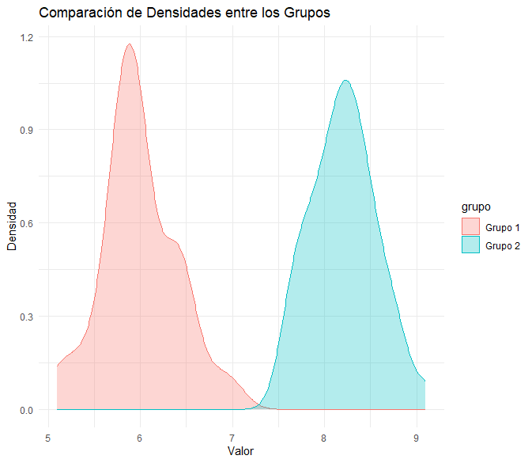
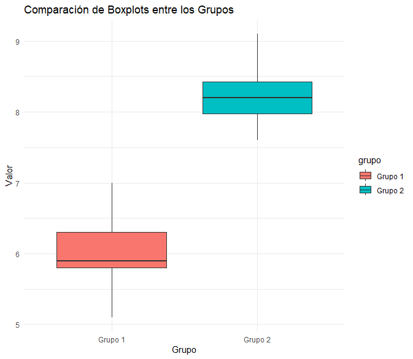
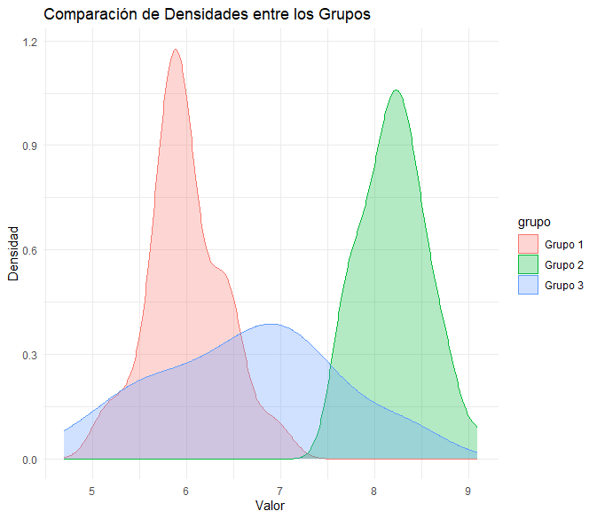
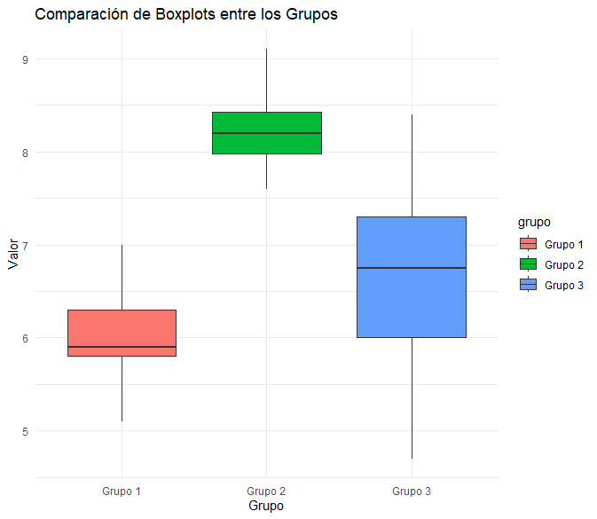
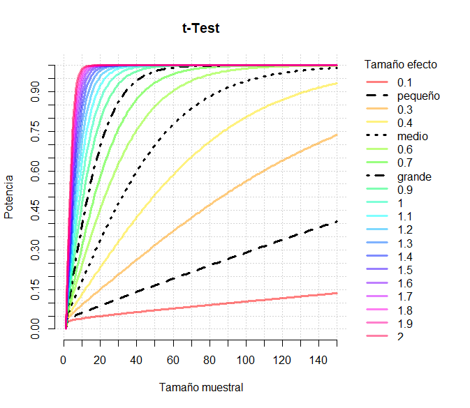
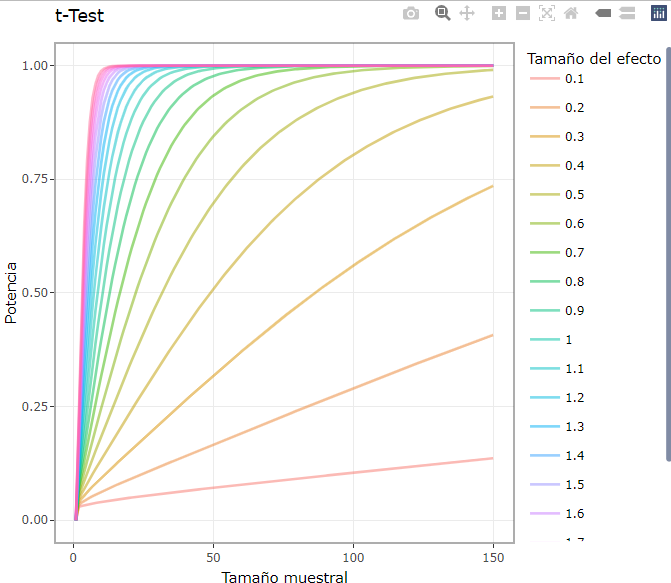

```{r setup, include=FALSE}
knitr::opts_chunk$set(echo = TRUE, message = FALSE, warning = FALSE, comment = NA)

# install.packages('gtools')
# install.packages("TeachingSampling")

#load library
library(gtools)
library(TeachingSampling)
library(readr)
library(paqueteMETODOS)

c1="#FF7F00"
c2="#034A94"
c3="#0EB0C6"
c4="#686868"

data("CarreraLuz22")
data("evaluacion")
CarreraLuz22_c2 = subset(CarreraLuz22, CarreraLuz22$categoria=="2. Abierta")
CarreraLuz22_c3 = subset(CarreraLuz22, CarreraLuz22$categoria=="3. Veteranos A")
```


</br></br>
<h2>Introducción</h2>

En este análisis, se busca evaluar la **eventual diferencia entre dos grupos** y la **correlación entre dos variables**. Para ello, se aplicarán pruebas estadísticas que permitan determinar si:

1. **Dos poblaciones** presentan la **misma media** o la **misma varianza** en una **variable cuantitativa**.

2. **Dos poblaciones** tienen la **misma proporción** en una **categoría de una variable cualitativa**.

3. Existe una **relación significativa lineal** entre **dos variables cuantitativas** mediante el análisis de correlación.


---


</br></br>
<h2>Muestras independientes</h2>


</br></br>
<h3>Prueba de diferencia de medias</h3>

En numerosos estudios estadísticos, es común preguntarse si dos poblaciones presentan diferencias en una característica cuantitativa de interés.  

Por ejemplo, en un estudio clínico, se desea comparar la **presión arterial promedio** en dos grupos de pacientes: uno que recibió un **tratamiento experimental** y otro que recibió un **placebo**. En este caso, la pregunta central es:  **¿Existe una diferencia significativa en la presión arterial media entre ambos grupos?**  

Para responder a esta cuestión, se comparan las **medias de las dos poblaciones independientes** (unidades muestrales diferentes en cada grupo), evaluando si la diferencia observada entre los grupos es suficientemente grande como para descartar que se deba únicamente al azar.  

La comparación de las **medias de dos poblaciones independientes** se realiza mediante la evaluación de sus **estimadores muestrales**. De manera similar a la relación entre la **media muestral** y la **media poblacional**, el **parámetro de interés** en este caso es la **diferencia de medias poblacionales**, representada como:  

\[
\mu_1 - \mu_2
\]

Dado que el valor de los parámetros poblacionales es desconocido, se utiliza la **diferencia de medias muestrales** como **estimador**:

\[
\bar{x}_1 - \bar{x}_2
\]

donde:

- \( \bar{x}_1 \) y \( \bar{x}_2 \) representan las **medias muestrales** de los dos grupos,

- \( \mu_1 \) y \( \mu_2 \) son las **medias poblacionales desconocidas**.


Sea \( \mu_1 \) la media poblacional del **primer grupo** y \( \mu_2 \) la media poblacional del **segundo grupo**, una  hipótesis de interés se puede formular como:

\[
H_0: \mu_1 = \mu_2
\]

\[
H_1: \mu_1 \neq \mu_2
\]

donde:

- \( H_0 \) establece que **no hay diferencia significativa** entre las medias poblacionales.

- \( H_1 \) plantea que **existe una diferencia significativa** entre los dos grupos.


---

</br></br>
<h3>Prueba de cociente de varianzas</h3>

En numerosos estudios estadísticos, es fundamental determinar si dos poblaciones presentan **variabilidad similar** en una característica de interés. 

Por ejemplo, en un estudio sobre el rendimiento académico, un investigador podría querer comparar la **dispersión de calificaciones** en dos universidades diferentes para evaluar si una de ellas presenta una mayor **variabilidad** en el desempeño de los estudiantes. En este caso, la pregunta central es:  **¿Existen diferencias significativas en la variabilidad de las calificaciones entre ambas universidades?**  

Para responder a esta pregunta, se comparan las **varianzas de las dos poblaciones independientes**, evaluando si la diferencia observada en la dispersión de los datos es **estadísticamente significativa**. 


La comparación de las **varianzas de dos poblaciones independientes** se lleva a cabo mediante la evaluación de sus **estimadores muestrales**. De manera similar a la relación entre la **varianza muestral** y la **varianza poblacional**, el **parámetro de interés** en este caso es el **cociente de varianzas poblacionales**, representado como:

$$
\frac{\sigma_1^2}{\sigma_2^2}
$$

Dado que los valores de las varianzas poblacionales son desconocidos, se utiliza el **cociente de varianzas muestrales** como **estimador**:

$$
\frac{S_1^2}{S_2^2}
$$

donde:

- \( S_1^2 \) y \( S_2^2 \) representan las **varianzas muestrales** de los dos grupos,

- \( \sigma_1^2 \) y \( \sigma_2^2 \) son las **varianzas poblacionales desconocidas**.


Sea \( \sigma_1^2 \) la varianza poblacional del **primer grupo** y \( \sigma_2^2 \) la varianza poblacional del **segundo grupo**. La hipótesis de interés podría ser la siguiente:  

\[
H_0: \sigma_1^2 = \sigma_2^2
\]

\[
H_1: \sigma_1^2 \neq \sigma_2^2
\]

donde:

- \( H_0 \) indica que **no hay diferencia significativa** entre las varianzas poblacionales.

- \( H_1 \) plantea que **las varianzas son diferentes**, lo que implica una dispersión desigual en los datos.


---

</br></br>
<h3>Prueba de resta de proporciones</h3>

En diversas investigaciones, surge la necesidad de comparar **proporciones entre dos poblaciones independientes** para determinar si existe una diferencia significativa en la ocurrencia de una característica específica. 

Por ejemplo, en un estudio médico, se busca evaluar si la **tasa de recuperación** de pacientes tratados con un **nuevo medicamento** es mayor que la de aquellos que recibieron un **tratamiento convencional**. La pregunta central es:  **¿Existe una diferencia estadísticamente significativa en la proporción de pacientes recuperados entre ambos tratamientos?** 

Para responder a esta interrogante, se comparan las **proporciones de éxito en las dos poblaciones independientes**, evaluando si la diferencia observada en la muestra es suficientemente grande como para descartar que se deba únicamente al azar.  


La comparación de las **proporciones de dos poblaciones independientes** se lleva a cabo mediante la evaluación de sus **estimadores muestrales**. De manera similar a la relación entre la **proporción muestral** y la **proporción poblacional**, el **parámetro de interés** en este caso es la **diferencia de proporciones poblacionales**, representada como:

$$
 P_1 - P_2
$$

Dado que los valores de las proporciones poblacionales son desconocidos, se utiliza la **diferencia de proporciones muestrales** como **estimador**:

$$
 \hat{P}_1 - \hat{P}_2
$$

donde:

- \( \hat{P}_1 \) y \( \hat{P}_2 \) representan las **proporciones muestrales** de los dos grupos,

- \( P_1 \) y \( P_2 \) son las **proporciones poblacionales desconocidas**.


Sea \( P_1 \) la proporción poblacional de **éxito en el primer grupo** y \( P_2 \) la proporción poblacional de **éxito en el segundo grupo**. La hipótesis de interés se puede formular como:

\[
H_0: P_1 = P_2
\]

\[
H_1: P_1 \neq P_2
\]

donde:

- \( H_0 \) indica que **no hay diferencia significativa** entre las proporciones poblacionales.

- \( H_1 \) plantea que **existe una diferencia significativa** entre los dos grupos.


</br></br>
<h2>Muestras pareadas (dependientes)</h2>

Esta prueba es útil cuando se busca evaluar **diferencias individuales** en sujetos observados en **dos momentos distintos**. Se denomina **prueba para muestras pareadas** porque las diferencias se analizan en **pares o parejas**, es decir, cada unidad de análisis se compara consigo misma en dos instancias temporales.  

A diferencia de las pruebas para muestras independientes, donde se contrastan datos de **dos poblaciones distintas**, aquí el interés radica en evaluar **cambios individuales dentro del mismo grupo**.  

 **Aplicaciones de la prueba pareada**  

**1. Comparaciones antes y después** 

Un uso común de esta prueba ocurre en estudios donde se mide una variable en dos momentos diferentes, como en los diseños experimentales que incluyen:  

- **Evaluaciones pretest y postest** en intervenciones educativas o médicas. 

- **Efectos de un tratamiento** sobre la presión arterial, el rendimiento académico o la condición física. 

- **Estudios longitudinales**, donde los mismos sujetos son observados en distintos periodos de tiempo.  

En estos casos, interesa analizar en qué medida cada individuo **ha cambiado** después de la intervención, en lugar de centrarse en las diferencias entre los sujetos.  

**2. Comparaciones de condiciones diferentes en el mismo individuo**  

- **Evaluaciones de presión arterial** por la mañana y en la tarde en los mismos pacientes.

- **Comparación del desempeño en tareas cognitivas** en entornos con y sin distracción.  


</br></br>
<h3>Prueba de diferencia</h3>

Para analizar la diferencia entre las dos mediciones en la misma unidad de observación, se define la variable \( D \), que representa la diferencia entre los valores de cada par:

\[
D_i = X_{i,1} - X_{i,2}
\]

Las hipótesis se plantean en función de la **media de las diferencias** \( \mu_D \), por ejemplo:

\[
H_0: \mu_D = 0
\]

\[
H_1: \mu_D \neq 0
\]

Donde:

- \( H_0 \) establece que **no hay cambios significativos** entre las mediciones.

- \( H_1 \) sugiere que **existe una diferencia significativa** entre los dos momentos.


La **Tabla 2.21** presenta un resumen de los estimadores, parámetros, test paramétricos y supuestos para realizar comparaciones
cuando se tienen muestras independientes o pareadas.


<br/><br/>
<center>
**Tabla 2.21** Resumen de pruebas de hipótesis para muestras independientes y pareadas.
</center> 

| **Parámetro**              | **Supuestos** | **Hipótesis nula \( H_0 \)** | **Estadístico de prueba y distribución** |
|:--------------------------:|:--------------------------------------:|:--------------------------------------------------:|:--------------------------------------------------------------:|
| **Diferencia de medias \( \mu_1 - \mu_2 \)** | Muestras independientes, poblaciones normales o \( n_1, n_2 \geq 30 \), varianzas \( \sigma_1^2, \sigma_2^2 \) conocidas | \( \mu_1 - \mu_2 = d_0 \) | \( Z = \frac{(\bar{x}_1 - \bar{x}_2) - d_0}{\sqrt{\frac{\sigma_1^2}{n_1} + \frac{\sigma_2^2}{n_2}}} \sim N(0,1) \) |
|                              | Muestras independientes, poblaciones normales, varianzas \( \sigma_1^2 = \sigma_2^2 \) desconocidas | \( \mu_1 - \mu_2 = d_0 \) | \( T = \frac{(\bar{x}_1 - \bar{x}_2) - d_0}{S_p \cdot \sqrt{\frac{1}{n_1} + \frac{1}{n_2}}} \sim t_{(v=n_1+n_2-2)} \), donde \( S_p^2 = \frac{(n_1 - 1) S_1^2 + (n_2 - 1) S_2^2}{n_1 + n_2 - 2} \) |
|                              | Muestras independientes, poblaciones normales, varianzas \( \sigma_1^2 \neq \sigma_2^2 \) desconocidas | \( \mu_1 - \mu_2 = d_0 \) | \( T = \frac{(\bar{x}_1 - \bar{x}_2) - d_0}{\sqrt{\frac{s_1^2}{n_1} + \frac{s_2^2}{n_2}}} \sim t_{(v)} \), donde \( v = \frac{\left( \frac{s_1^2}{n_1} + \frac{s_2^2}{n_2} \right)^2}{\frac{(s_1^2/n_1)^2}{n_1 - 1} + \frac{(s_2^2/n_2)^2}{n_2 - 1}} \) |
| **Diferencia de medias  \( \mu_D \)** | Muestras pareadas, diferencias distribuidas normalmente | \( \mu_D = d_0 \) | \( T = \frac{\bar{d} - d_0}{\frac{s_d}{\sqrt{n}}} \sim t_{(v=n-1)} \), donde \( \bar{d} = \frac{1}{n} \sum_{i=1}^{n} d_i \) y \( d_i = x_{1i} - x_{2i} \) |
| **Diferencia de proporciones \( P_1 - P_2 \)** | \( n_1 p_1 \geq 5 \), \( n_1 (1 - p_1) \geq 5 \), \( n_2 p_2 \geq 5 \), \( n_2 (1 - p_2) \geq 5 \) | \( P_1 - P_2 = p_0 \) | \( Z = \frac{p_1 - p_2}{\sqrt{p(1 - p) \left( \frac{1}{n_1} + \frac{1}{n_2} \right)}} \sim N(0,1) \), donde \( p_1 = \frac{x_1}{n_1} \), \( p_2 = \frac{x_2}{n_2} \), y \( p = \frac{x_1 + x_2}{n_1 + n_2} \) |
| **Cociente de varianzas \( \sigma_1^2 / \sigma_2^2 \)** | Muestras independientes, poblaciones normales | \( \sigma_1^2 = \sigma_2^2 \) | \( F = \frac{s_1^2}{s_2^2} \sim F_{(v_1=n_1-1, v_2=n_2-1)} \) |


</br></br>
<div class="caja-ejemplo">
<h3>Ejemplo:</h3>
<p>

El director de un gimnasio busca determinar si la contratación de un instructor para su programa de reducción de peso resulta efectiva. Para tomar esta decisión, se selecciona un grupo de **16 personas** que asisten regularmente al gimnasio y se les somete a una prueba piloto con un aspirante al cargo.  

A fin de evaluar la eficacia del programa, se registran los **pesos iniciales (antes del programa)** y los **pesos finales (después de un mes de participación)** en la iniciativa. El objetivo es determinar si existe una reducción significativa en el peso de los participantes, lo que permitiría justificar la contratación del instructor.  

Se establece un **nivel de significancia de \( \alpha = 0.10 \)** para realizar la prueba estadística.  

<!-- |     |     |     |     |     |     |     |     |     |     |     |     |     |     |     |     |     | -->
<!-- |:----|----:|----:|----:|----:|----:|----:|----:|----:|----:|----:|----:|----:|----:|----:|----:|----:|      -->
<!-- |Antes  |104.5|89   |84.5 |106  |90   |96   |79   |90   |85   |76.5 |91.5 |82.5 |100.5| 89.5|121.5| 72  | -->
<!-- |Después | 98  |85.5 |85   |103.5|88.5 |95   |79.5 |90   |82   |76   |89.5 |81   | 99.5| 86.5|115.5| 70  | -->


```{r,echo=FALSE}
# Cargar librería si se desea formato HTML enriquecido
library(knitr)

# Primera tabla
tabla1 <- data.frame(
  ` `= c("Antes", "Después"),
  ` `= c(104.5, 98),
  ` `= c(89, 85.5),
  ` `= c(84.5, 85),
  ` `= c(106, 103.5),
  ` `= c(90, 88.5),
  ` `= c(96, 95),
  ` `= c(79, 79.5),
  ` `= c(90, 90) # para evitar duplicados en nombres de columnas
)
colnames(tabla1)<-c("observación","","","","","","","","")
kable(tabla1)

# Segunda tabla
tabla2 <- data.frame(
  ` `= c("Antes", "Después"),
  ` `= c(85, 82),
  ` `= c(76.5, 76),
  ` `= c(91.5, 89.5),
  ` `= c(82.5, 81),
  ` `= c(100.5, 99.5),
  ` `= c(89.5, 86.5),
  ` `= c(121.5, 115.5),
  ` `= c(72, 70)
)

colnames(tabla2)<-c("observación","","","","","","","","")
kable(tabla2)

```

En este análisis se evalúa la eficacia de un **programa de reducción de peso**, implementado en un gimnasio bajo la supervisión de un aspirante a instructor. Se dispone de los pesos de un grupo de **16 participantes**, registrados **antes y después** de un mes de entrenamiento.  

Dado que cada individuo tiene **dos mediciones** (una antes y otra después del programa), este estudio corresponde a un **análisis de diferencias con muestras pareadas**. En este contexto, se busca determinar si el programa ha generado **una reducción significativa en el peso de los participantes**.  

En términos estadísticos, el interés radica en evaluar si la **diferencia promedio entre los pesos antes y después es negativa**, lo que indicaría una reducción efectiva del peso tras la implementación del programa.  
  
Sea \( D_i = \text{peso antes}_i - \text{peso después}_i \) la diferencia en el peso de cada individuo. Definiendo \( \mu_D \) como la **media poblacional de las diferencias**, se establecen las siguientes hipótesis:

\[
H_0: \mu_D \geq 0
\]

\[
H_1: \mu_D < 0
\]


donde: 

- **\( H_0 \)** indica que **no hay reducción significativa en el peso** o que, en promedio, el peso no ha disminuido después del programa.  

- **\( H_1 \)** establece que **el peso promedio después del programa es menor**, lo que sugiere que la intervención ha sido efectiva.  


Para la aplicación de una **prueba t para muestras pareadas**, es necesario verificar que las **diferencias muestrales** (\( D_i \)) siguen una distribución **aproximadamente normal**.  

Para ello, se utiliza la **prueba de normalidad de Shapiro-Wilk**, cuyos resultados son los siguientes:


<pre>
	Shapiro-Wilk normality test

data:  dif
W = 0.32897, p-value = 1.088e-07
</pre>

El \(valor-p\) obtenido es \(1.088 \times 10^{-7}\), lo que, con un nivel de significancia de menos del 1%, permite inferir que las **diferencias no siguen una distribución normal**.

A pesar de que **la normalidad no se cumple**, se realiza la **prueba t para muestras pareadas** bajo el supuesto de normalidad. Los resultados obtenidos son:

<pre>
	Paired t-test

data:  pant and pdes
t = 1.2736, df = 15, p-value = 0.8889
alternative hypothesis: true mean difference is less than 0
95 percent confidence interval:
     -Inf 19.75467
sample estimates:
mean difference 
         8.3125 
</pre>


El **\(valor-p\)** obtenido es 0.8889, lo que indica que **no hay suficiente evidencia para rechazar la hipótesis nula** con una significancia del 5%. Sin embargo, dado que no se cumple el supuesto de normalidad, estos resultados no son confiables, por lo que se requiere aplicar una prueba no paramétrica.

Dado que las **diferencias no siguen una distribución normal**, se emplea la **prueba de rangos con signo de Wilcoxon**, la cual no asume normalidad de las diferencias. En la siguiente sección de describe este test.


Los resultados obtenidos son:

<pre>
Wilcoxon signed rank test with continuity correction

data:  pant and pdes
V = 116, p-value = 0.9993
alternative hypothesis: true location shift is less than 0
</pre>

El **\(valor-p\)** obtenido es 0.9993, lo que indica que, con una significancia del 5%, **no hay suficiente evidencia para rechazar la hipótesis nula**, es decir, que no existe diferencia significativa en la mediana de las diferencias entre ambos grupos.


Los códigos implementados son los siguientes:


<pre>
# Datos de las mediciones
pant <- c(104.5, 89, 84.5, 106, 90, 96, 79, 90, 85, 76.5, 91.5, 82.5, 100.5, 89.5, 121.5, 72)
pdes <- c(98, 85.5, 85, 103.5, 88.5, 95, 79.5, 90, 82, 76, 89.5, 81, 99.5, 86.5, 15.5, 70)

# Calcular las diferencias entre pares
dif <- pant - pdes

# Prueba de normalidad de Shapiro-Wilk sobre las diferencias
shapiro_test <- shapiro.test(dif)
print(shapiro_test)

# Prueba t para muestras pareadas (cola inferior)
t_test <- t.test(pant, pdes, 
                 alternative = "less", 
                 mu = 0, 
                 paired = TRUE, 
                 conf.level = 0.95)
print(t_test)

wilcoxon_test <- wilcox.test(pant, pdes, 
                               alternative = "less", 
                               paired = TRUE, 
                               conf.level = 0.95,
                               exact = FALSE,   # Usa aproximación normal cuando hay empates (ties)
                               correct = TRUE)  # Aplica corrección de continuidad
print(wilcoxon_test)
</pre>


```{r,echo=TRUE}
# Datos de las mediciones
pant <- c(104.5, 89, 84.5, 106, 90, 96, 79, 90, 85, 76.5, 91.5, 82.5, 100.5, 89.5, 121.5, 72)
pdes <- c(98, 85.5, 85, 103.5, 88.5, 95, 79.5, 90, 82, 76, 89.5, 81, 99.5, 86.5, 15.5, 70)

# Calcular las diferencias entre pares
dif <- pant - pdes

# Prueba de normalidad de Shapiro-Wilk sobre las diferencias
shapiro_test <- shapiro.test(dif)
print(shapiro_test)

# Prueba t para muestras pareadas (cola inferior)
t_test <- t.test(pant, pdes, 
                 alternative = "less", 
                 mu = 0, 
                 paired = TRUE, 
                 conf.level = 0.95)
print(t_test)

wilcoxon_test <- wilcox.test(pant, pdes, 
                               alternative = "less", 
                               paired = TRUE, 
                               conf.level = 0.95,
                               exact = FALSE,   # Usa aproximación normal cuando hay empates (ties)
                               correct = TRUE)  # Aplica corrección de continuidad
print(wilcoxon_test)

```


Aunque se aplicó la **prueba t pareada**, su **resultado no es confiable**, ya que el supuesto de normalidad no se cumple.

La **prueba no paramétrica de Wilcoxon** tampoco proporciona evidencia suficiente para afirmar que el programa ha generado una reducción significativa de peso, con una significancia del 5%.

</p>
</div>


</br></br>
<div class="caja-ejemplo">
<h3>Ejemplo:</h3>
<p>

Una empresa implementa un **programa de entrenamiento** con el objetivo de mejorar las habilidades de sus empleados. Para evaluar la efectividad de las metodologías utilizadas, se forman **dos grupos** de empleados, cada uno sometido a un método diferente de capacitación:

- **Grupo 1 (G1)**: Compuesto por **36 empleados**.

- **Grupo 2 (G2)**: Compuesto por **40 empleados**.

El interés principal es determinar si **el método aplicado al segundo grupo (G2) produce mejores resultados que el aplicado al primer grupo (G1)**.  

Sea \( \mu_1 \) la media poblacional del desempeño de los empleados entrenados con el **Método 1**, y \( \mu_2 \) la media poblacional del desempeño de los empleados entrenados con el **Método 2**. Se plantea la siguiente prueba de hipótesis unilateral:  

\[
H_0: \mu_1 \geq \mu_2
\]

\[
H_1: \mu_1 < \mu_2
\]

donde:

- **\( H_0 \)** establece que **no hay evidencia suficiente para afirmar que el método 2 es mejor que el método 1**.

- **\( H_1 \)** plantea que **el desempeño promedio del Grupo 2 es significativamente mayor que el del Grupo 1**, lo que sugiere que el **Método 2 es superior**.

Los datos de ambos grupos corresponden a los índices de desempeño por cada método y son los siguientes:

|        |                                                                                                                   |
|:-------|:------------------------------------------------------------------------------------------------------------------|
|Grupo 1 | 6.8, 6.1, 5.8, 5.9, 5.8, 6.4, 5.7, 6.0, 5.9, 6.4, 6.0, 5.7, 6.5, 6.5, 6.0, 5.9, 5.7, 5.8, 5.9, 5.8, 6.0, 6.0, 5.8, 5.7, 6.1, 5.9, 5.2, 6.3, 5.4, 6.5, 5.5, 5.9, 7.0, 6.4, 5.1, 6.3 |
|Grupo 2 | 8.8, 8.5, 8.4, 8.5, 7.6, 8.7, 8.0, 7.9, 8.2, 8.0, 7.8, 8.6, 8.5, 7.9, 8.5, 8.3, 8.4, 8.2, 8.3, 7.9, 8.2, 7.7, 7.8, 7.7, 8.1, 8.0, 8.3, 8.2, 8.1, 8.3, 8.1, 8.8, 7.7, 9.1, 7.6, 8.4, 8.2, 8.3, 8.1, 8.7  | 

Para evaluar si existen diferencias en la distribución de los índices de desempeño según el método de capacitación aplicado, se generan gráficos de densidad y boxplots que permiten una visualización comparativa entre ambos grupos.

<pre>
# Cargar librerías necesarias
library(ggplot2)
library(dplyr)
library(tidyr)

# Definir los datos
grupo1 <- c(6.8, 6.1, 5.8, 5.9, 5.8, 6.4, 5.7, 6.0, 5.9, 6.4, 6.0, 5.7, 
            6.5, 6.5, 6.0, 5.9, 5.7, 5.8, 5.9, 5.8, 6.0, 6.0, 5.8, 5.7, 
            6.1, 5.9, 5.2, 6.3, 5.4, 6.5, 5.5, 5.9, 7.0, 6.4, 5.1, 6.3)

grupo2 <- c(8.8, 8.5, 8.4, 8.5, 7.6, 8.7, 8.0, 7.9, 8.2, 8.0, 7.8, 8.6, 
            8.5, 7.9, 8.5, 8.3, 8.4, 8.2, 8.3, 7.9, 8.2, 7.7, 7.8, 7.7, 
            8.1, 8.0, 8.3, 8.2, 8.1, 8.3, 8.1, 8.8, 7.7, 9.1, 7.6, 8.4, 
            8.2, 8.3, 8.1, 8.7)

# Crear un data frame en formato largo para facilitar los gráficos
datos <- data.frame(
  valor = c(grupo1, grupo2),
  grupo = c(rep("Grupo 1", length(grupo1)), rep("Grupo 2", length(grupo2)))
)

# Gráfico de densidad comparativo
ggplot(datos, aes(x = valor, fill = grupo, color = grupo)) +
  geom_density(alpha = 0.3) +
  labs(title = "Comparación de Densidades entre los Grupos",
       x = "Valor",
       y = "Densidad") +
  theme_minimal()

# Gráfico de boxplot comparativo
ggplot(datos, aes(x = grupo, y = valor, fill = grupo)) +
  geom_boxplot() +
  labs(title = "Comparación de Boxplots entre los Grupos",
       x = "Grupo",
       y = "Valor") +
  theme_minimal()

# Prueba de normalidad de Shapiro-Wilk para cada grupo
shapiro_test_grupo1 <- shapiro.test(grupo1)
shapiro_test_grupo2 <- shapiro.test(grupo2)

# Mostrar resultados de la prueba de normalidad
print("Prueba de normalidad de Shapiro-Wilk para Grupo 1:")
print(shapiro_test_grupo1)

print("Prueba de normalidad de Shapiro-Wilk para Grupo 2:")
print(shapiro_test_grupo2)
</pre>

```{r,echo=TRUE}
# Cargar librerías necesarias
library(ggplot2)
library(dplyr)
library(tidyr)

# Definir los datos
grupo1 <- c(6.8, 6.1, 5.8, 5.9, 5.8, 6.4, 5.7, 6.0, 5.9, 6.4, 6.0, 5.7, 
            6.5, 6.5, 6.0, 5.9, 5.7, 5.8, 5.9, 5.8, 6.0, 6.0, 5.8, 5.7, 
            6.1, 5.9, 5.2, 6.3, 5.4, 6.5, 5.5, 5.9, 7.0, 6.4, 5.1, 6.3)

grupo2 <- c(8.8, 8.5, 8.4, 8.5, 7.6, 8.7, 8.0, 7.9, 8.2, 8.0, 7.8, 8.6, 
            8.5, 7.9, 8.5, 8.3, 8.4, 8.2, 8.3, 7.9, 8.2, 7.7, 7.8, 7.7, 
            8.1, 8.0, 8.3, 8.2, 8.1, 8.3, 8.1, 8.8, 7.7, 9.1, 7.6, 8.4, 
            8.2, 8.3, 8.1, 8.7)

# Crear un data frame en formato largo para facilitar los gráficos
datos <- data.frame(
  valor = c(grupo1, grupo2),
  grupo = c(rep("Grupo 1", length(grupo1)), rep("Grupo 2", length(grupo2)))
)

# Gráfico de densidad comparativo
plot1<-ggplot(datos, aes(x = valor, fill = grupo, color = grupo)) +
  geom_density(alpha = 0.3) +
  labs(title = "Comparación de Densidades entre los Grupos",
       x = "Valor",
       y = "Densidad") +
  theme_minimal()

# Gráfico de boxplot comparativo
plot2<-ggplot(datos, aes(x = grupo, y = valor, fill = grupo)) +
  geom_boxplot() +
  labs(title = "Comparación de Boxplots entre los Grupos",
       x = "Grupo",
       y = "Valor") +
  theme_minimal()

# Prueba de normalidad de Shapiro-Wilk para cada grupo
shapiro_test_grupo1 <- shapiro.test(grupo1)
shapiro_test_grupo2 <- shapiro.test(grupo2)

# Mostrar resultados de la prueba de normalidad
print("Prueba de normalidad de Shapiro-Wilk para Grupo 1:")
print(shapiro_test_grupo1)

print("Prueba de normalidad de Shapiro-Wilk para Grupo 2:")
print(shapiro_test_grupo2)
```


Para evaluar la adecuación del uso de pruebas paramétricas en la comparación de los índices de desempeño entre los métodos de capacitación, se realizó la **prueba de normalidad de Shapiro-Wilk** en ambas muestras.


\[
H_0: \text{Los índices  del método siguen una distribución normal}
\]

\[
H_1: \text{Los índices  del método  no siguen una distribución normal}
\]

El nivel de significancia utilizado para la prueba es **\(\alpha = 0.05\)**.  Los valores obtenidos para cada grupo son:

- **Grupo 1**: \(valor-p = 0.3018 \)

- **Grupo 2**: \(valor-p= 0.6424 \)

Dado que en ambos casos los \(valores-p\) son mayores al nivel de significancia de 0.05, no se encuentra evidencia suficiente para rechazar la hipótesis nula de normalidad de los índices de cada método. En consecuencia, se asume que las muestras provienen de distribuciones normales, lo que permite la aplicación de pruebas paramétricas para la comparación de los métodos de capacitación.

<pre>
	Shapiro-Wilk normality test

data:  grupo1
W = 0.96485, p-value = 0.3018
</pre>


<pre>
	Shapiro-Wilk normality test

data:  grupo2
W = 0.97873, p-value = 0.6424
</pre>

La **Figura 2.70** presenta las curvas de densidad de los índices por método. Las distribuciones son aproximadamente simétricas, lo que respalda la normalidad observada en el test de Shapiro-Wilk. También refleja  que la media del grupo 2 es mayor que la media del grupo 1.

La **Figura 2.71** presenta los diagramas de caja de los índices de desempeño por cada método de capacitación. Se observa que las varianzas parecen similares entre los dos grupos, lo que sugiere que el supuesto de igualdad de varianzas podría cumplirse. No obstante, se debe verificar usando un test de hipótesis. Asimismo, se evidencia una diferencia en las medias de los índices de desempeño entre los grupos, lo que podría indicar que el método de capacitación aplicado en el Grupo 2 produce mejores resultados en comparación con el Grupo 1.


<br/><br/>
<center>
```{r, echo=FALSE, out.width="80%", fig.align = "center"}

```
**Figura 2.70** Comparación de la distribución de los índices por método.
</center>
<br/><br/>


<br/><br/>
<center>
```{r, echo=FALSE, out.width="80%", fig.align = "center"}

```
**Figura 2.71** Comparación de la distribución de los índices por método.
</center>
<br/><br/>


Antes de aplicar una prueba de hipótesis para comparar las **medias poblacionales** de los dos métodos de capacitación, es necesario determinar si las **varianzas poblacionales** pueden asumirse como **iguales o diferentes**. Esta información es fundamental para seleccionar la prueba estadística más adecuada.

Para evaluar si las varianzas poblacionales son **iguales o distintas**, se plantea la siguiente prueba de hipótesis:

\[
H_0: \sigma^{2}_{1} = \sigma^{2}_{2}
\]

\[
H_1: \sigma^{2}_{1} \neq \sigma^{2}_{2}
\]

donde:

- \( H_0 \) plantea que las **varianzas poblacionales son iguales** y, por lo tanto, se puede aplicar una **prueba t de Student** con varianzas iguales.

- \( H_1 \) indica que las **varianzas son diferentes**, en cuyo caso se recomienda emplear la **prueba t de Welch**, que no asume igualdad de varianzas.

Para contrastar esta hipótesis, se utiliza el **test de Fisher (prueba F para igualdad de varianzas)**, implementado en **R** mediante la función `var.test()`. Los resultados obtenidos son los siguientes:


<pre>
data:  grupo1 and grupo2
F = 1.2975, num df = 35, denom df = 39, p-value = 0.4282
alternative hypothesis: true ratio of variances is not equal to 1
95 percent confidence interval:
    0.6776032 2.5137013
sample estimates:
    ratio of variances 
1.297479 
</pre>


La **prueba de Fisher (prueba F para igualdad de varianzas)** ha arrojado un \(valor-p\) de 0.4282. Dado que este valor es **mayor** al nivel de significación predefinido (\(\alpha = 0.05\)), **no se rechaza la hipótesis nula**. Esto sugiere que **no existe evidencia suficiente** en la muestra para concluir que las varianzas poblacionales sean **diferentes**. 

Por lo tanto, se asume que las varianzas son **iguales**, lo que permite utilizar la **prueba t de Student para muestras independientes** bajo esta suposición.

Dado que el interés es evaluar si la media del **grupo 1** es **menor** que la media del **grupo 2**, se establece la siguiente prueba de hipótesis:

\[
H_0: \mu_{1} \geq \mu_{2}
\]

\[
H_1: \mu_{1} < \mu_{2}
\]

donde:

- **\( H_0 \)** establece que la **media del grupo 1 es mayor o igual** a la del grupo 2.

- **\( H_1 \)** plantea que la **media del grupo 1 es menor** que la del grupo 2, lo que indicaría que el segundo método de capacitación genera mejores resultados.

A continuación, se presentan los códigos utilizados para aplicar los test estadísticos en **R**:

<pre>
# Test de Fisher 
var.test(grupo1,grupo2)


# Prueba de diferencia de medias con t-test de Student
t.test(grupo1, grupo2,
alternative ="less",
mu = 0, 
paired = FALSE, 
var.equal = TRUE,
conf.level = 0.95)
</pre>


```{r,echo=TRUE}
# Test de Fisher 
var.test(grupo1,grupo2)


# Prueba de diferencia de medias con t-test de Student
t.test(grupo1, grupo2,
alternative ="less",
mu = 0, 
paired = FALSE, 
var.equal = TRUE,
conf.level = 0.95)
```

El resultado de implementar el **t-test de Student** es como se muestra:

<pre>
data:  grupo1 and grupo2
t = -25.413, df = 74, p-value < 2.2e-16
alternative hypothesis: true difference in means is less than 0
95 percent confidence interval:
      -Inf -2.072933
sample estimates:
mean of x mean of y 
 5.991667  8.210000 
</pre>

Dado que el \(valor-p\) es menor que \(2.2 \times 10^{-16}\), el cual es significativamente inferior al nivel de significancia de menos del 1%, se rechaza la hipótesis nula. Esto indica que existe evidencia estadísticamente significativa para concluir que la media del grupo 1 es menor que la media del grupo 2. 

</p>
</div>


</br></br>
<div class="caja-ejemplo">
<h3>Ejemplo:</h3>
<p>

 
La empresa del **Ejemplo anterior** ha determinado que el **método de capacitación del Grupo 2** produce mejores resultados en comparación con el **Grupo 1**. Sin embargo, con el fin de realizar una **valoración adicional** y obtener una **visión más general de los métodos empleados**, se ha decidido comparar los resultados del **Grupo 2** con un **tercer grupo externo**, denominado **Grupo 3**.

El objetivo es evaluar si el desempeño del **Grupo 2** sigue siendo significativamente superior en comparación con el **Grupo 3**. Para ello, se aplicará una **prueba de hipótesis sobre la diferencia de medias** entre estos dos grupos.

Dado que el interés radica en evaluar si la **media del Grupo 2** es **mayor que la media del Grupo 3**, se establece una **prueba de hipótesis unilateral derecha**:

\[
H_0: \mu_2 \leq \mu_3
\]

\[
H_1: \mu_2 > \mu_3
\]

donde:

- **\( H_0 \)**: La media del **Grupo 2** es menor o igual a la del **Grupo 3**.

- **\( H_1 \)**: La media del **Grupo 2** es mayor que la del **Grupo 3**, lo que indicaría que el método aplicado al **Grupo 2** sigue siendo superior.

Para evaluar si existen diferencias en la distribución de los índices de desempeño según el método de capacitación aplicado, se generan gráficos de densidad y boxplots que permiten una visualización comparativa entre ambos grupos:

<pre>
# Cargar librerías necesarias
library(ggplot2)
library(dplyr)
library(tidyr)

# Definir los datos
grupo1 <- c(6.8, 6.1, 5.8, 5.9, 5.8, 6.4, 5.7, 6.0, 5.9, 6.4, 6.0, 5.7, 
            6.5, 6.5, 6.0, 5.9, 5.7, 5.8, 5.9, 5.8, 6.0, 6.0, 5.8, 5.7, 
            6.1, 5.9, 5.2, 6.3, 5.4, 6.5, 5.5, 5.9, 7.0, 6.4, 5.1, 6.3)

grupo2 <- c(8.8, 8.5, 8.4, 8.5, 7.6, 8.7, 8.0, 7.9, 8.2, 8.0, 7.8, 8.6, 
            8.5, 7.9, 8.5, 8.3, 8.4, 8.2, 8.3, 7.9, 8.2, 7.7, 7.8, 7.7, 
            8.1, 8.0, 8.3, 8.2, 8.1, 8.3, 8.1, 8.8, 7.7, 9.1, 7.6, 8.4, 
            8.2, 8.3, 8.1, 8.7)

grupo3 <- c(8.4, 7.5, 6.9, 6.6, 7.0, 5.5, 5.5, 7.9, 6.9, 7.3, 4.7, 5.5, 
            6.7, 8.3, 6.0, 6.3, 5.5, 8.4, 7.1, 5.3, 6.9, 5.5, 7.2, 6.5, 
            6.1, 7.8, 7.4, 6.6, 6.8, 6.0, 6.9, 7.4, 4.9, 6.2, 7.3, 6.2)

# Crear un data frame en formato largo para facilitar los gráficos
datos <- data.frame(
  valor = c(grupo1, grupo2, grupo3),
  grupo = c(rep("Grupo 1", length(grupo1)), 
            rep("Grupo 2", length(grupo2)), 
            rep("Grupo 3", length(grupo3)))
)

# Gráfico de densidad comparativo
plot1 <- ggplot(datos, aes(x = valor, fill = grupo, color = grupo)) +
  geom_density(alpha = 0.3) +
  labs(title = "Comparación de Densidades entre los Grupos",
       x = "Valor",
       y = "Densidad") +
  theme_minimal()

# Gráfico de boxplot comparativo
plot2 <- ggplot(datos, aes(x = grupo, y = valor, fill = grupo)) +
  geom_boxplot() +
  labs(title = "Comparación de Boxplots entre los Grupos",
       x = "Grupo",
       y = "Valor") +
  theme_minimal()

# Prueba de normalidad de Shapiro-Wilk para cada grupo
shapiro_test_grupo1 <- shapiro.test(grupo1)
shapiro_test_grupo2 <- shapiro.test(grupo2)
shapiro_test_grupo3 <- shapiro.test(grupo3)

# Mostrar resultados de la prueba de normalidad
print("Prueba de normalidad de Shapiro-Wilk para Grupo 1:")
print(shapiro_test_grupo1)

print("Prueba de normalidad de Shapiro-Wilk para Grupo 2:")
print(shapiro_test_grupo2)

print("Prueba de normalidad de Shapiro-Wilk para Grupo 3:")
print(shapiro_test_grupo3)

# Imprimir los gráficos
print(plot1)
print(plot2)
</pre>

```{r,echo=TRUE}
# Cargar librerías necesarias
library(ggplot2)
library(dplyr)
library(tidyr)

# Definir los datos
grupo1 <- c(6.8, 6.1, 5.8, 5.9, 5.8, 6.4, 5.7, 6.0, 5.9, 6.4, 6.0, 5.7, 
            6.5, 6.5, 6.0, 5.9, 5.7, 5.8, 5.9, 5.8, 6.0, 6.0, 5.8, 5.7, 
            6.1, 5.9, 5.2, 6.3, 5.4, 6.5, 5.5, 5.9, 7.0, 6.4, 5.1, 6.3)

grupo2 <- c(8.8, 8.5, 8.4, 8.5, 7.6, 8.7, 8.0, 7.9, 8.2, 8.0, 7.8, 8.6, 
            8.5, 7.9, 8.5, 8.3, 8.4, 8.2, 8.3, 7.9, 8.2, 7.7, 7.8, 7.7, 
            8.1, 8.0, 8.3, 8.2, 8.1, 8.3, 8.1, 8.8, 7.7, 9.1, 7.6, 8.4, 
            8.2, 8.3, 8.1, 8.7)

grupo3 <- c(8.4, 7.5, 6.9, 6.6, 7.0, 5.5, 5.5, 7.9, 6.9, 7.3, 4.7, 5.5, 
            6.7, 8.3, 6.0, 6.3, 5.5, 8.4, 7.1, 5.3, 6.9, 5.5, 7.2, 6.5, 
            6.1, 7.8, 7.4, 6.6, 6.8, 6.0, 6.9, 7.4, 4.9, 6.2, 7.3, 6.2)

# Crear un data frame en formato largo para facilitar los gráficos
datos <- data.frame(
  valor = c(grupo1, grupo2, grupo3),
  grupo = c(rep("Grupo 1", length(grupo1)), 
            rep("Grupo 2", length(grupo2)), 
            rep("Grupo 3", length(grupo3)))
)

# Gráfico de densidad comparativo
plot1 <- ggplot(datos, aes(x = valor, fill = grupo, color = grupo)) +
  geom_density(alpha = 0.3) +
  labs(title = "Comparación de Densidades entre los Grupos",
       x = "Valor",
       y = "Densidad") +
  theme_minimal()

# Gráfico de boxplot comparativo
plot2 <- ggplot(datos, aes(x = grupo, y = valor, fill = grupo)) +
  geom_boxplot() +
  labs(title = "Comparación de Boxplots entre los Grupos",
       x = "Grupo",
       y = "Valor") +
  theme_minimal()

# Prueba de normalidad de Shapiro-Wilk para cada grupo
shapiro_test_grupo1 <- shapiro.test(grupo1)
shapiro_test_grupo2 <- shapiro.test(grupo2)
shapiro_test_grupo3 <- shapiro.test(grupo3)

# Mostrar resultados de la prueba de normalidad
print("Prueba de normalidad de Shapiro-Wilk para Grupo 1:")
print(shapiro_test_grupo1)

print("Prueba de normalidad de Shapiro-Wilk para Grupo 2:")
print(shapiro_test_grupo2)

print("Prueba de normalidad de Shapiro-Wilk para Grupo 3:")
print(shapiro_test_grupo3)

# Imprimir los gráficos
#print(plot1)
#print(plot2)
```

Dado el resultado del test de normalidad de Shapiro-Wilk para los índices de desempeño del método 3: \(valor-p\) = 0.5961. El \(valor-p=0.5961\) es mayor que 0.05, por lo que no se rechaza la hipótesis nula de normalidad. No hay evidencia suficiente para afirmar que los índices de desempeño del método 3 no siguen una distribución normal con una significancia del 5%.

La **Figura 2.72** presenta la curva de densidad de los índices obtenidos mediante el método 3. Se observa que la distribución de los valores es aproximadamente simétrica, lo que respalda los resultados obtenidos en la prueba de normalidad de Shapiro-Wilk. Esta evidencia sugiere que los índices de desempeño del método 3 pueden ser modelados adecuadamente mediante una distribución normal, permitiendo el uso de pruebas paramétricas para el análisis estadístico.

<pre>
	Shapiro-Wilk normality test

data:  grupo3
W = 0.97559, p-value = 0.5961
</pre>


<br/><br/>
<center>
```{r, echo=FALSE, out.width="80%", fig.align = "center"}

```
**Figura 2.72** Comparación de distribuciones de desempeño de los  Grupo 2 y Grupo 3.
</center>
<br/><br/>


La **Figura 2.73** permite visualizar la comparación entre los índices obtenidos en los tres métodos de capacitación. Se observa que aproximadamente el 23% de los valores superiores del método 3 coinciden con el 75% de los valores inferiores del método 2. Esto sugiere que, si bien el método 2 presenta en general valores más altos, existe una superposición parcial con el método 3, lo que indica que algunos participantes del tercer grupo alcanzaron niveles de desempeño comparables a los del segundo grupo. 


<br/><br/>
<center>
```{r, echo=FALSE, out.width="80%", fig.align = "center"}

```
**Figura 2.73** Comparación de distribuciones de desempeño de los  Grupo 2 y Grupo 3.
</center>
<br/><br/>

Antes de comparar las medias, es necesario determinar si las varianzas poblacionales de ambos grupos pueden considerarse iguales o diferentes. Se utiliza el test de Fisher (prueba F para igualdad de varianzas), obteniendo los siguientes resultados: El \(valor-p\) obtenido es \(1.33 \times 10^{-8}\), que es menor que el nivel de significancia 0.05. Por lo tanto, se rechaza la hipótesis nula, lo que indica que las varianzas poblacionales de los índices de los métodos 2 y 3 son significativamente diferentes. Dado que las varianzas poblacionales no son iguales, se emplea la prueba t de Welch, que no asume igualdad de varianzas.

<pre>
# Test de Fisher 
var.test(grupo3,grupo2)

# Prueba de diferencia de medias con t-test de Student
t.test(grupo3, grupo2,
alternative ="less",
mu = 0, 
paired = FALSE, 
var.equal = FALSE,
conf.level = 0.95)
</pre>


```{r,echo=TRUE}
# Test de Fisher 
var.test(grupo3,grupo2)

# Prueba de diferencia de medias con t-test de Student
t.test(grupo3, grupo2,
alternative ="less",
mu = 0, 
paired = FALSE, 
var.equal = FALSE,
conf.level = 0.95)
```


Por tanto, para evaluar si los índices de desempeño en los métodos de capacitación aplicados a los grupos 3 y 2 presentan diferencias significativas, se realizan dos pruebas estadísticas: Prueba de igualdad de varianzas mediante el test de Fisher (prueba F) y Prueba de diferencia de medias mediante el t-test de Welch para muestras independientes con varianzas diferentes.


<pre>
F test to compare two variances

data:  grupo3 and grupo2
F = 7.2974, num df = 35, denom df = 39, p-value = 1.334e-08
alternative hypothesis: true ratio of variances is not equal to 1
95 percent confidence interval:
  3.811031 14.137763
sample estimates:
ratio of variances 
          7.297388 
</pre>


Respecto al test de medias, el \(valor-p\) obtenido es \(3.781 \times 10^{-12}\), que es menor que 0.01. Por lo tanto, se rechaza la hipótesis nula y se acepta la hipótesis alternativa, lo que indica que la media de los índices del grupo 2 es significativamente mayor que la del grupo 3 con una significancia menor al 1%.


<pre>
Welch Two Sample t-test

data:  grupo3 and grupo2
t = -9.2548, df = 43.571, p-value = 3.781e-12
alternative hypothesis: true difference in means is less than 0
95 percent confidence interval:
      -Inf -1.285811
sample estimates:
mean of x mean of y 
 6.638889  8.210000 
</pre>


</p>
</div>


</br></br>
<div class="caja-ejemplo">
<h3>Ejemplo:</h3>
<p>

El presente análisis tiene como objetivo evaluar si la **campaña publicitaria** implementada por la empresa logró **incrementar el conocimiento** de los usuarios sobre el beneficio de acumulación de millas de viajero al utilizar la tarjeta de crédito. Para ello, se comparan los resultados de dos encuestas independientes, realizadas antes y después de la campaña.

**Datos de la encuesta**:

Se dispone de la siguiente información:

- **Encuesta 1 (Antes de la campaña):** 

  - Tamaño muestral: \( n_1 = 100 \)
  
  - Usuarios que conocían el beneficio: \( x_1 = 57 \)
  
  - Proporción muestral: \( \hat{p}_1 = \frac{x_1}{n_1} = 0.57 \)

- **Encuesta 2 (Después de la campaña):** 

  - Tamaño muestral: \( n_2 = 150 \)
  
  - Usuarios que conocían el beneficio: \( x_2 = 87 \)
  
  - Proporción muestral: \( \hat{p}_2 = \frac{x_2}{n_2} = 0.58 \)

Para determinar si el conocimiento del beneficio aumentó después de la campaña, se plantea la siguiente prueba de hipótesis:

\[
H_0: P_1 \geq P_2
\]

\[
H_1: P_1 < P_2
\]

donde:

- **\( H_0 \)**: La proporción de usuarios que conocen el beneficio antes de la campaña es mayor o igual a la proporción después de la campaña, lo que sugiere que la campaña no tuvo un impacto positivo.

- **\( H_1 \)**: La proporción de usuarios que conocen el beneficio **es mayor después de la campaña**, lo que indicaría que la estrategia publicitaria fue efectiva.

El siguiente código implementa el **test de proporciones para muestras independientes**, empleando la función `prop.test()` en **R**:

<pre>
prop.test(c(57,87),c(100,150),
p = NULL,
alternative = "less",
conf.level = 0.95)
</pre>


```{r,echo=TRUE}
prop.test(c(57,87),c(100,150),
p = NULL,
alternative = "less",
conf.level = 0.95)
```

El \(valor-p\) obtenido es 0.4896, lo que implica que no se rechaza la hipótesis nula con una significancia del 5%.  Por tanto, no existe evidencia estadística suficiente para concluir que la proporción de usuarios que conocen el beneficio después de la campaña es mayor que la proporción antes de la campaña. Esto sugiere, que con una significancia del 5% que la campaña publicitaria no tuvo un impacto significativo en el conocimiento del beneficio de acumulación de millas.


<pre>

	2-sample test for equality of proportions with continuity correction

data:  c(57, 87) out of c(100, 150)
X-squared = 0.00068243, df = 1, p-value = 0.4896
alternative hypothesis: less
95 percent confidence interval:
 -1.0000000  0.1033338
sample estimates:
prop 1 prop 2 
  0.57   0.58 
</pre>


</p>
</div>


</br></br>
<h2>Relaciones entre la potencia, el tamaño de los efectos y el tamaño de la muestra</h2>

Al realizar una **prueba t de Student** para la comparación de **medias entre dos grupos independientes**, es fundamental analizar el impacto que tienen tanto **el tamaño del efecto** como el **tamaño muestral** en la **potencia estadística** de la prueba.  

Sin embargo, cuando los tamaños de los grupos **son muy desbalanceados**, la potencia puede **verse afectada negativamente**, incluso cuando el tamaño del efecto es considerablemente grande. Desequilibrios extremos en el tamaño de los grupos pueden **reducir la precisión** de la estimación y, en consecuencia, **disminuir la capacidad de la prueba para detectar diferencias reales**.

La **potencia de una prueba estadística** se define formalmente como la **probabilidad de rechazar la hipótesis nula cuando la hipótesis alternativa es verdadera**. Es decir, mide la **capacidad de la prueba** para detectar una diferencia real entre los grupos cuando esta realmente existe.

De manera práctica, si una prueba estadística **tiene baja potencia**, existe un **riesgo elevado** de cometer un **error de tipo II**, es decir, de **no detectar una diferencia significativa** cuando en realidad la diferencia existe en la población.

Existen dos factores principales que afectan la **potencia de la prueba**:

1. **El tamaño del efecto \(\left(d\right)\)**: Cuanto **mayor** es la diferencia entre las medias poblacionales en relación con la variabilidad de los datos, **mayor será la potencia** de la prueba.

2. **El tamaño muestral (\( n \))**: Con **tamaños muestrales más grandes**, la variabilidad en la estimación de las medias disminuye, lo que incrementa la potencia de la prueba.


A continuación, se presentan **simulaciones** que muestran cómo el **tamaño muestral** y el **tamaño del efecto** afectan la **potencia de la prueba t de Student**. Se emplea la función `power.t.test()` en **R** para calcular la potencia bajo diferentes escenarios.

Los tamaños de muestra se asumen iguales en ambos grupos, ya que el argumento `n` en `power.t.test()` se refiere al tamaño de muestra por grupo en una **prueba t de dos muestras independientes**. En `type="two.sample"`, la función asume por defecto que ambos grupos tienen el mismo tamaño de muestra.


Si deseas especificar tamaños de muestra diferentes para cada grupo, debes usar `power.t.test()` de otra forma, o bien emplear `pwr.t2n.test()` de la librería `pwr`.


</br></br>
<div class="caja-ejemplo">
<h3>Ejemplo:</h3>
<p>

**Variando los tamaños de los efectos: **

En el análisis de potencia estadística, se busca modelar la relación entre el **tamaño muestral** y la **potencia de la prueba**, manteniendo **constante el nivel de significancia** (\(\alpha = 0.05\)). Este análisis permite evaluar cómo la cantidad de datos recopilados influye en la capacidad de la prueba para detectar efectos reales en la población.  

A continuación, se presentan los resultados de la simulación para distintos tamaños del **efecto de Cohen 
\(\left(d\right)\)**, los cuales se categorizan de la siguiente manera:  

- **Muy pequeño:** \( d = 0.1 \) 

- **Pequeño:** \( d = 0.2 \)  

- **Mediano:** \( d = 0.5 \)  

- **Grande:** \( d = 0.8 \)  

Las figuras siguientes ilustran la relación entre el tamaño de la muestra y la potencia estadística para cada uno de estos escenarios, permitiendo visualizar cómo el incremento en el tamaño muestral **aumenta la probabilidad de detectar diferencias significativas** cuando realmente existen.  

La función `power.t.test`  se usa para calcular la potencia estadística, el tamaño de la muestra, el nivel de significancia o el tamaño del efecto en una prueba t. En este caso, el código está configurado para una prueba t para **dos muestras independientes** (´type="two.sample"´).

<pre>
#Sys.setlocale("LC_ALL", "es_ES.UTF-8")

#Se necesita el paquete pwr 
if(!require(pwr)){install.packages("pwr");library("pwr")}

# t-TEST
# Se aplicará power.t.test del paquete stats (ya en R). Calcula la potencia de la prueba t de una o dos muestras, o determina los parámetros para obtener un valor particular de la potencia.

d<-seq(.1,2,by=.1) # 20 tamaños de los efectos
n<-1:150 # Tamaños muestrales

t.test.power.effect <-as.data.frame(do.call("cbind",lapply(1:length(d),function(i)
  {
        sapply(1:length(n),function(j)
        {
            power.t.test(n=n[j],d=d[i],sig.level=0.05,power=NULL,type= "two.sample")$power
        })
    })))

# Si algunas potencias no se pueden calcular, se ajustan a cero:
t.test.power.effect[is.na(t.test.power.effect)] <- 0 
colnames(t.test.power.effect)<-paste (d,"effect size")

#Graficando los resultados

prueba <-t.test.power.effect #data frame de 150 X 20 (para graficar)
cuts_num<-c(2,5,8) # cortes

#Cortes basados en: Cohen, J. (1988). Statistical Power Analysis for the Behavioral Sciences (2nd ed.). Hillsdale, NJ: Lawrence Erlbaum Associates, Publishers.
cuts_cat<-c("pequeño","medio","grande") 

columnas <- 1:ncol(prueba) #Lista de los valores 1:20
color_linea<-rainbow(length(columnas), alpha=.5) # Lista de 20 colores
grosor_linea=3 # Grosor de la línea

#Para el tipo de línea: (“blank”, “solid”, “dashed”, “dotted”, “dotdash”, “longdash”, “twodash”) ó  (0, 1, 2, 3, 4, 5, 6). 
#Note que lty = “solid” is idéntica a lty=1.

tipo_linea <- rep(1,length(color_linea))        #Repetir length(color)=20 veces el 1
tipo_linea[cuts_num]<-c(2:(length(cuts_num)+1)) #Asignar 2, 3, 4 en las posiciones 2, 5, 8 de tipo_linea

#Resaltar posiciones importantes
cuts_num<-c(2,5,8) # Cortes

#Cortes basados en: Cohen, J. (1988). Statistical Power Analysis for the Behavioral Sciences (2nd ed.). Hillsdale, NJ: Lawrence Erlbaum Associates, Publishers.
cuts_cat<-c("pequeño","medio","grande") 
color_linea[cuts_num]<-c("black")

efecto <- d # Listado de los 20 valores de 20
efecto[cuts_num] <- cuts_cat  #Reemplazar en "efecto" las posiciones cuts_num (2, 5, 8) por las categorías de cuts_cat

par(fig=c(0,.8,0,1),new=TRUE)

#Gráfica
plot(1, type="n", #no produce puntos ni líneas
     frame.plot=FALSE, 
     xlab="Tamaño muestral", ylab="Potencia", 
     xlim=c(1,150),  ylim=c(0,1), 
     main="t-Test", axes = FALSE)

#Editando los ejes, grid, etc.
abline(v=seq(0,150,by=10), col = "lightgray", lty = "dotted") # Grid vertical
abline(h=seq(0,1,by=.05), col = "lightgray", lty = "dotted")  # Grid horizontal
axis(1,seq(0,150,by=10)) # Números en eje X
axis(2,seq(0,1,by=.05))  # Números en eje Y

#Plot de las lineas 
#columnas <- 1:ncol(prueba) # lista de los valores 1:20
for(i in 1:length(columnas)) #length(columnas)=20
  {
  lines(1:150,
        #prueba (data frame de 150 X 20, para graficar)
        #columna <- 1:ncol(prueba) listado de valores 1:20 
        prueba[,columnas[i]], #filtrar "prueba" para valor de columna
        col=color_linea[i],   #color_linea[cuts_num]<-c("black")
        lwd=grosor_linea,     #grosor de cada linea
        lty=tipo_linea[i]     #tipo_linea[cuts_num]<-c(2:(length(cuts_num)+1))
       )
  }

#Leyendas
par(fig=c(.65,1,0,1),new=TRUE)
plot.new()
legend("top",legend=efecto, col=color_linea, lwd=3, lty=tipo_linea, title="Tamaño efecto", 
        bty="n" #Opciones: o (complete box), n (no box), 7, L, C, U
      )
</pre>


```{r,echo=TRUE,include=FALSE}
#Sys.setlocale("LC_ALL", "es_ES.UTF-8")

#Se necesita el paquete pwr 
if(!require(pwr)){install.packages("pwr");library("pwr")}

# t-TEST
# Se aplicará power.t.test del paquete stats (ya en R). Calcula la potencia de la prueba t de una o dos muestras, o determina los parámetros para obtener un valor particular de la potencia.

d<-seq(.1,2,by=.1) # 20 tamaños de los efectos
n<-1:150 # Tamaños muestrales

t.test.power.effect <-as.data.frame(do.call("cbind",lapply(1:length(d),function(i)
  {
        sapply(1:length(n),function(j)
        {
            power.t.test(n=n[j],d=d[i],sig.level=0.05,power=NULL,type= "two.sample")$power
        })
    })))

# Si algunas potencias no se pueden calcular, se ajustan a cero:
t.test.power.effect[is.na(t.test.power.effect)] <- 0 
colnames(t.test.power.effect)<-paste (d,"effect size")

#Graficando los resultados

prueba <-t.test.power.effect #data frame de 150 X 20 (para graficar)
cuts_num<-c(2,5,8) # cortes

#Cortes basados en: Cohen, J. (1988). Statistical Power Analysis for the Behavioral Sciences (2nd ed.). Hillsdale, NJ: Lawrence Erlbaum Associates, Publishers.
cuts_cat<-c("pequeño","medio","grande") 

columnas <- 1:ncol(prueba) #Lista de los valores 1:20
color_linea<-rainbow(length(columnas), alpha=.5) # Lista de 20 colores
grosor_linea=3 # Grosor de la línea

#Para el tipo de línea: (“blank”, “solid”, “dashed”, “dotted”, “dotdash”, “longdash”, “twodash”) ó  (0, 1, 2, 3, 4, 5, 6). 
#Note que lty = “solid” is idéntica a lty=1.

tipo_linea <- rep(1,length(color_linea))        #Repetir length(color)=20 veces el 1
tipo_linea[cuts_num]<-c(2:(length(cuts_num)+1)) #Asignar 2, 3, 4 en las posiciones 2, 5, 8 de tipo_linea

#Resaltar posiciones importantes
cuts_num<-c(2,5,8) # Cortes

#Cortes basados en: Cohen, J. (1988). Statistical Power Analysis for the Behavioral Sciences (2nd ed.). Hillsdale, NJ: Lawrence Erlbaum Associates, Publishers.
cuts_cat<-c("pequeño","medio","grande") 
color_linea[cuts_num]<-c("black")

efecto <- d # Listado de los 20 valores de 20
efecto[cuts_num] <- cuts_cat  #Reemplazar en "efecto" las posiciones cuts_num (2, 5, 8) por las categorías de cuts_cat

par(fig=c(0,.8,0,1),new=TRUE)

#Gráfica
plot(1, type="n", #no produce puntos ni líneas
     frame.plot=FALSE, 
     xlab="Tamaño muestral", ylab="Potencia", 
     xlim=c(1,150),  ylim=c(0,1), 
     main="t-Test", axes = FALSE)

#Editando los ejes, grid, etc.
abline(v=seq(0,150,by=10), col = "lightgray", lty = "dotted") # Grid vertical
abline(h=seq(0,1,by=.05), col = "lightgray", lty = "dotted")  # Grid horizontal
axis(1,seq(0,150,by=10)) # Números en eje X
axis(2,seq(0,1,by=.05))  # Números en eje Y

#Plot de las lineas 
#columnas <- 1:ncol(prueba) # lista de los valores 1:20
for(i in 1:length(columnas)) #length(columnas)=20
  {
  lines(1:150,
        #prueba (data frame de 150 X 20, para graficar)
        #columna <- 1:ncol(prueba) listado de valores 1:20 
        prueba[,columnas[i]], #filtrar "prueba" para valor de columna
        col=color_linea[i],   #color_linea[cuts_num]<-c("black")
        lwd=grosor_linea,     #grosor de cada linea
        lty=tipo_linea[i]     #tipo_linea[cuts_num]<-c(2:(length(cuts_num)+1))
       )
  }

#Leyendas
par(fig=c(.65,1,0,1),new=TRUE)
plot.new()
legend("top",legend=efecto, col=color_linea, lwd=3, lty=tipo_linea, title="Tamaño efecto", 
        bty="n" #Opciones: o (complete box), n (no box), 7, L, C, U
      )

```


<br/><br/>
<center>
```{r, echo=FALSE, out.width="80%", fig.align = "center"}

```
**Figura 2.74** Comparación de la potencia del t-test variando el tamaño del efecto y el tamaño de muestra.
</center>
<br/><br/>


<pre>
library(ggplot2)
library(reshape)
library(plotly)

obj <- cbind(size=1:150, prueba) #Agregando el tamaño al data frame "prueba" 

# Usar melt y unir con "effect" para el mapeo
#El data frame "obj" se reconstruye con respecto al parámetro id="size". 
melted <- cbind(reshape::melt(obj, id="size"), effect=rep(d,each=150)) 

p<- ggplot(data=melted, aes(x=size, y=value, color=as.factor(effect))) + 
        geom_line(size=0.7,alpha=.5) +
        ylab("Potencia") + 
        xlab("Tamaño muestral") + 
        ggtitle("t-Test")+
        theme_bw() +
        #guides(fill=guide_legend(title="Efecto"))
        #scale_fill_discrete(name = "Efecto")
        #labs(fill='Efecto') 
        #scale_fill_manual("Efecto"#,values=c("orange","red")
        scale_color_discrete(name = "Tamaño del efecto")    
                             
# Interactive plot
plotly::ggplotly(p)
</pre>


```{r,echo=TRUE,include=FALSE}


library(ggplot2)
library(reshape)
library(plotly)

obj <- cbind(size=1:150, prueba) #Agregando el tamaño al data frame "prueba" 

# Usar melt y unir con "effect" para el mapeo
#El data frame "obj" se reconstruye con respecto al parámetro id="size". 
melted <- cbind(reshape::melt(obj, id="size"), effect=rep(d,each=150)) 

p<- ggplot(data=melted, aes(x=size, y=value, color=as.factor(effect))) + 
        geom_line(size=0.7,alpha=.5) +
        ylab("Potencia") + 
        xlab("Tamaño muestral") + 
        ggtitle("t-Test")+
        theme_bw() +
        #guides(fill=guide_legend(title="Efecto"))
        #scale_fill_discrete(name = "Efecto")
        #labs(fill='Efecto') 
        #scale_fill_manual("Efecto"#,values=c("orange","red")
        scale_color_discrete(name = "Tamaño del efecto")    
                             
# Interactive plot
plotly::ggplotly(p)
```

<br/><br/>
<center>
```{r, echo=FALSE, out.width="80%", fig.align = "center"}

```
**Figura 2.75** Comparación de la potencia del t-test variando el tamaño del efecto y el tamaño de muestra.
</center>
<br/><br/>


</p>
</div>


En el **Ejemplo 7.2** del recurso [RPubs](https://rpubs.com/hllinas/MgEst_Hipotesis_teoriaR), se presentan **simulaciones** que ilustran cómo el **tamaño muestral** y el **tamaño del efecto** influyen en la **potencia estadística** de la **prueba t de Student**. Para este análisis, se emplea la función `pwr.t2n.test` en **R**, lo que permite cuantificar la potencia bajo distintos escenarios experimentales.


Para evaluar la influencia del **tamaño del efecto \(\left(d\right)\)** en la **potencia estadística**, se modela su relación manteniendo constante el **nivel de significancia** (\(\alpha = 0.05\)). Este análisis permite comprender cómo la magnitud del efecto influye en la capacidad de una prueba estadística para detectar diferencias significativas entre grupos.


El análisis se lleva a cabo utilizando distintos tamaños de muestra, representados por:  

- **\(n_1\)**: Número de sujetos en el **Grupo 1**  

- **\(n_2\)**: Número de sujetos en el **Grupo 2**  

Dado un tamaño muestral fijo, se exploran distintos valores de **\(d\)** para observar su impacto en la potencia de la prueba. A través de esta evaluación, se pueden identificar los escenarios en los que el tamaño del efecto permite alcanzar una potencia adecuada para el estudio.  

  


