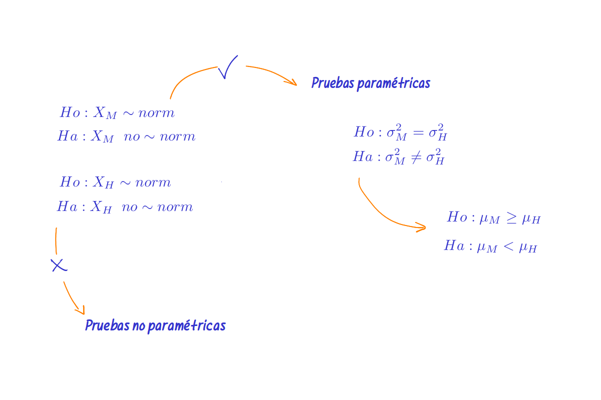

```{r setup, include=FALSE}
knitr::opts_chunk$set(echo = TRUE, message = FALSE, warning = FALSE, comment = NA)
library(paqueteMETODOS)
data("CarreraLuz22")
CarreraLuz22M = subset(CarreraLuz22, CarreraLuz22$sex=="Hombre")
CarreraLuz22F = subset(CarreraLuz22, CarreraLuz22$sex=="Mujer")
CarreraLuz22F3 = subset(CarreraLuz22F, CarreraLuz22F$categoria=="3. Veteranos A")
w =c(58.36667,  65.25000,  75.95000,  81.15000,  55.28333,  60.51667, 65.66667,  83.05000,  91.98333,  78.11667,  57.80000,  55.35000,  64.28333,  83.01667,  63.90000,  50.16667,  70.90000,  87.15000, 62.36667,  73.30000,  62.98333,  62.46667,  56.73333,  76.48333,      78.78333,  87.95000,  60.91667,  74.13333,  71.11667,  65.55000, 52.20000,  60.61667,  78.76667,  70.83333,  79.16667,  68.50000,
     64.93333,  84.76667,  82.86667,  72.73333,  66.78333,  66.35000, 92.98333,  96.11667,  61.53333,  62.28333, 74.60000,  75.90000, 88.98333,  70.16667,  72.61667,  71.33333,  66.30000,  60.40000, 62.03333,  83.95000,  63.50000,  69.95000,  72.51667,  78.93333, 63.95000,  81.41667,  63.36667,  80.40000,  71.58333,  56.01667, 57.33333,  89.55000,  63.85000,  87.48333, 101.46667,  71.70000, 60.08333,  48.36667,  89.03333,  65.30000,  55.96667,  86.45000, 72.91667,  75.91667,  56.10000,  69.75000,  76.20000,  60.40000, 53.21667,  75.33333,  84.05000,  78.26667,  59.28333,  67.50000, 62.03333,  66.46667,  62.58333,  73.38333,  65.15000,  74.68333, 58.88333,  70.16667,  55.05000,  68.46667)


xF1=c(52.20000, 78.93333, 65.48333, 73.26667, 63.93333, 70.10000, 55.66667, 84.10000, 73.28333, 71.71667, 58.38333, 73.38333, 56.06667, 70.16667, 66.40000, 65.05000, 68.50000, 77.46667, 72.18333, 78.15000, 67.50000, 93.48333, 59.28333, 59.05000, 79.05000, 63.01667,74.16667, 55.05000, 75.26667, 77.53333, 73.86667, 63.70000, 69.75000, 70.83333, 70.28333, 56.48333, 53.65000, 80.78333, 93.71667,73.95000, 70.70000, 45.80000, 58.36667, 81.48333, 59.00000, 68.75000, 42.08333, 66.18333, 63.36667, 74.60000, 76.36667, 70.88333,81.91667, 81.83333, 60.30000, 48.36667, 66.31667, 70.48333, 74.18333, 65.50000, 87.41667, 92.98333, 80.05000, 72.61667, 75.91667,90.71667, 62.33333, 82.55000, 75.90000, 65.65000, 60.86667, 62.03333, 62.61667, 68.53333, 89.03333, 58.25000, 59.85000, 85.11667,68.03333, 78.01667, 57.21667, 66.86667, 93.30000, 65.95000, 61.03333, 66.06667, 86.50000, 82.91667, 47.68333, 73.90000, 62.36667, 90.08333, 62.76667, 77.61667, 62.28333, 68.25000, 65.86667, 81.10000, 82.23333, 84.33333)

xM1=c(36.88333, 69.16667, 78.15000, 69.55000, 69.88333, 77.91667, 50.75000, 62.18333, 70.58333, 55.36667, 44.35000, 51.85000, 68.23333, 83.36667, 55.30000, 74.30000, 54.60000, 57.41667, 84.25000, 75.81667, 58.81667, 81.76667, 67.68333, 44.20000, 68.36667, 57.06667, 82.36667, 67.18333, 58.36667, 81.23333, 52.75000, 41.00000, 53.08333, 55.08333, 52.91667, 62.48333, 61.11667, 58.03333, 39.30000, 61.01667, 60.73333, 66.88333, 63.66667, 66.65000, 69.30000, 68.66667, 63.50000, 49.46667, 76.10000, 52.98333, 79.23333, 62.86667, 47.96667, 56.48333, 68.13333, 53.31667, 60.48333, 64.31667, 69.11667, 65.40000, 51.03333, 64.38333, 70.21667, 60.73333, 65.96667, 58.18333, 70.71667, 60.20000, 67.33333, 47.26667, 83.35000, 52.66667, 53.90000, 62.38333, 77.25000, 57.90000, 47.98333, 75.58333, 58.31667, 66.18333, 60.41667, 58.50000, 49.65000, 49.63333, 56.70000, 67.18333, 71.85000, 69.01667, 83.61667, 60.41667, 78.86667, 69.51667, 64.90000, 73.71667, 49.01667, 98.76667, 79.93333, 55.00000, 73.55000, 57.35000)


xMa =c(86.13333,  71.50000,  55.60000,  80.51667,  55.83333, 103.03333,  48.88333,  72.68333,  57.66667,  52.40000, 71.18333,  79.40000,  72.76667,  56.43333,  60.78333,  49.70000,  51.30000,  61.90000,  39.10000,  48.21667, 57.33333,  57.20000,  44.13333,  53.15000,  68.80000,  61.26667,  50.30000,  51.46667,  59.58333,  61.83333, 72.63333,  81.91667,  66.56667,  47.96667,  48.65000,  55.71667,  34.71667,  61.05000,  53.78333,  84.25000, 53.68333,  77.31667,  59.76667,  75.58333,  50.35000,  64.66667,  79.86667,  85.78333,  68.36667,  75.10000, 42.76667,  82.83333,  58.18333,  89.81667,  66.23333,  59.33333,  64.63333,  69.01667,  69.86667,  64.60000, 61.01667,  43.21667,  41.86667,  54.50000,  67.70000,  68.83333,  62.38333,  66.13333,  79.80000,  59.55000, 44.28333,  61.40000,  86.18333,  53.78333,  62.48333,  59.85000,  89.58333,  62.30000,  77.15000,  57.03333, 76.98333,  56.10000,  57.88333,  77.40000,  66.48333,  53.70000,  47.96667,  55.21667,  62.01667,  46.78333, 58.16667,  62.88333,  48.00000,  39.38333,  51.00000,  69.05000,  61.13333,  60.63333,  58.26667,  63.05000)

xMd=c(
76.18333, 47.88333, 74.18333, 74.55000, 58.11667, 53.51667, 70.56667, 57.95000, 78.63333, 62.48333, 77.51667,69.73333, 66.73333, 98.83333, 38.36667, 76.88333, 53.91667, 60.11667, 77.40000, 57.56667, 75.95000, 70.16667, 53.20000, 58.03333, 60.48333, 59.41667, 45.85000, 72.51667, 63.05000, 47.61667, 46.93333, 74.30000, 57.33333, 79.80000, 55.45000, 56.08333, 63.76667, 65.11667, 50.35000, 61.60000, 61.28333, 43.21667, 51.93333, 56.63333, 46.30000, 71.85000, 82.13333, 68.85000, 76.98333, 59.76667, 61.15000, 56.03333, 52.88333, 53.01667, 55.58333, 69.05000, 71.15000, 63.05000, 56.93333, 57.00000, 56.63333, 50.81667, 76.66667, 54.05000, 79.50000, 46.10000, 81.06667, 63.80000, 63.05000, 61.78333, 33.13333, 49.76667, 73.71667, 60.00000, 60.73333, 61.85000, 64.40000, 52.75000, 65.91667, 47.98333, 51.15000, 59.68333, 50.30000, 44.85000, 71.05000, 56.26667, 56.41667, 82.36667, 71.53333, 65.05000, 48.00000, 62.88333, 56.03333, 51.81667, 53.16667, 45.25000, 42.16667, 53.76667, 61.01667, 52.26667)

```

<br/><br/>


## <span style="color:#034a94">**Para una media**</span>


Podemos estar interesado en uno de los tres casos siguientes

|                                 |                              |                                  |
|:--------------------------------|:-----------------------------|:---------------------------------|
|$Ho$ : $\mu = \mu_o$             |$Ho$ : $\mu \leq \mu_o$       |  $Ho$ : $\mu \geq \mu_o$         |
|$Ha$ : $\mu \neq \mu_o$          |$Ha$ : $\mu > \mu_o$          |$Ha$ : $\mu < \mu_o$              |


Además se presentan tres alternativas para el estadístico de prueba:

* Prueba Z, con varianza conocida y X con distribución normal.
* Prueba t, con varianza desconocida y X con distribución normal.
* Prueba Z, con distribución de X desconocida y n lo suficientemente grande para garantizar distribución normal de la media a través del teorema del límite central.

<br/>

## <span style="color:#034a94">**Para una media con varianza conocida**</span>

Supuestos:

|                                 |
|:--------------------------------|
| X \sim normal                   |
| Varianza conocida ($\sigma^{2}=4$)|

<br/>

```{r}
BSDA::z.test(w, mu=60, sigma.x = 125)

```
<br/>

## <span style="color:#034a94">**Para una media**</span>

<br/>

Supuestos:

|                                 |
|:--------------------------------|
| X \sim normal                   |
| Varianza desconocida            |

<br/>

|                                 | 
|:--------------------------------|
| $Ho$ : $\mu \geq 70$            |
| $Ha$ : $\mu < 70$               |

<br/>


```{r}
#-------------------------------------------------------------------------------
# Problema 2
t.test(w,mu=70, alternative="less")
```

<br/><br/>

## <span style="color:#034a94">**Para una proporción**</span>

En este caso suponemos que $n$ es grande 

|                                 | 
|:--------------------------------|
| $Ho$ : $p_{_{M}} \leq 0.50$            |
| $Ha$ : $p_{_{M}} > 0.50$               |

<br/>

```{r}
#-------------------------------------------------------------------------------
t1=table(CarreraLuz22$sex)

prop.test(t1[1],length(CarreraLuz22$sex),0.50,alternative="greater")
```
El resultado indica que la mayoría de los participantes son hombres

<br/><br/>

## <span style="color:#034a94">**Para la comparación de medias en grupos independientes**</span>

Previamente a realizar la comparación de medias se deben realizar las pruebas de normalidad para cada una de las variables, en caso de asumir que las variables tienen distribución normal, se procede a comparar las varianzas de los dos grupos  y dependiendo el resultado obtenido se procede a realizar la comparación de medias. en caso de no obtener normalidad o de que las variables procedan de mediciones a través de test en escalas de intercalo (caso de mediciones de clima laboral, nivel de estrés, percepciones, entre otros) o de poseer pocos datos se recomienda emplear métodos no paramétricos.


<center>
```{r, echo=FALSE, out.width="100%", fig.align = "center"}

```

**Figura 4.47**  Secuencia para la realización de una prueba de comparación de medias, grupos independientes
</center>

<!-- |                                           |  -->
<!-- |:------------------------------------------| -->
<!-- | $Ho$ : $X_{_{M}} \sim normal$             | -->
<!-- | $Ha$ : $X_{_{M}} \sim \text{ No } normal$ | -->
<!-- | $Ho$ : $X_{_{F}} \sim normal$             | -->
<!-- | $Ha$ : $X_{_{F}} \sim \text{ No } normal$ | -->
<!-- | $Ho$ : $\sigma^{2}_{_{M}} = \sigma^{2}_{_{F}}$    | -->
<!-- | $Ha$ : $\sigma^{2}_{_{M}}  \neq \sigma^{2}_{_{F}}$| -->
<!-- | $Ho$ : $\mu_{_{M}} \geq \mu_{_{F}}$       | -->
<!-- | $Ha$ : $\mu_{_{M}} < \mu_{_{F}}$          | -->

<br/>

```{r}

# xM1=sample(CarreraLuz22M$timerun/60, 100)
# xF1=sample(CarreraLuz22F$timerun/60, 100)

shapiro.test(xM1) # validación de normalidad tiempo hombre
shapiro.test(xF1) # validación de normalidad tiempo mujeres  
var.test(xM1,xF1) # comparación de varianzas 
t.test(xM1, xF1, alternative = "less")  # comparación de medias
```
Los resultado indican :

* Las dos variables tienen una distribución aproximadamente normal
* Se asume que las varianza son iguales
* La media del tiempo empleado por los hombre es menor que la media empleada por la mujeres

<br/><br/><br/>


## <span style="color:#034a94">**Para comparación de proporciones**</span>

```{r}
#---------------------------------------------------------------------------------
t1=table(CarreraLuz22M$categoria)
t2=table(CarreraLuz22F$categoria)

prop.test(c(t1[2], t2[2]),c(sum(t1), sum(t2)) )
```
El resultado indica que existen diferencias entre las proporciones de hombre y mujeres en la categoría abierta

<br/><br/>


## <span style="color:#034a94">**Comparación de medias grupos pareados**</span>

Ahora supongamos que un grupo de atletas corrió tambien en el 2021 ($xMa$) y repitió su participación en el 2022 ($xMd$), se desea determinar si se presentaron mejoras o no en el rendimiento del grupo


|                                                          | 
|:---------------------------------------------------------|
| $Ho$ : $\mu_{_{M_{antes}}} = \mu_{_{M_{despues}}}$       |
| $Ho$ : $\mu_{_{M_{antes}}} \neq \mu_{_{M_{despues}}}$    |

<br/>


```{r}
#-----------------------------------------------------------------------------------
t.test(xMa,xMd,paired = TRUE)
```

Los resultados indican que los promedios se suponen iguales


## <span style="color:#686868">**Resumen**</span>

|                   |                                                          |
|:------------------|:---------------------------------------------------------|
|                   |**Pruebas paramétricas**                                  |
|Entrada de datos   |                                                          |
|                   |`x1=c(7, 13, 6, 5, 5, 10, 8, 6, 7)`                       |
|                   |`x2=c(3,7,2,3,6,2,1,0,2)`                                 |  
|Una población      |                                                          |
||`z.test(datos,mu=10,stdev=4, conf.level=0.98)`                               |
||`t.test(datos, mu=10,conf.level=0.98)`                                       |
||`t.test(datos, mu=10,conf.level=0.98,alternative="greater")`                 |
||`t.test(datos, mu=10,conf.level=0.98,alternative="less)`                     |
||`prop.test(x=22,n=100, p=0.20, conf.level=0.98)`                             |
|Dos poblaciones    |                                                          |
|                   |`t.test(x1,x2,  paired=TRUE)`                             |    
|                   |`t.test(x1,x2,  paired=FALSE, var.equal=TRUE, conf.level=0.95)` |
|                   |`t.test(x1,x2,  paired=FALSE, var.equal=FALSE, conf.level=0.98)`|
|                   |`var.test(x,y)`                                           |
|                   |`prop.test(c(x1,x2), c(n1,n2))`                           |


<br/><br/><br/>
